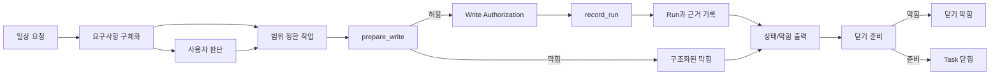

# Build: Runtime Walkthrough

## 이 문서로 할 수 있는 일

사용자 요청에서 close outcome까지 Harness work item 하나가 어떻게 지나가는지, 모든 엄격한 contract를 먼저 읽지 않고 따라갈 수 있게 합니다.

이 문서는 Build 문서입니다. Implementer와 reviewer를 위해 runtime path를 요약하지만, 문서 수락과 별도의 구현 계획 준비 결정 전에는 runtime/server 구현, 생성된 운영 파일, 실행 가능한 fixture 파일, 런타임 데이터, 새 schema를 만들라는 뜻이 아닙니다. 첫 실행 목표는 v0.1 Core Authority Smoke이며, 커널 스모크(Kernel Smoke)는 좁은 future smoke-check 작성 label입니다. 첫 사용자 가치 목표는 v0.2 First User-Value Slice입니다. 에이전시 보증 팩(v0.3 Agency Assurance Pack)과 운영과 인계 팩(v0.4 Operations & Handoff Pack)은 agency assurance, operations, handoff 동작을 단단하게 만들고, v1+ Expansion은 owner 문서가 승격하고 증명하기 전까지 roadmap 범위에 남습니다.

## 읽는 경우

- Reference 계약에 들어가기 전에 runtime 관점의 개념 지도가 필요할 때.
- 요구사항이 어떻게 scoped work가 되는지 확인할 때.
- state, artifact, projection, 닫기 막힘의 차이를 설명해야 할 때.
- v0.1 Core Authority Smoke path를 v0.2 First User-Value Slice로 키우지 않고 리뷰할 때.

## 먼저 읽을 것

구현 맥락은 [구현 개요](implementation-overview.md)와 [첫 실행 가능한 조각](first-runnable-slice.md)을 읽습니다. 정확한 동작은 [커널 참조](../reference/kernel.md), [런타임 아키텍처 참조](../reference/runtime-architecture.md), [문서 Projection 참조](../reference/document-projection.md), [MCP API와 스키마](../reference/mcp-api-and-schemas.md), [Storage와 DDL](../reference/storage-and-ddl.md), [운영과 Conformance](../reference/operations-and-conformance.md)를 사용합니다.

## 핵심 생각

쓰기 가능한 tracked work에서는 Harness가 Task와 초기 scope를 알고, stage가 요구하는 요구사항 구체화나 user-owned judgment가 기록된 뒤에야 요청이 안전한 제품 작업이 됩니다. 제품 파일 쓰기는 그다음 `prepare_write`를 통과해야 하며, 이때 한 번만 쓸 수 있는 Write Authorization이 만들어질 수 있습니다. Run은 그 권한을 소비하고, evidence와 artifact는 주장을 뒷받침하며, status/blocker 출력은 현재 상태를 사람이 읽을 수 있게 만듭니다. 이후 단계의 user-value, assurance, projection, close path는 해당 stage가 범위에 있을 때만 blocker를 설명하거나 Task를 닫을 수 있습니다.

이 walkthrough는 staged reader path를 보여 줍니다. v0.1 Core Authority Smoke의 설계 목표는 그중 가장 작은 내부 부분만 다룹니다. 즉 local project registration 하나, active Task 하나, Reference 계약이 요구하는 경우에만 Change Unit owner shape로 표현되는 scoped boundary 하나, `prepare_write` authority path 하나, 한 번만 쓰는 Write Authorization 하나, 기록된 Run 하나, artifact/evidence ref 하나, structured status/blocker 응답 하나입니다. v0.1은 natural-language intake, full Discovery, full Decision Packet, full Evidence Manifest, Eval, Manual QA, Acceptance, residual-risk acceptance, full close semantics, projection rendering, conformance runner, recover/export, operations suite, dashboards, connectors, detached verification을 요구하지 않습니다. v0.2 First User-Value Slice는 ordinary-language start/resume, work-shape classification, scope/non-goals/success criteria summary, minimal user judgment request/record, small direct work와 tracked work의 구분, status/next output, evidence summary, 닫기 막힘 요약, residual-risk visibility, 민감 동작 승인 / 작업 수락 / 잔여 위험 수용의 분리 표시, Core-derived 간결한 상태 카드(compact status card)를 추가합니다.

## 한눈에 보는 walkthrough

Walkthrough 요약: 이 계획 도식은 의도한 request-to-close path 하나를 따라가는 독자용 지도입니다. 두 번째 source of truth도 아니고 구현된 runtime의 증거도 아닙니다.

눈여겨볼 점은 이 도식이 reader path이며 두 번째 source of truth나 v0.1 requirement list가 아니라는 것입니다. 요구사항 구체화와 projection-like output은 stage가 범위에 있을 때 work를 구체화하거나 읽는 데 도움을 주지만, 쓰기 권한은 `prepare_write`, 실행 기록은 `record_run`, 완료 막힘은 close/status owner path가 담당합니다. v0.1에서 readable output은 status/blocker 출력만으로 충분합니다. v0.2의 close-facing output은 full later assurance close model이 아니라 닫기 막힘 요약과 간결한 상태 카드(compact status card)입니다. 정확한 state와 gate behavior는 [커널 참조](../reference/kernel.md)에 있고, public call은 [MCP API와 스키마](../reference/mcp-api-and-schemas.md)에 있습니다.

## 단계별 runtime path

### 1. Request -> Task

사용자는 평소 말로 원하는 일을 설명합니다. v0.2 이후에는 tracking이 유용할 때 Harness intake가 작업 형태를 분류하고 Task 상태를 만들거나 갱신합니다. v0.1은 natural-language intake 대신 owner-valid seed/setup path를 사용할 수 있습니다.

엄격한 동작: Task lifecycle, mode, state transition은 [커널 참조](../reference/kernel.md#lifecycle-and-transitions)가 담당합니다. Storage layout은 [Storage와 DDL](../reference/storage-and-ddl.md)이 담당합니다.

### 2. Task -> 요구사항 구체화

요구사항 구체화(내부 이름 Discovery)는 v0.2 이후 동작이며 v0.1 requirement가 아닙니다. 요청이 모호하거나, 위험하거나, 여러 단계이거나, 제품 표면에 닿거나, 사용자 소유 판단이 필요할 가능성이 있을 때 사용합니다. 이 구체화는 goal, user value, non-goals, success criteria, 확인 가능한 사실, assumption, technical/product choice, security/privacy concern, QA expectation, 남은 불확실성, scope boundary를 정리합니다.

엄격한 동작: 요구사항 구체화(Discovery)는 shaping input입니다. Approval, Write Authorization, evidence, verification, QA, 작업 수락, 잔여 위험을 받아들이는 판단, close, scope authority, 새 authority path가 아닙니다. Judgment routing은 [Decision Packet](../reference/kernel.md#decision-packet)과 [MCP API와 스키마](../reference/mcp-api-and-schemas.md#harnessrequest_user_judgment)의 public judgment call이 담당합니다.

### 3. 요구사항 구체화 -> 안전한 다음 작업 -> Change Unit

요구사항 구체화는 에이전트가 확인할 수 있는 사실과 사용자 소유 판단을 분리하고 남은 불확실성을 추적한 뒤, 목표, 비목표, 수용 기준, 중요한 판단 후보가 충분히 분명해졌을 때 안전한 다음 작업, 더 작은 범위, 또는 작업 분할을 제안합니다. 제품 쓰기가 가까워지면 그 제안이 Change Unit candidate가 될 수 있습니다. Active Change Unit은 무엇이 바뀔 수 있는지, 무엇이 범위 밖인지, agent가 그 scope 안에서 어떤 판단을 직접 할 수 있는지를 이름 붙입니다.

이런 제안 표현은 standalone schema field, canonical record type, gate value, projection kind, authority path가 아닙니다.

엄격한 동작: Change Unit과 Autonomy Boundary 의미는 [커널 참조의 Change Unit](../reference/kernel.md#change-unit)과 [Autonomy Boundary](../reference/kernel.md#autonomy-boundary)가 담당합니다. Change Unit은 work를 scope하지만, 그 자체로 write를 authorize하지 않습니다.

### 4. Change Unit -> `prepare_write`

제품 파일을 쓰기 전에 agent는 intended operation에 대한 쓰기 권한을 Core에 요청합니다. Core는 현재 상태, Change Unit scope, 범위에 들어온 Autonomy Boundary, 그리고 active stage가 요구하는 baseline freshness, sensitive-action Approval, Decision Packets, 적용되는 design policy, surface capability 같은 조건을 확인합니다. v0.1은 Core Authority Smoke에 필요한 scope/write-authority check만 요구합니다.

엄격한 동작: `prepare_write`는 [커널 참조](../reference/kernel.md#prepare_write)가 담당합니다. Public request/response shape는 [`harness.prepare_write`](../reference/mcp-api-and-schemas.md#harnessprepare_write)가 담당합니다.

### 5. `prepare_write` -> Write Authorization 또는 blocker

확인이 통과하면 Core는 specific attempt 하나에 맞는 Write Authorization을 만들거나 반환합니다. 통과하지 못하면 response는 blocker, state conflict, sensitive-action Approval path, Decision Packet path로 이어집니다.

엄격한 동작: Write Authorization 의미는 [Write Authorization](../reference/kernel.md#write-authorization)이 담당합니다. Approval과 Decision Packet의 non-substitution rule은 [판단 경로 경계](../reference/kernel.md#판단-경로-경계)가 담당합니다.

### 6. Write Authorization -> Run

Implementation 또는 direct write가 일어난 뒤 `record_run`이 실제로 일어난 일을 기록합니다. Product-write Run은 compatible, unexpired, unconsumed Write Authorization 하나를 consume합니다. 범위 밖 observation은 prose로 정상화되지 않으며 repair, recovery, blocker handling으로 라우팅됩니다.

엄격한 동작: Run recording과 authorization consumption은 [record_run](../reference/kernel.md#record_run)이 담당합니다. Guarantee level behavior는 [런타임 아키텍처 참조](../reference/runtime-architecture.md#보장-수준-동작-지도)에 요약되어 있습니다.

### 7. Run -> Evidence와 artifact

Evidence는 completion claim 또는 success criteria를 supporting owner records와 등록된 artifact ref에 매핑합니다. v0.1은 artifact/evidence ref 하나와 owner link 하나만 필요합니다. v0.2는 evidence summary가 필요합니다. Full Evidence Manifest behavior는 later-profile scope입니다. Raw artifact는 지속적으로 보관할 evidence bytes를 담고, artifact record와 ref는 identity, integrity, redaction, retention, owner relation을 담습니다.

엄격한 동작: evidence와 gate 의미는 [Evidence Manifest](../reference/kernel.md#evidence-manifest), [Evidence Gate](../reference/kernel.md#evidence-gate), [Artifact](../reference/kernel.md#artifact)가 담당합니다. Artifact storage와 DDL detail은 [Storage와 DDL](../reference/storage-and-ddl.md)이 담당합니다.

### 8. Evidence -> status/blocker output 또는 projection

Minimal path는 state record와 artifact ref에서 상태/막힘 출력을 직접 반환할 수 있습니다. 이후 profile은 그 기록에서 읽기용 Markdown과 카드를 렌더링할 수 있습니다. 읽기용 요약(Projection)의 최신성은 읽기용 보기가 최신인지 판단하는 데 도움을 주지만, Markdown이 상태 또는 근거 권한이 되지는 않습니다.

엄격한 동작: projection authority, managed block, human-editable section, freshness rule은 [문서 Projection 참조](../reference/document-projection.md)가 담당합니다. Rendered template body는 [Template 참조](../reference/templates/README.md)에 있습니다.

### 9. Status/blocker output 또는 projection -> 닫기 막힘 또는 close

완료에 가까워지면 해당 stage가 범위에 있을 때 `close_task`가 close-relevant 상태를 확인하고 Task를 닫거나 structured blocker를 반환합니다. v0.1은 narrow close/status blocker smoke만 사용할 수 있으며 full close semantics를 증명하지 않습니다. v0.2는 닫기 막힘 요약이 필요하지만 detached verification을 기본으로 요구하지 않습니다. Verification은 active profile, 사용자 요청, task type, risk profile이 요구할 때만 필요합니다. Verification waiver는 요구된 verification을 의도적으로 건너뛸 때만 필요합니다. Close Readiness는 그런 blocker를 사용자가 볼 수 있게 요약한 것이지 새 gate가 아닙니다.

엄격한 동작: completion check는 [`close_task`](../reference/kernel.md#close_task)가, close result wording은 [Close result semantics](../reference/kernel.md#close-result-semantics)가, public error precedence는 [MCP API와 스키마](../reference/mcp-api-and-schemas.md#primary-error-code-precedence)가 담당합니다.

## 첫 구현 경계

v0.1 Core Authority Smoke에서는 path를 좁게 유지합니다. 하나의 local project registration, 하나의 active Task, 하나의 scoped boundary, `prepare_write`, `record_run`이 소비하는 single-use Write Authorization 하나, artifact/evidence ref 하나, structured status/blocker 출력이 범위입니다. Projection-like output은 status/blocker 출력으로 취급하고 full projection support를 요구하지 않습니다.

v0.2 First User-Value Slice에서는 사용자가 볼 수 있는 가치 경로를 추가합니다. 즉 ordinary-language start/resume, work-shape classification, scope/non-goals/success criteria summary, product/UX judgment와 architecture judgment의 분리된 제시, minimal user judgment request/record, small direct change와 tracked work의 구분, status/next output, evidence summary, 닫기 막힘 요약, residual-risk visibility, Core-derived 간결한 상태 카드(compact status card), 민감 동작 승인 / 작업 수락 / 잔여 위험 수용의 분리 표시입니다.

Staged order와 커널 스모크(Kernel Smoke) boundary는 [단계별 전달 계획](mvp-plan.md)에 요약되어 있습니다. Exact fixture body shape와 assertion rule은 [Conformance Fixtures 참조](../reference/conformance-fixtures.md#conformance-fixture-format)에 둡니다.
