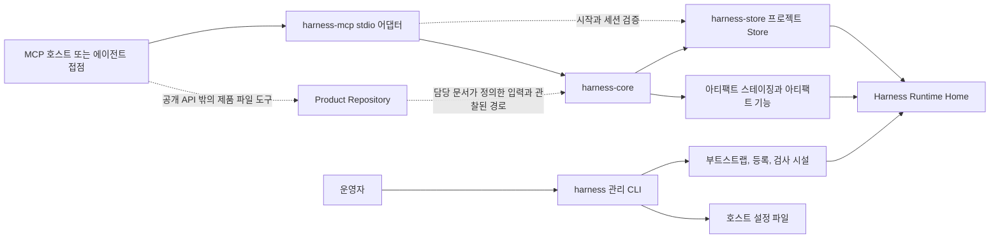
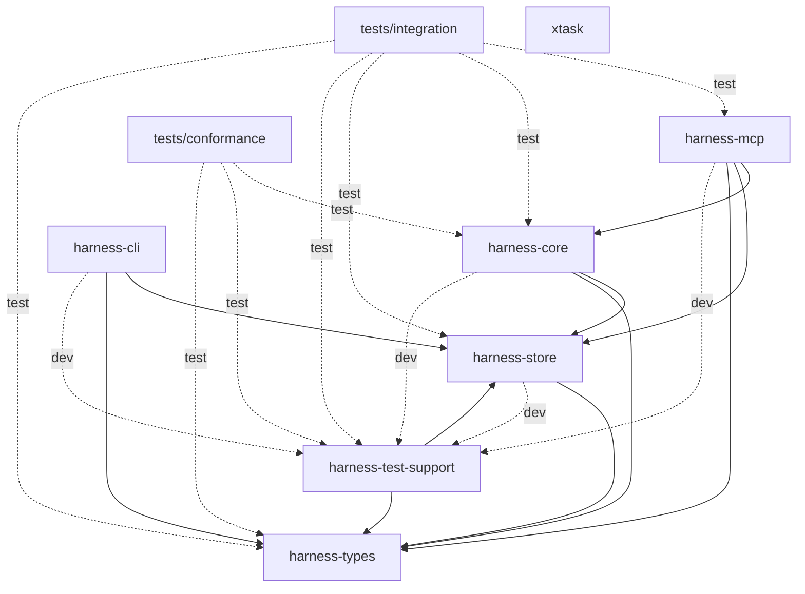
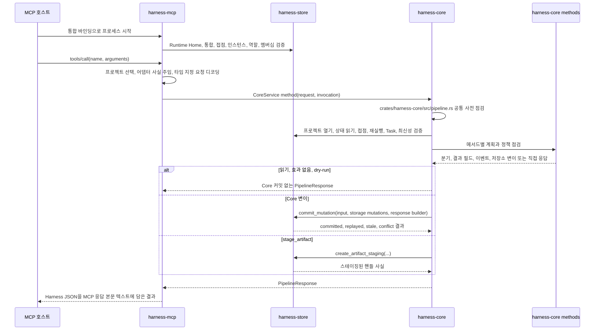

# 구현 아키텍처

이 가이드는 로컬 Rust 워크스페이스의 가이드 수준 구현 구조와 실행 흐름 설명을 담당합니다. 구현자가 코드를 찾고, 책임 경계를 이해하고, 코드 질문을 계약 담당 문서로 보낼 수 있게 돕습니다.

이 문서는 공개 API 동작, 요청 또는 응답 필드, 스키마 의미, 저장 효과, DDL이나 테이블 컬럼, 보안 보장, 런타임 집행, Core 권한 의미, 제품 계약을 정의하거나 덮어쓰지 않습니다. 소스 코드 학습 경로는 [개발자 문서](README.md) 진입점을 사용하고, 크레이트별 첫 파일과 심볼은 [코드베이스 둘러보기](codebase-tour.md)를, 대표 메서드 흐름은 [요청 생명주기](request-lifecycle.md)를, 반복 구현 구조는 [구현 설계 패턴](design-patterns.md)을, Store 커밋과 아티팩트 경계는 [저장소와 트랜잭션](storage-and-transactions.md)을, 테스트 계층 선택은 [테스트 전략](testing-strategy.md)을, 집중 결정 기록은 [아키텍처 결정](decisions/README.md)을, 변경 작업 흐름은 [구현 가이드](change-guide.md)를 사용합니다. 정확한 동작은 집중 참조 담당 문서를 사용합니다.

하네스는 AI 지원 제품 작업을 위한 로컬 작업 권한 제품이자 시스템입니다. Core는 하네스 상태를 위한 로컬 기준 기록입니다.

이 가이드에서 직접 열 수 있는 코드와 테스트 경로는 저장소 루트 기준으로 씁니다.

이 체크아웃은 `Harness Server` 소스 저장소입니다. 하네스를 위한 유지되는 서버 구현 집합이며, 구현 크레이트, `harness` 관리 CLI, `harness-mcp` 로컬 MCP 어댑터, 테스트, 문서, 검증 도구, 저장소 설정을 담습니다. `Harness Server` 설치는 배포된 실행 파일과 필요한 런타임 리소스의 부분집합이므로, 이 소스 지도는 설치 매니페스트처럼 읽으면 안 됩니다.

## 운영 경로

이 저장소의 `Harness Server` 구현에는 두 운영 경로가 있습니다.

- MCP 호스트 -> `harness-mcp` -> `harness-core` -> `Harness Runtime Home` 아래의 Store와 아티팩트 기능.
- 운영자 -> `harness` 관리 CLI -> 부트스트랩과 등록 시설 -> `Harness Runtime Home`과 호스트 설정 파일.

`harness-mcp`는 시작과 요청 라우팅 중에도 `harness-store`를 직접 사용합니다. 이 Store 사용은 공개 메서드를 Core로 디스패치하기 전에 Runtime Home, Agent Integration Profile 상태, 통합 프로젝트 멤버십, 프로젝트 사용 가능 여부, 접점, 접점 인스턴스, 역할, 로컬 접근 등록을 확인합니다. 공개 Harness 메서드 의미를 구현하는 다른 경로가 아니며, 공개 메서드 실행은 `harness-core`를 통과합니다.

`Product Repository`는 별도의 제품 파일 경계로 남습니다. 공개 Harness API는 담당 문서가 정의한 호환성, 관찰 사실, 아티팩트 링크를 기록합니다. 제품 파일 쓰기 자체는 공개 API 경로 밖에서 연결된 접점이나 로컬 도구가 수행합니다.

## 워크스페이스 형태

Cargo 워크스페이스는 아래 멤버로 구성됩니다.

| 워크스페이스 멤버 | Cargo 패키지 | 대상 | 가이드 수준 역할 |
|---|---|---|---|
| `crates/harness-types` | `harness-types` | 라이브러리 | 공유 Rust 요청, 응답, 스키마 형태, 값 집합, 식별자, 정규 해시 타입. |
| `crates/harness-store` | `harness-store` | 라이브러리 | SQLite, Runtime Home, 부트스트랩, 프로젝트 Store, 아티팩트 저장소, 마이그레이션, 검사, 저장소 오류 구현. |
| `crates/harness-core` | `harness-core` | 라이브러리 | Core 서비스, 공유 요청 파이프라인, 메서드 계획, 정책 점검, Store 조율. |
| `crates/harness-cli` | `harness-cli` | 라이브러리와 `harness` 바이너리 | Runtime Home 설정, 프로젝트 등록, 접점 등록, 로컬 MCP 설정, 호스트 설정 생성을 위한 로컬 관리 CLI. |
| `crates/harness-mcp` | `harness-mcp` | 라이브러리와 `harness-mcp` 바이너리 | MCP stdio 어댑터, 시작 검증, 도구 목록, `tools/call` 디스패치, Core 호출. |
| `crates/harness-test-support` | `harness-test-support` | 라이브러리 | 구현 테스트가 공유하는 폐기 가능한 Runtime Home, Store, Core, 픽스처 도우미. |
| `tests/conformance` | `harness-conformance-tests` | `baseline` 테스트 대상 | Core 쪽 API를 통해 담당 문서가 정의한 동작을 실행하는 기준 범위 교차 메서드 시나리오. |
| `tests/integration` | `harness-integration-tests` | `mcp_surface` 테스트 대상 | MCP, Core, Store, 접점 바인딩, 접근 경로를 가로지르는 검증. |
| `xtask` | `xtask` | 라이브러리와 `xtask` 바이너리 | 읽기 전용 문서 검증을 위한 저장소 유지보수 도구. Harness 런타임 아키텍처의 일부가 아닙니다. |

Cargo manifest에서 확인되는 내부 의존 방향은 아래와 같습니다.

| 멤버 | 일반 내부 의존성 | 테스트 전용 내부 의존성 |
|---|---|---|
| `harness-types` | 없음 | 없음 |
| `harness-store` | `harness-types` | `harness-test-support` |
| `harness-core` | `harness-store`, `harness-types` | `harness-test-support` |
| `harness-cli` | `harness-store`, `harness-types` | `test-support` 기능이 켜진 `harness-store`, `harness-test-support` |
| `harness-mcp` | `harness-core`, `harness-store`, `harness-types` | `harness-test-support` |
| `harness-test-support` | `harness-store`, `harness-types` | 없음 |
| `tests/conformance` | 없음. 이 패키지는 테스트 대상만 포함합니다. | `harness-core`, `harness-test-support`, `harness-types` |
| `tests/integration` | 없음. 이 패키지는 테스트 대상만 포함합니다. | `harness-core`, `harness-mcp`, `harness-store`, `harness-test-support`, `harness-types` |
| `xtask` | 없음 | 없음 |

오래 유지될 의존 경계는 아래와 같습니다.

- Core는 CLI나 MCP 어댑터 크레이트에 의존하지 않습니다.
- MCP는 서로 다른 책임을 위해 Core, Store, 공유 타입에 의존할 수 있습니다. 각각 전송과 디스패치, 통합 시작 검증, 요청 시점 프로젝트 라우팅, 타입 지정 요청 처리를 위한 의존입니다.
- 관리 CLI는 공개 Core 메서드를 호출하는 대신 Store와 공유 타입으로 로컬 설정과 등록을 수행합니다.
- Store는 공유 타입에 의존합니다.
- 테스트 지원 크레이트와 테스트 패키지는 폐기 가능한 픽스처와 계층 간 검증을 위해서만 구현 크레이트를 조합합니다.
- `xtask`는 내부 제품 크레이트에 의존하지 않습니다. 문서 도구 의존성은 유지보수 크레이트 안에 격리됩니다.

## 소스 모듈 지도

| 영역 | 주요 모듈 경로 | 오래 유지될 책임 |
|---|---|---|
| `crates/harness-types` | `crates/harness-types/src/methods.rs`, `crates/harness-types/src/schema.rs`, `crates/harness-types/src/values.rs`, `crates/harness-types/src/ids.rs`, `crates/harness-types/src/canonical.rs` | `methods.rs`는 타입 지정 공개 요청과 결과 모델, 메서드와 접근 등급 매핑을 담습니다. `schema.rs`는 공유 스키마 형태 Rust 데이터, 응답 분기, Core 상태 형태, 아티팩트와 판단 구조, 지속 보조 형태를 담습니다. `values.rs`는 문서화된 값 이름에 대응하는 제어 Rust enum과 상수를 담습니다. `ids.rs`는 불투명 식별자 래퍼와 오래 유지되는 ID 생성 도우미를 담습니다. `canonical.rs`는 결정적 정규 JSON 직렬화와 요청 해시를 담습니다. |
| `crates/harness-store` | `crates/harness-store/src/runtime_home.rs`, `crates/harness-store/src/bootstrap.rs`, `crates/harness-store/src/sqlite.rs`, `crates/harness-store/src/migrations.rs`, `crates/harness-store/src/core_pipeline.rs`, `crates/harness-store/src/artifacts.rs`, `crates/harness-store/src/inspection.rs`, `crates/harness-store/src/error.rs` | `runtime_home.rs`는 Runtime Home 경로를 해석합니다. `bootstrap.rs`는 Runtime Home 메타데이터를 초기화하고 프로젝트와 접점을 등록합니다. `sqlite.rs`는 registry/project SQLite 데이터베이스를 열고 검증합니다. `migrations.rs`는 기준 마이그레이션을 적용합니다. `core_pipeline.rs`는 `CoreProjectStore`, 읽기 도우미, 재실행 기록 행, 저장소 변이 타입, 원자적 Core 변이 커밋 경계를 제공합니다. `artifacts.rs`는 일시적 스테이징과 영구 아티팩트 본문 검증을 처리합니다. `inspection.rs`는 읽기 전용 설정 검사를 지원합니다. `error.rs`는 상위 계층에서 사용할 저장소 실패 분류를 제공합니다. |
| `crates/harness-core` | `crates/harness-core/src/pipeline.rs`, `crates/harness-core/src/methods/`, `crates/harness-core/src/policy/` | `pipeline.rs`는 공통 요청 사전 점검, 검증된 요청 맥락 준비, 효과 경로 선택, 응답 구성, 재실행 처리, Core 커밋 조율을 담당합니다. `methods/`는 메서드별 검증, 계획, 저장소 변이 목록, 이벤트 페이로드, dry-run 요약, 결과 필드를 담당합니다. `policy/`는 등록된 접점 접근, 재실행 맥락, Product Repository 경로 정규화, 쓰기 권한 부여 호환성, 증거 상태, 판단 관련성, 닫기 준비 상태 계산에 쓰는 재사용 Core 정책 도우미를 담당합니다. |
| `crates/harness-cli` | `crates/harness-cli/src/main.rs`, `crates/harness-cli/src/local_mcp_command.rs`, `crates/harness-cli/src/setup.rs`, `crates/harness-cli/src/wizard.rs`, `crates/harness-cli/src/host_config.rs`, `crates/harness-cli/src/registration.rs` | `main.rs`는 관리 명령과 바이너리 종료 동작을 디스패치합니다. `local_mcp_command.rs`는 `harness setup local-mcp` 파싱과 오케스트레이션, 사전 점검, 설정 대상 검사, 출력 렌더링, 설정 파일 쓰기를 맡습니다. `setup.rs`는 Runtime Home, 프로젝트, 접점 설정을 계획, 준비, 재검증, 적용합니다. `wizard.rs`는 같은 설정 경로 위의 대화형 프런트엔드입니다. `host_config.rs`는 호스트 중립 MCP 설정 JSON을 렌더링합니다. `registration.rs`는 결정적 역량 프로필과 로컬 접근 메타데이터를 만듭니다. |
| `crates/harness-mcp` | `crates/harness-mcp/src/main.rs`, `crates/harness-mcp/src/lib.rs` | `main.rs`는 stdio, `--check`, help, version 같은 명령 모드를 처리합니다. `lib.rs`는 MCP 도구 메타데이터, 통합 시작 검사, 요청 시점 프로젝트 라우팅, 어댑터 소유 `harness.list_projects` 유틸리티, 타입 지정 공개 `tools/call` 디코딩, 호출 맥락 파생, 초기화 instructions, JSON-RPC stdio 프레이밍, 응답 래핑을 담당합니다. |
| `crates/harness-test-support` | `crates/harness-test-support/src/lib.rs` | 테스트 패키지와 크레이트 테스트가 쓰는 폐기 가능한 Runtime Home 도우미, Core와 Store용 픽스처 설정, 공유 요청 빌더, 픽스처 전용 도우미를 제공합니다. |

이 모듈 설명은 구현 배치 지침입니다. 정확한 API 필드, 메서드 동작, 저장소 기록, 저장 효과, 보안 표현, Core 권한 의미는 참조 담당 문서에 둡니다.

## Core 파이프라인과 Store 경계

`crates/harness-core/src/pipeline.rs`, `crates/harness-core/src/methods/`, `crates/harness-core/src/policy/`, `crates/harness-store/src/core_pipeline.rs`는 서로 다른 일을 합니다.

| 컴포넌트 | 구현에서의 역할 |
|---|---|
| `crates/harness-core/src/pipeline.rs` | 공통 사전 점검을 실행하고, `VerifiedRequestContext`를 준비하며, 준비된 요청을 읽기, 효과 없음, dry-run, 커밋된 Core 경로로 보내고, 공통 응답 기반을 만듭니다. |
| `crates/harness-core/src/methods/` | 하나의 메서드에 대한 계획을 만듭니다. 검증 결과, dry-run 요약, 이벤트 페이로드, 결과 필드, `CoreStorageMutation` 목록을 정합니다. |
| `crates/harness-core/src/policy/` | 메서드 계획과 사전 점검이 사용하는 재사용 점검을 제공합니다. 등록된 접점 접근, 재실행 맥락, Product Repository 경로 정규화, 쓰기 권한 부여 호환성, 증거 상태, 판단 관련성, 닫기 준비 상태 계산이 여기에 속합니다. |
| `crates/harness-store/src/core_pipeline.rs` | 프로젝트 로컬 Store 접근, 읽기 도우미, 재실행 기록 행, 저장소 변이 적용, 원자적 `CoreProjectStore::commit_mutation` 트랜잭션을 담당합니다. |

메서드 모듈은 하나의 공개 메서드에 대해 무엇이 일어나야 하는지 결정합니다. 공유 Core 파이프라인은 공통 순서와 효과 경로를 결정합니다. Store 커밋은 선택된 저장소 변이를 원자적으로 적용하며, Store가 메서드 정책을 결정하지 않습니다.

## MCP와 Core 실행 흐름

구현 흐름은 아래와 같습니다.

1. `harness-mcp`는 `--integration <integration_id>`와 선택적 `HARNESS_HOME`에서 Runtime Home과 통합에 묶인 프로세스 맥락 하나를 해석합니다. 레거시 고정 프로젝트 환경 바인딩은 호환 경로로만 남습니다.
2. `McpIntegrationStartupInspection`은 Runtime Home 메타데이터, Agent Integration Profile 상태, 접점과 접점 인스턴스 바인딩, 역할, 프로젝트 멤버십 읽기 가능성, stdio 시작 전에 필요한 registry JSON을 검증합니다. 모든 호출에 쓸 프로젝트 하나를 시작 시점에 선택하지 않습니다.
3. stdio 루프는 줄 단위 JSON-RPC를 받아 `initialize`, `ping`, `tools/list`, `tools/call`을 디스패치합니다.
4. `tools/list`는 공개 Harness 메서드 도구 아홉 개와 어댑터 소유 `harness.list_projects` 유틸리티를 노출합니다. 공개 `tools/call`에 대해 어댑터는 원시 `envelope`를 읽고, 허용된 프로젝트를 결정적으로 선택하고, 그 프로젝트에서 통합 접점을 검증하고, 어댑터가 관리하는 프로젝트와 접점 사실을 주입한 뒤, `arguments`를 `harness-types`의 해당 타입 지정 요청으로 디코딩합니다.
5. `tools/call`은 선택된 프로젝트, 통합에 묶인 접점 인스턴스, 메서드에서 파생한 접근 등급으로 `InvocationContext`를 만든 뒤 Core로 디스패치합니다.
6. `McpAdapter::call_tool`은 해당 `CoreService` 메서드로 디스패치합니다.
7. 각 `CoreService` 메서드는 `MethodPolicy`를 고르고, 메서드별 계획 전에 공통 사전 점검을 호출합니다.
8. 공통 사전 점검은 요청 래퍼 형태를 검증하고, 어댑터 바인딩 불일치를 거부하고, 커밋 효과 요청 래퍼 요구사항을 검증하고, 정규 요청 해시를 계산하고, 프로젝트 Store를 열고, `project_state`를 읽고, 검증된 접점 맥락을 파생하고, 커밋 분기의 idempotency 재실행을 처리하고, 메서드 정책에 따라 Task를 해석하고, 적용되는 경우 `state_version` 최신성을 점검하고, 메서드 파생 접근 등급에 대한 등록 접근을 점검하고, 검증된 요청 맥락을 준비합니다.
9. 메서드 모듈은 메서드별 검증, 정책 평가, 계획 또는 결과 구성을 수행합니다.
10. 선택된 분기는 읽기 전용 결과, 지속 효과 없는 결과, dry-run 미리보기, Core 변이 커밋, 일시적 아티팩트 스테이징 결과 중 하나를 반환합니다.
11. Core는 `PipelineResponse`를 반환하고, MCP는 정확한 Harness 응답 JSON을 MCP `tools/call`의 `content` 텍스트로 래핑합니다.

이 흐름은 구현 지도입니다. 정확한 공개 메서드 계약, 오류 우선순위, 응답 스키마, 저장 효과는 집중 참조 담당 문서에 남습니다.

## 효과와 커밋 경계

| 효과 경로 | 구현 위치 | 가이드 수준 저장 결과 |
|---|---|---|
| 읽기 전용 결과 | `crates/harness-core/src/pipeline.rs`를 통한 `OwnerPipelineBranch::ReadOnly` | 현재 Store 읽기에서 결과를 만듭니다. Core 변이 커밋은 없습니다. |
| 지속 효과 없는 결과 | `crates/harness-core/src/pipeline.rs`를 통한 `OwnerPipelineBranch::NoEffectResult` | 차단된 닫기 결과처럼 Core 상태 변이 없이 메서드 결과를 반환합니다. |
| Dry-run 결과 | `crates/harness-core/src/pipeline.rs`를 통한 `OwnerPipelineBranch::DryRunPreview` | 지속 저장 효과 없이 미리보기 데이터를 반환합니다. |
| Core 변이 커밋 | `crates/harness-core/src/pipeline.rs`와 `CoreProjectStore::commit_mutation`을 통한 `OwnerPipelineBranch::CommitMutation` | 하나의 Store 트랜잭션 안에서 메서드가 제공한 `CoreStorageMutation` 값을 적용하고, 이벤트를 추가하고, idempotency가 있는 경우 재실행 응답을 저장하며, 적용되는 경우 프로젝트 상태를 전진시킵니다. |
| 일시적 아티팩트 스테이징 | `crates/harness-core/src/methods/stage_artifact.rs`와 `crates/harness-store/src/artifacts.rs`의 `CoreProjectStore::create_artifact_staging` | 일시적 스테이징 핸들 행과 안전한 스테이징 바이트를 만듭니다. 일반 Core 변이 커밋 경로를 따르지 않고, `project_state.state_version`을 증가시키지 않으며, `task_events`를 추가하지 않고, 재실행 기록 행을 만들지 않습니다. |

`CoreProjectStore::commit_mutation`은 일반 커밋된 Core 변이의 Store 트랜잭션 경계입니다. 자세한 커밋 순서, 재실행 처리, 상태 버전 관계, 아티팩트 스테이징 구분, 실패 경계는 [저장소와 트랜잭션](storage-and-transactions.md)에서 설명합니다. 테이블 레이아웃, DDL, 저장소 기록 세부사항, 메서드별 지속 효과, 아티팩트 생명주기 규칙은 저장소 참조 담당 문서가 담당합니다.

## 관리 CLI 설정 흐름

`harness setup local-mcp`는 로컬 관리 오케스트레이션으로 구현되며 공개 Core 메서드가 아닙니다.

1. `crates/harness-cli/src/main.rs`는 `harness setup local-mcp`를 `crates/harness-cli/src/local_mcp_command.rs`로 디스패치합니다.
2. `crates/harness-cli/src/local_mcp_command.rs`는 옵션을 파싱하고, Runtime Home을 해석하고, Product Repository 루트를 해석하고, 선택적 설정 디렉터리를 해석하며, `harness-mcp` 실행 파일을 찾습니다.
3. `crates/harness-cli/src/setup.rs`는 Runtime Home, registry, 프로젝트 기록, 프로젝트 상태, 접점을 검사해서 읽기 전용 `LocalMcpSetupPlan`을 만듭니다. 프로젝트 또는 접점 충돌도 이 단계에서 보고합니다.
4. 설정 대상 검사는 설정 쓰기 전에 대상 디렉터리와 파일을 검사합니다.
5. Dry-run은 계획, 예정된 사전 점검 항목, 생성될 호스트 설정 내용을 텍스트 또는 JSON으로 렌더링해서 반환합니다. 저장소 준비, 등록, 사전 점검 실행, 설정 파일 쓰기는 하지 않습니다.
6. dry-run이 아닌 설정은 저장소를 준비합니다. Runtime Home을 만들거나 검증하고, 기존 프로젝트를 재사용할 때 선택된 프로젝트 상태를 검증하거나 마이그레이션합니다.
7. 준비 뒤 명령은 계획을 다시 생성하고, 준비 전에 만든 계획과 비교해 준비 중 생긴 충돌을 잡습니다.
8. `apply_local_mcp_setup_plan`은 Runtime Home을 만들거나 재사용하고, 프로젝트를 등록하거나 재사용하고, 고정 `agent` 접점과 선택적 `user_interaction` 접점 등록을 만들거나 갱신합니다.
9. 구성된 각 바인딩에 대해 CLI는 생성된 환경 변수로 `harness-mcp --check`를 실행하고 결정적 사전 점검 보고서를 검증합니다.
10. `crates/harness-cli/src/host_config.rs`는 호스트 중립 MCP 설정 JSON을 렌더링하고, `crates/harness-cli/src/local_mcp_command.rs`는 대상 검증과 성공한 사전 점검 뒤에만 설정 파일을 씁니다.
11. 명령은 설정 상태, 수행 작업, 사전 점검 상태, 생성된 설정 정보를 담아 최종 텍스트 또는 JSON 출력을 렌더링합니다.

`crates/harness-cli/src/wizard.rs`는 같은 계획과 적용 경로 위에 놓인 대화형 프런트엔드입니다. 위저드는 입력, 충돌 승인, 설정 덮어쓰기 결정, 최종 승인을 모은 뒤 비대화형 설정 실행기를 호출합니다. 독립된 설정 엔진이 아닙니다.

## 결정 경로

아키텍처 개요는 워크스페이스와 실행 지도를 유지합니다. 집중 결정의 결과와
비목표는 결정 기록에 있습니다.

| 경계 | 집중 결정 |
|---|---|
| Core가 MCP와 CLI 어댑터에서 독립적임 | [Core와 어댑터 의존 경계](decisions/core-adapter-boundary.md) |
| 정상 커밋된 Store 변이 전 메서드 계획 | [원자적 변이 커밋 전 계획](decisions/plan-and-atomic-commit.md) |
| 런타임 데이터와 제품 파일 분리 | [Runtime Home과 Product Repository 분리](decisions/runtime-home-and-product-repository.md) |

다른 오래 유지될 경계는 위 흐름에 남아 있습니다. 관리 CLI 설정은 공개 Core
메서드 동작이 아니라 로컬 부트스트랩이고, MCP Store 사용은 시작과 세션
검증으로 제한되며, 아티팩트 스테이징은 정상 Core 변이 커밋과 분리되고,
테스트는 제품 계약을 소유하지 않고 담당 문서가 정의한 사실을 검증합니다.

## 테스트 구조

이 절은 테스트 위치를 지도처럼 보여 줍니다. 구체적인 변경에 맞는 테스트
계층을 고를 때는 [테스트 전략](testing-strategy.md)을 사용합니다.

| 테스트 영역 | 검증 역할 |
|---|---|
| 구현 모듈에 함께 있는 단위 테스트 | 로컬 도우미, 파싱, 직렬화, 마이그레이션, Store, 정책, 경계 동작을 테스트 대상 코드 가까이에서 확인합니다. |
| `crates/harness-core/src/methods/tests.rs` | `CoreService`를 통해 Core 메서드 계획, 공유 사전 점검 동작, 효과 분기, 재실행 동작, 스테이징 구분, 아티팩트 승격, 닫기 준비 상태 계산, 메서드 소유 저장소 변이 결과를 실행합니다. |
| `crates/harness-cli/tests/binary_admin.rs` | `harness` 바이너리로 관리 초기화, 등록, setup help와 사용 오류, dry-run 동작, 로컬 MCP 설정, 사전 점검 실패 처리, 설정 파일 안전성을 실행합니다. |
| `crates/harness-mcp/tests/binary_transport.rs` | `harness-mcp` 바이너리로 help/version, `--check`, stdio 프레이밍, 줄 단위 JSON-RPC, 재연결 동작, MCP 응답 래핑을 실행합니다. |
| `tests/integration/mcp_surface.rs` | MCP 접점 바인딩, 도구 스키마, 공개 메서드 노출, 메서드별 접근 파생, Core/MCP 일치, 세션 거부 사례, 재실행 맥락 바인딩, 계층 간 저장 효과를 검증합니다. |
| `tests/conformance/baseline.rs` | 공유 픽스처를 사용해 Core 쪽 API로 기준 범위 공개 동작 시나리오를 실행합니다. 재실행, 효과 없는 분기, 쓰기 권한 부여, 아티팩트 생명주기, 판단 경계, 닫기 준비 상태, 오류 처리 경로, 손상 처리 등이 포함됩니다. |
| `crates/harness-test-support` | 테스트 패키지와 크레이트 테스트를 위한 폐기 가능한 Runtime Home 픽스처, 프로젝트와 접점 등록 도우미, 요청 빌더, Store 도우미, 공유 검증 단언을 제공합니다. |

테스트는 담당 문서가 정의한 동작을 검증합니다. 테스트 픽스처, 검증 단언, 시나리오 이름이 제품 계약의 유일한 출처가 되면 안 됩니다.

## 코드에서 담당 문서로 가는 경로

| 구현 영역 | 첫 계약 담당 경로 |
|---|---|
| `crates/harness-core/src/methods/`의 공개 메서드 구현 | [API 메서드](../reference/api/methods.md), 그다음 연결된 메서드 담당 문서. |
| 공통 Core 파이프라인, 응답 분기, 요청 래퍼 처리, 요청 해시, 공개 오류 처리 경로 | [API 코어 스키마](../reference/api/schema-core.md), [API 오류 문서 묶음 색인](../reference/api/errors.md), 지속 효과가 있을 때는 [저장 효과](../reference/storage-effects.md). |
| 사용자 소유 판단, 쓰기 권한 부여, 증거, 닫기 준비 상태, 권한 경계를 다루는 Core 정책 | [Core 모델](../reference/core-model.md), 메서드 담당 문서, [에이전트 통합](../reference/agent-integration.md), 적용되는 경우 [API 값 집합](../reference/api/schema-value-sets.md). |
| Product Repository 경로 정규화와 제품/런타임 위치 분리 | [런타임 경계](../reference/runtime-boundaries.md). |
| `crates/harness-types/src/`의 공유 Rust 타입과 스키마 형태 데이터 | [API 코어 스키마](../reference/api/schema-core.md), [API 상태 스키마](../reference/api/schema-state.md), [API 아티팩트 스키마](../reference/api/schema-artifacts.md), [API 판단 스키마](../reference/api/schema-judgment.md), [API 값 집합](../reference/api/schema-value-sets.md). |
| 원자적 Store 커밋, 재실행 기록 행, 잠금/버전 관리, 저장소 기록, DDL | [저장소](../reference/storage.md), [저장 효과](../reference/storage-effects.md), [저장소 기록](../reference/storage-records.md), [저장소 DDL](../reference/storage-ddl.md), [저장소 버전 관리](../reference/storage-versioning.md). |
| 아티팩트 스테이징과 영구 아티팩트 본문 검증 | [아티팩트 저장소](../reference/storage-artifacts.md), 그리고 해당 아티팩트를 참조하는 메서드 담당 문서. |
| MCP 시작, 프로세스 바인딩, stdio 프레이밍, `tools/call` 래핑 | [MCP 전송](../reference/mcp-transport.md), 검증된 접점 맥락은 [에이전트 통합](../reference/agent-integration.md). |
| 관리 CLI 설정과 로컬 등록 | [관리 CLI](../reference/admin-cli.md), 인접한 위치와 프로세스 동작은 [런타임 경계](../reference/runtime-boundaries.md)와 [MCP 전송](../reference/mcp-transport.md). |

이 페이지는 코드 읽기 방향을 잡고 구현 경계를 보존할 때 사용합니다. 동작을 결정할 때는 집중 담당 문서를 사용합니다.
