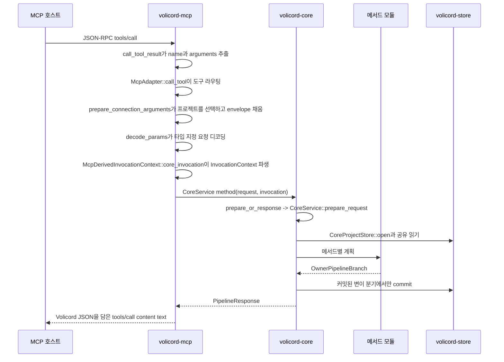

# 요청 생명주기

이 가이드는 현재 Rust 구현에서 세 가지 대표 공개 메서드 호출을 따라갑니다.

- 읽기 전용 경로인 `volicord.status`
- 커밋된 상태 변이 경로인 `volicord.intake`
- 정책과 `Write Check`에 민감한 경로인 `volicord.prepare_write`

개발자가 코드를 따라갈 수 있도록 소스 파일과 심볼을 이름으로 가리킵니다.
정확한 공개 메서드 동작, 요청이나 응답 스키마, 저장 효과, 보안 보장,
런타임 경계, 오류 의미, Core 권한 의미는 정의하지 않습니다. 정확한 동작은
각 절에 연결된 참조 담당 문서가 담당합니다.

## MCP에서 Core까지의 공통 형태

공유 어댑터 경로는
[`crates/volicord-mcp/src/lib.rs`](../../../crates/volicord-mcp/src/lib.rs)에
있습니다.

- `run_stdio`는 줄 단위 JSON-RPC를 읽습니다.
- `handle_json_rpc_request`는 `initialize`, `ping`, `tools/list`,
  `tools/call`을 디스패치합니다.
- `call_tool_result`는 `params.name`과 `params.arguments`를 추출하고,
  `McpAdapter::call_tool`을 호출한 뒤 `PipelineResponse.response_json`을
  MCP 텍스트 content로 래핑합니다.
- `McpAdapter::call_tool`은 도구 이름을 match하고
  `prepare_typed_request<T>`를 호출한 뒤 해당 `CoreService` 메서드로
  디스패치합니다.
- `prepare_typed_request<T>`는 호출자가 제출한 권한 필드가 아니라 어댑터가
  통제하는 도구/메서드 매핑에서 메서드 수준 `operation_category`를 파생한 뒤 준비된
  인자를 `decode_params<T>`로 디코딩합니다.
- `prepare_connection_arguments`는 요청 래퍼를 `McpConnectionContext`와
  비교하고, 호출에 허용되는 프로젝트 하나를 선택하고, 타입 지정 디코딩 전에
  신뢰된 요청 래퍼 필드를 채웁니다.
- 프로젝트 선택은 선택된 프로젝트, 묶인 Agent Connection, 행위자 출처, 요청
  `operation_category`, 어댑터 바인딩 근거를 담은
  `McpDerivedInvocationContext`를 만듭니다.
- `McpDerivedInvocationContext::core_invocation`은 Core `InvocationContext`를
  만듭니다.

시작과 세션 검증도 `volicord-mcp`에 있으며, 특히
`McpConnectionStartupInspection::resolve`가 핵심입니다. 이 시작 경로는
Runtime Home, Agent Connection 상태, Agent Connection 바인딩,
역할, 멤버십, 메타데이터, 로컬 레지스트리 JSON 검사를 위해 Store를 직접
읽습니다. 모든 호출에 쓸 프로젝트 하나를 시작 시점에 선택하지 않으며, 공개
메서드 동작을 구현하는 다른 경로도 아닙니다. 공개 메서드 실행은
`volicord-core`를 통과합니다.

공유 Core 경로는 주로
[`crates/volicord-core/src/pipeline.rs`](../../../crates/volicord-core/src/pipeline.rs)와
[`crates/volicord-core/src/methods/mod.rs`](../../../crates/volicord-core/src/methods/mod.rs)에
있습니다.

- 메서드 파일은 `prepare_or_response`를 호출하고, 이 helper는
  `CoreService::prepare_request`로 위임합니다.
- `MethodPolicy`는 필요한 `OperationCategory`, `TaskRequirement`,
  `ReplayPolicy`, `FreshnessPolicy`, `MethodEffectPolicy`를 고릅니다.
- `CoreService::prepare_request`는 요청 래퍼를 검증하고, 어댑터 바인딩
  불일치를 거부하고, 커밋 효과 요청 래퍼 요구사항을 검증하고,
  `canonical_request_hash`를 계산하고, `CoreProjectStore`를 열고,
  `project_state`를 읽고, `VerifiedInvocationContext`를 파생하고, 재실행 사전
  점검을 처리하고, Task를 해석하고, 상태 버전 최신성을 점검하고, 메서드
  접근을 점검한 뒤 `PreparedRequest`를 만듭니다.
- `CoreService::execute_prepared_request`는 `OwnerPipelineBranch`를 읽기 전용,
  효과 없음, dry-run, 커밋된 변이 응답 구성으로 보냅니다.

Store 커밋 경로는
[`crates/volicord-store/src/core_pipeline.rs`](../../../crates/volicord-store/src/core_pipeline.rs)에
있습니다.

- Core는 `commit_input`으로 `CommitMutationInput`을 만듭니다.
- `CoreProjectStore::commit_mutation`은 재실행 조회, stale state 점검,
  `project_state.state_version` 증가, 메서드가 제공한 `CoreStorageMutation`
  적용, Task 이벤트 삽입, 응답 JSON 구성, 선택적 재실행 행 삽입,
  트랜잭션 커밋을 수행합니다.
- `MutationCommitOutcome`은 committed, replayed, replay-context mismatch,
  idempotency conflict, stale-state 결과를 Core로 돌려보냅니다.

## 분기 차이

`OwnerPipelineBranch`는 공통 사전 점검과 메서드별 계획 뒤에 선택되는
Core 쪽 분기입니다. 정확한 저장 효과 계약은
[저장 효과](../reference/storage-effects.md)가 담당합니다. 이 표는 소스를 따라갈
때 쓰는 구현 중심 지도입니다.

| 분기 또는 응답 경로 | 읽을 위치 | 가이드 수준 지속 저장 결과 |
|---|---|---|
| MCP 디코딩 또는 사전 점검의 rejected response | `McpAdapter::call_tool`, `CoreService::prepare_request`, `validation_rejected` | Core 커밋 없이 rejected response 또는 JSON-RPC 오류를 반환합니다. `state_version` 증가, Task 이벤트, 재실행 행, 아티팩트 효과, `Write Check` 효과를 만들지 않습니다. |
| `OwnerPipelineBranch::ReadOnly` | `CoreService::execute_prepared_request` | 현재 읽기 결과에서 `EffectKind::ReadOnly` 결과를 만들고 `CoreProjectStore::commit_mutation`을 호출하지 않습니다. 응답에 계산된 닫기 차단 사유나 아티팩트 관찰이 있더라도 읽는 시점의 데이터입니다. |
| `OwnerPipelineBranch::NoEffectResult` | `CoreService::execute_prepared_request`; 현재는 `close_task`의 차단된 결과 경로에서 사용 | `EffectKind::NoEffect`인 유효한 결과를 만들고 `CoreProjectStore::commit_mutation`을 호출하지 않습니다. 이 경로의 차단 사유형 결과는 응답 데이터이며 커밋된 차단 사유 행이 아닙니다. |
| `OwnerPipelineBranch::DryRunPreview` | `CoreService::execute_prepared_request` | `ToolDryRunResponse` 미리보기 데이터를 만들고 생성된 지속 참조, Task 이벤트, 재실행 행, 스테이징 핸들, 아티팩트, `state_version` 변경을 지속하지 않습니다. |
| `OwnerPipelineBranch::CommitMutation` | `CoreService::execute_prepared_request`, Core `commit_mutation`, Store `CoreProjectStore::commit_mutation` | Store 커밋 트랜잭션을 실행합니다. 이 트랜잭션은 `project_state.state_version`을 증가시키고, Task 이벤트를 최소 하나 추가하고, 커밋 호출이 멱등이면 재실행 행을 저장하며, 메서드가 제공한 `CoreStorageMutation` 값을 적용합니다. 메서드 담당 문서가 그 분기를 정의한다면 메서드가 `CoreStorageMutation` 값을 하나도 제공하지 않아도 이벤트/재실행/상태 버전 효과를 커밋할 수 있습니다. |
| `volicord.stage_artifact` 스테이징 경로 | `crates/volicord-core/src/methods/stage_artifact.rs`, Store 아티팩트 스테이징 도우미 | `EffectKind::StagingCreated`인 `StageArtifactResult`를 반환하고 저장소 소유 임시 스테이징과 안전한 바이트를 만들 수 있습니다. 일반 Core 커밋 트랜잭션을 사용하지 않고, Task 이벤트나 재실행 행을 추가하지 않으며, `project_state.state_version`을 증가시키지 않고, 지속 `ArtifactRef`를 만들지 않습니다. [아티팩트 저장소](../reference/storage-artifacts.md)를 봅니다. |

차단된 것처럼 보이는 모든 결과를 같은 구현 경로로 다루면 안 됩니다. 예를
들어 `volicord.prepare_write`는 커밋 전 거부되어 효과가 없을 수 있고,
dry-run 미리보기로 효과가 없을 수 있고, `Write Check`을 만들지
않는 non-allow 결정 이벤트를 커밋할 수 있으며, 허용 결정에서는
`Write Check`을 삽입할 수 있습니다. `volicord.close_task`는 읽기 전용
확인에서나 기준 효과 없음 차단 경로에서 닫기 차단 사유를 반환할 수 있습니다.
API 오류는 rejected response로 남으며 닫기 차단 사유가 아닙니다. 차단
사유와 API 사이의 정확한 경계는 [API 차단 사유 처리 경로](../reference/api/blocker-routing.md)가
담당합니다.

## `volicord.status`: 읽기 전용 경로

참조 담당 문서:

- [상태 메서드 담당 문서](../reference/api/method-status.md)

주요 소스 경로:

1. [`crates/volicord-types/src/methods.rs`](../../../crates/volicord-types/src/methods.rs)는
   `StatusRequest`, `StatusInclude`, `StatusResult`, 그리고
   `OperationCategory::Read`를 반환하는 `MethodOperationCategory` 구현을 정의합니다.
2. [`crates/volicord-mcp/src/lib.rs`](../../../crates/volicord-mcp/src/lib.rs)는
   `McpAdapter::call_tool`에서 `"volicord.status"`를 라우팅하고,
   `StatusRequest`를 디코딩하고, `InvocationContext`를 파생하고,
   `CoreService::status`를 호출합니다.
3. [`crates/volicord-core/src/methods/status.rs`](../../../crates/volicord-core/src/methods/status.rs)는
   `CoreService::status`, `status_task`, `status_result_fields`를 구현합니다.
4. [`crates/volicord-core/src/pipeline.rs`](../../../crates/volicord-core/src/pipeline.rs)는
   공통 사전 점검과 `OwnerPipelineBranch::ReadOnly` 응답 경로를 실행합니다.
5. [`crates/volicord-store/src/core_pipeline.rs`](../../../crates/volicord-store/src/core_pipeline.rs)는
   `project_state`, Task 읽기, Change Unit 읽기, 쓰기 권한 읽기, 증거 읽기,
   닫기 준비 상태 입력 읽기, 프로젝트 연속성 읽기 같은 `CoreProjectStore` 읽기를 제공합니다.

생명주기:

1. MCP 호스트가 `name="volicord.status"`로 `tools/call`을 보냅니다.
2. `call_tool_result`가 도구 이름과 인자를 추출합니다.
3. `McpAdapter::call_tool`이 호출을 status 분기로 라우팅합니다.
4. `prepare_typed_request`는 status `operation_category`를 파생하고,
   `McpConnectionContext`에서 허용된 프로젝트를 선택하고, 신뢰된 요청 래퍼
   필드를 채우고, `StatusRequest`를 디코딩한 뒤 Core `InvocationContext`를
   만듭니다.
5. `CoreService::status`는 타입 지정 요청을 요청 JSON으로 직렬화하고,
   `MethodPolicy::exact`, `TaskRequirement::Optional`, `ReplayPolicy::None`,
   `FreshnessPolicy::None`, `MethodEffectPolicy::ReadOnly`로
   `prepare_or_response`를 호출합니다.
6. `CoreService::prepare_request`가 공통 사전 점검을 실행합니다. 사전 점검이
   응답을 반환하면 메서드는 메서드별 결과 구성 없이 그 응답을 반환합니다.
7. `status_task`는 요청 래퍼에 Task가 있으면 그 Task를, 없으면 현재 적용
   Task를 선택합니다.
8. `status_result_fields`는 Store 읽기와 요청된 `StatusInclude` 플래그에서
   결과 필드를 만듭니다. `include.close=true`이면 `CloseIntent::Check`와 함께
   `close_task::plan_close_task`를 재사용해 읽기 전용 닫기 보기를 계산합니다.
   `include.continuity=true`이면 저장소를 변경하지 않고 활성 프로젝트
   연속성 요약을 읽습니다.
9. `CoreService::execute_prepared_request`는 `OwnerPipelineBranch::ReadOnly`를
   받아 `EffectKind::ReadOnly` 결과를 만들고 `PipelineResponse`를 반환합니다.
10. `call_tool_result`는 `PipelineResponse.response_json`을 MCP
    `content[0].text`에 담습니다.

일어나지 않는 일:

- `CoreProjectStore::commit_mutation` 호출 없음.
- 상태 버전 증가 없음.
- Task 이벤트 없음.
- 재실행 행 없음.
- `Write Check` 변경 없음.
- 프로젝트 연속성 기록 생성 없음.

대표 테스트:

- [`crates/volicord-core/src/methods/tests.rs`](../../../crates/volicord-core/src/methods/tests.rs)의
  `status_is_read_only_including_dry_run`
- [`crates/volicord-core/src/methods/tests.rs`](../../../crates/volicord-core/src/methods/tests.rs)의
  `status_include_false_omits_optional_sections_without_effect`
- [`crates/volicord-mcp/src/lib.rs`](../../../crates/volicord-mcp/src/lib.rs)의
  `adapter_and_direct_core_status_have_equivalent_response_meaning`
- [`tests/integration/mcp_connection.rs`](../../../tests/integration/mcp_connection.rs)의
  `mcp_and_direct_status_omit_same_excluded_projection_fields`
- [`tests/conformance/baseline.rs`](../../../tests/conformance/baseline.rs)의
  `status_projection_matches_public_close_check_and_stays_read_only`

정확한 동작 질문:

- 메서드 동작: [상태 메서드 담당 문서](../reference/api/method-status.md)
- 공통 응답 형태: [API 코어 스키마](../reference/api/schema-core.md)
- 상태와 닫기 준비 상태 표시 형태:
  [상태 스키마](../reference/api/schema-state.md)
- 저장 효과: [저장 효과](../reference/storage-effects.md)

## `volicord.intake`: 커밋된 변이 경로

참조 담당 문서:

- [접수 메서드 담당 문서](../reference/api/method-intake.md)

주요 소스 경로:

1. [`crates/volicord-types/src/methods.rs`](../../../crates/volicord-types/src/methods.rs)는
   `IntakeRequest`, `InitialScope`, `IntakeResult`, 그리고
   `OperationCategory::AgentWorkflow`을 반환하는 `MethodOperationCategory` 구현을 정의합니다.
2. [`crates/volicord-mcp/src/lib.rs`](../../../crates/volicord-mcp/src/lib.rs)는
   `McpAdapter::call_tool`에서 `"volicord.intake"`를 라우팅하고,
   `IntakeRequest`를 디코딩하고, `InvocationContext`를 파생하고,
   `CoreService::intake`를 호출합니다.
3. [`crates/volicord-core/src/methods/intake.rs`](../../../crates/volicord-core/src/methods/intake.rs)는
   `CoreService::intake`와 `plan_intake`를 구현합니다.
4. [`crates/volicord-core/src/methods/mod.rs`](../../../crates/volicord-core/src/methods/mod.rs)는
   `mutation_method_policy`, `prepare_or_response`, 공통 메서드 계획 도우미,
   응답 도우미를 제공합니다.
5. [`crates/volicord-core/src/pipeline.rs`](../../../crates/volicord-core/src/pipeline.rs)는
   `OwnerPipelineBranch::DryRunPreview` 또는
   `OwnerPipelineBranch::CommitMutation`을 실행합니다.
6. [`crates/volicord-store/src/core_pipeline.rs`](../../../crates/volicord-store/src/core_pipeline.rs)는
   `CoreStorageMutation` 값을 적용하고 이벤트와 재실행 행을 커밋합니다.

생명주기:

1. MCP 호스트가 `name="volicord.intake"`로 `tools/call`을 보냅니다.
2. `McpAdapter::call_tool`이 `IntakeRequest`를 디코딩하고,
   `InvocationContext`를 파생한 뒤 `CoreService::intake`를 호출합니다.
3. `CoreService::intake`는 `TaskRequirement::None`과 함께
   `mutation_method_policy`를 고릅니다. Dry-run이면 정책은
   `MethodEffectPolicy::DryRunPreview`와 `ReplayPolicy::None`을 사용합니다.
   커밋 호출이면 `MethodEffectPolicy::CoreMutation`과
   `ReplayPolicy::Committed`를 사용합니다.
4. `prepare_or_response`는 공통 사전 점검을 위해
   `CoreService::prepare_request`로 위임합니다. 커밋 호출은 공유 커밋 효과
   요청 래퍼 점검, 재실행 사전 점검, 최신성 정책, 접근 점검을 사용합니다.
5. 현재 프로젝트 상태에 현재 적용 Task가 있는데
   `ResumePolicy::RejectIfActive`이면 메서드는 거부합니다.
6. `plan_intake`는 새 Task를 만들지, 현재 적용 Task를 재개할지, 현재 적용
   Task를 supersede할지 해석합니다. 생성된 `TaskId`를 할당할 수 있고,
   `TaskRecord`를 만들고, 재개된 Task의 현재 Change Unit을 선택하고,
   예상 `StateSummary`를 계산하고, `CoreStorageMutation` 값을 만듭니다.
7. `request.envelope.dry_run`이 true이면 Core는
   `OwnerPipelineBranch::DryRunPreview`를 실행하고 Store 커밋 없는 dry-run
   응답을 반환합니다.
8. 그렇지 않으면 Core는 `event_kind="task_intake"`, 메서드 결과 필드, 선택된
   `task_id`, 계획된 저장소 변이를 담은 `OwnerPipelineBranch::CommitMutation`을
   실행합니다.
9. Core 내부 `commit_mutation` helper는 정규 요청 해시, 재실행 맥락,
   예상 상태 버전, `PendingTaskEvent`를 담은 `CommitMutationInput`을 만듭니다.
10. `CoreProjectStore::commit_mutation`은 하나의 즉시 트랜잭션을 열고,
    재실행과 최신성을 다시 점검하고, `project_state.state_version`을 증가시키고,
    `CoreStorageMutation` 값을 적용하고, Task 이벤트를 삽입하고, 응답 JSON을
    만들고 검증하고, idempotency가 있는 커밋 호출의 재실행 행을 삽입한 뒤
    커밋합니다.
11. 커밋된 응답은 `PipelineResponse`로 돌아오고 MCP는 이를 `tools/call`
    텍스트 content로 래핑합니다.

분기별 차이:

- Dry-run intake는 `OwnerPipelineBranch::DryRunPreview`를 사용합니다. Task,
  이벤트, 재실행 행, 상태 버전 증가는 만들어지지 않습니다.
- 사전 점검 또는 검증 거부는 Core 커밋 없이 rejected response를 반환합니다.
- 커밋된 intake는 `OwnerPipelineBranch::CommitMutation`을 사용합니다. 상태
  버전을 증가시키고, `task_intake` 이벤트를 추가하고, idempotency key가
  있으면 재실행 행을 저장하고, 메서드가 계획한 변이를 적용합니다.

대표 테스트:

- [`crates/volicord-core/src/methods/tests.rs`](../../../crates/volicord-core/src/methods/tests.rs)의
  `intake_commits_once_and_replays_without_effect`
- [`crates/volicord-core/src/methods/tests.rs`](../../../crates/volicord-core/src/methods/tests.rs)의
  `intake_dry_run_has_no_storage_effect`
- [`crates/volicord-mcp/src/lib.rs`](../../../crates/volicord-mcp/src/lib.rs)의
  `adapter_and_direct_core_intake_dry_run_have_equivalent_response_meaning`
- [`tests/integration/mcp_connection.rs`](../../../tests/integration/mcp_connection.rs)의
  `connection_invocation_is_injected_and_single_project_is_auto_selected`
- [`tests/conformance/baseline.rs`](../../../tests/conformance/baseline.rs)의
  `no_effect_branches_state_version_and_idempotency_are_stable`

정확한 동작 질문:

- 메서드 동작: [접수 메서드 담당 문서](../reference/api/method-intake.md)
- 공통 요청 래퍼와 응답 분기:
  [API 코어 스키마](../reference/api/schema-core.md)
- Task와 상태 형태: [상태 스키마](../reference/api/schema-state.md)
- 저장 효과: [저장 효과](../reference/storage-effects.md)
- 재실행과 오류 동작: [API 오류](../reference/api/errors.md)와 메서드 담당 문서

## `volicord.prepare_write`: 정책과 `Write Check` 경로

참조 담당 문서:

- [쓰기 준비 메서드 담당 문서](../reference/api/method-prepare-write.md)

주요 소스 경로:

1. [`crates/volicord-types/src/methods.rs`](../../../crates/volicord-types/src/methods.rs)는
   `PrepareWriteRequest`, `PrepareWriteResult`, 그리고
   `OperationCategory::AgentWorkflow`을 반환하는 `MethodOperationCategory` 구현을
   정의합니다.
2. [`crates/volicord-mcp/src/lib.rs`](../../../crates/volicord-mcp/src/lib.rs)는
   `McpAdapter::call_tool`에서 `"volicord.prepare_write"`를 라우팅하고,
   `PrepareWriteRequest`를 디코딩하고, `InvocationContext`를 파생하고,
   `CoreService::prepare_write`를 호출합니다.
3. [`crates/volicord-core/src/methods/prepare_write.rs`](../../../crates/volicord-core/src/methods/prepare_write.rs)는
   `CoreService::prepare_write`, `prepare_write_policy`,
   `plan_prepare_write`를 구현합니다.
4. [`crates/volicord-core/src/policy/write_check.rs`](../../../crates/volicord-core/src/policy/write_check.rs)는
   `prepare_write_decision`, `prepare_write_dry_run_summary`,
   Write Check 호환성 도우미, `write_decision_reason`을 제공합니다.
5. [`crates/volicord-core/src/policy/path.rs`](../../../crates/volicord-core/src/policy/path.rs)는
   `Product Repository` 경로 정규화 도우미를 제공합니다.
6. [`crates/volicord-core/src/policy/judgment_relevance.rs`](../../../crates/volicord-core/src/policy/judgment_relevance.rs)는
   계획기가 사용하는 판단 관련성 점검을 제공합니다.
7. [`crates/volicord-store/src/core_pipeline.rs`](../../../crates/volicord-store/src/core_pipeline.rs)는
   커밋된 allowed 분기가 `Write Check`을 만들 때
   `CoreStorageMutation::InsertWriteCheck`을 적용합니다.

생명주기:

1. MCP 호스트가 `name="volicord.prepare_write"`로 `tools/call`을 보냅니다.
2. `McpAdapter::call_tool`이 `PrepareWriteRequest`를 디코딩하고,
   `InvocationContext`를 파생한 뒤 `CoreService::prepare_write`를 호출합니다.
3. `CoreService::prepare_write`는 먼저 `envelope.task_id`가 있을 때
   `PrepareWriteRequest.task_id`와 일치하는지 확인합니다.
4. `prepare_write_policy`는 요청 또는 요청 래퍼가 Task ID를 제공하면
   `TaskRequirement::Exact`를, 그렇지 않으면 `TaskRequirement::Required`를
   고릅니다. Dry-run은 `MethodEffectPolicy::DryRunPreview`와
   `ReplayPolicy::None`을 사용하고, 커밋 호출은
   `MethodEffectPolicy::CoreMutation`과 `ReplayPolicy::Committed`를 사용합니다.
5. `prepare_or_response`는 공통 사전 점검으로 위임합니다. 접근 불일치,
   stale state, 누락된 커밋 효과 요청 래퍼 필드, 재실행 불일치, Store 사용
   불가가 메서드별 계획 전에 응답을 반환할 수 있습니다.
6. `plan_prepare_write`는 `intended_operation`, `sensitive_categories`,
   `Product Repository` 경로를 정규화합니다. 그런 뒤 Task와 현재 Change
   Unit을 해석하고, product-write 의도, baseline, path scope, 대기 중인
   사용자 소유 판단, 민감 동작 승인, 검증된 `operation_category`, connection capability을 비교합니다.
7. `prepare_write_decision`은 모인 `WriteDecisionReason` 값을 분류합니다.
   reason이 없으면 allowed 계획입니다. reason이 있으면 non-allow 결정입니다.
8. 요청이 dry run이면 `CoreService::execute_prepared_request`는
   `prepare_write_dry_run_summary`가 담긴 `OwnerPipelineBranch::DryRunPreview`를
   받습니다. `Write Check` ID는 할당되지 않고 Store 커밋은 실행되지
   않습니다.
9. 커밋된 allowed 계획이면 `OwnerPipelineBranch::CommitMutation`은
   `CoreStorageMutation::InsertWriteCheck`,
   `event_kind="write_check_created"`, 새 `write_check_ref`를
   담은 결과 필드를 운반합니다.
10. 커밋된 non-allow 계획이면 `OwnerPipelineBranch::CommitMutation`은
    `event_kind="write_decision_recorded"`를 운반하고
    `InsertWriteCheck` 변이는 없습니다. 그래도 Store 트랜잭션은 결정
    이벤트를 기록하고, 상태 버전을 전진시키며, 커밋 호출이 idempotent이면
    재실행 데이터를 저장합니다.
11. `CoreProjectStore::commit_mutation`은 트랜잭션을 실행하고
    `MutationCommitOutcome`을 반환합니다. Core는 그 결과를
    `PipelineResponse`로 만들고, MCP는 응답 JSON을 `tools/call` 텍스트
    content로 래핑합니다.

분기별 차이:

- 사전 점검 또는 초기 검증 거부는 Core 커밋이 없고 `Write Check`을
  만들지 않습니다.
- Dry-run은 `ToolDryRunResponse`를 반환하고, Core 커밋이 없으며, durable
  `Write Check` ID를 할당하지 않습니다.
- 커밋된 non-allow 결정은 감사/결과 이벤트를 커밋하지만 소비 가능한
  `Write Check`을 만들지 않습니다.
- 커밋된 allowed 결정은 이벤트와
  `CoreStorageMutation::InsertWriteCheck`을 커밋합니다.
- Idempotent replay는 다른 `Write Check`를 만들지 않고 재실행 처리에서 저장된
  원래 응답을 반환합니다.

대표 테스트:

- [`crates/volicord-core/src/methods/tests.rs`](../../../crates/volicord-core/src/methods/tests.rs)의
  `prepare_write_allowed_creates_one_write_check_with_post_commit_basis`
- [`crates/volicord-core/src/methods/tests.rs`](../../../crates/volicord-core/src/methods/tests.rs)의
  `prepare_write_blocked_path_creates_no_write_check`
- [`crates/volicord-core/src/methods/tests.rs`](../../../crates/volicord-core/src/methods/tests.rs)의
  `prepare_write_dry_run_has_no_write_check_effect`
- [`crates/volicord-core/src/methods/tests.rs`](../../../crates/volicord-core/src/methods/tests.rs)의
  `prepare_write_user_only_category_is_invocation_context_rejection`
- [`tests/integration/mcp_connection.rs`](../../../tests/integration/mcp_connection.rs)의
  `read_only_mode_rejects_agent_workflow_methods_before_core`
- [`tests/conformance/baseline.rs`](../../../tests/conformance/baseline.rs)의
  `committed_non_allow_prepare_write_audit_and_replay_are_exact` 및
  `prepare_write_allocates_write_check_only_on_committed_allowed_effect`

정확한 동작 질문:

- 메서드 동작과 결정 분기:
  [쓰기 준비 메서드 담당 문서](../reference/api/method-prepare-write.md)
- `Write Check`, 쓰기 승인, 민감 동작 승인, 최종 수락, 잔여 위험
  수락 같은 Core 권한 용어: [Core 모델](../reference/core-model.md)
- `Product Repository` 경로 정규화:
  [런타임 경계](../reference/runtime-boundaries.md)
- 공통 응답 분기: [API 코어 스키마](../reference/api/schema-core.md)
- 판단 형태: [판단 스키마](../reference/api/schema-judgment.md)
- 저장 효과: [저장 효과](../reference/storage-effects.md)
- 보안 보장 의미: [보안](../reference/security.md)
