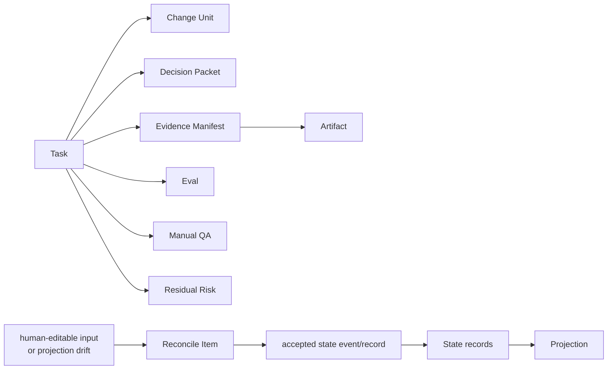
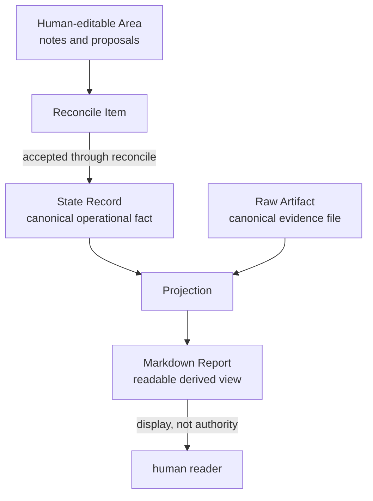
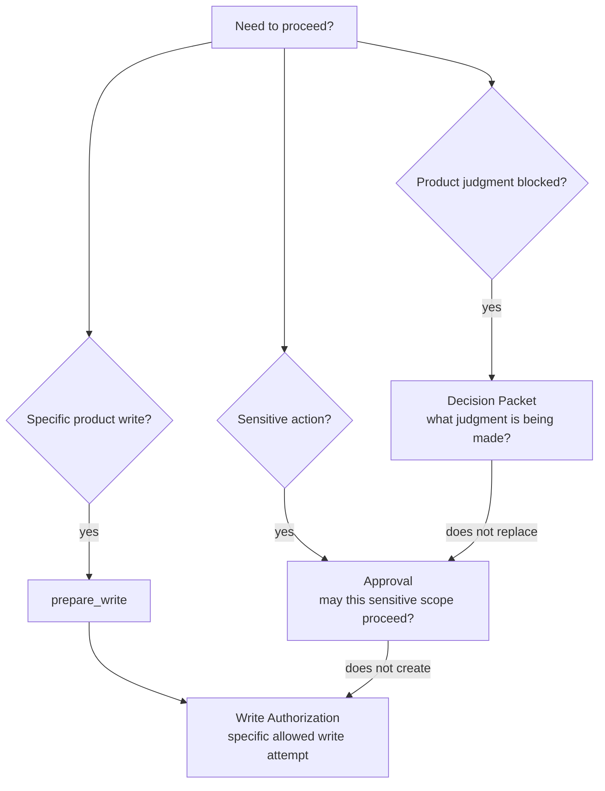

# 용어집

## 공식 용어

이 diagrams는 독자용 map일 뿐입니다. 아래 정의와 linked owner documents가 canonical입니다.



Source-of-truth 용어는 operational state, raw evidence, projections, human input을 구분합니다.



Approval, Decision Packet, Write Authorization은 서로 다른 질문에 답합니다.



### Agency Conformance

Harness behavior, projections, validators, close decisions가 사용자의 Strategic Agency를 얼마나 보존하는지를 나타내는 정도입니다. 작업 여정을 따라갈 수 있는지, product judgment가 명시적인지, Autonomy Boundary가 지켜지는지, blocking product judgment에 Decision Packet이 있는지, acceptance 전에 Residual Risk가 보이는지 확인합니다.

### Acceptance

결과와 남은 trade-offs가 받아들일 만하다는 사용자의 판단입니다. Acceptance는 approval, assurance, verification, Manual QA와 구분됩니다.

### Acceptance Gate

Required user acceptance가 `not_required`, `required`, `pending`, `accepted`, `rejected` 중 어떤 상태인지 기록하는 kernel gate입니다. Acceptance는 QA나 verification을 대신할 수 없습니다.

MVP final acceptance는 Decision Packet user decision, `task_gates.acceptance_gate`, `state.sqlite.task_events`를 통해 기록됩니다. 별도의 acceptance record 또는 table은 없습니다.

### Approval

정의된 scope 안에서 sensitive change를 진행할 수 있도록 허용하는 사전 user decision입니다. Approval은 paths, tools, commands 또는 command classes, network targets, secret scope, baseline, sensitive categories, expiry conditions에 묶입니다. Approval이 요청되면 Core는 approval-shaped Decision Packet과 linked Approval record를 통해 user judgment를 capture합니다. Granted approval이 있어도 Write Authorization이 생기려면 이후 compatible `prepare_write` result가 필요합니다.

### Approval Gate

Sensitive-change approval을 위한 kernel gate입니다. Sensitive categories가 있을 때만 required입니다. Granted approval은 correctness를 증명하지 않고, acceptance를 뜻하지 않으며, product judgment를 resolve하거나 Write Authorization을 create하지 않습니다.

### Artifact

Evidence, recovery, audit에 사용하는 recorded output입니다. Canonical evidence-file boundary는 Raw Artifact를 참고합니다.

### Artifact Reference

Artifact store에 registered된 raw artifact file을 가리키는 structured pointer입니다. identity, kind, URI 또는 path, hash, size, content type, redaction state, task/run relationship을 포함합니다.

### Autonomy Boundary

추가 user judgment 없이 agent가 진행할 수 있는 product-judgment boundary를 기록하는 Change Unit semantics입니다. 이는 scope grant가 아니며 active Change Unit 밖의 paths, tools, commands, network targets, secret access, sensitive categories를 authorize하지 않습니다. Decision Packet이 Autonomy Boundary update나 Change Unit update proposal을 authorize할 수는 있지만, resulting write에는 여전히 compatible scope와 sensitive categories에 필요한 approval이 필요합니다.

### Assurance

Recorded checks와 verification independence가 뒷받침하는 technical confidence level입니다.

```text
none | self_checked | detached_verified
```

Eval verdict만으로 assurance가 올라가지 않습니다. `detached_verified`에는 valid independence가 있는 passed verification과 same-session self-review violation 없음이 필요합니다.

### Baseline

Scope, approval drift, evidence freshness, verification validity를 판단하는 데 사용하는 captured repository state입니다.

### `tree_hash`

Ignored paths를 제외한 뒤 sorted NFC-normalized relative POSIX paths, file bytes, size, executable bit, symlink target handling을 사용해 계산하는 baseline file snapshot의 deterministic hash입니다. 세부 규칙은 Reference MVP가 정의합니다.

### Capability Profile

연결된 agent surface의 실제 capabilities를 declared and verified description으로 기록한 것입니다. target profile, support tier, guarantee level, supported features, risks, fallbacks, last verification time을 기록합니다. Harness는 product name만으로 capability를 infer하지 않습니다.

### Capability Tier

연결된 surface에 대한 coarse integration level입니다.

```text
T0 Context | T1 Skill | T2 MCP | T3 Capture |
T4 Guard | T5 Isolation | T6 QA Capture
```

Capability tiers는 available integration support를 설명할 뿐 kernel gates가 아닙니다.

### Change Unit

Product writes의 범위를 정하는 scoped implementation unit입니다. Product write에는 intended paths, tools, commands, network targets, sensitive categories를 cover하는 active Change Unit이 필요하지만, Change Unit 자체가 write를 authorize하지는 않습니다. Core가 `prepare_write`와 applicable gates를 통해 write 허용 여부를 판단합니다.

### Close Reason

Task가 terminal close state에 도달한 canonical reason입니다.

```text
none | completed_verified | completed_self_checked |
completed_with_risk_accepted | cancelled | superseded
```

### Codebase Stewardship

Product codebase를 durable asset으로 지키는 책임입니다. Domain language, module boundaries, interface contracts, dependency direction, testability, maintainability, future-change risk를 살피는 일을 포함합니다.

### Common Tool Envelope

Public MCP tool calls가 공통으로 갖는 fields입니다. `request_id`, `idempotency_key`, `expected_state_version`, `project_id`, optional `task_id`, `surface_id`, optional `run_id`, `actor_kind`, `dry_run`을 포함합니다.

### Cooperative Guarantee

연결된 agent surface에서 Harness instructions와 MCP decisions를 따르는 cooperative integration을 기대하는 guarantee level입니다. Harness는 behavior를 guide할 수 있지만 hard pre-execution enforcement가 제공되지 않을 수 있습니다.

### Connector Manifest

Connector-managed files, managed block hashes, capability profile, surface target profile, drift status를 기록하는 generated manifest입니다. Generated surface files가 조용히 overwrite되지 않게 합니다.

### Context Hygiene

Current state, evidence, relevant references는 context에 유지하고, stale chat, old PRDs, closed issues, oversized raw artifacts는 명시적으로 필요할 때만 가져오는 policy입니다.

### Decision Gate

진행, write, close 전에 필요한 blocking product judgment를 나타내는 Task-level aggregate gate입니다. Canonical field는 `decision_gate`이며 값은 `not_required`, `required`, `pending`, `resolved`, `deferred`, `blocked`입니다. 관련 blocking Decision Packets와 detected blockers에서 recompute되며 approval, verification, Manual QA, acceptance를 대신하지 않습니다.

### Decision Packet

Blocking product judgment를 지원하기 위해 기록하는 decision-support packet입니다. decision needed, options, 가능할 때 recommendation, trade-offs, affected scope, evidence, Residual Risk, owner, status, next action을 명시합니다. Decision Packet record ID는 `DEC-*`를 사용합니다. Record-level status는 `proposed`, `pending_user`, `resolved`, `deferred`, `rejected`, `blocked`, `superseded`이며 관련 statuses가 Task-level `decision_gate`에 반영됩니다. Canonical form은 kernel state입니다. MVP visibility는 Task/status/next/judgment-context 및 decision-packet surfaces를 통해 required이며, standalone `DEC` Markdown renderings는 enabled되지 않는 한 optional projection 또는 proposal surface입니다.

### Decision Request

Canonical Decision Packet을 가리킬 수 있는 optional routing, interaction, idempotency replay, legacy handoff metadata입니다. Minimal MVP 구현은 이를 생략할 수 있습니다. Decision Request는 decision authority가 아니며 그 자체로 `decision_gate`, approval, acceptance, waiver, residual-risk acceptance, close를 절대 satisfy하지 않습니다. Gate aggregation에는 linked compatible `decision_packet_id`를 통해서만 relevant합니다.

### Design Gate

Shared design, domain language, TDD trace, module/interface review 또는 기타 policy-pack requirements 같은 required design-quality preconditions를 위한 kernel gate입니다.

### Design-Quality Policy Pack

Design-quality policy contracts와 severity composition의 owner document입니다. Shared design, decision quality, autonomy boundary, domain language, vertical slice, feedback loop/TDD trace, module/interface review, Codebase Stewardship, Manual QA, context hygiene를 다룹니다. Gates, validators, evidence, write blockers, close blockers에 영향을 주지만 kernel state machine을 재정의하지 않습니다.

### Detached Verification

Fresh session, fresh worktree, sandbox, manual evaluator bundle처럼 meaningful independence boundary를 가로질러 수행되는 verification입니다. Same-session self-review는 detached verification이 아니며, subagent context도 기본적으로 detached가 아닙니다.

### Detective Guarantee

Harness가 observation 후 violations를 detect하고 state를 `blocked`, `stale`, `partial`, `failed`로 mark할 수 있는 guarantee level입니다.

### Direct

Scope와 result가 명확한 작고 low-risk인 changes를 위한 work mode입니다. Direct product writes에도 active scoped Change Unit이 필요합니다.

### Docs-Maintenance Conformance

Bilingual parity, links, owner boundaries, stable catalogs, glossary terms, source-of-truth phrasing, TODO usage, non-owner duplicate contracts의 drift를 detect하는 read-only documentation maintenance check profile입니다. Rule bodies는 Authoring Guide가 담당하고, operator smoke reporting은 Operations And Conformance가 담당합니다. Core fixture conformance, runtime validator, canonical state transition이 아니며, operator command로 expose되더라도 console 또는 ephemeral result가 runtime conformance나 Task readiness에 영향을 주지 않는 separate docs-only profile입니다.

### Domain Language

Product의 canonical vocabulary와 meanings입니다. Canonical source는 `domain_terms`이며 Markdown domain-language documents는 projections이자 proposal surfaces입니다.

### Domain Term

Product term, meaning, code representation, related terms, source, status, `"not this"` 같은 boundaries를 저장하는 `domain_terms`의 canonical structured record입니다.

### Evidence

Work에 대한 claims를 뒷받침하는 recorded support입니다. diffs, logs, tests, run summaries, screenshots, Eval records, Manual QA records 등이 여기에 해당합니다.

### Evidence Gate

Required evidence coverage를 위한 kernel gate입니다.

```text
not_required | none | partial | sufficient | stale | blocked
```

`not_required`는 evidence gate가 적용되지 않음을 뜻합니다. `none`은 evidence가 required이지만 아직 기록되지 않았음을 뜻합니다.

### Evidence Manifest

Acceptance criteria 또는 completion conditions를 supporting evidence references에 mapping하는 state record입니다.

### Evidence Profile

Task shape에 충분한 evidence가 무엇인지 validators에 알려주는 named evidence sufficiency profile입니다. 예: `advisor`, `direct docs-only`, `direct code`, `work feature`, `UI/UX/copy work`, `sensitive work`, `verification-required work`.

### Evidence Sufficiency

Required acceptance criteria 또는 completion conditions가 Evidence Manifest와 관련 state records 및 artifact refs로 support되는지에 대한 close-relevant judgment입니다. Chat text나 Markdown report prose만으로 판단하지 않습니다.

### Eval

Verification result record입니다. verdict, checks performed, evidence reviewed, independence qualifier, blockers, artifact references를 포함합니다.

### Feedback Loop

Checks와 findings가 state, scope, design, evidence, follow-up work, close status로 되돌아가는 recorded path입니다. Inputs에는 tests, typecheck, lint, build, browser smoke, TDD red/green/refactor traces, Manual QA, Eval findings, user decisions, operational findings, residual-risk decisions가 포함될 수 있습니다. Feedback loops는 findings가 chat 속에서 사라지지 않게 합니다.

### Fixture Assertion Semantics

`expected_state`, `expected_events`, `expected_artifacts`, `expected_projection`, `expected_error`를 captured Core results와 어떻게 match하는지 정하는 conformance comparison rules입니다. Operations and conformance가 담당하며 fixture body 밖에 있고, prose-only matching으로 fixture를 pass시키는 것을 허용하지 않습니다.

### Fresh Session

Evaluator가 lead chat context를 이어받지 않고 task/evidence bundle에서 시작해 Evidence Manifest와 changed files를 검토하고 Eval을 기록하는 verification independence profile입니다.

### Fresh Worktree

Evaluator가 별도 worktree 또는 동등하게 isolated repository state에서 baseline, changed paths, artifacts, Evidence Manifest를 확인하는 verification independence profile입니다.

### Gate

Task가 write, proceed, close할 수 있는지 control하는 canonical kernel field입니다. Gates는 state이며 display text가 아닙니다.

### Generated File

Connector, projector, operator tool이 produced한 repository file 또는 managed block입니다. Generated files가 canonical state에서 drift될 수 있으면 manifest 또는 projection job으로 track해야 합니다.

### Guarantee Display

Status 또는 write decision에 대한 actual guarantee level을 user-facing 및 connector-facing으로 보여주는 display입니다. Enforcement가 cooperative 또는 detective인 경우 limitation notes를 포함합니다.

### Guarantee Level

Connected surface 또는 runtime path에서 available한 enforcement strength입니다.

```text
cooperative | detective | preventive | isolated
```

Capability는 validator results, blocked reasons, display에 영향을 주지만 kernel gate는 아닙니다.

### Harness Core

State transitions, gate updates, validator interpretation, artifact registration, projection job enqueueing, close decisions를 담당하는 runtime component입니다.

### Harness Runtime Home

`registry.sqlite`, per-project `project.yaml`, per-project `state.sqlite`, artifact directories를 포함하는 local runtime storage area입니다.

### Human-editable Area

사람이 notes, proposals, questions, corrections를 쓸 수 있는 Markdown area입니다. Input surface이지 canonical state가 아닙니다. Authority path는 `human-editable input -> reconcile_items -> accepted state event/record`입니다.

### Isolated Guarantee

Risky work가 worktree, sandbox, process boundary 또는 동등한 isolation mechanism으로 분리되는 guarantee level입니다.

### Journey Card

Current Task position을 compact하게 보여주는 human-readable projection입니다. state, next action, scope, blockers, `decision_gate`, evidence, verification, QA, acceptance, Residual Risk, projection freshness를 포함합니다. Journey Card는 display이며 canonical state가 아닙니다.

### Journey Spine

Task의 ordered work journey를 state에서 파생해 이어 주는 continuity model입니다. Chat memory가 아니라 Task, Change Unit, Run, Decision Packet, Approval, Evidence Manifest, Eval, Manual QA, Residual Risk, `task_gates.acceptance_gate`, acceptance Decision Packet user-decision state, close events, artifact references, `state.sqlite.task_events`에서 재구성됩니다. Journey Card와 Journey Spine Markdown views는 projections입니다.

### Journey Spine Entry

Existing state events나 owner records만으로 완전히 재구성하기 어려운 durable continuity annotations를 위한 canonical support record입니다. Journey Spine Entry records는 Journey Spine을 보완하지만 Task, Change Unit, Run, Decision Packet, Residual Risk, evidence, verification, QA, acceptance gate/decision state, close state/events, artifact, event authority를 대체하지 않습니다.

### Interface Contract

Module 또는 external boundary의 public interface, inputs, outputs, errors, compatibility impact, callers, boundary tests에 대한 canonical record입니다. Canonical source는 `interface_contracts`입니다.

### JSON `TEXT` Field

저장된 값이 JSON인 SQLite `TEXT` column입니다. `TEXT` type은 MVP storage flexibility일 뿐입니다. Core는 commit 전에 API-owned 또는 storage-owned shape에 맞게 값을 validate해야 하며, malformed JSON 또는 schema-incompatible JSON은 invalid state입니다.

### Manual QA

UX, workflow, copy, visual output, accessibility, product fit 같은 experiential product quality에 대한 human inspection입니다.

### Manual Bundle

Human 또는 separate evaluator에게 verification을 handoff하는 package입니다. task summary, acceptance criteria, Change Unit scope, approval scope, diff/log/test artifacts, Evidence Manifest, known risks, Eval verdict를 기록하기에 충분한 context를 포함합니다.

### Manual QA Record

Record-level Manual QA result입니다. performer, profile, result, artifacts, findings, applicable한 경우 waiver reason, next action을 포함합니다. Result는 `passed`, `failed`, `waived`입니다. Pending required QA는 `qa_gate=pending`으로 표현하며 Manual QA record result가 아닙니다.

### `managed_hash`

`HARNESS:BEGIN`과 `HARNESS:END` marker lines를 제외한 projector-owned managed block body의 drift-detection hash입니다. Canonical state가 아니며 Markdown projection을 authoritative하게 만들지 않습니다.

### Managed Block

Harness markers로 delimit되고 projector가 state records와 artifact refs에서 regenerate하는 Markdown block입니다. Managed block에 대한 direct edits는 drift 또는 reconcile candidates를 만들며 그 자체로 state가 되지 않습니다.

### MCP Resource

Current project, task, design, policy, status, bundle information을 위한 read-only MCP surface입니다. Resources는 state를 mutate하지 않습니다.

### MCP Server Unavailable

`MCP_SERVER_UNAVAILABLE`은 tool call이 Core에 닿을 수 없는 diagnostic condition입니다. Authoritative Core response가 불가능하며, caller는 state change를 claim하기 전에 diagnose 또는 reconnect해야 합니다. Stable public error code는 계속 `MCP_UNAVAILABLE`입니다.

### Surface MCP Unavailable

`SURFACE_MCP_UNAVAILABLE`은 Core 또는 operator가 connected surface에 usable MCP가 없거나, MCP configuration이 stale이거나, required MCP tools를 call할 수 없음을 observe할 수 있는 diagnostic condition입니다. Product writes는 cooperative surface에서는 instruction으로 hold되고 available한 stronger guard에서는 block됩니다. Core responses는 details와 함께 `MCP_UNAVAILABLE` 또는 `CAPABILITY_INSUFFICIENT`를 사용할 수 있습니다.

### MCP Tool

Core에 state를 validate, record, transition, close하도록 요청하는 public MCP operation입니다. State changes는 resource reads가 아니라 tools 또는 reconcile actions를 통해야 합니다.

### Markdown Report

State records와 artifact references에서 generated된 human-readable document입니다. Markdown report는 기본적으로 raw artifact가 아니며 canonical state가 되지 않습니다.

### Module Map

Product의 modules, responsibilities, public interfaces, dependency direction, test boundaries를 정리한 map입니다. Canonical source는 `module_map_items`입니다.

### Module Map Item

Module role, public interface, dependencies, internal complexity, test boundary, owner decision, watchpoints를 저장하는 `module_map_items`의 canonical structured record입니다.

### Policy Contract

Design-quality policies가 사용하는 standard form입니다. `name`, `applies_when`, `default_requirement`, `allowed_waiver`, `required_record`, `validator`, `evidence`, `close_impact`를 포함합니다.

### Preventive Guarantee

Harness 또는 connector가 violating action을 execution 전에 block할 수 있는 guarantee level입니다.

### Projection

Canonical state records와 artifact references를 사람이 읽을 수 있게 rendering한 것입니다. Projection은 reading과 decision-making에 유용하지만 canonical state를 override할 수 없습니다.

### ProjectionKind

Projection job과 template kind를 나타내는 API enum입니다. MVP-required values는 `TASK`, `APR`, `RUN-SUMMARY`, `EVIDENCE-MANIFEST`, `EVAL`, `DIRECT-RESULT`입니다.

MVP-optional values는 `MANUAL-QA`, `TDD-TRACE`, `DOMAIN-LANGUAGE`, `MODULE-MAP`, `INTERFACE-CONTRACT`입니다. Extension / appendix values는 `DEC`, `DESIGN`, `EXPORT`, `JOURNEY-CARD`입니다. Extension values는 enabled일 때만 valid하며, 어떤 ProjectionKind도 projection을 canonical state로 만들지 않습니다.

### Projection Freshness

Projection과 source records, managed hash, artifact refs, projection job state 사이의 관계입니다. Freshness는 `current`, `stale`, `failed`, `unknown`일 수 있습니다.

### Projection Job

Committed state records와 artifact refs에서 Markdown projection을 render하도록 projector에 요청하는 durable outbox record입니다.

### QA Gate

Required Manual QA를 위한 canonical kernel gate입니다. `manual_qa_record.result`는 record-level이고, `qa_gate`는 close-relevant aggregate state입니다.

`qa_gate=pending`은 required QA가 satisfying record를 아직 만들지 못했거나 latest relevant record가 policy를 satisfy하지 못한다는 뜻입니다.

### Raw Artifact

Diff, log, bundle, screenshot, checkpoint, manifest file처럼 artifact store에 있는 durable evidence file입니다. Raw artifacts는 state records와 Markdown reports와 구분됩니다.

### Reconcile

Human-editable input 또는 projection drift를 accepted state change, rejected proposal, note, decision, deferred item으로 바꾸는 process입니다.

### Reconcile Item

Reconcile decision이 accept, reject, convert, defer하기 전에 human-editable input 또는 projection drift에서 생성되는 canonical candidate record입니다.

### Reference Surface

MVP implementation이 target하는 단일 agent surface입니다. Kernel과 connector contract를 demonstrate하기 위한 범위이며 broad MVP surface support를 뜻하지 않습니다.

### Report Projection

Task report, approval report, run summary, evidence manifest report, Eval report, direct-result report처럼 state records와 artifact references에서 generated되는 Markdown report입니다.

Named report projection kinds는 state records와 artifact refs에서 generated되는 projections입니다. Evidence-file authority는 registered artifact files에 남습니다.

### `request_hash`

`tool_name`, schema-normalized request body, `request_id`와 `idempotency_key`를 제외한 envelope fields를 포함하는 canonical UTF-8 JSON에서 계산하는 tool request idempotency hash입니다.

### Residual Risk

Evidence, verification, QA, acceptance work 이후에도 남는 known uncertainty, trade-off, limitation, unchecked condition을 위한 canonical close-relevant support record입니다. source refs, affected scope, applicable한 경우 related Decision Packet, visibility status, accepted risk, follow-up requirement, close impact를 기록합니다. Close에 영향을 주는 Residual Risk는 계속 보여야 하며, user acceptance of risk는 detached verification을 만들지 않습니다. MVP에서 accepted risk는 Residual Risk record 위의 metadata/state이며 별도의 `accepted_risk` state record가 아닙니다.

### Risk Accepted Close

사용자가 close-relevant Residual Risk를 받아들이는 successful close입니다. Verification risk가 waived된 경우도 포함합니다. `close_reason=completed_with_risk_accepted`를 사용하며 `assurance_level=detached_verified`로 표시하면 안 됩니다.

### Run

Agent, evaluator, operator, 기타 actor가 Task와 optional Change Unit에 대해 수행하는 execution attempt입니다. Run은 baseline, surface, observed changes, commands, artifacts, summary를 기록합니다.

### Scope Gate

Product writes가 active scoped Change Unit으로 covered되어야 함을 요구하는 kernel gate입니다. Approval이 required가 아니어도 write-capable `direct`와 `work` modes에는 scope가 required입니다.

### Severity Composition

여러 applicable task-shape default, policy contract, validator finding을 merge하는 policy-owned rule입니다. Same concern은 전체 Task나 단순히 같은 validator ID가 아니라 같은 policy-relevant target입니다. 이 rule은 모든 finding을 visible하게 유지하고, 서로 다른 affected gate 또는 blocker target의 impact를 보존하며, 같은 concern에서 경쟁하는 impacts에만 가장 강한 applicable impact를 사용합니다. Validators, gates, write blockers, close blockers, waivers, Decision Packet needs에 영향을 주지만 public primary `ToolError` 선택은 API가 소유합니다.

### Shared Design

Implementation이 plan으로 굳어지기 전에 Task에 대해 최소한으로 기록한 shared understanding입니다. goal, scope, non-goals, acceptance criteria, assumptions, decisions, rejected options, domain/module/interface impact, first Change Unit shape를 포함합니다. Shared Design의 Markdown renderings는 projections이자 proposal surfaces입니다.

### Source-of-truth

어떤 fact에 대한 authoritative source입니다. Harness에서 operational state는 `state.sqlite` current records와 `state.sqlite.task_events`에서 canonical하고, raw evidence는 artifact store에서 canonical하며, Markdown documents는 projections입니다.

### `state.sqlite.task_events`

`state.sqlite` 안의 append-only event history table입니다. MVP는 별도의 event store를 사용하지 않습니다. Deterministic order는 timestamp나 event ID가 아니라 `task_events.event_seq`입니다.

### Stable Event Catalog

MVP conformance fixtures가 `expected_events`에서 assert할 수 있는 `task_events.event_type` names에 대한 kernel-owned compact list입니다. Stable event names를 prose examples, fixture shorthand, non-stable implementation-local detail 또는 audit events, validator IDs, Core check names, projection status shorthands, future extension events와 구분합니다.

### State Record

Kernel state 안의 canonical structured record입니다. Task, Change Unit, Decision Packet, Journey Spine Entry, Residual Risk, Run, Approval, Write Authorization, Evidence Manifest, Eval, Manual QA record, Artifact record, Shared Design record, Domain Term, Module Map Item, Interface Contract, TDD Trace, Reconcile Item 등이 있습니다.

### State Version

Core-resolved state scope를 위한 optimistic-concurrency clock입니다. 적용되는 경우 Core는 envelope, tool-specific input, 또는 active Task에서 primary Task를 resolve합니다. `expected_state_version`, `ToolResponseBase.state_version`, `EventRef.state_version`, `task_events.state_version`은 하나의 global event-store sequence가 아니라 해당 affected scope에 따라 해석됩니다.

### Project State Version

`project_state.state_version`에 저장되는 project-scoped state clock입니다. Core-resolved primary Task가 없는 project-scoped mutations는 `expected_state_version`을 이 값과 비교하고 resulting value를 primary response `state_version`으로 반환합니다.

### Task State Version

`tasks.state_version`에 저장되는 task-scoped state clock입니다. Task-scoped mutations는 `expected_state_version`을 Core-resolved primary Task의 값과 비교하고 resulting value를 primary response `state_version`으로 반환합니다.

### Strategic Agency

사용자가 작업 여정을 이해하고 goals, scope, design, trade-offs, Codebase Stewardship, QA, acceptance, Residual Risk에 대해 판단하거나 보류할 수 있는 지속적인 권한입니다. Harness는 chat 밖에서 state, decisions, evidence, blockers, remaining risk를 명시해 Strategic Agency를 보존합니다.

### Surface Capability Check

연결된 agent surface의 required Harness behavior 충족 가능성을 report하는 validator입니다. Blocked reasons와 guarantee display에 영향을 주지만 kernel gate는 아닙니다.

### Surface Cookbook

Surface-specific connector notes, generated file details, profile examples를 담은 appendix입니다. Common integration rules는 cookbook이 아니라 agent integration document에 둡니다.

### Subagent Context

Subagent 또는 helper가 일부 inherited implementation context를 가지고 work를 review하는 verification independence profile입니다. 기본적으로 detached가 아니며, stricter profile metadata가 real independence boundary를 prove할 때만 qualify될 수 있습니다.

### Task

Kernel이 track하는 user value unit입니다. mode, lifecycle phase, gates, result, close reason, assurance, current summary, decisions, evidence, projection status를 가집니다.

### TDD Trace

Change Unit에 대한 red, green, refactor evidence record 또는 policy가 허용하는 recorded non-TDD justification입니다.

### Verification

Result가 relevant criteria를 satisfy하는지 check하는 process입니다. Verification은 approval, Manual QA, acceptance와 구분됩니다.

### Verification Gate

Required verification을 위한 kernel gate입니다. User waiver는 `verification_gate=waived_by_user`를 set하지만 `detached_verified` assurance를 만들지 않습니다.

### Verification Independence Profile

Eval independence context의 named minimum qualification입니다. 예: `same_session`, `subagent_context`, `fresh_session`, `fresh_worktree`, `sandbox`, `manual_bundle`. Passed Eval은 `detached_verified`를 뒷받침하기 전에 valid profile을 만족해야 합니다.

### Validator Result

Validator의 structured result입니다. status, guarantee level, target, findings, blocked reasons, suggested next action을 포함합니다.

### Vertical Slice

Trigger/input에서 domain logic, persistence 또는 state, caller/API boundary, observable output, tests, optional Manual QA까지 얇은 경로를 연결하는 Change Unit shape입니다.

### Waiver

Policy가 허용하는 곳에서 gate requirement에 대한 explicit recorded exception입니다. Verification waiver, design waiver, QA waiver는 정의된 rules 아래 허용됩니다. Scope, sensitive approval, required evidence, required acceptance는 successful completion을 위해 waived되지 않습니다.

### Write Authorization

`prepare_write`가 특정 allowed write attempt에 대해 create하는 durable state record입니다. Replay, stale detection, audit를 위한 compatibility basis로 사용된 affected-scope state version인 `basis_state_version`을 기록합니다. Distinct compatible `prepare_write` requests는 distinct authorization을 create하며, idempotent replay는 committed response를 반환할 수 있습니다. Committed implementation 또는 direct run에 single-use이며, scope, approval, evidence, verification, Manual QA, acceptance, residual-risk visibility를 대체하지 않습니다.

### Write Authorization Lifecycle Events

Write Authorization creation, return, consumption, expiry, staling, revocation, violation detection을 위한 stable event-name set입니다. Exact vocabulary와 `scope_violation_detected`와의 관계는 [Kernel Stable Event Catalog](03-kernel-spec.md#stable-event-catalog)가 담당합니다.

### Write Authority Summary

Intended operation의 current write authority를 보여주는 user-facing display summary입니다. Active Change Unit scope, `prepare_write`, approval, baseline, guarantee, Decision Packet refs, Write Authorization ref에서 derive됩니다. 별도 authority record가 아닌 display이며 그 자체로 work를 authorize하지 않습니다.
