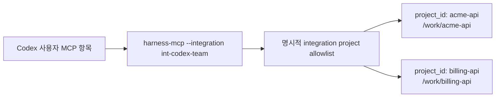

# 다중 저장소 에이전트 설정

하나의 사용자 범위 통합이 명시적으로 허용된 여러 `Product Repository` 등록을 처리해야 할 때 이 가이드를 사용합니다.

기준 토폴로지는 다음과 같습니다.



호스트 MCP 항목 하나, `harness-mcp --integration <integration_id>` 프로세스 하나, 명시적 allowlist 하나가 있고, 도구 호출마다 여러 저장소 중 하나를 선택합니다. 프로젝트를 추가해도 모든 Runtime Home 프로젝트가 허용되지는 않습니다. 접근 제거는 호스트 항목을 다시 쓰지 않아도 registry 상태를 통해 적용됩니다.

프로젝트 및 로컬 호스트 범위는 단일 저장소 범위로 남습니다. 이 토폴로지에는 사용자 범위를 사용합니다.

## Product Repository A 설치

```sh
/opt/harness/bin/harness agent install \
  --host codex \
  --scope user \
  --server-name harness-main \
  --integration-id int-codex-team \
  --project-id acme-api \
  --repo-root /work/acme-api \
  --default-project-id acme-api \
  --runtime-home /Users/alex/.harness \
  --mcp-command /opt/harness/bin/harness-mcp
```

이 예시는 호스트 항목이 짧고 예측 가능한 키를 갖도록 `--server-name harness-main`을 고정합니다. 이 옵션은 필수가 아닙니다. 생략하면 `integration_id`에서 안정적인 이름을 파생합니다.

호스트 설정에는 서버 항목 하나가 있습니다.

```toml
[mcp_servers.harness-main]
command = "/opt/harness/bin/harness-mcp"
args = ["--integration", "int-codex-team"]

[mcp_servers.harness-main.env]
HARNESS_HOME = "/Users/alex/.harness"
```

## Product Repository B 추가

```sh
/opt/harness/bin/harness agent project add \
  --integration-id int-codex-team \
  --project-id billing-api \
  --repo-root /work/billing-api \
  --runtime-home /Users/alex/.harness
```

예상 결과:

```text
status: complete
allowed_projects:
  acme-api
  billing-api
verification_detail: project-specific startup preflight passed
```

호스트에 MCP 서버 항목이 여전히 하나인지 확인합니다. Codex 설정에는 이 통합에 대해 `mcp_servers.harness-main`만 있어야 하며, 프로젝트마다 서버 항목이 하나씩 늘어나면 안 됩니다.

```sh
/opt/harness/bin/harness agent status \
  --integration-id int-codex-team \
  --runtime-home /Users/alex/.harness
```

Status는 `allowed_projects` 아래에 `acme-api`와 `billing-api`를 모두 보여줘야 합니다.

## 에이전트가 해야 할 일

사용자가 어떤 저장소를 사용할 수 있는지 묻는다면, 에이전트는 어댑터 유틸리티를 호출합니다.

```json
{"name":"harness.list_projects","arguments":{}}
```

MCP 결과에는 다음과 비슷한 JSON 객체가 텍스트로 들어 있습니다.

```json
{
  "integration_id": "int-codex-team",
  "default_project_id": "acme-api",
  "projects": [
    {
      "project_id": "acme-api",
      "repo_root": "/work/acme-api",
      "available": true,
      "is_default": true
    },
    {
      "project_id": "billing-api",
      "repo_root": "/work/billing-api",
      "available": true,
      "is_default": false
    }
  ]
}
```

Product Repository A에 대해 에이전트는 공개 메서드 envelope에 `project_id: "acme-api"`를 제공합니다.

```json
{
  "name": "harness.status",
  "arguments": {
    "envelope": {
      "project_id": "acme-api",
      "actor_kind": "agent",
      "request_id": "req_status_acme",
      "idempotency_key": null,
      "expected_state_version": null,
      "dry_run": false,
      "locale": "en-US",
      "task_id": null
    },
    "include": {
      "task": true,
      "pending_user_judgments": true,
      "write_authority": false,
      "evidence": false,
      "close": true,
      "guarantees": true
    }
  }
}
```

Product Repository B에 대한 이후 호출은 명시적 프로젝트 선택자와 request id만 바꿉니다.

```json
{
  "name": "harness.status",
  "arguments": {
    "envelope": {
      "project_id": "billing-api",
      "actor_kind": "agent",
      "request_id": "req_status_billing",
      "idempotency_key": null,
      "expected_state_version": null,
      "dry_run": false,
      "locale": "en-US",
      "task_id": null
    },
    "include": {
      "task": true,
      "pending_user_judgments": true,
      "write_authority": false,
      "evidence": false,
      "close": true,
      "guarantees": true
    }
  }
}
```

에이전트는 폴더 이름, 현재 작업 디렉터리, MCP roots, 호스트 라벨, 기억에서 project ID를 추측하면 안 됩니다. 여러 프로젝트를 사용할 수 있고 명시적 프로젝트나 유효한 기본값이 없으면, 어댑터는 Core 실행 전에 호출을 거부하고 다음과 같은 실행 가능한 텍스트를 반환합니다.

```text
project selection is ambiguous; call harness.list_projects and retry with envelope.project_id
```

## 기본값과 모호성

유효한 명시적 `default_project_id`가 있으면 어댑터가 생략된 `project_id`를 그 기본값으로 보낼 수 있습니다. 기본값은 편의이지 권한이 아닙니다. 기본값은 허용된 프로젝트를 가리켜야 하며, 그 프로젝트가 비활성 또는 실행 불가 상태가 되면 사용할 수 없게 될 수 있습니다.

사용자 요청이 저장소를 이름 붙이면, 에이전트는 그래도 일치하는 `project_id`를 명시적으로 사용해야 합니다. 명시적 프로젝트 선택은 다중 저장소 작업에서 가장 분명하며, 실수로 기본 프로젝트에 대해 작업하는 일을 막습니다.

호스트 설정을 다시 쓰지 않고 기본값을 설정하거나 바꿉니다.

```sh
/opt/harness/bin/harness agent project default set \
  --integration-id int-codex-team \
  --project-id billing-api \
  --runtime-home /Users/alex/.harness
```

예상 결과:

```text
status: complete
prior_default_project_id: acme-api
resulting_default_project_id: billing-api
```

여러 프로젝트가 남아 있는 동안 기본값을 지우면 생략된 `project_id` 호출은 모호해집니다. 에이전트는 `harness.list_projects`를 호출한 뒤 명시적 `envelope.project_id`로 다시 시도해야 합니다.

## 프로젝트 제거와 재추가

기본값을 `billing-api`로 옮긴 뒤 Product Repository A는 예전에 기본값이던 프로젝트일 뿐입니다. 통합과 호스트 MCP 항목은 유지하면서 제거합니다.

```sh
/opt/harness/bin/harness agent project remove \
  --integration-id int-codex-team \
  --project-id acme-api \
  --runtime-home /Users/alex/.harness
```

예상 결과:

```text
status: complete
allowed_projects:
  billing-api
verification_detail: project membership removed; host configuration was not rewritten
```

마지막으로 남은 프로젝트를 제거하려면, 기본값이 아직 그 프로젝트를 가리킬 때 먼저 기본값을 지운 뒤 멤버십을 제거합니다.

```sh
/opt/harness/bin/harness agent project default clear \
  --integration-id int-codex-team \
  --runtime-home /Users/alex/.harness

/opt/harness/bin/harness agent project remove \
  --integration-id int-codex-team \
  --project-id billing-api \
  --runtime-home /Users/alex/.harness
```

예상 결과:

```text
status: complete
allowed_project_count: 0
not executable until one is added
```

제거 뒤 `harness.list_projects`는 `int-codex-team`에 대해 프로젝트를 노출하지 않습니다. 바뀌지 않은 호스트 항목은 같은 통합을 계속 시작하고 Host Installation inventory도 남을 수 있지만, 프로젝트가 다시 추가되기 전까지 공개 도구 호출은 실행될 수 없습니다.

프로젝트가 없는 상태를 확인합니다.

```sh
/opt/harness/bin/harness agent status \
  --integration-id int-codex-team \
  --runtime-home /Users/alex/.harness
```

예상 상태에는 아래 내용이 포함됩니다.

```text
allowed_project_count: 0
not executable
```

호스트 항목을 다시 설치하지 않고 프로젝트를 다시 추가합니다.

```sh
/opt/harness/bin/harness agent project add \
  --integration-id int-codex-team \
  --project-id billing-api \
  --repo-root /work/billing-api \
  --runtime-home /Users/alex/.harness
```

다시 추가한 프로젝트를 편의 기본값으로 삼아야 한다면, 추가한 뒤 기본값으로 설정합니다.

```sh
/opt/harness/bin/harness agent project default set \
  --integration-id int-codex-team \
  --project-id billing-api \
  --runtime-home /Users/alex/.harness
```

## 전체 uninstall

통합에 대해 관리되는 호스트 설정과 관리되는 guidance를 제거합니다.

```sh
/opt/harness/bin/harness agent uninstall \
  --integration-id int-codex-team \
  --runtime-home /Users/alex/.harness \
  --allow-repository-write \
  --remove-managed
```

Uninstall은 하네스가 관리하는 호스트 설정과 관리되는 guidance만 제거합니다. Product Repository, Runtime Home 데이터, 프로젝트 상태, Core 기록, 아티팩트 저장소, 관련 없는 호스트 항목은 삭제하지 않습니다.

## 참조 링크

- 정확한 호스트/범위와 명령 동작: [관리 CLI](../reference/admin-cli.md)
- 정확한 Agent Integration Profile과 프로젝트 선택 동작: [에이전트 통합](../reference/agent-integration.md)
- 정확한 `harness.list_projects` 전송 동작: [MCP 전송](../reference/mcp-transport.md)
- 정확한 Product Repository 쓰기 경계: [런타임 경계](../reference/runtime-boundaries.md#explicit-integration-files-in-product-repositories)
