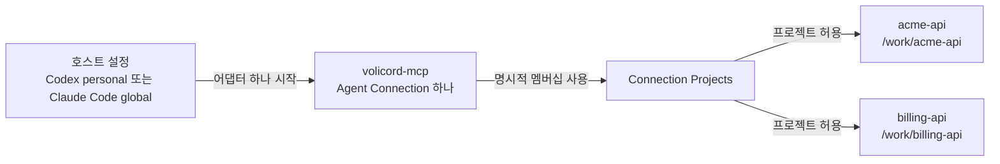

# 여러 저장소 에이전트 설정

하나의 호스트 수준 Agent Connection이 명시적으로 연결된 둘 이상의
`Product Repository`를 처리해야 할 때 이 가이드를 사용합니다.

이 가이드는 운영자 작업 흐름입니다. 정확한 Agent Connection, 프로젝트 선택, 전송
동작은 [Agent Connection](../reference/agent-connection.md)과
[MCP 전송](../reference/mcp-transport.md)이 담당합니다.

## 토폴로지

이 토폴로지 지도는 호스트 수준 Agent Connection을 통해 호스트 항목 하나가
명시적으로 연결된 둘 이상의 저장소에 어떻게 닿을 수 있는지 보여 줍니다. 화살표는
설정된 바인딩과 허용된 멤버십 관계를 뜻하며, 요청 실행 순서가 아니고 Runtime Home의
모든 프로젝트에 접근할 수 있음을 뜻하지도 않습니다.



호스트 항목 하나가 Agent Connection 하나에 대한 `volicord-mcp` 프로세스 하나를
시작합니다. 그 연결은 명시적으로 연결된 저장소로만 라우팅할 수 있습니다. 저장소
하나를 추가해도 Runtime Home에 등록된 모든 프로젝트 접근을 부여하지 않습니다.

이 토폴로지는 호스트 수준 설정에 맞습니다.

- Codex personal 연결: `volicord connect codex`
- Claude Code global 연결: `volicord connect claude-code --global`

프로젝트 공유 연결과 호스트 로컬 연결은 단일 저장소 흐름으로 남습니다.

## 첫 저장소 연결하기

첫 제품 저장소에서 실행합니다.

```sh
cd /work/acme-api
volicord connect codex
volicord connection status codex
```

Claude Code global 설정은 아래처럼 실행합니다.

```sh
cd /work/acme-api
volicord connect claude-code --global
volicord connection status claude-code --global
```

명령은 Git 저장소 루트를 감지하고, 저장소 프로젝트를 등록하거나 재사용하며, 저장소
디렉터리에서 보이는 프로젝트 이름을 파생하고, 내부 registry 식별 정보를 Runtime
Home에 저장합니다.

## 다른 저장소 추가하기

두 번째 저장소에서 같은 호스트와 의도로 실행합니다.

```sh
cd /work/billing-api
volicord connect codex
volicord connection status codex
```

또는 저장소를 명시적으로 선택합니다.

```sh
volicord connect codex --repo /work/billing-api
volicord connection status codex --repo /work/billing-api
```

같은 호스트 수준 대상에 대해 Volicord는 일치하는 Agent Connection을 재사용하고
선택된 저장소를 Connection Projects에 추가합니다. 운영자가 내부 연결 식별 정보를 다룰
필요는 없습니다.

## 연결 확인하기

```sh
volicord connections
volicord connection verify codex
volicord connection status codex --repo /work/acme-api
volicord connection status codex --repo /work/billing-api
```

Verification이 `action_required`를 보고하면 이름 붙은 호스트 소유 trust, approval,
reload, restart, setup repair 동작을 완료한 뒤 verification을 다시 실행합니다. 증상별
복구는 [에이전트 호스트 문제 해결](agent-host-troubleshooting.md)을 사용합니다.

## 에이전트가 해야 할 일

사용자가 사용 가능한 저장소를 물으면 에이전트는 아래를 호출합니다.

```json
{"name":"volicord.list_projects","arguments":{}}
```

MCP 결과는 묶인 Agent Connection에 연결된 프로젝트만 나열합니다. 둘 이상의
프로젝트가 연결된 뒤 한 저장소를 대상으로 하는 공개 Volicord 메서드 호출은
`volicord.list_projects`가 반환한 명시적 `project_selector`를 포함해야 합니다.

```json
{
  "name": "volicord.status",
  "arguments": {
    "project_selector": "billing-api",
    "detail": "workflow"
  }
}
```

에이전트는 폴더 이름, 현재 작업 디렉터리, MCP roots, 호스트 라벨, 기억에서
프로젝트를 지어내면 안 됩니다. 저장소 라벨에서도 프로젝트 식별 정보를 추론하면 안
됩니다. `project_selector` 없는 호출이 모호하다고 거부되면 `volicord.list_projects`를
호출하고 의도한 프로젝트를 고른 뒤 반환된 값으로 다시 시도합니다. 공개 MCP 도구 인자는
`request_id`, `idempotency_key`, `expected_state_version`, `dry_run`, `locale` 같은 Core
요청 메타데이터를 요구하거나 허용하지 않습니다.

## 저장소 하나 제거하기

제거할 저장소에서 실행합니다.

```sh
cd /work/billing-api
volicord connection remove codex --dry-run
volicord connection remove codex
```

또는 저장소를 명시적으로 선택합니다.

```sh
volicord connection remove codex --repo /work/billing-api --dry-run
volicord connection remove codex --repo /work/billing-api
```

저장소 하나를 제거하면 그 저장소의 Connection Projects 멤버십이 제거됩니다.
`Product Repository`, 프로젝트 등록, 프로젝트 상태, Core task/evidence/run/artifact
기록, 관련 없는 호스트 설정은 삭제하지 않습니다. 다른 연결 저장소가 남아 있으면
호스트 항목도 남습니다. 아무 저장소도 남지 않으면 소유권과 안전 점검이 허용할 때
Volicord가 일치하는 관리 호스트 설정을 제거합니다.

## 경계

- Agent Connection은 명시적으로 연결된 저장소에만 접근합니다.
- 여러 저장소가 연결되어 있으면 `volicord.list_projects`가 아닌 공개 MCP 도구 호출에는
  명시적 `project_selector`가 필요합니다.
- `Product Repository`는 제품 파일 경계이며 선택된 공유 호스트 설정을 포함할 수
  있지만 Core 권한이 아닙니다.
- `Write Check`은 Core 상태 호환성이지 OS 권한이 아닙니다.
- Volicord는 OS 샌드박싱, 파일시스템 ACL, 네트워크 정책, 비밀 격리를 제공하지
  않습니다.
