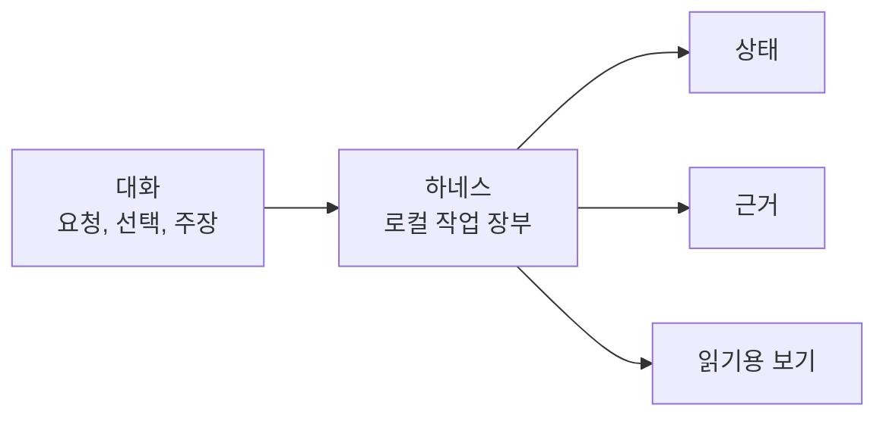

# 개요

## 이 문서로 할 수 있는 일

이 문서는 하네스를 처음 읽는 사람을 위한 첫 번째 그림입니다. 하네스가 왜 필요한지, 세 공간이 무엇인지, 무엇을 기록하는지, 그리고 참고 사양을 읽기 전에 왜 그 기록이 중요한지 이해하는 데 도움을 줍니다.

## 이런 때 읽기

하네스가 처음일 때, AI와 함께한 작업이 따라가기 어려워졌을 때, 또는 왜 하네스가 대화, 운영 기록, 근거, 읽기용 문서를 분리하는지 알고 싶을 때 읽습니다.

## 읽기 전에

하네스를 미리 알 필요는 없습니다. 이 문서를 읽은 뒤 구체적인 흐름을 보고 싶다면 [하나의 작업으로 보는 하네스](harness-in-one-task.md)를 읽습니다.

## 핵심 생각

중요한 작업 사실은 대화 안에 갇히기 쉽습니다.

AI 지원 개발 세션은 빠르게 흘러갑니다. 사용자가 요청하고, 범위가 바뀌고, 에이전트가 선택을 하고, 테스트가 실행되고, 스크린샷이 올라오고, 위험이 언급된 뒤 모두가 작업이 끝났다고 말할 수 있습니다. 하지만 나중에 보면 기본적인 질문에 답하기 어렵습니다. 무엇을 바꾸기로 했는지, 실제로 무엇이 바뀌었는지, 무엇을 확인했는지, 아직 어떤 사람의 판단이 필요한지, 어떤 위험을 받아들였는지 알기 어렵습니다.

하네스는 AI 지원 제품 작업을 위한 로컬 작업 장부이자 판단 라우터입니다. 무엇을 바꿀 수 있는지, 누가 판단해야 하는지, 어떤 근거가 있는지, 어떤 잔여 위험이 있는지, 작업을 닫아도 되는지를 기록합니다.

하네스는 사용자 판단권을 보존하는 로컬 권한 커널 원칙을 계속 따릅니다. 이런 작업 사실을 대화 밖의 지속 로컬 상태(durable local state), 근거를 뒷받침하는 아티팩트 참조, 상태에서 파생된 읽기용 투영 문서(projection)에 둡니다. 대화는 자연스럽게 이어가되, 오래 남아야 하는 작업 사실은 현재 상태에서 따라가고, 다시 시작하고, 확인하고, 닫을 수 있게 만듭니다.

## 하네스가 해결하는 문제

AI 에이전트는 개발을 도울 수 있지만, 작업의 흐름은 자주 흐릿해집니다. 작은 요청이 더 큰 변경으로 커질 수 있습니다. 설계 선택이 이름 붙지 않은 채 구현 속에서 일어날 수 있습니다. 테스트가 대화에서만 언급되고 작업과 연결되지 않을 수 있습니다. 사용자는 어떤 위험이 남았는지 보지 못한 채 결과를 받아들일 수 있습니다.

하네스는 작업 흐름을 명시적으로 만들어 이 문제를 줄입니다. 하네스는 작업, 시도 중인 제한된 변경, 사용자 판단이 필요한 결정, sensitive-action Approval, 근거, 검증, 수동 QA, 수락, 잔여 위험을 기록합니다. 모든 작업을 무겁게 만들려는 것이 아닙니다. 중요한 사실이 필요할 때 보이게 하려는 것입니다.

목표는 대화, 버전 관리, 테스트, 코드 리뷰, 사용자 판단을 대체하는 것이 아닙니다. 목표는 대화만을 작업의 기억으로 삼지 않고, 나머지 작업 기록을 더 쉽게 살필 수 있게 하는 것입니다.

## 세 공간을 쉬운 말로 설명하기

하네스는 세 공간을 분리합니다. 그래야 제품 파일, 운영 기록, 사람이 읽는 요약이 서로 섞이지 않습니다.

| 공간 | 쉬운 설명 |
|---|---|
| 제품 저장소 | 실제 제품 작업 공간입니다. 소스 코드, 테스트, 제품 문서, 생성된 읽기용 보고서가 여기에 있습니다. 하네스가 이곳의 작업을 조율할 수는 있지만, 그 작업 공간은 여전히 사용자의 제품 작업 공간입니다. |
| 하네스 서버/설치 | 로컬에 설치된 하네스 프로그램과 도구입니다. 에이전트 요청을 받고, 쓰기를 허용할 수 있는지 확인하고, 작업 사실을 기록하고, 검사기를 실행하고, 읽기용 문서를 만듭니다. |
| 하네스 런타임 홈 | 로컬 하네스 데이터 공간입니다. 등록된 프로젝트 정보, 운영 상태, 오래 보관할 근거 파일이 여기에 있습니다. |

이 분리가 중요한 이유는 간단합니다. Markdown 보고서가 조용히 운영상의 진실이 되면 안 됩니다. 대화 기록이 오래 남는 상태처럼 취급되면 안 됩니다. 제품 파일과 하네스의 내부 운영 기록이 뒤섞여서도 안 됩니다.

## 하네스가 기록하는 것

하네스는 대화가 끝난 뒤에도 남아야 하는 작업 흐름의 일부를 기록합니다.

- 사용자가 끝내거나 답을 얻고 싶은 Task
- 제품 파일 쓰기의 범위를 정하는 Change Unit
- 사용자 판단이 진행을 막을 때의 결정과 결정 패킷
- sensitive-action Approval
- diff, 로그, 검사 결과, 스크린샷, 실행 요약, 평가 기록, 수동 QA 기록 같은 근거
- 자체 확인인지, 구현 세션과 분리 검증인지가 드러나는 검증 상태
- 사람의 확인이 필요한 경우의 수동 QA
- 결과에 대한 수락 또는 거절
- 작업 뒤에 남는 잔여 위험
- 기록된 상태에서 만들어지는 Markdown 보고서, Journey Card, Journey Spine 같은 읽기용 보기

이 기록을 통해 독자는 지금 어디인지, 무엇이 바뀌었는지, 무엇을 확인했는지, 어떤 위험이 아직 남았는지, 무엇이 막혀 있는지, 어떤 결정이 필요한지, 이 작업을 닫아도 되는지 물을 수 있습니다.

## 하네스가 아닌 것

하네스는 다음이 아닙니다.

- prompt 묶음
- source control, 테스트, 코드 리뷰, 사용자 판단의 대체물
- MCP 자체
- 넓은 hosted agent platform

하네스는 단순한 대화 흐름, test harness, evaluation harness도 아닙니다.

하네스는 MCP 도구/connector, hook, guardrail, adapter, sidecar, isolation layer와 통합될 수 있습니다. 이런 접점과 장치는 에이전트가 현재 맥락을 읽고, 하네스 도구를 호출하고, 근거를 캡처하고, 연결된 프로필(profile)이 지원하는 범위에서 경계를 차단하거나 사후 감지하도록 도울 수 있지만, 하네스 권한의 출처는 아닙니다. 연결된 접점이 협조하거나 실행 뒤에 문제를 감지할 수만 있다면, 하네스는 강한 사전 차단을 주장하지 않고 그 한계를 그대로 말해야 합니다.

하네스 권한은 Core와 기준 로컬 상태에서 나옵니다. Task 상태, Change Unit 범위, 결정 패킷, Approval, 쓰기 허가 기록, 근거, 검증, QA, 수락, 잔여 위험, 닫기를 기준으로 작업을 조율합니다.

하네스는 사용자의 제품 저장소, 소스 관리 또는 버전 관리 시스템, 테스트 실행기, 코드 리뷰 절차, 사용자 소유 제품 판단, 중요한 기술 판단도 대체하지 않습니다.

하네스는 대화 기록을 진실의 기준으로 삼지 않습니다. 생성된 Markdown을 운영 기록으로 삼지도 않습니다. 에이전트가 제품 방향이나 중요한 기술 방향의 주인이 되게 하지도 않습니다. 목표, 범위, 설계 판단, 제품 판단과 중요한 기술 판단, sensitive-action Approval, QA 판단, 수락, 잔여 위험을 받아들이는 판단은 여전히 사용자가 합니다.

하네스는 AI 지원 작업 주변에 로컬 기록과 결정 경로를 둡니다. 더 빠르게 일하되, 작업의 모양을 잃지 않게 돕습니다.

AGENTS.md / agent rules, MCP, spec-driven workflows, hooks / sidecars, test runners / code review와의 나란한 비교는 [한국어 문서 진입점](../README.md#비교)을 봅니다. 그 차이 뒤의 가치는 [목적과 원칙](purpose-and-principles.md)을 읽습니다.

## 다음에 읽을 문서

- [핵심 개념](concepts.md)에서 참고 사양을 읽기 전에 필요한 가장 작은 용어 묶음을 봅니다.
- [목적과 원칙](purpose-and-principles.md)에서 시스템 뒤의 가치와 경계를 봅니다.
- 엄격한 커널 동작은 [커널 참조](../reference/kernel.md)를 봅니다.
- 런타임 아키텍처는 [런타임 아키텍처 참조](../reference/runtime-architecture.md)를 봅니다.
- 문서 Projection은 [문서 Projection 참조](../reference/document-projection.md)를 봅니다.
