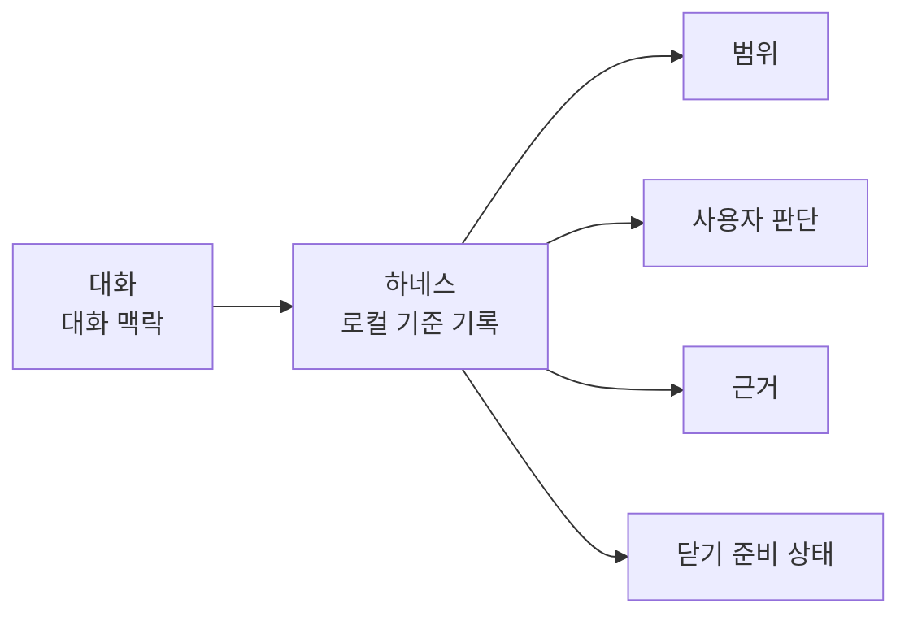
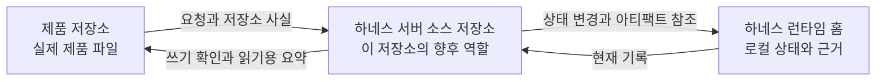

# 개요

## 이 문서로 할 수 있는 일

이 문서는 하네스를 처음 읽는 사람을 위한 첫 번째 그림입니다. 하네스가 왜 필요한지, 세 공간이 무엇인지, 무엇을 기록하는지, 그리고 참고 사양을 읽기 전에 왜 그 기록이 중요한지 이해하는 데 도움을 줍니다.

## 이런 때 읽기

하네스가 처음일 때, AI와 함께한 작업이 따라가기 어려워졌을 때, 또는 왜 하네스가 대화, 운영 기록, 근거, 읽기용 문서를 분리하는지 알고 싶을 때 읽습니다.

## 읽기 전에

하네스를 미리 알 필요는 없습니다. 이 문서가 문서 세트의 기본 첫 읽기입니다.

이 문서 다음에는 [사용자 가이드](../use/user-guide.md)에서 작업 중 하네스와 상호작용하는 법을 보고, [핵심 개념](concepts.md)에서 예시와 Reference 사양에 나오는 어휘를 정리합니다. 용어보다 예시를 먼저 보고 싶다면 [15분 만에 보는 하네스](harness-in-15-minutes.md)를 짧은 시나리오 모음으로, [하나의 작업으로 보는 하네스](harness-in-one-task.md)를 더 긴 튜토리얼로 읽습니다.

## 핵심 생각

중요한 작업 사실은 대화 안에 갇히기 쉽습니다.

AI 지원 개발 세션은 빠르게 흘러갑니다. 사용자가 요청하고, 범위가 바뀌고, 에이전트가 선택을 하고, 테스트가 실행되고, 스크린샷이 올라오고, 위험이 언급된 뒤 모두가 작업이 끝났다고 말할 수 있습니다. 하지만 나중에 보면 기본적인 질문에 답하기 어렵습니다. 무엇을 바꾸기로 했는지, 실제로 무엇이 바뀌었는지, 무엇을 확인했는지, 아직 어떤 사람의 판단이 필요한지, 어떤 위험을 받아들였는지 알기 어렵습니다.

한 문장으로 말하면, 하네스는 AI 지원 제품 작업에서 작업 범위, 사용자 판단, 근거, 검증, QA 기대, 작업 수락, 잔여 위험 상태를 깨지기 쉬운 대화 맥락 밖에 두는 로컬 기준 기록이자 판단 경로입니다.

조금 풀어 말하면, 하네스는 어떤 작업이 범위 안에 있는지, 어떤 판단이 사용자에게 남아 있는지, 완료 주장을 무엇이 뒷받침하는지, 어떤 검증이나 QA가 아직 필요한지, 작업 수락이 이루어졌는지, 어떤 잔여 위험이 있는지를 사용자와 에이전트가 함께 볼 수 있는 로컬 기록으로 남깁니다. 대화는 대화로 남습니다. Markdown 읽기용 요약은 사람이 읽는 표시입니다. Core가 소유한 로컬 상태와 아티팩트 참조가 운영상 기준입니다. 목적은 기존 도구나 지침을 대체하는 것이 아니라, AI 지원 작업을 다시 시작하고, 살피고, 닫을 수 있게 하면서 사용자가 소유한 판단을 에이전트 판단으로 바꾸지 않는 것입니다.

## 하네스가 해결하는 문제

AI 에이전트는 개발을 도울 수 있지만, 작업의 흐름은 자주 흐릿해집니다. 작은 요청이 더 큰 변경으로 커질 수 있습니다. 설계 선택이 이름 붙지 않은 채 구현 속에서 일어날 수 있습니다. 테스트가 대화에서만 언급되고 작업과 연결되지 않을 수 있습니다. 사용자는 어떤 위험이 남았는지 보지 못한 채 결과를 받아들일 수 있습니다.

하네스가 집중하는 문제는 네 가지입니다.

- 작업 범위가 흐르거나 암묵적으로 바뀝니다.
- 사용자 판단이 조용히 에이전트 판단으로 바뀝니다.
- 근거, 검증, QA, 완료 주장이 뒤섞입니다.
- 대화나 Markdown 출력이 운영상 기준으로 오해됩니다.

하네스는 모든 작업을 무겁게 만들려는 것이 아닙니다. 중요한 사실이 필요할 때 보이게 하고, 서로 다른 종류의 근거와 판단이 한 덩어리의 "완료"로 섞이지 않게 합니다.

## 세 공간을 쉬운 말로 설명하기

하네스는 세 공간을 분리합니다. 그래야 제품 파일, 운영 기록, 사람이 읽는 요약이 서로 섞이지 않습니다.

| 공간 | 쉬운 설명 |
|---|---|
| 제품 저장소 | 실제 제품 작업 공간입니다. 소스 코드, 테스트, 제품 문서, 생성된 읽기용 보고서가 여기에 있습니다. 하네스가 이곳의 작업을 조율할 수는 있지만, 그 작업 공간은 여전히 사용자의 제품 작업 공간입니다. |
| 하네스 서버/설치 | 로컬에 설치된 하네스 프로그램과 도구입니다. 에이전트 요청을 받고, 쓰기를 허용할 수 있는지 확인하고, 작업 사실을 기록하고, 검사기를 실행하고, 읽기용 문서를 만듭니다. |
| 하네스 런타임 홈 | 로컬 하네스 데이터 공간입니다. 등록된 프로젝트 정보, 운영 상태, 오래 보관할 근거 파일이 여기에 있습니다. |

이 문서 저장소는 세 공간 중 향후 하네스 서버 소스 저장소 역할을 맡도록 준비되고 있습니다. 제품 저장소나 하네스 런타임 홈은 아닙니다. 여기서 서버/런타임 구현을 시작하려면 문서 수락과 별도의 구현 계획 준비 결정이 모두 필요합니다.

이 분리가 중요한 이유는 간단합니다. Markdown 보고서가 조용히 운영상 기준이 되면 안 됩니다. 대화 기록이 오래 남는 상태처럼 취급되면 안 됩니다. 제품 파일과 하네스의 내부 운영 기록이 뒤섞여서도 안 됩니다.

## 하네스가 기록하는 것

하네스는 대화가 끝난 뒤에도 남아야 하는 작업 흐름의 일부를 기록합니다.

- 사용자가 끝내거나 답을 얻거나 조사하거나 결정하고 싶은 작업
- 이 작업에 속하는 제품 파일과 동작의 범위. 제품 파일 쓰기를 제한하는 경계는 참조 문서에서 Change Unit이라고 부릅니다.
- 제품 방향, 중요한 기술 절충, QA 기대, 작업 수락, 잔여 위험 수용처럼 사용자에게 남아야 하는 판단
- 민감 동작 승인(Approval)
- diff, 로그, 검사 결과, 스크린샷, 실행 요약, 평가 기록, 수동 QA 기록 같은 근거
- 자체 확인인지 더 분리된 확인인지가 드러나는 검증 상태
- 사람이 직접 봐야 하는 경우의 수동 QA 기대와 결과
- 결과에 대한 작업 수락 또는 거절
- 작업 뒤에 남는 위험. 구현 개념은 잔여 위험(Residual Risk)입니다.
- 기록된 상태에서 만들어지는 읽기용 요약과 상태 표시. 참조 문서에서는 Projection이라고 부릅니다.

이 기록을 통해 독자는 지금 어디인지, 무엇이 바뀌었는지, 무엇을 확인했는지, 어떤 위험이 아직 남았는지, 무엇이 막혀 있는지, 어떤 결정이 필요한지, 이 작업을 닫아도 되는지 물을 수 있습니다.

참조 문서는 나중에 이런 기록과 경로에 Task, Change Unit, Decision Packet, Approval, Write Authorization, Evidence Manifest, Verification, Manual QA, Acceptance, Residual Risk, Projection, Reconcile 같은 정확한 이름을 붙입니다. 제품 가치를 이해하는 데는 먼저 이 이름들을 외울 필요가 없습니다.

## 하네스가 아닌 것

하네스는 AGENTS.md 같은 에이전트 지침 파일, MCP, skill이나 재사용 workflow, 테스트 실행기, 코드 리뷰, spec과 같은 역할을 하지 않습니다.

에이전트 지침은 에이전트가 어떻게 행동해야 하는지 알려 줍니다. MCP는 도구와 리소스를 연결합니다. Skill과 workflow는 반복 행동을 묶습니다. 테스트 실행기는 검사를 실행합니다. 코드 리뷰는 변경을 검토합니다. Spec은 의도한 동작이나 설계를 설명합니다. 하네스는 이런 것들을 사용할 수 있지만, 역할은 다릅니다. 지금 작업의 로컬 운영 기록을 유지하고, 작업에 사용자 판단이 필요할 때 그 판단을 사용자에게 돌려보냅니다.

하네스는 prompt 묶음, 대화 스크립트, evaluation harness, dashboard, 넓은 hosted agent platform도 아닙니다.

하네스는 대화 기록을 진실의 기준으로 삼지 않습니다. 생성된 Markdown을 운영 기록으로 삼지도 않습니다. 대화는 대화입니다. Markdown 읽기용 요약은 사람이 읽는 표시입니다. Core가 소유한 로컬 상태와 아티팩트 참조가 운영상 기준입니다. 목표, 범위, 설계 판단, 제품 판단과 기술 구조 판단, QA 판단, 작업 수락, 잔여 위험 수용은 여전히 사용자가 합니다.

하네스는 AI 지원 작업 주변에 로컬 기록과 결정 경로를 둡니다. 더 빠르게 일하되, 작업의 모양을 잃지 않게 돕습니다.

AGENTS.md / agent rules, MCP, skills / reusable workflows, test runners, code review, specs와의 나란한 비교는 [한국어 문서 진입점](../README.md#비교)을 봅니다. 그 차이 뒤의 가치는 [목적과 원칙](purpose-and-principles.md)을 읽습니다.

## 다음에 읽을 문서

- [사용자 가이드](../use/user-guide.md)에서 작업을 시작하고, 이어가고, 막힘을 풀고, 닫는 법을 봅니다.
- [핵심 개념](concepts.md)에서 참조 사양을 읽기 전에 필요한 가장 작은 용어 묶음을 봅니다.
- [목적과 원칙](purpose-and-principles.md)에서 시스템 뒤의 가치, 비목표, 실패 모델, MVP 경계를 봅니다.
- 짧은 시나리오는 [15분 만에 보는 하네스](harness-in-15-minutes.md), 더 긴 튜토리얼은 [하나의 작업으로 보는 하네스](harness-in-one-task.md)를 봅니다.
- 엄격한 계약은 관련 기준 문서 소유자를 봅니다. 예: [커널 참조](../reference/kernel.md), [런타임 아키텍처 참조](../reference/runtime-architecture.md), [문서 Projection 참조](../reference/document-projection.md).
