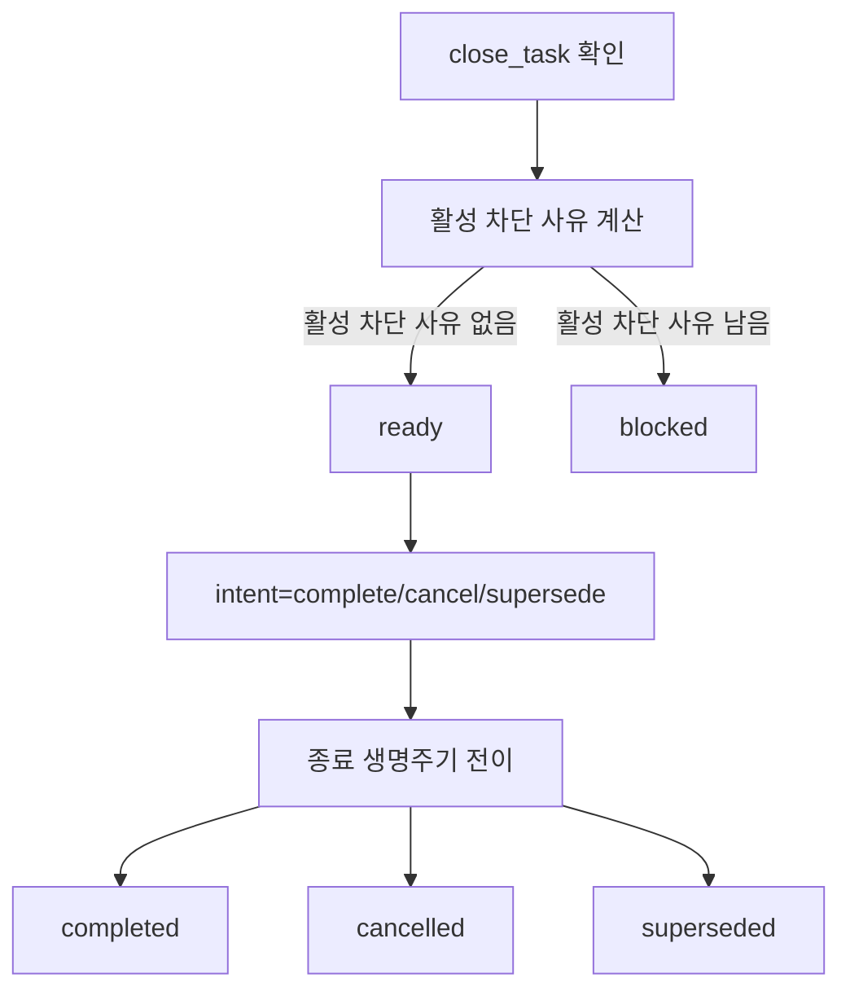

# 현재 MVP API

## 이 문서로 할 수 있는 일

현재 MVP의 활성 API 표면을 확인할 때 이 참조를 사용합니다. 이 문서는 [API Schema Core](schema-core.md#current-mvp-value-sets)가 담당하는 활성 메서드 이름 값 집합에 대해 메서드별 요청, 응답, 상태 효과, 저장소 담당 문서, 오류, 보안 경계를 담당합니다.

이 문서는 향후 하네스 서버 동작을 계획하고 검토하기 위한 참조입니다. 현재 저장소에는 하네스 런타임이나 서버 구현이 없습니다. 향후 API와 스키마 후보는 활성 API 참조가 아니라 [Later 후보 색인](../../later/index.md)에 둡니다. 저장소 DDL과 전체 공용 스키마 본문은 이 메서드 참조가 아니라 해당 담당 문서가 담당합니다.

## 핵심 생각

활성 MVP API는 사용자 작업 루프 하나를 위한 작은 로컬 MCP 접점입니다. 작업을 받아들이고, 상태를 보여 주고, 활성 범위를 갱신하고, 제품 파일 쓰기가 현재 Core 상태와 맞는지 확인하고, 실행과 증거 참조를 기록하고, 사용자 소유 판단을 묻고 기록하며, 활성 차단 사유가 허용할 때만 닫습니다.

이 API는 OS 권한, 임의 도구 샌드박스, 변조 방지 파일, 도구 실행 전 차단, 보안 격리를 제공하지 않습니다. `harness.prepare_write`는 협력형 하네스 기록/확인만 반환합니다.

요구사항 구체화는 활성 Task, Change Unit, `user_judgment`, 증거 요약, 차단 사유 경로를 사용합니다. 모호한 요청을 안전한 첫 Change Unit으로 옮기기 위해 별도의 활성 Discovery Brief, Question Queue, Assumption Register, 또는 비슷한 커밋된 계획 아티팩트를 도입하면 안 됩니다.

<a id="active-mvp-method-behavior"></a>

## 현재 MVP 메서드 동작

정확한 활성 메서드 이름 값 집합은 [API Schema Core](schema-core.md#current-mvp-value-sets)가 담당합니다. 이 문서는 그 현재 메서드들의 동작을 담당합니다.

| 메서드 | 활성 역할 |
|---|---|
| [`harness.intake`](#harnessintake) | 평소 사용자 작업을 시작, 재개, 분류합니다. |
| [`harness.status`](#harnessstatus) | 현재 상태 요약, 차단 사유, 대기 중인 판단, 증거 요약, 닫기 상태, 다음 안전한 행동을 반환합니다. |
| [`harness.update_scope`](#harnessupdate_scope) | `harness.intake` 이후 활성 Task 범위와 활성 Change Unit을 갱신합니다. |
| [`harness.prepare_write`](#harnessprepare_write) | 제안된 제품 쓰기를 현재 범위, 상태, 민감 동작 승인, baseline, 접점 역량과 비교합니다. |
| [`harness.record_run`](#harnessrecord_run) | shaping, direct, implementation 작업과 간결한 증거/아티팩트 참조를 기록합니다. |
| [`harness.request_user_judgment`](#harnessrequest_user_judgment) | 대기 중인 사용자 소유 판단 요청 하나를 만듭니다. |
| [`harness.record_user_judgment`](#harnessrecord_user_judgment) | 기존 대기 중인 `UserJudgment`에 대한 사용자의 답을 기록합니다. |
| [`harness.close_task`](#harnessclose_task) | 닫기 준비 상태를 확인하고, 차단 사유가 허용할 때만 `complete`, `cancel`, `supersede` intent를 처리합니다. |

메서드별 상태 효과는 아래 표가 고정합니다. 여기서 "이벤트 생성",
"`tool_invocations` 재실행 행 생성", "`state_version` 증가"는 새로 커밋된
non-dry-run 상태 변경을 뜻합니다. 멱등 재실행은 기존 커밋 응답을 반환하며 두 번째
이벤트, 재실행 행, 버전 증가를 만들지 않습니다. 커밋된 차단 응답은 "커밋된 차단
응답 허용 여부" 셀이 예라고 말하는 행에서만 이런 효과를 가질 수 있습니다.

| 메서드 | 읽기 전용 또는 상태 변경 | `dry_run` 허용 여부 | `idempotency_key` 필요 여부 | `expected_state_version` 필요 여부 | 커밋된 차단 응답 허용 여부 | 이벤트 생성 여부 | `tool_invocations` 재실행 행 생성 여부 | `state_version` 증가 여부 |
|---|---|---|---|---|---|---|---|---|
| `harness.intake` | 상태 변경 | 예. 커밋하지 않음 | non-dry-run에는 필요 | non-dry-run에는 필요 | 예. 이 메서드가 쓰기 준비 경로 대신 구체화/차단 사유 상태를 커밋할 때 | 예. 커밋 시 | 예. 첫 커밋 시 | 예. 커밋 시 |
| `harness.status` | 읽기 전용 | 예. 상태 차이는 없음 | 필요 없음 | 필요 없음. `null` 가능 | 아니요. 차단 사유는 계산된 응답 필드일 뿐입니다. | 아니요 | 아니요 | 아니요 |
| `harness.update_scope` | 상태 변경 | 예. 커밋하지 않음 | non-dry-run에는 필요 | non-dry-run에는 필요 | 예. 메서드가 소유한 차단 사유 또는 현재 행 갱신에 한정합니다. 충족되지 않은 선행조건이 범위 권한을 만들지는 않습니다. | 예. 커밋 시 | 예. 첫 커밋 시 | 예. 커밋 시 |
| `harness.prepare_write` | 상태 변경 | 예. 커밋하지 않음 | non-dry-run에는 필요 | non-dry-run에는 필요 | 예. 커밋된 `blocked`, `approval_required`, `decision_required` 차단 사유 갱신에 한정합니다. 소비 가능한 Write Authorization은 만들지 않습니다. | 예. 커밋된 `allowed` 또는 커밋된 차단 사유 갱신 시 | 예. 커밋된 `allowed` 또는 커밋된 차단 사유 갱신의 첫 커밋 시 | 예. 커밋된 `allowed` 또는 커밋된 차단 사유 갱신 시 |
| `harness.record_run` | 상태 변경 | 예. 커밋하지 않음 | non-dry-run에는 필요 | non-dry-run에는 필요 | 예. 호환되는 Run 또는 Run 관련 차단 사유 상태를 기록할 때만 허용합니다. 거부된 시도는 커밋 전 실패입니다. | 예. 커밋 시 | 예. 첫 커밋 시 | 예. 커밋 시 |
| `harness.request_user_judgment` | 상태 변경 | 예. 커밋하지 않음 | non-dry-run에는 필요 | non-dry-run에는 필요 | 별도 차단 응답 커밋은 없습니다. 대기 중인 판단 경로를 커밋하거나 커밋 전 실패가 됩니다. | 예. 커밋 시 | 예. 첫 커밋 시 | 예. 커밋 시 |
| `harness.record_user_judgment` | 상태 변경 | 예. 커밋하지 않음 | non-dry-run에는 필요 | non-dry-run에는 필요 | 예. 지정된 판단을 rejected, deferred, blocked 또는 차단 사유를 만드는 상태로 커밋할 때 | 예. 커밋 시 | 예. 첫 커밋 시 | 예. 커밋 시 |
| `harness.close_task intent=check` | 읽기 전용 | 예. 상태 차이는 없음 | 필요 없음 | 필요 없음. `null` 가능 | 아니요. 닫기 차단 사유는 계산된 응답 필드일 뿐입니다. | 아니요 | 아니요 | 아니요 |
| `harness.close_task intent=complete/cancel/supersede` | 상태 변경 | 예. 커밋하지 않음 | non-dry-run에는 필요 | non-dry-run에는 필요 | 예. Task를 열린 상태로 둔 채 닫기 차단 사유를 저장할 때 | 예. 종료 커밋 또는 커밋된 차단 닫기 시 | 예. 종료 커밋 또는 커밋된 차단 닫기의 첫 커밋 시 | 예. 종료 커밋 또는 커밋된 차단 닫기 시 |

<a id="shared-request-rules"></a>

## 공통 요청 규칙

모든 메서드는 [`ToolEnvelope`](schema-core.md#tool-envelope)와 [`ToolResponseBase`](schema-core.md#common-response)를 사용합니다. 커밋되는 non-dry-run 상태 변경 호출은 non-null `idempotency_key`와 현재 `expected_state_version`을 요구합니다. `harness.status`, `harness.close_task intent=check`, `dry_run` 호출은 `idempotency_key: null`과 `expected_state_version: null`을 사용할 수 있습니다.

메서드에 도구별 `task_id`가 있으면 Core는 도구별 `task_id`, `ToolEnvelope.task_id`, 활성 Task 순서로 주 Task를 찾습니다. Task 범위 변경은 `expected_state_version`을 `tasks.state_version`과 비교합니다. 선택된 Task가 없는 프로젝트 범위 상태 변경은 `project_state.state_version`과 비교합니다.

읽기 전용 호출은 차단 사유, 닫기 차단 사유, 다음 행동, 진단을 계산해 반환할 수 있습니다. 하지만 그 값은 응답 필드일 뿐입니다. 차단 사유를 저장하거나, `task_events`를 추가하거나, `tool_invocations` 재실행 행을 만들거나, `state_version`을 올리면 안 됩니다.

`dry_run=true`는 기준 권한이 아닙니다. 진단, 후보 차단 사유, 변경 예상 결과를 반환할 수 있지만 현재 기록, `task_events` 행, 아티팩트, Write Authorization, 증거 요약, 닫기 상태, `tool_invocations` 재실행 행, 상태 버전 증가를 만들지 않습니다.

`tool_invocations` 재실행 행은 커밋된 non-dry-run 상태 변경만 만듭니다. 같은 `idempotency_key`와 같은 요청 해시의 재실행은 기존 커밋 응답을 반환합니다. 같은 키를 다른 요청 해시와 함께 쓰면 `STATE_CONFLICT`를 반환합니다. `dry_run` 호출과 커밋 전 실패는 재실행 행을 만들거나 예약하지 않습니다.

오류 코드, 기본 오류 우선순위, 멱등성, 오래된 상태 처리, 닫기 차단 사유 순서, 사용자 표시 오류 라벨은 [API Errors](errors.md)가 담당합니다. 공용 스키마와 활성 값 집합은 [API Schema Core](schema-core.md)가 담당합니다.

로컬 접근 분류는 하네스 API 호환성 분류이지 OS 권한 분류가 아닙니다. 모든 분류는 `surface_id`가 같은 `project_id`에 등록된 `surfaces` 행을 가리켜야 하며, API가 그 접점에 의존하려면 `surfaces.status=active`여야 합니다. 상태를 바꾸는 분류는 `surfaces.local_access_posture=registered_local`도 요구합니다. 적용되는 경우 `project_id`, `surface_id`, `task_id`, `expected_state_version`은 보호된 상태 읽기에 의존하거나 변경을 커밋하기 전에 서로 호환되어야 합니다.

| 접근 분류 | 포함하는 동작 | 최소 접근 조건 |
|---|---|---|
| `read_status` | `harness.status`, 읽기 전용 상태 리소스, `harness.close_task intent=check` 같은 읽기 전용 닫기 확인. | 같은 프로젝트에 등록된 `surface_id`, `surfaces.status=active`, 요청한 읽기에 필요한 Core/접점 경로 도달 가능성, Task 범위 읽기라면 호환되는 `task_id`가 필요합니다. 상태 읽기는 표시해도 안전한 가용성 또는 불일치 진단을 반환할 수 있지만, 오래된 텍스트에서 상태를 만들어 내거나 로컬 접근을 확인할 수 없을 때 보호되어야 할 Core 세부정보를 노출하면 안 됩니다. |
| `core_mutation` | `harness.intake`, `harness.update_scope`, `harness.request_user_judgment`, `harness.record_user_judgment`, 상태를 끝내는 `harness.close_task` intent. | `read_status` 조건에 더해 `surfaces.local_access_posture=registered_local`, non-dry-run 커밋에는 non-null `idempotency_key`와 현재 `expected_state_version`, 적용되는 경우 호환되는 `project_id`, `surface_id`, `task_id`, 담당 기록이 필요합니다. |
| `write_authorization` | `harness.prepare_write`. | `core_mutation` 조건에 더해 의도한 attempt에 필요한 활성 Task/Change Unit 호환성, 범위, baseline, 민감 동작, 역량 확인이 필요합니다. |
| `run_recording` | `harness.record_run`. | `core_mutation` 조건에 더해 호환되는 `task_id`, `change_unit_id`, `baseline_ref`, 관찰된 시도 사실, 그리고 제품 쓰기를 기록하는 Run이면 소비 가능한 활성 Write Authorization이 필요합니다. |
| `artifact_registration` | `harness.record_run`이 받는 `ArtifactInput[]`. | `run_recording` 조건에 더해 문서화된 `staged_file`, `captured_artifact`, `existing_artifact` 핸들만 받을 수 있습니다. `captured_artifact`에는 문서화된 캡처 핸들 경로가 필요하고, 활성 접점이 그 핸들을 제시할 수 있어야 합니다. 호출자가 임의로 준 파일시스템 경로, 원시 비밀값, 토큰, 민감한 전체 로그, 원시 캡처 어댑터 출력, 접점 자체 캡처 주장은 기준 프로필의 등록 권한으로 인정하지 않습니다. |
| `artifact_read` | 등록된 `ArtifactRef`에서 담당 경로가 노출하는 로컬 아티팩트 메타데이터 또는 본문 읽기. | 같은 프로젝트에 등록된 `surface_id`, `surfaces.status=active`, 본문 읽기에는 `surfaces.local_access_posture=registered_local`, 등록된 `ArtifactRef`, 호환되는 `project_id`/`task_id`, 필요한 가림/가용성 확인, `artifact_links`의 일치하는 담당 관계가 필요합니다. 원시 아티팩트 경로 읽기는 기본으로 허용되지 않습니다. |

필요한 MCP/Core 또는 접점 도달 가능성 자체가 없으면 `MCP_UNAVAILABLE`을 사용합니다. 등록된 로컬 접근 기대가 도달 가능한 호출자, 경로, 태세와 맞지 않거나 로컬 접근이 철회되었으면 `LOCAL_ACCESS_MISMATCH`를 사용합니다. 접점은 인식되었지만 접근 분류, 관찰, 캡처, 차단/격리 주장, 활성 동작에 필요한 역량이 없으면 `CAPABILITY_INSUFFICIENT`를 사용합니다.

<a id="harnessintake"></a>

## `harness.intake`

- **담당:** Task 시작/재개/분류와 쓰기 가능한 작업의 초기 범위 후보.
- **담당하지 않음:** 이후 활성 범위 갱신, 이후 활성 Change Unit 갱신, 제품 쓰기, 증거 충분성, 사용자 판단 해결, Write Authorization, 최종 수락, 잔여 위험 수락, 닫기.
- **호출 시점:** 평소 작업을 시작할 때, 또는 기존 활성 Task를 resume, supersede, reject해야 할 때.
- **요청:**

```yaml
IntakeRequest:
  envelope: ToolEnvelope
  user_request: string
  requested_mode: advisor | direct | work | auto
  resume_policy: resume_active | create_new | supersede_active | reject_if_active
  acceptance_criteria: string[]
  constraints:
    allowed_paths: string[]
    non_goals: string[]
    sensitive_categories: string[]
  initial_context_refs: StateRecordRef[]
```

`requested_mode`는 호출자가 `harness.intake`에서 요청하는 `mode`입니다. `advisor`는 제품 쓰기 없는 조언, 검토, 계획을 뜻합니다. `direct`는 작은 직접 변경을 뜻합니다. `work`는 추적되는 작업을 뜻합니다. `auto`는 입력 전용입니다. 서버가 `user_request`를 분류해 Task 상태를 저장하거나 표시하기 전에 `advisor`, `direct`, `work` 중 정확히 하나의 구체적 `mode`로 확정하라는 요청입니다.

- **응답:**

```yaml
IntakeResponse:
  base: ToolResponseBase
  task_ref: StateRecordRef
  change_unit_ref: StateRecordRef | null
  state: StateSummary
  next_actions: NextActionSummary[]
```

`IntakeResponse.state.mode`는 확정된 구체적 `mode`를 보여 줍니다. `auto`가 될 수 없습니다. 이후 상태 요약도 `harness.intake` 요청 값을 그대로 보여 주지 않고 확정된 `mode`를 노출해야 합니다.

- **상태 효과:** 커밋된 non-dry-run 호출은 `tasks`를 만들거나 재개하고, `project_state.active_task_id`를 설정하며, 쓰기 가능한 확정된 `direct` 또는 `work`에 초기 범위 후보를 `change_units`에 만들고, 차단 사유를 업데이트하고, 이벤트와 커밋된 `tool_invocations` 재실행 행을 만들며, 영향을 받은 상태 시계를 올릴 수 있습니다. 요청이 아직 쓰기 가능한 상태가 아니라면 Task는 `lifecycle_phase=shaping`으로 남거나 그 상태가 되고, 현재 목표 요약, 알려진 범위와 범위 밖 항목, 필요할 때 막히는 질문 하나, 다음 안전한 행동 하나를 활성 Task, Change Unit, 사용자 판단, 증거, 차단 사유 필드로 표현합니다. 요청이 이미 쓰기 가능한 작업으로 충분히 구체적이면 `harness.intake`가 준비 경로에 필요한 초기 범위를 만들 수 있지만, 첫 제품 쓰기는 여전히 `harness.prepare_write`가 필요합니다. 활성 목표, 범위 경계, 범위 밖 항목, 수락 기준, 자율성 경계, baseline, 활성 Change Unit의 이후 변경은 `harness.update_scope`가 담당합니다. 메서드 이름은 지속 저장되는 생명주기 값이 아닙니다. 새로 만들거나 재개한 Task는 [API Schema Core](schema-core.md#current-mvp-value-sets)의 활성 `Task.lifecycle_phase` 값 집합을 사용해야 합니다. `dry_run`과 커밋 전 실패는 이를 만들지 않고 `state_version`도 올리지 않습니다.
- **오류:** `VALIDATION_FAILED`, `STATE_CONFLICT`, `MCP_UNAVAILABLE`, `LOCAL_ACCESS_MISMATCH`, `NO_ACTIVE_TASK`, `VALIDATOR_FAILED`.
- **저장소 담당 문서:** `project_state`, `tasks`, `change_units`, `blockers`, `task_events`, `tool_invocations`.
- **보안 경계:** `harness.intake`는 범위와 확정된 구체적 `mode`를 기록합니다. 로컬 접근, 민감 동작, 제품 쓰기, 더 강한 보장 수준을 승인하지 않습니다.

<a id="harnessupdate_scope"></a>

## `harness.update_scope`

- **담당:** `harness.intake` 이후 활성 Task의 목표 요약, 범위 경계, 범위 밖 항목, 수락 기준, 자율성 경계, baseline 참조, 활성 Change Unit 갱신.
- **담당하지 않음:** Task 시작/분류, 사용자 판단 해결, 제품 쓰기, 증거, Write Authorization 생성, Run 기록, 최종 수락, 잔여 위험 수락, 닫기.
- **호출 시점:** 구체화 결과로 활성 범위가 바뀔 때, 해결된 `judgment_kind=scope_decision`을 적용해야 할 때, 또는 쓰기 호환성을 확인하기 전에 활성 Change Unit이나 baseline을 만들거나 교체해야 할 때.
- **요청:**

```yaml
UpdateScopeRequest:
  envelope: ToolEnvelope
  task_id: string
  goal_summary: string | null
  scope_boundary: string | null
  non_goals: string[] | null
  acceptance_criteria: string[] | null
  autonomy_boundary: string | null
  baseline_ref: string | null
  change_unit:
    operation: keep_active | create_active | replace_active
    scope_summary: string | null
    affected_areas: string[]
    affected_paths: string[]
    constraints: string[]
  related_scope_decision_refs: StateRecordRef[]
```

최상위 범위 갱신 필드에서 `null`은 현재 값을 그대로 둔다는 뜻입니다. 빈 배열은 해당 목록을 빈 목록으로 교체합니다. `affected_areas`는 아직 구체 경로를 정직하게 말하기 어려울 때 제품 또는 저장소 영향 영역을 이름 붙입니다. `affected_paths`는 알고 있는 허용 경로 후보나 정확한 의도 경로를 이름 붙입니다. `create_active`와 `replace_active`는 새 활성 경계를 세울 만큼 충분한 non-null Change Unit 범위를 제공해야 합니다.

`related_scope_decision_refs`는 `judgment_kind=scope_decision`인 해결된 `user_judgment` 기록을 연결할 수 있습니다. 이 참조는 범위가 바뀐 이유를 설명합니다. 참조 자체가 범위를 바꾸지는 않습니다.

- **응답:**

```yaml
UpdateScopeResponse:
  base: ToolResponseBase
  task_ref: StateRecordRef
  change_unit_ref: StateRecordRef | null
  linked_scope_decision_refs: StateRecordRef[]
  stale_write_authorization_refs: StateRecordRef[]
  blocker_refs: StateRecordRef[]
  state: StateSummary
  next_actions: NextActionSummary[]
```

- **상태 효과:** 커밋된 non-dry-run 호출은 활성 Task 구체화 필드, 활성 `change_units` 행 생성 또는 교체, `tasks.active_change_unit_id`, 관련 `scope_decision` 사용자 판단 참조 연결, 차단 사유, 이벤트, 커밋된 재실행 행을 업데이트하고 영향을 받은 상태 시계를 올릴 수 있습니다. 이 갱신은 현재 목표 요약, 활성 범위 요약, 허용 경로 또는 영향 영역, 범위 밖 항목, 수락 기준, 자율성 경계, 필요한 사용자 소유 판단, 막히는 질문이 있다면 그 질문, 다음 안전한 행동, 증거 기대 또는 증거 공백, 닫기 차단 사유가 담당 상태에 표현됐을 때 모호한 요청을 쓰기 가능한 첫 Change Unit으로 바꾸는 활성 경로입니다. 갱신된 Task, Change Unit, baseline, 범위 경계, 범위 밖 항목, 수락 기준, 자율성 경계가 활성 Write Authorization과 더 이상 맞지 않으면 Core는 해당 Write Authorization을 `status=stale`로 표시합니다. 소비하거나, 취소하거나, 만료시키거나, 조용히 재사용하지 않습니다. `dry_run`과 커밋 전 실패는 현재 기록, 범위 변경, `stale` 처리된 Write Authorization, 이벤트, 아티팩트, 증거 요약, 재실행 행, 상태 버전 증가를 만들지 않습니다.
- **오류:** `VALIDATION_FAILED`, `STATE_CONFLICT`, `NO_ACTIVE_TASK`, `NO_ACTIVE_CHANGE_UNIT`, `SCOPE_REQUIRED`, `SCOPE_VIOLATION`, `DECISION_REQUIRED`, `DECISION_UNRESOLVED`, `AUTONOMY_BOUNDARY_EXCEEDED`, `CAPABILITY_INSUFFICIENT`, `MCP_UNAVAILABLE`, `LOCAL_ACCESS_MISMATCH`, `BASELINE_STALE`, `VALIDATOR_FAILED`.
- **저장소 담당 문서:** `tasks`, `change_units`, `write_authorizations`, `blockers`, `task_events`, `tool_invocations`.
- **보안 경계:** 범위 갱신은 하네스 기록만 바꿉니다. Write Authorization을 만들거나, OS 권한을 부여하거나, 민감 동작을 승인하거나, 증거를 기록하거나, 작업을 닫지 않습니다. 오래된 Write Authorization은 제품 쓰기를 기록하기 전에 `harness.prepare_write`로 새로 확인해야 합니다.

<a id="harnessstatus"></a>

## `harness.status`

- **담당:** Core 상태와 참조를 읽어 만든 읽기 전용 현재 위치 출력.
- **담당하지 않음:** 상태 변경, 읽기용 보기 복구, 쓰기 호환성, 증거 생성, 사용자 판단 해결, 최종 수락, 잔여 위험 수락, 닫기.
- **호출 시점:** 다음 행동을 정하기 전, 상태를 바꾸는 호출 이후, 또는 차단 사유, 대기 중인 판단, 증거 요약, 쓰기 권한 요약, 닫기 상태, 보장 표시가 필요할 때.
- **요청:**

```yaml
StatusRequest:
  envelope: ToolEnvelope
  include:
    task: boolean
    pending_user_judgments: boolean
    write_authority: boolean
    evidence: boolean
    close: boolean
    guarantees: boolean
```

- **응답:**

```yaml
StatusResponse:
  base: ToolResponseBase
  active_task: StateSummary | null
  status_card: string
  next_actions: NextActionSummary[]
  pending_user_judgments: StateRecordRef[]
  write_authority_summary: WriteAuthoritySummary | null
  evidence_summary: EvidenceSummary | null
  blocker_refs: StateRecordRef[]
  close_state: ready | blocked | closed | cancelled | superseded | none
  close_blockers: CloseBlocker[]
  guarantee_display: GuaranteeDisplay
```

- **상태 효과:** 없습니다. `harness.status`는 응답에 차단 사유, 닫기 차단 사유, 다음 행동, 진단을 계산해 담을 수 있지만 이를 저장하지 않고, 이벤트를 추가하지 않고, `tool_invocations` 재실행 행을 만들지 않으며, `state_version`을 올리지 않습니다.
- **구체화 표시:** 상태는 현재 생명주기 위치를 정직하게 보여줘야 합니다. `shaping`은 요청이 아직 쓰기 가능한 상태가 아니라는 뜻입니다. `waiting_user`는 다음 안전한 행동 전에 사용자 소유 판단 하나가 필요하다는 뜻입니다. `ready`는 쓰기 가능한 작업에 활성 Change Unit이 있고 쓰기 전 확인으로 이동할 수 있다는 뜻입니다. `blocked`는 활성 차단 사유가 진행을 막는다는 뜻입니다. 읽기 전용 작업도 다음 읽기 전용 행동을 할 만큼 준비될 수 있지만, 이것이 쓰기 호환성을 뜻하지는 않습니다. 응답은 질문이 정말 막고 있을 때 막히는 질문 하나와 주된 다음 안전한 행동 하나를 우선해야 합니다. 참고용 호기심 질문은 차단 사유가 아닙니다.
- **닫기 상태 경계:** 활성 닫기 상태가 없을 때만 `StatusResponse.close_state`에 `none`을 사용할 수 있습니다. `CloseTaskResponse.close_state`는 `ready`, `blocked`, `closed`, `cancelled`, `superseded`만 사용합니다.
- **오류:** `MCP_UNAVAILABLE`, `LOCAL_ACCESS_MISMATCH`, `CAPABILITY_INSUFFICIENT`, `NO_ACTIVE_TASK`, 요청한 읽기용 보기가 오래됐거나 사용할 수 없으면 `PROJECTION_STALE`.
- **저장소 담당 문서:** `project_state`, `tasks`, `change_units`, `user_judgments`, `write_authorizations`, `runs`, `evidence_summaries`, `artifacts`, `artifact_links`, `blockers`를 읽기 전용으로 읽습니다.
- **보안 경계:** 승격된 프로필이 없으면 `harness.status`는 현재 MVP `GuaranteeDisplay.level` 값인 `cooperative` 또는 `detective`만 표시합니다. `preventive`와 `isolated`는 later/profile-gated 표시 이름이며 현재 MVP 스키마 값이 아닙니다. 최신이 아닌 상태 텍스트, 대화, 렌더링된 보기, 캐시된 요약은 권한 근거가 아닙니다.

<a id="harnessprepare_write"></a>

## `harness.prepare_write`

- **담당:** 협력형 쓰기 전 범위 확인과 제안된 시도가 호환될 때 오래 남는 1회용 Write Authorization.
- **담당하지 않음:** OS 권한, 샌드박스, 변조 방지 강제, 도구 실행 전 차단, 사용자 판단 생성, 증거 충분성, Run 기록, 닫기.
- **호출 시점:** 제품 파일 쓰기 또는 쓰기 가능한 동작 직전에, 현재 Task, Change Unit, baseline, 민감 동작 승인, 접점 역량과 맞는지 확인해야 할 때.
- **요청:**

```yaml
PrepareWriteRequest:
  envelope: ToolEnvelope
  task_id: string | null
  change_unit_id: string | null
  intended_operation: string
  intended_paths: string[]
  product_file_write_intended: boolean
  sensitive_categories: string[]
  baseline_ref: string | null
```

- **응답:**

```yaml
PrepareWriteResponse:
  base: ToolResponseBase
  decision: allowed | blocked | approval_required | decision_required | state_conflict
  state: StateSummary | null
  write_authorization_ref: StateRecordRef | null
  write_authorization: WriteAuthorizationSummary | null
  authorization_effect: none | would_create | created | returned
  active_user_judgment_refs: StateRecordRef[]
  blocked_reasons: CloseBlocker[]
  user_judgment_candidate: UserJudgmentCandidate | null
  guarantee_display: GuaranteeDisplay
```

- **상태 효과:** 커밋된 non-dry-run `decision=allowed`는 활성 경로 수준 `AuthorizedAttemptScope`에 대해 `write_authorizations.status=active` 행 하나를 만들고, 이벤트를 추가하고, 재실행 행을 만들며, 영향을 받은 상태 시계를 올립니다. 커밋된 `blocked`, `approval_required`, `decision_required` 응답은 차단 사유를 업데이트하고, 이벤트를 추가하고, 재실행 행을 만들고, 영향을 받은 상태 시계를 올릴 수 있습니다. 하지만 소비 가능한 Write Authorization은 만들면 안 됩니다. `dry_run`과 커밋 전 실패는 현재 기록, Write Authorization, `blockers` 행, 이벤트, 아티팩트, 증거 요약, 재실행 행, 상태 버전 증가를 만들지 않습니다.
- **오류:** `VALIDATION_FAILED`, `STATE_CONFLICT`, `NO_ACTIVE_TASK`, `NO_ACTIVE_CHANGE_UNIT`, `SCOPE_REQUIRED`, `SCOPE_VIOLATION`, `DECISION_REQUIRED`, `AUTONOMY_BOUNDARY_EXCEEDED`, `APPROVAL_REQUIRED`, `APPROVAL_DENIED`, `APPROVAL_EXPIRED`, `CAPABILITY_INSUFFICIENT`, `MCP_UNAVAILABLE`, `LOCAL_ACCESS_MISMATCH`, `BASELINE_STALE`, `VALIDATOR_FAILED`.
- **저장소 담당 문서:** `write_authorizations`, `blockers`, `tasks` 또는 `project_state` 버전 시계, `task_events`, `tool_invocations`.
- **보안 경계:** `decision=allowed`는 이 경로 수준 제품 쓰기 시도가 하네스 기록과 호환된다는 뜻입니다. 운영체제가 호환되지 않는 쓰기를 막거나 임의 도구가 격리된다는 뜻이 아닙니다. 현재 MVP 요청이 명령, 네트워크, 비밀값 접근, 아티팩트 캡처, 도구 실행 전 차단, 격리에 대한 보장을 요구하면 활성 접점에 역량이 없을 때 `CAPABILITY_INSUFFICIENT`를 반환하고, 요청 형태나 요구한 보장이 활성 프로필에 유효하지 않으면 `VALIDATION_FAILED`를 반환해야 합니다. 활성 `PrepareWriteRequest`는 위에 적은 경로 수준 필드만 포함하며 명령, 네트워크, 비밀값 관찰 범위를 인코딩하지 않습니다.

<a id="harnessrecord_run"></a>

## `harness.record_run`

- **담당:** Run 기록, 호환되는 Write Authorization 소비, 아티팩트 등록, 간결한 증거 요약 업데이트, Run 관련 차단 사유.
- **담당하지 않음:** 새 범위, 사용자 판단 해결, 최종 수락, 잔여 위험 수락, 별도 보증 기록, 닫기.
- **호출 시점:** 구체화 작업, 직접 답변/결과, 구현 작업이 끝난 뒤. 제품 쓰기 Run은 `harness.prepare_write`가 반환한 호환되는 활성 Write Authorization을 제공해야 합니다.
- **요청:**

```yaml
RecordRunRequest:
  envelope: ToolEnvelope
  task_id: string | null
  change_unit_id: string | null
  kind: shaping_update | implementation | direct
  run_id: string | null
  baseline_ref: string | null
  write_authorization_id: string | null
  summary: string
  observed_changes: ObservedChanges
  artifact_inputs: ArtifactInput[]
  evidence_updates: EvidenceCoverageItem[]
```

- **응답:**

```yaml
RecordRunResponse:
  base: ToolResponseBase
  run_summary: RunSummary
  registered_artifacts: ArtifactRef[]
  evidence_summary: EvidenceSummary | null
  blocker_refs: StateRecordRef[]
  state: StateSummary
```

- **상태 효과:** 호환되는 커밋 호출은 `runs`, `artifacts`, `artifact_links`, `evidence_summaries`를 만들고, Run 관련 차단 사유를 업데이트하고, `write_authorizations.status=active`를 소비하고, 이벤트와 커밋된 재실행 행을 만들며, 영향을 받은 상태 시계를 올릴 수 있습니다. 제품 쓰기 Run은 저장된 Write Authorization과 관찰된 변경 경로가 호환될 때만 활성 Write Authorization을 소비합니다. 거부된 호출과 커밋 전 실패는 Run 생성, 아티팩트 등록, 증거 업데이트, 유효하지 않은 Write Authorization 소비, 이벤트 추가, 재실행 행 생성, `state_version` 증가를 하면 안 됩니다.
- **오류:** `VALIDATION_FAILED`, `STATE_CONFLICT`, `NO_ACTIVE_TASK`, `NO_ACTIVE_CHANGE_UNIT`, `WRITE_AUTHORIZATION_REQUIRED`, `WRITE_AUTHORIZATION_INVALID`, `SCOPE_VIOLATION`, `CAPABILITY_INSUFFICIENT`, `MCP_UNAVAILABLE`, `LOCAL_ACCESS_MISMATCH`, `BASELINE_STALE`, `ARTIFACT_MISSING`, `EVIDENCE_INSUFFICIENT`, `VALIDATOR_FAILED`.
- **저장소 담당 문서:** `runs`, `write_authorizations`, `artifacts`, `artifact_links`, `evidence_summaries`, `blockers`, `task_events`, `tool_invocations`.
- **보안 경계:** Run은 접점이 관찰한 사실을 기록할 수 있습니다. 기준 `reference-local-mcp` 프로필에서 제품 쓰기 호환성은 관찰된 변경 경로에 대해서만 탐지형이며, 제품 쓰기 Run은 그 경로 수준 호환성이 있을 때만 활성 Write Authorization을 소비합니다. 활성 접점이 관찰할 수 없는 명령 실행, 네트워크 활동, 비밀값 접근, 아티팩트 캡처, 차단, 격리 사실을 API가 검증됨으로 표시하면 안 됩니다.

<a id="harnessrequest_user_judgment"></a>

## `harness.request_user_judgment`

- **담당:** 하나의 집중된 사용자 소유 판단에 대한 대기 중인 `UserJudgment` 생성.
- **담당하지 않음:** 사용자의 답, 활성 범위 변경, 활성 Change Unit 변경, 민감 동작 승인, Write Authorization, 증거, 최종 수락, 잔여 위험 수락, 닫기.
- **호출 시점:** 진행, 쓰기 호환성, 수락, 위험 처리, 닫기가 기존 기록에서 추론할 수 없는 사용자 소유 판단에 의존할 때.
- **요청:**

```yaml
RequestUserJudgmentRequest:
  envelope: ToolEnvelope
  task_id: string | null
  change_unit_id: string | null
  judgment_kind: product_decision | technical_decision | scope_decision | sensitive_approval | final_acceptance | residual_risk_acceptance | cancellation
  presentation: short
  question: string
  options: UserJudgmentOption[]
  context: UserJudgmentContext
  affected_refs: StateRecordRef[]
  required_for: next_action | write | run | close | acceptance | risk
  expires_at: string | null
```

- **응답:**

```yaml
RequestUserJudgmentResponse:
  base: ToolResponseBase
  user_judgment_ref: StateRecordRef
  user_judgment: UserJudgment
  blocker_refs: StateRecordRef[]
  state: StateSummary
```

- **상태 효과:** 커밋된 non-dry-run 호출은 대기 중인 `user_judgments` 행 하나를 만들고, 영향을 받는 차단 사유를 연결하거나 업데이트할 수 있으며, 이벤트와 재실행 행을 만들고, 영향을 받은 상태 시계를 올립니다. 다른 메서드가 반환한 후보는 이 메서드가 커밋되기 전까지 대기 중인 판단이 아닙니다. `dry_run`과 커밋 전 실패는 대기 중인 판단, 차단 사유 갱신, 이벤트, 재실행 행, 상태 버전 증가를 만들지 않습니다.
- **오류:** `VALIDATION_FAILED`, `STATE_CONFLICT`, `NO_ACTIVE_TASK`, `DECISION_REQUIRED`, `DECISION_UNRESOLVED`, `MCP_UNAVAILABLE`, `LOCAL_ACCESS_MISMATCH`, `CAPABILITY_INSUFFICIENT`, `VALIDATOR_FAILED`.
- **저장소 담당 문서:** `user_judgments`, `blockers`, `task_events`, `tool_invocations`.
- **보안 경계:** 이 요청은 질문을 표시합니다. `harness.record_user_judgment`가 맞는 답변을 기록하기 전에는 권한을 부여하거나 관문을 만족하지 않습니다. `scope_decision` 답변도 활성 범위나 활성 Change Unit을 바꾸려면 `harness.update_scope`가 필요합니다.

<a id="harnessrecord_user_judgment"></a>

## `harness.record_user_judgment`

- **담당:** 기존 대기 중인 `UserJudgment`를 해결, 거절, 유예, 차단 상태로 기록.
- **담당하지 않음:** 대기 중인 `judgment_kind`보다 넓은 결정, 활성 범위 변경, 활성 Change Unit 변경, 제품 쓰기, 증거, Write Authorization, 닫기, 명시적으로 묻지 않은 다른 판단.
- **호출 시점:** 사용자가 특정 대기 중인 `UserJudgment`에 답한 뒤.
- **요청:**

```yaml
RecordUserJudgmentRequest:
  envelope: ToolEnvelope
  user_judgment_id: string
  judgment_kind: product_decision | technical_decision | scope_decision | sensitive_approval | final_acceptance | residual_risk_acceptance | cancellation
  selected_option_id: string
  answer: RecordUserJudgmentPayload
  note: string | null
  accepted_risks: AcceptedRiskInput[]
```

`selected_option_id`와 `note`는 요청 수준의 기준 필드입니다. `answer`는 둘 중 어느 것도 반복하지 않고 `RecordUserJudgmentPayload`의 판단 종류별 답변 세부정보만 담습니다.

- **응답:**

```yaml
RecordUserJudgmentResponse:
  base: ToolResponseBase
  user_judgment_ref: StateRecordRef
  user_judgment: UserJudgment
  updated_refs: StateRecordRef[]
  state: StateSummary
  next_actions: NextActionSummary[]
```

- **상태 효과:** 커밋된 non-dry-run 호출은 `user_judgments.status`를 업데이트하고, 요청 수준의 `selected_option_id`, 요청 메모, 답변 세부정보를 기록하고, 관련 차단 사유와 판단에 의존하는 요약만 업데이트하며, 이벤트와 재실행 행을 만들고, 영향을 받은 상태 시계를 올립니다. 활성 Task 범위 필드나 활성 Change Unit은 직접 바꾸지 않습니다. 해결된 `scope_decision` 때문에 범위를 바꿔야 하면 응답의 다음 행동은 `harness.update_scope`를 가리킵니다. 활성 MVP에서는 독립적인 위험 수락 행을 만들지 않습니다. `dry_run`과 커밋 전 실패는 판단 해결, 차단 사유 갱신, 이벤트, 재실행 행, 상태 버전 증가를 만들지 않습니다.
- **오류:** `VALIDATION_FAILED`, `STATE_CONFLICT`, `NO_ACTIVE_TASK`, `DECISION_UNRESOLVED`, `APPROVAL_DENIED`, `APPROVAL_EXPIRED`, `ACCEPTANCE_REQUIRED`, `RESIDUAL_RISK_NOT_VISIBLE`, `MCP_UNAVAILABLE`, `LOCAL_ACCESS_MISMATCH`, `VALIDATOR_FAILED`.
- **저장소 담당 문서:** `user_judgments`, `blockers`, `task_events`, `tool_invocations`.
- **보안 경계:** "go ahead"나 "looks good" 같은 넓은 말은 대기 중인 활성 판단이 그 종류를 명시적으로 묻고 기록된 답변이 맞을 때만 제품 판단, 민감 동작 승인, 최종 수락, 잔여 위험 수락, 취소, 범위 확장으로 작동합니다. 이후 후보에만 있는 판단 값은 현재 MVP의 활성 판단 종류가 아닙니다.

<a id="harnessclose_task"></a>

## `harness.close_task`

- **담당:** 활성 닫기 준비 상태 확인과 차단 사유가 허용할 때 종료 Task를 완료, 취소, supersede 처리.
- **담당하지 않음:** 증거 생성, 사용자 판단 생성, 최종 수락 생성, 잔여 위험 수락 생성, 내보내기, 릴리스 인계, Projection과 보고서 최신성, 활성 차단 사유 밖의 구현 검증.
- **호출 시점:** 작업을 닫을 수 있는지 확인해야 하거나, 사용자가 활성 Task에 `complete`, `cancel`, `supersede` intent를 적용하려 할 때.
- **요청:**

```yaml
CloseTaskRequest:
  envelope: ToolEnvelope
  task_id: string
  intent: check | complete | cancel | supersede
  close_reason: completed_self_checked | completed_with_risk_accepted | cancelled | superseded | null
  superseding_task_id: string | null
  user_note: string | null
```

- **응답:**

```yaml
CloseTaskResponse:
  base: ToolResponseBase
  close_state: ready | blocked | closed | cancelled | superseded
  state: StateSummary
  blockers: CloseBlocker[]
  evidence_summary: EvidenceSummary | null
  artifact_refs: ArtifactRef[]
  next_actions: NextActionSummary[]
```

닫기 관련 개념은 서로 분리됩니다. `Task.lifecycle_phase`는 지속 저장되는 생명주기 필드이며 활성 값은 `shaping`, `ready`, `executing`, `waiting_user`, `blocked`, `completed`, `cancelled`, `superseded`입니다. `CloseTaskResponse.close_state`는 응답 수준의 닫기 상태이며 값은 `ready`, `blocked`, `closed`, `cancelled`, `superseded`입니다. `Task.close_reason`은 닫기 세부 사유를 `none`, `completed_self_checked`, `completed_with_risk_accepted`, `cancelled`, `superseded` 중 하나로 저장합니다. `Task.result`는 `none`, `advice_only`, `completed`, `cancelled`, `superseded` 중 하나의 굵은 결과만 저장합니다. 성공하지 못한 Run, violation, 차단된 닫기, 증거 공백은 Run 상태, `CloseBlocker`, 증거 상태, 현재 Task 상태에 남깁니다.

아래 그림은 활성 `close_task` 판단 흐름을 간단히 보여 주는 보조 자료입니다. `ready`와 `blocked`는 종료 생명주기 업데이트 전에 반환되는 응답 수준의 `CloseTaskResponse.close_state` 결과이고, `completed`, `cancelled`, `superseded`는 종료 `Task.lifecycle_phase` 값입니다.



- **닫기 필드 매핑:** 커밋된 non-dry-run `intent=complete`는 `lifecycle_phase=completed`, `result=completed`로 설정하고 `close_reason=completed_self_checked` 또는 `completed_with_risk_accepted`를 사용합니다. `intent=cancel`은 `lifecycle_phase=cancelled`, `close_reason=cancelled`, `result=cancelled`로 설정합니다. `intent=supersede`는 이전 Task를 `lifecycle_phase=superseded`, `close_reason=superseded`, `result=superseded`로 설정합니다.
- **활성 Task 포인터:** 커밋된 `intent=supersede`에서 이전 Task가 `project_state.active_task_id`라면, `superseding_task_id`가 같은 프로젝트의 유효한 열린 Task를 가리킬 때만 그 값을 `project_state.active_task_id`로 삼아야 합니다. 그렇지 않으면 활성 포인터를 비워야 합니다. superseded된 이전 Task를 active로 남기면 안 됩니다.
- **상태 효과:** `intent=check`는 읽기 전용입니다. 응답에 닫기 차단 사유, 증거 요약, 아티팩트 참조, 다음 행동을 계산해 담을 수 있지만 차단 사유, 이벤트, 재실행 행, 닫기 상태를 저장하지 않고 `state_version`을 올리지 않습니다. 커밋된 non-dry-run 최종 닫기는 `tasks.lifecycle_phase`, `tasks.close_reason`, `tasks.result`, `tasks.closed_at`, 영향을 받는 `change_units`, 차단 사유, 필요한 경우 프로젝트 활성 Task 상태, 이벤트, 재실행, 영향을 받은 상태 시계를 업데이트합니다. 커밋된 차단된 닫기 시도는 차단 사유를 기록하고, 이벤트를 추가하고, 재실행 행을 만들고, 영향을 받은 상태 시계를 올릴 수 있습니다. 하지만 Task는 열린 상태로 둬야 합니다. `dry_run`과 커밋 전 실패는 닫기 상태, `blockers` 행, 이벤트, 재실행 행, 상태 버전 증가를 만들지 않습니다.
- **오류:** `VALIDATION_FAILED`, `STATE_CONFLICT`, `NO_ACTIVE_TASK`, `DECISION_REQUIRED`, `DECISION_UNRESOLVED`, `SCOPE_REQUIRED`, `SCOPE_VIOLATION`, `APPROVAL_REQUIRED`, `APPROVAL_DENIED`, `APPROVAL_EXPIRED`, `EVIDENCE_INSUFFICIENT`, `ARTIFACT_MISSING`, `ACCEPTANCE_REQUIRED`, `RESIDUAL_RISK_NOT_VISIBLE`, `CAPABILITY_INSUFFICIENT`, `MCP_UNAVAILABLE`, `LOCAL_ACCESS_MISMATCH`, `VALIDATOR_FAILED`.
- **저장소 담당 문서:** `tasks`, `change_units`, `blockers`, `runs`, `evidence_summaries`, `artifacts`, `artifact_links`, `user_judgments`, `task_events`, `tool_invocations`.
- **보안 경계:** Close는 Core 상태 전이이며 보고서가 아닙니다. 대화, 상태 텍스트, 최종 수락만 있는 상태, 잔여 위험 수락만 있는 상태, 증거만 있는 상태, 렌더링된 보기에서 추론하면 안 됩니다.
