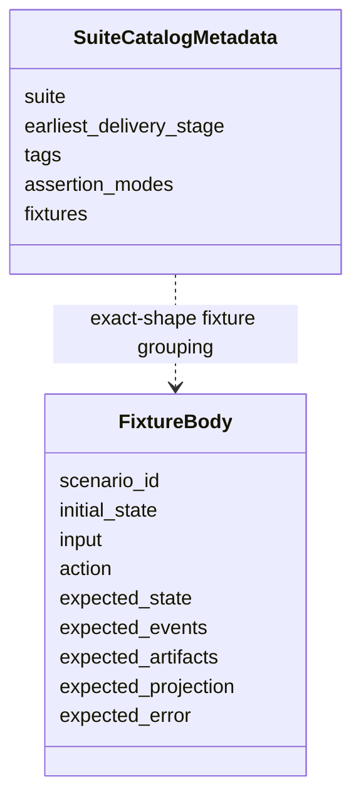
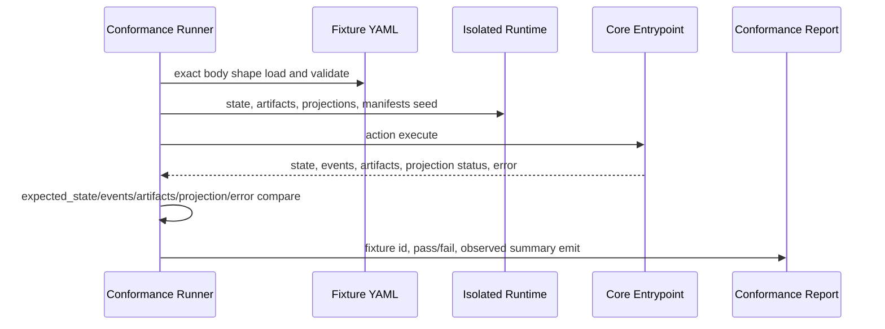
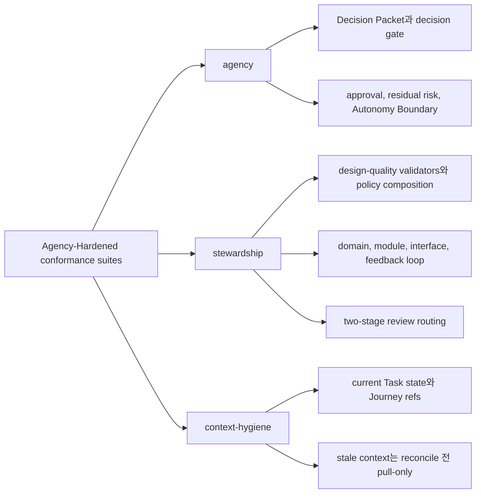

# Conformance Fixtures 참조

## 이 문서로 할 수 있는 일

정확한 conformance fixture body shape, runner execution behavior, fixture assertion semantics, suite catalog metadata, Kernel Smoke 작성 순서, staged fixture coverage, 예시, catalog-only future candidate를 찾아볼 때 이 참조 문서를 사용합니다.

이 문서는 conformance author, implementer, maintainer를 위한 lookup 문서입니다. 운영자 절차 문서가 아니므로 operator entrypoint와 `harness conformance run` overview는 [운영과 Conformance 참조](operations-and-conformance.md)를 사용합니다.

이 문서는 참조 문서입니다. 문서 세트가 구현 계획에 사용할 수 있다고 승인되기 전에는 runtime/server 구현, 생성된 운영 파일, 실행 가능한 fixture 파일, runtime data를 만들라는 뜻이 아닙니다. 첫 제품 MVP 목표는 v0.1 Kernel MVP이며, Kernel Smoke는 이를 좁게 실행하는 conformance profile입니다. v0.2부터 v0.4까지는 Agency-Hardened MVP reference conformance target으로 가는 staged pack이고, v1+ Expansion은 owner 문서가 승격하고 증명하기 전까지 roadmap 범위에 남습니다.

## 이런 때 읽기

- Fixture 기반 conformance를 작성하거나 리뷰할 때.
- 정확한 fixture body field, seed expansion limit, `ToolEnvelope` expansion convention, runner isolation behavior가 필요할 때.
- State, event, artifact, projection, error, validator, close blocker, redaction effect를 위한 fixture assertion mode가 필요할 때.
- Kernel Smoke, Agency-Hardened MVP, staged suite coverage, 예시, catalog-only future candidate guidance가 필요할 때.

## 읽기 전에

Conformance run entrypoint, suite-selection overview, docs-maintenance profile boundary, operator procedure는 [운영과 Conformance 참조](operations-and-conformance.md#conformance-run)를 사용합니다. Public request/response schema는 [MCP API와 스키마](mcp-api-and-schemas.md), storage layout과 seed-loader owner value는 [Storage와 DDL](storage-and-ddl.md), state transition과 stable event 의미는 [커널 참조](kernel.md), projection freshness는 [문서 Projection 참조](document-projection.md), policy validator behavior는 [설계 품질 정책](design-quality-policies.md), connector conformance overview는 [Agent 통합 참조](agent-integration.md)를 사용합니다.

## 핵심 생각

Conformance는 executable fixture로 Harness behavior를 증명합니다. Runtime fixture가 pass하려면 Core 또는 operator action을 실행하고 captured Core/API 또는 operator result를 structured expectation과 비교해야 합니다.

Rendered Markdown, Journey Card prose, status text, close report prose, scenario description, comment, agent summary는 독자에게 도움이 될 수 있지만, 그것만으로 conformance를 통과할 수 없습니다. Runtime pass/fail은 captured state, `task_events`, validator results, artifact registry/file integrity, projection job 또는 freshness state, returned primary error, structured tool-specific blocker field에서 나옵니다.

## 참조 범위

이 문서는 다음 항목을 담당합니다.

- conformance fixture body shape
- fixture seed shorthand limit과 owner-record expansion expectation
- 예시를 위한 `ToolEnvelope` expansion convention
- isolated fixture execution behavior
- fixture assertion semantics와 comparison mode
- suite catalog metadata boundary
- Kernel Smoke authoring queue와 staged fixture coverage map
- core, agency, connector, design-quality, stewardship, context-hygiene, catalog-only fixture examples
- fixture family를 위한 catalog-only future candidate guidance

## 여기서 다루지 않는 것

이 참조 문서는 operator command procedure, docs-maintenance reporting, public MCP schema, SQLite DDL, projection template body, policy contract를 담당하지 않습니다. 그것들은 각 owner Reference 문서에 남습니다. 여기의 suite metadata, example, catalog row는 fixture-body field, public request field, storage row, projection kind, runtime implementation readiness를 추가하지 않습니다.

## Conformance 탐색 지도

| 찾는 것 | 볼 곳 |
|---|---|
| 정확한 fixture body field | [Conformance Fixture Format](#conformance-fixture-format) |
| Runner가 load, seed, execute, capture, compare하는 방식 | [Conformance Execution](#conformance-execution) |
| `expected_state`, `expected_events`, `expected_artifacts`, `expected_projection`, `expected_error`의 default comparison mode | [Fixture Assertion Semantics](#fixture-assertion-semantics) |
| Suite intent와 작성 순서 | [Conformance staging](operations-and-conformance.md#conformance-staging), [Kernel Smoke Authoring Queue](#kernel-smoke-authoring-queue), [Fixture Suites](#fixture-suites) |
| Concern별 executable 예시 | [Fixture 예시 지도](#fixture-예시-지도) |

## Conformance Fixture Format

Conformance는 fixture 기반입니다. Scenario table만으로는 충분하지 않습니다. 각 test fixture는 action을 실행하고 state, events, artifacts, projections, errors를 검증해야 합니다.

각 fixture는 이 shape를 포함해야 합니다.

```yaml
scenario_id: string
initial_state: object
input: object
action: string
expected_state: object
expected_events: object[]
expected_artifacts: object[]
expected_projection: object
expected_error: object | null
```



Fixture file과 suite catalog는 fixture body 밖에 metadata를 가질 수 있습니다. Fixture body 자체는 위 field만 사용해야 conformance runner가 behavior를 일관되게 비교할 수 있습니다. Suite delivery stage, assertion mode, docs-maintenance result, prose status, authoring note를 표현하기 위해 fixture body field를 추가하지 않습니다. 그런 정보는 suite catalog metadata, docs-maintenance report, 주변 문서에 둡니다.

Fixture body type notation은 API의 [Schema notation convention](mcp-api-and-schemas.md#schema-notation-convention)을 따릅니다. 위 top-level fixture body field는 모두 required입니다. Fixture가 empty object, object map, array를 의도적으로 제공할 때는 `{}` 또는 `[]`를 사용합니다. Required top-level field를 생략하는 것은 invalid fixture body이며 "not asserted"가 아닙니다.

MCP tool action의 경우 executable fixture `input`은 API docs가 정의하는 해당 tool의 public request payload입니다. Runner는 schema가 요구하는 경우 `envelope: ToolEnvelope`를 포함해 `action`에 해당하는 request schema로 `input`을 검증해야 합니다. 이 문서의 예시는 다음 envelope-expansion convention 아래에서만 `ToolEnvelope`를 생략할 수 있습니다. Validation, 정규화, request hashing, Core execution 전에 runner가 `initial_state`, suite defaults, fixture metadata에서 deterministic valid envelope를 제공합니다. Expanded request가 Core에 전달되는 값입니다. 이 convention은 fixture field를 추가하거나 fixture body shape를 바꾸거나 alternate request schema를 만들지 않습니다.

Fixture shorthand는 의도적으로 좁게 제한됩니다. `initial_state` seeding, suite catalog metadata, 그리고 `owner_records`, `stewardship_findings`, feedback-loop shorthand 같은 compact example의 documented seed-loader expansion에만 허용됩니다. 실행 가능한 fixture file은 이 shorthand를 owner record, validator run, residual risk, 또는 DDL/API 문서가 소유하는 다른 record로 매핑해야 합니다. Shorthand는 두 번째 API나 상태 모델을 만들면 안 됩니다. Public mutation은 `input` 안의 scenario-only shorthand로 encoding하면 안 됩니다. Fixtures는 `record_run`, `record_eval`, `record_manual_qa`, `record_user_decision`의 public request branch를 사용하거나, scenario가 preexisting state에 관한 것이라면 `initial_state`에 owner record를 seed해야 합니다. `close_task` fixture `input`은 documented envelope expansion 이후에도 `CloseTaskRequest`만이어야 합니다. Evidence profile, changed paths, artifact refs, acceptance-criteria support, self-check summary, Manual QA records는 `initial_state`에 seed하거나 preceding public mutation fixture에서 record해야 합니다. `StewardshipImpactSummary` assertion은 파생 display이지 기준 current record가 아니며 `expected_state.derived` 또는 projection assertion 아래에 두어야 합니다. `owner_records.feedback_loops`는 기준 `feedback_loops` rows를 seed합니다. `feedback_loop_refs` 같은 example fields의 bare `FBL-*` values는 executable fixtures에서 `StateRecordRef { record_kind: feedback_loop, record_id: ... }`로 매핑됩니다. Seeded state 대신 public mutation을 exercise하는 fixture body는 definition changes를 `record_run.payload.shaping_update.feedback_loop_updates` 아래의 `FeedbackLoopUpdate`로, execution/status changes를 `evidence_updates.feedback_loop_updates`로, Manual QA execution을 `record_manual_qa.feedback_loop_ref`로 표현해야 합니다. Example이 `feedback_loop_id`와 `status`만 보여주면 fixture runner는 insert 또는 corresponding `FeedbackLoopUpdate` build 전에 surrounding Task, Change Unit, selected-loop, evidence shorthand에서 remaining required `feedback_loops` storage fields를 파생하거나 제공해야 합니다. Fixture shorthand의 accepted residual risk는 seeded `residual_risk` records의 state이며 standalone accepted-risk record가 아닙니다. Fixture examples가 `visible_refs`, `accepted_refs`, `not_visible_refs`, `unaccepted_refs`, `residual_risk_refs` 같은 risk-ref arrays에 bare `RISK-*` values를 사용할 때, executable fixtures는 이를 `StateRecordRef { record_kind: residual_risk, record_id: ... }`로 매핑해야 합니다. 이 bare IDs는 fixture shorthand일 뿐이며 DDL/API fields가 아닙니다. Executable staged-delivery fixtures는 standalone `ARISK-*` records를 요구하면 안 됩니다.

`write_authorizations`를 seed하는 executable fixtures는 valid stored rows를 만들어야 합니다. 각 seeded authorization row는 `basis_state_version`을 명시적으로 포함하거나, runner가 `state.sqlite`에 insert하기 전에 row의 Task에 대한 seeded affected-scope state version에서 이를 파생해야 합니다. 이는 storage-loader derivation rule일 뿐이며 fixture top-level field를 추가하거나 fixture body shape를 바꾸지 않습니다. Partial `expected_state.write_authorization` assertions는 idempotent replay, 최신성 감지, expiry, audit behavior를 test하지 않는 한 `basis_state_version`을 생략할 수 있습니다. `basis_state_version`은 allow-decision basis이지 resulting `ToolResponseBase.state_version`이 아닙니다.

Suite catalog metadata는 Core에 전달되지 않으며 fixture body의 일부가 아닙니다. Suite, delivery stage, tag별로 exact-shape fixture를 묶을 수 있습니다.

```yaml
suite: agency
earliest_delivery_stage: v0.3-agency-pack
tags: [decision-gate, residual-risk, autonomy-boundary]
fixtures:
  - AGENCY-decision-packet-required-before-product-tradeoff-write
  - AGENCY-residual-risk-visible-before-acceptance
```

Runner는 이 metadata를 suite 선택, 순서 지정, reporting에 사용할 수 있습니다. Core에는 documented envelope expansion 이후의 action과 public `input`만 전달됩니다. Metadata가 seed expansion, fixture comparison semantics, tool request schema, expected owner records를 바꾸면 안 됩니다.

## Conformance Execution

`harness conformance run`은 MCP tool과 operator command가 사용하는 것과 같은 Core entrypoint를 통해 fixture를 실행합니다. 동작을 prose output만 검사해서 검증하면 안 됩니다. Core entrypoint를 실행하고 그 결과의 state, events, artifacts, projection, error를 비교해야 합니다.

Runtime fixture execution 의미:

1. Fixture YAML file을 load하고 exact fixture body shape를 검증합니다.
2. Fixture가 existing read-only sample을 명시적으로 target하지 않는 한 fresh isolated 하네스 런타임 홈과 임시 제품 저장소를 만듭니다. Runner는 state-changing fixture execution에 developer의 실제 하네스 런타임 홈이나 제품 저장소를 재사용하면 안 됩니다.
3. `initial_state`에서 `registry.sqlite`, `project.yaml`, `state.sqlite`, artifact file, projection file, connector manifest를 seed합니다.
4. Core를 통해 `action`을 execute합니다. MCP tool action은 public request schema를 사용합니다. Documented `ToolEnvelope` expansion 이후 fixture `input`은 접점이 해당 MCP tool에 보낼 request payload와 같아야 합니다. `projection_refresh`, `doctor_surface`, `recover`, `artifacts_check` 같은 operator action은 [운영과 Conformance 참조](operations-and-conformance.md)의 operator semantics를 사용합니다.
5. Resulting state summary, 추가된 `task_events`, validator result, artifact registry/file integrity, projection job status, reconcile item, returned error code를 capture합니다.
6. Captured result를 `expected_state`, `expected_events`, `expected_artifacts`, `expected_projection`, `expected_error`와 compare합니다.
7. Fixture id, pass/fail, observed state summary, observed events, artifact integrity result, projection freshness, error comparison을 보고합니다.



Fixture action이 `expected_state_version`을 포함하면 runner는 `ToolEnvelope.task_id`만이 아니라 Core-resolved primary Task에 따라 비교합니다. Task-scoped actions는 seeded 또는 Core-resolved primary Task State Version과 비교하고, resolved primary Task가 없는 project-scoped actions는 Project State Version과 비교합니다. Captured response와 `task_events`의 `state_version` values는 resulting affected-scope versions로 비교합니다. Read-only fixtures는 primary read scope의 unchanged version을 검증할 수 있습니다. 이 설명은 fixture body shape를 바꾸지 않고 comparison 의미만 명확히 합니다.

Stale `expected_state_version` fixture는 단순한 concurrent-write test가 아니라 stale-authority test입니다. Exact idempotent replay는 예외입니다. Committed replay row가 있고 canonical request hash가 일치하면 fixture는 original committed response가 반환되고 current state-version freshness check가 다시 실행되지 않았음을 검증해야 합니다. Replay row가 없고 state-changing action이 commit 전에 conflict되면, owner document가 다른 recovery action을 명시하지 않는 한 fixture는 current record 변경 없음, `task_events` append 없음, artifact 등록 없음, projection job enqueue 없음, conflicting request를 위한 `tool_invocations` replay row 생성 없음까지 검증해야 합니다. 같은 key가 changed canonical request hash와 함께 재사용되면 fixture는 `STATE_CONFLICT`, original replay row 보존, 새 artifact/event/projection job/response field/owner relation이 merge되지 않음을 검증해야 합니다.

Fixture execution은 deterministic해야 합니다. Network access, wall-clock-sensitive expiry, external tool output은 suite가 integration smoke라고 명시적으로 선언하지 않는 한 stub하거나 seeded fixture input으로 표현해야 합니다.

Isolation은 pass 조건의 일부입니다. Fixture는 임시 제품 저장소와 하네스 런타임 홈에 file을 seed하고, 그곳에서 하나의 Core 또는 operator action을 실행한 뒤 captured result를 비교할 수 있습니다. Existing local runtime record, generated operational file, 이전 실행의 prose report에 의존하면 안 됩니다.

Seed validation은 action execution 전에 수행하고, captured-state validation은 action execution 이후에 수행합니다. 비교의 양쪽은 fixture-local string label이 아니라 owner-defined state loader와 value set을 사용합니다.

Conformance runner는 MCP tool과 operator command가 사용하는 동일한 Core storage loader를 통해 JSON `TEXT` field를 seed하고 검사해야 합니다. `initial_state`에 malformed JSON 또는 schema-incompatible JSON이 있는 fixture는 유효하지 않은 상태를 드러내야 합니다. Fixture action이 recovery path이고 safe reconstruction이 가능한 경우에는 복구 가능한 state issue를 드러내야 합니다. Runner는 JSON field를 opaque string으로 취급해서 shape validation을 건너뛰면 안 됩니다. 이 기대사항은 fixture body shape를 바꾸지 않습니다.

Conformance runner는 status-like `TEXT` field도 [Storage와 DDL](storage-and-ddl.md#canonical-enum-hardening)의 owner-bound hardening map을 통해 seed하고 검사해야 합니다. Fixture seed loader는 승격된 owner value가 있는 field의 compact shorthand와 expanded row를 검증해야 합니다. 여기에는 registry/project 접점 상태를 seed할 때의 `project_surfaces.guarantee_level`, `runs.kind`, `runs.status`, `write_authorizations.status`, `write_authorizations.guarantee_level`, `approvals.status`, `evidence_manifests.status`, `residual_risks.visibility_status`, `feedback_loops.loop_kind`, `feedback_loops.status`, `tdd_traces.status`, `validator_runs.status`, `validator_runs.guarantee_level`, `projection_jobs.projection_kind`, `projection_jobs.status`, `connector_manifests.status`, `baselines.status`, `change_units.status`, `tool_invocations.status`, `decision_requests.status`, `residual_risks.status`, `task_spine_entries.status`, `change_unit_dependencies.status`, `shared_designs.status`, `reconcile_items.status`, `domain_terms.status`, `module_map_items.status`, `interface_contracts.review_status`가 포함됩니다. `decision_requests.status`의 경우 optional `decision_requests` table을 유지하거나 fixture가 `decision_requests` row를 seed할 때만 검증이 적용됩니다. Minimal v0.1 Kernel MVP 구현은 이 table을 생략할 수 있습니다. 이 승격된 value도 시나리오 설명 label이 아니라 owner-bound storage value입니다. 예를 들어 `runs.status: completed`, `runs.status: interrupted`, `runs.status: violation`은 committed Run에 대한 Storage와 DDL compatibility meaning과 함께만 유효하며, `shared_designs.status: active`는 현재 design basis이지 최종 수락이나 Approval이 아닙니다. Executable fixture는 유효하지 않은 state recovery를 명시적으로 test하는 scenario가 아닌 한 unknown status value를 seed하면 안 됩니다. Expected-state status assertion은 prose label이 아니라 captured owner value를 비교합니다.

## Fixture Assertion Semantics

Fixture assertion mode는 runner default 또는 suite catalog metadata입니다. Core input이 아니고 MCP tool에 전달되지 않으며 fixture body에 field를 추가하면 안 됩니다. Fixture body는 정확히 `scenario_id`, `initial_state`, `input`, `action`, `expected_state`, `expected_events`, `expected_artifacts`, `expected_projection`, `expected_error`만 유지합니다.

Partial assertion object 안에서 omission은 "not asserted"를 뜻합니다. Value가 `null`인 listed field는 captured field가 present이고 JSON `null`과 같음을 assert합니다. Listed array value `[]`는 present empty array를 assert합니다. Owner schema가 해당 field를 map이라고 말하는 경우 listed object-map value `{}`는 present empty map을 assert합니다. `partial_deep` 아래의 structured object에서는 object 존재만 의도적으로 assert하는 경우가 아니라면 fixture author는 최소 하나의 child field를 나열해야 합니다.

이 omission rule은 assertion rule일 뿐입니다. Public MCP `input`에서 omitted field를 valid로 만들지 않습니다. Fixture `input`은 documented envelope expansion 이후에도 owning public request schema를 통과해야 합니다.

Default comparison modes:

| Fixture field | Default assertion mode |
|---|---|
| `expected_state` | `partial_deep`; 나열된 field는 재귀적으로 일치해야 하며 나열되지 않은 field는 검증하지 않습니다. Suite metadata가 `expected_state: exact`로 설정할 수 있습니다. |
| `expected_events` | Captured `task_events`의 stable-catalog projection에 대한 `contains_ordered`; 나열된 stable event는 ascending `task_events.event_seq` 순서대로 나타나야 하며 unrelated stable event가 앞, 사이, 뒤에 있어도 됩니다. Suite metadata가 `expected_events: exact`로 설정할 수 있습니다. |
| `expected_artifacts` | `contains_by_identity`; 나열된 각 artifact는 같은 `artifact_id`와 `kind`를 가진 registered artifact와 일치해야 하며, 그 밖에 나열된 artifact field는 재귀적으로 일치합니다. |
| `expected_projection` | `partial_by_kind`; 나열된 각 projection kind는 해당 kind에 대해 나열된 status assertion 또는 partial object assertion을 만족해야 합니다. |
| `expected_error` | `expected_error: null`은 action이 error를 반환하지 않았음을 검증합니다. `expected_error`가 object이면 `expected_error.code`는 required이며 API가 소유한 [Primary Error Code Precedence](mcp-api-and-schemas.md#primary-error-code-precedence)에 따라 선택된 primary API `ErrorCode`인 `ToolError.code`, 즉 response에 errors가 있으면 `ToolResponseBase.errors[0].code`와 exact match합니다. Arbitrary secondary error, validator finding code, policy finding code, local diagnostic label과 match하면 안 됩니다. `expected_error.details`는 optional입니다. Omitted이면 details field는 검증하지 않습니다. `details`가 present이면 suite metadata가 `expected_error.details: exact`로 설정하지 않는 한 `partial_deep`으로 match합니다. |

`expected_events`는 기본적으로 `contains_ordered`이므로 `expected_events: []`는 fixture가 특정 stable event를 요구하지 않는다는 뜻입니다. 이것만으로 captured stable-event stream이 empty임을 assert하지 않습니다. Stable event가 없었음을 assert하려면 suite metadata에서 해당 fixture 또는 suite에 `expected_events: exact`를 설정해야 합니다. 마찬가지로 `expected_artifacts: []`와 `expected_projection: {}`는 default mode에서 required artifact 또는 projection entry가 없다는 뜻입니다. Compatible exact-mode metadata가 없다면 captured artifact나 projection observation을 금지하지 않습니다.

`expected_events` comparisons는 captured `task_events`의 [Kernel Stable Event Catalog](kernel.md#stable-event-catalog) projection을 대상으로 합니다. API tool detail/audit event lists는 이 set을 확장하지 않습니다. `task_events`에 capture된 non-catalog detail 또는 local-audit events는 normal staged-delivery fixture를 fail하게 만들면 안 됩니다. Suite metadata가 `expected_events: exact`로 설정하면, future v1+/local suite가 implementation-specific detail-event assertions를 명시적으로 opt in하지 않는 한 exactness는 captured stream의 stable-event projection에 적용됩니다. Validator IDs, Core check names, projection status shorthands, fixture seed shorthand, scenario catalog IDs는 event names가 아닙니다. Prose examples는 non-catalog event names를 illustrative 또는 future extension ideas로 언급할 수 있지만, executable staged-delivery fixtures는 kernel catalog가 승격하기 전까지 이를 요구하면 안 됩니다.

Conformance runner는 captured `task_events`를 `event_seq`로 order합니다. `state_version`, `created_at`, `event_id`는 `expected_events` ordering의 tie-breaker가 아닙니다.

Fixture authors는 API precedence가 generic validator fallback을 선택할 때만 `VALIDATOR_FAILED`를 `expected_error.code`로 사용해야 합니다. `EVIDENCE_INSUFFICIENT`, `QA_REQUIRED`, `PROJECTION_STALE`, `ARTIFACT_MISSING` 같은 더 specific한 typed blocker가 적용되면 그 code가 primary입니다.

`CloseTaskResponse.blockers[].code` 역시 API `ErrorCode` value입니다. Policy-specific 또는 validator-specific finding code는 `expected_state.validators`, validator finding assertion, 또는 equivalent expected validator output 아래에 두어야 하며, `expected_error.code`나 close blocker `code`에 두면 안 됩니다. Blocked close를 다루는 fixture는 `CloseTaskResponse.blockers` 또는 captured equivalent인 `expected_state.close_blockers` 같은 structured blocker를 assert해야 합니다. Report prose, Journey Card text, status text, agent summary만 맞춰서는 close blocker를 증명할 수 없습니다.

`expected_state.validators` 아래의 validator assertion은 validator ID로 keyed됩니다. 나열된 각 validator ID는 captured validator results에 존재해야 하며 나열된 field와 부분적으로 일치해야 합니다. 나열되지 않은 validator ID와 나열되지 않은 validator field는 검증하지 않습니다.

Fixture가 설계 품질 severity를 검증할 때는 모든 관련 validator 결과를 `expected_state.validators` 아래 보이게 유지하고, policy-owned [Severity Composition Rule](design-quality-policies.md#severity-composition-rule)이 산출한 합성된 gate, write-blocker, close-blocker, waiver, Decision Packet outcome도 검증해야 합니다. Fixture는 policy schema를 추가하거나 더 강한 merged blocker가 있다는 이유만으로 lower-severity finding을 숨기면 안 됩니다.

`expected_state.checks` 아래의 Core check와 precondition assertion은 check/precondition name을 key로 사용합니다. 이 entry는 captured Core check output, blocked reason, response summary, 또는 runner가 관찰한 equivalent check status와 비교합니다. MCP API 또는 Storage와 DDL이 해당 ID를 stable ValidatorResult로 명시적으로 승격하지 않는 한 이 값들은 validator ID가 아니며 `expected_state.validators` 아래에 두면 안 됩니다.

`expected_state.checks.projection_freshness`는 Core mechanical projection freshness check를 검증합니다. `expected_state.validators.context_hygiene_check`는 higher-level context hygiene에 대한 stable ValidatorResult를 검증합니다. 그 validator가 projection freshness를 고려할 수는 있지만, mechanical check 자체의 fixture assertion 위치는 아닙니다.

`secret_omitted` 또는 `blocked` artifact를 다루는 fixture는 committed artifact의 `redaction_state`를 `expected_artifacts` 아래에서 검증하고, 이후 상태 또는 표시 영향을 owner assertion 위치에서 검증해야 합니다. Evidence 또는 QA state는 `expected_state`, verification outcome은 Eval 관련 state 또는 error assertion, projection freshness/display availability는 `expected_projection` 또는 `expected_state.checks.projection_freshness`, export 또는 Release Handoff behavior는 operator action에서 capture된 기존 fixture assertion으로 검증합니다. Fixture는 생략된 secret 또는 PII 값을 assert하면 안 됩니다.

Artifact redaction scenario 지침:

| Scenario ID | Action | Required assertions |
|---|---|---|
| `ARTIFACT-secret-omitted-supports-visible-evidence-only` | `record_run`, `record_manual_qa`, 또는 `record_eval` | `expected_artifacts`가 `redaction_state: secret_omitted`인 committed artifact를 포함합니다. Evidence, QA, Eval assertion은 보이는 nonsecret evidence만 인정하고, 생략된 값이 필요한 claim은 unsupported, partial, blocked, insufficient 중 적절한 상태로 남깁니다. Projection과 report는 생략된 secret 또는 PII 값을 assert하지 않고 omission note 또는 handle만 보여줘야 합니다. |
| `ARTIFACT-blocked-notice-is-committed-but-unavailable-input` | `record_run`, `record_manual_qa`, `launch_verify`, 또는 `artifacts_check` | `expected_artifacts`가 `redaction_state: blocked`인 committed artifact를 포함하고, optional hash/size/content-type assertion은 metadata-only notice bytes와 일치해야 합니다. Scenario에 replacement, waiver, Decision Packet outcome, accepted risk, documented fallback이 포함되어 있지 않다면 이후 evidence, QA, Eval, projection, export, Release Handoff assertion은 blocked, insufficient, 사용할 수 없는 입력, unresolved impact 중 적절한 상태를 보여야 합니다. |
| `ARTIFACT-staged-uri-untrusted-task-scope-required` | `record_run`, `record_manual_qa`, `record_eval`, 또는 `artifacts_check` | 호출자가 임의로 제공한 `staged_uri`, absolute path, traversal path, symlink escape, repo-local path, 또는 다른 Task의 artifact relation은 committed artifact로 받아들이지 않습니다. 그 값에서 evidence, QA, Eval, projection, export, Release Handoff claim을 인정하지 않습니다. Committed artifact link는 trusted staging/capture bytes와 같은 Task의 owner relation으로만 resolve되며, `record_kind=projection`인 경우 completed same-Task projection job으로만 resolve됩니다. |
| `ARTIFACT-integrity-mismatch-blocks-dependent-claims` | `artifacts_check`, `recover`, `export`, 또는 `close_task` | Artifact file missing, hash mismatch, size mismatch, owner-link mismatch는 artifact integrity result로 보고되며, dependent evidence, QA, Eval, projection, export, close-readiness assertion은 owner path에 따라 stale, blocked, insufficient가 됩니다. 이 check는 artifact record를 조용히 rewrite하거나, 검증되지 않은 bytes를 인정하거나, blocked content를 leak하거나, existing recovery, replacement, reconcile path 없이 close readiness를 repair하지 않습니다. |
| `EXPORT-redaction-notes-do-not-leak-omitted-or-blocked-values` | `export` 또는 Release Handoff report read | Export 또는 Release Handoff assertion은 artifact ref, redaction state, omission/block note, 영향을 받는 display를 나열합니다. 생략된 원본 값과 금지되어 차단된 payload는 exported snapshot, raw-file copy, report text, fixture assertion에 없어야 합니다. |
| `EXPORT-secret-pii-omission-reported-not-silent` | `export` 또는 Release Handoff report read | Secret 또는 PII 제거는 affected artifact ref와 evidence, QA, verification, projection, Release Handoff display에 연결된 안전한 omission, redaction, block metadata로 보여야 합니다. Export는 sensitive value를 포함하지 않고, staged 또는 blocked content 접근 범위를 넓히지 않으며, material이 omitted 또는 blocked되었다는 사실을 숨기지 않습니다. |

Allowed `expected_projection` status assertions:

| Assertion | Meaning |
|---|---|
| `enqueued` | Action 이후 projection kind에 대한 refresh job 또는 동등한 projection outbox entry가 pending 상태입니다. |
| `current` | Projection kind가 committed state version과 managed hash에 대해 current입니다. |
| `stale` | State, evidence, managed content가 렌더링된 projection보다 앞서 나가 projection kind가 `stale`입니다. |
| `failed` | Kind에 대한 latest applicable projection 새로고침이 failed입니다. |
| `skipped` | Kind에 대한 latest applicable projection job이 skipped입니다. 예를 들어 superseded되었거나 managed-block drift로 blocked된 경우입니다. |
| `stale_or_enqueued` | `stale` 또는 `enqueued` 중 하나면 허용됩니다. Scenario가 projection invalidation 또는 대기열 추가를 증명하고 runner가 refresh 경계 양쪽 중 하나를 observe할 수 있을 때 사용합니다. |
| `stale_or_failed` | `stale` 또는 `failed` 중 하나면 허용됩니다. 렌더링 failure가 `failed` freshness로 드러나거나 failed job을 동반한 `stale` freshness로 드러날 수 있을 때 사용합니다. |

`TASK: stale_or_enqueued` 같은 projection shorthand는 `TASK` projection kind에 대한 scalar status assertion입니다. Object form은 `partial_by_kind`를 유지하면서 additional captured projection field를 검증할 수 있습니다. 예: `TASK: {status: current}`. 이 assertion operator는 fixture comparison 의미이지, owning schema documents가 정의하지 않는 한 새로운 projection DDL 또는 API enum value가 아닙니다.

Projection assertion은 projection freshness, enqueue status, source-state-version display, 관련 job fact를 비교합니다. Rendered Markdown을 기준 상태로 비교하지 않으며, failed render가 captured Core state와 event를 rollback하거나 rewrite하게 만들지도 않습니다.

Suite catalog는 fixture를 바꾸지 않고 assertion mode를 override할 수 있습니다.

```yaml
suite: core
assertion_modes:
  expected_state: exact
  expected_events: exact
  expected_error.details: exact
fixtures:
  - CORE-active-status-no-task
```

Conformance는 captured Core state, `task_events`, validator result, artifact registry/file integrity, projection job 또는 freshness state, returned error code, applicable structured tool-specific blocker field를 통해 behavior를 증명해야 합니다. Rendered Markdown, Journey Card prose, status prose, close report prose, agent prose만 맞춰서는 fixture를 통과시킬 수 없습니다.

Fixture runner는 `request_hash`, baseline `tree_hash`, projection `managed_hash`에 대해 reference implementation과 같은 정규화 rule을 사용해야 합니다. 세부 알고리즘은 MCP API, Storage와 DDL, Document Projection 문서가 계속 담당합니다. Conformance fixture는 그 기준 기록 경계를 다시 정의하지 않고 deterministic behavior를 검증합니다.

## Agency, Stewardship, Context, Design-Quality Suite

Agency, stewardship, context hygiene, design-quality는 Agency-Hardened MVP conformance suite입니다. 이 suite들은 `prepare_write`, `request_user_decision`, `record_user_decision`, `record_manual_qa`, `record_eval`, `close_task`, `next` 같은 Core entrypoint와 Core를 호출하는 operator action을 통해 state behavior를 검증합니다. Journey Card, Decision Packet, residual-risk, review-stage, status prose의 문구가 맞는지만 보고 통과 처리하면 안 됩니다.

필수 suite 책임:

| Suite | Required behavior |
|---|---|
| agency | 차단하는 사용자 소유 판단은 affected write 또는 close 전에 compatible Decision Packet을 요구합니다. Decision request routing metadata는 optional compatibility data이며 이것만으로는 `decision_gate`를 충족하면 안 됩니다. 사용자 소유 제품 또는 중요한 기술 trade-off가 걸린 write는 보류됩니다. Sensitive-action Approval lifecycle은 Approval, Decision Packet, Write Authorization을 서로 구분된 상태로 유지합니다. Manual QA, final acceptance, residual-risk acceptance는 별도 owner path를 가진 별도 사용자 판단입니다. AFK Autonomy Boundary stop condition은 public commitment를 차단합니다. Known close-relevant residual risk는 successful acceptance 또는 close 전에 보이게 해야 합니다. Known close-relevant risk가 없으면 `ResidualRiskSummary.status=none`이 residual-risk visibility를 충족합니다. 잔여 위험을 받아들이고 닫는 경로에는 결과 수락 전에 사용자에게 보였던 risk를 가리키는 accepted Residual Risk refs가 추가로 필요합니다. |
| stewardship | 설계 품질 validator와 codebase-stewardship validator는 기준 owner record, ref, policy-owned severity composition 규칙을 통해 `design_gate`, `decision_gate`, `qa_gate`, close blocker, waiver eligibility에 영향을 줍니다. Shared Design, public interface, module, domain-language, feedback-loop, TDD, Manual QA, waiver check는 schema나 DDL을 duplicate하지 않고 기존 owner path로 finding을 route합니다. Generated-file과 managed-block drift는 reconcile에 남습니다. Review Stage display는 Spec Compliance Review와 Code Quality / Stewardship Review를 분리하지만 기준 기록, `ProjectionKind` value, Approval, evidence, verification, QA, acceptance, residual-risk acceptance, close, Write Authorization을 만들지 않습니다. |
| context-hygiene | Current Task state, Journey ref, evidence ref, evaluator bundle, freshness state는 current일 때만 authoritative합니다. 오래된 PRD, 최신이 아닌 projection, stale chat memory, closed issue, old design doc, long log는 reconcile 또는 refresh되기 전까지 pull-only context입니다. 최신이 아닌 context는 write, close, 결과 수락, verification, residual-risk acceptance, current-state replacement를 허가할 수 없습니다. |
| design-quality | Policy-pack smoke coverage는 기존 ValidatorResult와 gate behavior를 통해 agency, stewardship, context-hygiene, close-impact validators를 조합합니다. Fixture는 individual finding을 계속 보이게 하면서 owner policy composition이 만든 merged blocker, waiver, Decision Packet, Manual QA, close outcome을 검증합니다. Design-quality coverage는 kernel authority를 다시 정의하거나, 새 gate를 만들거나, 더 강한 blocker가 있다는 이유로 낮은 severity finding을 숨기면 안 됩니다. |

Status/next recommendations는 Role Lens recommendations를 포함해 read response로만 fixture-observable합니다. Fixture는 관련 있을 때 `recommended_playbooks`를 검증할 수 있지만, recommendation 자체로 state event, gate 충족, projection 대기열 추가, artifact, evidence, verification, QA, 결과 수락, 잔여 위험을 받아들이는 판단, close, assurance level 상승이 발생하지 않았다는 점도 증명해야 합니다. Recommendation 또는 role lens가 사용자 소유 판단을 암시하면 expected behavior는 Decision Packet ref 또는 Decision Packet request path이지 satisfied `decision_gate`가 아닙니다. Validator, evidence, Manual QA, residual-risk, release-handoff work를 식별하면 expected behavior는 routed recommendation 또는 candidate이지, 이후 public mutation fixture가 Core를 통해 record하기 전까지 committed owner record가 아닙니다.

`browser-qa-candidate` recommendation도 같은 read-only rule을 따릅니다. Recommendation은 `T6 QA Capture` 접점에서 Browser QA Capture가 유용하다고 이름 붙일 수 있지만, recommendation alone으로 상태를 변경하거나, projection을 대기열에 넣거나, artifact를 만들거나, evidence를 만들거나 충족하거나, verification을 수행 또는 기록하거나, QA를 기록하거나, QA 또는 verification을 면제하거나, 잔여 위험을 받아들이거나, 결과를 수락하거나, Task를 닫거나, assurance를 올리면 안 됩니다. 접점이 browser capture를 지원하지 않으면 unsupported capture를 staged-delivery failure로 다루는 대신 사람이 작성한 Manual QA notes와 수동 제공 artifacts fallback을 이름 붙여야 합니다. Actual artifacts, Manual QA records, QA gate updates, Eval results, close effects에는 이후 Core를 통한 public mutation이 필요합니다.



### Catalog-Only Fixture Skeleton Guidance

아래 지침은 catalog family를 exact-shape fixture로 옮길 때 쓰는 skeleton guidance입니다. 이것은 catalog-only guidance이며 executable fixture body, public request schema, DDL extension, runner design이 아닙니다. Delivery-stage mapping은 suite catalog metadata에 두며 fixture body에 넣지 않습니다. "Minimum seeded records"는 Storage And DDL 규칙으로 expansion 및 validation을 거친 뒤 `initial_state`에 들어가는 owner record를 뜻합니다. Public mutation은 계속 정확한 MCP request payload를 `input`으로 사용합니다.

### Kernel Smoke Authoring Queue

이 queue는 v0.1 Kernel MVP fixture를 처음 작성할 때의 authoring order입니다. Kernel Smoke는 그 제품 목표의 좁은 conformance profile입니다. 이 순서는 fixture author를 위한 것이며 executable fixture 사이의 dependency가 아닙니다. 각 executable fixture는 isolated하게 유지하고, 필요한 최소 owner record를 `initial_state`에 seed하며, 하나의 public Core 또는 operator action을 사용하고, fixture body shape는 그대로 유지해야 합니다.

정확한 request/response schema는 [MCP API와 스키마](mcp-api-and-schemas.md)가 담당합니다. 정확한 DDL과 storage value set은 [Storage와 DDL](storage-and-ddl.md) 및 [Canonical enum hardening](storage-and-ddl.md#canonical-enum-hardening)이 담당합니다. Stable event name은 [Kernel Stable Event Catalog](kernel.md#stable-event-catalog)가 담당합니다. Primary error 선택은 [Primary Error Code Precedence](mcp-api-and-schemas.md#primary-error-code-precedence)가 담당합니다. `ArtifactRef`는 [ArtifactRef](mcp-api-and-schemas.md#artifactref)가 담당합니다. `ProjectionKind`는 [Shared schemas](mcp-api-and-schemas.md#shared-schemas)가 담당하며, tier와 freshness rule은 [문서 Projection](document-projection.md#template-tiers) 및 [Freshness and failure rules](document-projection.md#freshness-and-failure-rules)를 따릅니다.

Table의 `None`은 기존 fixture field를 비워 두거나 `expected_error: null`을 사용한다는 뜻입니다. 새 sentinel value가 아닙니다.

| Queue | Fixture candidate | Intended Core 또는 operator action | Minimum seeded records | Main expected state assertion | Expected stable event assertion | Expected artifact assertion | Expected projection assertion | Expected primary error |
|---|---|---|---|---|---|---|---|---|
| 1 | `CORE-status-no-active-task` | `harness.status` | 등록된 project와 기준 surface. Active Task 없음 | `active_task=null`, idle/no-active status, Write Authorization 없음, 상태 변경 없음 | 없음 | 없음 | Projection enqueue 없음. Read freshness는 seeded projection state에 따라 `unknown`, `current`, `stale`, `failed` 중 하나일 수 있음 | 없음 |
| 2 | `CORE-intake-active-task` | `harness.intake` | 등록된 project와 기준 surface. Active Task 없음. Resume/supersede path를 test하면 그에 맞는 setup | Active Task 하나와 mode, lifecycle phase, initial gates가 생김. Natural language만으로 Write Authorization이 생기지 않음 | 일반 create/resume에는 없음. Supersession scenario일 때만 `task_superseded` | 없음 | Committed intake mutation은 `TASK` enqueued | 없음 |
| 3 | `CORE-change-unit-scoped-path` | `harness.record_run`의 `kind=shaping_update`와 `change_unit_updates` | Active Task와 current state version. Product-write Run 없음. Scope assertion에 필요할 때만 baseline | Active Change Unit이 Task에 선택됨. Allowed paths/tools/commands/network/secret scope가 intended slice와 일치함. Product write authority는 생기지 않음 | Shaping Run이 committed되면 `run_recorded` | Shaping update가 `ArtifactInput`으로 context artifact를 등록할 때만 있음 | Task/Change Unit state가 바뀌므로 `TASK` enqueued 또는 stale | 없음 |
| 4 | `CORE-decision-packet-basic-lifecycle` | `harness.request_user_decision`, `harness.record_user_decision`, `harness.status`, 또는 `harness.next` | User-owned 또는 material technical decision need 하나가 있는 active Task와 active Change Unit | Canonical Decision Packet record가 public route를 통해 requested 또는 recorded됨. Status/next가 ref를 표시할 수 있음. Unresolved state는 blocker로 남음. Compatible recorded decision은 그 decision blocker만 제거하고 write authority를 만들지 않음. Candidate는 route에 입력될 수 있지만, candidate만으로 `decision_gate`를 충족하거나 blocker를 제거하거나 fixture를 통과할 수 없음 | Public mutation이 emit할 때만 `decision_required` 또는 promoted decision-recorded event | Scenario가 `ArtifactInput`을 사용할 때만 committed decision-context artifact | Committed decision change는 `TASK` enqueued. Read-only status/next는 projection enqueue 없음 | Action과 seeded state에 따라 `DECISION_REQUIRED`, `DECISION_UNRESOLVED`, 또는 없음 |
| 5 | `CORE-prepare-write-no-change-unit` | `harness.prepare_write` | Active Change Unit이 없는 write-capable active Task | Owner rule에 따라 `scope_gate`가 blocked 또는 required. Write Authorization row/ref 없음 | `prepare_write_blocked`; Core가 promoted stable event로 emit할 때만 optional `scope_required` | 없음 | Blocker state가 committed되면 `TASK` stale 또는 enqueued | `NO_ACTIVE_CHANGE_UNIT` |
| 6 | `CORE-prepare-write-out-of-scope` | `harness.prepare_write` | Active Task, active Change Unit, 필요하면 baseline. Intended path/tool/command가 Change Unit 밖에 있음 | Write Authorization 없음. Scope check가 incompatible path/tool/command를 보고함. 기존 Change Unit이 계속 authoritative함 | `prepare_write_blocked` | 없음 | Blocker state가 committed되면 `TASK` stale 또는 enqueued | `SCOPE_VIOLATION` |
| 7 | `CORE-prepare-write-allowed-creates-write-authorization` | `harness.prepare_write` | Active Task, active scoped Change Unit, compatible baseline, unresolved Decision Packet 없음, applicable seeded/owner-defined missing Approval blocker 없음, compatible surface guarantee | Durable Write Authorization이 compatible Task, Change Unit, intended operation, scope, `basis_state_version`, status, `consumed_by_run_id=null`로 생성됨 | `prepare_write_allowed`, `write_authorization_created` | 없음 | `TASK` enqueued | 없음 |
| 8 | `CORE-record-run-without-write-authorization-blocked` | `harness.record_run`의 `kind=direct` 또는 `kind=implementation` | Active Task, active Change Unit, scope 안의 observed product-write path, supplied Write Authorization 없음 | Pre-commit rejection에서는 Run이 committed되지 않음. Authorization consumed 없음, artifact registered 없음, evidence unchanged | Pre-commit rejection에는 없음 | 없음 | Projection job enqueue 없음 | `WRITE_AUTHORIZATION_REQUIRED` |
| 9 | `CORE-record-run-consumes-authorization-registers-artifact-evidence` | `harness.record_run`의 `kind=direct` 또는 `kind=implementation` | Active Task, active Change Unit, compatible unconsumed Write Authorization, baseline, staged artifact input, evidence가 필요한 acceptance criterion 또는 completion condition | Run committed. Write Authorization이 한 번 consumed됨. Latest Evidence Manifest가 Run/artifact를 link하고 evidence profile에 맞는 minimum supported evidence를 기록함 | `run_recorded`, `write_authorization_consumed`, `evidence_manifest_updated` | Integrity/redaction metadata와 Run 또는 Evidence Manifest에 대한 same-Task owner link가 있는 registered `ArtifactRef` | `TASK`, `RUN-SUMMARY`, `EVIDENCE-MANIFEST` enqueued. Direct work이면 `DIRECT-RESULT`도 포함 | 없음 |
| 10 | `CORE-task-projection-current` | `projection_refresh` | Current owner state에서 seed된 pending `TASK` projection job과 active 또는 recently changed Task | Core state는 unchanged. `projection_jobs.status=completed`. `source_state_version`이 rendered Task source state version과 일치함 | Successful refresh에는 없음 | 해당 action에 대해 owner docs가 정의할 때만 optional projection output artifact | `TASK` current | 없음 |
| 11 | `CORE-close-evidence-missing-blocked` | `harness.close_task` | Close-compatible scope와 decision을 갖춘 active Task. Evidence Manifest가 없거나 partial, stale, blocked, insufficient인 상태 | Task가 non-terminal로 남음. Structured close blocker가 evidence sufficiency를 가리킴. Close state, acceptance, assurance upgrade가 기록되지 않음 | `close_requested`, `close_blocked` | Existing evidence artifact가 insufficient context로 seed된 경우만 있음 | Blocked close가 blocker/status state를 commit하면 `TASK` enqueued 또는 stale | `EVIDENCE_INSUFFICIENT` |
| 12 | `CORE-close-decision-unresolved-blocked` | `harness.close_task` | Evidence가 primary blocker가 되지 않을 만큼 충분한 active Task. Close와 관련된 unresolved, deferred-without-coverage, blocked, stale, incompatible Decision Packet | Task가 non-terminal로 남음. `decision_gate`와 structured close blocker가 unresolved Decision Packet을 reference함. Evidence state가 decision blocker를 가리지 않음 | `close_requested`, `close_blocked` | Decision Packet context가 committed artifact를 사용할 때만 있음 | Blocked close가 blocker/status state를 commit하면 `TASK` enqueued 또는 stale | Seeded Decision Packet state와 API precedence에 따라 `DECISION_UNRESOLVED` 또는 `DECISION_REQUIRED` |

위 row는 모두 Kernel Smoke profile을 통한 v0.1 Kernel MVP에 속합니다. Agency-Hardened MVP는 같은 fixture body shape를 유지한 채 아래 staged catalog family로 coverage를 확장합니다. 특히 Decision Packet quality, approval separation, surface honesty, artifact redaction/export, stewardship/design-quality, context hygiene, reconcile, detached verification, Manual QA, residual-risk visibility, acceptance/close behavior를 추가합니다.

Docs-maintenance row는 이 runtime fixture queue 밖에 명시적으로 둡니다. Docs-maintenance profile은 checklist row나 report label을 가질 수 있지만 v0.1 Kernel MVP도, Agency-Hardened runtime conformance도, Core fixture pass/fail input도 아닙니다.

| Catalog family | Covers | Stage mapping | Likely Core 또는 operator action | Minimum seeded records |
|---|---|---|---|---|
| 자연어 intake와 plain-language routing | `INTAKE-natural-language-starts-without-startup-phrase`, `INTAKE-user-plain-language-maps-to-harness-records`, `INTAKE-tiny-direct-profile-no-authority-bypass`, `INTAKE-codebase-answerable-before-user-question` | 기본 intake/resume/read-only no-authority 동작과 tiny-direct-as-direct classification은 v0.1 Kernel MVP, codebase-answerable-before-user-question routing은 v0.3 Agency Pack | `intake`; read-only `status` 또는 `next`; 평범한 text 또는 tiny profile label이 write authority를 만들지 않음을 증명할 때만 `prepare_write` | 등록된 project와 surface. Active Task가 없거나, current Change Unit, Decision Packet, context ref, projection freshness가 있는 active Task. Ref 또는 connector/session fact로 제공된 current repo/codebase fact는 optional |
| Decision Packet 품질과 approval 분리 | `AGENCY-decision-packet-quality-complete-context`, `AGENCY-approval-does-not-substitute-for-judgment-or-close`, `CONN-decision-packet-not-broad-approval`, QA/verification/residual-risk decision catalog rows | v0.3 Agency Pack. Blocking Decision Packet 없이 write authority가 없음을 증명하는 최소 decision-required write guard는 v0.1이 될 수 있음 | `prepare_write`, `request_user_decision`, `record_user_decision`, `record_manual_qa`, 또는 `close_task` | Active Task와 Change Unit, current gates, relevant Decision Packet 또는 그 부재, approval 분리 검증용 approvals, applicable residual risks, Evidence Manifest, Eval, Manual QA policy 또는 records |
| Surface security, guard, freeze, MCP access honesty | `CONN-guard-display-matches-capability`, `CONN-surface-capability-mismatch-holds-unsafe-write`, `CONN-cooperative-freeze-does-not-claim-prevention`, `CONN-mcp-unavailable-holds-product-runtime-code-writes`, `CONN-local-only-mcp-default-and-off-profile-remote-held`, `CONN-doctor-local-security-posture-severity`, `CONN-careful-mode-does-not-create-authority`, freeze와 Autonomy Boundary rows | Cooperative/detective honesty, capability mismatch, MCP-unavailable hold는 v0.3 Agency Pack. Doctor/security posture coverage는 v0.4 Operations Pack. 더 강한 blocking을 주장하는 preventive `T4` 또는 remote/shared connector profile은 v1+ candidate이며, fixture coverage가 covered pre-tool block 또는 더 강한 access posture를 입증할 때만 해당 | `status`, `next`, `prepare_write`, `connect`, `serve mcp`, `doctor`, 또는 operator diagnostic | `guarantee_level`과 required capability tier가 있는 registered surface/capability profile, MCP availability 또는 off-profile facts, local security posture facts, write-capable case의 active Task/Change Unit/gates, fixture가 persistent state를 검증할 때 optional Autonomy Boundary 또는 freeze 관련 owner records |
| Artifact trust, redaction, omission, integrity, export non-leakage | `ARTIFACT-*`, `EXPORT-redaction-*`, `EXPORT-secret-pii-*`; Browser QA Capture rows는 promotion 이후에만 포함 | Registered artifact/evidence/projection basics는 v0.1 Kernel MVP. Richer evidence/projection effects는 v0.2 Evidence & Projection Pack. Artifact integrity와 export non-leakage는 v0.4 Operations Pack. Browser QA Capture는 v1+ | `record_run`, `record_manual_qa`, `record_eval`, `launch_verify`, `artifacts_check`, `recover`, `export`, 또는 Release Handoff report read | Run, Evidence Manifest, Eval, Manual QA record, Decision Packet, completed projection job 같은 Task-scoped owner record. Committed artifact rows와 `artifact_links`, 또는 approved staging 아래 staged artifact input. `redaction_state`와 integrity metadata; optional export/projection refs |
| Stewardship와 design-quality catalog rows | `STEWARDSHIP-*` catalog rows, shared-design continuation, codebase-answerable stewardship facts, feedback-loop/TDD/public-interface rows, two-stage review display boundaries | v0.3 Agency Pack | `intake`, `next`, `prepare_write`, `request_user_decision`, `record_manual_qa`, `record_eval`, 또는 `close_task` | Active Task와 Change Unit. Applicable Shared Design, domain terms, module map items, interface contracts, feedback loops, TDD traces, validator findings, residual risks, Manual QA policy, evidence refs, routed owner refs |
| Context, projection, reconcile, verification boundaries | `CONTEXT-HYGIENE-*`, `CORE-projection-stale-state-current-distinction`, `RECONCILE-managed-block-edit-routes-to-reconcile`, `CORE-same-session-self-review-not-detached-verification`, stale PRD/chat-memory와 evaluator-bundle freshness rows | Current-state와 stale-projection 구분은 v0.1 Kernel MVP. Reconcile은 v0.2 Evidence & Projection Pack. Context-hygiene과 same-session verification guard coverage는 v0.3 Agency Pack | `status`, `next`, `projection_refresh`, `reconcile`, `record_eval`, `close_task`, `launch_verify`, 또는 `prepare_write` | Current Task state version, projection jobs 또는 freshness, stale context refs, Evidence Manifest/Eval/bundle refs, reconcile item 또는 managed-block drift input, block과 관련된 active gates |
| Docs-maintenance separation | `docs-maintenance` profile과 smoke categories | 별도 docs-only operator profile. v0.1 Kernel MVP 또는 Agency-Hardened runtime fixture pass/fail이 아님 | 명시적으로 선택한 docs-maintenance operator profile | Markdown documentation tree만 사용. Core runtime records, `state.sqlite` fixture `initial_state`, artifact, projection job은 없음 |

Expected assertions는 기존 fixture field 안에 머물러야 합니다.

| Catalog family | Expected state assertions | Expected error behavior | Expected events | Expected artifacts | Expected projection 또는 freshness assertions |
|---|---|---|---|---|---|
| 자연어 intake와 plain-language routing | Task created/resumed 또는 read-only state 반환, mode와 lifecycle phase, tiny direct는 새 mode가 아니라 `mode=direct`로 표현됨, proposed 또는 active Change Unit/Decision Packet refs, natural language나 tiny-profile label만으로 Write Authorization 없음 | 보통 `expected_error: null`; seeded state가 요구할 때만 `STATE_CONFLICT`, `NO_ACTIVE_TASK`, `PROJECTION_STALE`, `MCP_UNAVAILABLE`, `CAPABILITY_INSUFFICIENT` | 일반 create/resume detail event는 non-stable입니다. Supersession이 scenario에 포함될 때만 `task_superseded`를 요구합니다. | 보통 없음 | Mutating `intake`는 `TASK` enqueued. Read-only `status`/`next`는 projection enqueue 없음. Read response는 projection freshness를 assert할 수 있지만 projection을 authoritative하게 만들지 않음 |
| Decision Packet 품질과 approval 분리 | `decision_gate`, `approval_gate`, Decision Packet 또는 candidate content, approval status, 이후 compatible `prepare_write` 전까지 Write Authorization 없음, relevant structured close blocker와 residual-risk visibility | API precedence에 따라 `DECISION_REQUIRED`, `DECISION_UNRESOLVED`, `APPROVAL_REQUIRED`, `QA_REQUIRED`, `RESIDUAL_RISK_NOT_VISIBLE`, `VALIDATOR_FAILED` | `prepare_write_blocked`, `decision_required`, `approval_required`, `close_requested`, `close_blocked`, 또는 public mutation에 promoted stable event가 없으면 stable event 없음 | Scenario가 `ArtifactInput`을 쓰는 경우 committed decision-context artifact만. 아니면 없음 | Committed blocker/decision change는 `TASK` enqueued. `APR`은 committed approval-shaped Decision Packet 또는 Approval update 이후에만. Standalone Decision Packet projection이 enabled일 때만 optional `DEC` |
| Surface security, guard, freeze, MCP access honesty | 실제 `guarantee_level`, required-versus-available capability result, held write 또는 blocked decision, surface capability validator result, careful/freeze label, surface name, mode label, endpoint reachability, stale capability profile이 권한을 만들지 않음 | API precedence가 선택한 `MCP_UNAVAILABLE`, `CAPABILITY_INSUFFICIENT`, `AUTONOMY_BOUNDARY_EXCEEDED`, `DECISION_REQUIRED`, `SCOPE_VIOLATION` | `prepare_write_blocked`, `capability_insufficient_detected`, `autonomy_boundary_exceeded`, `decision_required`, 또는 read-only display에는 stable event 없음 | Public mutation으로 detective evidence 또는 violation Run을 기록하지 않는 한 없음 | Read-only status/next에는 projection change 없음. Committed blocker state가 바뀌면 `TASK` enqueued 또는 stale. Fixture coverage가 covered operation의 pre-tool blocking을 입증하지 않은 preventive `T4` event를 assert하지 않음 |
| Artifact trust, redaction, omission, export non-leakage | Artifact owner/link validation, evidence/QA/Eval/export effect, omitted 또는 blocked bytes가 필요한 경우 evidence/verification은 partial/blocked/insufficient로 남음 | `ARTIFACT_MISSING`, `EVIDENCE_INSUFFICIENT`, `VALIDATOR_FAILED`, 또는 안전한 visible evidence가 충분하면 no error | `run_recorded`, `evidence_manifest_updated`, `eval_recorded`, 또는 pre-commit artifact rejection에는 stable event 없음. Operator check는 documented recovery path가 state를 commit하지 않는 한 event 없이 report할 수 있음 | Safe bytes에 대한 `redaction_state`, hash/size/content-type을 가진 committed `ArtifactRef` rows. Assertion에는 omitted secret/PII 또는 forbidden blocked payload가 없음 | Applicable `TASK`, `EVIDENCE-MANIFEST`, `EVAL`, `MANUAL-QA`, export/report freshness. Blocked/omitted effect는 raw value matching이 아니라 projection/display availability로 assert |
| Stewardship와 design-quality catalog rows | `design_gate`, `decision_gate`, `qa_gate`, validator findings, Shared Design 또는 feedback-loop/TDD state, routed finding을 담는 기존 owner record refs, stewardship-derived close blockers, owner record가 뒷받침하기 전까지 close readiness 없음 | `VALIDATOR_FAILED`, `DECISION_REQUIRED`, `QA_REQUIRED`, 또는 precedence가 선택한 더 구체적인 API error | `prepare_write_blocked`, `decision_required`, `close_requested`, `close_blocked`, 또는 read-only investigation에는 stable event 없음 | 보통 없음. Design/context artifact는 `ArtifactInput`으로 등록되고 owner에 link될 때만 | Committed blocker 또는 state change는 `TASK` enqueued. Enabled된 경우 optional domain/module/interface projections. Stale context는 reconcile 전까지 pull-only로 남음 |
| Context, projection, reconcile, verification boundaries | Current state가 authoritative하게 남음. Stale projection은 write를 authorize하지 못함. Reconcile item 또는 verification independence finding은 owner state/check/validator assertion 위치에 나타남 | Action에 따라 `PROJECTION_STALE`, `RECONCILE_REQUIRED`, `VERIFY_NOT_DETACHED`, `EVIDENCE_INSUFFICIENT`, `VALIDATOR_FAILED`, `SCOPE_VIOLATION` | Applicable `projection_refresh_failed`, `generated_file_drift_detected`, `reconcile_item_created`, `eval_recorded`, `verify_not_detached_detected`, `close_requested`, `close_blocked` | Registered ref로 존재하는 bundle, projection, evidence artifact만. Prose-only verification evidence 없음 | `expected_projection`은 `current`, `stale`, `failed`, `skipped`, enqueue shorthand를 assert합니다. `expected_state.checks.projection_freshness`는 `context_hygiene_check`와 분리됨 |
| Docs-maintenance separation | Runtime effect는 none: Core state, gate, QA, acceptance, close, artifact, projection, implementation-readiness effect 없음 | Docs-maintenance `PASS`, `WARN`, `FAIL`은 report label이며 `ToolError.code` 값이 아님 | 없음 | 없음 | 없음. Future owner가 stored operational output을 정의하기 전까지 console 또는 ephemeral docs report만 있음 |

### Intake와 Decision Catalog Entries

이 항목들은 fixture body가 아닙니다. 평범한 사용자 언어 동작과 Decision Packet 품질을 다루되, exact fixture shape와 executable fixture가 Core state, events, artifacts, projections, errors로 behavior를 증명해야 한다는 규칙은 유지합니다.

| Scenario ID | Core action | Required assertions |
|---|---|---|
| `INTAKE-natural-language-starts-without-startup-phrase` | `intake`, `status`, 또는 `next` | Harness로 추적해야 할 모양의 사용자 요청은 사용자가 "Harness", `Task`, `Change Unit`, `Decision Packet`, 또는 필수 startup phrase를 말하지 않아도 인식됩니다. `intake` action은 intake path를 시작하거나 resume할 수 있습니다. `next` read는 다음 안전한 intake action을 recommend하거나 route할 수 있습니다. `status` read는 current 또는 no-active state를 보고하고 intake가 필요하다는 점을 보여줄 수 있지만, intake가 시작됐다고 주장하거나 state를 변경하면 안 됩니다. Fixture는 current 또는 proposed Task mode, scope, out-of-bounds area, next safe action, blocker, guarantee display를 검증하고, 자연어 요청만으로 product write가 authorized되거나 Write Authorization이 생기지 않는다는 점도 검증합니다. |
| `INTAKE-user-plain-language-maps-to-harness-records` | `intake`, `prepare_write`, 또는 `request_user_decision` | 사용자는 `Change Unit`이나 `Decision Packet`을 이름 붙이지 않고 "checkout flow를 바꿔 줘" 또는 "어느 option을 고르는 게 좋을까?" 같은 평범한 표현을 쓸 수 있습니다. Core는 이 요청을 compatible Task, proposed 또는 active Change Unit, Decision Packet ref 또는 candidate, current blocker로 라우팅합니다. Fixture는 사용자 text에 정확한 Harness vocabulary를 요구하지 않으면서도 결과 owner record, ref, gate, projection, error를 검증해야 합니다. |
| `INTAKE-tiny-direct-profile-no-authority-bypass` | `intake`, `status`, `next`, `prepare_write`, 또는 `close_task` | Typo, 문서 한 문장, obvious rename은 tiny direct profile로 분류될 수 있지만 오직 `mode=direct`로만 표현됩니다. Fixture는 `tiny` mode value가 없고, classification만으로 Write Authorization이 생기지 않으며, 제품 파일 쓰기에 적용되는 active scope 또는 compatible `prepare_write`, 사용자 소유 판단, sensitive-action Approval을 우회하지 않고, Tiny를 auth, security, privacy, secrets, infra, public interface/API, UX workflow, schema, multi-step work에 사용할 수 없음을 검증합니다. Scope가 넓어지거나 tiny changed-path/self-check note를 넘는 evidence가 필요하면 displayed next action은 일반 Direct로 상향됩니다. Product judgment, architecture choice, public interface/API impact, UX workflow, sensitive category, schema, multi-step delivery가 나타나면 Work로 상향되고, shaping이 필요하면 Discovery 또는 Shared Design을 사용합니다. |
| `INTAKE-codebase-answerable-before-user-question` | `intake` 또는 `next` | 사용자에게 묻기 전에, seeded current context, explicit repo/codebase refs, Harness state refs, connector/session-provided facts에 이미 있고 현재적이며 안전하게 의존할 수 있는 사실을 사용합니다. Fixture는 제공된 ref 또는 fact를 사용해 사용자가 같은 사실을 반복 설명하지 않아도 되는지 검증합니다. Core가 repository, docs, codebase를 제한 없이 search해야 한다는 요구는 아닙니다. 남은 unresolved user-owned product judgment 또는 중요한 technical judgment는 focused question 또는 Decision Packet으로 라우팅합니다. |
| `AGENCY-decision-packet-quality-complete-context` | `request_user_decision`, `prepare_write`, 또는 `next` | 사용자 소유 product judgment 또는 중요한 technical judgment를 위한 Decision Packet 또는 `DecisionPacketCandidate`는 `judgment_domain`, 현실적인 options, benefits/costs/risks를 통한 trade-offs, recommendation, uncertainty, deferral consequence, minimum current context, source/evidence refs, affected gates 또는 수용 기준, 관련되는 경우 residual-risk impact를 포함합니다. 모호한 "계속할까요?" prompt나 broad approval request는 `decision_gate`를 충족하지 못합니다. Packet은 rejected alternatives, no-op/defer/reduce-scope paths, 또는 다른 path가 unsafe하거나 out of scope인 이유를 함께 보여 준다면 하나의 강한 recommendation을 제시할 수 있으며, 사용자가 실제 판단을 할 수 있어야 합니다. |
| `AGENCY-approval-does-not-substitute-for-judgment-or-close` | `prepare_write`, `record_user_decision`, 또는 `close_task` | Sensitive-action Approval이 granted여도 product judgment, Decision Packet resolution, Write Authorization, evidence, verification, Manual QA, 최종 수락, 잔여 위험을 받아들이는 판단과는 별개로 남습니다. Fixture는 approval을 granted로 seed하고, compatible owner record가 없으면 affected write 또는 close가 계속 blocked되며, approval만으로 Write Authorization 생성, 결과 수락 충족, detached verification 생성, QA waiver, 잔여 위험을 받아들이는 판단, Task close가 일어나지 않음을 검증합니다. |
| `AGENCY-residual-risk-visible-before-acceptance-or-close` | `record_user_decision` 또는 `close_task` | Known close-relevant residual risk는 acceptance 전과 successful close 전에 사용자에게 보여야 합니다. Fixture는 hidden, stale, not-yet-visible risk가 acceptance 또는 close를 차단함을 검증합니다. `ResidualRiskSummary.status=none`은 known close-relevant risk가 없을 때만 유효하며, risk-accepted close는 결과 수락 전에 보였던 accepted Residual Risk refs를 가리켜야 합니다. |
| `AGENCY-approval-qa-acceptance-risk-judgments-distinct` | `record_user_decision`, `record_manual_qa`, `record_eval`, 또는 `close_task` | Sensitive-action Approval, Manual QA judgment 또는 waiver, final acceptance, verification waiver, residual-risk acceptance는 서로 다른 owner judgment입니다. Fixture는 하나가 satisfied 상태로 seed되어도 다른 owner record가 없거나 incompatible하면 계속 blocked됨을 검증할 수 있습니다. Broad approval이나 QA pass가 final acceptance, risk acceptance, detached verification, close를 imply하면 안 됩니다. |

## Agency-Hardened Fixture Coverage

Hardened evidence, verification, connector rule은 required shape를 가진 fixture로 cover해야 합니다. Suite catalog는 scenario ID를 behavior가 구현되어야 하는 가장 이른 delivery stage에 매핑할 수 있지만, delivery-stage metadata는 fixture body의 일부가 아닙니다.

```yaml
scenario_id: CORE-evidence-direct-docs-only-sufficient
initial_state:
  active_task:
    task_id: TASK-DOCS-001
    mode: direct
    lifecycle_phase: executing
    acceptance_criteria: ["AC-01 typo corrected"]
    gates:
      scope_gate: passed
      evidence_gate: sufficient
      verification_gate: not_required
  runs:
    - run_id: RUN-DOCS-001
      kind: direct
      status: completed
      summary: "Rendered Markdown heading and checked typo fix."
      observed_changes:
        changed_paths: ["docs/help.md"]
      artifact_refs: [ART-DIFF-001]
  evidence_manifests:
    - evidence_manifest_id: EM-DOCS-001
      status: sufficient
      criteria:
        AC-01:
          status: supported
          refs: [ART-DIFF-001]
      changed_files: ["docs/help.md"]
      supporting_refs: [RUN-DOCS-001, ART-DIFF-001]
  artifacts:
    - artifact_id: ART-DIFF-001
      kind: diff
input:
  task_id: TASK-DOCS-001
  intent: complete
  requested_close_reason: completed_self_checked
  user_note: "Self-check recorded in RUN-DOCS-001."
  superseded_by_task_id: null
action: close_task
expected_state:
  lifecycle_phase: completed
  result: passed
  close_reason: completed_self_checked
  assurance_level: self_checked
  gates:
    evidence_gate: sufficient
  residual_risk_summary:
    status: none
    close_relevant_count: 0
expected_events:
  - close_requested
  - task_closed
expected_artifacts:
  - artifact_id: ART-DIFF-001
    kind: diff
expected_projection:
  TASK: enqueued
expected_error: null
```

```yaml
scenario_id: CORE-evidence-work-ac-missing-blocks-close
initial_state:
  active_task:
    task_id: TASK-WORK-AC-001
    mode: work
    lifecycle_phase: verifying
    acceptance_criteria: ["AC-01 saves profile", "AC-02 shows validation error"]
    gates:
      scope_gate: passed
      approval_gate: not_required
      evidence_gate: partial
      verification_gate: pending
  evidence_manifests:
    - evidence_manifest_id: EM-WORK-AC-001
      status: partial
      criteria:
        AC-01:
          status: supported
          refs: [ART-TEST-001]
        AC-02:
          status: unsupported
          refs: []
      supporting_refs: [ART-TEST-001]
  artifacts:
    - artifact_id: ART-TEST-001
      kind: log
input:
  task_id: TASK-WORK-AC-001
  intent: complete
  requested_close_reason: completed_verified
  user_note: null
  superseded_by_task_id: null
action: close_task
expected_state:
  lifecycle_phase: blocked
  gates:
    evidence_gate: partial
expected_events:
  - close_requested
  - close_blocked
expected_artifacts:
  - artifact_id: ART-TEST-001
    kind: log
expected_projection:
  TASK: enqueued
expected_error:
  code: EVIDENCE_INSUFFICIENT
```

```yaml
scenario_id: CORE-evidence-ui-manual-qa-pending-blocks-close
initial_state:
  active_task:
    task_id: TASK-UI-QA-001
    mode: work
    lifecycle_phase: qa
    acceptance_criteria: ["AC-01 button copy updated"]
    gates:
      scope_gate: passed
      evidence_gate: sufficient
      verification_gate: passed
      qa_gate: pending
  manual_qa_records: []
input:
  task_id: TASK-UI-QA-001
  intent: complete
  requested_close_reason: completed_verified
  user_note: null
  superseded_by_task_id: null
action: close_task
expected_state:
  lifecycle_phase: qa
  gates:
    qa_gate: pending
expected_events:
  - close_requested
  - close_blocked
expected_artifacts: []
expected_projection:
  TASK: enqueued
expected_error:
  code: QA_REQUIRED
```

```yaml
scenario_id: CORE-verify-manual-bundle-detached-passed
initial_state:
  active_task:
    task_id: TASK-VERIFY-BUNDLE-001
    mode: work
    lifecycle_phase: verifying
    active_change_unit_id: CU-VERIFY-BUNDLE-001
    gates:
      evidence_gate: sufficient
      verification_gate: pending
  active_change_unit:
    change_unit_id: CU-VERIFY-BUNDLE-001
    allowed_paths: ["src/profile/editor.ts"]
  runs:
    - run_id: RUN-VERIFY-BUNDLE-TARGET-001
      kind: implementation
      status: completed
      artifact_refs: [ART-DIFF-001, ART-TEST-001]
  evidence_manifests:
    - evidence_manifest_id: EM-VERIFY-BUNDLE-001
      status: sufficient
      supporting_refs: [RUN-VERIFY-BUNDLE-TARGET-001, ART-DIFF-001, ART-TEST-001]
  artifacts:
    - artifact_id: ART-BUNDLE-001
      kind: bundle
    - artifact_id: ART-DIFF-001
      kind: diff
    - artifact_id: ART-TEST-001
      kind: log
input:
  task_id: TASK-VERIFY-BUNDLE-001
  change_unit_id: CU-VERIFY-BUNDLE-001
  evaluator_run_id: null
  target_run_id: RUN-VERIFY-BUNDLE-TARGET-001
  verdict: passed
  checks_performed:
    - check_id: manual-bundle-review
      result: passed
      summary: "Manual bundle에서 task summary, acceptance criteria, Change Unit scope, Approval 범위, diff, test log, evidence manifest, known risks를 review했습니다."
  evidence_reviewed:
    state_refs:
      - record_kind: task
        record_id: TASK-VERIFY-BUNDLE-001
        projection_path: null
      - record_kind: change_unit
        record_id: CU-VERIFY-BUNDLE-001
        projection_path: null
      - record_kind: run
        record_id: RUN-VERIFY-BUNDLE-TARGET-001
        projection_path: null
      - record_kind: evidence_manifest
        record_id: EM-VERIFY-BUNDLE-001
        projection_path: null
    artifact_refs:
      - artifact_id: ART-BUNDLE-001
        kind: bundle
        uri: harness-artifact://PROJECT-VERIFY/ART-BUNDLE-001
        sha256: bbbbbbbbbbbbbbbbbbbbbbbbbbbbbbbbbbbbbbbbbbbbbbbbbbbbbbbbbbbbbbbb
        size_bytes: 4096
        content_type: application/json
        redaction_state: none
        task_id: TASK-VERIFY-BUNDLE-001
        run_id: RUN-VERIFY-BUNDLE-TARGET-001
        created_at: "2026-05-10T00:00:00Z"
        produced_by: harness
        retention_class: task
      - artifact_id: ART-DIFF-001
        kind: diff
        uri: harness-artifact://PROJECT-VERIFY/ART-DIFF-001
        sha256: dddddddddddddddddddddddddddddddddddddddddddddddddddddddddddddddd
        size_bytes: 2048
        content_type: text/x-diff
        redaction_state: none
        task_id: TASK-VERIFY-BUNDLE-001
        run_id: RUN-VERIFY-BUNDLE-TARGET-001
        created_at: "2026-05-10T00:00:00Z"
        produced_by: lead_agent
        retention_class: task
      - artifact_id: ART-TEST-001
        kind: log
        uri: harness-artifact://PROJECT-VERIFY/ART-TEST-001
        sha256: 7777777777777777777777777777777777777777777777777777777777777777
        size_bytes: 3072
        content_type: text/plain
        redaction_state: none
        task_id: TASK-VERIFY-BUNDLE-001
        run_id: RUN-VERIFY-BUNDLE-TARGET-001
        created_at: "2026-05-10T00:00:00Z"
        produced_by: lead_agent
        retention_class: task
  independence:
    context: manual_bundle
    write_capable: false
    baseline_reverified: true
    evaluator_surface_id: SURFACE-EVAL-MANUAL-BUNDLE-001
    parent_run_id: null
  blockers: []
  artifact_inputs:
    - input_id: ART-IN-BUNDLE-001
      source_kind: existing_artifact
      existing_artifact_ref:
        artifact_id: ART-BUNDLE-001
        kind: bundle
        uri: harness-artifact://PROJECT-VERIFY/ART-BUNDLE-001
        sha256: bbbbbbbbbbbbbbbbbbbbbbbbbbbbbbbbbbbbbbbbbbbbbbbbbbbbbbbbbbbbbbbb
        size_bytes: 4096
        content_type: application/json
        redaction_state: none
        task_id: TASK-VERIFY-BUNDLE-001
        run_id: RUN-VERIFY-BUNDLE-TARGET-001
        created_at: "2026-05-10T00:00:00Z"
        produced_by: harness
        retention_class: task
      staged: null
      kind: bundle
      redaction_state: none
      produced_by: harness
      retention_class: task
      relation:
        task_id: TASK-VERIFY-BUNDLE-001
        run_id: null
        record_kind: eval
        record_id_hint: EVAL-VERIFY-BUNDLE-001
      description: "Evaluator가 review한 manual verification bundle입니다."
action: record_eval
expected_state:
  lifecycle_phase: verifying
  assurance_level: detached_verified
  gates:
    verification_gate: passed
expected_events:
  - eval_recorded
  - verification_passed
expected_artifacts:
  - artifact_id: ART-BUNDLE-001
    kind: bundle
expected_projection:
  EVAL: enqueued
  TASK: enqueued
expected_error: null
```

```yaml
scenario_id: CORE-verify-subagent-context-not-detached-by-default
initial_state:
  active_task:
    task_id: TASK-VERIFY-SUBAGENT-001
    mode: work
    lifecycle_phase: verifying
    gates:
      verification_gate: pending
  evidence_manifests:
    - evidence_manifest_id: EM-VERIFY-SUBAGENT-001
      status: sufficient
      supporting_refs: [RUN-VERIFY-SUBAGENT-TARGET-001]
  runs:
    - run_id: RUN-VERIFY-SUBAGENT-TARGET-001
      kind: implementation
      status: completed
input:
  task_id: TASK-VERIFY-SUBAGENT-001
  change_unit_id: null
  evaluator_run_id: null
  target_run_id: RUN-VERIFY-SUBAGENT-TARGET-001
  verdict: passed
  checks_performed:
    - check_id: inherited-subagent-context
      result: passed
      summary: "Evidence checks는 passed였지만 evaluator가 parent run의 subagent context를 물려받았고 detached verification profile을 충족하지 못했습니다."
  evidence_reviewed:
    state_refs:
      - record_kind: run
        record_id: RUN-VERIFY-SUBAGENT-TARGET-001
        projection_path: null
      - record_kind: evidence_manifest
        record_id: EM-VERIFY-SUBAGENT-001
        projection_path: null
    artifact_refs: []
  independence:
    context: subagent_context
    write_capable: false
    baseline_reverified: false
    evaluator_surface_id: SURFACE-EVAL-SUBAGENT-001
    parent_run_id: RUN-VERIFY-SUBAGENT-TARGET-001
  blockers: []
  artifact_inputs: []
action: record_eval
expected_state:
  lifecycle_phase: verifying
  assurance_level: none
  gates:
    verification_gate: pending
expected_events:
  - eval_recorded
  - verify_not_detached_detected
expected_artifacts: []
expected_projection:
  EVAL: enqueued
  TASK: enqueued
expected_error:
  code: VERIFY_NOT_DETACHED
```

```yaml
scenario_id: CORE-verify-waiver-risk-accepted-visible-succeeds
initial_state:
  active_task:
    task_id: TASK-VERIFY-RISK-001
    mode: work
    lifecycle_phase: waiting_user
    assurance_level: self_checked
    gates:
      scope_gate: passed
      decision_gate: resolved
      evidence_gate: sufficient
      verification_gate: waived_by_user
      qa_gate: not_required
      acceptance_gate: accepted
  residual_risks:
    - risk_id: RISK-VERIFY-001
      close_relevant: true
      visibility: visible
      accepted: true
  decision_packets:
    - decision_packet_id: DEC-VERIFY-WAIVER-001
      decision_kind: verification_waiver
      judgment_domain: qa_acceptance
      status: resolved
    - decision_packet_id: DEC-RISK-ACCEPT-001
      decision_kind: residual_risk_acceptance
      judgment_domain: residual_risk
      status: resolved
      residual_risk_refs: [RISK-VERIFY-001]
input:
  task_id: TASK-VERIFY-RISK-001
  intent: complete
  requested_close_reason: completed_with_risk_accepted
  user_note: "User accepts remaining verification risk for urgent local-only fix."
  superseded_by_task_id: null
action: close_task
expected_state:
  lifecycle_phase: completed
  result: passed
  close_reason: completed_with_risk_accepted
  assurance_level: self_checked
  residual_risk_summary:
    status: accepted
    accepted_refs: [RISK-VERIFY-001]
expected_events:
  - close_requested
  - risk_accepted_close_recorded
  - task_closed
expected_artifacts: []
expected_projection:
  TASK: enqueued
expected_error: null
```

```yaml
scenario_id: CORE-verify-waiver-risk-accepted-hidden-blocks-close
initial_state:
  active_task:
    task_id: TASK-VERIFY-RISK-HIDDEN-001
    mode: work
    lifecycle_phase: waiting_user
    assurance_level: self_checked
    gates:
      scope_gate: passed
      evidence_gate: sufficient
      verification_gate: waived_by_user
      qa_gate: not_required
      acceptance_gate: accepted
  residual_risks:
    - risk_id: RISK-VERIFY-HIDDEN-001
      close_relevant: true
      visibility: not_visible
      accepted: false
  decision_packets:
    - decision_packet_id: DEC-VERIFY-WAIVER-002
      decision_kind: verification_waiver
      judgment_domain: qa_acceptance
      status: resolved
input:
  task_id: TASK-VERIFY-RISK-HIDDEN-001
  intent: complete
  requested_close_reason: completed_with_risk_accepted
  user_note: "User accepts remaining verification risk for urgent local-only fix."
  superseded_by_task_id: null
action: close_task
expected_state:
  lifecycle_phase: waiting_user
  assurance_level: self_checked
  gates:
    verification_gate: waived_by_user
    acceptance_gate: accepted
  residual_risk_summary:
    status: not_visible
    not_visible_refs: [RISK-VERIFY-HIDDEN-001]
expected_events:
  - close_requested
  - close_blocked
expected_artifacts: []
expected_projection:
  TASK: enqueued
expected_error:
  code: RESIDUAL_RISK_NOT_VISIBLE
```

```yaml
scenario_id: CONN-cooperative-guarantee-display
initial_state:
  surface:
    surface_id: SURF-0001
    guarantee_level: cooperative
    changed_path_detection: validator
  active_task:
    mode: direct
    lifecycle_phase: ready
input:
  include:
    task: false
    gates: false
    projections: false
    pending_decisions: false
    guarantees: true
    journey_card: false
    decision_packets: false
    autonomy_boundary: false
    write_authority: false
    residual_risk: false
action: status
expected_state:
  guarantee_display:
    level: cooperative
    notes:
      - "This surface is expected to follow Harness decisions, but Harness may not physically block an out-of-scope write before it happens. Changed-path validation can detect violations afterward."
expected_events: []
expected_artifacts: []
expected_projection: {}
expected_error: null
```

```yaml
scenario_id: CONN-mcp-unavailable-write-hold
initial_state:
  surface:
    guarantee_level: cooperative
    mcp_available: false
  active_task:
    task_id: TASK-MCP-HOLD-001
    mode: direct
    lifecycle_phase: ready
    active_change_unit_id: CU-MCP-HOLD-001
    gates:
      scope_gate: passed
  active_change_unit:
    change_unit_id: CU-MCP-HOLD-001
    allowed_paths: ["src/profile/ProfileForm.tsx"]
    allowed_tools: ["edit"]
input:
  task_id: TASK-MCP-HOLD-001
  change_unit_id: CU-MCP-HOLD-001
  intended_operation: "Edit the profile form through a cooperative surface while MCP is unavailable."
  intended_paths: ["src/profile/ProfileForm.tsx"]
  intended_tools: ["edit"]
  intended_commands: []
  intended_network: []
  intended_secrets: []
  sensitive_categories: []
  baseline_ref: BASE-MCP-HOLD-001
action: prepare_write
expected_state:
  lifecycle_phase: blocked
  write_held: true
  write_decision: blocked
  validators:
    surface_capability_check:
      status: blocked
expected_events:
  - prepare_write_blocked
  - capability_insufficient_detected
expected_artifacts: []
expected_projection:
  TASK: enqueued
expected_error:
  code: MCP_UNAVAILABLE
  details:
    mcp_unavailable_kind: surface_mcp_unavailable
```

## Fixture 예시 지도

| 예시 section | 이런 때 사용합니다 |
|---|---|
| [Core Fixture 예시](#core-fixture-예시) | Task state, Change Unit scope, `prepare_write`, Write Authorization, `record_run`, projection basics, close blocker, MCP/Core boundary case |
| [Agency Fixture 예시](#agency-fixture-예시) | Decision Packet, user-owned judgment, residual-risk visibility, acceptance, autonomy boundary, sensitive-action Approval separation |
| [Connector Fixture 예시](#connector-fixture-예시) | connector capability, MCP availability, generated file, guard/freeze, connector agency catalog entry |
| [Design-Quality Fixture 예시](#design-quality-fixture-예시) | design policy validator, Manual QA, TDD, feedback loop, shared design requirement |
| [Stewardship Fixture 예시](#stewardship-fixture-예시) | codebase stewardship, domain language, module/interface review, managed-block drift |
| [Context Hygiene Fixture 예시](#context-hygiene-fixture-예시) | stale context, projection freshness, compact status, context discipline |
| [Fixture Suites](#fixture-suites) | final suite grouping과 metric boundary |

## Core Fixture 예시

`prepare_write` allowed 예시는 Task가 `ready`에서 `executing`으로 이동한다고 기대합니다. 이 transition은 kernel transition table이 소유하고 정의합니다.

Approval lifecycle coverage는 fixture body field를 추가하지 말고 별도의 exact-shape fixture 또는 suite catalog sequencing으로 구체화해야 합니다. 이러한 fixture는 lifecycle을 다시 정의하지 않고 [Kernel `prepare_write` State Logic](kernel.md#prepare_write), [`harness.prepare_write`](mcp-api-and-schemas.md#harnessprepare_write), [APR Template 기준 기록](templates/approval.md#기준-기록)이 정의한 observable effect를 검증합니다.

Fixture authors는 다음 observable assertions를 유지해야 합니다.

- 첫 uncovered sensitive `prepare_write`는 `approval_required`를 반환하고, approval candidate를 포함하며, Write Authorization을 반환하지 않고, blocker state가 committed된 경우 `approval_gate=required`를 set 또는 keep합니다.
- Committed blocker state는 `TASK`를 대기열에 넣을 수 있지만, non-mutating candidate는 `APR`을 대기열에 넣으면 안 됩니다.
- Dry-run 또는 candidate 표시 전용 path는 blocker state가 실제로 committed되지 않았다면 committed `TASK` changes를 검증하면 안 됩니다.
- `request_user_decision(decision_kind=approval)`은 Approval 형태 Decision Packet과 pending Approval 상태를 만들고, `approval_gate=pending`을 설정하며, `APR`을 대기열에 넣습니다.
- `record_user_decision`은 Approval/Decision Packet state와 `approval_gate`를 업데이트하고, `APR`을 대기열에 넣을 수 있지만, 여전히 Write Authorization을 만들지 않습니다.
- Fresh idempotency key와 current `expected_state_version`을 사용한 later compatible `prepare_write` retry만 Write Authorization을 만들 수 있습니다.

첫 payload에 대한 UI 또는 status assertion은 이를 candidate 표시라고 불러야 하며 `APR` projection이라고 부르면 안 됩니다.

```yaml
scenario_id: CORE-prepare-write-no-change-unit
initial_state:
  active_task:
    task_id: TASK-NO-CU-001
    mode: work
    lifecycle_phase: ready
    active_change_unit: null
input:
  task_id: TASK-NO-CU-001
  change_unit_id: null
  intended_operation: "Edit login without an active Change Unit."
  intended_paths: ["src/auth/login.ts"]
  intended_tools: ["edit"]
  intended_commands: []
  intended_network: []
  intended_secrets: []
  sensitive_categories: []
  baseline_ref: null
action: prepare_write
expected_state:
  lifecycle_phase: blocked
  gates:
    scope_gate: blocked
expected_events:
  - prepare_write_blocked
expected_artifacts: []
expected_projection:
  TASK: stale_or_enqueued
expected_error:
  code: NO_ACTIVE_CHANGE_UNIT
```

```yaml
scenario_id: CORE-prepare-write-allowed-creates-write-authorization
initial_state:
  active_task:
    task_id: TASK-WRITE-001
    mode: direct
    lifecycle_phase: ready
    active_change_unit_id: CU-WRITE-001
    gates:
      scope_gate: passed
      decision_gate: not_required
      approval_gate: not_required
      design_gate: passed
  active_change_unit:
    change_unit_id: CU-WRITE-001
    allowed_paths: ["src/a.ts"]
    allowed_tools: ["edit"]
    allowed_commands: []
    baseline_ref: BASE-WRITE-001
input:
  task_id: TASK-WRITE-001
  change_unit_id: CU-WRITE-001
  intended_operation: "Edit the scoped direct file."
  intended_paths: ["src/a.ts"]
  intended_tools: ["edit"]
  intended_commands: []
  intended_network: []
  intended_secrets: []
  sensitive_categories: []
  baseline_ref: BASE-WRITE-001
action: prepare_write
expected_state:
  lifecycle_phase: executing
  gates:
    scope_gate: passed
    decision_gate: not_required
    approval_gate: not_required
  write_decision: allowed
  write_authorization_ref:
    record_kind: write_authorization
    record_id: WA-WRITE-001
  write_authorization:
    write_authorization_id: WA-WRITE-001
    status: allowed
    change_unit_id: CU-WRITE-001
    intended_paths: ["src/a.ts"]
    consumed_by_run_id: null
  checks:
    scope_coverage: passed
    changed_paths_intent: passed
expected_events:
  - prepare_write_allowed
  - write_authorization_created
expected_artifacts: []
expected_projection:
  TASK: enqueued
expected_error: null
```

```yaml
scenario_id: CORE-record-run-without-write-authorization-blocked
initial_state:
  active_task:
    task_id: TASK-WRITE-002
    mode: direct
    lifecycle_phase: executing
    active_change_unit_id: CU-WRITE-002
    gates:
      scope_gate: passed
      evidence_gate: none
  active_change_unit:
    change_unit_id: CU-WRITE-002
    allowed_paths: ["src/a.ts"]
    allowed_tools: ["edit"]
    baseline_ref: BASE-WRITE-002
input:
  kind: direct
  task_id: TASK-WRITE-002
  change_unit_id: CU-WRITE-002
  run_id: null
  baseline_ref: BASE-WRITE-002
  write_authorization_id: null
  summary: "Direct edit was attempted without a prepare_write authorization."
  artifact_inputs: []
  payload:
    direct:
      observed_changes:
        changed_paths: ["src/a.ts"]
        created_paths: []
        deleted_paths: []
      command_results: []
      evidence_updates:
        acceptance_criteria: []
        feedback_loop_updates: []
      self_check_summary: "Self-check cannot count because Write Authorization is missing."
      escalation:
        value: none
        reason: null
action: record_run
expected_state:
  lifecycle_phase: executing
  gates:
    scope_gate: passed
    evidence_gate: none
  run_recorded: false
  write_authorization_ref: null
  checks:
    changed_paths: blocked
    scope_coverage: passed
expected_events: []
expected_artifacts: []
expected_projection: {}
expected_error:
  code: WRITE_AUTHORIZATION_REQUIRED
```

이 fixture는 의도적으로 `run_recorded: false`, stable events 없음, artifacts 없음, projection changes 없음 상태를 유지합니다. Corresponding `RecordRunResponse.run_id`는 `null`이며, fabricated Run ID는 required도 allowed도 아닙니다.

```yaml
scenario_id: CORE-record-run-observed-path-outside-authorization-blocks-or-stales
initial_state:
  active_task:
    task_id: TASK-WRITE-003
    mode: work
    lifecycle_phase: executing
    active_change_unit_id: CU-WRITE-003
    gates:
      scope_gate: passed
      approval_gate: not_required
      evidence_gate: partial
  active_change_unit:
    change_unit_id: CU-WRITE-003
    allowed_paths: ["src/a.ts"]
    allowed_tools: ["edit"]
    baseline_ref: BASE-WRITE-003
  write_authorizations:
    - write_authorization_id: WA-WRITE-003
      status: allowed
      change_unit_id: CU-WRITE-003
      basis_state_version: 1
      intended_paths: ["src/a.ts"]
      consumed_by_run_id: null
input:
  kind: implementation
  task_id: TASK-WRITE-003
  change_unit_id: CU-WRITE-003
  run_id: RUN-WRITE-003
  baseline_ref: BASE-WRITE-003
  write_authorization_id: WA-WRITE-003
  summary: "Implementation touched an observed path outside the authorization."
  artifact_inputs: []
  payload:
    implementation:
      observed_changes:
        changed_paths: ["src/a.ts", "src/b.ts"]
        created_paths: []
        deleted_paths: []
      command_results: []
      evidence_updates:
        acceptance_criteria: []
        feedback_loop_updates: []
      tdd_trace_update: null
action: record_run
expected_state:
  lifecycle_phase: blocked
  gates:
    scope_gate: blocked
    evidence_gate: stale
  close_readiness: blocked
  projection_status: stale
  run_recorded: true
  run:
    run_id: RUN-WRITE-003
    kind: implementation
    status: violation
    write_authorization_id: null
    observed_changes:
      changed_paths: ["src/a.ts", "src/b.ts"]
    violation_payload:
      attempted_write_authorization_id: WA-WRITE-003
    evidence_sufficiency_allowed: false
  write_authorization:
    write_authorization_id: WA-WRITE-003
    status: stale
    consumed_by_run_id: null
  observed_change_violation:
    outside_authorized_paths: ["src/b.ts"]
  checks:
    changed_paths: blocked
    scope_coverage: blocked
expected_events:
  - run_recorded
  - write_authorization_violation_detected
  - write_authorization_staled
  - scope_violation_detected
expected_artifacts: []
expected_projection:
  TASK: enqueued
expected_error:
  code: SCOPE_VIOLATION
```

```yaml
scenario_id: CORE-record-run-consumed-write-authorization-invalid
initial_state:
  active_task:
    task_id: TASK-WRITE-004
    mode: direct
    lifecycle_phase: executing
    active_change_unit_id: CU-WRITE-004
    gates:
      scope_gate: passed
      evidence_gate: none
  active_change_unit:
    change_unit_id: CU-WRITE-004
    allowed_paths: ["src/a.ts"]
    allowed_tools: ["edit"]
    baseline_ref: BASE-WRITE-004
  write_authorizations:
    - write_authorization_id: WA-WRITE-004
      status: consumed
      change_unit_id: CU-WRITE-004
      basis_state_version: 1
      intended_paths: ["src/a.ts"]
      consumed_by_run_id: RUN-WRITE-PREV-004
input:
  kind: direct
  task_id: TASK-WRITE-004
  change_unit_id: CU-WRITE-004
  run_id: null
  baseline_ref: BASE-WRITE-004
  write_authorization_id: WA-WRITE-004
  summary: "Direct run tried to reuse a consumed Write Authorization."
  artifact_inputs: []
  payload:
    direct:
      observed_changes:
        changed_paths: ["src/a.ts"]
        created_paths: []
        deleted_paths: []
      command_results: []
      evidence_updates:
        acceptance_criteria: []
        feedback_loop_updates: []
      self_check_summary: "Path scope matches, but the authorization is already consumed."
      escalation:
        value: none
        reason: null
action: record_run
expected_state:
  lifecycle_phase: executing
  gates:
    scope_gate: passed
    evidence_gate: none
  run_recorded: false
  write_authorization:
    write_authorization_id: WA-WRITE-004
    status: consumed
    consumed_by_run_id: RUN-WRITE-PREV-004
  checks:
    changed_paths: passed
    scope_coverage: passed
  invalid_authorization_reason: already_consumed
expected_events: []
expected_artifacts: []
expected_projection: {}
expected_error:
  code: WRITE_AUTHORIZATION_INVALID
```

```yaml
scenario_id: CORE-same-session-verify-not-detached
initial_state:
  active_task:
    task_id: TASK-SAME-SESSION-VERIFY-001
    mode: work
    lifecycle_phase: verifying
    gates:
      verification_gate: pending
  runs:
    - run_id: RUN-SAME-SESSION-TARGET-001
      kind: implementation
      status: completed
input:
  task_id: TASK-SAME-SESSION-VERIFY-001
  change_unit_id: null
  evaluator_run_id: null
  target_run_id: RUN-SAME-SESSION-TARGET-001
  verdict: passed
  checks_performed:
    - check_id: same-session-review
      result: passed
      summary: "Same session이 자체 target run을 review했습니다. Checks는 passed였지만 evaluator는 detached가 아닙니다."
  evidence_reviewed:
    state_refs:
      - record_kind: run
        record_id: RUN-SAME-SESSION-TARGET-001
        projection_path: null
    artifact_refs: []
  independence:
    context: same_session
    write_capable: true
    baseline_reverified: false
    evaluator_surface_id: SURFACE-SAME-SESSION-001
    parent_run_id: RUN-SAME-SESSION-TARGET-001
  blockers: []
  artifact_inputs: []
action: record_eval
expected_state:
  assurance_level: none
  gates:
    verification_gate: pending
expected_events:
  - eval_recorded
  - verify_not_detached_detected
expected_artifacts: []
expected_projection:
  EVAL: enqueued
  TASK: enqueued
expected_error:
  code: VERIFY_NOT_DETACHED
```

```yaml
scenario_id: CORE-projection-failure-state-current
initial_state:
  active_task:
    mode: direct
    lifecycle_phase: completed
    result: passed
    projection_status: current
input:
  projection_kind: TASK
  render_error: permission_denied
action: projection_refresh
expected_state:
  lifecycle_phase: completed
  result: passed
  projection_status: failed
expected_events:
  - projection_refresh_failed
expected_artifacts: []
expected_projection:
  TASK: failed
expected_error:
  code: PROJECTION_STALE
```

## Agency Fixture 예시

```yaml
scenario_id: AGENCY-decision-packet-required-before-product-tradeoff-write
initial_state:
  active_task:
    task_id: TASK-TRADEOFF-001
    mode: work
    lifecycle_phase: ready
    active_change_unit_id: CU-TRADEOFF-001
    gates:
      scope_gate: passed
      decision_gate: not_required
      approval_gate: not_required
      design_gate: passed
  active_change_unit:
    change_unit_id: CU-TRADEOFF-001
    allowed_paths: ["src/pricing/checkout.ts"]
    baseline_ref: BASE-TRADEOFF-001
    autonomy_boundary:
      status: active
      what_agent_may_do: ["Implement the selected checkout discount behavior."]
      what_requires_user_judgment: ["Choose the revenue versus conversion trade-off."]
    blocking_decision_requirements:
      - decision_kind: product_tradeoff
        judgment_domain: product_ux
        status: absent
        affected_paths: ["src/pricing/checkout.ts"]
        topic: revenue_vs_conversion
        options_known: true
input:
  task_id: TASK-TRADEOFF-001
  change_unit_id: CU-TRADEOFF-001
  intended_operation: "Change checkout discount precedence from margin-safe to conversion-optimized."
  intended_paths: ["src/pricing/checkout.ts"]
  intended_tools: ["edit"]
  intended_commands: []
  intended_network: []
  intended_secrets: []
  sensitive_categories: []
  baseline_ref: BASE-TRADEOFF-001
action: prepare_write
expected_state:
  lifecycle_phase: waiting_user
  gates:
    decision_gate: required
  write_decision: decision_required
  decision_packet_candidate:
    decision_kind: product_tradeoff
    judgment_domain: product_ux
    affected_gates: [decision_gate]
expected_events:
  - prepare_write_blocked
  - decision_required
expected_artifacts: []
expected_projection:
  TASK: enqueued
expected_error:
  code: DECISION_REQUIRED
```

```yaml
scenario_id: AGENCY-residual-risk-visible-before-acceptance
initial_state:
  active_task:
    mode: work
    lifecycle_phase: waiting_user
    gates:
      evidence_gate: sufficient
      verification_gate: passed
      qa_gate: passed
      acceptance_gate: pending
  residual_risks:
    - risk_id: RISK-ACCEPT-001
      close_relevant: true
      visibility: not_visible
      accepted: false
  decision_packets:
    - decision_packet_id: DEC-ACCEPT-001
      decision_kind: acceptance
      judgment_domain: qa_acceptance
      status: pending_user
      user_context:
        minimum_context: ["acceptance criteria", "evidence summary"]
input:
  decision_packet_id: DEC-ACCEPT-001
  decision_kind: acceptance
  selected_option_id: accept
  decision:
    acceptance:
      value: accepted
  note: "Acceptance attempted before close-relevant residual risk was visible."
  waiver_reason: null
  accepted_risks: []
action: record_user_decision
expected_state:
  lifecycle_phase: waiting_user
  gates:
    acceptance_gate: pending
  residual_risk_summary:
    status: not_visible
    not_visible_refs: [RISK-ACCEPT-001]
  decision_packets:
    DEC-ACCEPT-001: pending_user
expected_events: []
expected_artifacts: []
expected_projection: {}
expected_error:
  code: RESIDUAL_RISK_NOT_VISIBLE
```

```yaml
scenario_id: AGENCY-acceptance-no-known-residual-risk-none-succeeds
initial_state:
  active_task:
    mode: work
    lifecycle_phase: waiting_user
    gates:
      evidence_gate: sufficient
      verification_gate: passed
      qa_gate: passed
      acceptance_gate: pending
  residual_risks: []
  decision_packets:
    - decision_packet_id: DEC-ACCEPT-NONE-001
      decision_kind: acceptance
      judgment_domain: qa_acceptance
      status: pending_user
      user_context:
        minimum_context: ["acceptance criteria", "evidence summary", "ResidualRiskSummary.status=none"]
input:
  decision_packet_id: DEC-ACCEPT-NONE-001
  decision_kind: acceptance
  selected_option_id: accept
  decision:
    acceptance:
      value: accepted
  note: "Acceptance recorded after confirming no known close-relevant residual risk."
  waiver_reason: null
  accepted_risks: []
action: record_user_decision
expected_state:
  lifecycle_phase: waiting_user
  gates:
    acceptance_gate: accepted
  residual_risk_summary:
    status: none
    close_relevant_count: 0
  decision_packets:
    DEC-ACCEPT-NONE-001: resolved
expected_events: []
expected_artifacts: []
expected_projection:
  TASK: enqueued
expected_error: null
```

```yaml
scenario_id: AGENCY-close-hidden-residual-risk-blocks-close
initial_state:
  active_task:
    task_id: TASK-CLOSE-HIDDEN-RISK-001
    mode: work
    lifecycle_phase: waiting_user
    assurance_level: detached_verified
    gates:
      scope_gate: passed
      decision_gate: resolved
      approval_gate: not_required
      design_gate: passed
      evidence_gate: sufficient
      verification_gate: passed
      qa_gate: passed
      acceptance_gate: accepted
  residual_risks:
    - risk_id: RISK-CLOSE-HIDDEN-001
      close_relevant: true
      visibility: not_visible
      accepted: false
input:
  task_id: TASK-CLOSE-HIDDEN-RISK-001
  intent: complete
  requested_close_reason: completed_verified
  user_note: null
  superseded_by_task_id: null
action: close_task
expected_state:
  lifecycle_phase: waiting_user
  result: none
  assurance_level: detached_verified
  gates:
    evidence_gate: sufficient
    verification_gate: passed
    qa_gate: passed
    acceptance_gate: accepted
  residual_risk_summary:
    status: not_visible
    not_visible_refs: [RISK-CLOSE-HIDDEN-001]
expected_events:
  - close_requested
  - close_blocked
expected_artifacts: []
expected_projection:
  TASK: enqueued
expected_error:
  code: RESIDUAL_RISK_NOT_VISIBLE
```

```yaml
scenario_id: AGENCY-afk-boundary-blocks-public-api-change
initial_state:
  active_task:
    task_id: TASK-API-001
    mode: work
    lifecycle_phase: ready
    active_change_unit_id: CU-API-001
    gates:
      scope_gate: passed
      decision_gate: not_required
      approval_gate: granted
      design_gate: passed
  active_change_unit:
    change_unit_id: CU-API-001
    allowed_paths: ["src/api/public.ts"]
    sensitive_categories: ["public_api_change"]
    autonomy_boundary:
      autonomy_profile: afk_eligible
      status: active
      what_agent_may_do: ["Refactor internal handler code."]
      stop_conditions: ["public_api_change"]
  approvals:
    - approval_id: APR-API-001
      sensitive_categories: ["public_api_change"]
      allowed_paths: ["src/api/public.ts"]
      status: granted
input:
  task_id: TASK-API-001
  change_unit_id: CU-API-001
  intended_operation: "Add a response field to the public API while the user is AFK."
  intended_paths: ["src/api/public.ts"]
  intended_tools: ["edit"]
  intended_commands: []
  intended_network: []
  intended_secrets: []
  sensitive_categories: ["public_api_change"]
  baseline_ref: BASE-API-001
action: prepare_write
expected_state:
  lifecycle_phase: waiting_user
  gates:
    decision_gate: required
    approval_gate: granted
  autonomy_boundary_summary:
    status: exceeded
    triggered_stop_conditions: ["public_api_change"]
  write_decision: decision_required
expected_events:
  - prepare_write_blocked
  - autonomy_boundary_exceeded
  - decision_required
expected_artifacts: []
expected_projection:
  TASK: enqueued
expected_error:
  code: AUTONOMY_BOUNDARY_EXCEEDED
```

## Connector Fixture 예시

```yaml
scenario_id: CONN-generated-file-drift-reconcile
initial_state:
  connector_manifest:
    status: current
input:
  changed_generated_path: ".harness/agent/generated/rules.md"
action: doctor_surface
expected_state:
  reconcile_required: true
expected_events:
  - generated_file_drift_detected
  - reconcile_item_created
expected_artifacts: []
expected_projection: {}
expected_error:
  code: RECONCILE_REQUIRED
```

이 예시는 generated/managed manifest drift coverage를 나타냅니다. Connector conformance는 fixture-only manifest field를 여기 추가하지 않고도 오래된 capability profile 감지와 profile 최신성 보고를 함께 확인합니다.

```yaml
scenario_id: CONN-journey-card-shown-before-significant-resume
initial_state:
  surface:
    guarantee_level: cooperative
  active_task:
    task_id: TASK-RESUME-001
    state_version: 42
    mode: work
    lifecycle_phase: executing
    active_change_unit_id: CU-RESUME-001
    gates:
      scope_gate: passed
      decision_gate: pending
      approval_gate: not_required
      evidence_gate: partial
  active_change_unit:
    change_unit_id: CU-RESUME-001
    allowed_paths: ["src/resume/current.ts"]
  journey_refs:
    journey_card_ref:
      record_kind: projection
      record_id: JOURNEY-CARD-RESUME-001
    journey_spine_entry_refs:
      - record_kind: journey_spine_entry
        record_id: JSE-RESUME-001
  evidence_refs:
    state_refs:
      - record_kind: evidence_manifest
        record_id: EVIDENCE-RESUME-001
    artifact_refs:
      - artifact_id: ART-DIFF-RESUME-001
        kind: diff
  decision_packets:
    - decision_packet_id: DEC-RESUME-001
      decision_kind: product_tradeoff
      judgment_domain: product_ux
      status: pending_user
  residual_risks:
    - risk_id: RISK-RESUME-001
      close_relevant: true
      visibility: visible
      accepted: false
  projection_freshness:
    status: current
  resume_context:
    kind: significant
input:
  task_id: TASK-RESUME-001
  focus: implementation
  include_instruction_bundle: true
action: next
expected_state:
  state_version: 42
  no_state_mutation: true
  next_response:
    state:
      lifecycle_phase: executing
    judgment_context:
      journey_card:
        task_id: TASK-RESUME-001
        active_change_unit_ref:
          record_kind: change_unit
          record_id: CU-RESUME-001
        write_authority_summary:
          active_change_unit_ref:
            record_kind: change_unit
            record_id: CU-RESUME-001
          write_authorization_ref: null
          approval_status: not_required
          guarantee_display:
            level: cooperative
            notes: []
          note: "Autonomy Boundary는 판단 재량이지 쓰기 권한이 아니다."
        active_decision_packet_refs:
          - record_kind: decision_packet
            record_id: DEC-RESUME-001
        residual_risk_summary:
          status: visible
          close_relevant_count: 1
          visible_refs:
            - record_kind: residual_risk
              record_id: RISK-RESUME-001
          unaccepted_refs:
            - record_kind: residual_risk
              record_id: RISK-RESUME-001
        projection_freshness:
          status: current
      evidence_refs:
        state_refs:
          - record_kind: evidence_manifest
            record_id: EVIDENCE-RESUME-001
        artifact_refs:
          - artifact_id: ART-DIFF-RESUME-001
      active_decision_packet_refs:
        - record_kind: decision_packet
          record_id: DEC-RESUME-001
    instruction_bundle:
      relevant_refs:
        - record_kind: journey_spine_entry
          record_id: JSE-RESUME-001
        - record_kind: evidence_manifest
          record_id: EVIDENCE-RESUME-001
      artifact_refs:
        - artifact_id: ART-DIFF-RESUME-001
    pending_decisions:
      - record_kind: decision_packet
        record_id: DEC-RESUME-001
expected_events: []
expected_artifacts: []
expected_projection: {}
expected_error: null
```

```yaml
scenario_id: CONN-decision-packet-not-broad-approval
initial_state:
  active_task:
    task_id: TASK-CONN-DEC-001
    mode: work
    lifecycle_phase: ready
    active_change_unit_id: CU-CONN-DEC-001
    gates:
      scope_gate: passed
      decision_gate: not_required
      approval_gate: not_required
  active_change_unit:
    change_unit_id: CU-CONN-DEC-001
    allowed_paths: ["src/pricing/discount.ts"]
    baseline_ref: BASE-CONN-DEC-001
    autonomy_boundary:
      status: active
      what_agent_may_do: ["Implement the already selected pricing rule."]
      what_requires_user_judgment: ["Choose a margin versus conversion trade-off."]
    blocking_decision_requirements:
      - decision_kind: product_tradeoff
        judgment_domain: product_ux
        broad_approval_requested: false
input:
  task_id: TASK-CONN-DEC-001
  change_unit_id: CU-CONN-DEC-001
  intended_operation: "Choose and implement a new discount priority."
  intended_paths: ["src/pricing/discount.ts"]
  intended_tools: ["edit"]
  intended_commands: []
  intended_network: []
  intended_secrets: []
  sensitive_categories: []
  baseline_ref: BASE-CONN-DEC-001
action: prepare_write
expected_state:
  lifecycle_phase: waiting_user
  gates:
    decision_gate: required
    approval_gate: not_required
  write_decision: decision_required
  approval_request_candidate: null
  write_authorization_ref: null
  decision_packet_candidate:
    decision_kind: product_tradeoff
    judgment_domain: product_ux
    affected_gates: [decision_gate]
  validators:
    decision_quality_check:
      status: blocked
expected_events:
  - prepare_write_blocked
  - decision_required
expected_artifacts: []
expected_projection:
  TASK: enqueued
expected_error:
  code: DECISION_REQUIRED
```

```yaml
scenario_id: CONN-autonomy-boundary-breach-stops-or-routes-to-decision
initial_state:
  active_task:
    task_id: TASK-CONN-AB-001
    mode: work
    lifecycle_phase: ready
    active_change_unit_id: CU-CONN-AB-001
    gates:
      scope_gate: passed
      decision_gate: not_required
      approval_gate: not_required
  active_change_unit:
    change_unit_id: CU-CONN-AB-001
    allowed_paths: ["src/onboarding/copy.ts"]
    baseline_ref: BASE-CONN-AB-001
    autonomy_boundary:
      autonomy_profile: afk_eligible
      status: active
      what_agent_may_do: ["Edit onboarding copy within the approved tone."]
      what_requires_user_judgment: ["Change the onboarding promise or product positioning."]
      stop_conditions: ["product_positioning_change"]
input:
  task_id: TASK-CONN-AB-001
  change_unit_id: CU-CONN-AB-001
  intended_operation: "Change the onboarding promise from guided setup to automatic migration."
  intended_paths: ["src/onboarding/copy.ts"]
  intended_tools: ["edit"]
  intended_commands: []
  intended_network: []
  intended_secrets: []
  sensitive_categories: []
  baseline_ref: BASE-CONN-AB-001
action: prepare_write
expected_state:
  lifecycle_phase: waiting_user
  gates:
    decision_gate: required
  autonomy_boundary_summary:
    status: exceeded
    triggered_stop_conditions: ["product_positioning_change"]
  write_decision: decision_required
  write_held: true
  decision_packet_candidate:
    decision_kind: autonomy_boundary
    judgment_domain: scope_autonomy
    affected_gates: [decision_gate]
  validators:
    autonomy_boundary_check:
      status: blocked
expected_events:
  - prepare_write_blocked
  - autonomy_boundary_exceeded
  - decision_required
expected_artifacts: []
expected_projection:
  TASK: enqueued
expected_error:
  code: AUTONOMY_BOUNDARY_EXCEEDED
```

### Connector Agency Catalog Entries

이 항목들은 catalog entry이지 fixture body가 아닙니다. 위 concrete fixture 예시는 priority가 가장 높은 entry를 exact fixture shape로 materialize하며, 렌더링된 prose가 아니라 Core state, events, projection ref, error를 검증합니다.

| Scenario ID | Core action | Required assertions |
|---|---|---|
| `CONN-journey-card-shown-before-significant-resume` | `next` | `next`는 중요한 재개 instruction bundle을 반환하기 전에 current Task state version, 현재 Journey Card 또는 journey ref, active Change Unit ref, pending Decision Packet ref, residual-risk summary, projection freshness를 반환합니다. read에는 state event가 추가되지 않습니다. |
| `CONN-recommended-playbooks-read-only-guidance` | `next` | `next`는 current stage에 대한 `recommended_playbooks`를 반환할 수 있지만, 이 read는 state event를 추가하지 않고, projection을 대기열에 넣지 않고, artifact나 evidence를 만들지 않고, gate를 바꾸지 않으며, write 권한을 부여하지 않습니다. 사용자 소유 판단이 필요한 playbook은 existing Decision Packet 또는 Decision Packet request path로 라우팅합니다. |
| `CONN-role-lens-non-authoritative-routing` | `next` | `next`는 `product-review`, `eng-review`, `design-review`, `security-review`, `qa-review`, `release-handoff` 같은 role-lens playbooks를 추천할 수 있습니다. 이 read는 상태를 변경하거나, gate를 충족하거나, write 권한을 부여하거나, evidence를 만들거나, verification을 수행 또는 기록하거나, QA를 기록하거나, QA 또는 verification을 면제하거나, 잔여 위험을 받아들이거나, 결과를 수락하거나, Task를 닫거나, assurance를 올리지 않습니다. Action이 필요한 lens output은 existing Decision Packet refs, `DecisionPacketCandidate` routes, validator/evidence/Manual QA/residual-risk candidates, release-handoff input, recommended next playbook으로 표현됩니다. |
| `CONN-freeze-narrows-current-boundary` | `prepare_write` 또는 `next` | Freeze request는 display guidance, held write, 더 엄격한 next action, detective profile이 지원하는 사후 validation, 또는 existing scope가 incompatible할 때 `prepare_write` 차단/보류로 반영됩니다. Fixture가 persistent Change Unit, allowed-path, Autonomy Boundary, AFK stop-condition, related owner-record update를 검증한다면, 그 update는 기존 Core 상태 변경 경로, Decision Packet route, owner-record update path를 통해 일어나야 합니다. Freeze label은 그 자체로 owner records를 변경하지 않으며, covered operation에 대해 fixture로 입증된 pre-tool blocking이 없으면 prevention을 주장하지 않습니다. |
| `CONN-guard-display-matches-capability` | `status` 또는 `prepare_write` | Guard 표시는 connected profile의 실제 `guarantee_level`과 limitation notes를 보고합니다. Cooperative guard는 prevention을 주장하지 않습니다. Detective guard에는 변경 경로, log, artifact validation assertion이 필요합니다. Covered operation에 대해 fixture로 입증된 pre-tool blocking path가 없는 한 preventive guard는 staged delivery 요구사항이 아닙니다. |
| `CONN-surface-capability-mismatch-holds-unsafe-write` | `status`, `prepare_write`, 또는 `doctor` | MCP access, artifact capture, QA capture, redaction, isolation, pre-tool guard coverage 같은 required capability가 missing, stale, 또는 connected profile claim보다 약하면 fixture는 `surface_capability_check` 또는 equivalent blocked reason, honest reduced guarantee display, unsafe path에 대한 Write Authorization 없음, API precedence에 따른 `CAPABILITY_INSUFFICIENT` 또는 `MCP_UNAVAILABLE`을 검증합니다. 이 mismatch는 approval, evidence, QA, verification, acceptance, residual-risk acceptance, close readiness, 또는 label에 의한 더 강한 guarantee를 만들지 않습니다. |
| `CONN-cooperative-freeze-does-not-claim-prevention` | `status`, `next`, 또는 `prepare_write` | Cooperative guard 또는 freeze는 product/runtime/code write가 instruction으로 held되거나 더 엄격한 `prepare_write` check로 라우팅된다고 보고해야 하며, surface가 실행 전에 이를 예방적으로 막았다고 말하면 안 됩니다. Fixture는 실제 guarantee level, fixture coverage가 covered operation에 대해 입증하지 않은 preventive `T4` claim 또는 pre-tool block event가 없다는 점, changed-path/log/artifact validation이 detective 또는 after-the-fact coverage로만 쓰인다는 점을 검증합니다. |
| `CONN-mcp-unavailable-holds-product-runtime-code-writes` | `prepare_write`, `next`, `status`, 또는 operator diagnostic | `MCP_SERVER_UNAVAILABLE` 또는 `SURFACE_MCP_UNAVAILABLE`은 가능한 경우 diagnostic detail과 함께 API가 소유한 `MCP_UNAVAILABLE` 또는 `CAPABILITY_INSUFFICIENT` 경로로 드러납니다. Unavailable path에서는 authoritative Core state-change claim, Write Authorization, projection repair, approval, gate update, evidence, QA, 결과 수락, 잔여 위험을 받아들이는 판단, close가 기록되지 않습니다. MCP 또는 capable surface가 다시 가능해질 때까지 product/runtime/code write는 held 상태로 남습니다. |
| `CONN-local-only-mcp-default-and-off-profile-remote-held` | `connect`, `serve mcp`, `status`, 또는 `prepare_write` | Default connector profile은 local-only MCP 노출을 보고합니다. Non-loopback bind, forwarded/tunneled endpoint, 인증되지 않은 shared endpoint, 약한 socket/config permission, profile 밖 remote caller는 off-profile로 보고되고 guarantee가 낮아집니다. State-changing, write-capable, close-relevant 경로는 API가 소유한 taxonomy에 따라 hold, fail, 또는 `MCP_UNAVAILABLE`/`CAPABILITY_INSUFFICIENT`를 반환합니다. Fixture는 Core가 여전히 `project_id`, `task_id`, `surface_id`, `run_id`, `actor_kind` claim을 검증하고, remote reachability 자체가 권한을 만들지 않는다는 점을 검증합니다. |
| `CONN-doctor-local-security-posture-severity` | `doctor`, `connect`, `serve mcp`, 또는 `artifacts_check` | Doctor는 Runtime Home permissions, artifact directory exposure, non-loopback/forwarded/tunneled MCP reachability, stale MCP config 또는 capability profile, broad local file access risk에 대해 `OK`, `WARN`, `FAIL`, `MANUAL`을 일관되게 보고합니다. Fixture는 영향을 받는 category, 관찰된 posture fact, 필요한 경우 낮아진 보장 수준, raw secret/PII 또는 blocked payload leakage 없음, 약한 local exposure를 `OK`로 보고하지 않는다는 점을 검증합니다. |
| `CONN-careful-mode-does-not-create-authority` | `next` 또는 `prepare_write` | Careful mode는 작업 범위를 더 좁게 유지하거나, status refresh를 늘리거나, 더 엄격한 `prepare_write`를 요구하거나, 사용자 소유 질문을 더 자주 묻거나, 기존 check가 실패했을 때 write를 보류할 수 있습니다. 하지만 새로운 권한 tier를 만들거나, 그 자체로 owner record를 변경하거나, guarantee level을 올리거나, Approval을 부여하거나, Decision Packet을 충족하거나, Write Authorization을 만들거나, verification을 수행하거나, QA를 기록하거나, 잔여 위험을 받아들이거나, 결과를 수락하거나, Task를 닫거나, assurance를 올리면 안 됩니다. Persistent state change를 검증하는 scenario라면 그 변경은 기존 Core 상태 변경 경로, Decision Packet route, owner-record update path를 통해 일어나야 합니다. |
| `CONN-generated-file-drift-is-reconcile-only` | `doctor`, `projection_refresh`, 또는 `reconcile` | Connector-generated file 또는 managed instruction-block drift는 connector manifest 또는 managed hash에서 감지되어 reconcile로 route됩니다. Fixture는 safe non-overwrite behavior, drift report만으로 owner record가 바뀌지 않음, edited generated text만으로 projection이 repair되지 않음, accepted change가 기존 Core state-changing 또는 reconcile decision path를 통해서만 적용됨을 검증합니다. |
| `CONN-decision-packet-not-broad-approval` | `prepare_write` | Active Decision Packet 밖의 사용자 소유 판단은 `decision_packet_candidate`와 함께 `decision_required`를 반환합니다. Decision request metadata는 optional routing/replay compatibility data이며 compatible Decision Packet 없이는 `decision_gate`를 충족할 수 없습니다. `approval_required`를 반환하지 않고 포괄 승인 candidate를 만들지 않으며 `approval_gate=granted`를 설정하지 않습니다. |
| `CONN-autonomy-boundary-breach-stops-or-routes-to-decision` | `prepare_write` | Active Autonomy Boundary를 넘으면 `blocked` 또는 `decision_required`를 반환하고, `autonomy_boundary_exceeded`를 추가하며, write를 보류 상태로 유지하고, 기존 compatible Decision Packet을 reference하거나 candidate Decision Packet을 반환합니다. |

## Design-Quality Fixture 예시

```yaml
scenario_id: DESIGN-horizontal-feature-without-exception
initial_state:
  active_task:
    task_id: TASK-DESIGN-HORIZONTAL-001
    mode: work
    lifecycle_phase: ready
    active_change_unit_id: CU-DESIGN-HORIZONTAL-001
    gates:
      scope_gate: passed
      design_gate: pending
  active_change_unit:
    change_unit_id: CU-DESIGN-HORIZONTAL-001
    slice_type: horizontal-exception
    horizontal_exception_reason: null
    allowed_paths: ["src/shared/crossCutting.ts"]
    baseline_ref: BASE-DESIGN-HORIZONTAL-001
input:
  task_id: TASK-DESIGN-HORIZONTAL-001
  change_unit_id: CU-DESIGN-HORIZONTAL-001
  intended_operation: "Apply a horizontal exception without the required exception reason."
  intended_paths: ["src/shared/crossCutting.ts"]
  intended_tools: ["edit"]
  intended_commands: []
  intended_network: []
  intended_secrets: []
  sensitive_categories: []
  baseline_ref: BASE-DESIGN-HORIZONTAL-001
action: prepare_write
expected_state:
  lifecycle_phase: blocked
  gates:
    design_gate: partial
  write_decision: blocked
  validators:
    codebase_stewardship_check:
      status: blocked
expected_events:
  - prepare_write_blocked
expected_artifacts: []
expected_projection:
  TASK: enqueued
expected_error:
  code: VALIDATOR_FAILED
```

```yaml
scenario_id: DESIGN-manual-qa-required-missing
initial_state:
  active_task:
    task_id: TASK-DESIGN-QA-001
    mode: work
    lifecycle_phase: qa
    gates:
      qa_gate: pending
  manual_qa_records: []
input:
  task_id: TASK-DESIGN-QA-001
  intent: complete
  requested_close_reason: completed_verified
  user_note: null
  superseded_by_task_id: null
action: close_task
expected_state:
  lifecycle_phase: qa
  gates:
    qa_gate: pending
expected_events:
  - close_requested
  - close_blocked
expected_artifacts: []
expected_projection:
  TASK: enqueued
expected_error:
  code: QA_REQUIRED
```

```yaml
scenario_id: DESIGN-two-stage-review-critical-spec-finding-blocks-close
initial_state:
  active_task:
    task_id: TASK-REVIEW-SPEC-001
    mode: work
    lifecycle_phase: verifying
    active_change_unit_id: CU-REVIEW-SPEC-001
    acceptance_criteria:
      - criteria_id: AC-LOGIN-001
        statement: "Locked-account login returns the documented error state."
      - criteria_id: AC-LOGIN-002
        statement: "Successful login remains unchanged."
    gates:
      scope_gate: passed
      decision_gate: not_required
      approval_gate: not_required
      design_gate: passed
      evidence_gate: partial
      verification_gate: passed
      qa_gate: not_required
      acceptance_gate: accepted
  active_change_unit:
    change_unit_id: CU-REVIEW-SPEC-001
    completion_conditions:
      - "All login acceptance criteria have evidence."
    allowed_paths: ["src/auth/login.ts", "test/auth/login.test.ts"]
  runs:
    - run_id: RUN-REVIEW-SPEC-001
      kind: implementation
      status: completed
      summary: "Same-session review found AC-LOGIN-001 still missing evidence; no stewardship blocker was found."
  validator_results:
    codebase_stewardship_check:
      status: passed
    context_hygiene_check:
      status: passed
  evals:
    - eval_id: EVAL-REVIEW-SPEC-001
      verdict: passed
      independence_qualifier: manual_bundle
      target_run_id: RUN-REVIEW-SPEC-001
  evidence_manifests:
    - evidence_manifest_id: EM-REVIEW-SPEC-001
      status: partial
      coverage:
        AC-LOGIN-001: missing
        AC-LOGIN-002: covered
input:
  task_id: TASK-REVIEW-SPEC-001
  intent: complete
  requested_close_reason: completed_verified
  user_note: null
  superseded_by_task_id: null
action: close_task
expected_state:
  lifecycle_phase: verifying
  gates:
    evidence_gate: partial
    design_gate: passed
    verification_gate: passed
  close_blockers:
    - code: EVIDENCE_INSUFFICIENT
      related_refs:
        - record_kind: evidence_manifest
          record_id: EM-REVIEW-SPEC-001
        - record_kind: run
          record_id: RUN-REVIEW-SPEC-001
expected_events:
  - close_requested
  - close_blocked
expected_artifacts: []
expected_projection:
  TASK:
    status: enqueued
    review_stages:
      display_only: true
      canonical_state_record_created: false
      spec_compliance_review:
        status: failed
        finding_code: ACCEPTANCE_CRITERION_UNCOVERED
        acceptance_criteria_refs: [AC-LOGIN-001]
        routed_to: close_blocker
      code_quality_stewardship_review:
        status: passed
      authority_boundary:
        satisfies_gates: false
        authorizes_writes: false
        accepts_risk: false
        closes_task: false
        creates_detached_assurance: false
expected_error:
  code: EVIDENCE_INSUFFICIENT
```

```yaml
scenario_id: DESIGN-tdd-required-non-test-write-blocked-before-red
initial_state:
  active_task:
    task_id: TASK-TDD-RED-001
    mode: work
    lifecycle_phase: ready
    active_change_unit_id: CU-TDD-RED-001
    gates:
      scope_gate: passed
      approval_gate: not_required
      decision_gate: not_required
      design_gate: pending
  active_change_unit:
    change_unit_id: CU-TDD-RED-001
    allowed_paths: ["src/auth/login.ts", "test/auth/login.test.ts"]
    baseline_ref: BASE-TDD-RED-001
    stewardship_refs:
      feedback_loop_refs: [FBL-TDD-RED-001]
      tdd_trace_refs: [TDD-RED-001]
  tdd_policy:
    required: true
    behavior_slice: "Reject locked account login."
    red_evidence_required_before_non_test_write: true
  owner_records:
    feedback_loops:
      - feedback_loop_id: FBL-TDD-RED-001
        loop_kind: tdd
        planned_loop: "Add failing locked-account login test, implement, then pass."
        status: defined
        tdd_trace_refs: [TDD-RED-001]
    tdd_traces:
      - tdd_trace_id: TDD-RED-001
        status: required
        red_refs: []
        green_refs: []
        refactor_refs: []
        non_tdd_justification: null
input:
  task_id: TASK-TDD-RED-001
  change_unit_id: CU-TDD-RED-001
  intended_operation: "Implement locked-account login handling before recording the RED test."
  intended_paths: ["src/auth/login.ts"]
  intended_tools: ["edit"]
  intended_commands: []
  intended_network: []
  intended_secrets: []
  sensitive_categories: []
  baseline_ref: BASE-TDD-RED-001
action: prepare_write
expected_state:
  lifecycle_phase: blocked
  gates:
    design_gate: partial
  write_decision: blocked
  validators:
    feedback_loop_check:
      status: passed
    tdd_trace_required:
      status: blocked
      findings:
        - code: TDD_RED_REQUIRED_BEFORE_NON_TEST_WRITE
          severity: blocker
  evidence_manifest_coverage:
    tdd_trace: missing_red
expected_events:
  - prepare_write_blocked
expected_artifacts: []
expected_projection:
  TASK: enqueued
expected_error:
  code: VALIDATOR_FAILED
```

## Stewardship Fixture 예시

```yaml
scenario_id: STEWARDSHIP-qa-waiver-reason-required
initial_state:
  active_task:
    task_id: TASK-QA-WAIVER-001
    mode: work
    lifecycle_phase: qa
    gates:
      qa_gate: pending
      decision_gate: not_required
  manual_qa_policy:
    required: true
    waiver_decision_packet_required: false
    waiver_reason_required: true
input:
  task_id: TASK-QA-WAIVER-001
  change_unit_id: null
  qa_profile: ui_quality
  performed_by: user
  result: waived
  findings: []
  artifact_inputs: []
  waiver_reason: null
  waiver_decision_packet_ref: null
  feedback_loop_ref: null
  next_action: waive
action: record_manual_qa
expected_state:
  lifecycle_phase: qa
  gates:
    qa_gate: pending
    decision_gate: not_required
  manual_qa_record_created: false
  checks:
    qa_waiver_reason: blocked
expected_events: []
expected_artifacts: []
expected_projection: {}
expected_error:
  code: QA_REQUIRED
```

```yaml
scenario_id: STEWARDSHIP-qa-waiver-product-risk-requires-decision-packet
initial_state:
  active_task:
    task_id: TASK-QA-WAIVER-RISK-001
    mode: work
    lifecycle_phase: qa
    gates:
      qa_gate: pending
      decision_gate: not_required
  manual_qa_policy:
    required: true
    waiver_decision_packet_required: true
    waiver_reason_required: true
    product_or_user_risk: true
input:
  task_id: TASK-QA-WAIVER-RISK-001
  change_unit_id: null
  qa_profile: workflow
  performed_by: user
  result: waived
  findings: []
  artifact_inputs: []
  waiver_reason: "Known workflow risk accepted for a time-sensitive release."
  waiver_decision_packet_ref: null
  feedback_loop_ref: null
  next_action: waive
action: record_manual_qa
expected_state:
  lifecycle_phase: qa
  gates:
    qa_gate: pending
    decision_gate: required
  manual_qa_record_created: false
  validators:
    decision_quality_check:
      status: blocked
  checks:
    qa_waiver_reason: passed
expected_events: []
expected_artifacts: []
expected_projection: {}
expected_error:
  code: DECISION_REQUIRED
```

```yaml
scenario_id: STEWARDSHIP-public-interface-change-requires-module-interface-review
initial_state:
  active_task:
    task_id: TASK-PUBLIC-IFACE-001
    mode: work
    lifecycle_phase: ready
    active_change_unit_id: CU-PUBLIC-IFACE-001
    gates:
      scope_gate: passed
      approval_gate: granted
      decision_gate: resolved
      design_gate: passed
  active_change_unit:
    change_unit_id: CU-PUBLIC-IFACE-001
    allowed_paths: ["src/api/public.ts"]
    sensitive_categories: ["public_api_change"]
    baseline_ref: BASE-PUBLIC-API-001
    stewardship_refs:
      domain_terms: [TERM-API-RESOURCE-001]
      module_map_items: []
      interface_contracts: []
      feedback_loop_refs: [FBL-PUBLIC-API-001]
  approvals:
    - approval_id: APR-PUBLIC-API-001
      sensitive_categories: ["public_api_change"]
      allowed_paths: ["src/api/public.ts"]
      status: granted
  decision_packets:
    - decision_packet_id: DEC-PUBLIC-API-001
      decision_kind: architecture_choice
      judgment_domain: technical_architecture
      topic: public_interface_commitment
      status: resolved
  owner_records:
    domain_terms:
      - domain_term_id: TERM-API-RESOURCE-001
        status: active
    module_map_items: []
    interface_contracts: []
    feedback_loops:
      - feedback_loop_id: FBL-PUBLIC-API-001
        status: defined
input:
  task_id: TASK-PUBLIC-IFACE-001
  change_unit_id: CU-PUBLIC-IFACE-001
  intended_operation: "Change exported response fields on the public API."
  intended_paths: ["src/api/public.ts"]
  intended_tools: ["edit"]
  intended_commands: []
  intended_network: []
  intended_secrets: []
  sensitive_categories: ["public_api_change"]
  baseline_ref: BASE-PUBLIC-API-001
action: prepare_write
expected_state:
  lifecycle_phase: blocked
  gates:
    approval_gate: granted
    decision_gate: resolved
    design_gate: partial
  write_decision: blocked
  checks:
    approval_scope: passed
  validators:
    codebase_stewardship_check:
      status: blocked
      findings:
        - code: MODULE_INTERFACE_REVIEW_REQUIRED
          severity: blocker
        - code: INTERFACE_CONTRACT_REVIEW_REQUIRED
          severity: blocker
  derived:
    stewardship_impact:
      domain_language_impact: none
      module_boundary_impact: unresolved
      interface_contract_impact: unresolved
      feedback_loop_status: defined
      future_change_risk: unresolved
      close_impact: blocks_close
expected_events:
  - prepare_write_blocked
expected_artifacts: []
expected_projection:
  TASK: enqueued
expected_error:
  code: VALIDATOR_FAILED
```

```yaml
scenario_id: STEWARDSHIP-domain-language-conflict-marks-design-stale-or-partial
initial_state:
  active_task:
    task_id: TASK-DOMAIN-TERM-001
    mode: work
    lifecycle_phase: ready
    active_change_unit_id: CU-DOMAIN-TERM-001
    gates:
      scope_gate: passed
      approval_gate: not_required
      decision_gate: not_required
      design_gate: passed
  active_change_unit:
    change_unit_id: CU-DOMAIN-TERM-001
    allowed_paths: ["src/billing/customer.ts"]
    baseline_ref: BASE-DOMAIN-TERM-001
    stewardship_refs:
      domain_terms: [TERM-CUSTOMER-001, TERM-CUSTOMER-002]
      module_map_items: [MOD-BILLING-001]
      interface_contracts: []
      feedback_loop_refs: [FBL-BILLING-001]
  owner_records:
    domain_terms:
      - domain_term_id: TERM-CUSTOMER-001
        term: Customer
        meaning_id: account_identity
        status: active
      - domain_term_id: TERM-CUSTOMER-002
        term: Customer
        meaning_id: billing_contact
        status: conflict
    module_map_items:
      - module_map_item_id: MOD-BILLING-001
        status: active
    feedback_loops:
      - feedback_loop_id: FBL-BILLING-001
        status: defined
  context_refs:
    - record_kind: projection
      record_id: NOTE-STALE-001
      freshness: stale
      claims:
        proposed_local_term:
          term: Customer
          meaning_id: billing_contact
input:
  task_id: TASK-DOMAIN-TERM-001
  change_unit_id: CU-DOMAIN-TERM-001
  intended_operation: "Use Customer in billing code based on an unreconciled note."
  intended_paths: ["src/billing/customer.ts"]
  intended_tools: ["edit"]
  intended_commands: []
  intended_network: []
  intended_secrets: []
  sensitive_categories: []
  baseline_ref: BASE-DOMAIN-TERM-001
action: prepare_write
expected_state:
  lifecycle_phase: blocked
  gates:
    design_gate: stale
  write_decision: blocked
  validators:
    codebase_stewardship_check:
      status: failed
      findings:
        - code: DOMAIN_LANGUAGE_CONFLICT
          severity: error
  canonical_terms_unchanged:
    - TERM-CUSTOMER-001
    - TERM-CUSTOMER-002
  derived:
    stewardship_impact:
      domain_language_impact: conflict
      module_boundary_impact: local
      interface_contract_impact: none
      feedback_loop_status: defined
      future_change_risk: visible
      close_impact: blocks_close
expected_events:
  - prepare_write_blocked
expected_artifacts: []
expected_projection:
  TASK: enqueued
  DOMAIN-LANGUAGE: stale_or_enqueued
expected_error:
  code: VALIDATOR_FAILED
```

```yaml
scenario_id: STEWARDSHIP-close-blocked-by-public-interface-future-change-risk
initial_state:
  active_task:
    task_id: TASK-PUBLIC-RISK-001
    mode: work
    lifecycle_phase: verifying
    active_change_unit_id: CU-PUBLIC-RISK-001
    gates:
      scope_gate: passed
      approval_gate: granted
      decision_gate: resolved
      design_gate: passed
      evidence_gate: sufficient
      verification_gate: passed
      qa_gate: not_required
      acceptance_gate: accepted
  active_change_unit:
    change_unit_id: CU-PUBLIC-RISK-001
    allowed_paths: ["src/reports/publicExport.ts"]
    stewardship_refs:
      domain_terms: [TERM-REPORT-001]
      module_map_items: [MOD-REPORTS-001]
      interface_contracts: [IFACE-PUBLIC-EXPORT-001]
      feedback_loop_refs: [FBL-REPORTS-001]
  owner_records:
    domain_terms:
      - domain_term_id: TERM-REPORT-001
        status: active
    module_map_items:
      - module_map_item_id: MOD-REPORTS-001
        public_boundary: true
    interface_contracts:
      - interface_contract_id: IFACE-PUBLIC-EXPORT-001
        compatibility_impact: breaking
        review_status: reviewed
    feedback_loops:
      - feedback_loop_id: FBL-REPORTS-001
        status: defined
  stewardship_findings:
    - finding_id: STEW-FIND-PUBLIC-RISK-001
      kind: future_change_risk
      close_relevant: true
      status: unresolved
      refs: [MOD-REPORTS-001, IFACE-PUBLIC-EXPORT-001]
  residual_risks:
    - risk_id: RISK-PUBLIC-FUTURE-001
      close_relevant: true
      visibility: visible
      accepted: false
      source_refs: [STEW-FIND-PUBLIC-RISK-001, IFACE-PUBLIC-EXPORT-001]
input:
  task_id: TASK-PUBLIC-RISK-001
  intent: complete
  requested_close_reason: completed_verified
  user_note: null
  superseded_by_task_id: null
action: close_task
expected_state:
  lifecycle_phase: waiting_user
  result: none
  gates:
    decision_gate: required
    design_gate: partial
    evidence_gate: sufficient
    verification_gate: passed
    acceptance_gate: accepted
  validators:
    codebase_stewardship_check:
      status: blocked
      findings:
        - code: STEWARDSHIP_FUTURE_CHANGE_RISK
          severity: blocker
    residual_risk_visibility_check:
      status: passed
  residual_risk_summary:
    status: visible
    visible_refs: [RISK-PUBLIC-FUTURE-001]
  close_blockers:
    - code: DECISION_REQUIRED
      related_refs:
        - record_kind: residual_risk
          record_id: RISK-PUBLIC-FUTURE-001
        - record_kind: interface_contract
          record_id: IFACE-PUBLIC-EXPORT-001
  decision_packet_candidate:
    decision_kind: residual_risk_acceptance
    judgment_domain: residual_risk
    topic: public_interface_future_change_risk
    affected_gates: [decision_gate, design_gate]
    residual_risk_refs: [RISK-PUBLIC-FUTURE-001]
    finding_refs: [STEW-FIND-PUBLIC-RISK-001]
  derived:
    stewardship_impact:
      domain_language_impact: none
      module_boundary_impact: public_boundary
      interface_contract_impact: breaking
      feedback_loop_status: defined
      future_change_risk: visible
      close_impact: requires_decision
expected_events:
  - close_requested
  - close_blocked
expected_artifacts: []
expected_projection:
  TASK: enqueued
expected_error:
  code: DECISION_REQUIRED
```

### Stewardship Catalog Entries

나머지 항목들은 fixture body가 아닙니다. Materialize된 각 fixture는 named Core action을 실행하고 validator result, gate change, event, projection, error code를 검증해야 합니다.

Intake의 codebase-answerable 항목은 일반 세션 동작을 다룹니다. 아래 stewardship 전용 항목은 policy finding, gate, close blocker에 영향을 주는 design-quality와 stewardship fact로 범위를 좁힙니다.

| Scenario ID | Core action | Required assertions |
|---|---|---|
| `STEWARDSHIP-shared-design-required-for-ambiguous-work` | `prepare_write` | Shared Design record 없는 ambiguous `work`는 `design_gate=pending` 또는 `partial`을 유지하거나 설정하고, shared-design finding이 있는 `shared_design_alignment` failed 또는 blocked를 보고하며, user judgment로 해결 가능한지에 따라 `VALIDATOR_FAILED` 또는 `DECISION_REQUIRED`를 반환합니다. |
| `STEWARDSHIP-shared-design-continues-while-key-unknowns-remain` | `intake`, `request_user_decision`, 또는 `prepare_write` | Key unknowns가 남아 있으면 Shared Design shaping은 얕은 질문 하나로 끝나지 않습니다. Fixture는 unresolved goal, non-goal, 수용 기준, affected flow, module/interface, sensitive category, verification, Manual QA, risk field를 seed하고, 에이전트가 확인할 수 있는 사실과 사용자 소유 결정이 분리되고 안전한 다음 작업, 더 작은 범위, 또는 작업 분할을 제안할 만큼 current context가 충분해질 때까지 `design_gate=pending` 또는 `partial`, visible unresolved findings 또는 Decision Packet candidates, Write Authorization 없음, close readiness 없음 상태를 검증합니다. |
| `STEWARDSHIP-codebase-answerable-question-investigated-first` | `intake`, `next`, 또는 `prepare_write` | Module ownership, domain language, public interface impact, affected paths, test/QA affordance 같은 design-quality 또는 stewardship-relevant fact가 seeded current context, explicit repo/codebase refs, Harness state refs, connector/session-provided facts에 있으면, fixture는 사용자에게 묻기 전에 그 source가 referenced됨을 검증합니다. User question은 current context 또는 refs에 이미 있는 stewardship fact가 아니라 unresolved product judgment 또는 중요한 technical trade-off에 한정됩니다. |
| `STEWARDSHIP-feedback-loop-required-before-behavior-write` | `prepare_write` | Feedback-loop record 없는 behavior-affecting write는 write를 held 상태로 유지하고, `feedback_loop_check` blocked를 보고하며, `design_gate=pending` 또는 `partial`을 유지합니다. 나중에 check하겠다는 agent prose에 의존하지 않습니다. |
| `STEWARDSHIP-findings-route-to-owner-paths` | `record_run`, `record_eval`, `record_manual_qa`, `prepare_write`, 또는 `close_task` | Run/Eval/Manual QA/design-quality review의 finding은 chat-only prose가 아니라 기존 owner path를 통해 assert합니다. 예: Evidence Manifest support 또는 gap, Decision Packet candidate 또는 ref, Change Unit update 또는 follow-up ref, Feedback Loop 또는 TDD Trace update, Manual QA 또는 Eval record, Residual Risk candidate 또는 ref, validator result, `qa_gate`/`verification_gate`/`design_gate` effect, structured close blocker. Fixture는 새 finding schema 또는 table을 요구하면 안 됩니다. |
| `STEWARDSHIP-generated-file-drift-routes-through-reconcile` | `projection_refresh`, `doctor`, 또는 `reconcile` | Stewardship review 중 발견된 generated-file 또는 managed-block drift는 새 stewardship state store가 아니라 reconcile concern입니다. Fixture는 drift finding 또는 reconcile item, accepted reconcile decision이 Core를 통해 적용되기 전까지 unchanged owner records, managed file 또는 block을 silent overwrite하지 않음을 검증합니다. |
| `STEWARDSHIP-tdd-required-test-path-write-can-create-red-check` | `prepare_write` | `tdd_trace_required`가 적용되고 intended write가 RED target 또는 plan이 설명하는 failing RED check를 만드는 scoped test path로 제한되면, 다른 scope, baseline, approval, autonomy, decision, capability checks가 모두 pass할 때 `prepare_write`가 write를 allow할 수 있다. Fixture는 RED target 또는 plan이 Evidence Manifest coverage를 충족하지 않고, later run이 GREEN evidence를 기록하기 전에는 GREEN evidence가 credited되지 않는다는 점도 검증해야 한다. |
| `STEWARDSHIP-two-stage-review-display-is-not-authority` | `close_task` | Review Stage 표시 문구는 passed 또는 failed findings를 요약할 수 있지만, close는 기준 gates, evidence, residual-risk visibility, QA, 결과 수락, close blockers에 의존한다. Passed display만으로 close, 잔여 위험을 받아들이는 판단, Approval 생성, evidence 생성, QA 또는 verification 충족, Write Authorization 생성, detached assurance가 생기면 안 된다. |

## Context Hygiene Fixture 예시

```yaml
scenario_id: CONTEXT-HYGIENE-stale-prd-not-treated-as-current-state
initial_state:
  active_task:
    task_id: TASK-SEARCH-001
    mode: work
    lifecycle_phase: ready
    active_change_unit_id: CU-SEARCH-001
    acceptance_criteria:
      - criteria_id: AC-01
        statement: "Server-side search filters archived records."
    gates:
      scope_gate: passed
      design_gate: passed
  active_change_unit:
    change_unit_id: CU-SEARCH-001
    allowed_paths: ["src/search/serverFilter.ts"]
    baseline_ref: BASE-CURRENT
  context_refs:
    - record_kind: projection
      record_id: PRD-2025-OLD
      label: "stale search PRD"
      freshness: stale
      claims:
        acceptance_criteria:
          - "Client-side search filters archived records."
        allowed_paths: ["src/search/clientFilter.ts"]
input:
  task_id: TASK-SEARCH-001
  change_unit_id: CU-SEARCH-001
  intended_operation: "Implement the stale PRD client-side filter."
  intended_paths: ["src/search/clientFilter.ts"]
  intended_tools: ["edit"]
  intended_commands: []
  intended_network: []
  intended_secrets: []
  sensitive_categories: []
  baseline_ref: BASE-CURRENT
action: prepare_write
expected_state:
  lifecycle_phase: blocked
  gates:
    scope_gate: blocked
  write_decision: blocked
  canonical_acceptance_criteria:
    - criteria_id: AC-01
      statement: "Server-side search filters archived records."
  context_hygiene:
    stale_refs: [PRD-2025-OLD]
    stale_refs_treated_as: pull_only
  validators:
    context_hygiene_check:
      status: failed
  checks:
    scope_coverage: blocked
expected_events:
  - prepare_write_blocked
  - scope_required
expected_artifacts: []
expected_projection:
  TASK: enqueued
expected_error:
  code: SCOPE_VIOLATION
```

```yaml
scenario_id: CONTEXT-HYGIENE-resume-uses-current-state-not-chat-memory
initial_state:
  active_task:
    task_id: TASK-CONTEXT-001
    state_version: 88
    mode: work
    lifecycle_phase: verifying
    active_change_unit_id: CU-CONTEXT-001
    acceptance_criteria:
      - criteria_id: AC-CURRENT-001
        statement: "Server-side export preserves account filters."
    gates:
      scope_gate: passed
      decision_gate: pending
      evidence_gate: sufficient
      verification_gate: pending
  active_change_unit:
    change_unit_id: CU-CONTEXT-001
    allowed_paths: ["src/export/serverExport.ts"]
    baseline_ref: BASE-CURRENT-CTX
  journey_refs:
    journey_card_ref:
      record_kind: projection
      record_id: JOURNEY-CARD-CONTEXT-001
    journey_spine_entry_refs:
      - record_kind: journey_spine_entry
        record_id: JSE-CONTEXT-001
  evidence_refs:
    state_refs:
      - record_kind: evidence_manifest
        record_id: EVIDENCE-CONTEXT-001
      - record_kind: run
        record_id: RUN-CONTEXT-001
    artifact_refs:
      - artifact_id: ART-CONTEXT-TEST-001
        kind: log
  decision_packets:
    - decision_packet_id: DEC-CONTEXT-001
      decision_kind: verification_waiver
      judgment_domain: qa_acceptance
      status: pending_user
  projection_freshness:
    status: stale
    stale_refs:
      - record_kind: projection
        record_id: TASK-PROJECTION-OLD-001
  chat_memory_claims:
    - claim_id: CHAT-MEM-OLD-001
      freshness: stale
      claims:
        lifecycle_phase: executing
        active_change_unit_id: CU-OLD-CHAT-001
        allowed_paths: ["src/export/clientExport.ts"]
        evidence_gate: partial
input:
  task_id: TASK-CONTEXT-001
  focus: verification
  include_instruction_bundle: true
action: next
expected_state:
  state_version: 88
  no_state_mutation: true
  current_state_authority: current_task_record
  next_response:
    state:
      lifecycle_phase: verifying
      gates:
        evidence_gate: sufficient
        verification_gate: pending
    judgment_context:
      task_ref:
        record_kind: task
        record_id: TASK-CONTEXT-001
      journey_card:
        task_id: TASK-CONTEXT-001
        projection_freshness:
          status: stale
      relevant_refs:
        - record_kind: journey_spine_entry
          record_id: JSE-CONTEXT-001
        - record_kind: change_unit
          record_id: CU-CONTEXT-001
      evidence_refs:
        state_refs:
          - record_kind: evidence_manifest
            record_id: EVIDENCE-CONTEXT-001
          - record_kind: run
            record_id: RUN-CONTEXT-001
        artifact_refs:
          - artifact_id: ART-CONTEXT-TEST-001
      active_decision_packet_refs:
        - record_kind: decision_packet
          record_id: DEC-CONTEXT-001
      stale_or_missing_refs:
        - record_kind: projection
          record_id: TASK-PROJECTION-OLD-001
    instruction_bundle:
      relevant_refs:
        - record_kind: change_unit
          record_id: CU-CONTEXT-001
        - record_kind: evidence_manifest
          record_id: EVIDENCE-CONTEXT-001
      artifact_refs:
        - artifact_id: ART-CONTEXT-TEST-001
    pending_decisions:
      - record_kind: decision_packet
        record_id: DEC-CONTEXT-001
  context_hygiene:
    stale_chat_claim_refs: [CHAT-MEM-OLD-001]
    stale_chat_claim_treated_as: pull_only_non_authoritative
    did_not_replace_current_task_state: true
    did_not_satisfy_gates: true
  validators:
    context_hygiene_check:
      status: warning
expected_events: []
expected_artifacts: []
expected_projection: {}
expected_error: null
```

### Context Hygiene Catalog Entries

이 항목들은 fixture body가 아닙니다. 위 resume fixture를 포함한 materialized fixture는 resume, status, evaluator prose의 문구 matching이 아니라 Core response와 captured 상태를 통해 behavior를 증명해야 합니다.

| Scenario ID | Core action | Required assertions |
|---|---|---|
| `CONTEXT-HYGIENE-stale-task-projection-cannot-authorize-write` | `prepare_write` | Broader path나 오래된 수용 기준을 나열하는 `stale` `TASK` projection은 write 권한을 부여할 수 없습니다. Current Change Unit scope와 current Task state가 우선하며, `context_hygiene_check`는 fail 또는 warn하고, seeded state에 따라 write는 `SCOPE_VIOLATION`, `BASELINE_STALE`, `PROJECTION_STALE`를 반환합니다. |
| `CONTEXT-HYGIENE-stale-prd-remains-pull-only` | `prepare_write`, `next`, 또는 `request_user_decision` | 오래된 PRD, old design doc, closed issue, long-log summary는 살펴볼 ref를 가리킬 수 있지만 current acceptance criteria, Change Unit scope, product judgment, gate state를 대체할 수 없습니다. Fixture는 stale ref가 pull-only context로 보고되고, owner path가 reconcile하거나 supersede하기 전까지 affected write, acceptance, close가 blocked로 남음을 검증합니다. |
| `CONTEXT-HYGIENE-resume-uses-current-state-not-chat-memory` | `next` | Resume은 current state, Journey ref, evidence ref, active Decision Packet, projection freshness를 Core에서 읽습니다. 최신이 아닌 chat-memory 주장은 non-authoritative input으로 취급되며 상태를 변경하거나 gate를 충족하지 않습니다. |
| `CONTEXT-HYGIENE-compact-context-loads-by-phase` | `status`, `next`, `prepare_write`, `record_run`, `launch_verify`, 또는 `close_task` | Agent context는 전체 documentation 또는 task-history dump 대신 compact always-on rules와 현재 Intake, Discovery, Write, Evidence, Verification, Close bundle을 사용합니다. Fixture는 pushed context가 refs-first이고 current이며 phase-relevant하다는 점을 검증합니다. 더 큰 Reference docs, schema, historical record, raw artifact는 pull-on-demand로 남고 새 gate나 권한을 만들지 않습니다. |
| `CONTEXT-HYGIENE-retrieved-indexed-context-non-authority` | `prepare_write`, `request_user_decision`, `record_run`, `record_eval`, `record_manual_qa`, 또는 `close_task` | Retrieved, indexed, remembered, summarized context는 ref 또는 source-linked excerpt를 제공할 수 있지만 write를 허가하거나, Write Authorization을 만들거나, Decision Packet을 해소하거나, Approval을 부여하거나, gate를 충족하거나, evidence를 만들거나, verification을 수행 또는 기록하거나, QA를 기록하거나, QA 또는 verification을 면제하거나, 결과를 수락하거나, 잔여 위험을 받아들이거나, projection freshness를 바꾸거나, Task를 close할 수 없습니다. Context Index는 별도로 승격되기 전까지 읽기 전용 v1+ Expansion 후보로 남습니다. |
| `CONTEXT-HYGIENE-evaluator-bundle-freshness-required` | `launch_verify` 또는 `record_eval` | Evaluator bundle은 asserted verification에 충분히 fresh해야 합니다. Current acceptance criteria, changed files, baseline, approval scope, relevant Decision Packets, residual-risk summary, evidence refs, Manual QA requirement, forbidden patterns가 applicable하게 확인됩니다. Stale 또는 missing bundle material은 detached verification을 passed로 설정할 수 없고, `verification_gate`는 pending 또는 blocked로 남으며, fixture는 API precedence에 따라 `EVIDENCE_INSUFFICIENT`, `VERIFY_NOT_DETACHED`, `VALIDATOR_FAILED`를 반환합니다. |

### Core, Projection, Reconcile, Verification Boundary Catalog Entries

이 항목들은 fixture body가 아닙니다. Rendered Markdown이나 self-review prose를 authoritative하게 만들지 않으면서 projection, reconcile, verification/assurance boundary를 관찰 가능하게 만듭니다.

| Scenario ID | Core 또는 operator action | Required assertions |
|---|---|---|
| `CORE-projection-stale-state-current-distinction` | `status`, `next`, `close_task`, 또는 `projection_refresh` | `TASK` projection이 `stale`이거나 latest refresh가 `failed`여도 current Task state는 읽을 수 있고 authoritative하게 남습니다. Fixture는 current state version, projection `source_state_version` 또는 job status, `PROJECTION_STALE` 또는 projection-failure reporting을 분리해 검증합니다. Close/readiness output은 stale Markdown에서 readiness를 추론할 수 없습니다. Projection 문제는 Core state를 rollback하거나, Task result를 failed로 만들거나, current state를 대체하거나, gate를 충족하거나, write를 authorize하지 않습니다. |
| `RECONCILE-managed-block-edit-routes-to-reconcile` | `projection_refresh` 또는 `reconcile` | Managed block 안의 human edit 또는 generated/managed manifest drift는 reconcile item을 만들고, explicit reconcile decision이 기록될 때까지 canonical state를 바꾸지 않습니다. Accepted proposal은 Core state-changing action과 추가된 `state.sqlite.task_events` row를 통해서만 적용되며, rejected, deferred, note outcome은 owner record를 변경하지 않습니다. Projection output은 reconcile outcome에 따라 skipped, stale, failed, refreshed 중 하나로 처리되며, fixture assertion은 edited Markdown text만 비교하지 않고 reconcile item, projection status, events, error를 비교합니다. |
| `CORE-same-session-self-review-not-detached-verification` | `record_eval` 또는 `close_task` | 이것이 same-session verification guard입니다. Same-session self-review, 같은 chat transcript, independence가 없는 bundle은 useful context가 될 수 있지만 detached verification을 passed로 설정하거나 assurance를 올릴 수 없습니다. Fixture는 same-session violation 또는 independence finding을 검증하고, detached verification이 required이면 `verification_gate`를 pending 또는 blocked로 유지하며, 다른 valid Eval path, waiver, accepted risk가 해결하지 않는 한 close가 blocked로 남는지 검증합니다. |

### v1+ Expansion Browser QA Capture Candidate Entries

이 catalog entries는 future candidates이지 v0.1 Kernel MVP, Agency-Hardened MVP, Kernel Smoke 요구사항이 아닙니다. Browser QA Capture capability profile, redaction 및 secret/PII policy, test environment, artifact retention, fixture 또는 conformance target, fallback 의미, projection-as-canonical 의존성 없음이 정의된 뒤에만 executable이 됩니다.

Agency-Hardened MVP Manual QA coverage는 기존 Manual QA record 또는 valid QA waiver, `qa_gate` behavior, Core owner path를 통해 제공된 registered artifact refs입니다. Automated Browser QA Capture는 승격 이후에 유용한 capture 보조 수단이지만, Agency-Hardened Manual QA 또는 artifact coverage를 충족하기 위해 요구되지 않습니다.

| Scenario ID | Core action | Required assertions |
|---|---|---|
| `BROWSER-QA-capture-artifacts-attach-to-manual-qa` | `record_manual_qa` | Capable `T6 QA Capture` profile이 supported screenshot, `qa_capture`, log 또는 console log, network trace, accessibility snapshot, workflow recording artifacts를 등록하고, 이를 Manual QA record 또는 Feedback Loop execution에 link하며, redaction과 retention policy를 적용하고, normal Manual QA result semantics를 통해서만 `qa_gate`를 업데이트합니다. 이 artifacts는 human QA record를 뒷받침하지만 human judgment 자체는 아닙니다. |
| `BROWSER-QA-capture-not-final-acceptance-or-detached-verification` | `record_manual_qa` 또는 `record_eval` | Browser QA artifacts는 evidence를 보강할 수 있지만 최종 수락을 기록하지 않고, required human Manual QA judgment를 대체하지 않으며, separate Eval path가 independence 요구사항을 충족하지 않는 한 `assurance_level=detached_verified`를 설정하지 않습니다. |
| `BROWSER-QA-unsupported-surface-falls-back-to-human-notes` | `record_manual_qa` 또는 `next` | Browser capture capability가 없는 접점은 missing `T6` capability를 보고하고, 사람이 작성한 Manual QA notes와 수동 제공 artifacts를 추천하며, automated browser capture가 unavailable하다는 이유만으로 Kernel Smoke 또는 Agency-Hardened conformance를 fail하지 않습니다. |

## Fixture Suites

Agency-Hardened MVP suite family:

- core: 활성 상태 확인, advisor close 처리, tiny direct를 Direct profile로 포함하는 direct close 처리, 쓰기 gate, Write Authorization 생성, 필수 조건, invalid case coverage, Approval 필요 조건과 Approval lifecycle retry, 근거 부족 처리, evidence/close readiness에 대한 artifact integrity 영향, same-session verification guard 확인, QA 필요 조건 처리, 결과 수락 필요 조건 처리, acceptance 또는 close 전 residual-risk visibility, projection failure 분리 확인, current-state와 stale-projection 구분, stale projection write guard
- connector: startup phrase 없는 자연어 intake, plain-language 요청을 Harness record로 라우팅, capability profile, connector profile 최신성, 오래된 capability profile 감지, surface capability mismatch, doctor/connect/serve-mcp/artifact check의 local security posture severity, MCP unavailable 보류, generated/managed manifest drift 감지, 변경 경로 감지, artifact 수집, native capture가 없을 때 수동 artifact capture fallback, cooperative/detective/manual fallback 동작을 preventive 또는 isolated로 상향 표시하지 않는 fallback 보장 수준 표시, 중요한 재개 전에 현재 Journey Card 표시, Decision Packet을 포괄 승인처럼 다루지 않음, Autonomy Boundary 초과를 Decision Packet 또는 blocker로 라우팅, stale chat 또는 PRD context의 pull-only 동작
- artifact-redaction: registered artifact 경계 확인, 신뢰할 수 없는 `staged_uri` 처리, Task-scoped artifact relation validation, `secret_omitted`의 evidence sufficiency 한계 확인, 커밋된 `blocked` metadata-only notice 확인, 이후 표시/근거 영향, artifact 무결성 확인, secret/PII omission reporting, export/Release Handoff 비노출
- connector guard/freeze: cooperative/detective freeze와 guard 표시, careful-mode가 권한을 만들지 않는 동작, capability mismatch honesty, MCP-unavailable hold wording, changed-path/log/artifact detective coverage. Preventive `T4` pre-tool blocking은 접점별 fixture가 hook, wrapper, sidecar, permission layer로 covered operation을 실행 전에 차단할 수 있음을 증명할 때만 포함합니다.
- agency: 차단하는 사용자 소유 판단에는 Decision Packet 필요, options/trade-offs/recommendation/uncertainty/deferral/residual-risk impact를 갖춘 Decision Packet 품질 확인, 사용자 소유 제품 또는 중요한 technical trade-off write guard, AFK Autonomy Boundary stop conditions, successful acceptance 또는 close 전에 known close-relevant Residual Risk를 보이게 함, known close-relevant risk가 없을 때 `ResidualRiskSummary.status=none`, 잔여 위험을 받아들이고 닫는 경로에는 결과 수락 전에 사용자에게 보였던 risk를 가리키는 accepted Residual Risk refs 필요, Approval, Manual QA, verification waiver, 결과 수락, 잔여 위험을 받아들이는 판단 구분
- stewardship: shared design 필요 조건 처리, key unknowns가 남은 동안 shared design 계속 진행, 사용자 질문 전 codebase-answerable investigation, codebase stewardship close blocker 처리, domain language conflict 처리, vertical slice 또는 exception, feedback loop와 TDD trace required/waived/advisory 처리, 기존 owner path를 통한 finding routing, public interface module/interface review, public interface stewardship close blocker 처리, generated-file 또는 managed-block drift를 reconcile로 라우팅, two-stage review 표시와 close-blocker routing, Manual QA policy와 waiver check 확인
- context-hygiene: 현재 상태 bundle, compact phase-based context loading, 최신이 아닌 projection과 오래된 PRD 처리, `stale` `TASK` projection write guard, stale chat memory와 retrieved/indexed context를 pull-only로만 사용하는 동작, evaluator bundle 최신성, chat memory가 아니라 현재 상태에서 재개
- design-quality: kernel 권한을 다시 정의하지 않고, validator ID를 duplicate하지 않고, lower-severity finding을 숨기지 않고, 새 gate를 추가하지 않으면서 agency, stewardship, context-hygiene, 닫기 영향 validator를 조합하는 policy-pack smoke coverage 확인

v1+ Expansion candidate suites:

- browser-qa-capture: 승격 전까지 Agency-Hardened MVP 밖에 있음. Declared `T6 QA Capture` support, redaction and retention policy, browser test environment, capture artifact mapping, Manual QA attachment, detached-verification 경계, 최종 수락 경계, unsupported 접점 fallback을 위한 catalog-only future candidate입니다.

Conformance output은 fixture id, pass/fail, observed state summary, observed events, artifact integrity result, projection freshness, error code comparison을 포함해야 합니다.

## Metrics Boundary

Long-term operational metric은 파생 analytics이지 staged-delivery-critical state나 conformance 요구사항이 아닙니다. Approval turnaround, verification latency, projection `stale` duration, same-session guard frequency, 접점 fallback rate 같은 metric은 future version이 owner 문서, fixture 또는 conformance target, fallback 동작, 필요한 redaction/retention policy, projection-as-canonical 의존성 없음, implementation ownership으로 승격하기 전까지 읽기 전용 진단으로 [roadmap](../roadmap.md)에 둡니다.
