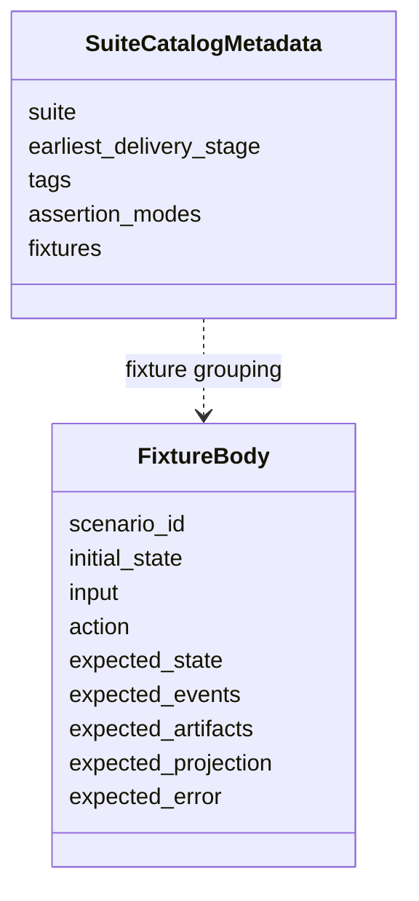
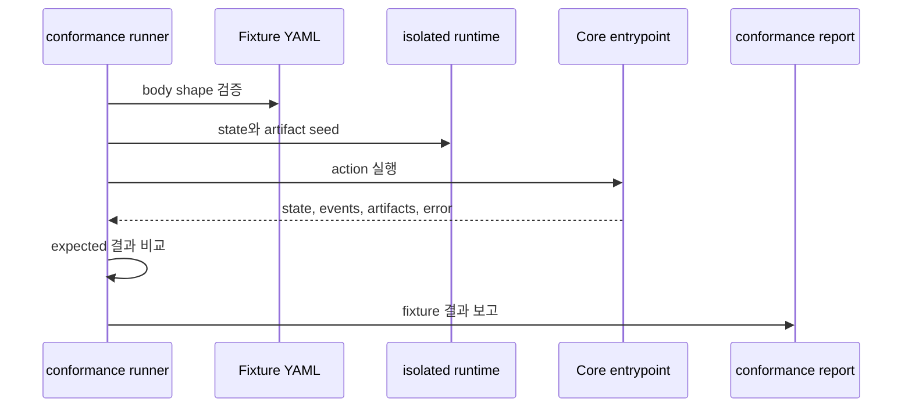

# Conformance Fixtures 참조

## 이 문서로 할 수 있는 일

향후 Harness Server runtime test를 위한 핵심 적합성 모델을 찾아볼 때 이 참조 문서를 사용합니다. 여기에는 conformance가 무엇을 증명하는지, exact fixture body shape, runner execution behavior, fixture assertion semantics, 현재 단계 상태, 좁은 Kernel Smoke 작성 순서, 향후 fixture catalog와의 경계가 포함됩니다.

이 문서는 conformance author, implementer, maintainer를 위한 lookup 문서입니다. 운영자 절차 문서가 아니므로 operator entrypoint와 `harness conformance run` overview는 [운영과 Conformance 참조](operations-and-conformance.md)를 사용합니다.

이 문서는 향후 conformance work를 위한 참조 문서입니다. 현재 저장소는 문서 전용이며 runnable Harness Server conformance test를 담고 있지 않습니다. 현재 단계와 인계 상태는 [구현 개요](../build/implementation-overview.md#문서-수락-상태)에 있습니다.

## 이런 때 읽기

- 향후 fixture 기반 conformance 설계를 작성하거나 리뷰할 때.
- 정확한 fixture body field, seed expansion limit, `ToolEnvelope` expansion convention, runner isolation behavior가 필요할 때.
- State, event, artifact, projection, error, validator, close blocker, redaction effect를 위한 fixture assertion mode가 필요할 때.
- 작은 v0.1 Kernel Smoke 작성 순서나 핵심 적합성 모델과 향후 fixture catalog 사이의 경계가 필요할 때.

## 읽기 전에

Conformance run entrypoint, suite-selection overview, docs-maintenance profile boundary, operator procedure는 [운영과 Conformance 참조](operations-and-conformance.md#conformance-run)를 사용합니다. Public request/response schema는 [MCP API와 스키마](mcp-api-and-schemas.md), storage layout과 seed-loader owner value는 [Storage와 DDL](storage-and-ddl.md), state transition과 stable event 의미는 [커널 참조](kernel.md), projection freshness는 [문서 Projection 참조](document-projection.md), policy validator behavior는 [설계 품질 정책](design-quality-policies.md), connector conformance overview는 [Agent 통합 참조](agent-integration.md)를 사용합니다.

## 핵심 생각

현재 이 문서는 runnable test 모음이 아니라 향후 적합성 검증 계획입니다. 문서 전용 단계에서는 이 예시에서 실제 fixture 파일을 만들지 않습니다.

Conformance에는 두 conceptual layer가 있습니다. 이 파일의 핵심 적합성 모델과, detailed later scenario를 담는 [향후 Fixture Catalog](future-fixture-catalog.md)입니다. 핵심 모델은 v0.1 Kernel Smoke를 설명할 만큼 작게 유지하여 later catalog coverage가 early implementation requirement처럼 보이지 않게 합니다.

구현이 시작된 뒤 conformance는 executable fixture로 Harness behavior를 증명합니다. Runtime fixture가 pass하려면 Core 또는 operator action을 실행하고 captured Core/API 또는 operator result를 structured expectation과 비교해야 합니다.

단언(assertion)의 권한은 층위가 있습니다.

- Prose scenario description, comment, rendered Markdown, Journey Card prose, status text, close report prose, agent summary는 설명일 뿐 권한이 아닙니다.
- Captured Core state, `task_events`, validator result, returned primary error, structured tool-specific blocker field는 fixture pass/fail을 위한 권위 있는 상태 단언입니다.
- Artifact ref, owner link, hash, size, content-type, redaction, file-integrity 단언은 scenario가 artifact 또는 evidence bytes에 의존할 때 권위 있는 단언입니다.
- Projection output은 projection support가 범위에 있을 때 freshness, source-state-version 표시, readability, availability를 확인할 수 있지만 renderer output이 Core state를 대체하거나, evidence를 충족하거나, write를 authorize하거나, close/accept/risk acceptance를 수행하거나, conformance truth의 source가 되면 안 됩니다. v0.1 Core Authority Slice는 empty 또는 "no projection requirement" field를 넘는 projection assertion을 요구하지 않습니다.

## 참조 범위

이 문서는 다음 항목을 담당합니다.

- conformance fixture body shape
- fixture seed shorthand limit과 owner-record expansion expectation
- 예시를 위한 `ToolEnvelope` expansion convention
- isolated fixture execution behavior
- fixture assertion semantics와 comparison mode
- suite catalog metadata boundary
- 검증 프로파일별 증명 동작과 축소된 Kernel Smoke 작성 순서
- 현재 단계 상태와 runtime conformance/docs-maintenance check 사이의 경계
- 향후 catalog scenario를 v0.1 또는 v0.2 requirement로 만들지 않는 link boundary

## 여기서 다루지 않는 것

이 참조 문서는 operator command procedure, docs-maintenance reporting, public MCP schema, SQLite DDL, projection template body, policy contract, detailed future scenario catalog를 담당하지 않습니다. 그것들은 각 owner Reference 문서에 남습니다. 여기의 suite metadata, example, catalog row는 fixture-body field, public request field, storage row, projection kind, runtime implementation readiness를 추가하지 않습니다.

## Conformance 탐색 지도

| 찾는 것 | 볼 곳 |
|---|---|
| 정확한 fixture body field | [Conformance Fixture Format](#conformance-fixture-format) |
| Runner가 load, seed, execute, capture, compare하는 방식 | [Conformance Execution](#conformance-execution) |
| `expected_state`, `expected_events`, `expected_artifacts`, `expected_projection`, `expected_error`의 default comparison mode | [Fixture Assertion Semantics](#fixture-assertion-semantics) |
| Suite intent와 작성 순서 | [Conformance staging](operations-and-conformance.md#conformance-staging), [커널 스모크(Kernel Smoke) Authoring Queue](#kernel-smoke-authoring-queue), [향후 Fixture Catalog: Fixture Suites](future-fixture-catalog.md#fixture-suites) |
| 핵심 모델과 현재 단계 경계 | [핵심 적합성 모델](#핵심-적합성-모델)과 [Fixture 현재 단계 상태](#fixture-현재-단계-상태) |
| Concern별 향후 fixture 예시 | [향후 Fixture Catalog](future-fixture-catalog.md) |

## 핵심 적합성 모델

핵심 적합성 모델은 향후 runtime conformance가 무엇을 증명하고 assertion authority가 어디에 있는지 정의합니다. Passing fixture는 하나의 Core 또는 operator action을 실행하고 captured structured result를 fixture expectation과 비교해 behavior를 증명합니다. Prose, 생성된 Markdown, Journey Card text, status prose, close prose, agent summary를 맞추는 것만으로 behavior를 증명하지 않습니다.

Assertion type은 의도적으로 작게 유지합니다.

- State assertion은 Core-owned record, `task_events`, validator result, returned primary error, structured blocker, owner ref, state-version behavior를 비교합니다.
- Artifact assertion은 scenario가 evidence bytes에 의존할 때 registered artifact identity, owner link, hash, size, content type, redaction state, availability, file-integrity fact를 비교합니다.
- Projection assertion은 projection support가 범위에 있을 때만 freshness, enqueue 또는 job status, source-state-version display, readability, availability를 비교합니다. Core state를 대체하거나 authority, evidence, close, acceptance, risk judgment를 충족하지 않습니다.
- Error assertion은 public schema precedence에 따른 API-owned primary `ErrorCode`와 optional details를 비교합니다.

State assertion은 "action 이후 Core가 무엇을 소유했는가?"에 답합니다. Artifact assertion은 "어떤 evidence bytes 또는 metadata가 안전하게 등록되고 link되었는가?"에 답합니다. Projection assertion은 "derived readable view가 current, stale, available, failed, queued 중 무엇인가?"에 답합니다. 이 위치들은 서로 분리되어 있으며 projection output이 state나 artifact proof를 대신하면 안 됩니다.

## 검증 프로파일별 증명 동작

검증 프로파일은 rendered output의 polish가 아니라 무엇을 증명하는지로 묶습니다. Profile 이름은 fixture-body field를 추가하지 않고, renderer를 권위 있게 만들지 않으며, 현재 문서 전용 저장소에 fixture file이 존재한다는 뜻도 아닙니다.

강화된 로컬 기준 목표(hardened local reference target)는 에이전시 보증 팩(v0.3 Agency Assurance Pack)과 운영과 인계 팩(v0.4 Operations & Handoff Pack)을 통해 도달하는 종합 목표입니다. 다섯 번째 fixture profile이 아니며 suite name으로 쓰면 안 됩니다.

| 프로파일 | 단계 이름 | 증명하는 동작 | 해당 프로파일 밖의 범위 |
|---|---|---|---|
| Core Authority Slice fixtures, 작성 label은 커널 스모크(Kernel Smoke) | v0.1 Core Authority Slice | Minimal authority loop만 증명합니다. Local project registration 하나, Task 하나, 범위가 정해진 작업 경계 하나, `prepare_write` allow/block, durable single-use Write Authorization 하나, compatible `record_run` 하나, artifact/evidence ref 하나, structured status/blocker response 하나가 포함됩니다. | 사용자 대상 MVP 가치, profile별 Decision Packet 품질, full Evidence Manifest, projection renderer support, 여러 projection kind, residual-risk acceptance semantics, work acceptance semantics, 수동 QA, 분리 검증, export/recover, release handoff, full conformance suite, future fixture catalog, higher guard guarantee, broad operations. |
| user-facing MVP fixtures | v0.2 User-Facing Harness MVP | 평범한 사용자 요청이 Harness vocabulary 없이 scope, user-owned judgment, evidence, close-readiness, work acceptance separation, residual-risk visibility, readable derived summary로 이어짐을 증명합니다. | Full agency assurance hardening, detached verification independence, 수동 QA matrix, stewardship policy suite, export/recover, release handoff, MVP path 밖의 automation. |
| Agency Assurance Pack fixtures | v0.3 Agency Assurance Pack | User-owned judgment, Approval, Write Authorization, 수동 QA, verification, work acceptance, residual-risk acceptance, stewardship, design-quality, context-hygiene, TDD, feedback-loop boundary가 Core record를 통해 분리되어 fixture-proven 상태임을 증명합니다. | Operator recovery/export completeness, release handoff, broad operations coverage, dashboard/hosted workflow UI, broad connector automation, 증명되지 않은 preventive 또는 isolated guarantee claim. |
| Operations & Handoff Pack / promoted-expansion fixtures | v0.4 Operations & Handoff Pack 및 v1+ Expansion | Export/recover, artifact integrity, release handoff, operator readiness, reconcile, broader conformance coverage, 승격된 future higher guarantee level 또는 automation profile을 증명합니다. | Owner 문서가 mechanism을 정의하고 fixture가 covered behavior를 증명하기 전의 stronger security, isolation, preventive guard, browser-capture, remote/shared MCP, automation claim. |

## Conformance Fixture Format

향후 runtime conformance는 fixture 기반입니다. Scenario table만으로는 충분하지 않습니다. 구체화된 각 test fixture는 action을 실행하고 state, events, artifacts, 관련되는 경우 projection status, errors를 검증해야 합니다.

각 fixture는 이 shape를 포함해야 합니다.

```yaml
scenario_id: string
initial_state: object
input: object
action: string
expected_state: object
expected_events: object[]
expected_artifacts: object[]
expected_projection: object
expected_error: object | null
```



향후 fixture file과 suite catalog는 fixture body 밖에 metadata를 가질 수 있습니다. Fixture body 자체는 위 field만 사용해야 conformance runner가 behavior를 일관되게 비교할 수 있습니다. Suite delivery stage, assertion mode, docs-maintenance result, prose status, authoring note를 표현하기 위해 fixture body field를 추가하지 않습니다. 그런 정보는 suite catalog metadata, docs-maintenance report, 주변 문서에 둡니다.

Fixture body type notation은 API의 [Schema notation convention](mcp-api-and-schemas.md#schema-notation-convention)을 따릅니다. 위 top-level fixture body field는 모두 required입니다. Fixture가 empty object, object map, array를 의도적으로 제공할 때는 `{}` 또는 `[]`를 사용합니다. Required top-level field를 생략하는 것은 invalid fixture body이며 "not asserted"가 아닙니다. v0.1 Core Authority Slice check에서 `expected_projection`은 `{}`이거나 explicit no-requirement assertion일 수 있습니다. Projection rendering은 v0.1 exit criterion이 아니기 때문입니다.

MCP tool action의 경우 향후 executable fixture `input`은 API docs가 정의하는 해당 tool의 public request payload입니다. Runner는 schema가 요구하는 경우 `envelope: ToolEnvelope`를 포함해 `action`에 해당하는 request schema로 `input`을 검증해야 합니다. 이 문서의 예시는 다음 envelope-expansion convention 아래에서만 `ToolEnvelope`를 생략할 수 있습니다. Validation, 정규화, request hashing, Core execution 전에 runner가 `initial_state`, suite defaults, fixture metadata에서 deterministic valid envelope를 제공합니다. Expanded request가 Core에 전달되는 값입니다. 이 convention은 fixture field를 추가하거나 fixture body shape를 바꾸거나 alternate request schema를 만들지 않습니다.

Fixture shorthand는 의도적으로 좁게 제한됩니다. `initial_state` seeding, suite catalog metadata, 그리고 `owner_records`, `stewardship_findings`, feedback-loop shorthand 같은 compact example의 documented seed-loader expansion에만 허용됩니다. 향후 실행 가능한 fixture file은 이 shorthand를 owner record, validator run, residual risk, 또는 DDL/API 문서가 소유하는 다른 record로 매핑해야 합니다. Shorthand는 두 번째 API나 상태 모델을 만들면 안 됩니다. Public mutation은 `input` 안의 scenario-only shorthand로 encoding하면 안 됩니다. Fixtures는 `record_run`, `record_eval`, `record_manual_qa`, `record_user_judgment`의 public request branch를 사용하거나, scenario가 preexisting state에 관한 것이라면 `initial_state`에 owner record를 seed해야 합니다. `close_task` fixture `input`은 documented envelope expansion 이후에도 `CloseTaskRequest`만이어야 합니다. Evidence profile, changed paths, artifact refs, acceptance-criteria support, self-check summary, 수동 QA records는 `initial_state`에 seed하거나 preceding public mutation fixture에서 record해야 합니다. `StewardshipImpactSummary` assertion은 파생 display이지 기준 current record가 아니며 `expected_state.derived` 또는 projection assertion 아래에 두어야 합니다. `owner_records.feedback_loops`는 기준 `feedback_loops` rows를 seed합니다. `feedback_loop_refs` 같은 example fields의 bare `FBL-*` values는 향후 executable fixtures에서 `StateRecordRef { record_kind: feedback_loop, record_id: ... }`로 매핑됩니다. Seeded state 대신 public mutation을 exercise하는 fixture body는 definition changes를 `record_run.payload.shaping_update.feedback_loop_updates` 아래의 `FeedbackLoopUpdate`로, execution/status changes를 `evidence_updates.feedback_loop_updates`로, 수동 QA execution을 `record_manual_qa.feedback_loop_ref`로 표현해야 합니다. Example이 `feedback_loop_id`와 `status`만 보여주면 fixture runner는 insert 또는 corresponding `FeedbackLoopUpdate` build 전에 surrounding Task, Change Unit, selected-loop, evidence shorthand에서 remaining required `feedback_loops` storage fields를 파생하거나 제공해야 합니다. Fixture shorthand의 accepted residual risk는 seeded `residual_risk` records의 state이며 standalone accepted-risk record가 아닙니다. Fixture examples가 `visible_refs`, `accepted_refs`, `not_visible_refs`, `unaccepted_refs`, `residual_risk_refs` 같은 risk-ref arrays에 bare `RISK-*` values를 사용할 때, 향후 executable fixtures는 이를 `StateRecordRef { record_kind: residual_risk, record_id: ... }`로 매핑해야 합니다. 이 bare IDs는 fixture shorthand일 뿐이며 DDL/API fields가 아닙니다. 향후 executable staged-delivery fixtures는 standalone `ARISK-*` records를 요구하면 안 됩니다.

`write_authorizations`를 seed하는 향후 executable fixtures는 valid stored rows를 만들어야 합니다. 각 seeded authorization row는 `basis_state_version`을 명시적으로 포함하거나, runner가 `state.sqlite`에 insert하기 전에 row의 Task에 대한 seeded affected-scope state version에서 이를 파생해야 합니다. 이는 storage-loader derivation rule일 뿐이며 fixture top-level field를 추가하거나 fixture body shape를 바꾸지 않습니다. Partial `expected_state.write_authorization` assertions는 idempotent replay, 최신성 감지, expiry, audit behavior를 test하지 않는 한 `basis_state_version`을 생략할 수 있습니다. `basis_state_version`은 allow-decision basis이지 resulting `ToolResponseBase.state_version`이 아닙니다.

Suite catalog metadata는 Core에 전달되지 않으며 fixture body의 일부가 아닙니다. Suite, delivery stage, tag별로 exact-shape fixture를 묶을 수 있습니다.

```yaml
suite: agency
earliest_delivery_stage: "v0.3 Agency Assurance Pack"
tags: [decision-gate, residual-risk, autonomy-boundary]
fixtures:
  - AGENCY-decision-packet-required-before-product-tradeoff-write
  - AGENCY-residual-risk-visible-before-acceptance
```

Runner는 이 metadata를 suite 선택, 순서 지정, reporting에 사용할 수 있습니다. Core에는 documented envelope expansion 이후의 action과 public `input`만 전달됩니다. Metadata가 seed expansion, fixture comparison semantics, tool request schema, expected owner records를 바꾸면 안 됩니다.

## Conformance Execution

향후 `harness conformance run`은 MCP tool과 operator command가 사용하는 것과 같은 Core entrypoint를 통해 fixture를 실행합니다. 동작을 prose output만 검사해서 검증하면 안 됩니다. Core entrypoint를 실행하고 그 결과의 state, events, artifacts, 관련되는 경우 projection, error를 비교해야 합니다.

향후 runtime fixture execution 의미:

1. Fixture YAML file을 load하고 exact fixture body shape를 검증합니다.
2. Fixture가 existing read-only sample을 명시적으로 target하지 않는 한 fresh isolated 하네스 런타임 홈과 임시 제품 저장소를 만듭니다. Runner는 state-changing fixture execution에 developer의 실제 하네스 런타임 홈이나 제품 저장소를 재사용하면 안 됩니다.
3. `initial_state`에서 `registry.sqlite`, `project.yaml`, `state.sqlite`, artifact file, fixture가 요구하는 경우 projection file, connector manifest를 seed합니다.
4. Core를 통해 `action`을 execute합니다. MCP tool action은 public request schema를 사용합니다. Documented `ToolEnvelope` expansion 이후 fixture `input`은 접점이 해당 MCP tool에 보낼 request payload와 같아야 합니다. `projection_refresh`, `doctor_surface`, `recover`, `artifacts_check` 같은 operator action은 [운영과 Conformance 참조](operations-and-conformance.md)의 operator semantics를 사용합니다.
5. Resulting state summary, 추가된 owner event, emitted validator result, artifact registry/file integrity, 관련되는 경우 projection job status, 관련되는 경우 reconcile item, returned error code를 capture합니다.
6. Captured result를 `expected_state`, `expected_events`, `expected_artifacts`, `expected_projection`, `expected_error`와 compare합니다. Empty expected section은 해당 section에 관련 effect가 없음을 단언합니다.
7. Fixture id, pass/fail, observed state summary, observed events, artifact integrity result, projection freshness, error comparison을 보고합니다.



Fixture action이 `expected_state_version`을 포함하면 runner는 `ToolEnvelope.task_id`만이 아니라 Core-resolved primary Task에 따라 비교합니다. Task-scoped actions는 seeded 또는 Core-resolved primary Task State Version과 비교하고, resolved primary Task가 없는 project-scoped actions는 Project State Version과 비교합니다. Captured response와 `task_events`의 `state_version` values는 resulting affected-scope versions로 비교합니다. Read-only fixtures는 primary read scope의 unchanged version을 검증할 수 있습니다. 이 설명은 fixture body shape를 바꾸지 않고 comparison 의미만 명확히 합니다.

Stale `expected_state_version` fixture는 단순한 concurrent-write test가 아니라 stale-authority test입니다. Exact idempotent replay는 예외입니다. Committed replay row가 있고 canonical request hash가 일치하면 fixture는 original committed response가 반환되고 current state-version freshness check가 다시 실행되지 않았음을 검증해야 합니다. Replay row가 없고 state-changing action이 commit 전에 conflict되면, owner document가 다른 recovery action을 명시하지 않는 한 fixture는 current record 변경 없음, `task_events` append 없음, artifact 등록 없음, projection job enqueue 없음, conflicting request를 위한 `tool_invocations` replay row 생성 없음까지 검증해야 합니다. 같은 key가 changed canonical request hash와 함께 재사용되면 fixture는 `STATE_CONFLICT`, original replay row 보존, 새 artifact/event/projection job/response field/owner relation이 merge되지 않음을 검증해야 합니다.

Fixture execution은 deterministic해야 합니다. Network access, wall-clock-sensitive expiry, external tool output은 suite가 integration smoke라고 명시적으로 선언하지 않는 한 stub하거나 seeded fixture input으로 표현해야 합니다.

Isolation은 pass 조건의 일부입니다. Fixture는 임시 제품 저장소와 하네스 런타임 홈에 file을 seed하고, 그곳에서 하나의 Core 또는 operator action을 실행한 뒤 captured result를 비교할 수 있습니다. Existing local runtime record, generated operational file, 이전 실행의 prose report에 의존하면 안 됩니다.

Seed validation은 action execution 전에 수행하고, captured-state validation은 action execution 이후에 수행합니다. 비교의 양쪽은 fixture-local string label이 아니라 owner-defined state loader와 value set을 사용합니다.

Conformance runner는 MCP tool과 operator command가 사용하는 동일한 Core storage loader를 통해 JSON `TEXT` field를 seed하고 검사해야 합니다. `initial_state`에 malformed JSON 또는 schema-incompatible JSON이 있는 fixture는 유효하지 않은 상태를 드러내야 합니다. Fixture action이 recovery path이고 safe reconstruction이 가능한 경우에는 복구 가능한 state issue를 드러내야 합니다. Runner는 JSON field를 opaque string으로 취급해서 shape validation을 건너뛰면 안 됩니다. 이 기대사항은 fixture body shape를 바꾸지 않습니다.

Conformance runner는 status-like `TEXT` field도 [Storage와 DDL](storage-and-ddl.md#canonical-enum-hardening)의 owner-bound hardening map을 통해 seed하고 검사해야 합니다. Fixture seed loader는 승격된 owner value가 있는 field의 compact shorthand와 expanded row를 검증해야 합니다. 여기에는 registry/project 접점 상태를 seed할 때의 `project_surfaces.guarantee_level`, `runs.kind`, `runs.status`, `write_authorizations.status`, `write_authorizations.guarantee_level`, `approvals.status`, `evidence_manifests.status`, `residual_risks.visibility_status`, `feedback_loops.loop_kind`, `feedback_loops.status`, `tdd_traces.status`, `validator_runs.status`, `validator_runs.guarantee_level`, `projection_jobs.projection_kind`, `projection_jobs.status`, `connector_manifests.status`, `baselines.status`, `change_units.status`, `tool_invocations.status`, `decision_requests.status`, `residual_risks.status`, `task_spine_entries.status`, `change_unit_dependencies.status`, `shared_designs.status`, `reconcile_items.status`, `domain_terms.status`, `module_map_items.status`, `interface_contracts.review_status`가 포함됩니다. `decision_requests.status`의 경우 optional `decision_requests` table을 유지하거나 fixture가 `decision_requests` row를 seed할 때만 검증이 적용됩니다. Minimal 코어 권한 조각(v0.1 Core Authority Slice) 구현은 이 table을 생략할 수 있습니다. 이 승격된 value도 시나리오 설명 label이 아니라 owner-bound storage value입니다. 예를 들어 `runs.status: completed`, `runs.status: interrupted`, `runs.status: violation`은 committed Run에 대한 Storage와 DDL compatibility meaning과 함께만 유효하며, `shared_designs.status: active`는 현재 design basis이지 작업 수락이나 Approval이 아닙니다. Executable fixture는 유효하지 않은 state recovery를 명시적으로 test하는 scenario가 아닌 한 unknown status value를 seed하면 안 됩니다. Expected-state status assertion은 prose label이 아니라 captured owner value를 비교합니다.

## Fixture Assertion Semantics

Fixture assertion mode는 runner default 또는 suite catalog metadata입니다. Core input이 아니고 MCP tool에 전달되지 않으며 fixture body에 field를 추가하면 안 됩니다. Fixture body는 정확히 `scenario_id`, `initial_state`, `input`, `action`, `expected_state`, `expected_events`, `expected_artifacts`, `expected_projection`, `expected_error`만 유지합니다.

Partial assertion object 안에서 omission은 "not asserted"를 뜻합니다. Value가 `null`인 listed field는 captured field가 present이고 JSON `null`과 같음을 assert합니다. Listed array value `[]`는 present empty array를 assert합니다. Owner schema가 해당 field를 map이라고 말하는 경우 listed object-map value `{}`는 present empty map을 assert합니다. `partial_deep` 아래의 structured object에서는 object 존재만 의도적으로 assert하는 경우가 아니라면 fixture author는 최소 하나의 child field를 나열해야 합니다.

이 omission rule은 assertion rule일 뿐입니다. Public MCP `input`에서 omitted field를 valid로 만들지 않습니다. Fixture `input`은 documented envelope expansion 이후에도 owning public request schema를 통과해야 합니다.

Default comparison modes:

| Fixture field | Default assertion mode |
|---|---|
| `expected_state` | `partial_deep`; 나열된 field는 재귀적으로 일치해야 하며 나열되지 않은 field는 검증하지 않습니다. Suite metadata가 `expected_state: exact`로 설정할 수 있습니다. |
| `expected_events` | Captured `task_events`의 stable-catalog projection에 대한 `contains_ordered`; 나열된 stable event는 ascending `task_events.event_seq` 순서대로 나타나야 하며 unrelated stable event가 앞, 사이, 뒤에 있어도 됩니다. Suite metadata가 `expected_events: exact`로 설정할 수 있습니다. |
| `expected_artifacts` | `contains_by_identity`; 나열된 각 artifact는 같은 `artifact_id`와 `kind`를 가진 registered artifact와 일치해야 하며, 그 밖에 나열된 artifact field는 재귀적으로 일치합니다. |
| `expected_projection` | `partial_by_kind`; 나열된 각 projection kind는 해당 kind에 대해 나열된 status assertion 또는 partial object assertion을 만족해야 합니다. |
| `expected_error` | `expected_error: null`은 action이 error를 반환하지 않았음을 검증합니다. `expected_error`가 object이면 `expected_error.code`는 required이며 API가 소유한 [Primary Error Code Precedence](mcp-api-and-schemas.md#primary-error-code-precedence)에 따라 선택된 primary API `ErrorCode`인 `ToolError.code`, 즉 response에 errors가 있으면 `ToolResponseBase.errors[0].code`와 exact match합니다. Arbitrary secondary error, validator finding code, policy finding code, local diagnostic label과 match하면 안 됩니다. `expected_error.details`는 optional입니다. Omitted이면 details field는 검증하지 않습니다. `details`가 present이면 suite metadata가 `expected_error.details: exact`로 설정하지 않는 한 `partial_deep`으로 match합니다. |

`expected_events`는 기본적으로 `contains_ordered`이므로 `expected_events: []`는 fixture가 특정 stable event를 요구하지 않는다는 뜻입니다. 이것만으로 captured stable-event stream이 empty임을 assert하지 않습니다. Stable event가 없었음을 assert하려면 suite metadata에서 해당 fixture 또는 suite에 `expected_events: exact`를 설정해야 합니다. 마찬가지로 `expected_artifacts: []`와 `expected_projection: {}`는 default mode에서 required artifact 또는 projection entry가 없다는 뜻입니다. Compatible exact-mode metadata가 없다면 captured artifact나 projection observation을 금지하지 않습니다.

`expected_events` comparisons는 captured `task_events`의 [Kernel Stable Event Catalog](kernel.md#stable-event-catalog) projection을 대상으로 합니다. API tool detail/audit event lists는 이 set을 확장하지 않습니다. `task_events`에 capture된 non-catalog detail 또는 local-audit events는 normal staged-delivery fixture를 fail하게 만들면 안 됩니다. Suite metadata가 `expected_events: exact`로 설정하면, future v1+/local suite가 implementation-specific detail-event assertions를 명시적으로 opt in하지 않는 한 exactness는 captured stream의 stable-event projection에 적용됩니다. Validator IDs, Core check names, projection status shorthands, fixture seed shorthand, scenario catalog IDs는 event names가 아닙니다. Prose examples는 non-catalog event names를 illustrative 또는 future extension ideas로 언급할 수 있지만, executable staged-delivery fixtures는 kernel catalog가 승격하기 전까지 이를 요구하면 안 됩니다.

Conformance runner는 captured `task_events`를 `event_seq`로 order합니다. `state_version`, `created_at`, `event_id`는 `expected_events` ordering의 tie-breaker가 아닙니다.

Fixture authors는 API precedence가 generic validator fallback을 선택할 때만 `VALIDATOR_FAILED`를 `expected_error.code`로 사용해야 합니다. `EVIDENCE_INSUFFICIENT`, `QA_REQUIRED`, `PROJECTION_STALE`, `ARTIFACT_MISSING` 같은 더 specific한 typed blocker가 적용되면 그 code가 primary입니다.

`CloseTaskResponse.blockers[].code` 역시 API `ErrorCode` value입니다. Policy-specific 또는 validator-specific finding code는 `expected_state.validators`, validator finding assertion, 또는 equivalent expected validator output 아래에 두어야 하며, `expected_error.code`나 close blocker `code`에 두면 안 됩니다. Blocked close를 다루는 fixture는 `CloseTaskResponse.blockers` 또는 captured equivalent인 `expected_state.close_blockers` 같은 structured blocker를 assert해야 합니다. Report prose, Journey Card text, status text, agent summary만 맞춰서는 close blocker를 증명할 수 없습니다.

`expected_state.validators` 아래의 validator assertion은 validator ID로 keyed됩니다. 나열된 각 validator ID는 captured validator results에 존재해야 하며 나열된 field와 부분적으로 일치해야 합니다. 나열되지 않은 validator ID와 나열되지 않은 validator field는 검증하지 않습니다.

Fixture가 설계 품질 severity를 검증할 때는 모든 관련 validator 결과를 `expected_state.validators` 아래 보이게 유지하고, policy-owned [Severity Composition Rule](design-quality-policies.md#severity-composition-rule)이 산출한 합성된 gate, write-blocker, close-blocker, waiver, Decision Packet outcome도 검증해야 합니다. Fixture는 policy schema를 추가하거나 더 강한 merged blocker가 있다는 이유만으로 lower-severity finding을 숨기면 안 됩니다.

`expected_state.checks` 아래의 Core check와 precondition assertion은 check/precondition name을 key로 사용합니다. 이 entry는 captured Core check output, blocked reason, response summary, 또는 runner가 관찰한 equivalent check status와 비교합니다. MCP API 또는 Storage와 DDL이 해당 ID를 stable ValidatorResult로 명시적으로 승격하지 않는 한 이 값들은 validator ID가 아니며 `expected_state.validators` 아래에 두면 안 됩니다.

`expected_state.checks.projection_freshness`는 Core mechanical projection freshness check를 검증합니다. `expected_state.validators.context_hygiene_check`는 higher-level context hygiene에 대한 stable ValidatorResult를 검증합니다. 그 validator가 projection freshness를 고려할 수는 있지만, mechanical check 자체의 fixture assertion 위치는 아닙니다.

`secret_omitted` 또는 `blocked` artifact를 다루는 fixture는 committed artifact의 `redaction_state`를 `expected_artifacts` 아래에서 검증하고, 이후 상태 또는 표시 영향을 owner assertion 위치에서 검증해야 합니다. Evidence 또는 QA state는 `expected_state`, verification outcome은 Eval 관련 state 또는 error assertion, projection freshness/display availability는 `expected_projection` 또는 `expected_state.checks.projection_freshness`, export 또는 Release Handoff behavior는 operator action에서 capture된 기존 fixture assertion으로 검증합니다. Fixture는 생략된 secret 또는 PII 값을 assert하면 안 됩니다.

Artifact redaction, blocked-input, integrity, export non-leakage의 detailed scenario row는 향후 catalog entry입니다. [향후 Fixture Catalog: Artifact Redaction And Export Non-Leakage Catalog Entries](future-fixture-catalog.md#artifact-redaction-and-export-non-leakage-catalog-entries)를 봅니다.

Allowed `expected_projection` status assertions:

| Assertion | Meaning |
|---|---|
| `enqueued` | Action 이후 projection kind에 대한 refresh job 또는 동등한 projection outbox entry가 pending 상태입니다. |
| `current` | Projection kind가 committed state version과 managed hash에 대해 current입니다. |
| `stale` | State, evidence, managed content가 렌더링된 projection보다 앞서 나가 projection kind가 `stale`입니다. |
| `failed` | Kind에 대한 latest applicable projection 새로고침이 failed입니다. |
| `skipped` | Kind에 대한 latest applicable projection job이 skipped입니다. 예를 들어 superseded되었거나 managed-block drift로 blocked된 경우입니다. |
| `stale_or_enqueued` | `stale` 또는 `enqueued` 중 하나면 허용됩니다. Scenario가 projection invalidation 또는 대기열 추가를 증명하고 runner가 refresh 경계 양쪽 중 하나를 observe할 수 있을 때 사용합니다. |
| `stale_or_failed` | `stale` 또는 `failed` 중 하나면 허용됩니다. 렌더링 failure가 `failed` freshness로 드러나거나 failed job을 동반한 `stale` freshness로 드러날 수 있을 때 사용합니다. |

`TASK: stale_or_enqueued` 같은 projection shorthand는 `TASK` projection kind에 대한 scalar status assertion입니다. Object form은 `partial_by_kind`를 유지하면서 additional captured projection field를 검증할 수 있습니다. 예: `TASK: {status: current}`. 이 assertion operator는 fixture comparison 의미이지, owning schema documents가 정의하지 않는 한 새로운 projection DDL 또는 API enum value가 아닙니다.

Projection assertion은 projection freshness, enqueue status, source-state-version display, 관련 job fact를 비교합니다. Rendered Markdown을 기준 상태로 비교하지 않으며, failed render가 captured Core state와 event를 rollback하거나 rewrite하게 만들지도 않습니다.

Suite catalog는 fixture를 바꾸지 않고 assertion mode를 override할 수 있습니다.

```yaml
suite: core
assertion_modes:
  expected_state: exact
  expected_events: exact
  expected_error.details: exact
fixtures:
  - CORE-active-status-no-task
```

향후 conformance는 captured Core state, `task_events`, validator result, artifact registry/file integrity, projection job 또는 freshness state, returned error code, applicable structured tool-specific blocker field를 통해 behavior를 증명해야 합니다. Rendered Markdown, Journey Card prose, status prose, close report prose, agent prose만 맞춰서는 fixture를 통과시킬 수 없습니다.

Fixture runner는 `request_hash`, baseline `tree_hash`, projection `managed_hash`에 대해 reference implementation과 같은 정규화 rule을 사용해야 합니다. 세부 알고리즘은 MCP API, Storage와 DDL, Document Projection 문서가 계속 담당합니다. Conformance fixture는 그 기준 기록 경계를 다시 정의하지 않고 deterministic behavior를 검증합니다.

## Fixture 현재 단계 상태

현재 저장소는 문서 전용입니다. 이 문서 batch는 executable fixture file, executable fixture catalog file, generated projection, runtime state, database, Harness Server conformance test를 만들지 않습니다.

Fixture 예시와 queue는 향후 작성 계획입니다. 문서 수락, 별도의 구현 계획 준비 결정, Harness Server 구현, 명시적인 fixture materialization step이 있은 뒤에야 runnable 상태가 됩니다. Docs-maintenance check는 Markdown drift를 보고할 수 있지만 runtime conformance가 아니며 Core fixture result를 만들지 않습니다.

## Catalog-Only Fixture Skeleton Guidance

Catalog skeleton guidance는 승격된 향후 catalog family를 exact-shape fixture로 옮길 때 쓰는 지침입니다. Executable fixture body, public request schema, DDL extension, runner design, stage-exit requirement가 아닙니다. Delivery-stage mapping은 suite catalog metadata에 두며 fixture body에 넣지 않습니다. "Minimum seeded records"는 Storage와 DDL 규칙으로 expansion 및 validation을 거친 뒤 `initial_state`에 들어가는 owner record를 뜻합니다. Public mutation은 계속 정확한 MCP request payload를 `input`으로 사용합니다.

Detailed future catalog scenario는 [향후 Fixture Catalog](future-fixture-catalog.md)에 있습니다.

## Kernel Smoke Authoring Queue

한국어 표현: 커널 스모크 작성 순서.

이 queue는 코어 권한 조각(v0.1 Core Authority Slice) smoke-check candidate를 위한 향후 작성 지침입니다. 커널 스모크(Kernel Smoke)는 첫 내부 권한 루프를 위한 좁은 작성 label이지 제품 MVP, full conformance suite, 향후 fixture catalog가 아닙니다. 이 row들은 executable fixture file이 이미 존재한다고 암시하지 않습니다. Compact authoring order일 뿐이며, 첫 구현 계획은 Build가 이름 붙인 하나의 authority loop를 증명하는 가장 작은 subset만 구체화할 수 있습니다.

Kernel Smoke는 projection requirement 없음이 기본입니다. Minimal owner path가 이미 그런 fact를 만들고 target behavior 증명에 도움이 될 때만 projection freshness 또는 enqueue/failure fact를 검증할 수 있습니다. Projection-template polish, detailed report template, 여러 projection kind, Browser QA Capture, export/recover, reconcile, stewardship, context hygiene, full operations, future guarantee-level fixture는 owner docs가 특정 좁은 path를 나중에 승격하지 않는 한 v0.1 밖에 둡니다.

Table의 `None`은 기존 fixture field를 비워 두거나 `expected_error: null`을 사용한다는 뜻입니다. 새 sentinel value가 아닙니다.

| Queue | Fixture candidate | Intended Core 또는 operator action | Minimum seeded records | Main expected state assertion | Expected stable event assertion | Expected artifact assertion | Expected projection assertion | Expected primary error |
|---|---|---|---|---|---|---|---|---|
| 1 | `CORE-project-registration` | `connect`, project registration, 또는 owner registration action | 비어 있거나 등록되지 않은 isolated runtime home과 임시 Product Repository | Local project 하나가 idempotent하게 등록됨. Registration만으로 active Task나 Write Authorization이 생기지 않음 | Owner stable event catalog가 정의할 때만 registration event | None | Projection requirement 없음 | None |
| 2 | `CORE-task-one-active-record` | `harness.intake`, task creation owner path, 또는 validated seed path | 등록된 local project. Active Task 없음 | Lifecycle phase, state version, minimal gate/status state를 가진 active Task 하나가 생김. Task creation만으로 Write Authorization이 생기지 않음 | Owner stable event catalog가 promote하지 않는 ordinary create에는 None | None | Projection requirement 없음. Owner path가 이미 projection을 invalidate할 때만 `TASK` enqueue 허용 | None |
| 3 | `CORE-scope-boundary-one-path` | Owner scope action 또는 이것이 minimal owner path인 경우 `harness.record_run`의 `kind=shaping_update` | Current state version을 가진 active Task. Product-write Run 없음 | Active scope 또는 Change Unit 하나가 selected path/tool/command를 constrain함. Scope 자체는 write authority를 만들지 않음 | Shaping Run이 committed되면 `run_recorded`, 또는 owner-promoted scope event가 있으면 그 event | Shaping update가 `ArtifactInput`으로 context artifact를 등록할 때만 있음 | Projection requirement 없음. State가 바뀌면 `TASK` stale/enqueued 허용 | None |
| 4 | `CORE-prepare-write-allowed-creates-write-authorization` | `harness.prepare_write` | Active Task, compatible scope, 필요한 경우 compatible baseline, compatible surface guarantee, unresolved seeded required judgment 없음 | Durable Write Authorization이 compatible Task, scope/Change Unit, intended operation, `basis_state_version`, status, `consumed_by_run_id=null`로 생성됨 | Promoted stable event일 때 `prepare_write_allowed`, `write_authorization_created` | None | Projection requirement 없음. State가 바뀌면 `TASK` stale/enqueued 허용 | None |
| 5 | `CORE-record-run-consumes-write-authorization` | `harness.record_run`의 `kind=direct` 또는 `kind=implementation` | Active Task, compatible scope, compatible unconsumed Write Authorization, 필요한 경우 baseline | Run이 한 번 commit되고 supplied Write Authorization을 consume함. 두 번째 distinct Run은 consumed authorization을 재사용할 수 없음 | Promoted되면 `run_recorded`, `write_authorization_consumed`; owner catalog가 promote하지 않는 한 pre-commit reuse rejection에는 stable event 없음 | Run이 artifact도 등록할 때만 있음 | Projection requirement 없음. Pre-commit rejection에는 projection job 없음 | First use는 None. Reuse는 `WRITE_AUTHORIZATION_CONSUMED`, `WRITE_AUTHORIZATION_INVALID`, 또는 owner-equivalent error |
| 6 | `CORE-record-run-registers-artifact-evidence-ref` | `harness.record_run` | Active Task, compatible scope, product-write인 경우 compatible Write Authorization, staged artifact 또는 evidence input | Run 또는 minimal owner relation이 integrity/redaction metadata와 same-Task ownership을 가진 registered `ArtifactRef` 또는 equivalent evidence ref 하나를 link함 | `run_recorded`; evidence/artifact event는 owner catalog가 promote할 때만 | Applicable한 hash/size/content-type/redaction metadata가 있는 registered `ArtifactRef` 또는 owner evidence ref | Projection requirement 없음. State가 바뀌면 `TASK` stale/enqueued 허용 | None |
| 7 | `CORE-status-structured-blocker-and-idempotency-minimal` | `harness.status`, smoke path가 구현한 경우 `harness.next`, 또는 minimal state-conflict/idempotency tool call 하나 | Current scope/write-authority/evidence summary가 있는 active Task, 또는 seeded stale/idempotent request case | Read가 current Task, scope, write authority, artifact/evidence support, blockers를 반환하고 mutate하지 않음. Minimal stale/idempotent case는 Core state와 replay semantics를 보존함 | Read-only status에는 None. Owner catalog가 promote하지 않는 한 rejected stale request에는 stable event 없음 | None | Read-only status/blocker output은 projection enqueue 없음 | Status는 None. Minimal stale/idempotency case는 `STATE_CONFLICT` 또는 owner-equivalent conflict |

위 queue는 의도적으로 작습니다. v0.1은 full conformance suite, broad catalog family coverage, 작업 수락 의미, 수동 QA, 분리 검증, export/recover, reconcile, stewardship, context hygiene, Browser QA Capture, future guarantee-level check를 요구하지 않습니다.

## 향후 fixture catalog

Detailed scenario family는 early reference가 핵심 적합성 모델에 집중하도록 [향후 Fixture Catalog](future-fixture-catalog.md)로 이동했습니다. 그 catalog에는 Browser QA Capture, cross-surface behavior, export non-leakage, context hygiene, reconcile, stewardship, full operations, advanced projection rendering, artifact redaction/integrity, future guarantee-level fixture를 위한 향후 항목이 있습니다.

그 catalog entry는 promoted owner path가 exact-shape executable fixture로 구체화하기 전까지 design inventory일 뿐입니다. v0.1 requirement가 아니며, 그 자체로 v0.2를 확장하지 않고, 이 저장소가 문서 전용인 동안 runtime conformance로 계산하지 않습니다.

## Metrics Boundary

Long-term operational metrics는 derived analytics이지 staged-delivery-critical state나 conformance requirement가 아닙니다. Approval turnaround, verification latency, projection stale duration, same-session guard frequency, surface fallback rate 같은 metric은 future version이 owner docs, fixture 또는 conformance target, fallback behavior, 관련 redaction/retention policy, projection-as-canonical dependency 없음, implementation ownership과 함께 승격하기 전까지 [roadmap](../roadmap.md)에 read-only diagnostic으로 둡니다.
