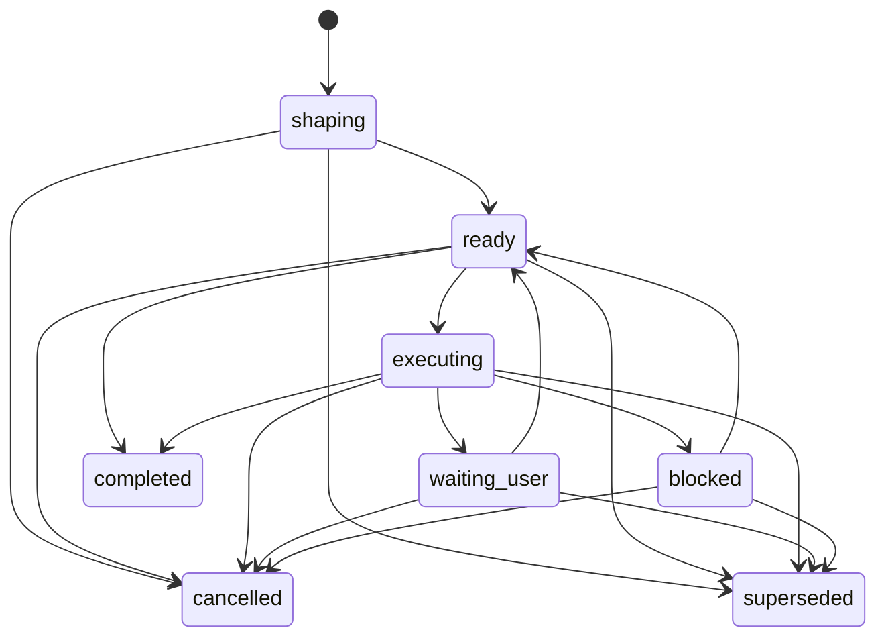

# Core Model 참조

이 문서는 향후 하네스 Core의 핵심 모델과 권한 경계를 정의합니다. 문서 소스일 뿐이며, 이 저장소에는 아직 하네스 런타임이나 서버 구현이 없습니다. 현재 문서가 구현 완료 상태인지는 유지보수자가 소유하는 [MVP 계획](../build/mvp-plan.md#문서-수락-상태)의 상태만으로 판단합니다.

Core는 작업 범위, 사용자가 소유하는 판단, 증거, 검증 기대치, 닫기 준비 상태, 잔여 위험을 위한 로컬 기준 기록입니다. Core의 권한은 하네스 기록과 하네스 상태 전이에 미칩니다. OS 권한, 임의 도구 샌드박스, 권한 격리, 변조 방지, 보안 격리는 다른 담당 문서가 정확한 메커니즘을 문서화하고 증명하지 않는 한 Core 권한이 아닙니다.

## 1. 담당하는 것 / 담당하지 않는 것

이 문서가 담당합니다.

- Core 불변조건과 권한 경계.
- 상태, 쓰기 호환성, gate 동작, 닫기에 영향을 주는 entity 관계 의미.
- 사용자가 소유하는 판단의 경계와 대체 불가능 규칙.
- Gate 의미, blocker 의미, lifecycle 원칙, 상태 전이 원칙.
- `update_scope`, `prepare_write`, Write Authorization, `record_run`, `close_task`, 면제, 잔여 위험 표시, 정직한 닫기.
- Core, API, Storage, Projection, Security, Later 자료가 서로 넘지 말아야 하는 소유자 간 권한 연결.

이 문서는 담당하지 않습니다.

- 공개 MCP 요청/응답 형태. [MVP API](api/mvp-api.md), [API Schema Core](api/schema-core.md), [API Errors](api/errors.md)를 봅니다.
- 정확한 활성 메서드 이름, enum, 스키마 값 집합. [API Schema Core](api/schema-core.md#current-mvp-value-sets)를 봅니다.
- 저장소 테이블, DDL, Runtime Home 배치, 잠금, 마이그레이션, 지속 저장 JSON 배치. [Storage](storage.md)를 봅니다.
- 렌더링된 Projection 본문이나 템플릿 본문. [Projection과 Template 참조](projection-and-templates.md)를 봅니다.
- 커넥터 `capability_profile`과 접점별 구성 메모. [Agent 통합 참조](agent-integration.md)를 봅니다.
- Core 권한 결과를 넘어서는 보안 보장 어휘. [보안 참조](security.md)를 봅니다.
- later 후보 목록. 담당 문서가 active 범위로 승격하기 전까지 [Later](../later/index.md)에 둡니다.

정확한 API 요청 필드와 저장소 테이블 정의는 여기서 참조로만 이름 붙입니다. Core 상태 값은 권한과 상태 전이 의미를 설명해야 할 때만 다룹니다.

## 2. 커널 불변조건

1. Core가 소유한 상태가 하네스 동작의 기준입니다. 대화, 보고서, 생성된 Markdown, 상태 카드, Projection, 템플릿 출력은 파생 표시이거나 맥락입니다.
2. 하네스는 하네스 기록과 상태 전이를 다룹니다. OS 권한, 임의 도구 제어나 샌드박스, 변조 방지 저장소, 기본 도구 실행 전 차단, 보안 격리를 제공하지 않습니다.
3. 제품 파일 쓰기는 `prepare_write`가 `allowed` 호환성 결과를 반환하기 전에 명시적이고 호환되는 범위를 가져야 합니다.
4. `harness.intake` 이후 활성 Task 범위와 활성 Change Unit 변경은 `harness.update_scope`를 거칩니다. `scope_decision` 사용자 판단은 참조로 연결될 수 있지만 그 자체로 활성 범위를 바꾸지 않습니다.
5. `dry_run=false`인 호환 allowed `prepare_write` 경로만 consumable Write Authorization을 만듭니다.
6. Write Authorization은 호환되는 attempt 하나에 한 번만 쓰입니다. 재사용 가능한 범위도 아니고 OS 권한도 아닙니다.
7. `record_run`은 실제로 일어난 일을 기록하고 호환되는 Write Authorization을 소비합니다. 범위, 사용자 판단, 민감 동작 승인, Write Authorization 없이 일어난 일을 사후에 승인할 수 없습니다.
8. 사용자가 소유하는 판단은 에이전트 추론, 포괄적 동의, 생성 문구, 증거, Projection 텍스트로 대체될 수 없습니다.
9. 제품 판단, 기술 판단, 범위 판단, 민감 동작 승인, 최종 수락, 잔여 위험 수락, 취소 판단은 현재 MVP의 활성 판단 경로로 서로 다릅니다. 나중에 `QA 면제 판단`과 `검증 위험 수락`이 승격되더라도 둘은 서로 다른 later/reserved 경로로 남아야 합니다.
10. 증거, 검증, 수동 QA, 최종 수락, 잔여 위험 표시, 잔여 위험 수락, 닫기 준비 상태는 서로를 대신하지 않습니다.
11. 닫기와 관련된 blocker가 남아 있으면 `close_task`는 성공 닫기 대신 blocker를 반환해야 합니다. 성공 닫기가 알려진 잔여 위험에 의존한다면 그 위험은 먼저 보여야 합니다.
12. 현재 활성 MVP 범위와 later 후보 자료는 분리됩니다. later 후보는 담당 문서가 범위, 대체 동작, 증명 기대치와 함께 승격할 때만 active가 됩니다.

## 3. 엔티티 모델

아래 엔티티는 권한 관계를 정의합니다. 저장소 테이블이나 API 본문을 추가하지 않습니다.

- Task: 사용자 가치 단위입니다. 현재 구체적 `mode`, 범위 관계, blocker, 판단 필요성, 증거 상태, 닫기 준비 상태, 최종 수락 상태, 잔여 위험 상태, latest Run 관계를 기록합니다. 활성 구체적 Task `mode` 값은 [API Schema Core](api/schema-core.md#current-mvp-value-sets)가 담당합니다. `harness.intake`의 `auto`는 분류 입력일 뿐 Task 상태가 아닙니다.
- Change Unit: 쓰기가 가능한 작업의 활성 범위 경계입니다. 제품 파일 쓰기는 호환되는 active Change Unit 안에 포함되어야 합니다. `harness.intake` 이후에는 `harness.update_scope`가 활성 Change Unit을 만들거나 교체할 수 있는 활성 경로입니다.
- Autonomy Boundary: Change Unit 안에서 에이전트가 가질 수 있는 판단 재량 범위입니다. 범위, 민감 동작 승인, 증거, 최종 수락, 잔여 위험 수락이 아닙니다.
- `user_judgment`: 사용자가 소유하는 선택을 위한 기준 기록군입니다. 판단 호환성에 반영되지만 그 자체로 evidence, Write Authorization, 범위 변경, Change Unit 변경, close를 만들지는 않습니다.
- Write Authorization: 호환되는 non-dry-run `prepare_write`만 만드는 오래 남는 1회용 Core 기록입니다. Lifecycle은 active, consumed, stale, expired, revoked 중 하나일 수 있습니다. `allowed`는 `prepare_write` decision이지 지속되는 authorization status가 아닙니다. `blocked`도 authorization status가 아닙니다.
- Run: 실행 또는 관찰 기록입니다. 제품 쓰기 Run은 호환되는 활성 Write Authorization을 소비해야 합니다. 읽기 전용 또는 구체화 전용 Run은 이후 쓰기를 호환되게 만들지 않습니다.
- 증거 요약: 닫기 관련 주장, Run, 차단 사유, 사용자 판단, `ArtifactRef` 값을 연결하는 active 간결 Core 증거 경로입니다. 전체 Evidence Manifest는 담당 문서가 켜기 전까지 active가 아닙니다.
- `ArtifactRef`: API/Storage가 담당하는 오래 남는 evidence reference shape입니다. Core는 등록되어 있고, integrity와 redaction을 보존하며, 담당 기록과 연결될 때만 증거로 사용할 수 있는 참조로 다룹니다.
- Blocker: progress, write, close가 정직하게 진행될 수 없는 구조화된 이유입니다.
- 잔여 위험 요약: 알려진 남은 불확실성, 확인하지 못한 조건, 한계, 절충점을 보여 주는 active 간결 경로입니다. 상세 residual-risk record는 승격 전까지 later 후보 자료입니다.
- Projection과 템플릿: Core가 소유한 상태와 참조에서 파생한 표시입니다. 읽기 쉽거나 사람이 고쳤다는 이유로 권한이 되지 않습니다.

Discovery와 요구사항 구체화는 Task, `harness.update_scope`/Change Unit, `user_judgment` 담당 경로를 통해 지속됩니다. 별도 구체화 brief, 설계 표시, journey 또는 reconcile record, 상세 risk record, Eval record, 수동 QA record, 전체 Evidence Manifest는 담당 문서가 명시적으로 승격하기 전까지 현재 활성 MVP에서 Core가 소유한 상태가 아닙니다.

최소 활성 구체화 정보는 평소 말로 들어온 요청을 안전한 다음 단계 하나로 바꾸는 데 필요한 간결한 상태입니다. 새 아티팩트가 아닙니다. 다음 담당 경로로 표현합니다.

- Task 상태: 현재 목표 요약, Task `mode`, lifecycle phase, 필요할 때 막히는 질문 하나, 다음 안전한 행동 하나, 활성 Change Unit 포인터.
- Task 또는 Change Unit 범위 필드: 활성 범위 요약, 허용 경로 또는 영향 영역, 범위 밖 항목, 수락 기준, Autonomy Boundary, baseline 참조, 제약.
- `user_judgment` 기록 또는 후보: 필요한 사용자 소유 판단.
- 증거 요약과 차단 사유 기록: 증거 기대 또는 증거 공백, 활성 차단 사유, 닫기 차단 사유.

필요한 구체화 항목이 아직 알려지지 않았거나, 최신이 아니거나, 사용할 수 없거나, 의견이 갈리면 Core는 이를 `unknown`, 대기 중인 사용자 소유 판단, 차단 사유, 다음 안전한 행동으로 드러내야 합니다. 요청을 쓰기 가능한 것처럼 보이게 만들려고 별도 활성 `Discovery Brief`, `Question Queue`, `Assumption Register` 같은 커밋된 계획 아티팩트를 만들면 안 됩니다.

명령, Run, 검토, validator, 진단, QA, 검증에서 나온 finding은 active 담당 경로를 통해 라우팅될 때만 Core에 영향을 줍니다. 예를 들면 차단 사유, 증거 요약, 사용자 판단, `harness.update_scope`, 닫기 차단 사유입니다. 대화나 보고서 문장에 남은 finding은 상태가 아닙니다.

## 4. 사용자가 소유하는 판단 경계

사용자가 소유하는 판단은 하네스가 추론하지 않고 사용자에게 묻거나 사용자의 선택으로 보존해야 하는 경계입니다. 정확한 `UserJudgment` schema와 API field는 [API Schema Core](api/schema-core.md)와 [MVP API](api/mvp-api.md)가 담당합니다. 이 섹션은 판단 경계의 의미를 담당합니다.

현재 MVP의 활성 판단 종류는 서로 분리됩니다.

- 제품 판단: 제품 동작, UX, 문구, 릴리스에 드러나는 약속, 사용자 가치.
- 기술 판단: 아키텍처, 의존성, 마이그레이션, 공개 인터페이스, 호환성, 보안/개인정보, 중요한 기술 방향.
- 범위 판단: 범위 확장, 비목표 제거, Change Unit 경계, Autonomy Boundary 변경.
- 민감 동작 승인: 경계가 정해진 이름 붙은 민감 단계에 대한 허가.
- 최종 수락: 경로가 수락을 요구할 때 사용자가 결과를 판단하는 것.
- 잔여 위험 수락: 요청한 닫기를 위해 이름 붙은 보이는 잔여 위험을 수락하는 것.
- 취소 판단: 성공 결과 없이 Task를 멈추는 것.

나중에 담당 문서가 승격하기 전까지 `QA 면제 판단`과 `검증 위험 수락`은 [Later](../later/index.md)에 남는 later/reserved 판단 후보입니다. 정책이 허용하는 수동 QA 요구사항의 면제, 또는 필수 검증이 빠졌거나 면제된 데 따른 위험 수락을 위한 개념 경계일 뿐이며, 현재 MVP의 활성 `UserJudgment.judgment_kind` 값이 아닙니다.

모호한 동의는 좁게 해석합니다. "진행해", "좋아", "looks good" 같은 포괄적 승인은 다른 판단 종류를 조용히 만족할 수 없습니다. 하나의 사용자 답변이 여러 판단 경로를 만족하려면 프롬프트가 그 판단들을 명시적으로 물었고, Core가 각 판단을 영향을 받는 대상, 범위, 결과, 닫기/쓰기 영향과 함께 호환되게 기록해야 합니다.

`judgment_kind=scope_decision` 해결 기록은 사용자의 범위 선택을 보존합니다. 하지만 활성 Task 범위 필드나 활성 Change Unit을 직접 바꾸지는 않습니다. 그 효과를 위한 다음 상태 변경 행동은 `harness.update_scope`이며, 필요하면 해결된 판단을 참조로 연결합니다.

## 5. 대체 불가능 규칙

Core는 아래 분리를 지켜야 합니다.

- 대화, 생성된 Markdown, Projection 문장, 보고서 문구는 Core가 소유한 상태를 대신하지 않습니다.
- 증거, log, screenshot, artifact, test output은 최종 수락, 수동 QA, 검증, 잔여 위험 수락을 대신하지 않습니다.
- QA는 최종 수락이 아닙니다. 나중에 승격되는 QA 면제 판단도 QA 증거나 QA 통과가 아닙니다.
- 나중에 승격되는 검증 위험 수락도 검증, 분리형 검증, 보증 수준 향상이 아닙니다.
- 민감 동작 승인은 제품 방향, 기술 방향, 범위, 정확성, 증거, QA, 최종 수락, 잔여 위험 수락, Write Authorization을 대신하지 않습니다.
- 제품 판단, 기술 판단, 범위 판단은 서로를 대신하지 않습니다.
- 최종 수락은 증거를 만들거나, 증거 공백을 지우거나, QA를 만족하거나, 검증을 증명하거나, 민감 동작 승인을 부여하거나, 범위를 바꾸거나, 잔여 위험을 수락하거나, 차단 사유를 무시하지 않습니다.
- 잔여 위험 수락은 작업을 검증하거나, no-risk close를 만들거나, 증거를 만족하거나, QA를 만족하거나, 최종 수락을 암시하지 않습니다.
- Stale 또는 failed Projection은 그 자체로 닫기를 막거나 허용하지 않습니다. 현재 Core 닫기 상태와 차단 사유가 기준입니다.

이 규칙은 사용자에게 보이는 화면이 간결하게 표시될 때도 유지됩니다. 간결한 출력은 친절할 수 있지만 권한 경계를 합치면 안 됩니다.

## 6. 활성 관문과 예약된 관문 이름

Gate는 진행, 쓰기, Run 기록, 닫기를 위한 Core 호환성 축입니다. 공개 스키마에 노출되는 현재 MVP의 활성 gate 필드는 [API Schema Core](api/schema-core.md#current-mvp-value-sets)가 담당하는 필드뿐입니다. 계획 문장에 gate 이름이 있다는 이유만으로 활성 스키마 필드, 저장소 기록, validator, 닫기 요구사항이 생기지 않습니다.

- Scope Gate: active scope가 요청한 쓰기 또는 닫기 관련 작업을 포함하는지.
- Decision Gate: 해결되지 않은 사용자 소유 판단이 진행, 쓰기, 닫기를 막는지. 민감 동작 승인, 증거, 검증, QA, 최종 수락, 잔여 위험 수락을 대신하지 않습니다.
- Approval Gate: 범위가 정해진 민감 동작 승인이 needed, pending, usable, denied, expired, drifted 중 어디인지. 민감 동작에 대한 허가일 뿐입니다.
- Evidence Gate: 필수 닫기 관련 증거가 absent, partial, sufficient, stale, blocked 중 어디인지.
- Acceptance Gate: 최종 수락이 required인지, required라면 닫기 근거가 보인 뒤 기록되었는지.
- Capability Boundary: 접점 역량은 차단 사유, validator 발견 사항, 보장 표시에 영향을 주지만 권한을 만드는 gate가 아닙니다. 역량이 부족하면 주장을 좁히거나, 담당 경로를 통해 동작을 보류하거나, 역량 차단 사유를 만들어야 합니다. 검증이나 사전 차단이 실제로 일어난 것처럼 꾸미면 안 됩니다.

예약된 gate 이름은 다음과 같습니다.

- Design Gate는 later/reserved gate 이름입니다. 현재 MVP에는 `design_gate` 공개 스키마 필드도, 독립 설계 정책 닫기 gate도 없습니다. 설계 품질 관찰 사항은 제품/기술/범위 판단, 증거, 잔여 위험 표시, 접점 역량, 또는 이미 활성화된 `CloseBlocker.category` 같은 활성 담당 경로로 라우팅합니다.
- Verification Gate는 later/reserved gate 이름입니다. 현재 MVP에는 `verification_gate` 공개 스키마 필드도, 분리형 검증 흐름도 없습니다. 향후 담당 문서가 정확한 필드, 필수 조건, 대체 동작, 증명 기대치를 승격해야 활성 닫기 의미에 영향을 줄 수 있습니다.
- QA Gate는 later/reserved gate 이름입니다. 현재 MVP에는 `qa_gate` 공개 스키마 필드도, 수동 QA gate도 없습니다. 향후 담당 문서가 정확한 필드, waiver 동작, 아티팩트 처리, 증명 기대치를 승격해야 활성 닫기 의미에 영향을 줄 수 있습니다.

공개 응답에서 gate 상태를 어떻게 노출하는지는 [API Schema Core](api/schema-core.md)와 메서드 담당 문서가 맡습니다. Core는 호환성 의미와 오래된 gate 요약을 쓰기 또는 닫기 전에 다시 계산해야 한다는 규칙을 담당합니다.

## 7. 작업 생명주기

Lifecycle은 Core 상태 전이 규율입니다. 표시 스크립트가 아닙니다. Active fixture와 schema 담당 문서가 정확한 값을 노출할 수 있지만 Core 원칙은 다음과 같습니다.

- `Task.lifecycle_phase`는 지속 저장되는 생명주기 필드입니다. 활성 값 집합은 `shaping`, `ready`, `executing`, `waiting_user`, `blocked`, `completed`, `cancelled`, `superseded`입니다.
- `completed`, `cancelled`, `superseded`는 종료 생명주기 값입니다. `intake`는 API 메서드이자 시작 처리 단계일 뿐, 지속 저장되는 `lifecycle_phase`가 아닙니다.
- `Task.mode`는 구체적 Task 상태입니다. 값은 `advisor`, `direct`, `work` 중 하나일 수 있습니다. `auto`는 `harness.intake` 분류 요청일 뿐이며 `tasks.mode`나 `StateSummary.mode`로 저장되거나 표시되기 전에 확정되어야 합니다.
- Task는 담당 경로를 통해서만 shaping, ready, executing, 사용자 판단 대기, blocked, completed, cancelled, superseded 상태로 움직일 수 있습니다.
- 조언/읽기 전용 작업은 제품 파일 쓰기를 만들면 안 됩니다. 쓰기 가능한 직접/추적 대상 작업은 호환되는 범위와 Write Authorization 경로를 거쳐야 합니다.
- 제품 파일 쓰기 경로는 범위 확정 또는 `harness.update_scope`, 필요한 사용자 판단과 민감 동작 확인, `prepare_write`, 호환되는 제품 쓰기 Run 하나, `record_run`, 증거/차단 사유 업데이트, `close_task`를 통과합니다.
- `close_ready`는 파생 조건입니다. `lifecycle_phase`가 아니며 Task를 completed로 옮기지 않습니다. Task를 completed로 옮기는 것은 `close_task`뿐입니다.
- 멱등 재실행은 상태 전이, event, Write Authorization, Run, artifact, 증거 업데이트, 닫기 효과를 중복 만들면 안 됩니다.
- `dry_run` 호출은 가능한 결과를 설명할 수 있지만 기준 상태, 소비 가능한 Write Authorization, 아티팩트, 닫기 상태, 재실행 행을 만들지 않습니다.

구체화와 관련된 lifecycle 값은 현재 MVP에서 아래 의미로 씁니다.

- `shaping`: 요청이 아직 쓰기 가능한 상태가 아닙니다. Task는 있지만 최소 구체화 정보가 아직 불완전하거나, 모호하거나, 최신이 아니거나, 쓰기 가능한 작업에서는 활성 Change Unit으로 표현되지 않았습니다.
- `waiting_user`: 다음 안전한 행동 전에 특정 사용자 소유 판단이 필요합니다. 나중에 보면 되는 참고 질문은 활성 차단 사유가 아니며 `waiting_user`를 요구하지 않습니다.
- `ready`: 다음 행동으로 갈 만큼 현재 범위가 잡혔습니다. 쓰기 가능한 작업에서는 활성 Change Unit이 있고 `prepare_write`로 이동할 수 있다는 뜻입니다. 그래도 Write Authorization은 아닙니다.
- `blocked`: 시스템, 범위, 역량, 증거, 복구, 닫기 또는 다른 활성 차단 사유 때문에 이름 붙은 해결 조치 전에는 정직하게 진행할 수 없습니다.

Stable event name은 Core 변경을 위한 추가 전용 이력 라벨입니다. 그 자체가 권한은 아닙니다. 목록에는 Task lifecycle 업데이트, 범위 업데이트, Change Unit 교체, `prepare_write` decision, Write Authorization 생성/소비/stale 처리/만료/취소, Run 기록, 사용자 판단 업데이트, gate 재계산, 증거 업데이트, 차단 사유 업데이트, 잔여 위험 표시 또는 수락, 닫기 시도, 닫기 성공, 취소, supersession이 포함되어야 합니다. waiver 이벤트 이름은 later 담당 경로가 승격될 때까지 예약 후보로 둡니다. 정확한 event payload와 지속 저장 방식은 API와 Storage가 담당합니다.

## 8. `update_scope` 권한

`harness.update_scope`는 `harness.intake` 이후 활성 Task의 목표 요약, 범위 경계, 비목표, 수락 기준, Autonomy Boundary, baseline 참조, 활성 Change Unit을 바꾸는 활성 Core 경로입니다.

이 메서드는 활성 Task의 활성 Change Unit을 만들거나 교체할 수 있습니다. 활성 Change Unit을 교체하면 이전 Change Unit은 이후 쓰기 호환성의 active 기준이 아닙니다. 범위, baseline, Autonomy Boundary, 수락 근거, 활성 Change Unit이 바뀌어 활성 Write Authorization이 현재 Core 상태와 더 이상 맞지 않으면 Core는 해당 Write Authorization을 `stale` 상태로 표시합니다. `stale` 처리는 감사와 재실행을 위해 기록을 보존하는 것입니다. 소비, 만료, 취소, Write Authorization 재사용이 아닙니다.

`harness.update_scope`는 관련된 해결된 `scope_decision` 사용자 판단을 참조 필드로 연결할 수 있습니다. 그 참조는 변경의 사용자 소유 근거를 설명하지만, `user_judgment` 기록 자체가 활성 범위를 바꾸지는 않습니다.

`harness.update_scope`는 Task를 시작하거나, 사용자 판단을 해결하거나, 제품 쓰기를 승인하거나, Write Authorization을 소비하거나, 증거를 기록하거나, 최종 수락을 만들거나, 잔여 위험을 수락하거나, 작업을 닫지 않습니다.

## 9. `prepare_write` 권한

`prepare_write`는 제품 파일 쓰기를 위한 유일한 쓰기 전 호환성 판단 지점입니다. 현재 MVP에서는 경로 수준의 의도한 동작을 활성 Task, Change Unit, 범위, baseline, Autonomy Boundary, 필요한 사용자 소유 판단, 민감 동작 승인, 접점 역량, 그 밖의 활성 담당 경로 선행조건과 비교합니다.

`dry_run=false`이고 `decision=allowed`인 호환 경로만 소비 가능한 Write Authorization을 만듭니다. `dry_run` 응답, `blocked`, `approval_required`, `decision_required`, `state_conflict`는 응답, 차단 사유, 오류 상태로만 남습니다. 소비 가능한 Write Authorization 행, 재실행 행, 증거 기록, 닫기 상태, 하네스 쓰기 호환성 기록을 만들면 안 됩니다.

Write Authorization은 협력형 하네스 기록입니다. 연결된 에이전트나 접점에게 의도한 쓰기가 현재 하네스 상태와 호환된다고 알려줄 수 있습니다. OS 권한을 주거나, 샌드박스를 강제하거나, 임의 도구를 막거나, 저장소를 변조 방지 상태로 만들거나, 동작을 격리하지 않습니다.

MCP 또는 연결된 접점이 필요한 협력형 확인을 수행할 수 없으면 정직한 결과는 보류, 차단 사유, 낮아진 보장 표시, 역량 오류 중 하나입니다. 예방형 또는 격리형 표현은 해당 동작을 포함하는 정확한 경계가 문서화되고 증명되었을 때만 사용할 수 있습니다.

현재 MVP의 `prepare_write`는 활성 접점이 제공할 수 없는 명령 관찰, 네트워크 관찰, 비밀값 접근 관찰, 아티팩트 캡처, 도구 실행 전 차단, 격리를 요구하는 요청을 거절하거나 차단해야 합니다. 공개 API 검증 오류와 역량 오류는 [API 오류](api/errors.md)가 담당합니다. 지원되지 않는 관찰을 활성 Write Authorization 안에 넣으면 안 됩니다.

## 10. `record_run` 권한

`record_run`은 실행 또는 관찰을 기록합니다. 쓰기를 사후 승인하는 두 번째 기회가 아닙니다.

제품 쓰기 Run에서는 Core가 호환되는 활성 Write Authorization을 불러와야 합니다. 접점이 정직하게 관찰할 수 있는 범위에서 관찰된 변경 경로를 저장된 경로 수준 승인 시도와 현재 상태에 비교하고, 호환될 때만 Write Authorization을 정확히 한 번 소비합니다. Write Authorization이 없거나, 오래됐거나, 만료됐거나, 취소됐거나, 이미 소비됐거나, 맞지 않거나, 충분히 관찰할 수 없으면 성공 소비로 기록할 수 없습니다. 기준 프로필에서는 명령, 네트워크, 비밀값 접근, 아티팩트 캡처, 차단, 격리 호환성을 검증됨으로 표시하면 안 됩니다.

`record_run`은 담당 경로가 승인한 artifact path를 통해서만 `ArtifactRef` 값을 등록하거나 연결할 수 있습니다. 원시 비밀값, token, 금지된 민감 log, 호출자가 임의로 준 path, 신뢰할 수 없는 bytes는 evidence를 완성해 보이게 하려고 저장하면 안 됩니다. 거절, 가림, omitted/blocked 표시, 승인된 안전 handle 중 하나로 처리해야 합니다.

읽기 전용 Run과 구체화 전용 Run은 제품 파일 변경을 보고하지 않을 때만 Write Authorization 없이 기록할 수 있습니다. Active 담당 경로가 지원하면 violation 또는 audit record가 관찰된 문제를 문서화할 수 있습니다. 하지만 관련 담당 기록을 통해 복구되기 전까지 완료 증거, 최종 수락, 잔여 위험 수락, 닫기 준비 상태, QA, 검증을 만족하지 않습니다.

## 11. `close_task` 권한

`close_task`는 단일 완료 판단 지점입니다. 에이전트 요약, 최종 보고서, 수락처럼 보이는 대화, Projection, Eval, QA note, evidence display는 닫기에 정보를 줄 수 있습니다. 하지만 그것만으로 Task를 닫지 않습니다.

성공 닫기에서는 Core가 닫기 의도를 현재 Task 상태, 열린 Run, 범위, 사용자 소유 판단, 필요한 민감 동작 승인, Write Authorization과 Run 호환성, 관련될 때 baseline과 접점 역량, 필수 증거 충분성, 닫기 관련 아티팩트 가용성, 필수 최종 수락, 닫기에 영향을 주는 잔여 위험의 필요한 수준 표시, 활성 닫기 경로가 요구하는 잔여 위험 수락, 복구 제약, cancellation 또는 supersession 충돌과 비교해야 합니다.

닫기와 관련된 필드는 서로 다른 계약입니다.

| 개념 | Core 의미 |
|---|---|
| `Task.lifecycle_phase` | 지속 저장되는 생명주기 위치입니다. 값은 `shaping`, `ready`, `executing`, `waiting_user`, `blocked`, `completed`, `cancelled`, `superseded`입니다. |
| `CloseTaskResponse.close_state` | 응답 수준의 닫기 상태입니다. 값은 `ready`, `blocked`, `closed`, `cancelled`, `superseded`입니다. 지속 저장되는 생명주기 필드가 아닙니다. |
| `Task.close_reason` | 지속 저장되는 닫기 사유 세부값입니다. 값은 `none`, `completed_self_checked`, `completed_with_risk_accepted`, `cancelled`, `superseded`입니다. |
| `Task.result` | 작업의 굵은 결과입니다. 값은 `none`, `advice_only`, `completed`, `cancelled`, `superseded`입니다. Run 상태, validator 결과, 증거 상태, 차단 사유가 아닙니다. |

현재 MVP 닫기는 later 보증 자료와 설계 정책 자료를 활성 응답 의미로 끌어오면 안 됩니다. `design_gate`, `CloseBlocker.category=design_policy`, `verification_gate`, `qa_gate`, 분리형 검증, `completed_verified`, 자세한 수동 QA 닫기 필드, Full Evidence Manifest 동작, 보증 표시 세부사항은 담당 문서가 명시적으로 켜기 전까지 later 후보 동작입니다.

필요한 Task/범위 정합성, 사용자 소유 판단, 민감 동작 승인, Write Authorization 또는 Run 호환성, 증거, 아티팩트 가용성, 최종 수락, 잔여 위험 표시, 잔여 위험 수락, cancellation/supersession 처리, 접점 역량, baseline, 복구 조건이 남아 있으면 `close_task`는 completed라고 꾸미지 말고 차단 사유를 반환해야 합니다. 공개 응답이 primary error 하나를 고르더라도 보조 닫기 차단 사유와 참조는 다음 안전한 행동을 정할 만큼 보여야 합니다.

Cancellation과 supersession은 정직한 종료 경로입니다. 성공 완료가 아닙니다. Risk-accepted close는 이름 붙은 accepted risk가 있는 성공 닫기입니다. Verified close도 아니고 no-risk close도 아닙니다.

`harness.close_task`에 `intent=supersede`를 사용하면 이전 Task는 `lifecycle_phase=superseded`, `close_reason=superseded`, `result=superseded`로 이동합니다. superseded된 Task가 `project_state.active_task_id`라면 Core는 `superseding_task_id`가 같은 프로젝트의 유효한 열린 Task를 가리킬 때만 `project_state.active_task_id`를 그 값으로 바꿔야 합니다. 그렇지 않으면 활성 포인터를 비워야 합니다. superseded된 이전 Task를 active로 남기면 안 됩니다.

## 12. Blocker

Blocker는 상태 전이가 정직하게 진행될 수 없는 구조화된 이유입니다. 진행, 쓰기, Run 기록, 닫기를 막을 수 있습니다. 가능한 경우 영향을 받는 Task 또는 Change Unit, category, 누락되었거나 호환되지 않는 조건, related refs, next safe action을 이름 붙여야 합니다.

흔한 차단 사유에는 활성 Task 없음, 활성 범위 없음, 범위 밖 쓰기 의도, 해결되지 않은 사용자 소유 판단, 민감 동작 승인 없음, 맞지 않는 Autonomy Boundary, 부족한 접점 역량, 없거나 유효하지 않은 Write Authorization, 오래된 baseline, 증거 없음, 오래됐거나 사용할 수 없는 artifact support, 최종 수락 없음, 숨겨진 잔여 위험, 닫기에 영향을 주는 수락되지 않은 잔여 위험, 안전하지 않은 열린 Run, 복구 제약, cancellation conflict, supersession conflict가 있습니다.

유효하지 않은 상태 조합은 차단 사유, 거절, 복구 경로가 되어야 합니다. Projection 산문, 포괄적 승인, 적용되지 않는 면제, 충돌을 숨기는 닫기 결과로 덮으면 안 됩니다.

## 13. 면제

면제는 정책이 허용하는 이름 붙은 요구사항에 대한 범위 있는 예외입니다. 어떤 요구사항을 건너뛰었는지, 영향을 받는 Task와 Change Unit, reason, actor, timing, affected gate 또는 close impact, 필요한 만료 조건 또는 다음 조치, 닫기에 영향을 주는 잔여 위험을 보존해야 합니다.

현재 MVP에는 독립 설계 정책 waiver가 없습니다. 향후 waiver 또는 위험 수락 경로는 좁게 남으며, 승격 전까지 동작하지 않습니다.

- 향후 설계 정책 담당 문서가 정확한 범위, 대체 불가 규칙, 닫기 영향, 기록 동작을 승격할 때만 later 설계 정책 waiver.
- 향후 담당 문서가 수동 QA 요구사항을 승격하고 정책이 허용할 때만 later/reserved QA waiver.
- 향후 담당 문서가 필수 검증 요구사항을 승격하고 사용자가 빠졌거나 면제된 검증의 이름 붙은 위험을 수락할 때만 later/reserved verification-risk acceptance.

허용되지 않습니다.

- 제품 쓰기에 대한 scope waiver.
- Sensitive-action approval waiver.
- Completion에 evidence가 required인데 evidence waiver.
- Acceptance가 required인데 최종 수락 면제.
- Residual-risk visibility waiver.

판단 유예는 waiver가 아닙니다. 나중에 승격되는 QA waiver도 QA 통과가 아닙니다. 나중에 승격되는 verification-risk acceptance도 검증이 아닙니다. Waiver는 이름 붙인 요구사항 하나만, 그리고 그 요구사항의 담당 경로가 허용하는 범위에서만 차단 해소할 수 있습니다.

## 14. 잔여 위험

잔여 위험은 닫기에 의미가 있는 알려진 남은 불확실성, 확인하지 못한 조건, 한계, 절충점입니다. 닫기에 영향을 주는 알려진 잔여 위험은 성공 닫기 전에 필요한 수준으로 보여야 합니다. 닫기가 그 위험 수락에 의존한다면 Core는 보이는 위험과 related refs에 연결된 호환되는 `judgment_kind=residual_risk_acceptance` 사용자 판단을 요구합니다.

잔여 위험 수락은 작업을 검증하지 않고, 증거를 만족하지 않고, QA를 만족하지 않고, 민감 동작 승인을 주지 않고, 최종 수락을 만들지 않고, 무위험 결과를 만들지 않습니다. 요청한 닫기를 위해 이름 붙은 보이는 위험을 사용자가 수락했다는 기록입니다.

현재 활성 경로는 간결한 잔여 위험 요약, 차단 사유, 증거 참조, `user_judgment` 참조를 사용합니다. 풍부한 잔여 위험 기록, 검토 흐름, 인계 보고서, later 보증 표시는 승격 전까지 later 후보 자료입니다.

## 15. 소유자 간 연결

Core 권한이 다른 계약과 닿을 때는 아래 담당 문서를 사용합니다.

- 공개 API 메서드 동작, 요청/응답 형태, 활성 메서드 이름과 스키마 값 집합, envelope, 상태 충돌, 오류: [MVP API](api/mvp-api.md), [API Schema Core](api/schema-core.md), [API Errors](api/errors.md).
- 저장소 테이블, DDL, Runtime Home 배치, 잠금, 마이그레이션, 아티팩트 저장소, enum hardening: [Storage](storage.md).
- Projection 최신성, 읽기용 보기, 관리 블록, 사람이 편집할 수 있는 영역, active 렌더링 템플릿 본문: [Projection과 Template 참조](projection-and-templates.md).
- 보안 보장 문구, cooperative/detective/preventive/isolated 라벨, 로컬 접근 태세: [보안 참조](security.md).
- 런타임 경계 안의 배치와 Core-only mutation 권한: [런타임 경계 참조](runtime-boundaries.md).
- 설계 품질 활성 역할과 닫기 영향 경계: [설계 품질](design-quality.md).
- 커넥터 `capability_profile`과 접점별 대체 동작: [Agent 통합 참조](agent-integration.md).
- 적합성 예시, 향후 fixture 경계, 운영 진입점 후보: [적합성 참조](conformance.md), [Later 후보 색인: Future fixture families](../later/index.md#future-fixture-families), [Later 후보 색인: 운영 후보](../later/index.md#operations-candidates).

다른 문서가 정확한 스키마, DDL table, 렌더링된 템플릿 본문, later 후보 목록을 필요로 하면 여기서 다시 정의하지 말고 담당 문서로 연결해야 합니다.
