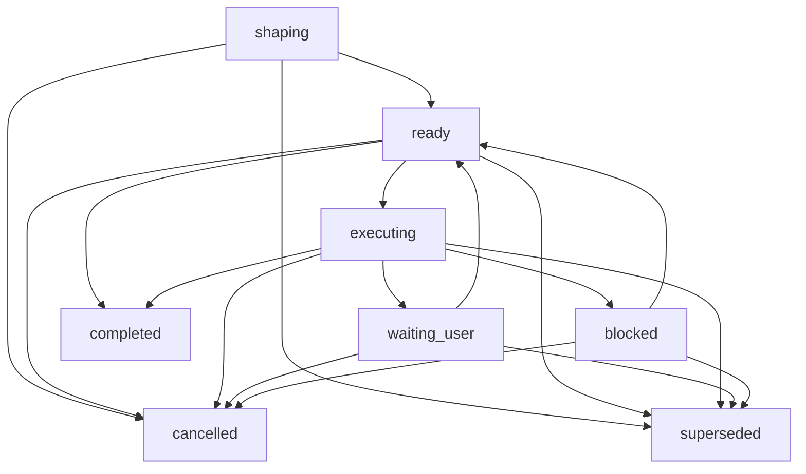

# Core Model 참조

이 문서는 향후 하네스 Core의 핵심 모델과 권한 경계를 정의합니다. 문서 소스일 뿐이며, 이 저장소에는 아직 하네스 런타임이나 서버 구현이 없습니다. 현재 문서가 구현 완료 상태인지는 유지보수자가 소유하는 [MVP 계획](../build/mvp-plan.md#문서-수락-상태)의 상태만으로 판단합니다.

Core는 작업 범위, 사용자 소유 판단, 증거, 활성 관문이 아닌 검증 기대치, 닫기 가능성, 잔여 위험을 다루는 로컬 기준 기록입니다. Core는 하네스 기록과 하네스 상태 전이에 대한 권한을 갖되, 그 권한은 Core가 소유한 핵심 상태에 한정됩니다. 현재 MVP에서 검증과 수동 QA는 개념 경계일 뿐 활성 관문이 아닙니다. OS 권한, 임의 도구 샌드박스, 권한 격리, 변조 방지, 보안 격리는 다른 담당 문서가 정확한 메커니즘을 문서화하고 증명하지 않는 한 Core 권한이 아닙니다.

## 1. 담당하는 것 / 담당하지 않는 것

이 문서가 담당합니다.

- Core 불변조건과 권한 경계.
- 상태, 쓰기 호환성, 관문 동작, 닫기에 영향을 주는 엔티티 관계 의미.
- `ShapingReadiness` 의미와 첫 Change Unit 전 활성 상태 준비 경계.
- 사용자 소유 판단의 경계와 대체 불가능 규칙.
- 관문 의미, 차단 사유 의미, 생명주기 원칙, 상태 전이 원칙.
- `update_scope`, `prepare_write`, Write Authorization, `record_run`, `close_task`, 예약된 면제 경계, 잔여 위험 표시, 정직한 닫기.
- Core, API, Storage, Projection, Security, 이후 후보 자료가 서로 넘지 말아야 하는 담당 문서 간 권한 연결.

이 문서는 담당하지 않습니다.

- 공개 MCP 요청/응답 형태. [MVP API](api/mvp-api.md), [API Schema Core](api/schema-core.md), [API Errors](api/errors.md)를 봅니다.
- 정확한 활성 메서드 이름, enum, 스키마 값 집합. [API Schema Core](api/schema-core.md#current-mvp-value-sets)를 봅니다.
- 저장소 테이블, DDL, Runtime Home 배치, 잠금, 마이그레이션, 지속 저장 JSON 배치. [Storage](storage.md)를 봅니다.
- 렌더링된 Projection 본문이나 템플릿 본문. [Projection과 Template 참조](projection-and-templates.md)를 봅니다.
- 커넥터 `capability_profile`과 접점별 구성 메모. [Agent 통합 참조](agent-integration.md)를 봅니다.
- Core 권한 결과를 넘어서는 보안 보장 어휘. [보안 참조](security.md)를 봅니다.
- 이후 후보 목록. 담당 문서가 활성 범위로 승격하기 전까지 [이후 후보 색인](../later/index.md)에 둡니다.

정확한 API 요청 필드와 저장소 테이블 정의는 여기서 참조로만 이름 붙입니다. Core 상태 값은 권한과 상태 전이 의미를 설명해야 할 때만 다룹니다.

## 2. 커널 불변조건

1. Core가 소유한 상태가 하네스 동작의 기준입니다. 대화, 보고서, 생성된 Markdown, 상태 카드, Projection, 템플릿 출력은 파생 표시이거나 맥락입니다.
2. 하네스는 하네스 기록과 상태 전이를 다룹니다. OS 권한, 임의 도구 제어나 샌드박스, 변조 방지 저장소, 기본 도구 실행 전 차단, 보안 격리를 제공하지 않습니다.
3. 제품 파일 쓰기는 `prepare_write`가 `allowed` 호환성 결과를 반환하기 전에 명시적이고 호환되는 범위를 가져야 합니다.
4. `harness.intake` 이후 활성 Task 범위와 활성 Change Unit 변경은 `harness.update_scope`를 거칩니다. `scope_decision` 사용자 판단은 참조로 연결될 수 있지만 그 자체로 활성 범위를 바꾸지 않습니다.
5. `dry_run=false`인 호환 allowed `prepare_write` 경로만 consumable Write Authorization을 만듭니다.
6. Write Authorization은 호환되는 attempt 하나에 한 번만 쓰입니다. 재사용 가능한 범위도 아니고 OS 권한도 아닙니다.
7. `record_run`은 실제로 일어난 일을 기록하고 호환되는 Write Authorization을 소비합니다. 범위, 사용자 판단, 민감 동작 승인, Write Authorization 없이 일어난 일을 사후에 승인할 수 없습니다.
8. 사용자 소유 판단은 에이전트 추론, 포괄적 동의, 생성 문구, 증거, Projection 텍스트로 대체될 수 없습니다.
9. 현재 MVP의 활성 판단 경로는 `product_decision`, `technical_decision`, `scope_decision`, `sensitive_approval`, `final_acceptance`, `residual_risk_acceptance`, `cancellation`뿐입니다.
10. 검증과 수동 QA는 현재 MVP의 활성 관문이 아닙니다. 증거, 향후 검증 또는 수동 QA 경로, 최종 수락, 잔여 위험 표시, 잔여 위험 수락, 닫기 준비 상태는 서로를 대신하지 않습니다.
11. 닫기와 관련된 blocker가 남아 있으면 `close_task`는 성공 닫기 대신 blocker를 반환해야 합니다. 성공 닫기가 알려진 잔여 위험에 의존한다면 그 위험은 먼저 보여야 합니다.
12. 현재 MVP에는 공개 상태 시계가 하나만 있습니다. `project_state.state_version`은 공개 변경의 최신성, 충돌 판단, Write Authorization 호환성, 재실행 사실에 쓰는 유일한 상태 버전 기준입니다. Task 식별자는 Task별 시계를 고르지 않습니다.
13. 현재 MVP 범위와 이후 후보 자료는 분리됩니다. 이후 후보는 담당 문서가 범위, 대체 동작, 증명 기대치와 함께 승격할 때만 활성화됩니다.

Core는 API 응답과 상태 효과 어휘를 일관되게 씁니다. `MethodResult`는 `ToolResultBase`를 바탕으로 한 메서드별 실제 메서드 결과 분기입니다. 여기에는 `effect_kind=read_only`인 실제 읽기 결과, `effect_kind=core_committed`인 Core 커밋 결과, `effect_kind=staging_created`인 성공한 스테이징 결과, 메서드 상태 효과 계약이 허용하는 커밋된 차단 결과가 포함됩니다. `ToolRejectedResponse`는 `effect_kind=no_effect`인 커밋 전 실패 분기입니다. 메서드별 성공 필드를 담지 않으며, 재실행 행 없음, 상태 버전 증가 없음, 스테이징된 핸들 소비 없음, Write Authorization 생성 또는 소비 없음이 적용됩니다. `ToolDryRunResponse`는 `effect_kind=no_effect`인 유효한 `dry_run` 미리보기 분기입니다. 상태 효과가 없고, 실제 생성 참조나 소비 가능한 권한을 담지 않습니다. 오래된 프로젝트 전체 상태, 오래된 `WriteAuthorization.basis_state_version`, 유효하지 않은 스테이징된 핸들은 거절 응답이며 성공처럼 생긴 결과 필드로 표현하지 않습니다.

## 3. 엔티티 모델

아래 엔티티는 권한 관계를 정의합니다. 저장소 테이블이나 API 본문을 추가하지 않습니다.

- Task: 사용자 가치 단위입니다. 현재 구체적 `mode`, 범위 관계, 차단 사유, 판단 필요성, 증거 상태, 닫기 준비 상태, 최종 수락 상태, 잔여 위험 상태, 최근 Run 관계를 기록합니다. 활성 구체적 Task `mode` 값은 [API Schema Core](api/schema-core.md#current-mvp-value-sets)가 담당합니다. `harness.intake`의 `auto`는 분류 입력일 뿐 Task 상태가 아닙니다.
- Change Unit: 쓰기가 가능한 작업의 활성 범위 경계입니다. 제품 파일 쓰기는 호환되는 활성 Change Unit 안에 포함되어야 합니다. `harness.intake` 이후에는 `harness.update_scope`가 활성 Change Unit을 만들거나 교체할 수 있는 활성 경로입니다.
- 자율성 경계(Autonomy Boundary): Change Unit 안에서 에이전트가 가질 수 있는 판단 재량 범위입니다. 범위, 민감 동작 승인, 증거, 최종 수락, 잔여 위험 수락이 아닙니다.
- `user_judgment`: 사용자 소유 선택을 위한 기준 기록군입니다. 판단 호환성에 반영되지만 그 자체로 증거, Write Authorization, 범위 변경, Change Unit 변경, 닫기를 만들지는 않습니다.
- Write Authorization: `dry_run=false`인 호환 `prepare_write`만 만드는 오래 남는 1회용 Core 기록입니다. `basis_state_version`은 권한을 준비할 때 사용한 프로젝트 전체 `project_state.state_version`입니다. 생명주기는 `active`, `consumed`, `stale`, `expired`, `revoked` 중 하나일 수 있습니다. `allowed`는 `prepare_write`의 `decision` 값이지 지속되는 authorization status가 아닙니다. `blocked`도 authorization status가 아닙니다.
- Run: 실행 또는 관찰 기록입니다. 제품 쓰기 Run은 호환되는 활성 Write Authorization을 소비해야 합니다. 읽기 전용 또는 구체화 전용 Run은 이후 쓰기를 호환되게 만들지 않습니다.
- 증거 요약: 닫기 관련 주장, Run, 차단 사유, 사용자 판단, `CompletionPolicy`, 필수 `EvidenceCoverageItem`, `ArtifactRef` 값을 연결하는 현재 MVP의 간결한 Core 증거 경로입니다. 전체 Evidence Manifest는 담당 문서가 켜기 전까지 활성 경로가 아닙니다.
- `ArtifactRef`: API/Storage가 담당하는 오래 남는 증거 참조 형태입니다. Core는 지속되어 있고, 무결성과 가림 상태를 보존하며, 담당 기록과 연결될 때만 증거로 사용할 수 있는 참조로 다룹니다.
- Blocker: 진행, 쓰기, 닫기가 정직하게 이어질 수 없는 구조화된 이유입니다.
- 잔여 위험 요약: 알려진 남은 불확실성, 확인하지 못한 조건, 한계, 절충점을 보여 주는 현재 MVP의 간결한 경로입니다. 상세 잔여 위험 기록은 승격 전까지 이후 후보 자료입니다.
- Projection과 템플릿: Core가 소유한 상태와 참조에서 파생한 표시입니다. 읽기 쉽거나 사람이 고쳤다는 이유로 권한이 되지 않습니다.

Discovery와 요구사항 구체화는 Task, `harness.update_scope`/Change Unit, `user_judgment` 담당 경로를 통해 지속됩니다. 별도 구체화 브리프, 설계 표시, journey 또는 reconcile 기록, 상세 위험 기록, Eval 기록, 향후 수동 QA 기록, 전체 Evidence Manifest는 담당 문서가 명시적으로 승격하기 전까지 현재 MVP에서 Core가 소유한 상태가 아닙니다.

최소 활성 구체화 정보는 평소 말로 들어온 요청을 안전한 다음 단계 하나로 바꾸는 데 필요한 간결한 상태입니다. 새 아티팩트가 아닙니다. 다음 담당 경로로 표현합니다.

- Task 상태: 현재 목표 요약, Task `mode`, 생명주기 단계, 필요할 때 막히는 질문 하나, 다음 안전한 행동 하나, 활성 Change Unit 포인터.
- Task 또는 Change Unit 범위 필드: 활성 범위 요약, 허용 경로 또는 영향 영역, 범위 밖 항목, 수락 기준, 자율성 경계, baseline 참조, 제약.
- `user_judgment` 기록 또는 후보: 필요한 사용자 소유 판단.
- 증거 요약과 차단 사유 기록: 증거 기대 또는 증거 공백, 활성 차단 사유, 닫기 차단 사유.

필요한 구체화 항목이 아직 알려지지 않았거나, 최신이 아니거나, 사용할 수 없거나, 의견이 갈리면 Core는 이를 `unknown`, 대기 중인 사용자 소유 판단, 차단 사유, 다음 안전한 행동으로 드러내야 합니다. 요청을 쓰기 가능한 것처럼 보이게 만들려고 별도 활성 `Discovery Brief`, `Question Queue`, `Assumption Register` 같은 커밋된 계획 아티팩트를 만들면 안 됩니다.

`ShapingReadiness`는 이 활성 상태에서 파생한 간결한 준비 상태 보기입니다. 현재 Task, 활성 또는 제안된 Change Unit, 대기 중인 `user_judgment` 후보나 기록, 증거 요약, 차단 사유, 다음 행동 상태에서 계산합니다. 별도 기록으로 저장하지 않으며, 지속되는 계획 아티팩트를 만들 수 있다는 허가도 아닙니다. 정확한 API 필드 이름은 [API Schema Core](api/schema-core.md#state-summary)가 담당합니다.

준비 상태의 의미는 현재 담당 상태가 목표 요약, 범위 밖 항목, 영향 영역 또는 경로, 수락 기준, 자율성 경계, 첫 Change Unit, 사용자 소유 blocker, 다음 안전한 행동을 알고 있는지입니다.

`true`는 활성 담당 상태가 다음 안전한 행동에 충분할 만큼 구체적이라는 뜻입니다. `false`는 해당 항목이 아직 알려지지 않았거나, 오래됐거나, 사용할 수 없거나, 의견이 갈리거나, 담당 상태에 아직 표현되지 않았다는 뜻입니다. 어떤 `false` 항목이 첫 안전한 Change Unit이나 다음 안전한 행동에 영향을 줄 때만 진행을 막습니다. 남은 모호함은 보여야 하지만, 첫 안전한 Change Unit에 영향을 주지 않는다면 진행을 막으면 안 됩니다.

사용자는 평소 말로 구체화를 요청할 수 있습니다. "Discovery", "Change Unit", 하네스 API 이름을 말할 필요가 없습니다. 사용자가 "계획을 구체화해줘", "구현 전에 같이 모양을 잡아줘" 같은 평소 표현을 쓰면 에이전트는 구체화 행동으로 라우팅합니다.

에이전트는 시간이 지나며 여러 질문을 할 수 있지만, 활성 질문 하나는 한 번에 하나의 사용자 소유 판단을 겨냥해야 하며 다음 안전한 행동을 바꿔야 합니다. 답이 다음 안전한 행동을 바꾸지 않는 질문은 묻지 않습니다. 안전하게 확인할 수 있는 사실을 사용자에게 묻지도 않습니다. 첫 Change Unit을 만들기 전에는 막고 있는 사용자 소유 문제가 `product_decision`, `technical_decision`, `scope_decision`, `sensitive_approval` 중 무엇인지 식별해야 합니다. 사용자 소유 blocker가 없다면 다음 안전한 행동은 에이전트가 풀 수 있는 단계나 접점/시스템 소유 단계를 이름 붙여야 합니다.

구체화는 끝없는 계획 루프가 아닙니다. 준비 상태 보기가 첫 안전한 Change Unit과 다음 안전한 행동에 충분한 현재 상태를 보여주면, 더 탐색 질문을 계속하는 대신 `harness.update_scope`처럼 그 상태를 적용하는 담당 경로로 이동해야 합니다.

명령, Run, 검토, validator, 진단, 향후 QA/검증 흐름에서 나온 발견 사항은 활성 담당 경로를 통해 라우팅될 때만 Core에 영향을 줍니다. 예를 들면 차단 사유, 증거 요약, 사용자 판단, `harness.update_scope`, 닫기 차단 사유입니다. 대화나 보고서 문장에 남은 발견 사항은 상태가 아닙니다.

## 4. 사용자 소유 판단 경계

사용자 소유 판단은 하네스가 추론하지 않고 사용자에게 묻거나 사용자의 선택으로 보존해야 하는 경계입니다. 정확한 `UserJudgment` 스키마와 API 필드는 [API Schema Core](api/schema-core.md)와 [MVP API](api/mvp-api.md)가 담당합니다. 이 섹션은 판단 경계의 의미를 담당합니다.

현재 MVP의 활성 `UserJudgment.judgment_kind` 값은 아래뿐이며 서로 분리됩니다.

- `product_decision`: 사용자에게 보이는 제품 동작, 사용자 흐름, 메시지, UX, 접근성, 릴리스에 드러나는 약속, 제품상 절충, 사용자 가치.
- `technical_decision`: 아키텍처, 의존성이나 외부 서비스 도입, 인증 방향, 마이그레이션, 공개 인터페이스, 호환성을 깨는 방향, 데이터 보관, 개인정보, 보안, 그 밖의 중요하거나 되돌리기 어렵거나 되돌리는 비용이 큰 기술 방향.
- `scope_decision`: 범위 확장, 범위 밖 항목 제거, Change Unit 경계, 자율성 경계 변경.
- `sensitive_approval`: 경계가 정해진 `SensitiveActionScope` 안에서 이름 붙은 민감 단계에 대한 허가.
- `final_acceptance`: 경로가 수락을 요구할 때 사용자가 결과를 판단하는 것.
- `residual_risk_acceptance`: 요청한 닫기를 위해 이름 붙은 보이는 잔여 위험을 수락하는 것.
- `cancellation`: 성공 결과 없이 Task를 멈추는 것.

그 밖의 판단 후보는 향후 담당 문서가 승격하기 전까지 [이후 후보 색인](../later/index.md)에만 남습니다. 현재 MVP의 활성 `UserJudgment.judgment_kind` 값이 아닙니다.

모든 구현 세부사항이 사용자 소유 판단은 아닙니다. 이미 받아들인 범위와 수락 기준 안에서는 에이전트가 보통 작은 세부사항을 결정할 수 있습니다. 제품 동작이나 기술 방향을 바꾸지 않는 작은 리팩터링, 기존 프로젝트 스타일을 따르는 이름, 테스트 파일 배치, 받아들인 범위를 바꾸지 않는 내부 정리, 받아들인 범위와 수락 기준상 이미 정해진 구현 방식이 여기에 들어갑니다. 이 재량은 새 권한 시스템이 아닙니다. 제품 동작을 조용히 고르거나, 범위를 넓히거나, 새 의존성이나 외부 서비스를 도입하거나, 인증/보안/개인정보/보관 방향을 바꾸거나, 호환성을 깨거나, 되돌리기 어렵고 비용이 큰 기술 경로를 에이전트가 몰래 선택해도 된다는 뜻이 아닙니다.

모호한 동의는 좁게 해석합니다. "진행해", "좋아", "looks good" 같은 포괄적 승인은 다른 판단 종류를 조용히 만족할 수 없습니다. 하나의 사용자 답변이 여러 판단 경로를 만족하려면 프롬프트가 그 판단들을 명시적으로 물었고, Core가 각 판단을 영향을 받는 대상, 범위, 결과, 닫기/쓰기 영향과 함께 호환되게 기록해야 합니다.

`harness.record_user_judgment`는 대기 중인 `UserJudgment`의 해결을 기록합니다. `judgment_kind=scope_decision` 답변도 사용자의 범위 선택을 보존하지만 활성 Task 범위 필드나 활성 Change Unit을 직접 바꾸지는 않습니다. 그 효과를 위한 다음 상태 변경 행동은 `harness.update_scope`이며, 필요하면 해결된 판단을 참조로 연결합니다.

## 5. 대체 불가능 규칙

Core는 아래 분리를 지켜야 합니다.

- 대화, 생성된 Markdown, Projection 문장, 보고서 문구는 Core가 소유한 상태를 대신하지 않습니다.
- 증거, 로그, 스크린샷, 아티팩트, 테스트 출력은 최종 수락, 향후 수동 QA, 향후 검증, 잔여 위험 수락을 대신하지 않습니다.
- 최종 수락과 잔여 위험 수락은 빠진 필수 증거를 대신하지 않습니다. 필수 증거 항목은 `CompletionPolicy`, `EvidenceSummary`, `EvidenceCoverageItem.required_for_close`로 평가합니다.
- 수동 QA는 최종 수락이 아닙니다. 향후 품질 검토 면제 경로가 승격되더라도 수동 QA 증거나 수동 QA 통과가 아닙니다.
- 향후 빠진 확인의 위험 수락 경로가 승격되더라도 검증, 분리형 검증, 보증 수준 향상이 아닙니다.
- 민감 동작 승인은 제품 방향, 기술 방향, 범위, 정확성, 증거, QA, 최종 수락, 잔여 위험 수락, Write Authorization을 대신하지 않습니다.
- Write Authorization과 `AuthorizedAttemptScope`는 경로 수준 제품 파일 쓰기 시도에만 쓰입니다. 명령, 의존성 변경, 호스트, 네트워크 접근, 비밀값 접근, 배포, 파괴적 동작, 시스템 접근을 승인하지 않습니다.
- 제품 판단, 기술 판단, 범위 판단은 서로를 대신하지 않습니다.
- 최종 수락은 증거를 만들거나, 증거 공백을 지우거나, QA를 만족하거나, 검증을 증명하거나, 민감 동작 승인을 부여하거나, 범위를 바꾸거나, 잔여 위험을 수락하거나, 차단 사유를 무시하지 않습니다.
- 잔여 위험 수락은 작업을 검증하거나, 무위험 닫기를 만들거나, 증거를 만족하거나, QA를 만족하거나, 최종 수락을 암시하지 않습니다.
- `stale` 또는 `failed` Projection은 그 자체로 닫기를 막거나 허용하지 않습니다. 현재 Core 닫기 상태와 차단 사유가 기준입니다.

이 규칙은 사용자에게 보이는 화면이 간결하게 표시될 때도 유지됩니다. 간결한 출력은 친절할 수 있지만 권한 경계를 합치면 안 됩니다.

## 6. 활성 관문과 예약된 관문 이름

관문은 진행, 쓰기, Run 기록, 닫기를 위한 Core 호환성 요약입니다. 현재 MVP에서 공개 스키마에 노출되는 활성 관문 상태 필드는 [API Schema Core](api/schema-core.md#current-mvp-value-sets)가 담당하는 `StateSummary.gates.*` 필드뿐입니다. 계획 문장에 관문 이름이 있다는 이유만으로 활성 스키마 필드, 저장소 기록, validator, 닫기 차단 사유 category, 닫기 요구사항이 생기지 않습니다.

- Scope Gate: 활성 범위가 요청한 쓰기 또는 닫기 관련 작업을 포함하는지 봅니다. 활성 상태 값은 `not_required`, `required`, `pending`, `passed`, `failed`, `blocked`입니다.
- Decision Gate: 해결되지 않은 사용자 소유 판단이 진행, 쓰기, 닫기를 막는지 봅니다. 활성 상태 값은 `not_required`, `required`, `pending`, `resolved`, `deferred`, `blocked`입니다. 민감 동작 승인, 증거, 향후 검증 또는 QA 경로, 최종 수락, 잔여 위험 수락을 대신하지 않습니다.
- Approval Gate: 범위가 정해진 민감 동작 승인이 필요한지, 대기 중인지, 부여되었는지, 거부되었는지, 만료되었는지 봅니다. 활성 상태 값은 `not_required`, `required`, `pending`, `granted`, `denied`, `expired`입니다. `SensitiveActionScope`에 대한 허가일 뿐이며 제품 파일 Write Authorization, 최종 수락, 잔여 위험 수락이 아닙니다.
- Evidence Gate: 닫기 관련 증거가 필요 없는지, 없는지, 일부인지, 충분한지, 오래됐는지, 차단되었는지 봅니다. 활성 상태 값은 `not_required`, `none`, `partial`, `sufficient`, `stale`, `blocked`입니다. 증거 충분성은 Task 또는 Change Unit의 `CompletionPolicy`와 필수 `EvidenceCoverageItem`에서 파생됩니다. `required_for_close=true`인 모든 항목이 `supported` 또는 `not_applicable`이어야 gate가 `sufficient`일 수 있습니다.
- Acceptance Gate: 닫기 근거가 보인 뒤 최종 수락이 필요 없는지, 필요한지, 대기 중인지, 수락되었는지, 거절되었는지 봅니다. 활성 상태 값은 `not_required`, `required`, `pending`, `accepted`, `rejected`입니다.
- Capability Boundary: 접점 역량은 차단 사유, validator 발견 사항, 보장 표시에 영향을 주지만 권한을 만드는 관문은 아닙니다. 역량이 부족하면 주장을 좁히거나, 담당 경로를 통해 동작을 보류하거나, `CloseBlocker.category=surface_capability`를 만들어야 합니다. 검증이나 사전 차단이 실제로 일어난 것처럼 꾸미면 안 됩니다.

예약된 gate 이름은 담당 문서가 승격하기 전까지 [이후 후보 색인](../later/index.md)에만 남습니다.

- Design Gate는 later/reserved gate 이름입니다. 설계 품질(Design Quality)은 현재 MVP의 활성 관문이 아니며, 현재 MVP에는 독립 설계 정책 닫기 관문이 없습니다. 설계 품질 관찰 사항은 제품/기술/범위 판단, 증거, 잔여 위험 표시, 접점 역량, 또는 활성 `CloseBlocker.category` 같은 담당 경로에 맞을 때만 닫기에 영향을 줍니다.
- Verification Gate는 later/reserved 개념입니다. 현재 MVP에는 분리형 검증 흐름도, 검증 닫기 관문도 없습니다. 향후 담당 문서가 정확한 필드, 필수 조건, 대체 동작, 증명 기대치를 승격해야 활성 닫기 의미에 영향을 줄 수 있습니다.
- QA Gate는 later/reserved 개념입니다. 현재 MVP에는 수동 QA 작업 흐름도, 수동 QA 닫기 관문도 없습니다. 향후 담당 문서가 정확한 필드, waiver 동작, 아티팩트 처리, 증명 기대치를 승격해야 활성 닫기 의미에 영향을 줄 수 있습니다.

공개 응답에서 gate 상태를 어떻게 노출하는지는 [API Schema Core](api/schema-core.md)와 메서드 담당 문서가 맡습니다. Core는 호환성 의미와 오래된 gate 요약을 쓰기 또는 닫기 전에 다시 계산해야 한다는 규칙을 담당합니다.

## 7. 작업 생명주기

생명주기는 Core 상태 전이 규율입니다. 표시 스크립트가 아닙니다. 활성 fixture와 schema 담당 문서가 정확한 값을 노출할 수 있지만 Core 원칙은 다음과 같습니다.

- `Task.lifecycle_phase`는 지속 저장되는 생명주기 필드입니다. 활성 값 집합은 `shaping`, `ready`, `executing`, `waiting_user`, `blocked`, `completed`, `cancelled`, `superseded`입니다.
- `completed`, `cancelled`, `superseded`는 종료 생명주기 값입니다. `intake`는 API 메서드이자 시작 처리 단계일 뿐, 지속 저장되는 `lifecycle_phase`가 아닙니다.
- `Task.mode`는 구체적 Task 상태입니다. 값은 `advisor`, `direct`, `work` 중 하나일 수 있습니다. `auto`는 `harness.intake` 분류 요청일 뿐이며 `tasks.mode`나 `StateSummary.mode`로 저장되거나 표시되기 전에 확정되어야 합니다.
- Task는 담당 경로를 통해서만 shaping, ready, executing, 사용자 판단 대기, blocked, completed, cancelled, superseded 상태로 움직일 수 있습니다.
- 조언/읽기 전용 작업은 제품 파일 쓰기를 만들면 안 됩니다. 쓰기 가능한 직접/추적 대상 작업은 호환되는 범위와 Write Authorization 경로를 거쳐야 합니다.
- 제품 파일 쓰기 경로는 범위 확정 또는 `harness.update_scope`, 필요한 사용자 판단과 민감 동작 확인, `prepare_write`, 호환되는 제품 쓰기 Run 하나, `record_run`, 증거/차단 사유 업데이트, `close_task`를 통과합니다.
- `close_ready`는 파생 조건입니다. `lifecycle_phase`가 아니며 Task를 completed로 옮기지 않습니다. Task를 completed로 옮기는 것은 `close_task`뿐입니다.
- 멱등 재실행은 상태 전이, 이벤트, Write Authorization, Run, 아티팩트, 증거 업데이트, 닫기 효과를 중복 만들면 안 됩니다.
- 상태 효과가 있거나 스테이징하는 `dry_run` 미리보기는 `ToolDryRunResponse`로 가능한 결과를 설명하지만 기준 상태, 소비 가능한 Write Authorization, 아티팩트, 닫기 상태, 재실행 행을 만들지 않습니다. `dry_run=true`인 읽기 전용 선택 동작은 `effect_kind=read_only`인 실제 메서드 결과로 남습니다.

종료 전 생명주기 값은 현재 MVP에서 아래 의미로 씁니다.

- `shaping`: 요청이 아직 쓰기 가능한 상태가 아닙니다. Task는 있지만 최소 구체화 정보가 아직 불완전하거나, 모호하거나, 최신이 아니거나, 쓰기 가능한 작업에서는 활성 Change Unit으로 표현되지 않았습니다.
- `ready`: 다음 행동으로 갈 만큼 현재 범위가 잡혔습니다. 쓰기 가능한 작업에서는 활성 Change Unit이 있고 `prepare_write`로 이동할 수 있다는 뜻입니다. 그래도 Write Authorization은 아닙니다.
- `executing`: 활성 작업이나 관찰 단계가 진행 중입니다. 그 결과는 닫기가 의존하기 전에 담당 경로로 기록되어야 합니다.
- `waiting_user`: 다음 안전한 행동 전에 특정 사용자 소유 판단이 필요합니다. 나중에 보면 되는 참고 질문은 활성 차단 사유가 아니며 `waiting_user`를 요구하지 않습니다.
- `blocked`: 시스템, 범위, 역량, 증거, 복구, 닫기 또는 다른 활성 차단 사유 때문에 이름 붙은 해결 조치 전에는 정직하게 진행할 수 없습니다.

아래 그림은 위의 활성 생명주기 전이를 간단히 보여 주는 보조 자료입니다. 새 생명주기 값을 추가하지 않으며 이 절의 규칙을 대체하지 않습니다.

안정적인 이벤트 이름은 Core 변경을 위한 추가 전용 이력 라벨입니다. 그 자체가 권한은 아닙니다. 목록에는 Task 생명주기 업데이트, 범위 업데이트, Change Unit 교체, `prepare_write` `decision`, Write Authorization 생성/소비/`stale` 처리/만료/취소, Run 기록, 사용자 판단 업데이트, gate 재계산, 증거 업데이트, 차단 사유 업데이트, 잔여 위험 표시 또는 수락, 닫기 시도, 닫기 성공, 취소, supersession이 포함되어야 합니다. waiver 이벤트 이름은 이후 후보 담당 경로가 승격될 때까지 예약 후보로 둡니다. 정확한 이벤트 페이로드와 지속 저장 방식은 API와 Storage가 담당합니다.

## 8. `update_scope` 권한

`harness.update_scope`는 `harness.intake` 이후 활성 Task의 목표 요약, 범위 경계, 범위 밖 항목, 수락 기준, 자율성 경계, baseline 참조, 활성 Change Unit을 바꾸는 활성 Core 경로입니다.

이 메서드는 활성 Task의 활성 Change Unit을 만들거나 교체할 수 있습니다. 활성 Change Unit을 교체하면 이전 Change Unit은 이후 쓰기 호환성의 활성 기준이 아닙니다. 범위, baseline, 자율성 경계, 수락 근거, 활성 Change Unit이 바뀌어 활성 Write Authorization이 현재 Core 상태와 더 이상 맞지 않으면 Core는 해당 Write Authorization을 `stale` 상태로 표시합니다. `stale` 처리는 감사와 재실행을 위해 기록을 보존하는 것입니다. 소비, 만료, 취소, Write Authorization 재사용이 아닙니다.

오래된 Write Authorization인지는 `write_authorizations.basis_state_version`에 저장된 프로젝트 전체 `project_state.state_version`으로 판단합니다. `tasks.state_version`은 활성 승인, 충돌, 동시성 기준이 아닙니다.

`harness.update_scope`는 관련된 해결된 `scope_decision` 사용자 판단을 참조 필드로 연결할 수 있습니다. 그 참조는 변경의 사용자 소유 근거를 설명하지만, `user_judgment` 기록 자체가 활성 범위를 바꾸지는 않습니다.

`harness.update_scope`는 Task를 시작하거나, 사용자 판단을 해결하거나, 제품 쓰기를 승인하거나, Write Authorization을 소비하거나, 증거를 기록하거나, 최종 수락을 만들거나, 잔여 위험을 수락하거나, 작업을 닫지 않습니다.

## 9. `prepare_write` 권한

`prepare_write`는 제품 파일 쓰기를 위한 유일한 쓰기 전 호환성 판단 지점입니다. 현재 MVP에서는 경로 수준의 의도한 제품 파일 쓰기를 활성 Task, Change Unit, 범위, baseline, 자율성 경계, 필요한 사용자 소유 판단, 필요한 별도 민감 동작 승인, 접점 역량, 그 밖의 활성 담당 경로 선행조건과 비교합니다.

`dry_run=false`이고 `decision=allowed`인 호환 경로만 `effect_kind=core_committed`인 Core 커밋 `MethodResult`로 `PrepareWriteResult`를 반환합니다. 이 결과는 호환되는 활성 Write Authorization 하나를 만들고, 현재 프로젝트 전체 `project_state.state_version`을 `basis_state_version`으로 저장합니다.

`decision=blocked`, `decision=approval_required`, `decision=decision_required`는 Core가 메서드 상태 효과 계약에 따라 차단 결정을 커밋할 때만 `PrepareWriteResult`로 반환됩니다. 이런 커밋된 차단 결과는 API 메서드 표가 허용하는 경우에만 메서드가 소유한 차단 사유, 이벤트, 재실행, 프로젝트 전체 상태 버전 효과를 저장할 수 있습니다. 하지만 소비 가능한 Write Authorization 행, 증거 기록, 닫기 상태, 하네스 쓰기 호환성 기록은 만들면 안 됩니다.

오래된 프로젝트 전체 state_version은 커밋 전에 `STATE_VERSION_CONFLICT`를 담은 `ToolRejectedResponse`를 반환합니다. `STATE_VERSION_CONFLICT`는 `PrepareWriteResult.decision` 값이 아니며, Write Authorization, 차단 사유 커밋, 재실행 행, 증거 기록, 닫기 상태, `state_version` 증가를 만들지 않습니다. 유효한 `dry_run=true` 호출은 `ToolDryRunResponse`를 반환합니다. `dry_run=false` 경로를 미리 보여 줄 수 있지만 Write Authorization을 만들지 않고 실제 `write_authorization_ref`를 반환하지 않습니다.

Write Authorization은 협력형 하네스 기록입니다. 연결된 에이전트나 접점에게 의도한 쓰기가 현재 하네스 상태와 호환된다고 알려줄 수 있습니다. OS 권한을 주거나, 샌드박스를 강제하거나, 임의 도구를 막거나, 저장소를 변조 방지 상태로 만들거나, 동작을 격리하지 않습니다.

MCP 또는 연결된 접점이 필요한 협력형 확인을 수행할 수 없으면 정직한 결과는 보류, 차단 사유, 낮아진 보장 표시, 역량 오류 중 하나입니다. 예방형 또는 격리형 표현은 later/profile-gated이며, 향후 담당 문서가 대상 동작의 정확한 경계를 승격하고 증명하기 전까지 사용할 수 없습니다.

현재 MVP의 `prepare_write`는 활성 접점이 제공할 수 없는 명령 관찰, 네트워크 관찰, 비밀값 접근 관찰, 아티팩트 캡처, 도구 실행 전 차단, 격리를 요구하는 요청을 거절하거나 차단해야 합니다. 인식된 활성 접점에 요청한 역량이 없으면 `CAPABILITY_INSUFFICIENT`를 사용하고, 요청 형태나 요청한 보장이 활성 프로필에 유효하지 않으면 `VALIDATION_FAILED`를 사용합니다. `SensitiveActionScope` 세부사항이나 지원되지 않는 관찰을 활성 Write Authorization 안에 넣으면 안 됩니다.

## 10. `record_run` 권한

`record_run`은 실행 또는 관찰을 기록합니다. 쓰기를 사후 승인하는 두 번째 기회가 아닙니다.

호환되는 커밋 Run은 `effect_kind=core_committed`인 Core 커밋 `MethodResult`로 `RecordRunResult`를 반환합니다. 제품 쓰기 Run에서는 Core가 호환되는 활성 Write Authorization을 불러와야 합니다. 접점이 정직하게 관찰할 수 있는 범위에서 현재 `project_state.state_version`과 관찰된 변경 경로를 `WriteAuthorization.basis_state_version` 및 경로 수준 승인 시도와 비교하고, 호환될 때만 Write Authorization을 정확히 한 번 소비합니다. 프로젝트 전체 권한 근거가 오래된 경우에는 소비 전에 `STATE_VERSION_CONFLICT`를 담은 `ToolRejectedResponse`를 반환합니다. Write Authorization이 없거나, 만료됐거나, 취소됐거나, 이미 소비됐거나, 맞지 않거나, 충분히 관찰할 수 없으면 성공 소비로 기록할 수 없습니다. 기준 `reference-local-mcp` 프로필에서 `detective` 라벨은 관련 역량 확인이 통과한 뒤의 변경 경로 관찰로만 정당화됩니다. 기준 프로필에서는 명령, 네트워크, 비밀값 접근, 아티팩트 캡처, 차단, 격리 호환성을 검증됨으로 표시하면 안 됩니다.

`record_run`은 담당 경로가 승인한 아티팩트 경로를 통해서만 스테이징된 아티팩트를 승격하거나 지속 `ArtifactRef` 값을 연결할 수 있습니다. 유효하지 않은 스테이징된 핸들은 승격이나 소비 전에 공개 검증 경로를 담은 `ToolRejectedResponse`를 반환합니다. 원시 비밀값, 토큰, 금지된 민감 로그, 호출자가 임의로 준 경로, 신뢰할 수 없는 바이트는 증거를 완성해 보이게 하려고 저장하면 안 됩니다. 거절, 가림, `omitted`/`blocked` 표시, 승인된 안전 핸들 중 하나로 처리해야 합니다.

거절된 `record_run`은 `effect_kind=no_effect`입니다. `runs`를 만들지 않고, 스테이징된 아티팩트를 승격하지 않고, 스테이징된 핸들을 소비하지 않고, 아티팩트를 연결하지 않고, 증거를 업데이트하지 않고, Write Authorization을 소비하지 않고, 이벤트를 추가하지 않고, 재실행 행을 만들지 않으며, `project_state.state_version`을 올리지 않습니다. 유효한 `dry_run=true` 호출은 `ToolDryRunResponse`를 반환합니다. Run, 아티팩트, 증거, 차단 사유, Write Authorization 예상 효과를 미리 보여 줄 수 있지만 실제 `run_summary`나 실제 아티팩트, 증거, Write Authorization 참조를 반환하지 않습니다.

읽기 전용 Run과 구체화 전용 Run은 제품 파일 변경을 보고하지 않을 때만 Write Authorization 없이 기록할 수 있습니다. 활성 담당 경로가 지원하면 위반 또는 감사 기록이 관찰된 문제를 문서화할 수 있습니다. 하지만 관련 담당 기록을 통해 복구되기 전까지 완료 증거, 최종 수락, 잔여 위험 수락, 닫기 준비 상태, QA, 검증을 만족하지 않습니다.

## 11. `close_task` 권한

`close_task`는 단일 완료 판단 지점입니다. 에이전트 요약, 최종 보고서, 수락처럼 보이는 대화, Projection, Eval, QA 메모, 증거 표시 문구는 닫기에 정보를 줄 수 있습니다. 하지만 그것만으로 Task를 닫지 않습니다.

`intent=complete`는 결정적 차단 사유 계산을 사용합니다. Core는 차단 사유를 둘 이상 모을 수 있지만, 응답 순서와 기본 닫기 차단 사유의 근거는 아래 행렬을 따릅니다.

| 순서 | 확인 | 실패했을 때의 차단 결과 |
|---:|---|---|
| 1 | Task 존재와 생명주기 유효성 | Task가 없거나, 다른 프로젝트에 속하거나, 이미 종료되었거나, complete 전이에 들어갈 수 없으면 `task` 차단 사유를 반환합니다. |
| 2 | 열린 Run, interrupted Run, violation Run 확인 | Run이 아직 열려 있거나, interrupted/violation 상태이거나, 호환되지 않거나, 닫기 근거에 쓰기 전에 복구되지 않았으면 `open_run` 차단 사유를 반환합니다. |
| 3 | 범위, Change Unit, `completion_policy` 확인 | 활성 범위, 활성 Change Unit, 수락 기준, 적용할 `CompletionPolicy`가 없거나 오래됐거나 호환되지 않으면 `scope` 차단 사유를 반환합니다. |
| 4 | 해결되지 않은 사용자 소유 판단 확인 | 필요한 제품, 기술, 범위 또는 다른 비민감 활성 사용자 소유 판단이 아직 대기 중이거나, 보완 없이 미뤄졌거나, 거절/차단/대체되었거나, 오래됐거나, 호환되지 않으면 `user_judgment` 차단 사유를 반환합니다. |
| 5 | 해결되지 않은 민감 동작 승인 확인 | 필요한 민감 동작 승인이 없거나, 거부되었거나, 만료되었거나, 오래됐거나, 호환되지 않으면 `sensitive_approval` 차단 사유를 반환합니다. |
| 6 | Write Authorization과 Run 호환성 확인 | 필요한 Write Authorization 또는 제품 쓰기 Run이 없거나, 오래됐거나, 유효하지 않거나, 다른 Run에 소비되었거나, 활성 Change Unit, 경로, baseline, 관찰된 쓰기와 호환되지 않으면 `write_compatibility` 차단 사유를 반환합니다. |
| 7 | baseline과 접점 역량 확인 | baseline이나 등록된 로컬 접점이 닫기 주장 또는 필요한 보장 표시를 정직하게 뒷받침할 수 없으면 `baseline` 또는 `surface_capability` 차단 사유를 반환합니다. |
| 8 | 증거 충분성 확인 | 활성 `CompletionPolicy` 기준으로 필수 증거가 충분하지 않으면 `evidence` 차단 사유를 반환합니다. |
| 9 | 아티팩트 가용성 확인 | 닫기 관련 `ArtifactRef`가 없거나, 사용할 수 없거나, 무결성에 실패했거나, 허용된 안전 알림을 넘어서 차단되었거나, 그 밖의 이유로 쓸 수 없으면 `artifact_availability` 차단 사유를 반환합니다. |
| 10 | 최종 수락 확인 | `CompletionPolicy.final_acceptance_required=true`인데 호환되는 `final_acceptance`가 없거나, 거절되었거나, 오래됐거나, 보이는 닫기 근거와 연결되지 않았으면 `final_acceptance` 차단 사유를 반환합니다. |
| 11 | 잔여 위험 표시 확인 | 닫기에 영향을 주는 잔여 위험을 알고 있지만 사용자가 판단할 만큼 보이지 않으면 `residual_risk_visibility` 차단 사유를 반환합니다. |
| 12 | 잔여 위험 수락 확인 | 닫기에 영향을 주는 보이는 잔여 위험에 호환되는 `residual_risk_acceptance`가 필요한데 그 수락이 없거나, 거절되었거나, 오래됐거나, 호환되지 않으면 `residual_risk_acceptance` 차단 사유를 반환합니다. |
| 13 | 복구 제약 확인 | 재실행, 손상, 로컬 접근 복구, 해결되지 않은 차단 상태 또는 다른 수리 제약을 닫기 전에 처리해야 하면 `recovery` 차단 사유를 반환합니다. |
| 14 | 닫기 전이 또는 차단 응답 | 차단 사유가 없으면 complete 전이를 커밋합니다. 하나라도 남아 있으면 `CloseTaskResponse.close_state=blocked`를 반환하고 Task를 열린 상태로 둡니다. |

이 행렬은 뒤 단계가 앞 단계의 요구사항을 대신하게 허용하지 않습니다. 최종 수락과 잔여 위험 수락은 필수 증거를 대신할 수 없고, 뒷받침되지 않은 `EvidenceCoverageItem`을 충분한 증거로 바꿀 수 없으며, 필요한 아티팩트나 상태 참조를 대신할 수 없습니다.

필수 증거 충분성은 결정적으로 계산합니다. `CompletionPolicy.evidence_required=true`이면 `EvidenceSummary.status=sufficient`는 `required_for_close=true`인 모든 `EvidenceCoverageItem`이 존재하고 `coverage_state=supported` 또는 `not_applicable`일 때만 유효합니다. 필수 항목이 `unsupported`, `partial`, `stale`, `blocked`이거나 coverage 집합이 완성되지 않도록 빠져 있으면 `evidence` 닫기 차단 사유를 만들어야 합니다. 아티팩트 가용성은 별도로 확인합니다. 아티팩트가 사용 가능하다고 해서 곧바로 증거가 충분해지는 것은 아니며, 닫기 관련 아티팩트가 없거나 쓸 수 없으면 증거 차단 사유와 별도로 `artifact_availability` 차단 사유가 생길 수 있습니다.

`intent=check`는 읽기 전용 닫기 행렬 평가입니다. 응답에 현재 complete 준비 상태 행렬, 닫기 차단 사유, 증거 요약, 아티팩트 참조, 다음 행동을 계산해 담을 수 있습니다. 요청에 `dry_run=true`가 함께 있어도 응답 분기는 `CloseTaskResult`로 유지되며 `base.dry_run=true`, `base.effect_kind=read_only`를 사용합니다. 두 경우 모두 상태 효과 없음: `close_state` 변경 없음, `task_events` 없음, 재실행 행 없음, 아티팩트 갱신 없음, 스테이징된 핸들 소비 없음, Write Authorization 생성 또는 소비 없음, `project_state.state_version` 증가 없음입니다.

응답 분기 정체성은 닫기 권한의 일부입니다. 읽기 전용 확인은 `effect_kind=read_only`인 읽기 전용 `MethodResult`로 `CloseTaskResult`를 반환하며, `intent=check`는 `dry_run=true`가 있어도 `ToolDryRunResponse`를 반환하면 안 됩니다. 커밋된 차단 결과는 커밋된 차단 `intent=complete`를 포함해 Core가 메서드 상태 효과 계약에 따라 닫기 행렬 결과를 커밋할 때만 `close_state=blocked`인 `CloseTaskResult`를 반환하며, Task는 열린 상태로 남습니다. 닫기 행렬 또는 종료 닫기 커밋 전 실패는 성공처럼 생긴 `CloseTaskResult`가 아니라 `effect_kind=no_effect`인 `ToolRejectedResponse`를 반환합니다. `ToolDryRunResponse`는 상태 변경 intent인 `intent=complete`, `intent=cancel`, `intent=supersede`의 유효한 `dry_run=true` 미리보기에만 사용합니다. 이런 상태 변경 `dry_run` 미리보기는 종료 또는 커밋된 차단 닫기 예상 효과를 보여 줄 수 있지만 Task 생명주기, 닫기 필드, 차단 사유, 이벤트, 재실행 행, 아티팩트, 스테이징된 핸들 소비, Write Authorization 생성 또는 소비, `project_state.state_version`을 바꾸지 않습니다.

`intent=cancel`과 `intent=supersede`는 종료 경로이지만 성공 완료가 아닙니다. 증거 충분성, 최종 수락, 잔여 위험 수락을 요구하지 않습니다. 그래도 유효한 Task 식별자, 유효한 생명주기, 호환되는 로컬 접근, 전이를 숨기면 안 되는 복구 제약 확인은 필요합니다. `intent=supersede`는 해당 Task를 활성 Task로 삼으려면 `superseding_task_id`가 같은 프로젝트의 유효한 열린 Task를 가리켜야 합니다.

커밋된 최종 닫기는 하나의 공개 상태 변경입니다. `harness.close_task intent=supersede`가 이전 Task 생명주기/결과 필드와 `project_state.active_task_id`를 함께 바꿔도 `project_state.state_version`은 정확히 한 번만 증가합니다.

닫기와 관련된 필드는 서로 다른 계약입니다.

| 개념 | Core 의미 |
|---|---|
| `Task.lifecycle_phase` | 지속 저장되는 생명주기 위치입니다. 값은 `shaping`, `ready`, `executing`, `waiting_user`, `blocked`, `completed`, `cancelled`, `superseded`입니다. |
| `CloseTaskResponse.close_state` | 응답 수준의 닫기 상태입니다. 값은 `ready`, `blocked`, `closed`, `cancelled`, `superseded`입니다. 지속 저장되는 생명주기 필드가 아닙니다. |
| `Task.close_reason` | 지속 저장되는 닫기 사유 세부값입니다. 값은 `none`, `completed_self_checked`, `completed_with_risk_accepted`, `cancelled`, `superseded`입니다. |
| `Task.result` | 작업의 굵은 결과입니다. 값은 `none`, `advice_only`, `completed`, `cancelled`, `superseded`입니다. 실패한 Run, violation, 차단된 닫기, 증거 공백은 Run 상태, `CloseBlocker`, 증거 상태, 현재 Task 상태에 남기며 종료 Task 결과가 아닙니다. |

`close_reason`은 검증된 종료 전이에서 파생됩니다. 요청에 값이 들어 있으면 요청한 `intent`와 파생된 닫기 근거에 맞아야 합니다. 맞지 않으면 닫기 모드를 섞지 말고 검증 실패로 처리합니다.

| `close_reason` | 의미 |
|---|---|
| `completed_self_checked` | 성공 완료입니다. 필수 증거가 충분하고, 필요한 `final_acceptance`가 해결되었고, 닫기에 영향을 주는 `residual_risk_acceptance`가 필요하지 않습니다. |
| `completed_with_risk_accepted` | 위험이 수락된 성공 완료입니다. 필수 증거가 충분하고, 필요한 `final_acceptance`가 해결되었고, 닫기에 영향을 주는 보이는 잔여 위험에 대해 호환되는 `residual_risk_acceptance`가 있습니다. |
| `cancelled` | 종료 취소입니다. 성공 완료가 아니며 `CompletionPolicy`의 증거, 최종 수락, 잔여 위험 수락 요구를 만족시키지 않습니다. |
| `superseded` | 다른 Task나 경로로 대체된 종료입니다. 성공 완료가 아니며 `CompletionPolicy`의 증거, 최종 수락, 잔여 위험 수락 요구를 만족시키지 않습니다. |

현재 MVP 닫기는 이후 후보 보증 자료와 설계 정책 자료를 활성 응답 의미로 끌어오면 안 됩니다. 설계 정책 관문, 검증 관문, QA 관문, 분리형 검증, verified-completion 필드, 자세한 수동 QA 닫기 필드, Full Evidence Manifest 동작, 보증 표시 세부사항은 담당 문서가 명시적으로 켜기 전까지 이후 후보 동작입니다.

필요한 Task/범위 정합성, 사용자 소유 판단, 민감 동작 승인, Write Authorization 또는 Run 호환성, 증거, 아티팩트 가용성, 최종 수락, 잔여 위험 표시, 잔여 위험 수락, cancellation/supersession 처리, 접점 역량, baseline, 복구 조건이 남아 있으면 `close_task`는 completed라고 꾸미지 말고 차단 사유를 반환해야 합니다. 공개 응답이 주 오류 하나를 고르더라도 보조 닫기 차단 사유와 참조는 다음 안전한 행동을 정할 만큼 보여야 합니다.

`harness.close_task`에 `intent=supersede`를 사용하면 이전 Task는 `lifecycle_phase=superseded`, `close_reason=superseded`, `result=superseded`로 이동합니다. superseded된 Task가 `project_state.active_task_id`라면 Core는 `superseding_task_id`가 같은 프로젝트의 유효한 열린 Task를 가리킬 때만 `project_state.active_task_id`를 그 값으로 바꿔야 합니다. 그렇지 않으면 활성 포인터를 비워야 합니다. superseded된 이전 Task를 active로 남기면 안 됩니다.

## 12. 차단 사유

차단 사유는 상태 전이가 정직하게 진행될 수 없는 구조화된 이유입니다. 진행, 쓰기, Run 기록, 닫기를 막을 수 있습니다. 가능한 경우 영향을 받는 Task 또는 Change Unit, 활성 category, 누락되었거나 호환되지 않는 조건, 관련 참조, 다음 안전한 행동을 이름 붙여야 합니다.

닫기 가능성은 [API Schema Core](api/schema-core.md#current-mvp-value-sets)가 담당하는 활성 `CloseBlocker.category` 값만 사용합니다.

| 활성 범주 | Core 의미 |
|---|---|
| `task` | Task가 없거나, 호환되지 않거나, 이미 종료되었거나, 그 밖의 이유로 사용할 수 없는 상태입니다. |
| `open_run` | Run이 아직 열려 있거나, 안전하지 않거나, 호환되지 않거나, 닫기가 의존할 수 있는 방식으로 기록되지 않았습니다. |
| `scope` | 활성 범위가 없거나, 작업이 범위 밖이거나, 활성 Change Unit이 맞지 않습니다. |
| `user_judgment` | 필요한 제품, 기술, 범위 또는 다른 활성 사용자 소유 판단이 아직 해결되지 않았습니다. |
| `sensitive_approval` | 필요한 민감 동작 승인이 없거나, 거부되었거나, 만료되었거나, 시도한 동작과 호환되지 않습니다. |
| `write_compatibility` | 필요한 Write Authorization 또는 제품 쓰기 Run 호환성이 없거나, 오래됐거나, 유효하지 않거나, 이미 소비되었거나, 맞지 않습니다. |
| `baseline` | 호환성이나 닫기에 필요한 baseline이 오래됐거나, 없거나, 맞지 않습니다. |
| `surface_capability` | 연결된 접점이 필요한 활성 역량이나 보장 표시를 정직하게 지원할 수 없습니다. |
| `evidence` | 필수 증거 항목이 빠졌거나, 필수 `EvidenceCoverageItem`이 닫기 경로에서 `supported` 또는 `not_applicable`이 아니라 `unsupported`, `partial`, `stale`, `blocked` 상태입니다. |
| `artifact_availability` | 닫기 관련 아티팩트가 없거나, 사용할 수 없거나, 무결성에 실패했거나, 필요한 가림 처리 뒤에 닫기 근거로 쓸 수 없습니다. |
| `final_acceptance` | 필요한 최종 수락이 없거나, 거절되었거나, 오래됐거나, 보이는 닫기 근거와 연결되지 않았습니다. |
| `residual_risk_visibility` | 닫기에 영향을 주는 잔여 위험이 사용자가 판단할 수 있을 만큼 보이지 않습니다. |
| `residual_risk_acceptance` | 보이는 닫기 관련 잔여 위험에 대해 아직 호환되는 사용자 수락이 필요합니다. |
| `cancellation` | 취소 의도나 취소 상태가 요청한 전이와 맞지 않습니다. |
| `supersession` | supersession 의도, 대체 Task 유효성, 활성 Task 포인터 처리가 요청한 전이와 충돌합니다. |
| `recovery` | 복구, 재실행, 손상, 로컬 접근 또는 다른 수리 제약을 전이 전에 처리해야 합니다. |

설계 품질, 향후 검증, 향후 수동 QA, waiver 처리, 자율성 경계 불일치 같은 개념 문제도 닫기와 관련될 때는 위 활성 범주 중 하나로 표현해야 합니다. 현재 MVP에서 별도 닫기 차단 사유 범주나 독립 닫기 관문을 만들지 않습니다.

유효하지 않은 상태 조합은 차단 사유, 거절, 복구 경로가 되어야 합니다. Projection 산문, 포괄적 승인, 적용되지 않는 면제, 충돌을 숨기는 닫기 결과로 덮으면 안 됩니다.

## 13. 면제

면제는 정책이 허용하는 이름 붙은 요구사항에 대한 범위 있는 예외입니다. 어떤 요구사항을 건너뛰었는지, 영향을 받는 Task와 Change Unit, 사유, 행위자, 시점, 영향을 받는 관문 또는 닫기 영향, 필요한 만료 조건 또는 다음 조치, 닫기에 영향을 주는 잔여 위험을 보존해야 합니다.

현재 MVP에는 독립 설계 정책 waiver, 품질 검토 면제, 빠진 확인의 위험 수락 경로가 없습니다. 향후 waiver 또는 위험 수락 경로는 담당 문서가 정확한 범위, 대체 불가능 규칙, 닫기 영향, 기록 동작과 함께 승격하기 전까지 좁은 후보 목록으로만 남습니다.

허용되지 않습니다.

- 제품 쓰기에 대한 범위 면제.
- 민감 동작 승인 면제.
- 완료에 증거가 필요한데 증거를 면제하는 것.
- 최종 수락이 필요한데 최종 수락을 면제하는 것.
- 잔여 위험 표시 면제.

판단 유예는 waiver가 아닙니다. 향후 품질 검토 면제가 승격되더라도 QA 통과가 아닙니다. 향후 빠진 확인의 위험 수락이 승격되더라도 검증이 아닙니다. Waiver는 이름 붙인 요구사항 하나만, 그리고 그 요구사항의 담당 경로가 허용하는 범위에서만 차단 해소할 수 있습니다.

## 14. 잔여 위험

잔여 위험은 닫기에 의미가 있는 알려진 남은 불확실성, 확인하지 못한 조건, 한계, 절충점입니다. 닫기에 영향을 주는 알려진 잔여 위험은 성공 닫기 전에 필요한 수준으로 보여야 합니다. 닫기가 그 위험 수락에 의존한다면 Core는 보이는 위험과 관련 참조에 연결된 호환되는 `judgment_kind=residual_risk_acceptance` 사용자 판단을 요구합니다.

잔여 위험 수락은 작업을 검증하지 않고, 증거를 만족하지 않고, QA를 만족하지 않고, 민감 동작 승인을 주지 않고, 최종 수락을 만들지 않고, 무위험 결과를 만들지 않습니다. 요청한 닫기를 위해 이름 붙은 보이는 위험을 사용자가 수락했다는 기록입니다.

현재 활성 경로는 간결한 잔여 위험 요약, 차단 사유, 증거 참조, `user_judgment` 참조를 사용합니다. 풍부한 잔여 위험 기록, 검토 흐름, 인계 보고서, 이후 보증 표시는 승격 전까지 이후 후보 자료입니다.

## 15. 담당 문서 간 연결

Core 권한이 다른 계약과 닿을 때는 아래 담당 문서를 사용합니다.

- 공개 API 메서드 동작, 요청/응답 형태, 활성 메서드 이름과 스키마 값 집합, envelope, 상태 버전 충돌, 오류: [MVP API](api/mvp-api.md), [API Schema Core](api/schema-core.md), [API Errors](api/errors.md).
- 저장소 테이블, DDL, Runtime Home 배치, 잠금, 마이그레이션, 아티팩트 저장소, enum 강화: [Storage](storage.md).
- Projection 최신성, 읽는 시점의 보기, 읽기 전용 표시 경계, 활성 Projection 세트, 활성 렌더링 템플릿 본문: [Projection과 Template 참조](projection-and-templates.md).
- 보안 보장 문구, cooperative/detective/preventive/isolated 라벨, 로컬 접근 태세: [보안 참조](security.md).
- 런타임 경계 안의 배치와 Core 전용 변경 권한: [런타임 경계 참조](runtime-boundaries.md).
- 설계 품질 경계와 비관문 라우팅: [설계 품질](design-quality.md).
- 커넥터 `capability_profile`과 접점별 대체 동작: [Agent 통합 참조](agent-integration.md).
- 적합성 예시, 향후 fixture 경계, 운영 진입점 후보: [적합성 참조](conformance.md), [이후 후보 색인: Future fixture families](../later/index.md#future-fixture-families), [이후 후보 색인: 운영 후보](../later/index.md#operations-candidates).

다른 문서가 정확한 스키마, DDL 테이블, 렌더링된 템플릿 본문, 이후 후보 목록을 필요로 하면 여기서 다시 정의하지 말고 담당 문서로 연결해야 합니다.
