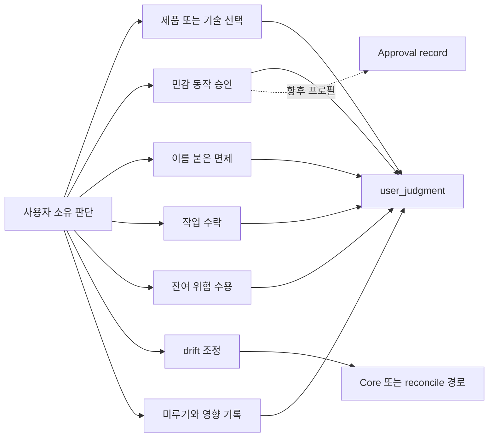
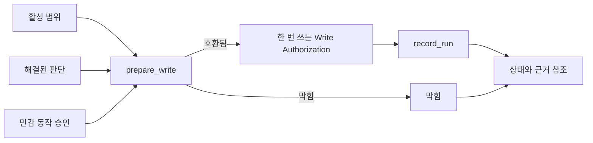
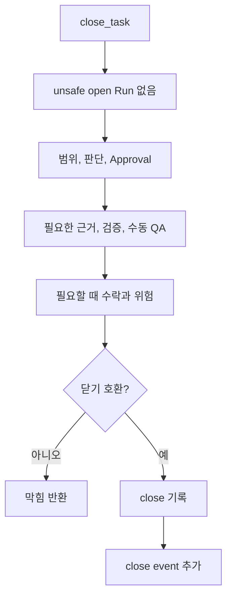

# Core Model 참조

## 이 문서로 할 수 있는 일

이 문서는 향후 하네스 Core model 계약을 확인하기 위한 참조 문서입니다. Core 권한, 작업 모양, 쓰기 전 범위 확인과 쓰기 허가 기록, 사용자 판단 라우팅, 근거, 검증, 수동 QA, 작업 수락, 잔여 위험, 닫기 동작을 다룹니다.

이 문서는 미래의 로컬 Harness Server 동작을 설명합니다. 이 저장소에는 현재 Harness runtime이나 server 구현이 없습니다. 현재 저장소 단계와 구현 인계 상태는 [구현 개요](../build/implementation-overview.md#문서-수락-상태)에 있습니다.

## 이런 때 읽기

- 모든 향후 Kernel 동작이 지켜야 할 invariant가 필요할 때.
- Task가 읽기, 쓰기, 사용자 판단 대기, 닫기 중 어디로 갈 수 있는지 판단할 때.
- 범위, 쓰기 전 범위 확인, 사용자 판단, 근거, 검증, 수동 QA, 작업 수락, 위험을 분리해야 할 때.
- API, storage, projection, conformance 문서가 Kernel 권한과 맞는지 검토할 때.

## 읽기 전에

정확한 규칙보다 예시를 먼저 보고 싶다면 [핵심 개념](../learn/concepts.md)이나 [하나의 작업으로 보는 하네스](../learn/one-task.md)를 먼저 읽습니다. Active MVP-1 public method는 [MVP API](api/mvp-api.md)가 담당하고, shared API shape는 [API Schema Core](api/schema-core.md), API error는 [API Errors](api/errors.md)가 담당합니다. Storage table은 [Storage](storage.md)이 담당합니다. Connector capability wording은 [Agent 통합 참조](agent-integration.md)가 담당합니다.

## 핵심 생각

Harness는 AI 지원 제품 작업을 위한 로컬 권한 기록이자 사용자 판단 라우팅 계층입니다. Kernel은 Core가 소유한 로컬 상태를 운영 권한의 기준으로 둡니다. Chat이나 Markdown은 기준이 아닙니다.

Kernel은 범위, 쓰기 전 범위 확인과 내부 쓰기 허가 기록, 사용자 소유 판단, 근거, 검증, 수동 QA, 작업 수락, 잔여 위험, 닫기 준비 상태를 분리합니다. 그래서 하나의 지원 범주가 다른 범주를 조용히 대신하지 못합니다.

필요한 gate는 active stage와 profile이 정합니다. 이 문서에 field나 gate가 있다는 사실만으로 내부 엔지니어링 점검, MVP-1, 또는 작은 직접 변경에 full future behavior가 required가 되지는 않습니다.

## 계약 위치 지도

| 필요한 것 | 먼저 볼 곳 | 관련 owner |
|---|---|---|
| Core invariant | [Kernel invariants](#kernel-invariants) | 이 문서. |
| 작업 모양과 mode 의미 | [작업 모드](#작업-모드) | API enum 값은 [API Schema Core](api/schema-core.md#shared-schemas)에 남습니다. |
| 사용자 판단 type과 route | [판단 경로 경계](#판단-경로-경계), [User Judgment](#user-judgment), [Decision Gate](#decision-gate) | Public request field는 [`harness.request_user_judgment`](api/mvp-api.md#harnessrequest_user_judgment)이 담당합니다. |
| Entity 관계 의미 | [Entity model](#entity-model) | Physical table은 [Storage](storage.md)에 남습니다. |
| Gate 의미 | [Gates](#gates), [Gate 규칙 지도](#gate-규칙-지도) | Public blocker와 error는 [API Errors](api/errors.md#primary-error-code-precedence)가 담당합니다. |
| 쓰기 전 범위 확인 / Write Authorization | [`prepare_write`](#prepare_write), [Write Authorization](#write-authorization), [`record_run`](#record_run) | Public shape는 [`harness.prepare_write`](api/mvp-api.md#harnessprepare_write)와 [`harness.record_run`](api/mvp-api.md#harnessrecord_run)이 담당합니다. |
| 닫기 의미 | [`close_task`](#close_task), [작업 모양과 active profile별 닫기 matrix](#작업-모양과-active-profile별-닫기-matrix), [Close result semantics](#close-result-semantics) | Public close response는 [`harness.close_task`](api/mvp-api.md#harnessclose_task)이 담당합니다. |
| Waiver와 invalid combination | [Waiver semantics](#waiver-semantics), [Invalid state combinations](#invalid-state-combinations) | Design policy detail은 [설계 품질 정책](design-quality-policies.md)에 남습니다. |

## Kernel invariants

아래 invariant가 이 문서의 중심입니다.

1. Core가 소유한 로컬 상태가 운영 권한의 기준입니다.
2. Chat, Markdown projection, 생성된 문서, report, card는 기준 권한이 아닙니다.
3. 제품 파일 쓰기가 쓰기 전 범위 확인을 통과하기 전에 범위 경계가 명시되어야 합니다.
4. 제품 파일 쓰기에는 해당 write attempt와 호환되는 내부 쓰기 허가 기록이 필요합니다.
5. 사용자 소유 판단은 agent 판단으로 조용히 대체될 수 없습니다.
6. 민감 동작 승인, 작업 수락, 검증 면제 판단, 잔여 위험 수용은 서로 다른 route입니다.
7. 근거, 검증, 수동 QA, 작업 수락, 잔여 위험은 서로를 대신하지 않습니다.
8. 닫기는 blocker와 잔여 위험을 보여줘야 합니다.
9. 어떤 gate가 필요한지는 active stage와 profile이 정합니다.

## 커널을 10문장으로

1. Kernel은 로컬 AI 지원 제품 작업을 위한 미래 Core 상태 계약입니다.
2. Active Task, 범위, 쓰기 전 범위 확인 상태, 판단 기록, 근거 참조, 닫기 blocker, 잔여 위험을 chat transcript 밖에 둡니다.
3. 읽기/조언 작업은 제품 파일 쓰기 없이 답할 수 있습니다.
4. 작은 직접 변경은 가볍게 유지할 수 있지만, 제품 파일 쓰기에는 여전히 호환되는 범위와 쓰기 전 범위 확인이 필요합니다.
5. 추적되는 작업은 닫을 수 있을 때까지 범위, blocker, 근거, 사용자 판단, 닫기 준비 상태를 보이게 둡니다.
6. `prepare_write`는 제품 파일 쓰기 전 범위 확인과 호환성 판단 지점입니다.
7. `record_run`은 실제로 일어난 일을 기록하고, 제품 파일 쓰기 Run에는 호환되는 내부 쓰기 허가 기록을 소비합니다.
8. `user_judgment` 기록은 사용자 소유 판단을 기록합니다. Minimum MVP-1에서는 민감 동작 승인 judgment가 민감 동작 permission을 기록할 수 있고, later Approval record는 더 hardened된 committed lifecycle을 추가합니다.
9. `close_task`는 완료 판단 지점이며, active profile과 close intent가 요구하는 gate만 확인합니다.
10. Projection은 사람이 상태를 읽도록 돕지만, Core state, event, 등록된 artifact ref가 기준입니다.

## 커널이 답하는 네 가지 질문

1. 어떤 Task가 active인가?

   Active Task는 현재 사용자 가치 단위입니다. mode, lifecycle phase, active scope, blocker, evidence/artifact ref, 사용자 판단 상태, 닫기 준비 상태, 작업 수락 상태, 잔여 위험 상태, projection이 켜진 경우 projection 최신성을 가집니다.

2. 지금 현재 범위와 호환되는 작업은 무엇인가?

   호환되는 작업은 active Task, 작업 모양, active Change Unit, scope, Autonomy Boundary, baseline freshness, 민감 동작 permission, 사용자 소유 판단, 적용 policy, surface capability, requested operation으로 계산합니다.

3. 어떤 사용자 판단이 아직 진행을 막는가?

   차단하는 사용자 소유 판단은 `user_judgment` state와 aggregate `decision_gate`로 표현합니다. 민감 동작 승인은 `approval_gate`로 따로 표현합니다. Minimum MVP-1에서는 민감 동작 승인 user judgment에서, later profile에서는 committed Approval state에서 gate를 계산할 수 있습니다.

4. 이 Task를 close할 수 있는가?

   `close_task`는 close intent를 open Run state, scope, required decision, 민감 동작 permission, evidence, required verification, required Manual QA, residual-risk visibility, required residual-risk acceptance, required work acceptance, projection freshness, artifact availability와 비교합니다.

## 작업 모드

저장되는 Task `mode` 값은 그대로입니다.

```text
advisor | direct | work
```

사용자에게는 아래 쉬운 작업 모양을 먼저 보여줍니다. 이 label은 enum value, schema field, record type, projection kind, gate, record/check path를 추가하지 않습니다.

| 쉬운 작업 모양 | 내부 mode | Kernel 의미 |
|---|---|---|
| 읽기/조언 | `advisor` | 제품 파일 쓰기는 valid outcome이 아닙니다. 조언을 제품 작업으로 바꾸지 않는 한 범위는 가볍게 둘 수 있습니다. 사용자 요청, policy, active profile이 요구하지 않으면 근거, 검증, 수동 QA, 작업 수락, 잔여 위험은 보통 required가 아닙니다. |
| 작은 직접 변경 | `direct` | 제품 파일 쓰기는 명시된 범위와 호환되는 `prepare_write` / 내부 Write Authorization record를 통해서만 가능합니다. 요청이 명확하면 Change Unit은 작을 수 있습니다. 근거도 가벼울 수 있습니다. 사용자 판단 요청, 수동 QA, 분리 검증, 작업 수락, 잔여 위험 수용은 의식처럼 만들지 않습니다. Active profile, task type, user request, security/criticality profile, 감지된 위험, 명시 requirement가 요구할 때만 적용합니다. |
| 추적되는 작업 | `work` | 구조화된 작업, 여러 단계, 위험한 변경, 사용자에게 보이는 변경, public interface, 보안/개인정보, architecture, 기타 non-trivial work에 사용합니다. 범위, 사용자 판단, 근거, close blocker, 작업 수락, 잔여 위험을 보이게 둡니다. 모든 future gate가 자동으로 required가 되는 것은 아닙니다. |

작은 직접 변경은 작게 유지해야 합니다. 범위가 불분명해지거나, changed path가 active scope를 넘거나, 여러 제품 영역이나 subsystem이 관련되거나, 제품/UX 판단 또는 중요한 기술 판단이 나타나거나, public API나 module contract 영향이 나타나거나, 보안/개인정보 영향이 있거나, 민감 동작이 나타나거나, 근거 기대가 커지거나, QA 또는 verification이 required가 되거나, 잔여 위험이 작지 않거나, 여러 단계 delivery가 필요하면 같은 Task를 추적되는 작업으로 상향합니다.

Tiny direct profile은 `mode=direct` 안의 표시/profile 선택일 뿐입니다. 오탈자, 의미 변경 없는 문서 한 문장, obvious rename에 적합합니다. Scope, 쓰기 전 범위 확인, 민감 동작 permission, 사용자 소유 판단, 실제로 적용되는 evidence requirement, residual-risk visibility, close rule을 우회할 수 없습니다.

## 판단 경로 경계

Harness는 사용자가 무엇을 판단하는지와 내부 owner path가 무엇을 기록하는지를 분리합니다. 사용자 대상 문서는 사용자가 여러 schema 축을 이해해야 하는 것처럼 노출하면 안 됩니다. 사용자는 다섯 가지 표시 유형 중 하나를 봅니다. 표시 질문은 구체적인 판단을 묻고, 기록은 owner path가 답변을 검증할 수 있을 만큼의 맥락을 저장합니다.

### 사용자에게 보이는 판단 유형

| 표시 유형 | 사용자가 소유하는 판단 | 내부 `judgment_type` 예 |
|---|---|---|
| 제품/UX 판단 | 제품 동작, 문구, 상호작용, 취향, 사용자 가치, 릴리스에서 드러나는 약속. | `product_choice` |
| 기술 판단 | Public API, module boundary, dependency, migration, compatibility, 보안/개인정보 장단점, QA/verification 기대치, 범위/자율성 선택, 중요한 implementation direction. | `technical_choice` |
| 민감 동작 승인 | 범위가 정해진 이름 붙은 민감 step에 대한 permission. | `sensitive_action_approval` |
| 작업 수락 | Work acceptance가 required일 때 사용자가 결과를 받아들일지. | `work_acceptance` |
| 잔여 위험 수용 | 이번 close에서 보이는 close-relevant 잔여 위험을 받아들일지. | `residual_risk_acceptance` |

이 유형들은 서로 다릅니다. 민감 동작 승인은 제품 방향이나 기술 방향을 고르지 않습니다. 작업 수락은 위험 수용이 아닙니다. 잔여 위험 수용은 검증이나 QA가 통과했다는 뜻이 아닙니다.

### 내부 route

| Route | Kernel 의미 | 대신할 수 없는 것 |
|---|---|---|
| `choose` | 사용자가 제품, 기술, 보안/개인정보, 또는 범위/자율성 선택지 중에서 고릅니다. | 민감 동작 permission, 쓰기 전 범위 확인 호환성, 작업 수락, waiver, 위험 수용. |
| `defer` | 사용자가 사용자 소유 판단을 의도적으로 미룹니다. 진행, close, risk, follow-up에 미치는 영향을 기록해야 합니다. | 해결, waiver, 작업 수락, blocker를 숨기는 permission. |
| `approve-sensitive-action` | 사용자가 민감 동작 승인 user judgment로 범위 있는 민감 동작 permission을 줍니다. Later Approval profile에서는 Approval record도 commit할 수 있습니다. | 제품 방향, 기술 방향, 정확성 증명, 작업 수락, 위험 수용, QA, verification, 근거, Write Authorization. |
| `waive` | 허용된 경우 사용자 또는 policy가 이름 붙은 requirement를 waive합니다. | 생략된 QA/check/verification 자체, 보증 수준 상승, 일반 동의. |
| `accept-result` | Work acceptance가 required일 때 close basis가 보인 뒤 사용자가 결과를 받아들입니다. | 근거, QA, verification, 민감 동작 permission, waiver, 잔여 위험 수용, 새 쓰기 전 범위 확인. |
| `accept-risk` | 요청한 close를 위해 사용자가 이름 붙은 보이는 close-relevant Residual Risk를 받아들입니다. | 위험 없는 close, detached verification, QA pass, evidence sufficiency, work acceptance, 민감 동작 permission. |
| `reconcile` | 사용자 또는 operator가 human-editable 또는 generated/projection drift를 accepted state, note, rejection, decision request, deferral 중 하나로 조정합니다. | Markdown, report prose, chat에서 직접 상태 변경. |

이 route map은 사용자 소유 판단에 대한 설계 계약입니다. Route verb는 내부 owner-path metadata입니다. Broad approval은 사용자에게 보이는 모델에 의도적으로 없습니다.



기록된 뒤에도 route는 서로 분리됩니다. Approval은 제품 방향을 고르지 않고, waiver는 생략한 check를 수행하지 않으며, 작업 수락은 위험을 받아들이지 않고, reconcile은 Core path 없이 Markdown을 state로 바꾸지 않습니다.

### 표시 깊이

이 값은 표시 세부 정도를 설명하는 metadata입니다. `display_depth` schema field를 되살리는 것이 아닙니다. 새 예시는 `presentation=short` 또는 `presentation=full`을 사용합니다.

| 표시 깊이 | 사용하는 경우 | 최소 표시 내용 |
|---|---|---|
| `simple` | 결과 영향이 낮고 좁은 막힘을 푸는 판단. | 정확한 질문, scope, 선택지 또는 requested outcome, 답변이 해결하지 않는 것. |
| `tradeoff` | 의미 있는 결과 영향이 있는 제품/UX 또는 기술 선택. | 선택지, 가능한 경우 추천, 불확실성, 미룰 때의 영향, 영향받는 scope와 criteria. |
| `high-risk` | Security/privacy, sensitive category, public API, migration, dependency, rollback 비용이 큰 판단. | 장단점과 risk, 가능한 경우 evidence ref, 관련될 때 approval boundary, rollback/follow-up 영향. |
| `close-affecting` | 작업 수락, waiver, 잔여 위험 수용, 또는 미루면 close에 영향을 주는 판단. | 닫기 기준, blockers, 잔여 위험 표시, affected gates, required refs, 정확한 close 영향. |

### 기준 schema 방향

- `user_judgment`가 기준 기록 family입니다.
- `harness.request_user_judgment`가 기준 요청 action이고, `harness.record_user_judgment`는 호환되는 사용자 답변을 기록합니다.
- `judgment_type`은 compact 내부 판단 유형을 저장합니다. MVP-1 예시는 `product_choice`, `technical_choice`, `sensitive_action_approval`, `work_acceptance`, `residual_risk_acceptance`입니다.
- 사용자에게 보이는 표시는 제품/UX 판단, 기술 판단, 민감 동작 승인, 작업 수락, 잔여 위험 수용으로 제한됩니다.
- `presentation=short`는 작은 막힘과 한 화면 prompt의 기본값입니다.
- `presentation=full`은 복잡하거나 위험이 크거나 close에 영향을 주는 판단을 위한 full-format Decision Packet-style presentation입니다.
- `display_label`은 사용자가 보는 라벨입니다. 허용 라벨은 제품/UX 판단, 기술 판단, 민감 동작 승인, 작업 수락, 잔여 위험 수용입니다.
- Route-like detail과 depth-like detail은 validation 또는 presentation metadata입니다. 사용자가 별도 concept으로 배워야 하는 항목이 아닙니다.
- `affected_gates`, owner ref, user judgment status가 그 판단이 무엇에 영향을 줄 수 있는지 정합니다.

`request_user_decision`, `record_user_decision`, `judgment_domain`, `decision_kind`, `decision_profile`, `judgment_category`, `judgment_route`, `display_depth`는 compatibility 또는 legacy 용어입니다. 새 예시, fixture, public docs에서는 위 기준 이름을 우선합니다.

모호한 동의는 좁게 해석합니다. "proceed", "go ahead", "looks good", "좋아", "진행해" 같은 문구만으로 민감 동작 승인을 부여하거나, 제품/기술 방향을 고르거나, 작업을 수락하거나, 잔여 위험을 수용하거나, requirement를 waive하거나, deferral을 선택지처럼 처리하면 안 됩니다. 하나의 사용자 답변이 여러 판단을 만족하려면 질문이 그 판단들을 명시했고 답변이 각각과 호환되어야 합니다. 기록 payload도 scope, consequence, close/write impact를 이름 붙여야 합니다. 그렇지 않으면 Core나 agent가 다시 확인해야 합니다.

## 근거, 검증, 수동 QA, 작업 수락, 위험

이 개념들은 close를 뒷받침합니다. 하지만 모두 "done"의 다른 이름이 아닙니다.

| 개념 | Kernel 의미 |
|---|---|
| 근거 | 무엇을 했거나 관찰했는지 뒷받침하는 기록 또는 ref입니다. 관련 criterion, condition, owner record에 mapping될 때만 claim을 support합니다. |
| 검증 | Claim을 기술적으로 확인하는 check입니다. 분리 검증에는 valid independence boundary와 current input이 있는 Eval이 필요합니다. 하지만 분리 검증은 active profile이나 명시 requirement가 요구할 때만 required입니다. |
| 수동 QA | 동작, UX, 문구, 접근성 해석, product taste, visual output, 환경 의존 결과에 대한 사람의 inspection입니다. Screenshot과 browser log는 QA를 support할 수 있지만 사람의 QA judgment 자체는 아닙니다. |
| 작업 수락 | Active path가 acceptance를 요구할 때 사용자가 결과를 받아들이는 판단입니다. Close-relevant evidence, verification, QA 상태와 residual risk가 보이거나 없다고 확인된 뒤 기록합니다. |
| 잔여 위험 | 알려진 남은 불확실성, 확인하지 못한 조건, 한계, trade-off입니다. Risk acceptance는 requested close를 위해 이름 붙은 보이는 risk를 사용자가 명시적으로 받아들이는 것입니다. |

대체 불가능 표:

| 이것 | 대신할 수 없는 것 |
|---|---|
| Chat text, generated Markdown, report prose | Core state, evidence, decision, Approval, close blocker, pre-write scope-check record. |
| 근거, log, screenshot, artifact ref | 수동 QA, verification, 작업 수락, residual-risk acceptance. |
| 테스트 통과, build 통과, browser smoke, self-check | 작업 수락, required Manual QA, qualifying Eval 없는 detached verification. |
| Sensitive-action Approval | 제품/UX 판단, 기술 판단, correctness, evidence, QA, verification, 작업 수락, residual-risk acceptance, Write Authorization. |
| 작업 수락 | Evidence sufficiency, QA, verification, Approval, waiver, residual-risk acceptance, additional pre-write scope-check compatibility. |
| 잔여 위험 수용 | Verification, Manual QA, evidence sufficiency, no-risk close, work acceptance, Approval. |
| QA waiver | QA pass, verification, evidence sufficiency, 작업 수락, unrelated risk acceptance. |
| Verification waiver | Detached verification, `completed_verified`, Manual QA, 작업 수락, assurance upgrade. |

Stage/profile support:

| Stage/profile | 표현할 수 있는 것 |
|---|---|
| 내부 엔지니어링 점검 / Kernel Smoke | 좁은 internal 권한 루프입니다. Local project registration, 활성 Task, 활성 Change Unit 또는 scoped work boundary, `prepare_write`, single-use Write Authorization 하나, compatible Run 하나, artifact/evidence ref 하나, structured status/blocker response 하나, 좁은 close-blocker check가 범위입니다. Verification, 수동 QA, 작업 수락, residual-risk acceptance, full Evidence Manifest, profile별 full-format user judgment presentation은 named smoke path가 명시적으로 포함하지 않는 한 내부 엔지니어링 점검 requirement가 아닙니다. |
| MVP-1 사용자 작업 루프 | Scope, pending user judgment, evidence summary, close readiness, required work acceptance, close-relevant risk가 있을 때 잔여 위험 표시를 사용자에게 보여줍니다. MVP-1이 detached verification이 항상 required라고 암시하면 안 됩니다. |
| Later assurance and operations profiles | Detached verification independence, richer Manual QA, stewardship, feedback-loop/TDD policy, projection/reconcile operations, export/recover, handoff behavior입니다. Active profile이나 owner doc이 켰을 때만 blocker가 됩니다. |

## 담당하는 참조 범위

이 문서가 담당합니다.

- Core invariant와 대체 불가능 규칙
- work mode semantics
- authority, write, gate, close decision에 영향을 주는 entity relationship 의미
- gate 의미와 close semantics
- `prepare_write`, Write Authorization, `record_run`, `close_task` state logic
- waiver 의미와 invalid state combination

## 여기서 다루지 않는 것

이 문서는 다음을 담당하지 않습니다.

- full public MCP request/response schema. [MVP API](api/mvp-api.md), [API Schema Core](api/schema-core.md), [API Errors](api/errors.md), [API Schema Later](api/schema-later.md)를 봅니다.
- SQLite DDL과 storage layout. [Storage](storage.md)를 봅니다.
- full projection template body
- document projection rule. [Projection과 Template 참조](projection-and-templates.md)를 봅니다.
- detailed design-quality policy table. [설계 품질 정책](design-quality-policies.md)을 봅니다.
- connector capability profile. [Agent 통합 참조](agent-integration.md)를 봅니다.
- operator command syntax. [운영과 Conformance 참조](operations-and-conformance.md)를 봅니다.
- later profile fixture catalog

## Entity model

이 entity note는 관계 의미만 정의합니다. Table, field, DDL, API body를 추가하지 않습니다.

### Task

Task는 사용자 가치 단위입니다. Current mode, lifecycle phase, result, close reason, assurance level, active Change Unit, gate state, user judgment refs, evidence/artifact refs, residual-risk state, acceptance state, latest Run state, projection이 켜진 경우 projection freshness를 가집니다.

### Change Unit

Change Unit은 제품 파일 쓰기를 위한 scoped work boundary입니다. 어떤 work surface가 바뀔 수 있는지, 어떤 paths/tools/commands/network/secret access가 scope 안인지, 무엇이 scope 밖인지, 어떤 sensitive categories가 있는지, 어떤 evidence와 QA expectation이 적용되는지, 어떤 completion condition이 중요한지 답합니다.

모든 제품 파일 쓰기에는 intended write를 포함하는 active Change Unit이 필요합니다. Core는 `prepare_write`를 통해서만 특정 product-write attempt에 대한 compatible record를 만듭니다.

### Autonomy Boundary

Autonomy Boundary는 Change Unit 안의 판단 latitude입니다. Scope는 어디에서 무엇이 바뀔 수 있는지 말합니다. Autonomy Boundary는 사용자의 추가 판단 없이 agent가 어떤 선택을 할 수 있는지 말합니다.

Autonomy Boundary는 scope, Approval, 쓰기 전 범위 확인, evidence, verification, QA, 작업 수락, risk acceptance가 아닙니다. 목표 변경, scope expansion, 사용자 소유 제품 방향 선택, 중요한 기술 방향 선택, 사용자 대신 잔여 위험 수용으로 읽으면 안 됩니다.

<a id="decision-packet"></a>

### User Judgment

`user_judgment`는 사용자 소유 판단을 위한 기준 기록군입니다. 각 기록은 질문, `judgment_type`, `presentation`, `display_label`, status, options 또는 selected outcome, affected scope, related refs, 필요한 경우 deferral effect, 그리고 민감 동작 승인, waiver, 작업 수락, 잔여 위험 수용, reconcile에 필요한 route별 context를 저장합니다.

User Judgment는 `decision_gate`에 반영됩니다. 차단하는 사용자 소유 판단은 chat text, broad approval, projection prose만으로 충족될 수 없습니다. 기록된 User Judgment와 그 resolution, deferral, rejection, blocked state, supersession이 그 판단의 기준입니다.

User Judgment status는 record-level입니다.

```text
proposed | pending_user | resolved | deferred | rejected | blocked | superseded
```

User Judgment를 resolve하면 사용자 소유 판단을 기록합니다. `judgment_type=sensitive_action_approval`과 compatible `approval_scope`를 가진 judgment일 때만 민감 동작 permission을 만듭니다. Later Approval profile은 linked Approval path를 추가로 요구할 수 있습니다. Write Authorization, evidence, close는 만들지 않습니다.

Decision Packet은 복잡한 judgment를 위한 full-format 또는 legacy presentation 라벨입니다. 기준 authority family가 아니며, 일반 사용자에게 모든 판단의 기본 메커니즘처럼 보여주면 안 됩니다.

#### User Judgment lifecycle map

Lifecycle은 작습니다. 필요한 judgment를 draft 또는 detect하고, 필요할 때 사용자에게 묻고, 호환되는 답변을 기록하고, deferral, rejection, blocked, superseded outcome을 보존합니다. 정확한 public field는 [`harness.request_user_judgment`](api/mvp-api.md#harnessrequest_user_judgment)와 [`harness.record_user_judgment`](api/mvp-api.md#harnessrecord_user_judgment)가 담당합니다.

### Journey Spine

Journey Spine은 Task state, Change Unit, Run, User Judgment, Approval, evidence, verification, QA, acceptance state, residual risk, close event, artifact ref, `state.sqlite.task_events`에서 파생되는 later/diagnostic continuity입니다. 별도 source of truth가 아니며 MVP-1 storage에 required가 아닙니다.

### Journey Spine Entry

Journey Spine Entry는 기존 state와 event에서 재구성할 수 없는 continuity annotation이 필요할 때만 쓰는 later/diagnostic durable annotation입니다. Owner record를 보완할 뿐 Task, Change Unit, Run, User Judgment, evidence, verification, QA, risk, acceptance, close, artifact state를 대체하지 않습니다.

### Run

Run은 실행 또는 관찰 attempt입니다. Actor, surface, mode, Change Unit, baseline, intended operation, observed changes, command results, artifact refs, summary를 기록합니다. Implementation과 direct product-write Run은 호환되는 내부 쓰기 허가 기록을 소비해야 합니다. Read-only 또는 shaping-only Run은 제품 파일 쓰기를 compatible하게 만들지 않습니다.

### Approval

Approval은 범위가 정해진 민감 동작 permission입니다. Minimum MVP-1에서는 `judgment_type=sensitive_action_approval`와 `judgment_payload.approval_scope`를 가진 resolved user judgment로 표현할 수 있습니다. Later Approval/보증 프로필에서는 committed Approval record로도 표현할 수 있습니다. Paths, tools, commands, network targets, secret scope, sensitive categories, baseline, expiry, 해당 민감 동작에 대한 user judgment을 cover할 수 있습니다.

Approval은 correctness를 증명하지 않습니다. 제품 방향, 기술 판단, evidence, QA, verification, 작업 수락, residual-risk acceptance를 대신하지 않습니다. 그 자체로 product write도 compatible하게 만들지 않습니다.

### Write Authorization

Write Authorization은 `prepare_write`가 정확한 제품 파일 쓰기가 현재 Core record와 호환된다고 판단할 때 만드는 durable single-use state record입니다. Task, Change Unit, compatibility basis, intended operation, intended write surface, related sensitive-action coverage와 decisions, guarantee level, status, compatible Run에 의한 consumption을 기록합니다. 이는 하네스 수준의 협력형 기록/확인이지 OS 권한, sandboxing, 변조 방지 storage, 사전 차단, 권한 격리가 아닙니다.

Write Authorization status는 record-level입니다.

```text
allowed | consumed | expired | stale | revoked
```

Write Authorization은 재사용 가능한 scope가 아닙니다. Current compatibility basis 아래에서 정확한 write attempt 하나의 호환성을 기록합니다. 같은 committed request의 idempotent replay를 제외하면 compatible implementation 또는 direct `record_run` 하나가 소비합니다.

### Evidence Manifest

Evidence Manifest는 claim, criterion, completion condition을 supporting refs에 mapping합니다. Run, artifact, Eval, Manual QA record, design record, 기타 owner record를 참조할 수 있습니다. Evidence sufficiency는 artifact 개수가 아니라 criterion coverage로 판단합니다.

### Eval

Eval은 verification result record입니다. Target, verdict, checks performed, evidence reviewed, independence qualifier, baseline relationship, input freshness, blockers, artifact refs를 기록합니다. Active profile이 detached verification을 요구하거나 허용하고 independence/freshness rule이 만족될 때만 passed Eval이 assurance를 높입니다.

### 수동 QA

수동 QA는 사람의 inspection record입니다. Automated check와 capture artifact는 수동 QA를 support할 수 있지만 그 자체로 수동 QA가 되지 않습니다. 수동 QA는 active profile, policy, user request, task type, changed surface, detected risk가 required로 만들 때만 required입니다.

### Finding 라우팅

Command, Run, Eval, QA, review, validator, diagnostic에서 나온 finding은 별도 record/check path가 아닙니다. Existing owner record를 통해 라우팅될 때만 state에 영향을 줍니다. 예를 들면 Evidence Manifest, User Judgment, Change Unit, Approval, Eval, Manual QA, Residual Risk, Reconcile Item, structured close blocker, enabled owner path입니다.

### Residual Risk

Residual Risk는 알려진 남은 불확실성, 한계, 확인하지 못한 조건, trade-off를 위한 close-relevant state record입니다. Source refs, affected scope, visibility, accepted-risk metadata, follow-up, close impact를 기록합니다.

Residual Risk record는 risk를 보이게 합니다. Work를 verify하거나, evidence를 대체하거나, QA를 waive하거나, 민감 동작 permission을 부여하거나, 작업 수락을 암시하거나, Task를 close하지 않습니다.

### Artifact

Artifact는 diff, log, screenshot, manifest, bundle, export component처럼 integrity metadata가 있는 durable evidence file 또는 bundle입니다. Artifact ref는 Markdown report나 state record와 다릅니다.

### Reconcile Item

Reconcile Item은 human-editable 또는 generated/projection drift를 위한 candidate record입니다. Reconcile은 merge, reject, convert to note, user judgment create, defer를 할 수 있습니다. Markdown이나 generated text는 accepted reconcile/owner path를 통해서만 state가 됩니다.

### Design Support Records

Shared Design, Domain Term, Module Map Item, Interface Contract, Feedback Loop, TDD Trace는 profile이 켜졌을 때 scope, evidence, design policy를 support할 수 있습니다. Policy detail은 [설계 품질 정책](design-quality-policies.md)이 담당하고, storage shape는 [Storage](storage.md)이 담당합니다.

## Boundaries and non-substitutions

- Chat text는 state가 아닙니다.
- Generated Markdown은 canonical state가 아닙니다.
- 사람이 고친 projection은 reconcile 전까지 input입니다.
- Raw artifact는 evidence file입니다. 그것을 link하는 Markdown은 readable projection입니다.
- Review display와 future Review Stages는 owner record로 라우팅되기 전까지 procedure 또는 display입니다.
- Autonomy Boundary는 judgment latitude만 기록합니다. Scope나 쓰기 전 범위 확인이 아닙니다.
- Approval과 User Judgment authority는 분리됩니다.
- Write Authorization은 compatible attempt 하나를 위한 single-use cooperative record입니다. 재사용 가능한 scope나 OS 권한이 아닙니다.
- Evidence sufficiency는 prose만으로 추론하지 않습니다.
- Eval verdict만으로 `detached_verified`가 되지 않습니다.
- Evidence는 Manual QA를 대신하지 않습니다. QA waiver는 verification evidence를 만들지 않습니다.
- Test pass는 work acceptance, required Manual QA, detached verification을 자동으로 뜻하지 않습니다.
- Manual QA는 work acceptance를 뜻하지 않습니다.
- Work acceptance는 residual risk를 지우지 않습니다.
- Residual-risk acceptance는 implementation을 verify하거나 no-risk close를 만들지 않습니다.
- Verification waiver, QA waiver, decision deferral, residual-risk acceptance는 별도 개념이며 close impact도 다릅니다.
- Capability는 blocker와 guarantee display에 영향을 줄 수 있지만 first-class Kernel gate가 아닙니다.

## Gates

Gate는 future status, write, run, close decision에서 쓰는 canonical Kernel field입니다. Gate가 reference model에 존재해도 모든 stage나 모든 Task에 required라는 뜻은 아닙니다.

Active profile이 requiredness를 정합니다. 내부 엔지니어링 점검은 좁은 권한 루프를 증명합니다. MVP-1은 사용자에게 보이는 판단, evidence summary, close readiness, required work acceptance, 관련 잔여 위험 표시를 보여줍니다. Later assurance profile은 detached verification, Manual QA, stewardship, feedback-loop/TDD, operations, export/recover behavior를 required로 만들 수 있습니다.

### 닫기 준비 상태 분리

Close readiness는 하나의 "done" bit가 아니어야 합니다. 아래 dimension을 분리합니다.

| Dimension | 의미 |
|---|---|
| Close state | Close가 blocked인지, requested intent에 ready인지, completed인지, cancelled인지, superseded인지. |
| Close reason | 왜 닫혔는지. 예: `completed_self_checked`, `completed_verified`, `completed_with_risk_accepted`, `cancelled`, `superseded`. |
| Assurance level | 지원되는 technical checking level. `none`, `self_checked`, `detached_verified`. |
| Residual risk state | Close-relevant risk가 absent, not visible, visible, accepted, blocked 중 어디인지. |
| Acceptance state | Final result acceptance가 not required, pending, accepted, rejected, blocked 중 어디인지. |

### Gate 규칙 지도

| Gate 또는 boundary | 판단하는 것 |
|---|---|
| [Scope Gate](#scope-gate) | Active scope가 requested write 또는 close-relevant work를 cover하는지. |
| [Decision Gate](#decision-gate) | User-owned judgment가 progress, write, close를 막는지. |
| [Approval Gate](#approval-gate) | Sensitive-action permission이 missing, pending, granted, denied, expired, drifted 중 어디인지. |
| [Design Gate](#design-gate) | Enabled design-quality policy가 progress를 막는지. |
| [Evidence Gate](#evidence-gate) | Required evidence가 absent, partial, sufficient, stale, blocked 중 어디인지. |
| [Verification Gate](#verification-gate) | Required verification이 passed, pending, failed, waived, blocked 중 어디인지. |
| [QA Gate](#qa-gate) | Required Manual QA가 passed, failed, waived, pending 중 어디인지. |
| [Acceptance Gate](#acceptance-gate) | Applicable할 때 work acceptance와 residual-risk visibility/acceptance가 requested close를 허용하는지. |
| [Capability Boundary](#capability-boundary) | Surface capability가 gate가 되지 않으면서 blocker와 guarantee display에 주는 영향. |

### Scope Gate

```text
not_required | required | pending | passed | failed | blocked
```

`scope_gate`는 write-capable product work에 적용됩니다. 읽기/조언 작업은 보통 `not_required`입니다. Direct와 tracked product write는 `prepare_write`가 write를 allow하기 전에 compatible scope가 필요합니다.

### Decision Gate

```text
not_required | required | pending | resolved | deferred | blocked
```

`decision_gate`는 사용자 소유 판단의 aggregate state입니다. Scope, Approval, evidence, verification, QA, work acceptance, residual-risk acceptance를 대체하지 않습니다.

#### Decision Gate Aggregate Recompute

`decision_gate`는 relevant user judgment와 현재 감지된 user-owned judgment need에서 recompute합니다. Precedence는 다음 순서입니다.

1. Relevant judgment가 incompatible, rejected without replacement, expired, blocked이면 `blocked`.
2. Relevant user judgment가 user를 기다리면 `pending`.
3. Blocking user-owned judgment가 감지됐지만 compatible user judgment가 없으면 `required`.
4. 모든 relevant blocker가 명시적으로 deferred이고, 그 deferral이 current operation 또는 close intent를 cover하며 필요한 residual risk/follow-up visibility가 있으면 `deferred`.
5. 모든 relevant blocking judgment가 resolved이거나 compatible replacement state로 superseded되면 `resolved`.
6. 현재 operation 또는 close intent를 막는 user-owned judgment가 없으면 `not_required`.

Stored gate value가 recompute와 다르면 stale입니다. Write 또는 close가 그 값에 의존하기 전에 repair해야 합니다.

### Approval Gate

```text
not_required | required | pending | granted | denied | expired
```

`approval_gate`는 sensitive categories가 있을 때만 적용됩니다. 이 gate는 민감 동작 permission이 필요한지, pending인지, granted인지, denied인지, expired인지 요약합니다. Minimum MVP-1에서 `granted`는 compatible resolved `judgment_type=sensitive_action_approval` user judgment가 sensitive scope를 cover한다는 뜻입니다. Later Approval profile에서는 committed Approval record에서 파생될 수 있습니다. Write Authorization, product judgment, evidence, verification, QA, work acceptance, residual-risk acceptance가 아닙니다.

### Design Gate

```text
not_required | required | pending | passed | partial | waived | stale | blocked
```

`design_gate`는 enabled design-quality policy가 applicable하게 만들 때만 적용됩니다. Detailed design validator는 active profile이 명시적으로 켜기 전까지 later-profile material입니다.

### Evidence Gate

```text
not_required | none | partial | sufficient | stale | blocked
```

Evidence가 required이면 successful close에는 `evidence_gate=sufficient`가 필요합니다. Evidence가 required인데 missing이면 `not_required`를 쓰면 안 됩니다.

### Evidence Sufficiency Profiles

Evidence sufficiency는 relevant criteria, conditions, claims의 coverage로 판단합니다. Advice는 recorded evidence가 필요 없을 수 있습니다. Small direct change는 changed-path list, patch summary 또는 diff ref, self-check summary로 충분할 수 있습니다. Tracked work는 보통 close-relevant criterion마다 evidence mapping이 필요합니다. UI/UX, sensitive, QA, verification-required path는 active profile이 요구하는 owner ref만 추가합니다.

### Verification Gate

```text
not_required | required | pending | passed | failed | waived_by_user | blocked
```

Verification은 active profile, user request, task type, security/criticality profile, explicit requirement가 요구할 때만 required입니다. 추적되는 작업이라고 해서 detached verification이 자동으로 required가 되지는 않습니다.

`verification_gate=waived_by_user`는 required verification path를 의도적으로 생략할 때만 유효합니다. Detached verification, `completed_verified`, Manual QA, work acceptance, assurance upgrade를 만들지 않습니다. Waived gap이 close-relevant이면 close에는 residual-risk accepted path가 필요합니다.

### Verification Independence Profiles

상세 independence profile, evaluator bundle, same-session guard, cross-surface verification rule은 later-profile assurance material입니다. Kernel invariant는 더 작습니다. Self-check는 detached verification이 아닙니다. `assurance_level=detached_verified`를 주장하려면 qualifying Eval, valid independence, current input이 필요합니다.

### QA Gate

```text
not_required | required | pending | passed | failed | waived
```

`qa_gate`는 profile, policy, user request, task type, changed surface, detected risk가 Manual QA를 required로 만들 때만 적용됩니다. Browser capture, screenshot, log, automated check는 QA context를 support할 수 있지만 사람의 QA judgment가 되지 않습니다.

### Acceptance Gate

```text
not_required | required | pending | accepted | rejected
```

`acceptance_gate`는 required일 때 작업 수락을 기록합니다. Acceptance는 close basis가 보인 뒤에만 기록할 수 있습니다. Close basis에는 evidence status, applicable verification status, applicable Manual QA status, residual-risk visibility 또는 confirmed absence가 포함됩니다.

Residual-risk visibility는 별도입니다. Known close-relevant risk가 없으면 `ResidualRiskSummary.status=none`이 visibility를 만족합니다. Known close-relevant risk가 있으면 work acceptance 또는 successful close 전에 보여야 합니다. MVP-1의 risk-accepted close는 residual-risk acceptance `user_judgment`와 관련 blocker/evidence ref로 acceptance를 기록합니다. Rich Residual Risk ref는 later/profile-promoted입니다.

### Capability Boundary

Capability는 first-class Kernel gate가 아닙니다. Surface capability는 blocked reason, validator result, guarantee display에 영향을 줄 수 있습니다. Cooperative/detective surface는 proven guard가 operation을 cover하지 않는 한 preventive blocking을 주장하면 안 됩니다.

## Lifecycle and transitions

Kernel은 lifecycle field와 gate를 함께 사용합니다. Compact display state는 canonical field에서 파생됩니다.

### Mode

```text
advisor | direct | work
```

### Lifecycle Phase

```text
intake | shaping | ready | executing | verifying | qa |
waiting_user | blocked | completed | cancelled
```

### Result

```text
none | advice_only | passed | failed | cancelled
```

### Close Reason

```text
none | completed_verified | completed_self_checked |
completed_with_risk_accepted | cancelled | superseded
```

### Assurance Level

```text
none | self_checked | detached_verified
```

Assurance는 technical checking support를 요약합니다. Approval, QA, acceptance, risk acceptance가 아닙니다.

| 표시 문구 | 의미 |
|---|---|
| self-checked | Implementation path가 자기 결과를 확인했습니다. Detached verification은 아닙니다. |
| detached candidate | Verification path가 qualify할 수도 있지만 detached assurance는 아직 얻지 못했습니다. |
| detached verified | Qualifying Eval이 valid independence와 current input으로 pass했습니다. |
| waived with accepted risk | Required verification을 waiver로 생략했고 close가 accepted residual risk에 의존합니다. Detached verification은 아닙니다. |

### Compatibility matrix

Compatibility는 profile-driven입니다. Mode 또는 close reason은 active profile과 close intent가 요구하는 gate가 만족될 때만 compatible합니다.

### Mode Compatibility

| Mode | Product writes | 기본 close posture |
|---|---|---|
| `advisor` | 아니요. | Advice/read-only result. 보통 assurance는 없습니다. |
| `direct` | 예. 호환되는 scope와 내부 Write Authorization record 뒤에 가능합니다. | Required profile이 QA, verification, acceptance, risk handling을 추가하지 않으면 self-checked. |
| `work` | 예. 호환되는 scope와 내부 Write Authorization record 뒤에 가능합니다. | Profile-driven close. Evidence와 blocker를 보여줍니다. Detached verification은 active profile이나 explicit requirement가 요구할 때만 required입니다. |

### Decision Gate Compatibility

Resolved decision은 자신이 cover하는 scope, baseline, operation, close intent에 대해서만 compatible합니다. Deferred decision은 deferral이 current operation을 명시적으로 cover하고 필요한 residual risk 또는 follow-up이 visible할 때만 compatible합니다.

### Completion Compatibility

Successful close에는 open Run이 없어야 합니다. Compatible scope가 필요합니다. 모든 close-relevant required gate가 자기 규칙에 따라 satisfied, not required, validly waived 중 하나여야 합니다.

### Transition table

이 reference는 full state machine table을 중복하지 않습니다. Invariant는 write-capable transition이 `prepare_write`와 `record_run`을 통과하고, user-owned judgment가 `user_judgment`로, 필요한 민감 동작 permission이 `judgment_type=sensitive_action_approval`으로 처리되며, completion이 `close_task`를 통과한다는 것입니다.

#### Stable Event Catalog

Stable event name은 append-only state history label입니다. 그 자체가 authority는 아닙니다. Exact payload shape는 Storage와 API 문서가 담당합니다. Event name은 Task lifecycle update, `prepare_write` decision, Write Authorization creation/consumption/staling, Run recording, user judgment update, Approval update, gate recompute, evidence update, residual-risk visibility or acceptance, waiver recording, close attempt, close success, projection freshness change, reconcile outcome 같은 state change를 설명해야 합니다.

### Intake에서 `prepare_write`까지의 sequence

Minimal write sequence는 다음과 같습니다.

1. Active Task를 resolve 또는 create합니다.
2. Write-capable work에는 scoped active Change Unit을 세웁니다.
3. User-owned judgment와 sensitive-action need를 분리합니다.
4. 정확한 intended operation으로 `prepare_write`를 호출합니다.
5. 호환되면 returned Write Authorization record를 compatible product-write Run 하나에 사용합니다.
6. `record_run`으로 Run, artifact, evidence refs, blocker를 기록합니다.

이 쓰기 전 범위 확인 순서는 Kernel 설계 계약입니다. Scope, required user judgment, sensitive-action permission은 `prepare_write`의 입력이고, 호환되는 `prepare_write`만 한 번 쓰는 Write Authorization record를 만듭니다. `record_run`은 실제로 일어난 일을 기록할 뿐, 사후에 호환성을 만들지 않습니다.



<a id="prepare_write"></a>

## prepare_write

`prepare_write`는 제품 파일 쓰기에 대한 유일한 쓰기 전 범위 확인과 호환성 판단 지점입니다. Approval, user judgment resolution, `record_run`, `close_task`, report, projection, agent prose는 input 또는 context가 될 수 있습니다. 하지만 consumable Write Authorization record를 만들거나 product-file write를 스스로 compatible하게 만들지는 않습니다.

State-level decision은 다음 중 하나입니다.

```text
allowed | blocked | approval_required | decision_required | state_conflict
```

Decision은 Task, intended operation, active stage/profile, connected surface에 적용되는 gate와 precondition만 확인합니다.

1. State-version freshness를 확인합니다.
2. Active Task를 resolve합니다.
3. Mode가 write-capable인지 확인합니다. `advisor`는 product write를 막습니다.
4. Active Change Unit을 resolve합니다.
5. Intended paths, tools, commands, network targets, secret access, sensitive categories, 다른 write surface를 scope와 비교합니다.
6. Autonomy Boundary를 확인합니다. Operation이 agent latitude를 넘으면, judgment로 해결 가능한 경우 user judgment를 요청합니다.
7. Baseline freshness를 확인합니다.
8. Sensitive categories가 적용되면 sensitive-action permission을 확인합니다.
9. User-owned judgment를 위한 required user judgment를 확인합니다.
10. Enabled design/policy와 capability precondition을 확인합니다.
11. 모든 required check가 pass하면 compatible single-use Write Authorization record를 만들거나 반환하고 decision을 기록합니다.

`blocked`, `approval_required`, `decision_required`, `state_conflict` result는 consumable Write Authorization을 만들면 안 됩니다. `approval_required`는 sensitive-action permission이 없거나 쓸 수 없다는 뜻입니다. Broad approval이나 product judgment로 바꾸면 안 됩니다. `decision_required`는 user-owned judgment가 필요하다는 뜻입니다. 민감 동작 permission으로 바꾸면 안 됩니다.

Cooperative-only surface에서 MCP가 unavailable이면 product write는 instruction으로 hold합니다. Preventive 또는 isolated claim에는 covered operation에 대한 proven guard나 documented separation boundary가 필요합니다.

External side effect도 authority 의미가 같습니다. 실행 전에는 `prepare_write`가 intended side effect를 평가합니다. 실행 뒤에는 `record_run`이 실제로 일어난 일을 기록합니다. `record_run`은 compatible scope, Approval, user judgment coverage, Write Authorization 없이 일어난 effect를 사후 compatible하게 만들 수 없습니다.

<a id="record_run"></a>

## record_run

`record_run`은 Run, artifact, evidence recording point입니다. 쓰기 전 범위 확인 판단 지점이 아니며 product-file write를 사후 compatible하게 만들 수 없습니다.

Product-file write를 보고하는 implementation/direct Run은 compatible, unexpired, unconsumed Write Authorization을 소비해야 합니다. Core는 가능한 관찰 정보를 사용해 observed changed paths와 다른 observed side effect를 consumed Write Authorization 및 active Change Unit과 비교합니다.

Out-of-scope change, missing Write Authorization, stale Write Authorization, consumed Write Authorization, incompatible Write Authorization은 case에 따라 rejection, violation, recovery, stale/blocker state가 됩니다. 이런 Run은 relevant owner record를 통해 repair되기 전까지 affected scope의 evidence sufficiency, verification, QA, work acceptance, residual-risk acceptance, close readiness를 만족하지 않습니다.

Read-only와 shaping-only Run은 product-file change를 보고하지 않을 때만 Write Authorization 없이 기록할 수 있습니다.

<a id="close_task"></a>

## close_task

`close_task`는 단일 completion decision point입니다. Agent summary, Eval report, QA note, acceptance message, projection, final report는 input이 될 수 있습니다. 하지만 그것만으로 Task가 close되지는 않습니다.

Close readiness는 profile-driven입니다. Detached verification은 active profile, user request, task type, security/criticality profile, explicit requirement가 required라고 할 때만 required입니다. Verification waiver는 required verification을 의도적으로 생략할 때만 필요합니다. Verification이 required가 아니었다면 waive할 것도 없습니다.

Decision algorithm은 close intent와 required gate를 확인합니다.

1. Active Task와 requested close intent를 resolve합니다.
2. Cancellation 또는 supersession이면 unsafe in-progress write가 없는지 확인한 뒤 matching reason으로 close합니다.
3. Active Run이 열려 있으면 completion을 reject합니다.
4. Active profile에 따라 active Change Unit completion, deferral, supersession을 확인합니다.
5. Scope를 확인합니다.
6. Blocking user judgment와 `decision_gate`를 확인합니다.
7. Sensitive categories가 적용됐으면 sensitive-action permission을 확인합니다.
8. Enabled design policy를 확인합니다.
9. Evidence가 required이면 evidence를 확인합니다.
10. Verification이 required일 때만 verification을 확인합니다.
11. Manual QA가 required일 때만 Manual QA를 확인합니다.
12. Residual-risk visibility를 확인합니다. Risk-accepted close가 requested 또는 required이면 residual-risk acceptance `user_judgment`와 관련 blocker/evidence ref를 확인합니다. Rich Residual Risk ref는 해당 profile이 active일 때만 적용합니다.
13. Work acceptance가 required일 때만 work acceptance를 확인합니다.
14. Result, close reason, assurance level, residual-risk state, acceptance state를 별도 fact로 assign합니다.
15. Projection support가 켜져 있으면 projection freshness를 report합니다.
16. Close event를 append하고, projection support가 켜져 있으면 projection refresh를 enqueue합니다.

이 close-decision 흐름은 설계 계약 요약입니다. Verification, 수동 QA, 작업 수락, 잔여 위험 수용은 active profile, task, 사용자 요청, explicit requirement가 관련 있게 만들 때만 확인합니다. 항상 필요한 detached step이 아닙니다.



Structured close blocker는 open Run, scope, user-owned judgment, sensitive-action permission, design policy, evidence, verification, Manual QA, residual-risk visibility, residual-risk acceptance, work acceptance, projection freshness, artifact availability처럼 close를 막는 category를 이름 붙여야 합니다. Public response가 primary error code 하나를 고르더라도 secondary blocker와 refs는 보여야 합니다.

### 작업 모양과 active profile별 닫기 matrix

| Work shape/profile | 일반 successful close 전에 필요한 것 | Verification 처리 | Close result |
|---|---|---|---|
| 읽기/조언 | 요청한 조언, 설명, review, 비교가 완료됨. User나 profile이 source ref를 요구했다면 보여줌. | 보통 `not_required`. Verification이 required가 아니면 waiver도 필요 없습니다. | `result=advice_only`, `assurance_level=none`, 보통 `close_reason=completed_self_checked`. |
| 작은 직접 변경 | Open Run 없음. Product write가 있었다면 active scope가 cover했고 compatible Write Authorization record가 소비됨. 좁은 completion claim을 lightweight evidence 또는 self-check가 support함. Trigger된 user judgment, Approval, QA, acceptance, risk handling이 satisfied됨. | 보통 `not_required`. Optional qualifying Eval은 `detached_verified`를 support할 수 있습니다. Required verification이면 required-verification row를 따릅니다. | 보통 `result=passed`, `assurance_level=self_checked`, `close_reason=completed_self_checked`. |
| Required detached verification이 없는 tracked work | Open Run 없음. Change Unit이 complete, explicitly deferred, superseded 중 하나. Scope, required user judgments, Approval, evidence, required QA, residual-risk visibility, required acceptance가 satisfied됨. | `verification_gate=not_required` 또는 non-detached self-check evidence를 applicable하게 보여줌. Verification waiver는 필요 없습니다. | `result=passed`, implementing path가 check했다면 `assurance_level=self_checked`, `close_reason=completed_self_checked`. |
| Required detached verification이 있는 tracked work | 위 tracked-work requirement에 더해 valid independence와 current input이 있는 qualifying Eval로 `verification_gate=passed`. | Required verification을 intentionally skip하면 verification waiver를 기록하고 risk-accepted path를 사용합니다. Verified라고 부르면 안 됩니다. | Passed verification이면 `result=passed`, `assurance_level=detached_verified`, `close_reason=completed_verified`. |
| Residual risk acceptance가 required인 tracked work | Active profile의 다른 required gate가 satisfied됨. Close-relevant residual risk가 visible하고, compatible residual-risk acceptance `user_judgment`가 관련 blocker/evidence ref와 함께 accepted risk를 기록함. | Verification은 not required, passed, 또는 required-verification waiver/risk path가 satisfied된 waived일 수 있습니다. | `result=passed`, `close_reason=completed_with_risk_accepted`, `assurance_level=none` 또는 `self_checked`. `detached_verified`처럼 표시하지 않습니다. |

### Close result semantics

`completed_self_checked`는 implementing path가 결과를 확인했거나 detached verification이 required가 아니었다는 뜻입니다.

`completed_verified`는 close path에서 detached verification이 required 또는 requested였고, valid independence와 current input으로 실제 pass했다는 뜻입니다.

`completed_with_risk_accepted`는 required verification을 waived한 verification risk를 포함해, 사용자가 보이는 close-relevant residual risk를 accepted했다는 뜻입니다. 이는 explicit accepted risk가 있는 successful close이지 verified close가 아닙니다.

`cancelled`는 Task가 passed result 없이 멈췄다는 뜻입니다.

`superseded`는 다른 Task 또는 Change Unit이 이것을 대체한다는 뜻입니다. Supersession은 success를 뜻하지 않습니다.

## Waiver semantics

Waiver는 이름 붙은 requirement에 대한 scoped exception입니다. Requirement, Task와 Change Unit, skipped check 또는 surface, reason, actor, time, 필요한 expiry 또는 follow-up, affected gate 또는 close impact, 필요한 close-relevant residual risk를 기록해야 합니다.

Allowed waivers:

- Design policy가 허용할 때 `design_gate=waived`.
- Required verification path를 intentionally skip할 때만 `verification_gate=waived_by_user`.
- Required Manual QA를 validly waive할 때 `qa_gate=waived`.

Not allowed:

- Product write에 대한 scope waiver
- Sensitive change에 대한 Approval waiver
- Completion에 required evidence가 있는데 evidence waiver
- Acceptance가 required인데 work acceptance waiver

Verification waiver는 detached verification이 아닙니다. Waived verification gap이 close-relevant이면 close에는 visible residual risk와 compatible residual-risk acceptance `user_judgment`가 필요하고 `completed_with_risk_accepted`를 사용합니다. QA waiver는 Manual QA pass, verification, work acceptance, assurance upgrade가 아닙니다. Decision deferral은 waiver가 아닙니다.

## Invariant enforcement mapping

| Kernel invariant | Enforcement points |
|---|---|
| Core state가 authority입니다. | State-changing action은 Core record와 event를 만듭니다. Projection과 chat은 owner path 없이 state를 mutate할 수 없습니다. |
| Product write에는 explicit scope와 compatible 쓰기 전 범위 확인이 필요합니다. | `prepare_write`는 missing scope를 block하고 required check가 pass할 때만 single-use Write Authorization record를 만듭니다. `record_run`이 이를 소비합니다. |
| User-owned judgment는 agent judgment로 대체될 수 없습니다. | User judgment와 `decision_gate`는 compatible resolution, deferral, risk handling이 기록될 때까지 affected write 또는 close를 막습니다. |
| Sensitive-action approval은 별도입니다. | 민감 동작 승인 user judgment, later Approval record, `approval_gate`는 sensitive permission만 cover합니다. |
| Evidence, verification, QA, acceptance, residual risk는 분리됩니다. | Separate gates, refs, close blockers가 substitution을 막습니다. |
| Close는 blocker와 residual risk를 보여줍니다. | `close_task`는 structured blockers와 separate close reason, assurance, acceptance, residual-risk state를 반환합니다. |
| Active profile이 required gate를 정합니다. | Gate check는 stage/profile, user request, task type, security/criticality profile, policy, explicit requirement가 요구할 때만 적용됩니다. |
| Projection은 state를 override할 수 없습니다. | Projection edit은 reconcile로 route됩니다. Projection freshness는 display에 영향을 주지만 그 자체가 authority는 아닙니다. |

## Later-profile and appendix material

아래 항목은 active owner profile이 명시적으로 켜기 전까지 later-profile 또는 appendix material입니다.

- detailed verification independence profile catalog
- same-session verification guard fixture detail
- full Manual QA matrix
- advanced validator catalog
- stewardship, feedback-loop, TDD policy enforcement
- Browser QA Capture automation
- Cross-Surface Verification automation
- public blocker와 guarantee display를 넘는 diagnostic machinery
- projection/reconcile operations
- export/recover와 release handoff
- broad conformance fixture catalog

이 capability들은 promotion 뒤 Core state를 읽거나 support할 수 있습니다. UI, projection, report, future fixture가 언급했다는 이유만으로 authority가 되면 안 됩니다.

## Edge cases

### Invalid state combinations

아래 combination은 invalid이거나 repair가 필요합니다.

| Invalid combination | Required handling |
|---|---|
| Active Task 없음, active Change Unit 없음, out-of-scope path/tool/command/network/secret, incompatible Autonomy Boundary 상태에서 product write attempt | `prepare_write`를 block합니다. 필요하면 scope 또는 user judgment를 요청합니다. |
| `advisor` mode에서 product write attempt | `prepare_write`를 block합니다. |
| Required sensitive-action permission 없이 product write attempt | approval-required를 반환합니다. Write Authorization을 만들지 않습니다. |
| Unresolved user-owned judgment가 있는데 product write attempt | decision-required 또는 decision-unresolved를 반환합니다. |
| Compatible unconsumed Write Authorization 없이 implementation/direct Run 기록 | Reject하거나 compatible authority consumed로 취급하지 않는 violation/recovery state를 기록합니다. |
| 민감 동작 승인을 product/UX 또는 technical judgment로 사용 | Reject하거나 user judgment로 repair합니다. |
| Generic "go ahead"로 incompatible routes를 만족 처리 | State를 기록하기 전에 clarify하거나 route를 분리합니다. |
| Required evidence가 missing인데 `evidence_gate=not_required` | Recompute하고 repair합니다. |
| Required verification을 waiver 없이 skip | Verification을 pending/blocked로 둡니다. |
| Verification waiver를 `detached_verified` 또는 `completed_verified`로 취급 | Reject하거나 risk-accepted close requirement로 repair합니다. |
| Required Manual QA가 missing 또는 failed | Valid waiver가 없으면 close를 block합니다. |
| Residual-risk visibility 전에 work acceptance 기록 | Reject하거나 repair합니다. 먼저 residual risk를 보여주거나 absence를 확인합니다. |
| Hidden 또는 unaccepted close-relevant risk가 있는데 risk-accepted close | Risk가 visible and accepted될 때까지 close를 block합니다. |
| Projection prose를 canonical state로 사용 | Reconcile item을 만들거나 state mutation으로 reject합니다. |
| Active profile 없이 future-profile validator를 current 내부 엔지니어링 점검 / MVP-1 requirement로 취급 | Later-profile로 qualify하거나 current profile에서 disable합니다. |

### Close eligibility

`close_ready`는 `lifecycle_phase`가 아닙니다. Open Run이 없고 모든 close-relevant required gate가 requested close intent와 compatible하다는 derived condition입니다. Task를 `lifecycle_phase=completed`로 옮기는 것은 `close_task`뿐입니다.

Close display는 applicable할 때 evidence, verification, Manual QA, work acceptance, residual-risk visibility, residual-risk acceptance, sensitive-action permission, projection freshness를 별도 category line으로 보여줘야 합니다. Category가 `not_required`라고 말할 수는 있습니다. 하지만 pending, waived, failed, blocked, stale, accepted-with-risk category를 하나의 "done" line으로 대체하면 안 됩니다.
