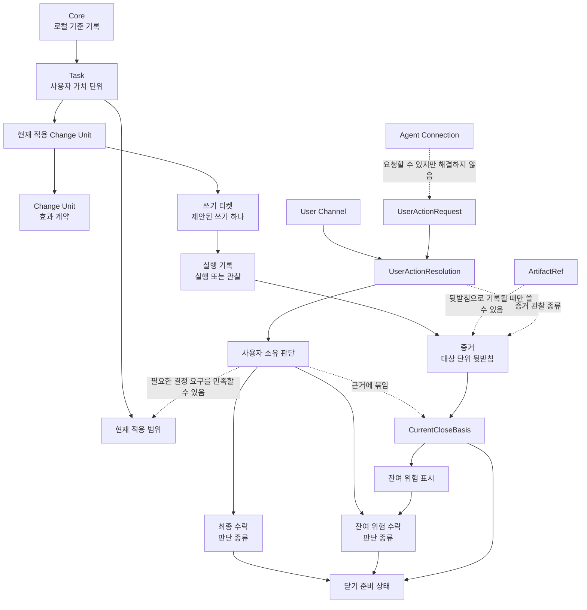
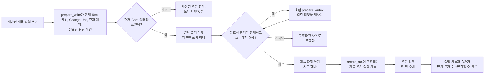

# Core 모델 참조

이 참조 문서는 Volicord 상태에 대한 Core 권한 모델을 담당합니다. Core,
`Task`, Change Unit, Change Unit 효과 계약, 사용자 소유 판단, 증거, 아티팩트
참조, 쓰기 티켓, 닫기 준비 상태, 차단 사유, 수락, 잔여 위험 사이의 관계를
정의합니다.

Core는 Volicord 상태를 위한 로컬 기준 기록입니다. 대화 기억, 생성된 Markdown, 상태 보고서, 튜토리얼, 저장소 배치, API 응답 형태가 아닙니다.

## 1. 담당 경계

이 문서가 담당합니다.

- Core 개념 사이의 권한 관계
- 판단, 증거, 수락, 위험, 쓰기 티켓, 닫기에 대한 대체 금지 규칙
- `Task`, Change Unit, Change Unit 효과 계약, 사용자 소유 판단, 증거, 닫기 준비 상태, 차단 사유, 쓰기 티켓, 최종 수락, 잔여 위험 수락의 제품 의미
- 개념 수준의 생명주기와 권한 확인 경계

이 문서는 담당하지 않습니다.

- API 요청 필드, 응답 분기, 스키마 형태, 정확한 값 집합, 메서드 동작
- 저장소 기록, DDL, 상태 버전 효과, 아티팩트 본문 바이트, 잠금, 스키마 초기화, 지속 저장 배치
- 렌더링된 상태 보기 본문, 템플릿 문구, 표시 라벨, 사용자 작업 흐름 안내
- 보안 보장 표현, 접근 경계 주장, 지원 범위 밖 기능 목록

이 문서에서 정확한 식별자를 언급할 때는 권한 개념만 가리킵니다. API 형태, 메서드 동작, 저장 효과, 표시 문구, 보안 표현, 정확한 값은 연결된 담당 문서가 정의합니다.

## 2. 권한 불변 조건

Core가 소유한 상태가 기준입니다.

- Core 상태는 Volicord 권한 확인이 현재 적용 범위, 필요한 판단, 증거 뒷받침, 쓰기 호환성, 차단 사유, 닫기 준비 상태, 잔여 위험을 판단할 때 사용하는 로컬 기록입니다.
- 대화, 보고서, 생성된 Markdown, 상태 보기, 템플릿 출력, 요약은 Core 상태를 설명할 수 있지만 Core 상태를 대신하지 않습니다.

Volicord는 Volicord 기록을 다룹니다.

- Core 권한은 Volicord 기록과 Volicord 상태 전이에 적용됩니다.
- 일반 보안 통제 경계이 아니며 OS 수준 강제를 주장하지 않습니다.

범위가 작업을 제한합니다.

- `Task`는 사용자 가치 단위입니다. Change Unit은 그 `Task` 안에서 쓰기 가능한 현재 적용 작업 경계입니다.
- Task의 영속 `work_phase`는 하나의 사용자 outcome을 여러 Task로 쪼개지 않고
  shaping과 implementation을 구분합니다. predecessor edge는 의도적인 후속
  Task를 연결하지만 이전 권한을 현재 상태로 만들지 않습니다.
- 제품 파일 쓰기, 증거 주장, 최종 수락, 닫기 주장은 현재 적용 범위와 현재 적용 Change Unit에 호환되어야 합니다.
- Change Unit 효과 계약은 현재 적용 Change Unit에 대해 호환되는 효과, 경로, 예상 출력, 불변 조건, 증거 기대사항, 민감 동작 기대사항을 더 좁힐 수 있습니다.
- 해결된 범위 판단은 현재 적용 범위를 조용히 바꾸지 않습니다. 현재 적용 범위는 범위 담당 문서가 정의한 전이를 통해 갱신되어야 합니다.

사용자 소유 판단은 사용자에게 남습니다.

- Core는 에이전트 확신, 포괄적 승인, 증거, 표시 문구, 생성된 요약에서 사용자 소유 판단을 추론하지 말고 사용자에게 묻거나 사용자의 기록된 선택을 보존해야 합니다.
- 하나의 사용자 답변이 여러 권한 필요를 만족하려면 서로 다른 질문이 사용자에게 드러났고, 기록된 판단이 각 대상, 범위, 결과, 닫기 또는 쓰기 영향에 호환되어야 합니다.
- 기록된 응답은 자동으로 승인이 아닙니다. 판단 생명주기 상태와 해결 결과는
  분리됩니다. `status=resolved`는 답변이 기록되었다는 뜻입니다. 권한 효력이
  필요한 요구사항은 `resolution_outcome=accepted`일 때만 만족할 수 있습니다.

쓰기 티켓은 좁습니다.

- 쓰기 티켓은 상태에 결속된 제품 파일 변경 하나 또는 유효 `sensitive` 통제 아래의
  정확한 승인 결속 비제품 동작 하나에 Core가 쓰기 권한을 부여한 사실을 기록합니다.
  반복된 `prepare_write`는 호환되고 아직 소비되지 않은 후보가 정확히 하나일 때만 그
  티켓을 재사용할 수 있습니다. 호환 후보가 여러 개이면 모호하며 어느 후보에도 선택
  권한을 부여하지 않습니다. Store 순서나 identity 순서는 진단을 안정화할 수 있지만
  티켓을 고르지는 않습니다. 민감 재사용에는 정확한 동작과 프로젝트, `Task`,
  UserAction resolution ID로 이루어진 완전한 승인 resolution identity도 필요하며
  경로, 승인, 권한을 넓히지는 않습니다.
- 티켓 유효성은 현재 `Task`, Change Unit, `scope_revision`, 기준선, workspace
  결속, 정규화된 현재 프로젝트 쓰기 권한 fingerprint, 승인 근거, 명시적 취소 상태,
  정책이 선택한 선택적 유휴 제한 시간에 의존합니다. 정책 결속이 없거나 다른 활성
  티켓은 사용할 수 없으며 다시 발급해야 합니다. 과거에 소비된 티켓은 계속 조회할 수
  있습니다. 관련 없는 `state_version` 변경은 무효화 조건이 아닙니다.
- 모든 승인 근거 참조는 티켓의 프로젝트와 `Task`에 속합니다. 완전한
  resolution identity가 중복되거나 소유자가 일치하지 않으면 영속 Write Ticket
  손상입니다. 형식이 올바른 참조 승인이 만료되거나 현재 의미 policy를 더 이상
  만족하지 않는 경우에는 승인 근거가 무효화되지만 영속 손상이 되지는 않습니다.
- 하나의 의미 승인 평가가 현재 일치하는 민감 승인 identity 집합을 구성하고,
  Store가 검증한 영속 근거를 불필요, 비어 있지 않은 typed 근거를 가진 현재 상태,
  구조화된 사유가 있는 변경 상태로 분류합니다. 상태 summary, ticket reuse, Run
  승인, 닫기 평가는 승인 참조나 resolution ID를 독립적으로 비교하지 않고 이
  결과를 사용합니다.
- 재사용 가능한 범위, 일반 쓰기 승인, 명령 승인, 셸 권한, 민감 동작 승인, 사용자 소유 판단, OS 권한, 배포 승인, 최종 수락, 잔여 위험 수락, 증거, 쓰기가 실제로 일어났다는 증명이 아닙니다.

실행 기록과 증거는 뒷받침을 기록할 뿐 권한을 대신하지 않습니다.

- 실행 기록은 실행이나 관찰을 기록합니다. 증거 기록은 실제 기록한 주장, 범위, 맥락만 뒷받침합니다.
- 실행 기록, 로그, 스크린샷, 아티팩트, `ArtifactRef`는 빠진 범위, 빠진 판단, 빠진 승인, 빠진 쓰기 티켓을 사후에 만들어 내지 않습니다.

닫기는 정직해야 합니다.

- 닫기 준비 상태는 현재 `Task`를 닫을 때 해결되지 않은 담당 문서가 정의한 요구사항을 숨기지 않아도 되는지를 묻습니다.
- 닫기 관련 차단 사유가 남아 있으면 Core는 `Task`를 성공 완료로 처리하지 말고 차단 사유를 드러내야 합니다.

수락과 위험 수락은 구체적입니다.

- 최종 수락은 보이는 닫기 근거에 대한 사용자의 판단입니다.
- 최종 수락 필요 여부는 `Task`의 유효 통제 수준, 기록된 수락 정책, 권위 있는
  프로젝트 작업 흐름 정책에서 파생합니다. 에이전트가 닫을 때 고르는 면제가
  아닙니다.
- 잔여 위험 수락은 요청한 닫기에 대해 이름 붙은 보이는 잔여 위험을 사용자가 받아들이는 것입니다.
- 둘 다 증거 공백을 채우거나, 범위를 바꾸거나, 쓰기 권한을 부여하거나, 검증을 증명하거나, 결과를 무위험으로 만들지 않습니다.

범위와 닫기 근거 리비전은 내부 현재 상태 좌표입니다.

- 모든 `Task`에는 `scope_revision`과 `close_basis_revision`이 있습니다.
- 현재 적용 범위나 현재 적용 Change Unit의 실질적 변경은 `scope_revision`을 증가시킵니다. 의미가 같은 정규화된 갱신은 증가시키지 않습니다.
- 커밋된 실행 기록은 `close_basis_revision`을 증가시킵니다. 실질적 범위 변경도 현재 닫기 근거를 무효화하고 `close_basis_revision`을 증가시킵니다.
- 사용자 소유 판단 기록은 어느 리비전도 증가시키지 않습니다.
- 호출자는 이 리비전을 선택하지 않으며, 리비전 값 자체가 권한이 아닙니다.

프로젝트 시각은 Core가 소유합니다.

- 정규 Core UTC 시계는 프로젝트 범위이며 감소하지 않습니다. 시간 권한 확인에서
  호스트 시계, 호출자 timestamp, 관찰 timestamp를 이 시계 대신 사용하면 안 됩니다.
- 공통 preflight 뒤 준비된 Core 동작 하나는 현재 프로젝트 시각을 정확히 한 번
  샘플링하고 모든 현재 시각 판단과 담당 문서가 정의한 의미 있는 동작 timestamp에
  같은 `operation_now`를 다시 사용합니다. 이렇게 해야 확인 사이에 시각이 흘렀다는
  이유만으로 한 동작의 의미가 달라지지 않습니다.
- 정규 UTC 시계와 `project_state.state_version`은 서로 다릅니다.
  `state_version`은 권한 상태 전이 순서를 정하고 충돌 좌표를 제공하며, 프로젝트 시각은
  시간 권한 순서를 제공합니다. 어느 쪽도 다른 쪽을 대신하지 않습니다.
- 담당자가 검증한 `occurred_at`, `observed_at`, `started_at` 같은 값은 원천 관찰
  사실을 보존할 수 있습니다. Core가 이 값을 기록했다는 이유만으로 정규 시계를
  되감거나 그 입력이 되지는 않습니다.
- Custom 또는 주입 Clock은 실시간 시각 원천을 대신할 수 있지만 영속 프로젝트 하한이나
  같은 Store handle이 이미 받아들인 더 늦은 샘플을 우회할 수 없습니다. Core service
  경계가 이 하한을 보존합니다.
- 파생 deadline에는 checked 덧셈과 표현 가능한 정규 UTC timestamp가 필요합니다.
  Overflow는 무한 또는 wrap된 deadline이 아니라 거부된 동작입니다.

영속 하한, 커밋 시각, bootstrap, 효과 없음 규칙은
[저장소 버전 관리](storage-versioning.md#canonical-core-utc-clock)가 담당합니다.

### 개념 관계 지도

이 지도는 어떤 Core 개념이 서로 의존하거나, 서로를 한정하거나, 분리되어 남는지를
보여 줍니다. 화살표는 개념 수준의 권한 의존성, 포함 관계, 사용 가능성을 뜻하며,
실행 순서, 저장소 소유권, API 형태, 자동 충분성을 뜻하지 않습니다. 실선 화살표는
직접 개념 관계를 표시하고, 점선 화살표는 조건부 사용 가능성이나 요청 경계를
표시합니다.

```mermaid
flowchart TD
    Core["Core<br/>로컬 기준 기록"] --> Task["Task<br/>사용자 가치 단위"]
    Task --> Scope["현재 적용 범위"]
    Task --> ChangeUnit["현재 적용 Change Unit"]
    ChangeUnit --> EffectContract["Change Unit<br/>효과 계약"]
    ChangeUnit --> WriteTicket["쓰기 티켓<br/>제안된 쓰기 하나"]
    WriteTicket --> Run["실행 기록<br/>실행 또는 관찰"]
    Run --> Evidence["증거<br/>대상 단위 뒷받침"]
    ArtifactRef["ArtifactRef"] -. "뒷받침으로 기록될 때만 쓸 수 있음" .-> Evidence
    AgentConnection["Agent Connection"] -. "요청할 수 있지만 해결하지 않음" .-> UserAction["UserActionRequest"]
    UserChannel["User Channel"] --> Resolution["UserActionResolution"]
    UserAction --> Resolution
    Resolution --> Judgment["사용자 소유 판단"]
    Resolution -. "증거 관찰 종류" .-> Evidence
    Judgment -. "필요한 결정 요구를 만족할 수 있음" .-> Scope
    Judgment -. "근거에 묶임" .-> CloseBasis["CurrentCloseBasis"]
    Evidence --> CloseBasis
    Judgment --> FinalAcceptance["최종 수락<br/>판단 종류"]
    Judgment --> RiskAcceptance["잔여 위험 수락<br/>판단 종류"]
    CloseBasis --> ResidualRisk["잔여 위험 표시"]
    ResidualRisk --> RiskAcceptance
    FinalAcceptance --> CloseReadiness
    RiskAcceptance --> CloseReadiness
    CloseBasis --> CloseReadiness["닫기 준비 상태"]
```

위의 담당 경계와 함께 이 지도를 읽어야 합니다. 아티팩트는 관련 담당 문서가 그
사용을 허용하고 기록할 때만 증거가 됩니다. 최종 수락과 잔여 위험 수락은 판단 형태의
사용자 행동 해결이고 증거 관찰은 구분되며, 닫기 준비 상태는 정확성 증명이 아니라
판단을 돕는 개념으로 남습니다.

## 3. Core 개념

### Core

Core는 프로젝트 안의 Volicord 상태를 위한 로컬 기준 기록입니다. 현재 권한 상태를 기록하고, 변경은 담당 계약이 정의한 전이를 통해 적용합니다.

Core 권한은 Volicord 기록에 관한 것입니다. 보안 보장 수준, 로컬 파일 접근 태세, 더 강한 격리 비주장은 [보안](security.md)이 담당합니다.

### `Task`

`Task`는 구체화, 실행, 차단, 닫기의 대상이 되는 사용자 가치 단위입니다.

`Task`는 범위, Change Unit, 필요한 판단, 검증 기준, 증거 뒷받침, 닫기 준비 상태, 최종 결과, 잔여 위험의 중심 작업 경로입니다. 정확한 생명주기 값과 상태 필드는 API 상태 스키마와 값 집합 담당 문서가 맡습니다.

`work_phase`는 장기 outcome과 현재 delivery step을 구분합니다. 선택적 lineage는
predecessor 하나, 관계와 생성 이유, 명시적 carry-forward disposition을
기록합니다. 적용한 범위 계열 material은 새 Task 입력으로 다시 검증하고 결정,
한계, 의무, 위험은 현재 담당 전이가 새 권한을 만들기 전까지 reference-only로
남습니다.

`acceptance_policy`와 그 이유는 최종 수락 검사가 필요한지, 유효 통제 수준
정책에서 필요하지 않은지, 현재 닫기 정책으로 평가할지를 Task가 소유하게 합니다.

모든 `Task`는 `requested_control_level`, `effective_control_level`,
`control_level_reason`도 기록합니다. `requested_control_level`은 `auto`,
`observe`, `light`, `tracked`, `sensitive` 중 하나이고 유효 값은 `observe`,
`light`, `tracked`, `sensitive` 중 하나입니다. 이 값들은 Agent Connection이
사용하는 Record integration profile과 구분됩니다.

Core는 다음 규칙으로 통제 수준을 결정합니다.

- `advisor`는 `observe`만 허용합니다.
- `direct`는 권위 있는 프로젝트 정책 기본값에서 시작하며, `work`는 최소
  `tracked`에서 시작합니다.
- 프로젝트 최소 수준이 더 높으면 낮은 호출자 요청보다 우선합니다. `light`는
  프로젝트 정책이 명시적으로 활성화하고 해당하는 정규화된 저장소 상대 경로
  prefix를 허용할 때만 사용할 수 있습니다. 각 prefix는 정확한 경로 또는 그
  하위 경로를 뜻하며 wildcard나 glob 문법은 지원하지 않습니다. 절대 경로,
  빈 값, `..` 포함 값, 그 밖의 모호한 항목은 유효하지 않고, 빈 허용 prefix
  집합은 제품 파일 쓰기를 허용하지 않으며 거부 prefix가 항상 우선합니다.
- 민감 범주, 거부되거나 보호된 경로, 비밀값 접근, 외부 전송, 파괴적 동작,
  그 밖에 담당 문서가 정의한 민감 효과가 있으면 유효 수준을 `sensitive`로
  높입니다.
- Core는 활성 `Task`를 자동으로 낮추지 않습니다. 완화된 최소 수준은 새 `Task`에
  자동 적용되지만 활성 `Task`는 더 강한 영속 요구사항을 유지합니다. 정규화된 쓰기
  권한이 바뀔 때마다 통제와 최종 수락 순위가 오르지 않아도 활성 `Task`에 재평가
  필요를 표시합니다. Core는 다음 쓰기 호환 동작 전에 현재 정책을 다시 평가하고
  필요하면 수준을 높입니다.
- 영속 표시는 `tasks.metadata_json`의 닫힌 `policy_control_reevaluation`
  구성원 `{policy_version, policy_fingerprint,
  required_effective_control_level, required_acceptance_policy?, marked_at}`입니다.
  선택적 수락 요구사항은 `not_required`, `policy_dependent`, `required` 중 하나입니다.
  이후 정책 적용은 통제 수준과 수락 정책의 각 순위에 따라 두 요구사항을 상향 병합하며,
  더 강한 대기 요구사항을 더 약한 값으로 바꾸지 않습니다. Store는 같은 트랜잭션에서
  현재 정책을 다시 평가하고 표시된 통제 수준과 수락 정책을 모두 충족할 때만 이 표시를
  지웁니다. 이 표시는 별도의 정책 권한이나 쓰기 허가가 아닙니다. 정규화된 쓰기 권한이
  바뀌면 정책 커밋은 결속이 없거나 다른 모든 활성 티켓과 표시된 Task의 모든 활성 티켓을
  같은 트랜잭션에서 `explicit_revoke`로 무효화합니다. Core는 결속 없이 남아 있는 활성
  티켓도 사용할 수 없는 것으로 처리하고 `volicord.prepare_write`를 요구합니다.
  정규화된 쓰기 권한이 같으면 호환 티켓을 보존합니다. Status, Intake resume, UpdateScope, RecordRun, CloseTask는 영속 값, 현재 정책,
  표시된 요구사항 중 가장 강한 값을 일관되게 해석합니다.

### Change Unit

Change Unit은 `Task` 안에서 쓰기 가능한 현재 적용 작업 경계입니다.

현재 작업이 무엇을 바꿀 수 있고 무엇을 현재 작업 밖에 두어야 하는지 정합니다. 최종 수락, 증거, 포괄적 승인, 범위를 조용히 넓히는 허가가 아닙니다.

### Change Unit 효과 계약

Change Unit 효과 계약은 현재 적용 Change Unit에 붙는 선택적 Core 상태입니다. 추가로 허용되는 효과, 금지되는 효과, 허용 경로, 예상 출력, 불변 조건, 증거 기대사항, 민감 동작 기대사항을 표현합니다.

제품 파일 쓰기의 경우 효과 계약은 제품 파일 효과나 경로를 제한할 때 `prepare_write`가 호환으로 표시할 수 있는 범위를 좁힐 수 있습니다. 효과 계약은 작업 흐름 엔진, 방법론 단계, 명령 가로채기, 네트워크 차단, OS 샌드박스, 비밀값 보호 장치, 사용자 소유 판단, 민감 동작 승인, 증거, 쓰기 티켓, 최종 수락, 닫기 준비 상태, 잔여 위험 수락이 아닙니다.

### Autonomy Boundary

Autonomy Boundary는 현재 적용 Change Unit 안에서 에이전트가 가질 수 있는 재량 범위입니다.

이 경계로 범위 확장, 민감 동작 승인, 사용자 소유 판단, 쓰기 티켓 권한을 추론할 수 없습니다.

### 사용자 소유 판단

사용자 소유 판단은 사용자가 결정해야 하는 경계입니다. Core는 그 판단을 기록할 수 있지만 만들어 내면 안 됩니다.

사용자 소유 판단은 제품 방향, 기술 방향, 범위, 민감 단계, 최종 수락, 잔여 위험 수락, 취소에 관한 것일 수 있습니다. 정확한 판단 스키마 필드와 값 이름은 API 스키마와 값 집합 담당 문서가 맡습니다.

### Task 모드, work phase, 실행 기록 호환성

확정된 `Task.mode`와 `work_phase`는 현재 단계를 나타낼 수 있는 Run 종류를 함께
제한합니다.

| `Task.mode` | `work_phase` | 호환되는 Run 종류 |
|---|---|---|
| `advisor` | `shaping` | `shaping_update` |
| `direct` | `implementation` | `direct` |
| `work` | `shaping` | `shaping_update` |
| `work` | `implementation` | `implementation` |

`advisor`는 Product Repository 파일 효과에 대해 읽기 전용인 자문 작업입니다. 제품 파일 쓰기나 쓰기 티켓 발급 권한을 만들지 않지만, 호환되는 `shaping_update`의 `record_run` 호출은 Run과 메서드 소유 Core 증거 상태를 정상 커밋합니다. 성공한 `intent=complete` 종료 전이는 `advisor`에서 `Task.result=advice_only`를 기록하고, 같은 성공 완료 경로는 `direct`와 `work`에서 `Task.result=completed`를 기록합니다. 모드 호환성 자체는 증거, 최종 수락, 잔여 위험 또는 다른 닫기 준비 상태 요구사항을 만족하거나 면제하지 않습니다.

### 실행 기록

실행 기록은 사용 가능한 맥락과 참조와 함께 실행이나 관찰을 기록합니다.

증거와 닫기 준비 상태 검토를 뒷받침할 수 있습니다. 빠진 전제조건을 사후에 승인할 수는 없습니다.

### 증거

증거는 특정 범위에서 안정적인 증거 대상을 뒷받침하는 기록입니다.

증거 대상은 `Task`의 현재 또는 폐기된 수락 기준을 가리키는 Core 생성
`AcceptanceCriterionId`이거나, 호출자가 부여한 `Task` 범위
`EvidenceClaimId`와 불변 보충 주장 문장입니다. 표시 문구는 대상 identity가
아닙니다. 현재 기준의 ID를 유지하면서 문장이나 증거 요구 수준을 갱신하면
기준 identity는 유지되지만, 새 범위 리비전 때문에 이전 범위의 증거 범위는
오래된 상태가 됩니다. 증거는 이름 붙은 테스트가 실행되었거나, 이름 붙은 출력이
관찰되었거나, 기록된 아티팩트가 선택한 대상을 뒷받침한다는 사실을 보여 줄
수 있습니다. 관련 담당 문서가 그 경로를 정의하지 않는 한, 넓은 정확성,
최종 수락, 잔여 위험 수락, 별도 QA나 검증이 아닙니다.

### `ArtifactRef`

`ArtifactRef`는 등록된 영속 아티팩트를 가리키는 공개 포인터입니다.

Core는 아티팩트 담당 문서가 허용할 때만 아티팩트 참조를 증거에 쓸 수 있는 것으로 다룰 수 있습니다. 참조 자체는 아티팩트 담당 문서가 기록한 사실을 넘어 읽을 수 있는 본문, 충분성, 안전성, 무결성을 증명하지 않습니다.

### 쓰기 티켓

쓰기 티켓은 제안된 제품 파일 변경 하나 또는 유효 `sensitive` 통제 아래의 정확한
승인 결속 비제품 동작 하나에 Core가 쓰기 권한을 부여한 사실을 남기는 영속 Core 기록입니다.

현재 Core 상태, 현재 적용 범위, 현재 적용 Change Unit 호환성, 필요한 사용자 소유 판단, 쓰기 티켓 호환성 규칙에 의존합니다.
정확한 메서드 동작, API 형태, 저장 효과, 오래된 상태 처리는 각각의 담당 문서가 맡습니다.

### 차단 사유

차단 사유는 진행, 쓰기 준비, 실행 기록, 닫기가 정직하게 이어질 수 없는 구조화된 이유입니다.

닫기 차단 사유는 닫기와 관련된 형태입니다. 책임 담당 문서가 정의한 권한 조건이 해결될 때까지 정직한 닫기 준비 상태를 막습니다. 차단 사유는 상태 보기 문구, 포괄적 승인, 그 자체의 저장 증명, 성공처럼 보이는 닫기가 아닙니다.

### 닫기 준비 상태

닫기 준비 상태는 현재 `Task`를 정직하게 닫을 수 있는지에 대한 Core 권한
개념입니다.

이는 기록을 기준으로 하는 준비 상태 판단이지, 제품 결과가 객관적으로 옳다는 증명이 아닙니다.

현재 작업 경계와 판단, 쓰기, 실행, 증거, 아티팩트, 차단 사유, 수락, 잔여 위험,
복구, 프로젝트 연속성 사실을 함께 고려합니다. 자세한 닫기 입력은 10절에서
나열합니다.

### Authority receipt

Authority receipt는 새로 읽은 project state version 하나에서 Core가 만드는
간결한 보기입니다. 현재 Task와 Change Unit, scope revision, 최신 Run과 관찰된
product-file-write 사실, Evidence gate, 전체 close blocker, 다음 actor/action을
`completion_claim_allowed`와 함께 결합합니다. 현재 `Task`에 유효한 완료 근거가
있고 전체 닫기 준비 상태 평가에 차단 사유가 없을 때만 완료 주장 가능 값이
`true`입니다. 현재 `Task`가 없거나 권한 상태를 새로 읽지 못하면 `false`입니다.
Host는 이 receipt로 자연어에서 권한을 재구성하지 않고 기록된 상태를
보고할 수 있습니다. Receipt는 파생 상태이므로 자체로 커밋, 수락, 닫기, 정확성
증명을 만들지 않으며 host는 mutation 뒤 완료 또는 차단 주장을 하기 전에 다시
읽어야 합니다.

### 현재 닫기 근거

`CurrentCloseBasis`는 닫기 준비 상태 결정에 쓰이는 현재 결과와 위험 상태입니다.
아래 내용을 포함합니다.

- 현재 `Task`, 현재 적용 Change Unit, `scope_revision`,
  `close_basis_revision`, 기준선
- 결과 요약, 결과 참조, 증거 요약 참조
- 잔여 위험, 민감 범주, 민감 동작 요구사항, 복구 제약
- 출처 실행 기록 참조와 갱신 시각

`CurrentCloseBasis`는 닫기 전 권한 입력입니다. 성공한 종료 닫기는 종료 닫기 요약을 만들 수 있지만, 그 종료 요약은 현재 닫기 전 근거가 아니며 열린 `Task`의 현재 닫기 근거를 재구성하는 데 쓰면 안 됩니다.

### 최종 수락

최종 수락은 요청한 닫기에 대해 보이는 닫기 근거가 받아들일 만한지 사용자가 판단하는 사용자 소유 판단입니다.

증거를 만들거나, 민감 동작을 승인하거나, 범위를 바꾸거나, 잔여 위험을 수락하거나, 차단 사유를 면제하거나, 검증을 증명하지 않습니다.

### 잔여 위험

잔여 위험은 닫기에 의미가 있는 알려진 남은 불확실성, 확인하지 못한 조건, 한계, 절충점입니다.

잔여 위험 수락은 요청한 닫기에 대해 이름 붙은 보이는 위험에만 적용됩니다. 현재
잔여 위험에는 Core가 생성한 불투명 `risk_id`가 있습니다. 표시 텍스트는 권한
판단에 쓰는 식별자가 아닙니다. 잔여 위험 수락은 모든 미지의 사항을 덮거나,
증거 또는 최종 수락을 대신하거나, 결과를 무위험으로 만들지 않습니다.

### 프로젝트 연속성 기록

프로젝트 연속성 기록은 원천 `Task`가 닫힌 뒤에도 중요한 결정, 의무, 알려진 한계, 수락된 잔여 위험, 제약을 보존할 수 있는 오래 유지되는 프로젝트 수준 맥락입니다.

이 기록은 이후 작업이 이전 약속과 한계를 알아차리도록 돕습니다. 이전 `Task`, Change Unit, 닫기 근거, 수락, 잔여 위험 수락, 증거 집합, 쓰기 티켓을 다시 현재 상태로 만들지는 않습니다.

이후 작업의 현재 권한은 여전히 현재 `Task`, 현재 적용 Change Unit, 현재 범위와 닫기 근거 리비전, 호환되는 사용자 소유 판단, 현재 증거와 아티팩트 사실, 현재 차단 사유, 메서드별 담당 규칙에서 나옵니다.

### 파생 표시

상태 보기 출력, 템플릿 출력, 상태 카드, 요약, 보고서는 파생 표시입니다. 독자가 Core 상태를 볼 수 있게 도울 수는 있지만 Core 권한, 증거, 수락, 잔여 위험 수락이 되지는 않습니다.

## 4. 사용자 행동과 사용자 소유 판단

Core는 에이전트가 정할 수 있는 것과 사용자가 결정해야 하는 것의 경계를 보존합니다.

지원되는 모든 사용자 소유 행동은 Core 소유 `UserActionRequest` 하나와 최대 하나의
변경 불가능한 `UserActionResolution`을 사용합니다. 닫힌 종류는 아래의 일곱 판단
종류와 `evidence_observation`입니다. 공통 생명주기가 의미를 합치지는 않습니다. 판단
선택지는 결정 권한을 지닐 수 있지만 증거 관찰 해결은 정확한 저장 아티팩트와 현재
근거에 대한 대상 relevance만 지닙니다.

사용자에게 보이는 제품 결과, 중요한 기술 방향, 현재 적용 범위, 이름 붙은 민감 단계, 최종 수락, 잔여 위험, 취소를 바꾸거나 받아들이는 판단은 사용자 소유입니다.

제품 결정에는 사용자에게 보이는 동작, 사용자 흐름, 문구, UX, 접근성, 릴리스 약속, 제품상 절충, 사용자 가치가 포함됩니다.

기술 결정에는 아키텍처, 의존성이나 외부 서비스 도입, 인증 방향, 마이그레이션, 공개 인터페이스 변경, 호환성을 깨는 변경, 데이터 보관, 개인정보, 보안, 그 밖의 되돌리는 비용이 큰 기술 방향이 포함됩니다.

범위 결정에는 범위 확장, 범위 밖 항목 제거, Change Unit 경계 변경, Autonomy Boundary 변경이 포함됩니다.

민감 동작 승인은 경계가 정해진 `SensitiveActionScope` 안에서 이름 붙은 민감 단계에 대한 허가입니다. 쓰기 티켓, 보안 권한, 제품 정확성, 최종 수락이 아닙니다.

최종 수락은 보이는 닫기 근거에 대한 사용자의 결과 판단입니다.

잔여 위험 수락은 요청한 닫기에 대해 이름 붙은 보이는 잔여 위험을 사용자가 받아들이는 것입니다.

취소는 성공 완료 결과 없이 `Task`를 멈추는 사용자 소유 결정입니다.

권한 효력이 있는 판단 종류는 범위 결정, 민감 승인, 최종 수락, 잔여 위험 수락,
취소입니다. 이 판단에는 Core가 만든 권한 선택지, 저장된 `machine_action`이
`resolution_outcome=accepted`로 매핑된 결과, 호환되는 현재 근거,
`User Channel`을 통해 기록된 `resolved_by_actor_source=local_user` 출처가
필요합니다.

`rejected`와 `deferred` 결과는 사용자 결정의 영속 기록으로 남습니다. 그러나 승인,
수락, 권한 부여, 면제, 닫기를 만들지는 않습니다. 해결된 판단에 기계 판독 가능한
동작이나 결과, 해결 요청 본문, 타임스탬프, 호환되는 근거, 필요한
`User Channel` 출처가 빠져 있으면 담당 계약상 유효하지 않은 상태입니다. 이런
상태는 현재 권한 요구사항을 만족할 수 없습니다.

Agent Connection은 `volicord.request_user_action`으로 사용자 행동 요청을 만들 수
있지만 어떤 사용자 행동도 해결할 수 없습니다. `volicord.resolve_user_action`이
유일한 해결 전이이며 `User Channel`을 통한 검증된 `local_user` 출처가 필요합니다.

권한 효력이 필요한 판단 프롬프트에서 호출자는 보이는 라벨과 기계 결과 사이의
매핑을 정의하지 않습니다. Core가 기준 권한 선택지를 만듭니다.
`machine_action=accept`는 `resolution_outcome=accepted`로,
`machine_action=reject`는 `resolution_outcome=rejected`로 매핑됩니다.
`machine_action=defer`는 메서드나 의미 담당 문서가 연기를 허용할 때만
`resolution_outcome=deferred`로 매핑됩니다. `blocked`는 판단 해결 결과가
아닙니다.

Core는 현지화된 라벨과 결과 설명도 만듭니다. 라벨, 설명 문구, 자유 형식 메모,
답변 본문은 표시 전용입니다. 선택된 선택지의 기계 판독 가능 동작이나 결과를
뒤집으면 안 됩니다.

Core는 저장되는 각 사용자 행동 요청에 현재 상태에서 근거 스냅샷 하나와 닫힌
adapter-neutral resolution form 하나를 만듭니다. 선택 근거는 요청을 현재 `Task`, 해당될 때의 Change Unit,
`scope_revision`, 해당될 때의 닫기 근거 리비전, baseline, 결과 참조, 이름 붙은 잔여
위험 ID, 해당될 때의 민감 동작 범위, 생성 시점 상태 버전에 묶습니다. 증거 관찰
근거는 현재 대상 후보와 정확한 canonical 아티팩트 후보도 결속합니다. 호출자는
revision, canonical 근거 좌표, 캡처 시각을 제출하지 않습니다.

하나의 canonical evaluator가 변경 불가능한 해결 존재 여부, 근거 호환성, 동작에서
한 번 샘플링한 정규 Core 시각에서 유효 요청 상태를 파생합니다. 답하지 않은 비호환 요청은 `superseded`, 해결된
요청의 근거가 더 이상 일치하지 않으면 `stale`, 그 밖에 pending인 요청만
`expired`가 됩니다. 조회가 시간 기반 만료를 관찰하기 위해 상태 변경을 저장하지는
않습니다.

사용자 행동 호환성:

- 최종 수락은 현재 `Task`, 현재 적용 Change Unit, `scope_revision`, `close_basis_revision`, 기준선, 결과 참조와 일치해야 합니다.
- 잔여 위험 수락은 현재 `close_basis_revision`과 정확한 현재 `risk_id` 값에 일치해야 합니다.
- 민감 동작 승인은 현재 `scope_revision`, 현재 적용 Change Unit, 동작, 정규화된 경로(정확한 비제품 동작은 빈 집합), 민감 범주, 기준선, Change Unit에 연결된 민감 동작 요구사항과 일치해야 합니다. 유효 `sensitive` Task는 소비된 티켓이 그 정확한 요구사항을 보존하기 전에는 닫을 수 없으며 Task 통제 수준만으로 승인 근거가 되지 않습니다.
- 범위 갱신에 쓰이는 범위 결정 권한은 `judgment_kind=scope_decision`, `status=resolved`, `machine_action=accept`, `resolution_outcome=accepted`, 현재 근거, scope update를 포함하는 `required_for`, `User Channel`의 `actor_source=local_user`, 호환되는 `Task`, Change Unit, `scope_revision`, 영향받는 참조가 필요합니다. 거절, 연기, 오래됨, 대체됨, 만료됨, 근거 상태가 유효하지 않은 판단, 에이전트가 기록한 범위 결정은 범위 전이를 허가하지 않습니다.
- 취소 권한은 `machine_action=accept`, `resolution_outcome=accepted`를 가지며 현재 `Task`, 현재 범위 리비전, 현재 적용 Change Unit, `User Channel`의 `actor_source=local_user`와 일치해야 합니다. 거절, 연기, 오래됨, 대체됨, 근거 상태가 유효하지 않은 판단, 에이전트가 기록한 취소 판단은 취소를 허용하지 않습니다.
- 범위 결정은 사용자의 결정을 기록하지만 그 자체로 현재 적용 범위를 변경하지 않습니다.
- stale, superseded, expired 요청은 성공적으로 해결할 수 없습니다.
- 범위 변경과 실행 기록 변경은 이력 요청이나 해결을 삭제하지 않습니다. 다만 호환되지
  않는 해결은 현재 닫기, 쓰기, 증거, 민감 승인 요구사항에 사용할 수 없습니다.

저장된 근거나 닫힌 resolution form이 없는 요청은 담당 계약상 유효하지 않은 상태입니다.
요청 하나에는 변경 불가능한 해결이 최대 하나만 있을 수 있으며 replay나 동시 제출이
그 결과를 갈라놓을 수 없습니다.

`evidence_observation`에서 사용자는 저장 대상 후보 하나, 저장 아티팩트 후보의 비어
있지 않은 부분집합, `supported` 또는 `contradicted`를 선택합니다. Core가 현재 캡처
시각을 기록합니다. 이 해결은 Run을 만들거나 증거 coverage를 갱신하거나 아티팩트
origin을 증명하거나 최종 수락이 되지 않습니다. 이후 `record_run`이 정확한 해결 ref와
선택 아티팩트를 참조해야 합니다.

대기 사용자 행동 관련성:

- 보류 중인 사용자 행동 요청은 현재 보류 상태이고, `required_for` 작업 대상이 해당 작업을 포함하며, 행동 종류가 그 작업과 관련 있고, `Task`, Change Unit, 영향받는 참조, 근거가 호환될 때만 작업을 차단합니다.
- 민감 승인 질문은 현재 민감 동작 요구사항과 겹칠 때만 차단합니다.
- 정보 제공용 요청은 그 자체로 쓰기, 실행 기록, 닫기를 차단하지 않습니다.
- 현재 종료되지 않은 `Task`에 현재 호환되는 근거와 정보성이 아닌 `required_for` 대상이 하나 이상 있고 사용자 입력이 아직 필요한 유효 대기 사용자 행동 요청이 있으면 `Task`는 `waiting_user` 생명주기 단계를 사용합니다. 이 규칙은 현재 `Task`가 아닌 `Task`를 `waiting_user`로 바꾸지 않습니다.
- 이 대기 규칙은 위의 권한 선택지 분류와 별개입니다. `product_decision`과 `technical_decision` 요청도 현재 호환되는 근거와 정보성이 아닌 `required_for` 대상이 있으면 `Task`를 기다리게 합니다.
- 정보성 요청과 유효 상태가 stale, superseded, expired, resolved인 요청은 `Task`를 `waiting_user`로 만들거나 유지하지 않습니다. 이 규칙을 만족하는 현재 호환 대기 요청이 있으면 그 요청은 계속 기다리게 합니다.
- 현재 `Task`를 기다리게 하는 마지막 요청이 해결되거나 현재 상태가 아니게 되면 현재 적용 Change Unit이 있을 때 생명주기는 `ready`로, 없을 때는 `shaping`으로 돌아갑니다. 종료 생명주기 단계가 우선하며 사용자 행동 생명주기 유지 작업으로 다시 열리지 않습니다.

에이전트 재량:

- 받아들인 범위와 수락 기준 안에서 제품 동작, 중요한 기술 방향, 범위, 보안 또는 개인정보 태세, 호환성, 되돌리는 비용이 큰 아키텍처를 바꾸지 않는 평범한 구현 세부사항은 에이전트가 정할 수 있습니다.
- "진행해", "좋아", "looks good" 같은 포괄적 표현은 프롬프트가 그 판단을 별도로 드러냈고 Core가 호환되게 기록할 때만 다른 판단 종류로 취급할 수 있습니다.
- 포괄적 표현만으로는 다른 판단 종류로 취급하면 안 됩니다.

## 5. 대체 금지 규칙

생성된 텍스트는 Core 상태를 대신하지 않습니다.

- 대화, 보고서, 생성된 Markdown, 상태 보기 문구, 상태 카드, 템플릿 본문은 권한 기록이 아닙니다.

증거는 사용자 판단을 대신하지 않습니다.

- 증거, 로그, 스크린샷, 아티팩트, `ArtifactRef` 값, 실행 기록은 최종 수락, 잔여 위험 수락, 민감 동작 승인, 범위 결정, 그 밖의 사용자 소유 판단을 대신하지 않습니다.

사용자 판단은 증거를 대신하지 않습니다.

- 최종 수락, 잔여 위험 수락, 민감 동작 승인, 포괄적 승인은 빠진 증거를 만들거나, 정확성을 증명하거나, 별도 검증을 만족하거나, 닫기 차단 사유를 사라지게 하지 않습니다.

기록된 판단 상태는 수락된 결과를 대신하지 않습니다.

- `status=resolved`는 답변이 있다는 사실을 기록합니다. 그 자체로 최종 수락, 잔여 위험 수락, 민감 승인, 취소 권한, 그 밖의 승인을 만들지 않습니다.

민감 동작 승인은 쓰기 티켓을 대신하지 않습니다.

- 민감 동작 승인은 사용자가 질문받은 이름 붙은 민감 단계를 허가합니다. 제품 파일 쓰기, 명령, 호스트, 네트워크, 비밀값, 배포, 파괴적 동작, 최종 수락을 승인하지 않습니다.

Change Unit 효과 계약은 권한 기록을 대신하지 않습니다.

- 효과 계약은 현재 적용 Change Unit에 대한 호환 가능한 Core 쓰기 티켓 결정을 제한할 수 있습니다. 사용자 소유 판단, 민감 동작 승인, 증거, 쓰기 티켓, 최종 수락, 닫기 준비 상태, 잔여 위험 수락, 명령 가로채기, 네트워크 차단, OS 샌드박싱, 비밀값 격리를 만들지 않습니다.

쓰기 티켓은 수락을 대신하지 않습니다.

- 쓰기 티켓은 Volicord 상태에서 경계가 정해진 제품 파일 쓰기 의도 하나 또는 유효
  `sensitive` Task의 정확한 승인 결속 비제품 동작 의도 하나를 기록합니다. 효과 실행
  증명, 증거 기록, 결과 수락, 위험 수락,
  `Task` 닫기, 시스템 접근 권한, 파일시스템 쓰기 방지가 아닙니다.
- 반대로 작업 뒤 기록한 최종 수락은 누락된 쓰기 전 민감 동작 승인이나 쓰기 티켓을
  제공하지 않으며 쓰기에 소급해 권한을 부여할 수 없습니다.

차단 데이터는 서로 다른 권한 질문을 대신하면 안 됩니다.

- 쓰기 준비 판단 사유와 닫기 차단 사유는 서로 다른 권한 질문에 답합니다.
- `CloseReadinessBlocker`는 닫기 차단 사유를 나타내는 API 데이터 표현입니다. 닫기 준비 상태 개념 전체가 아니며 그 자체로 지속 저장을 증명하지 않습니다.

면제나 수락된 위험은 자동 성공을 만들지 않습니다.

- 면제는 이름 붙은 요구사항 하나에 대해서만, 그리고 책임 담당 문서가 허용하는 곳에서만 의미가 있습니다.
- 수락된 위험은 증거, 최종 수락, 검증, 닫기에 필요한 남은 요구사항을 대신하지 않습니다.

## 6. `Task` 생명주기

여기서 말하는 생명주기는 개념적 권한 의미입니다. API 상태 표가 아닙니다.

| 영역 | 권한 의미 |
|---|---|
| 입력과 구체화 | 관련 담당 문서가 지원을 정의할 때 사용자 의도가 구체적 목표, 범위 경계, 범위 밖 항목, 수락 기준, Autonomy Boundary, 첫 번째 안전한 Change Unit으로 바뀝니다. |
| 작업 단계 | Advisor와 일반 work는 shaping에서 시작하고 direct는 implementation에서 시작합니다. 현재 Change Unit을 생성하거나 교체하면 일반 work가 implementation으로 진행됩니다. Core는 현재 단계와 맞지 않는 Run 종류나 쓰기 준비를 거부합니다. |
| Lineage와 carry-forward | 새 Task는 predecessor 하나를 지정하고 호환 material을 명시적으로 선택할 수 있습니다. 적용 material은 새 입력으로 검증하며 reference-only 맥락은 이전 권한을 되살리지 않습니다. |
| 범위 업데이트 | 받아들인 범위나 Change Unit 변경은 범위 담당 문서가 정의한 전이를 통해서만 현재 적용 상태가 됩니다. 판단 기록만으로 현재 적용 범위가 바뀌지 않습니다. |
| 실행과 관찰 | 실행 기록은 행동과 관찰을 기록합니다. 제품 파일 쓰기는 현재 적용 범위와 쓰기 티켓에 호환되어야 하며, 읽기 전용 작업은 이후 쓰기에 대한 호환성을 만들지 않습니다. |
| 대기 또는 차단 | 현재 종료되지 않은 `Task`에 사용자 답변이 필요한, 현재 호환되는 정보성 외 작업 대상의 보류 중인 사용자 행동 요청이 있으면 `Task`는 `waiting_user`입니다. 마지막 해당 요청이 해결되거나 현재 상태가 아니게 되면 현재 적용 Change Unit이 있을 때 `ready`로, 없을 때 `shaping`으로 돌아갑니다. 그 밖에 필요한 권한 데이터가 없거나, 오래됐거나, 호환되지 않거나, 우회하기 안전하지 않으면 Core는 공백을 숨기지 않고 담당 문서가 정의한 차단 상태로 드러냅니다. |
| 닫기 시도 | Core는 현재 상태를 정직하게 닫을 수 있는지 평가합니다. 마지막 대화 요약이나 생성된 보고서만으로는 충분하지 않습니다. |
| 종료 결과 | 완료, 취소, 대체는 `Task` 경로를 끝냅니다. 취소와 대체는 종료이지만 성공 완료가 아니며, 완료에 필요한 증거, 수락, 위험 요구를 만족하지 않습니다. |

## 7. 권한 확인

권한 확인은 Core 동작이나 닫기 주장이 정직하게 이어질 수 있는지를 요약합니다. 공개 필드, 정확한 값, 응답 분기, 메서드 동작은 API 담당 문서가 맡습니다.

| 확인 영역 | 권한 의미 |
|---|---|
| Agent session | Agent Connection 호출에는 현재 검증된 managed-host runtime/project session이 필요합니다. Connection은 `ActorSource::AgentConnection`과 일치하고, 프로젝트는 프로젝트 범위 동작과 일치하며, 통합 revision은 현재 상태이고, Connection mode가 operation category를 허용해야 합니다. 이는 로컬에서 관찰한 협력적 session 소유권과 프로젝트 권한을 증명하며 binary, actor, human identity를 증명하지 않습니다. |
| 범위 | 요청한 작업, 쓰기, 증거 주장, 닫기 주장은 현재 적용 `Task` 범위와 현재 적용 Change Unit에 맞아야 합니다. |
| Task 통제 | 유효 통제 수준은 권위 있는 프로젝트 정책에 대해 현재 상태여야 합니다. 정규화된 쓰기 권한 fingerprint가 바뀌면 통제와 최종 수락 순위가 높아지지 않아도 활성 `Task`에 재평가 표시를 만들고 결속이 없거나 일치하지 않는 활성 티켓을 오래된 상태로 만듭니다. 더 엄격한 정책은 다음 쓰기 전에 활성 `Task` 수준도 높일 수 있지만 정책 완화가 자동으로 낮추지는 않습니다. |
| Workspace | Git에 결합된 Change Unit은 쓰기 준비 때 기록한 common directory, worktree identity, branch 또는 detached HEAD, HEAD SHA, workspace fingerprint가 현재 값과 일치해야 합니다. 다르면 명시적 retarget/rebaseline이 필요합니다. |
| Change Unit 효과 계약 | 값이 있으면 요청한 제품 파일 쓰기 효과와 경로가 현재 적용 Change Unit 효과 계약에 맞아야 쓰기 티켓을 발급할 수 있습니다. |
| 사용자 소유 판단 | 필요한 제품, 기술, 범위, 민감 동작, 최종 수락, 잔여 위험, 취소 판단은 사용자가 필요한 저장 결과로 해결해야 하며 영향을 받는 대상과 결과에 호환되어야 합니다. |
| 민감 동작 | 이름 붙은 민감 단계에 승인이 필요하면 그 단계에 맞는 별도 사용자 승인이 있어야 합니다. |
| 쓰기 호환성 | 제품 파일 쓰기 시도와 유효 `sensitive` 통제 아래의 정확한 비제품 동작은 현재 적용 범위와 현재 정규화된 프로젝트 쓰기 권한에 결속된 열린 쓰기 티켓에 호환되어야 합니다. |
| 실행 기록과 증거 | 기록된 실행 기록, 증거 요약, 증거에 쓸 수 있는 아티팩트는 자신이 뒷받침하는 주장에 맞아야 합니다. |
| 최종 수락 | 유효 통제 수준과 Task 소유 acceptance policy가 최종 수락 필요 여부를 정합니다. 필요하면 보이는 닫기 근거와 연결되어야 합니다. |
| 잔여 위험 | 알려진 닫기 관련 잔여 위험은 보여야 하며, 필요한 위험 수락은 요청한 닫기와 호환되어야 합니다. |
| 닫기 준비 상태 | 닫기 관련 모든 담당 문서가 정의한 요구사항이 정직한 종료 전이를 뒷받침해야 합니다. 남은 차단 사유가 있으면 `Task`는 열린 상태로 남습니다. |

별도 QA와 외부 검증 작업 흐름은 [범위](scope.md)와 영향을 받는 담당 문서가 지원한다고 정의하지 않는 한 별도의 기준 권한 기록이 아닙니다.

## 8. 쓰기 티켓

쓰기 티켓은 제안된 제품 파일 변경 하나 또는 유효 `sensitive` 통제 아래의 정확한
승인 결속 비제품 동작 하나에 Core가 쓰기 권한을 부여한 사실을 남기는 영속 Core 기록입니다.

호환성 속성은 아래와 같습니다.

- 범위 제한: 허용된 경로 집합과 효과 근거만 다루며 더 넓은 프로젝트 영역을
  다루지 않습니다.
- 상태 결속: 유효성 근거는 정확한 `Task`, 현재 적용 Change Unit,
  `scope_revision`, 기준선, workspace 결속, 현재 정규화된 프로젝트 쓰기 권한
  fingerprint, 승인 근거 참조입니다. 발급 때의 `basis_state_version`은 감사 순서에만
  사용합니다. 결속이 없거나 다르면 활성 티켓을 사용할 수 없지만 소비된 과거 기록은
  숨기지 않습니다.
- 승인 평가: 현재 민감 승인은 티켓의 프로젝트, `Task`, Change Unit, 범위 리비전,
  동작, 정규화된 경로, 민감 범주, 기준선, 필요한 연산 대상에 대한 현재 UserAction
  권한 fact에서 파생합니다. 영속 근거는 이 typed 집합을 기준으로 한 번
  평가합니다. 새로 필요해진 승인, 현재 resolution 부재, 승인 범위 변경, 더 이상
  현재 상태가 아닌 근거 resolution은 구조화된 변경 결과를 만듭니다.
- 정책 결속: fingerprint는 정확한
  `{schema:"volicord.write_authority",default_direct_control,default_work_control,light:{enabled,max_intended_paths,allowed_path_patterns,denied_path_patterns,final_acceptance},write_ticket:{idle_timeout_minutes}}`를
  canonical JSON으로 만든 뒤 계산한 `sha256:` 접두사 SHA-256입니다. 두 패턴 배열은
  먼저 정렬하고 중복을 제거합니다. 이 정규화 fingerprint는 전체 canonical 정책
  `policy_fingerprint`보다 좁으며 그 밖의 모든 정책 필드는 제외합니다.
- workflow policy와 승인 현재성은 독립된 typed 입력으로 남습니다. 현재 정규화
  쓰기 권한 fingerprint는 변경된 승인 근거를 현재 상태로 만들지 않으며, 현재 승인
  근거도 fingerprint 불일치를 복구하지 않습니다.
- 소비 전 재사용 가능: 호환되는 활성 티켓이 새 intended path를 모두 포함하고
  민감 근거가 같거나 더 강하면 이후 `prepare_write`에서 재사용할 수 있습니다.
  민감 재사용에는 정규화된 동작과 현재 상태인 영속 승인 근거가 필요합니다. 관련
  없는 현재 승인이 추가되어도 그 근거를 대체하거나 무효화하지 않습니다. 재사용은
  새 티켓을 만들지 않습니다.
- 효과 계약 결합: 값이 있으면 제안된 제품 파일 변경이 현재 적용 Change Unit 효과 계약에 맞을 때만 만들어집니다.
- 1회용: 호환되는 제품 쓰기 실행 기록 또는 정확한 승인 결속 비제품 민감 실행 기록
  하나가 한 번 소비합니다.
- 명시적 무효화: `Task` 닫기 또는 교체, Change Unit이나 범위 리비전 변경,
  기준선이나 관련 workspace 변경, 승인 근거의 취소·만료·대체, 명시적 취소,
  정규화된 쓰기 권한 변경, 정책의 선택적 유휴 제한 시간이 구조화된 사유와 함께
  티켓을 무효화합니다. 기본 제한 시간은 없습니다. Canonical 정책 입력이 달라도
  정규화된 쓰기 권한이 같으면 정책 적용을 실행했다는 이유만으로 무효화하지 않습니다.
- 관련 없는 읽기, 증거 기록, 진단, 사용자 행동, 차단된 쓰기 준비 시도, 관련
  없는 전역 상태 변경은 티켓을 무효화하지 않습니다.
- 협력형: Agent Connection에 Volicord 상태에서 허용된 쓰기를 알려 줍니다. OS
  수준 예방, 파일시스템 가로채기, 샌드박싱을 주장하지 않습니다.

이 생명주기 그림은 쓰기 티켓의 권한 사용 가능성을 보여 줍니다. 화살표는 개념적
전이와 무효화 경로를 뜻하며, 정확한 API 응답 분기, 저장소 행, hook 동작,
파일시스템 강제를 뜻하지 않습니다.

```mermaid
flowchart LR
  proposed["제안된 제품 파일 쓰기"]
  prepare["prepare_write가 현재 Task,<br/>범위, Change Unit, 효과 계약,<br/>필요한 판단 확인"]
  compatible{"현재 Core 상태와<br/>호환됨?"}
  blocked["차단된 쓰기 판단,<br/>쓰기 티켓 없음"]
  open["열린 쓰기 티켓<br/>제안된 쓰기 하나"]
  still{"유효성 근거가 현재이고<br/>소비되지 않음?"}
  reused["호환 prepare_write가<br/>열린 티켓을 재사용"]
  invalid["구조화된 사유로<br/>무효화"]
  attempt["제품 파일 쓰기<br/>시도 하나"]
  run["record_run이 호환되는<br/>제품 쓰기 실행 기록"]
  consumed["쓰기 티켓<br/>한 번 소비"]
  evidence["실행 기록과 증거가<br/>닫기 근거를 뒷받침할 수 있음"]

  proposed --> prepare --> compatible
  compatible -- 아니오 --> blocked
  compatible -- 예 --> open --> still
  still -- 아니오 --> invalid
  still -- 예 --> reused --> still
  still -- 예 --> attempt --> run --> consumed --> evidence
```

명령, 의존성, 민감 동작, 배포, 파괴적 동작을 승인하지 않습니다. 셸, OS,
호스트, 네트워크, 비밀값, 시스템 접근 권한도 부여하지 않습니다. 일반 쓰기 승인,
사용자 소유 판단, 증거, 최종 수락, 잔여 위험 수락, 쓰기 실행 증명, `Task`
닫기도 아닙니다.

쓰기 준비, 실행 기록, API 상태 스키마, 저장소, 보안 담당 문서가 메서드 동작, 공개 형태, 저장 효과, 재실행과 오래된 상태 동작, 보장 표현을 정의합니다.

`observe` `Task`는 `acceptance_policy=not_required`여야 하며 제품 파일 쓰기를
기록할 수 없습니다. `light`는 `policy_dependent`를 허용하고, 권위 있는 프로젝트
정책이 명시적으로 허용할 때만 `not_required`를 허용합니다. 기준 정책에서
`tracked`는 최종 수락을 요구합니다. `sensitive`는 호환되는 민감 동작 승인과
최종 수락을 모두 항상 요구합니다.

`policy_dependent`인 `light` `Task`가 최종 수락 없이 완료되려면 정책이 저위험
자동 완료를 명시적으로 허용하고, 필요한 증거가 충분하며, 사용자 행동이나
수락이 필요한 잔여 위험이 남아 있지 않아야 합니다. 민감·비밀값·외부 네트워크
효과와 확인된 미기록 변경이 없어야 하고, 실제 경로는 소비된 티켓 범위 안에
있어야 하며, 첫 쓰기 뒤 범위가 넓어지지 않고 Change Unit과 기준선이 유지되어야
합니다. 해결되지 않은 실행 또는 검증 실패도 없어야 합니다. 조건 하나라도
실패하면 적용되는 닫기 차단 사유가 남으며 Core가 사용자 답변을 추론하지 않습니다.

## 9. 실행과 증거의 권한

증거 권한은 기록된 대상 identity에 한정됩니다.

실행 기록 권한:

- 실행 기록은 사용 가능한 맥락과 참조와 함께 실행이나 관찰이 기록되었다는 사실을 세울 수 있습니다.
- 실행 기록은 빠진 쓰기 티켓, 빠진 판단, 빠진 승인, 빠진 호환성 기록이 사후에 존재했다는 사실을 세울 수 없습니다.

증거 권한:

- 각 수락 기준에는 Core가 생성한 안정적인 `AcceptanceCriterionId`, 수정할 수
  있는 문장, `required`, `optional`, `not_required` 중 하나인
  `EvidenceRequirement`가 있습니다. 현재 기준 집합을 교체할 때 명시적으로
  선택한 같은 `Task` ID는 유지하고, 새 항목에는 ID를 생성하며, 빠진 항목은
  폐기합니다. 폐기된 기준은 이력이지 현재 닫기 권한이 아닙니다.
- 보충 증거는 호출자가 부여한 `Task` 범위 `EvidenceClaimId`와 불변 문장을
  사용합니다. 유용한 뒷받침을 보존할 수 있지만 호출자 주장만으로 필요한
  닫기 기준이 되지 않습니다.
- 증거는 선택한 대상, 공백, 실행 기록, 관찰, 아티팩트에 대해 기록된
  뒷받침이 있다는 사실을 세울 수 있습니다.
- 현재 수락 기준 중 `EvidenceRequirement=required`인 항목만 증거가 없거나,
  오래되었거나, 반박되었거나, 부분적이거나, 뒷받침되지 않거나, 출처가
  부족하다는 이유로 닫기를 차단할 수 있습니다. `optional`, `not_required`,
  보충 대상, 폐기된 대상은 닫기에 권한 효력이 없습니다.
- Core는 활성 기준의 요구 수준과 범위, 기준 관찰의 최신성과 출처, 아티팩트
  가용성, 증거 관련 닫기 차단 사유에서 하나의 `EvidenceGateSummary`를
  파생합니다. 닫기 정책, status와 close 결과, 중첩 `StateSummary`,
  `SummaryCard`는 이 상태 보기를 재사용하며 어느 것도 두 번째 증거 충분성
  평가 경로가 아닙니다. 이 요약은 영속 권한 기록이 아니며 저장 테이블이나
  `AuthorityReceipt`를 추가하지 않습니다.
- 필요한 기준을 `not_applicable`로 기록할 수 없습니다. 닫기 담당 문서가
  증거를 요구할 때 닫기 증거의 뒷받침에는 닫기 근거에 대해 현재 상태인
  대상 일치 관찰 출처가 필요합니다. 현재 관찰 출처가 없는 범위 표시는 그
  자체로 충분하지 않습니다.
- 증거 보장 수준은 호출자가 부여하지 않고 Core가 파생합니다. 요청 측의 유효한
  `source_kind` / `assurance_level` 조합은 출처 주장일 뿐입니다. 기준 범위의 직접
  `record_run` 경로는 앵커가 없는 외부 도구, 연결, 사용자, 호출자 선언 재사용
  주장을 협력적 에이전트 보고로 강등합니다. 권한 producer가 있으면 그
  레코드에서 관찰자를 파생하고, 그렇지 않으면 확인된 호출에서 파생합니다.
- Evidence는 바이트 무결성, producer provenance, Task/scope/baseline freshness,
  대상 identity, claim relevance를 서로 다른 축으로 평가합니다. Strong
  evidence에는 적용되는 모든 축이 필요하며 아티팩트 무결성만으로 producer나
  relevance를 증명할 수 없습니다.
- 공통 `user_only` `volicord.resolve_user_action` 전이는 Core가 도출한 대기 resolution
  form에 대해서만 불변 `evidence_observation` `UserActionResolution`을 기록합니다.
  이 resolution은 로컬 사용자 provenance와 supported 또는 contradicted relevance를
  사용자가 선택한 정확한 현재 아티팩트 및 근거에 결합합니다. 이는 Evidence이지 판단
  resolution이나 최종 수락이 아닙니다.
- Verified command, tool, 등록 connection Evidence는 하나의 권한 체인을
  사용합니다. `volicord.prepare_evidence_capture`가 현재 근거에 결합되고 만료되는
  `EvidenceCaptureIntent`를 만들고, 등록된 source만 불변 영속 source-fact receipt와 transient staged bytes를
  만들 수 있으며, `volicord.record_run`만 receipt를 승격하고 불변 producer와 그
  1:1 observation을 원자적으로 만들 수 있습니다. Agent 입력은 receipt나
  producer를 만들거나 대체할 수 없습니다. Raw source payload, 설명용 tool 필드,
  artifact integrity, `SourceRef`만으로는 여전히 충분한 anchor가 아닙니다.
- Producer provenance와 claim relevance는 서로 다른 권한 축입니다. Producer는
  intent와 receipt가 project, Task, 현재 Change Unit, scope revision,
  baseline, target, workspace, 요청 connection, input digest, 완전한 output digest,
  예상 결과에서 일치할 때만 현재 상태입니다. 저장된 expectation과 일치하는 완전한 outcome은 강한
  producer provenance를 만들지만 claim relevance는 `unassessed`로 남으며, 그
  자체로 필요한 기준을 만족하지 않습니다. 저장된 expectation과 완전히 불일치하면
  `contradicted`입니다. 별도의 담당 문서가 정의한 relevance 권한만 `supported`를
  세울 수 있습니다. 명시적 intent 권한이 없거나 오래됐거나 손상됐거나 맥락이
  다르거나 재사용됐다면 강등하지 않고 거부합니다. Anchor가 없는 외부 tool과
  connection 주장은 계속 협력적 보고로 강등합니다.
- Verified command runner는 Volicord가 digest에 결합된 호출을 실행하고 캡처했다는
  사실만 세웁니다. 등록된 source 관찰은 암호학적 attestation, actor 증명, OS
  격리, 명령 승인, sandboxing, test sufficiency, 넓은 correctness를 세우지
  않습니다.
- 재사용하는 강한 증거는 원래 관찰 identity 하나를 보존하고 대상, `Task`, Change
  Unit, 출처 실행 기록, 범위 리비전, 기준선, 승계한 보장 수준, 정확한 출력,
  producer 앵커, 분리된 relevance 평가와 계속 호환되어야 합니다. 닫기와 재사용
  평가는 전체 체인과 현재 바이트를 엄격히 decode하고 재귀적으로 다시 확인합니다.
- `unverified_claim`과 협력적 에이전트 보고는 증거 기록으로 보존할 수 있지만, 더 강한 출처가 필요할 때 필요한 닫기 증거를 만족하지 않습니다.
- 사용자 관찰은 증거 출처이지 최종 수락이나 다른 사용자 소유 판단이 아닙니다.
- `SourceRef`는 Task 또는 증거 관찰 안에 보고된 파일, Git, 명령, 외부 자료, 사용자 맥락 출처를 보존할 수 있습니다. Core 상태 참조가 아니며 범위, 승인, 증거 충분성, 최종 수락, 잔여 위험 수락, 닫기 준비 상태, 보장을 만들지 않습니다. Core는 출처를 기록할 때 참조 대상을 해석하거나 실행하지 않습니다.
- 증거는 기록되지 않은 동작, 넓은 정확성, 최종 수락, 잔여 위험 수락, 무위험 결과를 세울 수 없습니다.

`ArtifactRef` 권한:

- `ArtifactRef`는 아티팩트 담당 문서가 허용할 때 증거로 쓸 수 있는 등록된 아티팩트를 식별할 수 있습니다.
- `ArtifactRef` 자체는 기록된 아티팩트 담당 사실을 넘어 아티팩트 본문이 안전하거나 충분하거나 읽을 수 있거나 가려지지 않았다는 점을 세울 수 없습니다.

표시 권한:

- 상태 보기, 템플릿, 보고서, 상태 카드는 사용 가능한 상태와 참조에서 표시가 파생되었다는 사실을 세울 수 있습니다.
- 표시 자체는 Core 권한, 증거, 수락, 잔여 위험 수락이 아닙니다.

## 10. 닫기 준비 상태

닫기 준비 상태는 현재 `Task`를 정직하게 닫을 수 있는지에 대한 Core 권한 개념입니다.

닫기 준비 상태가 고려하는 항목은 아래와 같습니다.

- 요청한 종료 경로에 대한 `Task` 생명주기 적격성
- 현재 적용 범위, 현재 적용 Change Unit, 활성 수락 기준의 요구 수준
- 필요한 사용자 소유 판단
- 필요한 민감 동작 승인
- 쓰기와 실행 기록 호환성
- 닫기 근거에 대한 증거 충분성과 증거 관찰 출처
- 닫기 관련 아티팩트 가용성
- 해결되지 않은 차단 사유
- 필요한 최종 수락
- 잔여 위험 표시와 필요한 잔여 위험 수락
- 수리, 손상, 조정, 복구 또는 그 밖에 닫기를 부정직하게 만드는 제약

닫기 준비 상태는 현재 닫기 입력으로 `CurrentCloseBasis`를 사용합니다. 종료 닫기 요약을 현재 닫기 전 근거로 사용하지 않습니다.

닫기 근거 권한:

- 호출자가 제공한 닫기 근거 결과와 위험 참조는 담당 문서가 허용한 결과/증거 종류에서만 받아들일 수 있으며, 존재하고 같은 프로젝트와 `Task`에 속해야 하고 Core가 정규화해야 합니다.
- 기준 범위에서 허용되는 호출자 제공 결과/증거 종류는 담당 문서가 명시적으로 다른 종류를 추가하지 않는 한 Run, Artifact, EvidenceSummary, ChangeUnit입니다.
- ProjectState, 쓰기 티켓, UserActionRequest, UserActionResolution, Blocker, TaskEvent, AgentConnection, Task는 담당 문서가 명시적으로 추가하지 않는 한 호출자 제공 결과 참조가 아닙니다.
- 닫기 증거에 쓰이는 아티팩트 참조는 `Task`에 연결되어 있고 사용 시점의 현재 바이트 무결성이 `verified`여야 합니다. 증거 참조는 현재 `Task` 증거 요약을 식별해야 합니다. 실행 기록 참조는 현재 `Task`, 현재 적용 Change Unit, 현재 범위 리비전, 호환되는 기준선에 맞는 기록된 현재 실행 기록을 식별해야 합니다. 이력 실행 기록은 현재 실행 기록이 그 `verified` 아티팩트나 증거를 명시적으로 재사용하고 그 재사용을 기록하지 않는 한 감사 기록입니다.
- 닫기 증거에 쓰이는 증거 관찰 참조는 필요한 `AcceptanceCriterionId`와
  일치해야 하며 `Task`, Change Unit, 출처 실행 기록, 닫기 근거 증거 요약에
  대해 현재 상태여야 합니다. 오래되었거나, 출처가 없거나, 약한 출처만 있는
  범위 표시는 범위 라벨만으로 닫기 준비 상태를 만족하지 않습니다.
- Core는 기준 참조를 저장하며 호출자가 제공한 상태 버전 메타데이터를 권한으로 취급하지 않습니다. Core는 현재 실행 기록, 현재 Change Unit, 현재 EvidenceSummary 참조를 추가할 수 있습니다.
- 현재 닫기 근거의 민감 동작 요구사항은 커밋된 실행 기록과 소비된 쓰기 티켓 호환성 기록에서 Core가 파생합니다. 범주만 담은 호출자 입력은 요구사항을 만들거나 지울 수 없습니다.

현재 닫기 근거는 담당 문서가 정의한 전이를 통해 바뀝니다.

- 커밋된 `record_run`은 `close_basis_revision`을 증가시키고, 그 닫기 평가에서 새 현재 닫기 근거를 만들거나 현재 닫기 근거가 없음을 기록합니다.
- 실질적 범위 변경이나 현재 적용 Change Unit 변경은 `scope_revision`을 증가시키고, 현재 닫기 근거를 무효화하며, `close_basis_revision`을 증가시킵니다.
- 사용자 소유 해결 기록은 요구사항을 만족, 오래됨, 거절 상태로 만들 수 있지만 `scope_revision`이나 `close_basis_revision`을 증가시키지 않습니다.

닫기 준비 상태의 잔여 위험 식별성은 현재 닫기 근거의 불투명 `risk_id` 값을 사용합니다. 위험 요약이나 결과 문구는 사용자에게 위험을 설명할 수 있지만 텍스트 일치는 권한이 아닙니다.

취소 경로:

- `intent=cancel`은 `machine_action=accept`, `resolution_outcome=accepted`를 가지며 `Task`, 현재 범위 리비전, 현재 적용 Change Unit, `User Channel`의 `actor_source=local_user`에 묶인 현재 수락된 취소 판단을 요구합니다.
- 취소에는 완료 전용 증거, 최종 수락, 잔여 위험 수락이 필요하지 않습니다.
- 취소 권한이 없거나 호환되지 않으면 취소에 대한 닫기 준비 상태 차단 사유가 되며, 수락을 만들어 내면 안 됩니다.

닫기 준비 상태는 아래와 같은 것이 아닙니다.

- `CloseReadinessBlocker`
- `intent=complete`
- 사용자 수락만으로 충분하다는 의미
- 증거만으로 충분하다는 의미
- 생성된 닫기 요약
- API 사전 확인 거절

닫기 차단 사유:

- 닫기 차단 사유는 정직한 닫기 준비 상태를 막는 닫기 관련 이유입니다.
- 닫기 차단 사유가 남아 있으면 책임 담당 문서가 정의한 요구사항이 해결될 때까지 `Task`는 열린 상태로 남습니다.
- `CloseReadinessBlocker`는 닫기 차단 사유를 위한 API 데이터 표현이지 닫기 준비 상태 개념 전체가 아닙니다.

닫기 전이:

- 닫기 차단 사유가 남아 있지 않고 메서드 담당 문서가 요청한 종료 경로를 허용하면, 종료 전이는 API 담당 메서드 동작을 통해 진행될 수 있습니다.
- 닫기 준비 상태 평가 전의 거절 요청, 오래된 상태, 호출 맥락 실패, 공개 오류 우선순위는 API와 오류 담당 문서가 맡습니다.

## 11. 차단 사유, 면제, 잔여 위험

차단 사유는 정직성을 보존합니다.

- 차단 사유는 진행, 쓰기, 실행 기록, 닫기가 정직하게 이어지기 전에 처리해야 하는 담당 문서가 정의한 요구사항을 가리킵니다.
- 포괄적 승인, 상태 보기 문구, 생성된 성공 요약, 관련 없는 증거로 차단 사유를 숨기면 안 됩니다.

면제는 좁습니다.

- 면제는 책임 담당 문서가 허용하는 곳에서 이름 붙은 요구사항 하나에 대한 범위 있는 예외입니다.
- 면제는 범위, 민감 동작 승인, 필요한 증거, 최종 수락, 잔여 위험 표시, QA 증거, 검증, 보증 수준 향상을 만들지 않습니다.

잔여 위험은 수락되기 전에 보여야 합니다.

- 알려진 닫기 관련 잔여 위험은 성공 닫기가 그 위험 수락에 의존하기 전에 사용자가 판단할 수 있을 만큼 보여야 합니다.
- 잔여 위험 수락은 요청한 닫기에 대해 이름 붙은 보이는 위험에 적용되며 모든 미지의 사항에 적용되지 않습니다.
- 지원되는 기준 경로는 간결한 잔여 위험 표시, 차단 사유, 증거 참조, 아티팩트 참조, 사용자 판단 참조를 사용합니다. 풍부한 위험 작업 흐름은 범위와 의미 담당 문서가 승격하기 전까지 기준 범위 밖에 남습니다.

## 12. 관련 담당 문서

담당 문서 경로는 아래 표를 사용합니다. 연결된 계약을 이 문서에 복사하지 않습니다.

| 주제 | 담당 문서 |
|---|---|
| API 메서드 목록과 메서드 경로 | [API 메서드](api/methods.md) |
| 메서드 동작 | [API 메서드](api/methods.md)가 나열하는 메서드 담당 문서 |
| 공통 API 요청 래퍼와 응답 분기 | [API 코어 스키마](api/schema-core.md) |
| `ShapingReadiness`, `CloseReadinessBlocker`, `WriteDecisionReason`, 프로젝트 연속성 형태를 포함한 상태 형태 API 데이터 | [API 상태 스키마](api/schema-state.md), [API 값 집합](api/schema-value-sets.md) |
| 사용자 판단 스키마 형태, `SensitiveActionScope`, 수락된 위험 입력 형태 | [API 판단 스키마](api/schema-judgment.md) |
| 아티팩트 참조, 아티팩트 입력 형태, 스테이징 핸들, 아티팩트 스키마 규칙 | [API 아티팩트 스키마](api/schema-artifacts.md) |
| 공개 오류 코드 의미, 오류 처리 경로, 오류 우선순위 | [API 오류 코드](api/error-codes.md), [API 오류 처리 경로](api/error-routing.md), [API 오류 우선순위](api/error-precedence.md) |
| 저장소 기록, 저장 효과, 상태 버전 및 정규 시각 효과, 지속 저장 배치 | [저장소 기록](storage-records.md), [저장 효과](storage-effects.md), [저장소 버전 관리](storage-versioning.md) |
| 아티팩트 저장소 생명주기와 본문 읽기 규칙 | [아티팩트 저장소](storage-artifacts.md) |
| 상태 보기 권한과 파생 표시 경계 | [상태 보기 권한 참조](projection-and-templates.md) |
| 템플릿 본문과 렌더링된 표시 문구 | [템플릿 본문](template-bodies.md) |
| 보안 보장과 접근 경계 표현 | [보안](security.md) |
| 기준 범위와 지원 범위 밖 기능 경계 | [범위](scope.md) |
| 런타임과 저장소 분리 | [런타임 경계](runtime-boundaries.md) |
| Agent Connection, Connection Projects, 현재 연결 맥락 경계 | [Agent Connection 참조](agent-connection.md) |
| `operation_category`와 로컬 연결에 대한 보안 비보장 | [보안](security.md) |
