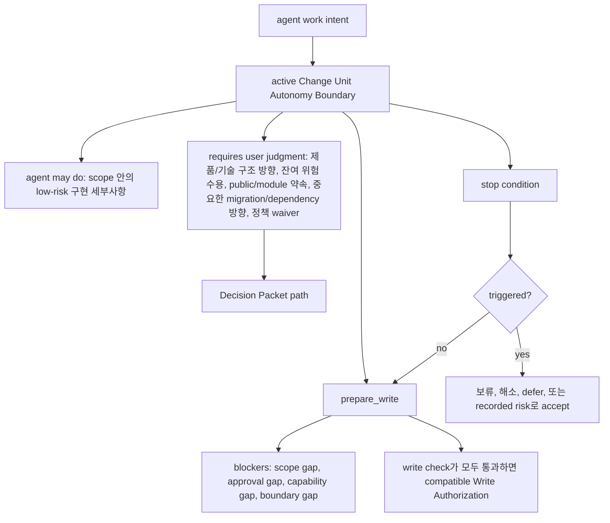
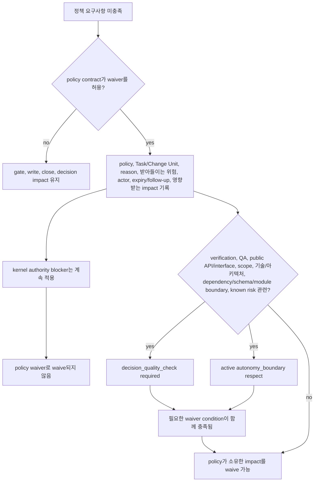

# 설계 품질 정책

## 이 문서가 도와주는 일

이 참조 문서는 설계 품질 정책이 언제 적용되는지, 필요한 기록과 근거가 무엇인지, 결과를 보고하는 안정적인 validator ID가 무엇인지, 그리고 충족되지 않은 요구사항이 쓰기 gate나 close에 어떤 영향을 주는지 확인할 때 사용합니다.

이 정책들은 AI 지원 작업이 제품 설계, 도메인 언어, 모듈 경계, 테스트 규율, 사람의 QA, 맥락 관리와 어긋나지 않도록 돕습니다. 동시에 모든 품질 선호를 커널 불변 규칙으로 승격하지는 않습니다.

이 문서는 참조 문서입니다. 문서 수락과 별도의 구현 계획 준비 결정 전에는 runtime/server 구현, 생성된 운영 파일, 실행 가능한 fixture 파일, runtime data를 만들라는 뜻이 아닙니다. 첫 실행 목표는 코어 권한 조각(v0.1 Core Authority Slice)이며, 커널 스모크(Kernel Smoke)는 이 조각을 위한 좁은 conformance authoring profile입니다. 첫 제품 MVP 목표는 사용자 대상 하네스 MVP(v0.2 User-Facing Harness MVP)입니다. 에이전시 보증 팩(v0.3 Agency Assurance Pack)과 운영과 인계 팩(v0.4 Operations & Handoff Pack)은 agency assurance, operations, handoff behavior를 단단하게 만드는 단계이며, v1+ Expansion은 owner 문서가 승격하고 증명하기 전까지 roadmap 범위에 남습니다.

이 문서는 MCP schema, SQLite DDL, 상태 전이 표, runtime/server 동작, 전체 projection template을 정의하지 않습니다.

## 이런 때 읽기

- 작업을 구체화하면서 어떤 설계 품질 기록이 필요한지 확인할 때.
- 설계 품질 validator 결과를 검증하는 conformance fixture를 작성하거나 검토할 때.
- Task가 왜 `design_gate`, `decision_gate`, `qa_gate`의 영향을 받는지 이해해야 할 때.
- 정책 waiver가 허용되는지 판단할 때.
- close blocker, Decision Packet 필요성, 수동 QA 요구사항, stewardship 발견 사항을 검토할 때.

## 읽기 전에

Lifecycle, gate, close semantics는 [커널 참조](kernel.md)를 사용합니다. Public request/response shape와 `ValidatorResult`는 [MCP API와 스키마](mcp-api-and-schemas.md)를 사용하고, fixture assertion semantics는 [Conformance Fixtures 참조](conformance-fixtures.md#fixture-assertion-semantics)를 사용합니다.

## 핵심 생각

설계 품질 정책은 stewardship, 제품 설계, context quality expectation을 기존 Harness owner path를 통해 보이게 합니다. Finding, gate impact, blocker, 근거 필요성, Decision Packet routing에 영향을 줄 수 있지만 새 kernel transition, schema, 대체 authority를 만들지는 않습니다.

## 정책을 쉬운 말로

| 정책 영역 | 쉬운 질문 |
|---|---|
| `shared_design` | 요구사항 구체화/Discovery 또는 다른 shaping 경로가 에이전트가 확인할 수 있는 사실과 사용자 소유 결정을 분리하고, 안전한 다음 작업을 제안할 만큼 목표, 사용자 가치, 범위, 비목표, 수용 기준, 가정, 제품·기술·security/privacy·QA·운영·후속 위험, 남은 불확실성, 안전한 다음 작업 또는 작업 분할 context를 기록했는가? |
| `decision_quality` | 제품, 설계, 기술, 아키텍처, waiver, risk 선택에 Decision Packet 또는 기존 waiver, Residual Risk, QA, 작업 수락 기록이 필요한가? |
| `autonomy_boundary` | Agent가 혼자 할 수 있는 일과 사용자 판단을 위해 멈춰야 하는 지점은 무엇인가? |
| `vertical_slice` | 작업이 얇은 end-to-end slice로 잡혔는가, 아니면 수평 예외가 기록됐는가? |
| `feedback_loop` | Agent는 쓰기 전후에 변경이 동작하는지 어떻게 확인할 것인가? |
| `tdd_trace` | TDD가 required이거나 가장 알맞은 방식일 때 RED, GREEN, 관련 check 근거가 기록됐는가? |
| `domain_language` | 제품 용어와 코드 용어가 계속 정렬되어 있는가? |
| `deep_module_interface` | 모듈 역할, 공개 interface, 호환성, 호출자 영향이 이해되었는가? |
| `codebase_stewardship` | 로컬 Task 완료가 향후 유지보수성, 테스트 용이성, 도메인 언어, 경계 손상을 숨기고 있지 않은가? |
| `manual_qa` | UX, workflow, copy, accessibility, visual output, product taste를 사람이 직접 봐야 하는가? |
| `context_hygiene` | Agent가 stale chat, old document, full docs dump, over-broad retrieved context 대신 current하고 focused하며 phase-appropriate한 context를 쓰는가? |
| `two_stage_review_display` | Spec compliance와 code stewardship을 새 gate 없이 분리해 보여 주는가? |

## 담당하는 참조 범위

이 문서가 담당합니다.

- 설계 품질 정책 계약
- policy-to-validator mapping
- 안정적인 설계 품질 validator ID
- severity composition 규칙
- 정책 waiver 의미
- 정책이 기대하는 근거
- 정책이 close에 미치는 영향
- two-stage review display와 policy validator 및 owner 기록의 관계
- 설계 품질 정책이 `decision_gate`, `design_gate`, `qa_gate`, 근거 충분성, `prepare_write` blocker, close blocker에 영향을 주는 시점

## 여기서 다루지 않는 것

이 문서는 다음 항목을 담당하지 않습니다.

- kernel lifecycle transition. [커널 참조](kernel.md)를 봅니다.
- gate enum 정의. [커널 참조](kernel.md)와 [MCP API와 스키마](mcp-api-and-schemas.md)를 봅니다.
- public MCP request/response schema. [MCP API와 스키마](mcp-api-and-schemas.md)를 봅니다.
- SQLite DDL 또는 storage layout. [Storage와 DDL](storage-and-ddl.md)을 봅니다.
- projection template 본문. [문서 Projection 참조](document-projection.md)와 [Template 참조](templates/README.md)를 봅니다.
- operator command 의미. [운영과 Conformance](operations-and-conformance.md)를 봅니다.
- connector capability profile. [Agent 통합 참조](agent-integration.md)를 봅니다.
- surface recipe. [Surface Cookbook](surface-cookbook.md)을 봅니다.
- 사용자가 읽는 session 절차

## 정책이 커널 불변 규칙이 되지 않고 gate에 영향을 주는 방식

Kernel은 lifecycle, gate transition, close semantics, blocker mechanics, state transition, `prepare_write`, `close_task`를 담당합니다.

설계 품질 정책은 kernel 위에 놓이는 정책 계약입니다. 이 정책은 언제 `decision_gate`, `design_gate`, `qa_gate`, 근거 충분성, `prepare_write` blocker, close blocker에 영향을 줄 수 있는지 설명합니다. 하지만 새 kernel transition, 새 기준 정보, scope, sensitive-action Approval, 근거, 검증, 작업 수락, 잔여 위험 rule의 대체물을 만들지는 않습니다.

권한 경로는 구분해서 유지합니다. 제품 판단과 기술 구조 판단이 진행, write, waiver, 작업 수락, close를 막으면 Decision Packet으로 라우팅합니다. Policy validator는 설계 품질 finding과 gate impact를 보고합니다. State change, product write, 작업 수락, 잔여 위험 수용, close가 진행될 수 있는지는 여전히 kernel authority가 결정합니다.

정책 waiver도 제한적입니다. 정책 계약이 허용하는 경우에만 설계 품질 요구사항을 충족한 것으로 볼 수 있습니다. product write 범위, sensitive-action Approval, 필요한 근거 범위, 필수 작업 수락, verification 독립성을 대신 면제하지 않습니다.

### 닫기 지원 범주 경계

설계 품질 정책은 finding, 근거 필요성, 수동 QA 요구, 검증 필요성, 잔여 위험 후보, Decision Packet 필요성, close blocker를 만들 수 있지만 각 범주는 자기 owner path에 남습니다.

| 범주 | 정책에서의 의미 | 대신할 수 없는 것 |
|---|---|---|
| 근거 | claim, criterion, Run, finding, observation을 뒷받침하는 기록 또는 ref. | 수동 QA, 검증, 작업 수락, 잔여 위험 수용. |
| 검증 | 정확성에 대한 범위가 정해진 check이며, 분리 보증은 valid Eval path를 통해서만 생김. | 수동 QA, 작업 수락, 잔여 위험 수용. |
| 수동 QA | UX, workflow, copy, accessibility, visual output, product taste, environment-dependent behavior에 대한 사람의 확인. | 자동 검증, 분리 검증, 작업 수락, 잔여 위험 수용. |
| 작업 수락 | Close basis가 보인 뒤 required일 때 사용자가 결과를 받아들이는 판단. | 근거, 검증, 수동 QA, 민감 동작 승인, 면제 판단, 잔여 위험 수용. |
| 잔여 위험 수용 | 표시된 close-relevant 잔여 위험을 사용자가 명시적으로 수용하는 판단. | 구현 검증, 근거 충분성, 수동 QA 통과, 작업 수락, 위험 없는 close. |

테스트 통과는 근거가 될 수 있고 검증을 뒷받침할 수 있지만, 자동으로 수동 QA나 작업 수락을 충족하지 않습니다. QA 면제 판단은 이름 붙은 QA requirement에만 영향을 주며 검증 근거 또는 수동 QA 통과 결과를 만들지 않습니다. 사용자가 작업을 수락해도 잔여 위험이 지워지지 않고, 잔여 위험 수용은 구현을 검증하지 않습니다.

## Two-stage review model

Review guidance는 agent와 user가 "요청한 것을 만들었는가?"와 "구현이 유지보수 가능한가?"를 분리해 볼 수 있도록 두 stage로 표시됩니다. 이 stage는 관리되는 절차와 표시 방식일 뿐이며, 새 kernel gate, schema, 기준 기록, `ProjectionKind` value, Approval, 근거, 검증, 수동 QA, 작업 수락, 잔여 위험 수용, close, Write Authorization을 만들지 않습니다.

| Stage | Question | Typical coverage |
|---|---|---|
| Spec Compliance Review | 현재 Harness 권한 안에서 요청된 Task를 만족했는가? | 수용 기준 충족 범위, Change Unit 완료 조건, scope 및 Write Authority 호환성, Decision Packet 호환성, 근거 범위, Residual Risk 표시. |
| Code Quality / Stewardship Review | 이 implementation이 codebase 안에서 유지보수하기 좋은가? | Domain language, module/interface boundary, vertical slice shape, feedback loop 또는 TDD trace, codebase stewardship, context hygiene, follow-up risk. |

Review 단계에서는 validator 결과, 근거 공백, Decision Packet 후보, Change Unit 업데이트 추천안, Eval 또는 검증 필요, 수동 QA 필요, Residual Risk 후보, Approval 필요, close blocker, follow-up work를 요약할 수 있습니다. Role Lens 또는 recommended playbook 라벨은 이 검토 관점을 고를 수 있지만 또 다른 권한 경로를 만들지는 않습니다. Review display 자체는 근거, 수동 QA, 검증, 작업 수락, 잔여 위험 표시, 잔여 위험 수용, Approval, scope, close, Write Authorization을 충족하지 않으며, underlying owner path 없이 close를 직접 차단하지도 않습니다.

Same-session review는 분리 검증이 아닙니다. 통과한 two-stage review는 `self_checked` confidence를 뒷받침하고 finding을 기존 state path로 연결할 수 있지만 `assurance_level=detached_verified`를 만들면 안 됩니다. 분리 검증에는 여전히 valid independence boundary와 Eval path가 필요합니다.

## Finding 라우팅

Run, Eval record, 수동 QA, design-quality validator, 같은 세션 review display, operator diagnostic, conformance example에서 나온 finding은 chat이나 report prose 안에서 사라지면 안 됩니다. Finding이 close-relevant해지는 것은 기존 owner path를 통할 때뿐입니다. 예를 들어 Evidence Manifest의 gap 또는 support row, Decision Packet candidate 또는 record, Change Unit scope/completion/Autonomy Boundary update, Feedback Loop 또는 TDD Trace update, 수동 QA 또는 Eval result, Residual Risk candidate 또는 record, structured close blocker, reconcile item, 또는 owner 문서가 이미 정의한 follow-up Task/Change Unit/Journey Spine Entry가 그 경로입니다.

이 section은 finding schema, DDL table, gate, validator ID, authority path를 만들지 않습니다. Policy finding을 Kernel, MCP API, Storage, Document Projection, Operations가 소유하는 기존 기록으로 되돌리는 방법을 이름 붙입니다.

| Finding source | 기존 owner path로 라우팅 |
|---|---|
| Run 또는 selected feedback-loop execution | Log/artifact를 Run과 Feedback Loop execution에 붙이고, Evidence Manifest coverage를 갱신하며, failed 또는 missing check를 applicable한 경우 design/evidence blocker, rework Change Unit, Residual Risk 후보, close blocker로 연결합니다. |
| Eval 또는 verification review | Eval verdict, reviewed refs, independence/freshness blocker, artifact refs를 기록합니다. 검토 근거가 없으면 Evidence Manifest coverage로, independence가 유효하지 않으면 verification gate 또는 close blocker로, 사용자 소유 waiver/risk 선택은 Decision Packet과 Residual Risk 경로로 연결합니다. |
| 수동 QA | 수동 QA result, finding, evidence ref, waiver reason, `qa_gate` effect를 기록합니다. Failed 또는 waived human-inspection risk는 policy가 요구하는 대로 rework, Decision Packet, Residual Risk, close blocker, follow-up work로 연결합니다. |
| Design-quality 또는 stewardship review | Validator result와 owner ref를 기록합니다. Design-quality gap은 applicable한 경우 `design_gate` 또는 evidence sufficiency로, 제품 또는 기술 구조 판단은 Decision Packet과 `decision_gate`로, 수동 QA finding은 수동 QA record와 `qa_gate`로, scope/completion/autonomy gap은 Change Unit update recommendation으로, stale 또는 missing support는 evidence/reconcile path로, close-relevant risk는 Residual Risk 후보 또는 structured close blocker로 연결합니다. |
| Operator 또는 conformance finding | Existing state, event, artifact, projection freshness, error, reconcile/recover path, 또는 docs-maintenance report label을 통해 finding을 assert합니다. Docs-maintenance finding은 runtime effect `none`을 유지합니다. |

## 정책 계약 형태

각 policy는 동일한 field를 사용합니다.

| Field | Meaning |
|---|---|
| `name` | Stable policy name. |
| `applies_when` | Policy가 관련되는 조건. |
| `default_requirement` | 적용될 때 기본적으로 일어나야 하는 것. |
| `allowed_waiver` | 누가 waiver를 적용할 수 있고 무엇을 기록해야 하는지. |
| `required_record` | 결과를 저장하는 기준 상태 record 또는 record family. |
| `validator` | compliance, warning, failure, blocker를 보고하는 validator. |
| `evidence` | Policy가 기대하는 근거 또는 projection ref. |
| `close_impact` | 충족되지 않은 요구사항이 close 또는 gate에 미치는 영향. |

Policy validator는 MCP API document가 담당하는 validator 결과 형식에 맞춰 결과를 반환합니다.

위 표가 field 이름의 기준입니다. Field 순서는 적용 조건에서 요구사항, waiver, 기록, validator, 근거, close 영향까지 훑어보기 쉽게 정리한 것입니다.

## 정책 계약

### Shared Design (`shared_design`)

요구사항 구체화는 구현 계획과 쓰기 권한 전에 에이전트가 수행하는 조건부 Shared Design 요청 정리 자세입니다. `Discovery`는 이 자세의 안정적인 내부 이름이지 사용자가 외워야 하는 명령어가 아닙니다. 구체화가 필요할 때 사용하는 것이며 모든 작업에 필요한 의식이 아닙니다. "구현 전에 계획을 먼저 구체화해줘" 또는 "코드를 바꾸기 전에 필요한 걸 물어봐" 같은 평범한 요청으로도 같은 행동이 시작될 수 있습니다. 여러 targeted question을 물을 수 있고 Question Queue를 유지할 수 있지만, 중지 조건은 단순히 First Safe Change Unit Candidate를 찾는 것이 아닙니다. 에이전트가 직접 확인할 수 있는 사실과 사용자가 결정해야 하는 항목을 분리하고, 목표, 비목표, 수용 기준, 중요한 판단 후보가 충분히 분명하며, 해소되지 않은 사용자 소유 판단을 숨기지 않은 채 안전한 다음 작업, 더 작은 범위, 또는 작업 분할을 제안할 수 있고, 남은 불확실성이 명시되면 shaping을 잠시 멈추거나 진행할 수 있습니다. 출력은 Shared Design, Decision Packet candidate, Change Unit shaping으로 라우팅합니다. Standalone schema, canonical record field list, approval, sensitive-action Approval, Write Authorization, evidence, verification, QA, 작업 수락, 잔여 위험 수용, close, scope authority, 새 authority path가 아닙니다.

Tiny direct profile은 edit가 typo, 문서 한 문장, obvious rename이고 meaning, product, technical, security, privacy, public-interface, UX workflow, sensitive-category judgment가 없을 때만 Shared Design threshold 아래에 있습니다. Tiny direct도 여전히 `mode=direct`이며 scope, Approval, evidence, security boundary를 면제하지 않습니다.

이럴 때 사용합니다:

- 요청이 모호하거나 안전한 다음 작업이 분명하지 않을 때.
- 범위, 범위 밖 항목, 수용 기준, 사용자 가치 정렬이 필요할 때.
- 영향받는 제품 영역, 사용자 화면/흐름, 모듈, interface, 민감 카테고리(sensitive categories), 검증 기대 수준, 수동 QA 기대 수준, 사용자가 소유하는 제품 또는 중요한 기술 절충 판단, 알려진 제품·구현·검증·QA·후속 위험을 쓰기 전에 구체화해야 할 때.
- 공개 interface, schema, auth, UX, workflow가 바뀔 수 있을 때.
- `work` task를 구현 전에 구체화해야 할 때.

예시: 사용자가 "새 workspace owner의 onboarding을 더 좋게 만들고 싶어. 먼저 지금 있는 걸 살펴보고, 제품 선택과 확인 가능한 사실을 나눈 뒤, 저장소에서 답할 수 없는 질문만 해줘"라고 요청하면, 쓰기 전에 목표, 사용자 가치, 비목표, 수용 기준, 에이전트가 repo/docs/state에서 확인할 수 있는 사실, inline checklist와 modal setup prompt 같은 사용자 소유 제품/UX 선택, flow에 대한 QA 기대 수준, 기각한 선택지, 남은 불확실성, 안전한 다음 작업 후보 또는 작업 분할을 기록합니다. 제품 쓰기가 가까워지면 그 후보가 이후 First Safe Change Unit Candidate가 될 수 있습니다.

예시: 사용자가 "로그인 방식을 바꾸고 싶은데 session, magic link, OAuth/OIDC 중 무엇이 맞는지 모르겠어. 먼저 현재 auth 구조를 살펴줘"라고 요청하면, 쓰기 전에 기존 user/session/auth 문서와 코드를 확인한 뒤 local email/password session, magic link, OAuth/OIDC 같은 사용자 소유 인증 아키텍처 선택, account enumeration, redaction, rate limit, session lifetime 같은 security/privacy 선택, verification과 수동 QA 기대 수준, 남은 불확실성, 안전한 다음 작업 후보 또는 작업 분할을 분리합니다.

`안전한 다음 작업 후보`와 `작업 분할 제안` 같은 표현은 proposal/support phrase이며 standalone schema, canonical record type, gate value, projection kind, authority path가 아닙니다. 제품 쓰기가 가까워지면 하나의 제안을 Change Unit shaping을 위한 First Safe Change Unit Candidate로 표현할 수 있습니다.

Shared Design은 기록된 shared understanding이지 final approval, sensitive-action Approval, 작업 수락, 잔여 위험 수용, QA judgment, Write Authorization이 아닙니다. Shared Design은 Decision Packet이 필요한 결정을 드러낼 수 있고 `design_gate` 준비 상태를 뒷받침할 수 있지만, 그 자체로 사용자 소유 판단을 해결하지는 않습니다.

| Field | Contract |
|---|---|
| `name` | `shared_design` |
| `applies_when` | 작업 요청이 모호하거나, 범위와 범위 밖 항목이 분명하지 않거나, 사용자 가치 정렬이 필요하거나, 영향받는 제품 영역, 사용자 화면/흐름, 모듈, interface, 민감 카테고리(sensitive categories), 검증 또는 수동 QA 기대 수준, 사용자가 소유하는 제품 또는 중요한 기술 절충 판단, 알려진 제품·구현·검증·QA·운영·후속 위험을 구체화해야 하거나, 공개 interface, schema, auth, security, privacy, UX, workflow가 영향을 받거나, `work` task를 구체화해야 할 때. 그 신호 중 하나라도 나타나면 Tiny direct는 tiny path를 떠나야 합니다. 작업이 여전히 좁지만 tiny changed-path/self-check note를 넘는 근거가 필요하면 일반 Direct로 상향할 수 있습니다. 사용자 소유 판단, 민감 category, security/privacy, public interface/API impact, UX workflow, schema, multi-step delivery가 나타나면 Work로 라우팅하고, 필요하면 요구사항 구체화 또는 Shared Design을 사용해야 합니다. |
| `default_requirement` | Discovery Brief 또는 동등한 Shared Design support로 기록할 것: 목표, 사용자 가치, 범위, 비목표, 수용 기준, 영향받는 제품 영역, 사용자 화면/흐름, 모듈, interface, 민감 카테고리(sensitive categories), repo/codebase/docs/Harness state에서 에이전트가 확인할 수 있는 사실, 사용자만 결정할 수 있는 판단, 분리된 제품/UX 판단 후보, 기술 구조 판단 후보, security/privacy 판단 후보, QA와 verification 기대 수준, 운영 및 scope 판단, 알려진 제품·구현·검증·QA·운영·후속 위험, 진행을 막는 결정, 가정, 기각한 선택지, 남은 불확실성, domain-language 영향, module/interface 영향, 안전한 다음 작업 후보 또는 작업 분할 제안. 제품 쓰기가 가까워졌다면 Change Unit shaping support로 First Safe Change Unit Candidate를 포함하거나 도출한다. 사용자에게 묻기 전 확인할 것: agent가 안전하게 직접 확인할 수 있는 답을 사용 가능한 최신 저장소, 코드베이스, 문서, Harness state에서 먼저 살핀다. 소스가 없거나 오래됐으면 현재 사실의 근거로 삼지 말고 그 불확실성을 기록한다. 열린 질문은 blocking, useful-but-not-blocking, codebase-answerable로 분류한다. Current codebase, docs, Harness state, safe inspection으로 답할 수 없는 결정만 사용자에게 묻는다. 구체화 방식: 여러 차례 이어질 수 있으며, 긴 질문지가 아니라 decision area별 targeted question을 묻고 보통 가장 막힘이 큰 area부터 시작한다. 각 사용자 소유 판단 prompt에는 profile에 맞는 options 또는 chosen outcome을 포함하고, full trade-off prompt에는 추천안, 불확실성, deferral consequence, 즉 미뤄졌을 때 계속할 수 있는 일 또는 결정 전에는 진행하면 안 되는 이유를 포함해야 한다. Agent가 둔 가정은 사용자 판단이 필요한 선택, Approval, QA 판단, 작업 수락, 잔여 위험 수용, 공개 약속과 분리한다. 에이전트가 확인할 수 있는 사실과 사용자 소유 결정이 분리되고, 목표, 비목표, 수용 기준, 중요한 판단 후보가 충분히 분명하며, 남은 불확실성이 명시되고, 안전한 다음 작업 또는 작업 분할을 제안할 만큼 충분한 scoped information이 생기기 전에는 구현 계획을 굳히지 않는다. 해소되지 않은 사용자 판단을 숨기지 않고 안전한 다음 작업, 더 작은 범위, 또는 작업 분할을 제안할 수 있을 때만 shaping을 멈추거나 잠시 멈추거나 구현 계획으로 진행한다. |
| `allowed_waiver` | User/operator가 reason과, design risk가 남는 경우 follow-up을 기록하면 tiny direct 또는 작고 명확한 `direct` work, docs-only edit, emergency fix에 허용된다. 이 waiver는 사용자 소유 판단, sensitive-action Approval, security/privacy boundary, close-relevant 잔여 위험을 우회하지 않습니다. |
| `required_record` | Shared Design record, Task shaping field, decision record, 선택적 `DESIGN` 또는 `DEC` projection. Discovery Brief, Question Queue, Assumption Register, First Safe Change Unit Candidate는 existing owner path가 underlying fact를 기록하지 않는 한 support/projection 개념입니다. |
| `validator` | `shared_design_alignment` |
| `evidence` | Shared Design ref, Task shaping ref, 수용 기준, decision ref, 기각한 선택지 ref, 제품 영역, 사용자 화면/흐름, 모듈, interface, 민감 카테고리(sensitive category) 메모, 검증 또는 수동 QA 기대 수준 ref, 위험 메모, 위험 후보, 필요한 경우 residual-risk ref, domain/module/interface impact ref. Discovery Brief, Question Queue, Assumption Register, First Safe Change Unit Candidate는 shaping support 또는 projection으로 남으며, 그 자체만으로 Harness Evidence Manifest나 close 근거를 충족하지 않습니다. |
| `close_impact` | Required인데 없으면 `design_gate=pending` 또는 `partial`로 설정하거나 유지한다. Risk가 높고 waiver가 없으면 close를 차단한다. Valid waiver는 `design_gate=waived`를 허용할 수 있다. |

### Decision Quality (`decision_quality`)

이럴 때 사용합니다:

- 선택이 사용자가 소유하는 제품 방향, 비용·호환성·보안·유지보수·migration·interface·dependency·위험 영향이 큰 기술 구조 방향, scope, 아키텍처, schema/data model, public API, module boundary, compatibility를 바꿀 때.
- Domain-language conflict가 제품 의미, public documentation, caller expectation, 수용 기준, API naming, module responsibility를 바꿀 때.
- Waiver가 QA 또는 검증 면제 risk를 포함한 알려진 위험을 수용할 때.
- 수평 예외가 design, technical, 또는 architecture choice일 때.
- Agent 추천안은 있지만 판단은 user가 소유할 때.

예시: Breaking API change가 더 단순해 보이면, full trade-off profile을 사용하고 실행 전에 선택지, 장단점, 호환성 위험, 추천안, user decision을 기록합니다.

재사용 가능한 Decision Packet 예시:

- `decision_kind=product_tradeoff`: 로그인 실패 피드백을 inline message, toast, modal/layer 중에서 고릅니다. 사용자 흐름, 방해 정도, 접근성, 문구, 제품 위험의 trade-off를 기록합니다. Blocking form problem을 inline error text, toast, modal/layer 중 무엇으로 보여줄지도 같은 방식의 packet으로 다룰 수 있습니다.
- `decision_kind=product_tradeoff`: 비어 있는 화면이 바로 설정을 유도할지, 데이터가 생길 때까지 조용히 둘지처럼 경험의 product taste가 달라지는 선택입니다. 제품 의도, 사용자군, 명확성, 방해 정도, 수동 QA 필요성, 추천안, 불확실성, 결정을 미뤘을 때 계속할 수 있는 일 또는 결정 전에는 진행하면 안 되는 이유를 기록합니다.
- `decision_kind=architecture_choice`: session auth, token auth, social login 중에서 고릅니다. 폐기 가능성, CSRF/XSS 노출, client 호환성, 운영 복잡도, migration 경로, 추천안이 Task에 맞는 이유를 기록합니다.
- `decision_kind=architecture_choice`: dependency addition, schema migration, public API/interface change, module boundary change입니다. 대안, 영향 범위, 호환성, rollback 또는 migration 비용, test boundary, 향후 유지보수 비용, 추천안, 결정을 미룰 때의 영향을 기록합니다.
- `decision_kind=product_tradeoff` 또는 `decision_kind=architecture_choice`: product copy, API name, storage-facing code에서 "Account"와 "Profile"처럼 domain language가 충돌하는 경우입니다. User-facing meaning, code impact, compatibility 또는 migration 비용, documentation promise, 추천안, 결정을 미룰 때의 영향을 기록합니다.
- `decision_kind=approval`: auth, permission, secret, data-export 작업입니다. Approval boundary는 민감한 단계를 허가할 수 있지만, 역할, exported fields, redaction, audit logging, retention, rollback, user notice가 아직 결정되지 않았다면 제품 또는 보안 판단에는 별도의 compatible Decision Packet이 필요합니다.
- `decision_kind=qa_waiver` 또는 `decision_kind=verification_waiver`: QA 또는 검증을 생략합니다. 무엇을 확인하지 않는지, waiver가 비례적인 이유, 사용자·제품·기술 측면에서 받아들이는 위험, 가장 작은 신뢰 가능한 follow-up을 기록합니다.
- `decision_kind=residual_risk_acceptance`: 알려진 잔여 위험을 두고 close합니다. 사용자에게 보인 한계, 이미 있는 근거, close를 진행할 수 있는 이유, 사용자에게 보인 residual-risk ref, follow-up을 기록합니다.

`secret_access`, `data_export`, `policy_override` 같은 Sensitive category label은 Approval 필요성을 식별합니다. 그 label만으로 Decision Packet kind가 정해지거나 사용자 소유 판단이 해결되지는 않습니다. Category 예시는 [MCP API와 스키마](mcp-api-and-schemas.md#sensitive-categories)가 담당합니다.

| Field | Contract |
|---|---|
| `name` | `decision_quality` |
| `applies_when` | Design choice, 사용자 소유의 제품 장단점 판단, product taste 판단, 기술 구조 선택, 제품 의미, public documentation, caller expectation, 수용 기준, API naming, module responsibility에 영향을 주는 domain-language conflict, 수동 QA 필요 여부가 사용자 소유의 제품·UX·접근성·릴리스 위험·product taste 판단에 달린 경우, 수동 QA waiver 선택, 범위 확장, durable impact가 있는 dependency addition, schema/data-model migration, public API/interface change, module boundary change, architecture choice, 수평 예외, verification 면제, QA 면제, 알려진 위험이 있는 작업 수락이 있을 때. |
| `default_requirement` | Decision이 실제 행동으로 이어지기 전에 Decision Packet을 기록한다. Detailed trade-off field가 judgment를 개선하지 않는 trivial bounded choice에만 `minimal_decision`을 사용하고, 그 밖에는 relevant full profile을 사용해 context, 검토한 선택지, 장단점, 추천안, uncertainty, reversibility, evidence ref, 결정을 미룰 때의 결과, 잔여 위험을 기록한다. Agent 추천안과 사용자 판단 또는 잔여 위험 수용을 분리해 둔다. `decision_kind=approval`에서는 sensitive-action scope와 boundary가 명확한지 평가하고, Approval 형태의 맥락을 제품, 기술, 보안, 수동 QA, 검증, 작업 수락, residual-risk 판단의 해결로 취급하지 않는다. |
| `allowed_waiver` | Tiny direct edit를 포함해 공개 interface, 제품, 중요한 기술, 아키텍처, 유지보수, verification, QA, sensitive-category, security/privacy, 알려진 위험 impact가 없고 사소하며 되돌리기 쉬운 선택에만 허용된다. Waiver에는 Decision Packet이 judgment를 개선하지 않는 이유를 기록해야 한다. |
| `required_record` | Decision Packet 기록과 렌더링될 때 선택적 `DEC` projection. |
| `validator` | `decision_quality_check` |
| `evidence` | Decision Packet ref, option ref, evidence manifest ref, risk/waiver ref, 잔여 위험 수용이 포함될 때 residual-risk state ref, 사용자 판단이 필요할 때 작업 수락 ref. |
| `close_impact` | 차단하는 사용자 소유 판단에 필요한 decision quality가 없으면 `decision_gate=required`, `pending`, 또는 `blocked`로 설정하거나 유지한다. Design quality에 영향을 주는 decision일 때만 `design_gate`에 반영한다. 해소되지 않은 사용자 판단, invalid deferral, 받아들여지지 않은 residual risk는 영향받는 write 또는 close를 차단한다. 유효하게 기록된 작업 수락은 잔여 위험을 state ref에 보존한 채 close를 허용할 수 있다. |

### Autonomy Boundary (`autonomy_boundary`)

이럴 때 사용합니다:

- Agent는 포괄된 구현 세부사항을 진행할 수 있지만 사용자 소유의 제품 판단 또는 기술 구조 판단에서는 멈춰야 할 때.
- Task에 ambiguous authority, user constraint, sensitive action, external side effect, irreversible edit가 있을 때.
- 범위 확장, 공개 약속, 알려진 중지 조건이 나타날 수 있을 때.
- Active Change Unit에 "agent may do"와 "ask first" boundary가 필요할 때.

예시: Agent는 scope 안에서 local helper 이름을 리팩터링할 수 있지만 public CLI flag contract를 바꾸거나 user 대신 risk를 수용하기 전에는 멈춰야 합니다.

| Field | Contract |
|---|---|
| `name` | `autonomy_boundary` |
| `applies_when` | Agent가 authority가 모호하거나, user constraint, external side effect, irreversible edit, 범위 확장, sensitive action, 사용자 소유의 제품 판단 또는 기술 구조 판단, public API/module contract 약속, 중요한 dependency 또는 migration 방향, security 또는 privacy trade-off, 잔여 위험 수용, 알려진 중지 조건이 있는 작업을 shaping하거나 실행할 때. |
| `default_requirement` | Agent가 user input 없이 할 수 있는 것, 사용자 판단이 필요한 것, 중지 조건을 기록한다. 기준 경계는 active Change Unit에 둔다. Change Unit이 아직 없으면 Task 또는 Shared Design이 shaping/proposed boundary ref를 가질 수 있다. 경계는 low-risk 구현 세부사항에서는 agent가 진행하게 하되, 사용자 소유 제품 방향, 기술 구조 방향, 잔여 위험 수용, public interface/module 약속, 중요한 dependency/migration 방향, security 또는 privacy trade-off, 사람의 판단이 필요한 정책 waiver에서는 멈추게 해야 한다. Autonomy Boundary는 scope grant가 아니며 active Change Unit 밖의 path, tool, command, network, secret, sensitive category를 허가하지 않는다. |
| `allowed_waiver` | 요청에서 authority가 명확하고 중지 조건이 현실적으로 발생할 수 없는 tiny direct 또는 좁은 `direct` work에 허용된다. Waiver에는 autonomy boundary가 필요 없는 이유를 기록해야 하며, scope expansion, sensitive action, security/privacy trade-off, 사용자 소유 판단을 덮어서는 안 된다. |
| `required_record` | Active Change Unit의 기준 Autonomy Boundary record, Change Unit 생성 전 Task 또는 Shared Design shaping/proposed boundary ref, 사용자 판단 item에 대한 Decision Packet record, trigger된 stop-condition ref. |
| `validator` | `autonomy_boundary_check` |
| `evidence` | User request ref, task constraint, policy ref, Decision Packet ref, stop-condition event, user response ref. |
| `close_impact` | `prepare_write`에서 발생한 중지 조건 또는 경계 공백은 write를 차단한다. 사용자 소유 판단 gap은 Decision Packet을 요청하거나 참조해야 하며 `decision_gate`에 영향을 준다. Design-quality gap은 `design_gate`에 영향을 줄 수 있다. Scope, sensitive-action Approval, capability gap은 각자의 blocker로 남는다. 해소되지 않은 중지 조건은 해소되거나, deferred되거나, recorded risk로 accepted될 때까지 close를 차단할 수 있다. |

### Vertical Slice (`vertical_slice`)

이럴 때 사용합니다:

- Task가 feature, user-visible behavior, workflow, integration path를 추가하거나 바꿀 때.
- Medium/large `work` task에 작은 end-to-end delivery shape가 필요할 때.
- Horizontal enabling slice가 제안되어 기록된 예외가 필요할 때.
- Follow-up vertical risk를 보이게 남겨야 할 때.

예시: Notification feature에서는 UI가 작더라도 trigger에서 domain logic, persistence, observable output, test evidence까지 이어지는 slice를 선호합니다.

| Field | Contract |
|---|---|
| `name` | `vertical_slice` |
| `applies_when` | Feature work, user-visible behavior, workflow change, integration behavior, medium/large `work` task. |
| `default_requirement` | Trigger/input, domain logic, persistence 또는 state, API/caller boundary, observable output, test evidence, optional 수동 QA를 연결하는 thin end-to-end Change Unit을 선호한다. |
| `allowed_waiver` | Scaffold, test harness, deep module boundary, migration safety, 공개 interface decision이 먼저 필요할 때 horizontal/enabling Change Unit을 허용한다. Change Unit은 `horizontal_exception_reason`을 기록하고, exception이 design 또는 architecture choice라면 Decision Packet을 연결하며, 아직 의미 있는 end-to-end path가 없다는 이유가 기록되지 않는 한 follow-up vertical Change Unit을 기록해야 한다. |
| `required_record` | Change Unit field: `slice_type`, end-to-end path, completion condition, follow-up vertical Change Unit, validator 결과. |
| `validator` | `vertical_slice_shape` |
| `evidence` | Change Unit record, run summary, evidence manifest, test, user-visible인 경우 수동 QA ref. |
| `close_impact` | Vertical slice가 required인데 satisfied 또는 waived가 아니면 `design_gate=partial` 또는 `blocked`로 설정한다. 정당화된 수평 예외는 follow-up risk가 기록된 경우에만 close를 허용할 수 있다. |

### Feedback Loop (`feedback_loop`)

이럴 때 사용합니다:

- Implementation이 시작되려 할 때.
- 동작에 영향을 주는 write에 신뢰할 수 있는 check path가 필요할 때.
- TDD가 면제되어 대체 feedback loop가 confidence를 담당해야 할 때.
- 수동 QA, browser smoke, test, typecheck, lint, build output이 근거가 되어야 할 때.

예시: Parser behavior를 바꾸기 전에 작은 loop를 정의합니다. Failing parser fixture, implementation, passing fixture, Evidence Manifest ref 순서입니다.

| Field | Contract |
|---|---|
| `name` | `feedback_loop` |
| `applies_when` | Implementation 시작 전, 동작에 영향을 주는 write 전, TDD가 waived될 때, 수동 QA가 expected될 때, 또는 agent가 변경이 동작하는지 배울 신뢰할 수 있는 방법이 필요할 때. |
| `default_requirement` | Implementation 전에 feedback loop를 정의한다. Loop는 test, typecheck, lint, build, browser smoke, 수동 QA, 명시적인 대체 feedback loop 중 하나일 수 있다. 선택된 loop는 risk에 대해 가장 작은 신뢰할 수 있는 feedback loop여야 한다. Change Unit 또는 behavior slice에 TDD가 required이면 non-test implementation을 시작하기 전에 loop와 intended RED check를 정의한다. TDD trace는 이 policy의 구현 방식 중 하나일 뿐 유일한 구현 방식은 아니다. Loop에서 나온 finding은 applicable한 곳에서 Evidence Manifest coverage, Decision Packet 후보, Change Unit update, Residual Risk 후보, 수동 QA 또는 Eval record, close blocker, follow-up work로 되돌려야 한다. |
| `allowed_waiver` | Implementation 또는 product behavior impact가 없는 docs-only edit, comment, formatting, advisory work에 허용된다. Waiver에는 executable, browser, 수동 QA, 대체 feedback loop가 유용하지 않은 이유를 기록해야 한다. |
| `required_record` | `record_kind=feedback_loop`으로 참조되는 기준 `feedback_loops` record, selected-loop refs, validator 결과, finding이 있을 때 그 finding을 담는 기존 owner record refs, TDD가 선택된 경우 `tdd_traces`, 수동 QA가 선택되고 수행된 경우 수동 QA record, required QA가 아직 충족하는 기록을 갖지 못한 경우 `qa_gate=pending`, 실행 후 evidence manifest refs. |
| `validator` | `feedback_loop_check` |
| `evidence` | Feedback Loop refs, planned loop refs, test/typecheck/lint/build/browser smoke logs, 수동 QA refs, 대체 feedback loop justification, 사용된 경우 TDD trace refs, evidence, decision, scope, risk, close blocker, follow-up work에 영향을 주는 finding의 existing owner refs. |
| `close_impact` | Feedback loop definition이 없으면 `design_gate=pending` 또는 `partial`로 남는다. Execution 근거가 없으면 근거가 insufficient해질 수 있다. 수동 QA loop failure는 수동 QA policy를 통해 `qa_gate`에 영향을 준다. Required TDD RED/GREEN/refactor coverage가 missing이면 `tdd_trace_required`를 통해 처리되고 Evidence Manifest coverage도 insufficient해질 수 있다. |

Public mutation path: selected-loop definition과 waiver는 `record_run(kind=shaping_update)` 중 `FeedbackLoopUpdate`로 기록합니다. Execution ref와 status는 implementation/direct run 중 `EvidenceUpdates.feedback_loop_updates`로 갱신하거나, 수동 QA가 selected loop일 때 `record_manual_qa.feedback_loop_ref`로 갱신합니다.

### TDD Trace (`tdd_trace`)

이럴 때 사용합니다:

- 변경이 domain logic, service behavior, parser/validator 동작, state transition, edge-heavy internal을 건드릴 때.
- Bug fix에 implementation 전 failing check가 필요할 때.
- TDD가 policy, Task, Change Unit, user, operator에 의해 선택될 때.
- RED 근거와 GREEN 근거가 behavior path를 설명이 아니라 증명해야 할 때.

예시: State transition bug를 고칠 때 non-test implementation 전에 failing transition test를 기록하고, 이후 passing test와 필요한 refactor/check 근거를 기록합니다.

Requirement levels:

| Level | Meaning |
|---|---|
| Required | Policy, Task, Change Unit, behavior slice, user, operator 때문에 `tdd_trace_required`가 적용됩니다. Valid TDD waiver가 없으면 non-test implementation 전에 actual RED 근거가 필요합니다. |
| Selected | TDD가 required는 아니더라도 Feedback Loop로 선택되었습니다. 선택된 loop이므로 TDD Trace를 기록합니다. |
| Waived | TDD가 required 또는 selected였지만 non-TDD justification과 신뢰 가능한 alternate Feedback Loop가 implementation 또는 close에 영향을 주기 전에 기록되었습니다. Waiver는 behavior를 증명하지 않습니다. |
| Advisory | Work shape상 TDD가 권장되지만 required 또는 selected로 표시되지 않았습니다. Selected Feedback Loop가 충분히 credible하면 TDD waiver는 필요 없습니다. Advisory guidance만으로 `tdd_trace_required` failed를 보고하면 안 됩니다. |

| Field | Contract |
|---|---|
| `name` | `tdd_trace` |
| `applies_when` | Domain logic, service module, bug fix, parser/validator, state transition, deep module internal, edge-case-heavy behavior. API/caller boundary와 integration behavior에는 권장된다. |
| `default_requirement` | TDD가 가장 알맞은 selected feedback loop이거나 Change Unit, behavior slice, policy, user/operator가 `tdd_trace_required`로 표시한 경우 TDD를 사용한다. Normal execution order는 feedback loop와 RED target 정의, RED check 작성 또는 실행, actual RED 근거 기록, actual RED 근거 또는 valid waiver가 있을 때만 non-test implementation 수행, GREEN 근거 기록, relevant한 경우 refactor/check evidence 기록, TDD trace를 Evidence Manifest coverage에 연결하는 순서다. |
| `allowed_waiver` | Docs, typo, throwaway prototype, exploratory UI prototype, initial scaffold, 또는 user/operator가 non-TDD justification과 대체 feedback loop를 기록한 경우 허용된다. Waiver는 이 slice에 TDD가 유용하지 않거나 proportionate하지 않은 이유를 명시하고 신뢰할 수 있는 feedback을 제공할 대체 feedback loop를 참조하거나 정의해야 한다. |
| `required_record` | `tdd_traces` 기록과 렌더링될 때 `TDD-TRACE` projection. |
| `validator` | `tdd_trace_required` |
| `evidence` | Actual failing test artifact/log/result 또는 policy가 명시적으로 인정한 failing-check evidence, passing test log, relevant한 경우 refactor check log, diff refs, Evidence Manifest coverage refs, 면제 시 non-TDD justification과 대체 feedback loop. RED target 또는 RED plan은 planning record이지 근거가 아니다. |
| `close_impact` | Required TDD trace가 missing이면 `design_gate=partial`이 되고 근거가 insufficient해질 수 있다. Non-test implementation 전 RED 근거가 missing이면 `prepare_write`를 차단할 수 있다. GREEN 근거 또는 relevant한 refactor/check 근거가 missing이면 근거 충분성 또는 설계 품질 blocker를 통해 close를 차단할 수 있다. Valid non-TDD justification은 design policy를 충족할 수 있지만 그 자체로 behavior를 증명하지는 않는다. |

TDD execution loop:

1. Implementation 전에 selected feedback loop를 정의한다. Required TDD에서는 Feedback Loop record에서 behavior slice 또는 수용 기준, RED target 또는 plan, expected GREEN check를 식별해야 한다.
2. Non-test implementation write 전에 RED 근거를 기록한다. RED 근거는 actual failing test artifact/log/result 또는 policy가 명시적으로 인정한 failing-check 근거를 뜻한다. RED target 또는 plan은 이 precondition을 충족하지 않고 Evidence Manifest coverage도 충족하지 않는다.
3. Active Change Unit scope, baseline, sensitive-action Approval, Autonomy Boundary, other gates가 허용하면 RED check를 만드는 test-path write는 허용한다. RED target 또는 plan은 이 scoped test-path write를 뒷받침할 수 있다. 이 write가 product file을 건드리면 여전히 product write이지만, actual RED 근거가 아직 기록되지 않았다는 이유만으로 `tdd_trace_required` policy가 차단해서는 안 된다.
4. TDD가 required인데 RED 근거도 valid TDD waiver도 없으면 non-test implementation write를 차단한다. `prepare_write`는 `tdd_trace_required` failed 또는 blocked 상태의 design-policy blocker를 반환할 수 있으며, public error selection은 계속 API precedence를 따른다.
5. Implementation 후 GREEN 근거를 기록하고, refactor step을 수행했거나 slice risk가 additional check를 요구하면 refactor/check 근거를 기록한다.
6. TDD trace, Feedback Loop, run logs, artifacts를 Evidence Manifest의 수용 기준 및 changed-file coverage에 연결한다.

이는 policy와 write-check behavior이지 Kernel Authority Invariant가 아닙니다. Kernel authority는 여전히 owner documents의 active Task, active Change Unit scope, `prepare_write`, Write Authorization, approvals, Decision Packets, evidence, verification, QA, 작업 수락, close semantics에서 나옵니다.

### Domain Language (`domain_language`)

이럴 때 사용합니다:

- 새 product term이 나타나거나 기존 term이 새 meaning을 가질 때.
- Product language와 code language가 diverge할 때.
- 여러 이름이 하나의 concept를 가리킬 때.
- Reviewer 또는 evaluator가 terminology drift를 발견할 때.
- Term conflict가 product behavior, public docs, API 또는 interface naming, 수용 기준, module responsibility에 영향을 줄 때.

예시: Product에서는 "Journey Card"라고 부르는데 code가 `sessionSummary`를 도입한다면, mismatch가 퍼지기 전에 용어 경계를 기록하거나 갱신합니다.

| Field | Contract |
|---|---|
| `name` | `domain_language` |
| `applies_when` | New product term이 나타나거나, existing term이 new meaning으로 쓰이거나, code와 product language가 diverge하거나, 여러 이름이 하나의 concept를 가리키거나, reviewer/evaluator가 term mismatch를 발견할 때. |
| `default_requirement` | 영향을 받는 term의 meaning, code representation, "not this" 경계, related term, source, status를 기록하거나 갱신한다. Implementation agent는 task-relevant term만 가져오고, reviewer/evaluator는 relevant term과 active terminology uncertainty를 받는다. Term choice에 사용자 소유 제품 판단이나 기술 구조 판단이 필요하면 그 판단을 `decision_quality`로 라우팅한다. Term record는 decision path가 허용한 뒤 선택된 language를 담는다. |
| `allowed_waiver` | Work에 domain term impact가 없거나 term이 의도적으로 local/temporary일 때 허용된다. Waiver는 기준 term update가 필요 없는 이유를 기록해야 한다. |
| `required_record` | `record_kind=domain_term`으로 참조되는 `domain_terms` record; `DOMAIN-LANGUAGE`는 projection/proposal 접점일 뿐이다. |
| `validator` | `domain_language_consistency` |
| `evidence` | Domain term ref, code ref, test naming ref, proposal용 reconcile item ref. |
| `close_impact` | Required term이 missing 또는 conflicting이면 `design_gate=partial` 또는 `stale`로 표시한다. Mismatch가 수용 기준, public behavior, public documentation 또는 caller expectation, module responsibility, verification confidence에 영향을 주면 close를 차단한다. Mismatch가 사용자 소유 판단에 달려 있으면 Decision Packet route가 compatible해질 때까지 관련 `decision_gate` impact를 유지하거나 설정한다. |

### Deep Module / Interface (`deep_module_interface`)

이럴 때 사용합니다:

- 공개 interface, module 경계, schema, data model, auth 경계, compatibility contract가 바뀔 수 있을 때.
- Deep module이 더 단순한 public 접점 뒤에 complexity를 숨길 때.
- 호출자 영향, 경계 테스트, dependency direction 검토가 필요할 때.
- Shallow-module risk가 future change를 어렵게 만들 수 있을 때.

예시: Evidence Manifest schema를 바꾸기 전에 interface contract, 영향을 받는 caller, 호환성 위험, 경계 테스트를 기록합니다.

| Field | Contract |
|---|---|
| `name` | `deep_module_interface` |
| `applies_when` | 공개 interface change, module 경계 change, schema/data model change, auth/security 경계, compatibility impact, deep module internal, shallow-module risk. |
| `default_requirement` | 영향을 받는 module, current role, proposed 공개 interface, interface 뒤에 숨겨진 internal complexity, 모듈 단위 watchpoints, 영향을 받는 caller, compatibility impact, 테스트 경계를 식별한다. 충분한 internal capability를 뒤에 둔 작고 simple한 공개 interface를 선호한다. 사용자 소유 제품 판단이나 기술 구조 판단이 필요한 공개 interface, compatibility, architecture, module responsibility 선택에는 Decision Packet을 사용한다. |
| `allowed_waiver` | Public 경계 impact, dependency direction change, 호환성 위험이 없고 localized internal change일 때 허용된다. Module/interface review가 불필요한 이유를 기록해야 한다. |
| `required_record` | `record_kind=module_map_item`과 `record_kind=interface_contract`로 참조되는 `module_map_items` 및 `interface_contracts` records, decision record, 선택적 `MODULE-MAP` / `INTERFACE-CONTRACT` projection. |
| `validator` | `module_interface_review` |
| `evidence` | Module map item ref, relevant한 경우 모듈 단위 watchpoints, interface contract ref, 호출자 영향 list, 경계 테스트, design decision, compatibility note. |
| `close_impact` | Required review가 missing이면 `design_gate=pending` 또는 `partial`로 남는다. 공개 interface, module boundary, caller-impact, compatibility risk가 있는데 review가 없으면 close를 차단하거나 잔여 위험을 받아들이는 사용자 판단이 필요할 수 있다. Boundary choice가 아직 사용자 소유라면 관련 `decision_gate` impact를 유지하거나 설정한다. |

#### Domain 및 boundary 라우팅 예시

이 예시들은 기존 policy, Decision Packet, gate, evidence, close path로 라우팅합니다. 새 schema, DDL, validator ID, gate, authority record를 만들지 않습니다.

| Concern | Existing route | Gate 또는 close 영향 |
|---|---|---|
| Local code name이 stable product term과 어긋났지만 meaning은 명확하고 public contract는 바뀌지 않는다. | `domain_terms`를 갱신하거나 참조한다. `domain_language_consistency`는 reconcile될 때까지 warning 또는 `design_gate=partial`을 보고할 수 있다. | 보통 Decision Packet은 필요 없다. Mismatch가 수용 기준 또는 verification confidence에 영향을 줄 때만 close가 차단된다. |
| "Account"와 "Profile"이 product copy, API name, docs에서 충돌하고, 선택이 사용자 또는 caller가 의존할 수 있는 내용을 바꾼다. | Term conflict에는 `domain_language_consistency`를 사용하고, 사용자 소유 제품 판단 또는 기술 구조 판단에는 `decision_quality_check`를 사용한다. 선택된 meaning을 실행하기 전에 compatible Decision Packet을 기록한다. | Term conflict가 unresolved인 동안 `design_gate`는 partial 또는 stale로 남는다. 사용자 소유 선택이 unresolved인 동안 `decision_gate`는 required, pending, blocked로 남는다. Conflict가 public behavior, docs, 작업 수락 또는 verification confidence에 영향을 주면 close가 차단될 수 있다. |
| 호환되는 public interface extension에 caller impact와 boundary test가 명확하고 사용자 소유 trade-off가 없다. | `interface_contracts`와 관련 `module_map_items`를 기록하거나 갱신한다. `module_interface_review`가 설계 품질 impact를 carries한다. | Review와 근거가 생길 때까지 `design_gate`가 pending 또는 partial일 수 있다. Compatibility, public commitment, 기술 구조 판단이 사용자 소유가 되지 않는 한 Decision Packet은 필요 없다. |
| Breaking interface cleanup 또는 module-responsibility move가 더 단순하지만 caller obligation 또는 future architecture direction을 바꾼다. | `module_interface_review`와 `decision_quality_check`를 사용한다. 영향받는 caller, compatibility, migration 또는 rollback cost, boundary tests, breaking 또는 architecture choice를 위한 Decision Packet을 기록한다. | Decision route, scope, applicable한 경우 sensitive-action Approval, policy requirements가 compatible해질 때까지 영향받는 write가 차단된다. Unresolved interface review, missing evidence, 받아들여지지 않은 residual risk, unresolved Decision Packet state는 close를 차단할 수 있다. |

### Codebase Stewardship (`codebase_stewardship`)

이럴 때 사용합니다:

- Work가 durable code structure, domain concept, ownership, interface, architecture, testing strategy를 건드릴 때.
- 로컬 fix가 future-change cost를 높일 수 있을 때.
- owner 기록과 implementation reality 사이에 drift가 보일 때.
- 일반 코드 리뷰 checklist가 아니라 focused stewardship summary가 필요할 때.

예시: Task는 test를 통과했지만 domain concept가 세 module에 다른 이름으로 퍼졌다면, task가 깔끔히 끝난 것으로 보지 말고 영향을 받는 owner ref를 기록하고 drift를 조정합니다.

| Field | Contract |
|---|---|
| `name` | `codebase_stewardship` |
| `applies_when` | Work가 durable code structure, domain concept, module ownership, interface contract, architecture direction, deep-module 경계, testing strategy, cross-cutting exception을 건드릴 때. |
| `default_requirement` | Change Unit의 stewardship 관점을 domain language, module map, interface contract, TDD/feedback loop, architecture watchpoint, deep-module 경계로 묶어 본다. Module-local watchpoints는 `module_map_items`에 두고, Task/Change Unit watchpoints는 delivery-level stewardship risk를 다룬다. Stewardship review는 일반 코드 리뷰 checklist가 아니라, 로컬 task completion이 domain language, module 경계, interface contract, feedback loop, 테스트 용이성, 유지보수성, 향후 변경 비용의 저하를 숨기지 못하게 하는 장치다. owner 기록을 기준 정보로 사용하고, Task와 관련된 참조만 기록하며, schema나 DDL을 중복하지 않고 drift에는 reconcile item을 만든다. |
| `allowed_waiver` | Durable structure, domain, interface, feedback-loop impact가 없는 isolated docs, comment, formatting, leaf edit에 허용된다. Waiver에는 stewardship review가 필요 없는 이유를 기록해야 한다. |
| `required_record` | Task 또는 Change Unit stewardship refs, `domain_terms`, relevant한 경우 모듈 단위 watchpoints를 포함하는 `module_map_items` records, `interface_contracts` records, `feedback_loops` records, TDD가 사용된 경우 `tdd_traces` refs, decision records, Task/Change Unit watchpoints, Journey Spine Entry refs, drift에 대한 reconcile items. 전용 architecture watchpoint ref는 later DDL batch가 정의한 경우에만 사용할 수 있다. 기준 design-support refs는 `record_kind=domain_term`, `record_kind=module_map_item`, `record_kind=interface_contract`, `record_kind=feedback_loop`을 사용하며, Markdown projection refs는 optional display/proposal refs이다. |
| `validator` | `codebase_stewardship_check` |
| `evidence` | Domain term ref, 모듈 단위 watchpoints를 포함하는 module map item ref, interface contract ref, feedback loop ref, 사용된 경우 TDD trace ref, Task/Change Unit watchpoint, Journey Spine Entry ref, deep-module note, reconcile item ref, later DDL에서 정의된 경우에만 전용 architecture watchpoint ref. |
| `close_impact` | Required stewardship review가 없으면 `design_gate=pending`, `partial`, 또는 `stale`로 남는다. 해소되지 않은 drift가 public behavior, module 경계, 수용 기준, verification confidence에 영향을 주면 close를 차단할 수 있다. |

#### StewardshipImpactSummary display shape

`StewardshipImpactSummary`는 Design Stewardship Default와 `codebase_stewardship` 정책 계약을 위한 파생 display/summary shape입니다. Kernel Authority Invariant가 아닙니다. 파생 display이며 기준 current record는 아닙니다. owner 기록, validator 결과, ref에서 파생되며 새로운 기준 정보를 만들지 않습니다.

Domain term, module map item, interface contract, Feedback Loop records, TDD가 선택된 경우 TDD Trace records, residual risk, Decision Packet은 계속 owner 기록으로 남습니다. Summary는 close-relevant status를 간결하게 보여 주고 해당 owner로 돌아가는 ref를 표시합니다.

이 display shape는 두 부분으로 읽습니다. owner 기록, validator 결과, Task/Change Unit ref는 입력이고, 아래 field는 파생된 표시값입니다. Summary는 owner로 돌아가는 ref를 표시할 수 있지만 owner를 대체하지 않습니다.

| Field | Values |
|---|---|
| `domain_language_impact` | `none` \| `updated` \| `conflict` \| `unresolved` |
| `module_boundary_impact` | `none` \| `local` \| `public_boundary` \| `unresolved` |
| `interface_contract_impact` | `none` \| `compatible` \| `breaking` \| `unresolved` |
| `feedback_loop_status` | `defined` \| `missing` \| `waived` |
| `future_change_risk` | `none` \| `visible` \| `accepted` \| `unresolved` |
| `close_impact` | `none` \| `blocks_close` \| `requires_decision` \| `residual_risk` |

`feedback_loop_status`는 참조된 `feedback_loops` row와 validator 결과에서 파생됩니다. TDD가 선택된 경우 참조된 `tdd_traces` row는 execution 근거를 충족할 수 있지만 selected loop의 기준 owner는 아닙니다.

### 수동 QA (`manual_qa`)

이럴 때 사용합니다:

- Change가 UI, UX flow, copy, error message, accessibility, visual output, browser-only behavior에 영향을 줄 때.
- Onboarding, checkout, auth, billing 같은 critical flow에 inspection이 필요할 때.
- Product taste judgment가 필요할 때.
- Automated check가 user experience를 충분히 보지 못할 때.

예시: Settings page copy change가 test를 통과해도 실제 화면의 clarity, layout, accessibility, product tone은 사람이 확인해야 합니다.

| Field | Contract |
|---|---|
| `name` | `manual_qa` |
| `applies_when` | UI change, UX flow change, copy/error message change, onboarding/checkout/auth/billing 또는 other critical flow, accessibility impact, visual output, browser-only behavior, product taste judgment가 필요한 result. |
| `default_requirement` | 수동 QA profile, setup, checklist, result, 발견 사항, evidence ref, performer, 관련될 때 product taste judgment, next action을 기록한다. Profile에는 `ui_quality`, `workflow`, `copy`, `accessibility`, `browser_smoke`, `performance_smoke`가 포함된다. |
| `allowed_waiver` | User/operator가 명시적으로 QA를 면제하고 waiver reason을 기록할 때 허용된다. Known product 또는 user risk를 수용하는 수동 QA 면제에는 decision quality가 필요하다. Legal, safety, privacy, high-impact user harm이 inspection을 요구하는 경우에는 적절하지 않다. |
| `required_record` | `manual_qa_records`; `qa_gate`가 기준 aggregate gate. |
| `validator` | `manual_qa_required` |
| `evidence` | 수동 QA record ref, screenshot ref, note, browser log ref, walkthrough ref, 발견 사항 ref. 이 ref들은 사람의 확인 기록을 뒷받침하지만 자동 검증, 분리 보증, 작업 수락이 되지는 않는다. |
| `close_impact` | 수동 QA가 required이면 테스트가 통과해도 `qa_gate=pending` 또는 `failed`가 successful close를 차단한다. `qa_gate=waived`에는 waiver reason이 필요하고, user/product risk가 있으면 compatible QA 면제 판단 Decision Packet과 잔여 위험 처리가 필요하다. QA failed는 rework를 만들거나 close를 차단하거나 explicit follow-up path를 요구해야 한다. |

### Context Hygiene (`context_hygiene`)

이럴 때 사용합니다:

- Work가 interruption 후 resume되거나 관련 docs, issue, record, code path가 바뀌었을 때.
- Agent가 오래된 chat, 오래된 PRD, old design doc, full documentation dump, over-broad retrieved context, moved code path에 기대고 있을 수 있을 때.
- Evaluator 또는 reviewer에게 focused current-state bundle이 필요할 때.
- Projection freshness, reconcile item, 수용 기준이 바뀌었을 때.

예시: Task가 일주일 뒤 resume되면 current status 또는 현재 위치 맥락을 먼저 읽고, Journey Card는 해당 projection/profile이 활성화되어 있고 최신일 때만 사용합니다. 그다음 active 세션 시작, 요구사항 구체화/Discovery, 사용자 결정 요청, 쓰기 준비, 실행/근거, 닫기 준비 상태, 오류/복구 context profile을 고른 뒤, 해당 profile이 필요로 하는 current Task/현재 위치 맥락/Change Unit/Decision Packet/Write Authority/Evidence/Residual Risk/Gate/Projection freshness의 refs-first summary만 보여줍니다. Old PRD, old projection, log, screenshot, diff, raw artifact, module map은 다음 safe action이 inspection을 요구할 때만 가져오고 최신이 아닌 input으로 표시합니다.

Retrieved, indexed, remembered, summarized context는 context hygiene input이지 권한 출처가 아닙니다. Agent가 compact status, pull ref, source excerpt를 찾는 데 도움을 줄 수는 있지만 write authority, gate, evidence, verification, QA, 작업 수락, 잔여 위험을 받아들이는 판단, projection 최신성, 구현 준비 상태, close effect는 여전히 해당 owner record가 결정합니다. Context Index와 retrieved-context의 전체 경계는 [Roadmap: Context Index](../roadmap.md#context-index)가 담당하고, connector 처리는 [Agent Integration](agent-integration.md#context-pushpull-principles)이 담당합니다.

| Field | Contract |
|---|---|
| `name` | `context_hygiene` |
| `applies_when` | Work가 interruption 후 resume되거나, old PRD/design doc/issue가 있거나, code path가 moved되었거나, 수용 기준이 changed되었거나, module/interface/domain 기록이 바뀌었거나, projection `source_state_version` 또는 freshness가 unknown/stale이거나, evaluator/reviewer가 focused bundle을 필요로 할 때. |
| `default_requirement` | 항상 적용되는 compact rule set은 10개 이하로 유지하고, current status 또는 현재 위치 맥락을 먼저 읽으며, Journey Card는 해당 projection/profile이 활성화되어 있고 최신일 때만 사용하고, active 세션 시작, 요구사항 구체화/Discovery, 사용자 결정 요청, 쓰기 준비, 실행/근거, 닫기 준비 상태, 오류/복구 context profile을 고른다. Profile-relevant할 때 current Task, 현재 위치 맥락, Change Unit, Decision Packet, Write Authority, Evidence, Residual Risk, Gate, Projection freshness를 refs-first summary로 사용한다. 더 큰 Reference docs, schema, historical record, older PRD/design, old projection, log, screenshot, diff, raw artifact, module map, interface contract, domain record, coding standard, TDD guidance는 pull-on-demand로 둔다. Retrieved, indexed, remembered, summarized context는 pull-only이며 non-authoritative로 남는다. 최신이 아닌 doc을 표시하고, projection freshness drift를 warning하며, chat, retrieved context, indexed context, summarized context, remembered recommendation을 state나 authority로 취급하지 않는다. |
| `allowed_waiver` | Product state, design state, 근거 상태가 바뀌지 않는 short advisor-only work에 허용된다. |
| `required_record` | Envelope 또는 context profile을 렌더링하는 데 쓰는 source record는 current Task state, 수용 기준, Change Unit, Autonomy Boundary, Decision Packet, gate states, Write Authority summary, approval status, surface capability/guarantee summary, projection freshness와 known이면 `source_state_version`, Evidence Manifest, Run, Eval, 수동 QA, ArtifactRef, report, residual-risk, reconcile item, validator result 같은 기존 owner에서 온다. Compact envelope와 context profile 자체는 렌더링된/파생 context display이며 기준 record, schema field, DDL value, authority input, gate, evidence, verification, QA, 작업 수락, 잔여 위험 수용, close, storage object가 아니다. |
| `validator` | `context_hygiene_check` |
| `evidence` | Current projection ref, freshness state, `source_state_version`, 최신이 아닌 ref, retrieved/indexed context freshness note, missing profile-relevant context material, reconcile item ref, evaluator용 bundle contents. Stale 또는 over-broad critical context는 context-hygiene finding으로 보고됩니다. 그 finding 자체는 existing owner path가 supporting ref를 기록하지 않는 한 근거가 아닙니다. |
| `close_impact` | Stale 또는 over-broad critical context, stale projection freshness, stale retrieved/indexed context, missing profile-relevant context material은 existing owner path와 gate를 통해서만 warning, stale 표시, write/close block으로 이어질 수 있습니다. Agent가 scope, evidence, 현재 수용 기준, 또는 readable projection이 canonical state와 맞는지를 안전하게 판단할 수 없으면 write 또는 close를 차단할 수 있다. |

### Two-stage Review Display

이럴 때 사용합니다:

- User가 spec compliance와 maintainability를 분리해서 봐야 할 때.
- Same-session review가 분리 검증을 주장하지 않고 발견 사항을 연결해야 할 때.
- Review output이 새 validator ID 없이 기존 policy validator를 요약해야 할 때.
- Close readiness가 "requested thing satisfied"와 "codebase stewardship acceptable"로 읽히면 좋을 때.
- Role Lens 또는 recommended playbook output이 display-only로 남으면서도 다음 실제 경로를 가리켜야 할 때.

예시: Final review에서 수용 기준과 근거가 covered 상태라 Spec Compliance는 pass일 수 있지만, Code Quality / Stewardship은 `domain_language_consistency` warning과 후속 Change Unit 추천안을 남길 수 있습니다.

| Field | Contract |
|---|---|
| `name` | `two_stage_review_display` |
| `applies_when` | Review guidance가 spec compliance, code quality, stewardship, 근거 공백, Decision Packet 후보, Residual Risk 후보, close blocker, follow-up work를 보여 줄 때. |
| `default_requirement` | Spec Compliance Review와 Code Quality / Stewardship Review를 분리해서 표시한다. `product-review`, `eng-review`, `design-review`, `security-review`, `qa-review`, `release-handoff` 같은 Role Lens와 playbook 라벨은 검토 관점으로만 다룬다. 관련 owner 기록, validator 결과, 근거 공백, Decision Packet 후보, Change Unit 업데이트 추천안, Residual Risk 후보, Approval 필요, 수동 QA 필요, Eval 또는 verification 필요, close blocker, follow-up work를 요약하되 새 gate, schema, 기준 기록, `ProjectionKind` value, Approval, evidence, verification, QA, 작업 수락, 잔여 위험 수용, close, Write Authorization, assurance level 상승을 만들지 않는다. |
| `allowed_waiver` | Review display가 유용하지 않은 좁은 direct/advisor work에서는 생략할 수 있다. 생략되는 것은 display뿐이며, underlying policy 또는 state 요구사항을 면제하지 않는다. 여기에는 Decision Packet 필요, evidence, QA, verification, 작업 수락, Residual Risk 표시 또는 잔여 위험을 받아들이는 판단, scope, Approval, Write Authorization, Task 닫기가 포함된다. |
| `required_record` | 기존 owner 기록, validator 결과, evidence ref, Decision Packet ref, Eval 또는 verification ref, 수동 QA ref, Approval ref, residual-risk ref, close blocker ref, applicable한 경우 follow-up Task/Change Unit ref. Review display 자체는 기준 상태가 아니라 파생 display다. |
| `validator` | Standalone validator ID 없음. Spec Compliance Review는 acceptance/근거 상태와, applicable한 경우 `shared_design_alignment`, `decision_quality_check`, `autonomy_boundary_check`, `feedback_loop_check`, `tdd_trace_required`, `manual_qa_required`, `context_hygiene_check`, close-related residual-risk checks를 읽는다. Code Quality / Stewardship Review는 `domain_language_consistency`, `vertical_slice_shape`, `module_interface_review`, `codebase_stewardship_check`, `feedback_loop_check`, `tdd_trace_required`, `context_hygiene_check`를 읽는다. |
| `evidence` | 기존 validator 결과 refs, evidence manifest refs, run/eval/manual QA refs, owner 기록 refs, Approval refs, residual-risk refs, close blocker refs, follow-up refs. |
| `close_impact` | Review display 자체는 Task 닫기를 충족하거나 차단하지 않는다. 관련 policy validator, 근거 충분성, QA, verification, 작업 수락, Residual Risk 표시 또는 잔여 위험을 받아들이는 판단, Approval, scope, close blocker, Write Authorization이 owner path를 통해 실제 close 영향을 결정한다. |

Review display의 발견 사항은 기존 경로로 연결합니다. `design_gate`, `decision_gate`, `qa_gate`, evidence sufficiency, Decision Packet, Eval 또는 verification, 수동 QA, Residual Risk, Approval, Change Unit 업데이트 추천, follow-up work, structured close blocker가 그 경로입니다. 이 발견 사항은 새 기준 기록이 아닙니다. 같은 세션의 review content는 조건을 충족하는 independent Eval 또는 verification record가 detached assurance를 제공하지 않는 한 self-check 또는 stewardship signal입니다.

## Waiver 규칙

Waiver는 explicit, scoped, recorded여야 합니다. 정책 waiver에는 다음을 포함해야 합니다.

- policy name
- Task와 Change Unit
- reason
- 받아들이는 위험
- 면제한 actor
- 필요할 때 expiry 또는 follow-up
- 영향받는 gate 또는 close 영향

정책 waiver는 정책 계약이 허용하는 경우에만 설계 품질 요구사항을 충족한 것으로 볼 수 있습니다. Product write 범위, sensitive-action Approval, 필요한 근거 범위, 필수 작업 수락, 기타 kernel blocker를 대신 면제하지 않습니다. Verification waiver는 kernel close semantics가 담당하며 `assurance_level=detached_verified`를 만들면 안 됩니다.

Verification, QA, public API/interface 약속, 범위 확장, 기술/아키텍처 방향, dependency 방향, schema/data-model migration, module boundary change, 알려진 위험이 있는 작업 수락과 관련된 waiver는 `decision_quality`도 충족하고 active `autonomy_boundary`를 따라야 합니다.

## Reference severity defaults

이 matrix는 policy validator를 위한 기본 reference severity 라우터입니다. Reference runner가 common task shape에서 어떤 발견 사항을 advisory로 남기고 어떤 발견 사항을 gate에 반영해야 하는지 알려 줍니다. 이 matrix는 `applies_when`, `default_requirement`, `allowed_waiver`, `close_impact`를 약화하지 않습니다. 정책 계약이 이 matrix보다 더 강하게 적용되면 정책 계약이 우선합니다.

Default impact vocabulary:

- `not_required`: 해당 policy의 `applies_when`이 독립적으로 true가 아니면 발견 사항을 내보낼 필요가 없다.
- `warning`: visible validator 발견 사항을 내보내되 default로 write 또는 close를 차단하지 않는다.
- `design_gate=pending` 또는 `design_gate=partial`: shaping, owner 기록, evidence, waiver가 incomplete하다. `prepare_write`는 이 matrix 또는 정책 계약이 gap을 write-blocking이라고 말할 때만 차단한다.
- `blocking before write`: issue가 해소되지 않은 동안 `prepare_write`는 영향받는 product write를 허가하면 안 된다. Decision Packet 또는 approval request를 만들거나 연결하는 것은 blocker path를 기록할 뿐이며 write를 허가하지 않는다. Authorization에는 issue가 해소되거나 validly waived되고, relevant Decision Packet이 영향받는 operation에 대해 해소되었거나 otherwise compatible이며, 필요한 sensitive-action Approval이 granted된 뒤 later compatible `prepare_write`가 Write Authorization을 만들어야 한다.
- `close blocker`: successful close는 pass 또는 compatible waiver를 기다린다. 받아들인 residual risk는 kernel과 관련 정책 계약이 risk-accepted close path를 허용하는 경우에만 도움이 되며, 근거 충분성, required QA, sensitive-action Approval, 작업 수락을 대체하지 않는다.
- `Decision Packet required`: Decision Packet state path를 사용하고 applicable한 경우 `decision_gate=required`, `pending`, 또는 `blocked`로 설정하거나 유지한다.

이것은 정책 영향 vocabulary이며 API `ValidatorResult.findings.severity` enum이 아닙니다. Validator 발견 사항은 계속 `info`, `warning`, `error`, `blocker`를 사용합니다. 합성된 정책 영향은 gates, blocked reasons, close blockers, Decision Packet needs, waiver eligibility, fixture-observed 파생 상태를 통해 드러납니다.

### Severity composition rule

하나 이상의 task shape, 정책 계약, validator 발견 사항이 동시에 적용되면 policy evaluator는 같은 영향 대상에 대해 가장 약한 impact가 아니라 가장 강하게 적용되는 impact를 유지해 합성합니다. "같은 영향 대상"은 전체 Task도 아니고 단순히 같은 validator ID도 아닙니다. 영향받는 gate, check, blocker target, 영향받는 operation phase, 영향받는 scope 또는 record refs, close/write/decision concern을 포함하는 정책상 관련된 대상을 뜻합니다. 서로 다른 concern은 union으로 보존하며, 같은 concern에서 경쟁하는 impact에만 가장 강한 영향 우선 규칙을 사용합니다. Default 정책 영향 순서는 다음과 같습니다.

`not_required` < `warning` < `design_gate=pending`, `design_gate=partial`, `design_gate=stale`, `qa_gate=pending` 같은 gate impact < `blocking before write` < `close blocker` < `Decision Packet required`.

이 순서는 왼쪽에서 오른쪽으로 갈수록 강합니다. 같은 영향 대상에서 경쟁하는 impact에는 이 전체 순서를 적용합니다.

이 order는 같은 concern에서 약한 default를 무시할 수 있는지를 결정합니다. 서로 다른 영향받는 gate를 하나로 합치지 않습니다. 한 발견 사항이 `design_gate`에 영향을 주고 다른 발견 사항이 `qa_gate`, `decision_gate`, 근거 충분성, Residual Risk 표시에 영향을 주면 합성 결과는 모든 영향받는 gate, blockers, refs를 유지합니다. `Decision Packet required`는 judgment-routing impact이지 write blocker, close blocker, 근거 충분성, required QA, required sensitive-action Approval, Residual Risk 표시를 대체하지 않습니다. Decision Packet은 발견 사항의 user-judgment 부분을 해소할 수 있지만, 독립적인 write blocker 또는 close blocker는 자체 policy 또는 kernel condition이 충족될 때까지 남습니다.

Validator는 모든 관련 발견 사항을 보고해야 합니다. Composition rule은 합성된 gate, write-blocker, close-blocker, waiver, Decision Packet impact를 결정하지만, 더 약한 발견 사항을 validator 결과, evidence, status, conformance output에서 숨기면 안 됩니다. Primary public `ToolError` 선택은 API가 소유한 [Primary Error Code Precedence](mcp-api-and-schemas.md#primary-error-code-precedence)를 따릅니다. 이 policy rule은 error-code precedence를 재정의하거나 secondary error를 숨기지 않습니다.

Severity는 explicit user request, sensitive category, 공개 약속, public API/interface 또는 schema impact, 알려진 위험이 있는 작업 수락, Residual Risk 표시, 최신이 아닌 critical context, 해당 case가 blocking임을 검증하는 conformance fixture에 의해 matrix default보다 올라갈 수 있습니다. Severity는 관련 정책 계약에 따라 기록된 allowed waiver가 있을 때만 낮아질 수 있으며, 해당 contract가 waiver를 허용하는 policy가 소유한 impact에만 적용됩니다. 정책 waiver는 missing scope, missing sensitive-action Approval, 필요한 근거 불충분, 필수 작업 수락, Write Authorization 요구사항 같은 Kernel Authority blocker를 낮추지 않습니다. 또한 API primary error precedence를 바꾸지 않습니다. 이 rule은 정책 계약 interpretation, validators, gates, write blockers, close blockers, Decision Packet needs에 영향을 주지만 Design Stewardship Defaults를 Kernel Authority Invariants로 만들지는 않습니다.

| Task shape | Warning 또는 `not_required` default | Gate/write default | Close/decision default |
|---|---|---|---|
| Direct docs-only | Docs가 제품 약속, 정책 계약, domain term, public behavior, interface meaning을 바꾸지 않는 한 `vertical_slice_shape`, `tdd_trace_required`, `manual_qa_required`, `module_interface_review`, `codebase_stewardship_check`는 `not_required`다. `context_hygiene_check`와 `domain_language_consistency`는 최신이 아닌 projection 또는 terminology drift에 대해 warning일 수 있다. | Default로 설계 품질 write blocker는 없다. Scope가 ambiguous하거나 design/정책 계약 edit이면 `shared_design_alignment`가 `design_gate=pending`이 된다. 사용자 판단, sensitive content, 공개 약속, 잔여 위험이 있을 때만 `autonomy_boundary_check` 또는 `decision_quality_check`가 block한다. | 기본 close blocker는 없다. Docs drift가 작업 수락, verification confidence, 공개 약속, required projection freshness에 영향을 주면 close가 block될 수 있다. Policy commitment change, 공개 약속, 알려진 잔여 위험 수용에는 `Decision Packet required`다. |
| Direct code | Obvious leaf/internal edit에는 `shared_design_alignment`, `vertical_slice_shape`, `manual_qa_required`가 `not_required`다. Minor maintainability concern에는 `codebase_stewardship_check`가 warning일 수 있다. | 동작에 영향을 주는 write 전에는 `feedback_loop_check`가 `design_gate=pending`이다. `tdd_trace_required`, `domain_language_consistency`, `module_interface_review`는 각 정책 계약이 적용될 때만 `design_gate=partial`이 된다. Scope 또는 authority gap은 `autonomy_boundary_check`가 block하고, 동작에 영향을 주는 write에 신뢰할 수 있는 feedback loop가 없으면 `feedback_loop_check`가 block한다. | Run 근거가 missing이거나, 필요한 TDD/domain/interface record 또는 해소되지 않은 behavior risk가 acceptance 또는 verification confidence에 영향을 주면 `close blocker`가 될 수 있다. 사용자 소유 판단, 알려진 위험이 있는 waiver, 범위 확장에는 `Decision Packet required`다. |
| Ordinary work feature | Feature가 user-visible, workflow-affecting, browser/product-taste dependent가 아니면 `manual_qa_required`는 `not_required`다. Domain logic, service behavior, bug repair, state transition, edge-heavy behavior가 아니면 `tdd_trace_required`는 warning일 수 있다. | 기록이 생기기 전까지 `shared_design_alignment`, `vertical_slice_shape`, `feedback_loop_check`, `codebase_stewardship_check`는 default로 `design_gate=pending` 또는 `design_gate=partial`이다. 정책 계약이 적용되면 `domain_language_consistency`와 `module_interface_review`도 design gate에 들어온다. Missing Autonomy Boundary, 해소되지 않은 decision, missing feedback loop는 `blocking before write`가 될 수 있다. | Required vertical-slice, feedback, stewardship, 근거 공백은 `close blocker`가 될 수 있다. 범위 확장, 수평 예외, 사용자 소유 제품 또는 중요한 기술 장단점 판단, 잔여 위험을 받아들이는 판단에는 `Decision Packet required`다. |
| UI/UX/copy work | 신뢰할 수 있는 대체 feedback loop가 있으면 `tdd_trace_required`는 default로 `not_required`다. Schema, auth, 공개 interface, compatibility를 touch하지 않으면 `module_interface_review`는 warning이다. | `shared_design_alignment`, `feedback_loop_check`, copy-relevant `domain_language_consistency`는 default로 `design_gate=pending` 또는 `design_gate=partial`이다. `manual_qa_required`는 QA path를 선택하고 `qa_gate=pending`을 set할 수 있다. Product-taste authority 또는 중지 조건이 unclear하면 `autonomy_boundary_check`가 block한다. | `manual_qa_required`는 `qa_gate=pending` 또는 `failed`를 set하며, validly waived되지 않으면 `close blocker`다. 중요한 UX/copy 장단점 판단, 알려진 user/product 위험이 있는 QA 면제, 공개 약속에는 `Decision Packet required`다. |
| Sensitive work | Unrelated policy는 `not_required`로 남지만, sensitive category가 scope, sensitive-action Approval, user harm, privacy, legal, safety, security, secret, irreversible action, external side effect에 영향을 주면 applicable policy는 warning-only가 아니다. | Applicable design policy는 record, Approval, waiver가 생길 때까지 `design_gate=pending`에서 시작한다. 영향받는 sensitive path에서는 `autonomy_boundary_check`, `decision_quality_check`, Approval/scope Core check, 필요한 `feedback_loop_check` 또는 `manual_qa_required`가 `blocking before write`다. | Evidence, QA, Residual Risk 표시, 해소되지 않은 Approval, 받아들여지지 않은 위험은 `close blocker`다. Approval context, 사용자 소유 판단, waiver, 잔여 위험 수용에는 `Decision Packet required`다. |
| Public API/interface work | UI/workflow docs 또는 browser-visible behavior가 affected되지 않으면 `manual_qa_required`는 `not_required`다. Behavior, domain, compatibility, edge-heavy logic이 involved되지 않으면 `tdd_trace_required`는 warning일 수 있다. | `shared_design_alignment`, `module_interface_review`, `feedback_loop_check`, `codebase_stewardship_check`, relevant `domain_language_consistency`는 default로 `design_gate=pending` 또는 `design_gate=partial`이다. 공개 약속, 호환성 위험, breaking change, 경계 모호성에는 `decision_quality_check`, `module_interface_review`, `autonomy_boundary_check`가 `blocking before write`다. | 해소되지 않은 compatibility, interface review, 공개 약속, 근거 공백은 `close blocker`다. Breaking, irreversible, compatibility, residual-risk choice에는 `Decision Packet required`다. |
| Broad structural/refactor work | User-visible behavior가 영향을 받지 않으면 `manual_qa_required`는 `not_required`다. `tdd_trace_required`는 justification과 근거가 있을 때만 대체 feedback loop를 사용할 수 있다. | `shared_design_alignment`, `vertical_slice_shape` 또는 기록된 수평 예외, `module_interface_review`, `codebase_stewardship_check`, `feedback_loop_check`, relevant `domain_language_consistency`는 default로 `design_gate=pending` 또는 `design_gate=partial`이다. 아키텍처 방향, dependency direction, 범위 확장, unclear authority에는 `decision_quality_check`와 `autonomy_boundary_check`가 `blocking before write`다. | Stewardship drift, missing follow-up vertical slice, missing evidence, 해소되지 않은 module/interface risk, 받아들여지지 않은 residual risk는 `close blocker`가 될 수 있다. Architecture choice, 수평 예외, 받아들인 residual risk에는 `Decision Packet required`다. |

## Policy-to-validator mapping

| Policy | Validator | Primary gate or state impact |
|---|---|---|
| `shared_design` | `shared_design_alignment` | `design_gate` pending/partial/passed/waived |
| `decision_quality` | `decision_quality_check` | `decision_gate` required/pending/blocked/resolved; applicable한 경우 `design_gate` |
| `autonomy_boundary` | `autonomy_boundary_check` | `prepare_write` blockers, `decision_gate`, `design_gate` |
| `domain_language` | `domain_language_consistency` | `design_gate` partial/stale/passed |
| `vertical_slice` | `vertical_slice_shape` | `design_gate` partial/blocked/passed |
| `feedback_loop` | `feedback_loop_check` | `design_gate` 및 근거 충분성 |
| `tdd_trace` | `tdd_trace_required` | `design_gate` 및 근거 충분성 |
| `deep_module_interface` | `module_interface_review` | `design_gate` partial/blocked/passed |
| `codebase_stewardship` | `codebase_stewardship_check` | `design_gate` pending/partial/stale/passed 및 close blockers |
| `manual_qa` | `manual_qa_required` | `qa_gate` pending/passed/failed/waived |
| `context_hygiene` | `context_hygiene_check` | projection freshness, reconcile, evidence/design stale |

Review 단계 display는 기존 policy validator를 합성합니다. 새 validator ID 또는 `ProjectionKind` value를 도입하지 않습니다.

| Review 단계 | Validator relationship | Possible routed outcomes |
|---|---|---|
| Spec Compliance Review | Acceptance/근거 상태와, applicable한 경우 `shared_design_alignment`, `decision_quality_check`, `autonomy_boundary_check`, `feedback_loop_check`, `tdd_trace_required`, `manual_qa_required`, `context_hygiene_check`, close-related residual-risk checks를 읽는다. | Validator 결과 refs, 근거 공백, Decision Packet 후보, Eval 또는 verification 필요, 수동 QA 필요, Approval 필요, Change Unit 업데이트 추천안, Residual Risk 후보, close blockers. |
| Code Quality / Stewardship Review | `domain_language_consistency`, `vertical_slice_shape`, `module_interface_review`, `codebase_stewardship_check`, `feedback_loop_check`, `tdd_trace_required`, `context_hygiene_check`를 읽는다. | Stewardship validator 발견 사항, reconcile items, owner 기록 업데이트 추천안, Eval 또는 verification 필요, relevant한 경우 수동 QA 필요, relevant한 경우 Approval 필요, 후속 Change Unit 추천안, Residual Risk 후보, close blockers. |

Staged delivery는 minimal validator를 먼저 구현할 수 있지만, warning과 blocker 동작을 나누는 Task 형태별 라우터로 reference severity defaults를 사용하고, conformance fixture가 policy name을 바꾸지 않고 커질 수 있도록 validator ID는 안정적으로 유지해야 합니다.
