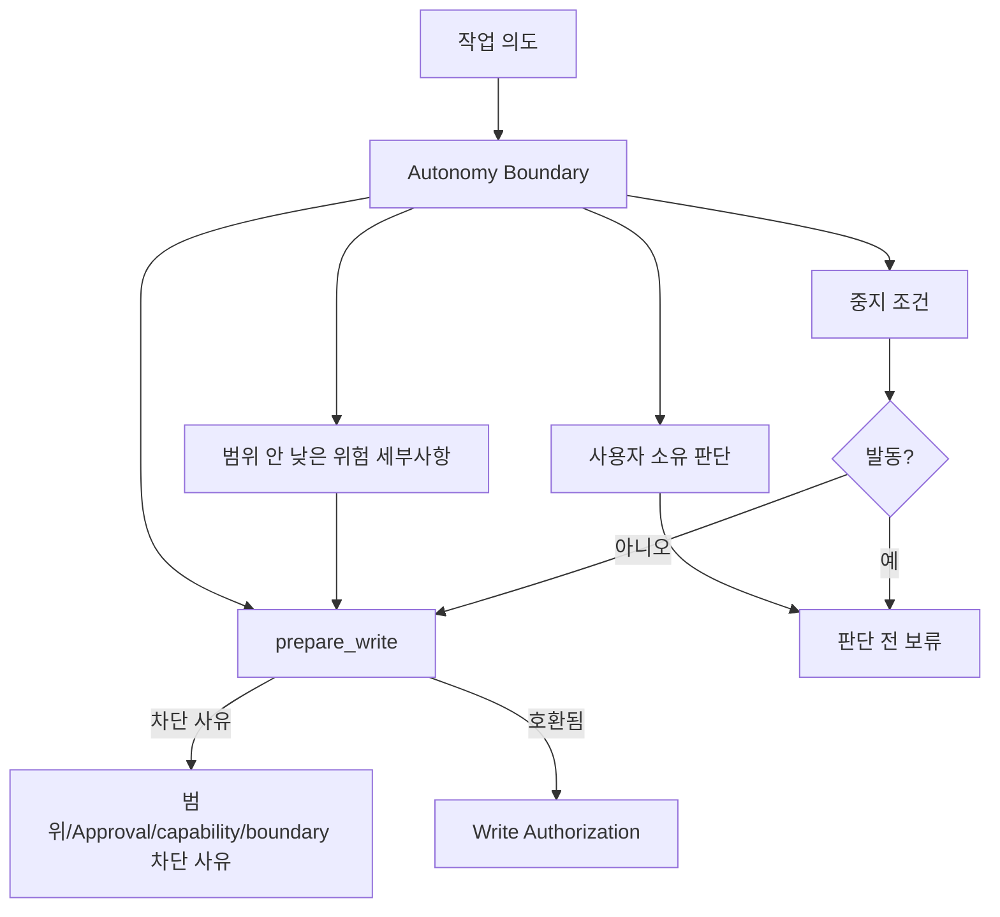
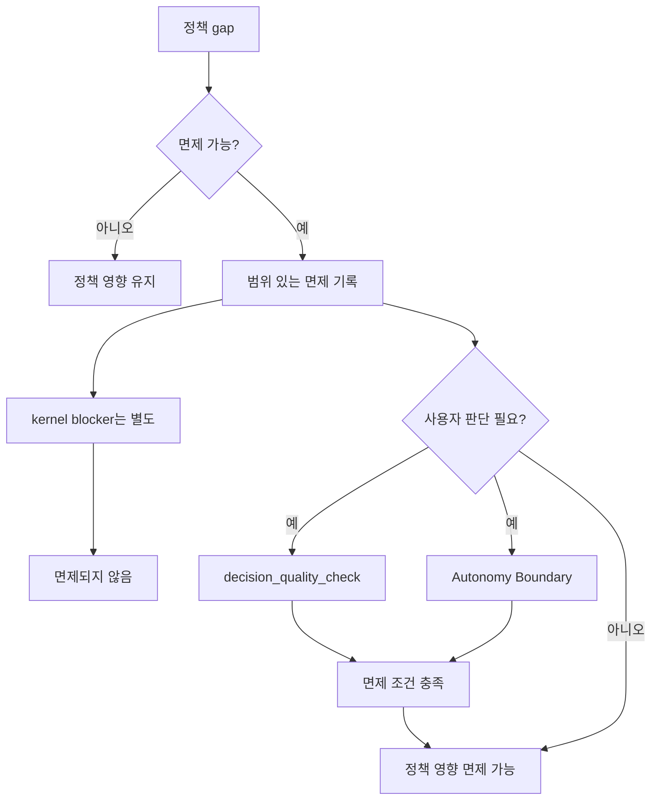

# 설계 품질 정책

## 이 문서가 도와주는 일

이 참조 문서는 설계 품질 정책이 언제 적용되는지, 필요한 기록과 증거가 무엇인지, 결과를 보고하는 안정적인 validator ID가 무엇인지, 그리고 충족되지 않은 요구사항이 쓰기 gate나 close에 어떤 영향을 주는지 확인할 때 사용합니다.

이 정책들은 AI 지원 작업이 제품 설계, 도메인 언어, 모듈 경계, 테스트 규율, 사람의 QA, 맥락 관리와 어긋나지 않도록 돕습니다. 동시에 모든 품질 선호를 커널 불변 규칙으로 승격하지는 않습니다.

이 문서는 향후 Harness 동작을 위한 참조 문서입니다. 현재 저장소 단계와 구현 인계 상태는 [MVP 계획](../build/mvp-plan.md#문서-수락-상태)에 있습니다.

이 문서는 MCP schema, SQLite DDL, 상태 전이 표, runtime/server 동작, 전체 projection template을 정의하지 않습니다.

## 이런 때 읽기

- 작업을 구체화하면서 어떤 설계 품질 기록이 필요한지 확인할 때.
- 설계 품질 validator 결과를 검증하는 conformance fixture를 작성하거나 검토할 때.
- Task가 왜 `design_gate`, `decision_gate`, `qa_gate`의 영향을 받는지 이해해야 할 때.
- 정책 waiver가 허용되는지 판단할 때.
- close blocker, user judgment 필요성, 수동 QA 요구사항, stewardship 발견 사항을 검토할 때.

## 읽기 전에

Lifecycle, gate, close semantics는 [Core Model 참조](core-model.md)를 사용합니다. Public request/response shape와 `ValidatorResult`는 [MVP API](api/mvp-api.md)와 [API Schema Core](api/schema-core.md)를 사용하고, fixture assertion semantics는 [Conformance Fixtures 참조](conformance-fixtures.md#fixture-assertion-semantics)를 사용합니다.

## 핵심 생각

설계 품질 정책은 stewardship, 제품 설계, context quality expectation을 기존 Harness owner path를 통해 보이게 합니다. Finding은 Core blocker, 집중된 사용자 판단 요청, 증거 요청, 잔여 위험 표시, 조언으로 보는 다음 행동, 또는 조치 없음 중 하나로 라우팅할 수 있습니다. 하지만 새 kernel transition, schema, 대체 authority를 만들지는 않습니다.

활성 MVP의 정책 처리는 의도적으로 작습니다. 기본 차단은 범위, 사용자 소유 판단, 증거, 오래된 권한 맥락, 정직한 guarantee 표시를 지키는 조건으로 제한합니다. 더 넓은 정책 catalog는 owner profile이 좁은 동작을 명시적으로 승격하기 전까지 라우팅 후보 또는 조언/나중 항목으로 둡니다.

## 영향 분류와 허용 라우트

모든 설계 품질 finding은 정확히 하나의 영향 분류를 가져야 합니다.

| 영향 분류 | 의미 | 허용 라우트 |
|---|---|---|
| Core blocking | 기존 Core gate, blocker, API error path에 닿기 때문에 write 또는 close를 차단할 수 있는 finding. | `block write`, `block close`, 또는 해당 Core blocker가 보여 주는 focused unblocker action인 `ask one focused user judgment`, `request evidence`, `mark residual risk`. Core gate/blocker/error ref와 다음 행동 하나가 필요합니다. |
| Routed candidate | 집중된 후속 조치 하나가 필요하지만 자동 차단은 아닌 finding. | `ask one focused user judgment`, `request evidence`, `mark residual risk`, `show advisory next action`. |
| Advisory/later | Active MVP 권한 밖의 조언, 나중/profile 후보, catalog 항목. | `show advisory next action` 또는 `no action`. |

모든 finding은 아래 action 중 정확히 하나로 라우팅해야 합니다.

```text
block write | block close | ask one focused user judgment |
request evidence | mark residual risk | show advisory next action | no action
```

차단 하나에는 다음 행동 하나만 있어야 합니다. 정책 finding이 끝없는 review loop, ordinary work 전에 모두 끝내야 하는 checklist, 또는 집중된 판단 요청 하나·증거 요청 하나·잔여 위험 표시 하나·조언 하나로 충분한 상황에서 이어지는 질문 사슬을 만들면 안 됩니다.

### 활성 MVP 차단 집합

활성 MVP에서 설계 품질 finding이 기본적으로 write 또는 close를 차단할 수 있는 조건은 아래뿐입니다.

| 기본 차단 조건 | Core owner path |
|---|---|
| Autonomy Boundary exceeded | 해당 초과가 요청된 operation에 영향을 줄 때 `prepare_write`, `decision_gate`, 또는 close blocker를 통한 `autonomy_boundary_check`. |
| Unresolved user judgment | 집중된 `user_judgment` request/record path를 포함한 `decision_quality_check`와 `decision_gate`. |
| Missing active scope | Core scope gate 또는 `NO_ACTIVE_CHANGE_UNIT` / `SCOPE_REQUIRED` / `SCOPE_VIOLATION`. 설계 정책은 gap을 가리킬 수 있지만 그 소유자는 아닙니다. |
| Missing required evidence | Core `evidence_summary`, `evidence_gate`, `EVIDENCE_INSUFFICIENT`, 또는 artifact availability blocker. |
| Stale context affecting write or close | 오래된 state, baseline, 읽기용 status/projection view, source ref 때문에 scope, evidence, acceptance criteria, close basis를 안전하게 믿을 수 없을 때의 `context_hygiene_check`. |
| Surface capability insufficient for claimed guarantee | Connected surface가 주장한 operation 또는 guarantee level을 지원하지 못할 때 capability boundary, `CAPABILITY_INSUFFICIENT`, 또는 guarantee display. |

그 밖의 finding은 활성 MVP에서 기본적으로 routed candidate 또는 advisory/later입니다. 특히 full domain-language consistency, full module/interface review, full TDD trace, full codebase-stewardship suite, full feedback-loop audit, detailed Manual QA policy, detached verification profile은 MVP write 또는 close를 자동 차단하지 않습니다. 구체적인 owner path가 필요로 할 때만 집중된 판단 요청, 증거 요청, 잔여 위험 표시, 조언으로 이어질 수 있습니다.

## 정책을 쉬운 말로

| 정책 영역 | 쉬운 질문 |
|---|---|
| `shared_design` | 요구사항 구체화(Discovery) 또는 다른 shaping 경로가 사용 가능한 저장소/문서/현재 상태에서 확인 가능한 사실을 먼저 확인하고, 작업 모양을 분류하고, 빠진 정보를 막히는 질문과 참고 질문으로 나누고, 사용자 소유 판단을 식별한 뒤, committed Shared Design record를 요구하지 않고 활성 Task, Change Unit, user judgment 후보/기록 경계로 shaping 결과를 지속했는가? |
| `decision_quality` | 제품, 설계, 기술, 아키텍처, waiver, risk 선택에 user judgment 또는 해당 경로가 활성화된 기존 waiver, residual-risk, QA, acceptance owner path가 필요한가? |
| `autonomy_boundary` | Agent가 혼자 할 수 있는 일과 사용자 판단을 위해 멈춰야 하는 지점은 무엇인가? |
| `vertical_slice` | 작업이 얇은 end-to-end slice로 잡혔는가, 아니면 수평 예외가 기록됐는가? |
| `feedback_loop` | Agent는 쓰기 전후에 변경이 동작하는지 어떻게 확인할 것인가? |
| `tdd_trace` | TDD가 required이거나 가장 알맞은 방식일 때 RED, GREEN, 관련 check 증거가 기록됐는가? |
| `domain_language` | 제품 용어와 코드 용어가 계속 정렬되어 있는가? |
| `deep_module_interface` | 모듈 역할, 공개 interface, 호환성, 호출자 영향이 이해되었는가? |
| `codebase_stewardship` | 로컬 Task 완료가 향후 유지보수성, 테스트 용이성, 도메인 언어, 경계 손상을 숨기고 있지 않은가? |
| `manual_qa` | UX, workflow, copy, accessibility, visual output, product taste를 사람이 직접 봐야 하는가? |
| `context_hygiene` | Agent가 stale chat, old document, full docs dump, over-broad retrieved context 대신 current하고 focused하며 phase-appropriate한 context를 쓰는가? |
| `two_stage_review_display` | Spec compliance와 code stewardship을 새 gate 없이 분리해 보여 주는가? |

## 담당하는 참조 범위

이 문서가 담당합니다.

- 설계 품질 정책 계약
- policy-to-validator mapping
- 안정적인 설계 품질 validator ID
- severity composition 규칙
- 정책 waiver 의미
- 정책이 기대하는 증거
- 정책이 close에 미치는 영향
- two-stage review display와 policy validator 및 owner 기록의 관계
- 설계 품질 정책이 `decision_gate`, `design_gate`, `qa_gate`, 증거 충분성, `prepare_write` blocker, close blocker에 영향을 주는 시점

## 여기서 다루지 않는 것

이 문서는 다음 항목을 담당하지 않습니다.

- kernel lifecycle transition. [Core Model 참조](core-model.md)를 봅니다.
- gate enum 정의. [Core Model 참조](core-model.md)와 [API Schema Core](api/schema-core.md)를 봅니다.
- public MCP request/response schema. [MVP API](api/mvp-api.md)와 [API Schema Core](api/schema-core.md)를 봅니다.
- SQLite DDL 또는 storage layout. [Storage](storage.md)를 봅니다.
- projection template 본문. [Projection과 Template 참조](projection-and-templates.md)와 [Template 참조](templates/README.md)를 봅니다.
- operator command 의미. [운영과 Conformance](operations-and-conformance.md)를 봅니다.
- connector capability profile. [Agent 통합 참조](agent-integration.md)를 봅니다.
- surface recipe. [Surface Cookbook](surface-cookbook.md)을 봅니다.
- 사용자가 읽는 session 절차

## 정책이 커널 불변 규칙이 되지 않고 gate에 영향을 주는 방식

Kernel은 lifecycle, gate transition, close semantics, blocker mechanics, state transition, `prepare_write`, `close_task`를 담당합니다.

설계 품질 정책은 kernel 위에 놓이는 정책 계약입니다. 이 정책은 언제 `decision_gate`, `design_gate`, 증거 충분성, `prepare_write` blocker, close blocker에 영향을 줄 수 있는지 설명합니다. Later profile은 정책을 `qa_gate`나 더 풍부한 assurance gate에 연결할 수 있습니다. 하지만 새 kernel transition, 새 기준 정보, scope, sensitive-action Approval, 증거, 검증, 최종 수락, 잔여 위험 rule의 대체물을 만들지는 않습니다.

권한 경로는 구분해서 유지합니다. 제품 판단과 기술 판단이 진행, write, waiver, 최종 수락, close를 막으면 사용자 판단 요청으로 라우팅합니다. Policy validator는 설계 품질 finding, 영향 분류, 라우팅 action 하나를 보고합니다. State change, product write, 최종 수락, 잔여 위험 수락, close가 진행될 수 있는지는 여전히 kernel authority가 결정합니다.

정책 waiver도 제한적입니다. 정책 계약이 허용하는 경우에만 설계 품질 요구사항을 충족한 것으로 볼 수 있습니다. product write 범위, sensitive-action Approval, 필요한 증거 범위, 필수 최종 수락, verification 독립성을 대신 면제하지 않습니다.

### 닫기 지원 범주 경계

설계 품질 정책은 finding, 증거 필요성, 잔여 위험 후보, 사용자 판단 필요성, 조언으로 보는 다음 행동, 그리고 Core owner path가 뒷받침하는 close blocker를 만들 수 있습니다. Later profile은 상세 QA 또는 검증 요구를 추가할 수 있습니다. 각 범주는 자기 owner path에 남습니다. 증거, 검증, 수동 QA, 최종 수락, 잔여 위험의 정확한 대체 불가능성 계약은 [Core Model 참조: 증거, 검증, 수동 QA, 최종 수락, 위험](core-model.md#증거-검증-수동-qa-최종-수락-위험)이 담당합니다.

정책 작성자의 local rule은 간단합니다. 영향 분류를 고르고, 라우팅 action을 정확히 하나 고른 뒤, finding을 기존 owner record나 blocker로 보냅니다. 정확한 닫기 지원 경계가 필요하면 kernel rule로 연결합니다. 테스트 통과, QA waiver, 최종 수락, 잔여 위험 수락은 각 owner path를 통해서만 정책 결과에 영향을 줄 수 있으며, 정책 prose가 하나를 다른 하나의 대체물로 취급하면 안 됩니다.

## Two-stage review model

Review guidance는 agent와 user가 "요청한 것을 만들었는가?"와 "구현이 유지보수 가능한가?"를 분리해 볼 수 있도록 두 stage로 표시됩니다. 이 stage는 관리되는 절차와 표시 방식일 뿐이며, 새 kernel gate, schema, 기준 기록, `ProjectionKind` value, Approval, 증거, 검증, 수동 QA, 최종 수락, 잔여 위험 수락, close, Write Authorization을 만들지 않습니다.

| Stage | Question | Typical coverage |
|---|---|---|
| Spec Compliance Review | 현재 Harness 권한 안에서 요청된 Task를 만족했는가? | 수용 기준 충족 범위, Change Unit 완료 조건, scope 및 Write Authority 호환성, user judgment 호환성, 증거 범위, Residual Risk 표시. |
| Code Quality / Stewardship Review | 이 implementation이 codebase 안에서 유지보수하기 좋은가? | Domain language, module/interface boundary, vertical slice shape, feedback loop 또는 TDD trace, codebase stewardship, context hygiene, follow-up risk. |

Review 단계에서는 validator 결과, 증거 공백, user judgment 후보, Change Unit 업데이트 추천안, Eval 또는 검증 필요, 수동 QA 필요, Residual Risk 후보, 민감 동작 승인 필요, 해당 profile이 active일 때 later Approval 필요, close blocker, follow-up work를 요약할 수 있습니다. Role Lens 또는 recommended playbook 라벨은 이 검토 관점을 고를 수 있지만 또 다른 권한 경로를 만들지는 않습니다. Review display 자체는 증거, 수동 QA, 검증, 최종 수락, 잔여 위험 표시, 잔여 위험 수락, 민감 동작 승인 / Approval, scope, close, Write Authorization을 충족하지 않으며, underlying owner path 없이 close를 직접 차단하지도 않습니다.

Same-session review는 분리 검증이 아닙니다. 통과한 two-stage review는 `self_checked` confidence를 뒷받침하고 finding을 기존 state path로 연결할 수 있지만 `assurance_level=detached_verified`를 만들면 안 됩니다. 분리 검증에는 여전히 valid independence boundary와 Eval path가 필요합니다.

## Finding 라우팅

Run, Eval record, 수동 QA, design-quality validator, 같은 세션 review display, operator diagnostic, conformance example에서 나온 finding은 chat이나 report prose 안에서 사라지면 안 됩니다. Finding이 close-relevant해지는 것은 기존 owner path를 통할 때뿐입니다. 예를 들어 Core evidence summary 또는 active일 때 Evidence Manifest coverage, user judgment candidate 또는 record, Change Unit scope/completion/Autonomy Boundary update, Residual Risk candidate 또는 record, structured close blocker, reconcile item, 또는 owner 문서가 이미 정의한 follow-up Task/Change Unit이 그 경로입니다. Feedback Loop, TDD Trace, Manual QA, Eval, Journey, full stewardship route는 active owner profile이 명시적으로 켜기 전까지 later/profile입니다.

이 section은 finding schema, DDL table, gate, validator ID, authority path를 만들지 않습니다. Policy finding을 [Core Model 참조](core-model.md), [MVP API](api/mvp-api.md), [API Schema Core](api/schema-core.md), [Storage](storage.md), [Projection과 Template 참조](projection-and-templates.md), [운영과 Conformance 참조](operations-and-conformance.md)가 소유하는 기존 기록으로 되돌리는 방법을 이름 붙입니다.

| Finding source | 기존 owner path로 라우팅 |
|---|---|
| Run 또는 selected feedback-loop execution | Log/artifact를 Run과 evidence summary path에 붙입니다. Active MVP에서는 failed 또는 missing check를 `request evidence`, `mark residual risk`, `show advisory next action`, 또는 required evidence가 빠진 경우 Core evidence blocker로 라우팅합니다. Full Feedback Loop execution/audit routing은 enabled 전까지 later/profile입니다. |
| Eval 또는 verification review | Active MVP에서는 same-session review나 optional verification을 required evidence 또는 user-requested verification route가 active인 경우를 제외하고 self-check/advisory로 다룹니다. Detached verification, Eval independence, verification-gate blocker는 enabled 전까지 later/profile입니다. |
| 수동 QA | Active MVP에서는 human-inspection concern을 `show advisory next action`, `request evidence`, QA waiver/risk choice에 대한 `ask one focused user judgment`, 또는 `mark residual risk`로 라우팅합니다. Detailed Manual QA record와 자동 `qa_gate` close blocker는 enabled되었거나 active owner path가 명시적으로 요구하기 전까지 later/profile입니다. |
| Design-quality 또는 stewardship review | Validator result와 owner ref를 기록합니다. 각 finding은 허용 action 하나로만 라우팅합니다. Active MVP는 위 여섯 가지 차단 조건에만 block합니다. Full domain-language, module/interface, TDD, feedback-loop, codebase-stewardship, review-display finding은 기본적으로 routed candidate 또는 advisory/later입니다. |
| Operator 또는 conformance finding | Runtime finding은 existing state, event, artifact, projection freshness, error, reconcile/recover path로 라우팅합니다. docs-maintenance finding은 별도의 read-only report label을 사용하고 runtime effect `none`을 유지하며 runtime conformance assertion이 되지 않습니다. |

## 정책 계약 형태

각 policy는 동일한 field를 사용합니다.

| Field | Meaning |
|---|---|
| `name` | Stable policy name. |
| `applies_when` | Policy가 관련되는 조건. |
| `default_requirement` | 적용될 때 기본적으로 일어나야 하는 것. |
| `allowed_waiver` | 누가 waiver를 적용할 수 있고 무엇을 기록해야 하는지. |
| `required_record` | 결과를 저장하는 활성 owner record, 후보 경계, 또는 later/profile record family. Policy는 owning profile이 active가 아닌 한 활성 MVP에서 later/profile record를 요구하면 안 됩니다. |
| `validator` | compliance, warning, failure, blocker를 보고하는 validator. |
| `evidence` | Policy가 기대하는 증거 또는 projection ref. |
| `close_impact` | 충족되지 않은 요구사항이 close 또는 gate에 미치는 영향. |

Policy validator는 [API Schema Core](api/schema-core.md#validatorresult)가 담당하는 `ValidatorResult` schema와 [API Schema Later](../later/index.md#later-schema-candidates)가 담당하는 later-profile stable ID set에 맞춰 결과를 반환합니다.

Policy validator finding은 [영향 분류와 허용 라우트](#영향-분류와-허용-라우트)의 영향 분류와 routed action도 담거나 파생해야 합니다. 정책 계약이 가능한 close impact를 설명할 수는 있지만, 활성 MVP 차단에는 [활성 MVP 차단 집합](#활성-mvp-차단-집합)의 조건과 Core owner path가 필요합니다.

위 표가 field 이름의 기준입니다. Field 순서는 적용 조건에서 요구사항, waiver, 기록, validator, 증거, close 영향까지 훑어보기 쉽게 정리한 것입니다.

Policy contract가 later/profile record, projection, full artifact를 이름 붙이면 그 이름은 조건부입니다. 활성 MVP record는 활성 schema와 storage owner가 허용하는 값으로 제한됩니다. 특히 활성 MVP에서 `shared_design`은 policy 이름이지 accepted `StateRecordRef.record_kind` value, committed `shared_designs` row, 필수 projection, full design artifact가 아닙니다.

## 정책 계약

<a id="shared-design-shared_design"></a>

### Shared Design (`shared_design`)

`shared_design`은 요구사항 구체화를 위한 design-quality policy 이름입니다. 활성 MVP-1에서는 committed Shared Design record, accepted `StateRecordRef.record_kind` value, active storage table, projection, full design artifact가 아닙니다. `Discovery`는 이 구체화 자세의 안정적인 내부 이름이지 사용자가 외워야 하는 명령어가 아닙니다. 구체화가 필요할 때 사용하는 것이며 모든 작업에 필요한 의식이 아닙니다.

활성 MVP의 기준 경계는 다음과 같습니다.

- Task는 original user request, current goal summary, confirmed facts, remaining uncertainties, 아직 사용자 판단으로 열리지 않은 blocking question 또는 blocker summary, next safe action을 저장합니다.
- Change Unit은 proposed 또는 active work boundary를 저장합니다. 여기에는 scope summary, non-goals, success criteria, affected area 또는 affected path candidate, allowed/denied paths, sensitive categories, completion conditions, 필요한 경우 Autonomy Boundary가 포함됩니다.
- `UserJudgmentCandidate`와 `user_judgment`는 사용자만 판단할 수 있는 선택을 저장합니다. 제품, 기술, 범위, 민감 동작, QA waiver, verification-risk, final-acceptance, residual-risk, cancellation judgment가 여기에 속합니다.

Discovery Brief, Question Queue, Assumption Register, First Safe Change Unit Candidate, Shared Design projection, full Decision Packet, full design artifact는 활성 MVP에서 support 또는 display 이름입니다. Active owner record에서 렌더링될 수 있고 later/profile material로 쓰일 수 있지만, owner profile이 명시적으로 켜기 전에는 별도 active MVP committed record가 아닙니다. First Safe Change Unit Candidate는 제품 쓰기가 가까워졌을 때 proposed Change Unit update로 표현됩니다. Standalone record가 아닙니다.

흐름은 사용자 요청 보존, 저장소·문서·현재 하네스 상태에서 확인 가능한 사실 확인, 작업 모양 분류, 빠진 정보 식별, 막히는 질문과 참고 질문 분리, 사용자 소유 판단 식별, 사용자 판단이 필요할 때 선택지·결과·불확실성·추천 제시, 다음 안전한 행동 또는 candidate Change Unit 제안입니다. 확인된 사실과 사용자 소유 판단을 분리하고, 목표, 비목표, 성공 기준, 중요한 판단 후보가 충분히 분명하며, 해소되지 않은 사용자 소유 판단을 숨기지 않은 채 안전한 다음 작업, 더 작은 범위, 또는 작업 분할을 제안할 수 있고, 남은 불확실성이 명시되면 shaping을 잠시 멈추거나 진행할 수 있습니다. 요구사항 구체화는 approval, sensitive-action Approval, Write Authorization, evidence, verification, QA, 최종 수락, 잔여 위험 수락, close, scope authority, 새 authority path가 아닙니다.

Tiny direct profile은 edit가 typo, 문서 한 문장, obvious rename이고 meaning, product, technical, security, privacy, public-interface, UX workflow, sensitive-category judgment가 없을 때만 Shared Design threshold 아래에 있습니다. Tiny direct도 여전히 `mode=direct`이며 scope, Approval, evidence, security boundary를 면제하지 않습니다.

이럴 때 사용합니다:

- 요청이 모호하거나 안전한 다음 작업이 분명하지 않을 때.
- 범위, 범위 밖 항목, 수용 기준, 사용자 가치 정렬이 필요할 때.
- 영향받는 제품 영역, 사용자 화면/흐름, 모듈, interface, 민감 카테고리(sensitive categories), 검증 기대 수준, 수동 QA 기대 수준, 사용자가 소유하는 제품 또는 중요한 기술 절충 판단, 알려진 제품·구현·검증·QA·후속 위험을 쓰기 전에 구체화해야 할 때.
- 공개 interface, schema, auth, UX, workflow가 바뀔 수 있을 때.
- `work` task를 구현 전에 구체화해야 할 때.

예시: 사용자가 "새 workspace owner의 onboarding을 더 좋게 만들고 싶어. 먼저 지금 있는 걸 살펴보고, 제품 선택과 확인 가능한 사실을 나눈 뒤, 저장소에서 답할 수 없는 질문만 해줘"라고 요청하면, 쓰기 전에 목표, 사용자 가치, 비목표, 성공 기준, repo/docs/state에서 확인한 확인 가능한 사실, inline checklist와 modal setup prompt 같은 사용자 소유 제품 선택, flow에 대한 QA 기대 수준, 기각한 선택지, 남은 불확실성, 안전한 다음 행동을 Task, proposed Change Unit, user judgment 후보 경계로 지속합니다.

예시: 사용자가 "로그인 방식을 바꾸고 싶은데 session, magic link, OAuth/OIDC 중 무엇이 맞는지 모르겠어. 먼저 현재 auth 구조를 살펴줘"라고 요청하면, 쓰기 전에 기존 user/session/auth 문서와 코드를 확인한 뒤 local email/password session, magic link, OAuth/OIDC, account enumeration, redaction, rate limit, session lifetime 같은 사용자 소유 기술 판단, verification과 수동 QA 기대 수준, 남은 불확실성, proposed Change Unit 또는 작업 분할을 분리합니다.

`안전한 다음 작업 후보`, `작업 분할 제안`, First Safe Change Unit Candidate 같은 표현은 proposal/support phrase입니다. Standalone schema, canonical record type, gate value, projection kind, storage row, authority path가 아닙니다.

요구사항 구체화는 active owner record를 통해 shared understanding을 기록합니다. Broad approval, sensitive-action Approval, 최종 수락, 잔여 위험 수락, QA judgment, Write Authorization이 아닙니다. 사용자 판단이 필요한 선택을 드러낼 수 있고 `design_gate` 준비 상태를 뒷받침할 수 있지만, 그 자체로 사용자 소유 판단을 해결하지는 않습니다.

| Field | Contract |
|---|---|
| `name` | `shared_design` |
| `applies_when` | 작업 요청이 모호하거나, 범위와 범위 밖 항목이 분명하지 않거나, 사용자 가치 정렬이 필요하거나, 영향받는 제품 영역, 사용자 화면/흐름, 모듈, interface, 민감 카테고리(sensitive categories), 검증 또는 수동 QA 기대 수준, 사용자가 소유하는 제품 또는 중요한 기술 절충 판단, 알려진 제품·구현·검증·QA·운영·후속 위험을 구체화해야 하거나, 공개 interface, schema, auth, security, privacy, UX, workflow가 영향을 받거나, `work` task를 구체화해야 할 때. 그 신호 중 하나라도 나타나면 Tiny direct는 tiny path를 떠나야 합니다. 작업이 여전히 좁지만 tiny changed-path/self-check note를 넘는 증거가 필요하면 일반 Direct로 상향할 수 있습니다. 사용자 소유 판단, 민감 category, security/privacy, public interface/API impact, UX workflow, schema, multi-step delivery가 나타나면 Work로 라우팅하고, 필요하면 요구사항 구체화를 사용해야 합니다. Later/profile owner가 켜졌을 때만 그 support를 Shared Design으로 기록할 수 있습니다. |
| `default_requirement` | 활성 shaping owner path를 사용합니다. Task에는 original user request와 current goal summary를 보존하고, confirmed facts, remaining uncertainties, blocking question이 있을 때 그 질문, next safe action을 기록합니다. Proposed 또는 active Change Unit에는 scope summary, non-goals, success criteria, 영향받는 제품 영역, 사용자 화면/흐름, 모듈, interface, affected path candidates, allowed/denied paths, sensitive categories, completion conditions, 필요한 경우 Autonomy Boundary를 기록합니다. 사용자만 판단할 수 있는 항목은 `UserJudgmentCandidate`로 내보내거나 `user_judgment`로 요청/기록합니다. 여기에는 분리된 제품 판단 후보, 보안/개인정보 고려사항이 필요한 기술 판단 후보, QA와 verification 기대 수준, scope decision, waiver, final acceptance, residual-risk acceptance, cancellation이 포함됩니다. 사용자에게 묻기 전에는 agent가 안전하게 직접 확인할 수 있는 사실을 사용 가능한 최신 저장소, 코드베이스, 문서, Harness state에서 먼저 봅니다. 소스가 없거나 오래됐으면 현재 사실로 삼지 말고 그 불확실성을 기록합니다. 열린 항목은 확인 가능한 사실, 막히는 질문, 참고 질문으로 분류합니다. Current codebase, docs, Harness state, safe inspection으로 답할 수 없는 사용자 소유 판단만 사용자에게 묻습니다. 구체화는 긴 질문지가 아니라 judgment area별 targeted question으로 진행하며, 보통 가장 큰 막히는 질문부터 시작합니다. 각 사용자 소유 판단 prompt에는 `presentation`에 맞는 options 또는 chosen outcome을 포함하고, trade-off prompt에는 추천안, 불확실성, deferral consequence, 즉 미뤄졌을 때 계속할 수 있는 일 또는 판단 전에는 진행하면 안 되는 이유를 포함해야 합니다. Agent가 둔 가정은 사용자 판단이 필요한 선택, 민감 동작 승인, QA 판단, 최종 수락, 잔여 위험 수락, 공개 약속과 분리합니다. Confirmed facts와 사용자 소유 판단이 분리되고, 목표, 비목표, 성공 기준, 중요한 판단 후보가 충분히 분명하며, 남은 불확실성이 명시되고, 해소되지 않은 사용자 판단을 숨기지 않은 채 안전한 다음 작업, candidate Change Unit, 더 작은 범위, 또는 작업 분할을 제안할 만큼 scoped information이 생기기 전에는 구현 계획을 굳히지 않습니다. |
| `allowed_waiver` | User/operator가 reason과, design risk가 남는 경우 follow-up을 기록하면 tiny direct 또는 작고 명확한 `direct` work, docs-only edit, emergency fix에 허용된다. 이 waiver는 사용자 소유 판단, sensitive-action Approval, security/privacy boundary, close-relevant 잔여 위험을 우회하지 않습니다. |
| `required_record` | 활성 MVP: Task shaping field, proposed 또는 active Change Unit field, commit 전 `UserJudgmentCandidate` draft, 요청/기록 후 `user_judgment` record. 같은 concern을 담아야 할 때만 active owner path인 `blocker`, `evidence_summary`, artifact ref를 사용합니다. Later/profile only: owner profile이 명시적으로 켜졌을 때 committed Shared Design record, `DESIGN` projection, full design artifact, full-format Decision Packet. Discovery Brief, Question Queue, Assumption Register, First Safe Change Unit Candidate, Shared Design projection, full Decision Packet, full design artifact는 별도 active MVP required record가 아닙니다. |
| `validator` | `shared_design_alignment` |
| `evidence` | Task ref, Change Unit ref, user judgment ref, success criteria, 기각한 선택지 ref, 제품 영역, 사용자 화면/흐름, 모듈, interface, affected-path, 민감 카테고리(sensitive category) 메모, 검증 또는 수동 QA 기대 수준 ref, 위험 메모, 위험 후보, 필요한 경우 residual-risk ref, domain/module/interface impact ref. Later/profile Shared Design ref는 해당 profile이 active일 때만 나타날 수 있습니다. Discovery Brief, Question Queue, Assumption Register, First Safe Change Unit Candidate, Shared Design projection, full Decision Packet, full design artifact는 shaping support, display, 또는 later/profile material로 남으며, 그 자체만으로 활성 `evidence_summary`, later Evidence Manifest, close 증거를 충족하지 않습니다. |
| `close_impact` | 활성 MVP 기본값: routed candidate. 필요한 shaping support가 없으면 조언으로 보는 다음 행동 하나를 보여 주거나, 집중된 사용자 판단 하나를 묻거나, 증거 요청을 합니다. 이 gap이 missing active scope, unresolved user judgment, missing required evidence, stale context affecting write/close, surface capability insufficient for claimed guarantee 중 하나에도 해당할 때만 write 또는 close를 차단할 수 있습니다. Valid waiver는 policy-owned impact에 대해서만 `design_gate=waived`를 허용할 수 있습니다. |

### Decision Quality (`decision_quality`)

이럴 때 사용합니다:

- 선택이 사용자가 소유하는 제품 방향, 비용·호환성·보안·유지보수·migration·interface·dependency·위험 영향이 큰 기술 구조 방향, scope, 아키텍처, schema/data model, public API, module boundary, compatibility를 바꿀 때.
- Domain-language conflict가 제품 의미, public documentation, caller expectation, 수용 기준, API naming, module responsibility를 바꿀 때.
- Waiver가 QA 면제 판단 또는 검증 위험 수락 risk를 포함한 알려진 위험을 수락할 때.
- 수평 예외가 design, technical, 또는 architecture choice일 때.
- Agent 추천안은 있지만 판단은 user가 소유할 때.

예시: Breaking API change가 더 단순해 보이면, compact context만으로 충분하지 않을 때 `judgment_kind=technical_decision`, `presentation=full`을 사용합니다. 실행 전에 선택지, 장단점, 호환성 위험, 추천안, user judgment를 기록합니다.

재사용 가능한 user judgment 예시:

- `judgment_kind=product_decision`, `presentation=full`: 로그인 실패 피드백을 inline message, toast, modal/layer 중에서 고릅니다. 사용자 흐름, 방해 정도, 접근성, 문구, 제품 위험의 trade-off를 기록합니다.
- `judgment_kind=product_decision`, `presentation=full`: 비어 있는 화면이 바로 설정을 유도할지, 데이터가 생길 때까지 조용히 둘지처럼 경험의 product taste가 달라지는 선택입니다. 제품 의도, 사용자군, 명확성, 방해 정도, 수동 QA 필요성, 추천안, 불확실성, 판단을 미뤘을 때 계속할 수 있는 일 또는 판단 전에는 진행하면 안 되는 이유를 기록합니다.
- `judgment_kind=technical_decision`, `presentation=full`: session auth, token auth, social login 중에서 고릅니다. 폐기 가능성, CSRF/XSS 노출, client 호환성, 운영 복잡도, migration 경로, 추천안이 Task에 맞는 이유를 기록합니다.
- `judgment_kind=technical_decision`, `presentation=full`: dependency addition, schema migration, public API/interface change, module boundary change입니다. 대안, 영향 범위, 호환성, rollback 또는 migration 비용, test boundary, 향후 유지보수 비용, 추천안, 결정을 미룰 때의 영향을 기록합니다.
- `judgment_kind=product_decision` 또는 `technical_decision`, `presentation=full`: product copy, API name, storage-facing code에서 "Account"와 "Profile"처럼 domain language가 충돌하는 경우입니다. User-facing meaning, code impact, compatibility 또는 migration 비용, documentation promise, 추천안, 결정을 미룰 때의 영향을 기록합니다.
- `judgment_kind=scope_decision`, `presentation=full`: 범위 확장, 비목표 제거, Change Unit 경계 변경, Autonomy Boundary 변경입니다. 무엇이 범위에 들어오고 무엇이 계속 범위 밖인지, prior broad approval로 추론할 수 없는 이유, 영향을 받는 write 또는 close path를 기록합니다.
- `judgment_kind=sensitive_approval`, `presentation=full`: auth, 승인, secret, data-export 작업입니다. Approval boundary는 민감한 단계를 승인할 수 있지만, 역할, exported fields, redaction, audit logging, retention, rollback, user notice가 아직 결정되지 않았다면 제품, 기술, 범위, 보안, QA, 검증, 최종 수락, 잔여 위험 판단에는 별도의 compatible user judgment가 필요합니다.
- `judgment_kind=qa_waiver`, `presentation=full`: policy가 허용하는 수동 QA 생략입니다. 무엇을 확인하지 않았는지, 왜 waiver가 허용되는지, 보이는 risk path, 이 waiver가 QA 증거나 QA pass를 만들지 않는 이유를 기록합니다.
- `judgment_kind=verification_risk_acceptance`, `presentation=full`: 필요한 검증이 면제되거나 사용할 수 없습니다. 어떤 검증이 빠졌는지, 사용자가 수락하는 위험, 결과를 `detached_verified`로 보여주면 안 되는 이유, 가장 작은 신뢰 가능한 follow-up을 기록합니다.
- `judgment_kind=final_acceptance`, `presentation=full`: close basis가 보인 뒤 결과를 최종 수락할지 묻습니다. 증거, 검증, QA, scope, 민감 동작 승인, 잔여 위험 표시 상태를 보여주고, 최종 수락이 빠진 증거, QA, 검증, scope, 잔여 위험 수락을 대신하지 않는다는 경계를 기록합니다.
- `judgment_kind=residual_risk_acceptance`, `presentation=full`: 알려진 잔여 위험을 두고 close합니다. 사용자에게 보인 한계, 이미 있는 증거, close를 진행할 수 있는 이유, 사용자에게 보인 residual-risk ref, follow-up을 기록합니다.

`secret_access`, `data_export`, `policy_override` 같은 Sensitive category label은 Approval 필요성을 식별합니다. 그 label만으로 user judgment type이 정해지거나 사용자 소유 판단이 해결되지는 않습니다. Category 예시는 [API Schema Core](api/schema-core.md#sensitive-categories)가 담당합니다.

| Field | Contract |
|---|---|
| `name` | `decision_quality` |
| `applies_when` | Design choice, 사용자 소유의 제품 장단점 판단, product taste 판단, 기술 선택, 제품 의미, public documentation, caller expectation, 수용 기준, API naming, module responsibility에 영향을 주는 domain-language conflict, 수동 QA 필요 여부가 사용자 소유의 제품·UX·접근성·릴리스 위험·product taste 판단에 달린 경우, 수동 QA waiver 선택, 범위 확장, durable impact가 있는 dependency addition, schema/data-model migration, public API/interface change, module boundary change, architecture choice, 수평 예외, verification 면제, QA 면제, 알려진 위험이 있는 최종 수락 또는 잔여 위험 수락이 있을 때. |
| `default_requirement` | Judgment가 실제 행동으로 이어지기 전에 user judgment를 기록한다. Trivial bounded choice에는 `presentation=short`를 사용하고, 복잡하거나 위험이 큰 판단에는 `presentation=full`을 사용해 context, 검토한 선택지, 장단점, 추천안, uncertainty, reversibility, evidence ref, 판단을 미룰 때의 결과, 잔여 위험을 기록한다. Agent 추천안과 사용자 판단 또는 잔여 위험 수락을 분리해 둔다. `judgment_kind=sensitive_approval`에서는 sensitive-action scope와 boundary가 명확한지 평가하고, 민감 동작 승인 맥락을 제품, 기술, 범위, 보안, 수동 QA, 검증, 최종 수락, residual-risk 판단의 해결로 취급하지 않는다. |
| `allowed_waiver` | Tiny direct edit를 포함해 공개 interface, 제품, 중요한 기술, 아키텍처, 유지보수, verification, QA, sensitive-category, security/privacy, 알려진 위험 impact가 없고 사소하며 되돌리기 쉬운 선택에만 허용된다. Waiver에는 user judgment가 judgment를 개선하지 않는 이유를 기록해야 한다. |
| `required_record` | User judgment 기록과 렌더링될 때 선택적 full-format `DEC` projection. |
| `validator` | `decision_quality_check` |
| `evidence` | User judgment ref, option ref, 활성 evidence summary ref, 해당 profile이 active일 때만 later Evidence Manifest ref, risk/waiver ref, 잔여 위험 수락이 포함될 때 residual-risk state ref, 사용자 판단이 필요할 때 final-acceptance ref. |
| `close_impact` | 활성 MVP 기본값: unresolved user judgment, 현재 operation에 영향을 주는 invalid deferral, 또는 필요한 residual-risk acceptance가 missing인 경우에만 Core blocking입니다. User judgment owner path를 통해 `decision_gate=required`, `pending`, 또는 `blocked`로 설정하거나 유지합니다. 차단하지 않는 decision-quality concern은 집중된 사용자 판단 하나를 묻거나 조언으로 보는 다음 행동 하나를 보여 줍니다. 유효하게 기록된 최종 수락은 final-acceptance route에 대해서만 close를 허용할 수 있으며, 잔여 위험 수락을 대신하지 않습니다. |

<a id="autonomy-boundary-autonomy_boundary"></a>

### Autonomy Boundary (`autonomy_boundary`)

이럴 때 사용합니다:

- Agent는 포괄된 구현 세부사항을 진행할 수 있지만 사용자 소유의 제품 판단 또는 기술 판단에서는 멈춰야 할 때.
- Task에 ambiguous authority, user constraint, sensitive action, external side effect, irreversible edit가 있을 때.
- 범위 확장, 공개 약속, 알려진 중지 조건이 나타날 수 있을 때.
- Active Change Unit에 "agent may do"와 "ask first" boundary가 필요할 때.

예시: Agent는 scope 안에서 local helper 이름을 리팩터링할 수 있지만 public CLI flag contract를 바꾸거나 user 대신 risk를 수락하기 전에는 멈춰야 합니다.

| Field | Contract |
|---|---|
| `name` | `autonomy_boundary` |
| `applies_when` | Agent가 authority가 모호하거나, user constraint, external side effect, irreversible edit, 범위 확장, sensitive action, 사용자 소유의 제품 판단 또는 기술 판단, public API/module contract 약속, 중요한 dependency 또는 migration 방향, security 또는 privacy trade-off, 잔여 위험 수락, 알려진 중지 조건이 있는 작업을 shaping하거나 실행할 때. |
| `default_requirement` | Agent가 user input 없이 할 수 있는 것, 사용자 판단이 필요한 것, 중지 조건을 기록한다. 기준 경계는 active Change Unit에 둔다. Active Change Unit이 아직 없으면 Task shaping field 또는 proposed Change Unit이 candidate boundary를 가질 수 있다. 경계는 low-risk 구현 세부사항에서는 agent가 진행하게 하되, 사용자 소유 제품 방향, 기술 구조 방향, 잔여 위험 수락, public interface/module 약속, 중요한 dependency/migration 방향, security 또는 privacy trade-off, 사람의 판단이 필요한 정책 waiver에서는 멈추게 해야 한다. Autonomy Boundary는 scope grant가 아니며 active Change Unit 밖의 path, tool, command, network, secret, sensitive category를 승인하지 않는다. |
| `allowed_waiver` | 요청에서 authority가 명확하고 중지 조건이 현실적으로 발생할 수 없는 tiny direct 또는 좁은 `direct` work에 허용된다. Waiver에는 autonomy boundary가 필요 없는 이유를 기록해야 하며, scope expansion, sensitive action, security/privacy trade-off, 사용자 소유 판단을 덮어서는 안 된다. |
| `required_record` | Active Change Unit의 기준 Autonomy Boundary record, active Change Unit이 생기기 전 Task shaping field 또는 proposed Change Unit boundary, 사용자 판단 item에 대한 user judgment record, trigger된 stop-condition ref. Later/profile Shared Design ref는 해당 profile이 켜졌을 때만 이 support를 담을 수 있습니다. |
| `validator` | `autonomy_boundary_check` |
| `evidence` | User request ref, task constraint, policy ref, user judgment ref, stop-condition event, user response ref. |
| `close_impact` | 활성 MVP 기본값: intended operation이 write 또는 close를 위한 Autonomy Boundary를 넘을 때 Core blocking입니다. `prepare_write`에서 발생한 중지 조건 또는 경계 공백은 affected write를 차단하고 다음 행동 하나로 라우팅합니다. 예: scope를 줄이기, 집중된 사용자 판단 요청, 증거 요청, 잔여 위험 표시. Scope, sensitive-action Approval, capability gap은 각자의 blocker로 남습니다. |

Autonomy Boundary 요약: 이 경계는 scope 안의 낮은 위험 구현 재량과 사용자 소유 판단, 중지 조건, `prepare_write` blocker를 나눕니다. 그 자체로 쓰기 전 범위 확인이나 쓰기 승인 기록을 주지는 않습니다.



### Vertical Slice (`vertical_slice`)

이럴 때 사용합니다:

- Task가 feature, user-visible behavior, workflow, integration path를 추가하거나 바꿀 때.
- Medium/large `work` task에 작은 end-to-end delivery shape가 필요할 때.
- Horizontal enabling slice가 제안되어 기록된 예외가 필요할 때.
- Follow-up vertical risk를 보이게 남겨야 할 때.

예시: Notification feature에서는 UI가 작더라도 trigger에서 domain logic, persistence, observable output, test evidence까지 이어지는 slice를 선호합니다.

| Field | Contract |
|---|---|
| `name` | `vertical_slice` |
| `applies_when` | Feature work, user-visible behavior, workflow change, integration behavior, medium/large `work` task. |
| `default_requirement` | Trigger/input, domain logic, persistence 또는 state, API/caller boundary, observable output, test evidence, optional 수동 QA를 연결하는 thin end-to-end Change Unit을 선호한다. |
| `allowed_waiver` | Scaffold, test harness, deep module boundary, migration safety, 공개 interface decision이 먼저 필요할 때 horizontal/enabling Change Unit을 허용한다. Change Unit은 `horizontal_exception_reason`을 기록하고, exception이 design 또는 architecture choice라면 user judgment를 연결하며, 아직 의미 있는 end-to-end path가 없다는 이유가 기록되지 않는 한 follow-up vertical Change Unit을 기록해야 한다. |
| `required_record` | Change Unit field: `slice_type`, end-to-end path, completion condition, follow-up vertical Change Unit, validator 결과. |
| `validator` | `vertical_slice_shape` |
| `evidence` | Change Unit record, run summary, 활성 evidence summary ref, test, 해당 owner path가 active일 때만 later Manual QA ref. |
| `close_impact` | 활성 MVP 기본값: routed candidate 또는 advisory/later. Vertical slice shape가 없으면 조언으로 보는 다음 행동을 보여 주거나 잔여 위험을 표시합니다. 자동으로 write 또는 close를 차단하지 않습니다. Missing active scope, unresolved user judgment, missing required evidence, 또는 active close path가 visibility/acceptance를 요구하는 close-relevant residual risk를 드러낼 때만 Core blocking이 됩니다. |

### Feedback Loop (`feedback_loop`)

이럴 때 사용합니다:

- Implementation이 시작되려 할 때.
- 동작에 영향을 주는 write에 신뢰할 수 있는 check path가 필요할 때.
- TDD가 면제되어 대체 feedback loop가 confidence를 담당해야 할 때.
- 수동 QA, browser smoke, test, typecheck, lint, build output이 증거가 되어야 할 때.

예시: Parser behavior를 바꾸기 전에 작은 loop를 정의합니다. Failing parser fixture, implementation, passing fixture, evidence summary, Run ref, ArtifactRef 순서입니다. Full evidence profile이 active일 때만 Evidence Manifest ref를 사용합니다.

| Field | Contract |
|---|---|
| `name` | `feedback_loop` |
| `applies_when` | Implementation 시작 전, 동작에 영향을 주는 write 전, TDD가 waived될 때, 수동 QA가 expected될 때, 또는 agent가 변경이 동작하는지 배울 신뢰할 수 있는 방법이 필요할 때. |
| `default_requirement` | Implementation 전에 feedback loop를 정의한다. Loop는 test, typecheck, lint, build, browser smoke, 수동 QA, 명시적인 대체 feedback loop 중 하나일 수 있다. 선택된 loop는 risk에 대해 가장 작은 신뢰할 수 있는 feedback loop여야 한다. Active owner path가 Change Unit 또는 behavior slice에 TDD를 required로 만들면 non-test implementation을 시작하기 전에 loop와 intended RED check를 정의한다. TDD trace는 이 policy의 구현 방식 중 하나일 뿐 유일한 구현 방식은 아니다. Loop에서 나온 finding은 허용 action 하나와 해당 active owner path로 라우팅해야 한다. 예: evidence summary, user judgment 후보, Change Unit update, Residual Risk 후보, close blocker, follow-up work. Full Feedback Loop audit가 수동 QA 또는 Eval record로 이어지는 경로는 enabled 전까지 later/profile입니다. |
| `allowed_waiver` | Implementation 또는 product behavior impact가 없는 docs-only edit, comment, formatting, advisory work에 허용된다. Waiver에는 executable, browser, 수동 QA, 대체 feedback loop가 유용하지 않은 이유를 기록해야 한다. |
| `required_record` | Feedback-loop profile이 active일 때 `record_kind=feedback_loop`으로 참조되는 기준 `feedback_loops` record, selected-loop refs, validator 결과, finding이 있을 때 그 finding을 담는 기존 owner record refs, TDD가 선택된 경우 `tdd_traces`, active Manual QA path에서 수동 QA가 선택되고 수행된 경우 수동 QA record, later/profile에서 required QA가 아직 충족하는 기록을 갖지 못한 경우 `qa_gate=pending`, 실행 후 evidence refs. 활성 MVP에서는 `record_kind=feedback_loop`을 accept하지 않고도 evidence summary, user judgment, Change Unit update, Residual Risk 후보, close blocker, follow-up work로 같은 concern을 라우팅할 수 있습니다. |
| `validator` | `feedback_loop_check` |
| `evidence` | Feedback Loop refs, planned loop refs, test/typecheck/lint/build/browser smoke logs, active일 때 수동 QA refs, 대체 feedback loop justification, 사용된 경우 TDD trace refs, evidence, decision, scope, risk, close blocker, follow-up work에 영향을 주는 finding의 existing owner refs. |
| `close_impact` | 활성 MVP 기본값: routed candidate. Feedback loop definition이 없으면 조언으로 보는 다음 행동을 보여 주거나 증거 요청을 합니다. Missing loop 때문에 Core evidence path에서 required evidence가 missing, stale, blocked가 될 때만 write 또는 close를 차단합니다. Full feedback-loop audit와 loop-completeness blocker는 enabled 전까지 later/profile입니다. |

Feedback-loop profile이 active일 때의 public mutation path: selected-loop definition과 waiver는 `record_run(kind=shaping_update)` 중 `FeedbackLoopUpdate`로 기록합니다. Execution ref와 status는 implementation/direct run 중 `EvidenceUpdates.feedback_loop_updates`로 갱신하거나, 수동 QA가 selected loop일 때 `record_manual_qa.feedback_loop_ref`로 갱신합니다.

### TDD Trace (`tdd_trace`)

이럴 때 사용합니다:

- 변경이 domain logic, service behavior, parser/validator 동작, state transition, edge-heavy internal을 건드릴 때.
- Bug fix에 implementation 전 failing check가 필요할 때.
- TDD가 policy, Task, Change Unit, user, operator에 의해 선택될 때.
- RED 증거와 GREEN 증거가 behavior path를 설명이 아니라 증명해야 할 때.

예시: State transition bug를 고칠 때 non-test implementation 전에 failing transition test를 기록하고, 이후 passing test와 필요한 refactor/check 증거를 기록합니다.

Requirement levels:

| Level | Meaning |
|---|---|
| Required | Policy, Task, Change Unit, behavior slice, user, operator 때문에 `tdd_trace_required`가 적용됩니다. Valid TDD waiver가 없으면 non-test implementation 전에 actual RED 증거가 필요합니다. |
| Selected | TDD가 required는 아니더라도 Feedback Loop로 선택되었습니다. 선택된 loop이므로 TDD Trace를 기록합니다. |
| Waived | TDD가 required 또는 selected였지만 non-TDD justification과 신뢰 가능한 alternate Feedback Loop가 implementation 또는 close에 영향을 주기 전에 기록되었습니다. Waiver는 behavior를 증명하지 않습니다. |
| Advisory | Work shape상 TDD가 권장되지만 required 또는 selected로 표시되지 않았습니다. Selected Feedback Loop가 충분히 credible하면 TDD waiver는 필요 없습니다. Advisory guidance만으로 `tdd_trace_required` failed를 보고하면 안 됩니다. |

| Field | Contract |
|---|---|
| `name` | `tdd_trace` |
| `applies_when` | Domain logic, service module, bug fix, parser/validator, state transition, deep module internal, edge-case-heavy behavior. API/caller boundary와 integration behavior에는 권장된다. |
| `default_requirement` | TDD가 가장 알맞고 비례적인 selected feedback loop이거나 Change Unit, behavior slice, active policy/profile, user, operator가 `tdd_trace_required`로 표시한 경우 TDD를 사용한다. Enabled required-TDD path의 normal execution order는 feedback loop와 RED target 정의, RED check 작성 또는 실행, actual RED 증거 기록, actual RED 증거 또는 valid waiver가 있을 때만 non-test implementation 수행, GREEN 증거 기록, relevant한 경우 refactor/check evidence 기록, TDD trace를 evidence coverage에 연결하는 순서다. |
| `allowed_waiver` | Docs, typo, throwaway prototype, exploratory UI prototype, initial scaffold, 또는 user/operator가 non-TDD justification과 대체 feedback loop를 기록한 경우 허용된다. Waiver는 이 slice에 TDD가 유용하지 않거나 proportionate하지 않은 이유를 명시하고 신뢰할 수 있는 feedback을 제공할 대체 feedback loop를 참조하거나 정의해야 한다. |
| `required_record` | `tdd_traces` 기록과 렌더링될 때 `TDD-TRACE` projection. |
| `validator` | `tdd_trace_required` |
| `evidence` | Actual failing test artifact/log/result 또는 policy가 명시적으로 인정한 failing-check evidence, passing test log, relevant한 경우 refactor check log, diff refs, 활성 evidence summary ref, 해당 profile이 active일 때만 later Evidence Manifest coverage ref, 면제 시 non-TDD justification과 대체 feedback loop. RED target 또는 RED plan은 planning record이지 증거가 아니다. |
| `close_impact` | 활성 MVP 기본값: user, active profile, owner path가 TDD를 required evidence로 명시적으로 선택하지 않는 한 advisory/later입니다. Missing TDD Trace는 증거 요청 또는 조언으로 보는 다음 행동으로 라우팅할 수 있습니다. Core evidence path에서 required evidence가 missing일 때만 write 또는 close를 차단합니다. Full RED/GREEN/refactor trace enforcement는 enabled 전까지 later/profile입니다. |

TDD execution loop:

1. Implementation 전에 selected feedback loop를 정의한다. Required TDD에서는 Feedback Loop record에서 behavior slice 또는 수용 기준, RED target 또는 plan, expected GREEN check를 식별해야 한다.
2. Non-test implementation write 전에 RED 증거를 기록한다. RED 증거는 actual failing test artifact/log/result 또는 policy가 명시적으로 인정한 failing-check 증거를 뜻한다. RED target 또는 plan은 이 precondition, 활성 `evidence_summary`, later Evidence Manifest coverage를 충족하지 않는다.
3. Active Change Unit scope, baseline, sensitive-action Approval, Autonomy Boundary, other gates가 허용하면 RED check를 만드는 test-path write는 허용한다. RED target 또는 plan은 이 scoped test-path write를 뒷받침할 수 있다. 이 write가 product file을 건드리면 여전히 product write이지만, actual RED 증거가 아직 기록되지 않았다는 이유만으로 `tdd_trace_required` policy가 차단해서는 안 된다.
4. Active owner path가 TDD를 write-precondition evidence로 명시적으로 요구하면, RED 증거도 valid TDD waiver도 없을 때 non-test implementation write를 차단한다. Active MVP에서 TDD는 기본 write blocker가 아니다. TDD가 없으면 Core evidence path가 required evidence로 요구하지 않는 한 보통 증거 요청 또는 조언으로 보는 다음 행동으로 라우팅한다. `prepare_write`는 enabled required-TDD path에 대해서만 `tdd_trace_required` failed 또는 blocked 상태의 design-policy blocker를 반환할 수 있으며, public error selection은 계속 API precedence를 따른다.
5. Implementation 후 GREEN 증거를 기록하고, refactor step을 수행했거나 slice risk가 additional check를 요구하면 refactor/check 증거를 기록한다.
6. TDD trace, Feedback Loop, run logs, artifacts를 활성 evidence coverage에 연결한다. Later evidence profile이 active일 때만 Evidence Manifest의 수용 기준 및 changed-file coverage에도 연결한다.

이는 policy와 write-check behavior이지 Kernel Authority Invariant가 아닙니다. Kernel authority는 여전히 owner documents의 active Task, active Change Unit scope, `prepare_write`, Write Authorization, 민감 동작 승인, user judgments, evidence, enabled일 때 active/profile-gated verification 또는 QA owner path, 최종 수락, close semantics에서 나옵니다.

### Domain Language (`domain_language`)

이럴 때 사용합니다:

- 새 product term이 나타나거나 기존 term이 새 meaning을 가질 때.
- Product language와 code language가 diverge할 때.
- 여러 이름이 하나의 concept를 가리킬 때.
- Reviewer 또는 evaluator가 terminology drift를 발견할 때.
- Term conflict가 product behavior, public docs, API 또는 interface naming, 수용 기준, module responsibility에 영향을 줄 때.

예시: Product에서는 "Journey Card"라고 부르는데 code가 `sessionSummary`를 도입한다면, mismatch가 퍼지기 전에 용어 경계를 기록하거나 갱신합니다.

| Field | Contract |
|---|---|
| `name` | `domain_language` |
| `applies_when` | New product term이 나타나거나, existing term이 new meaning으로 쓰이거나, code와 product language가 diverge하거나, 여러 이름이 하나의 concept를 가리키거나, reviewer/evaluator가 term mismatch를 발견할 때. |
| `default_requirement` | 영향을 받는 term의 meaning, code representation, "not this" 경계, related term, source, status를 기록하거나 갱신한다. Implementation agent는 task-relevant term만 가져오고, reviewer/evaluator는 relevant term과 active terminology uncertainty를 받는다. Term choice에 사용자 소유 제품 판단이나 기술 판단이 필요하면 그 판단을 `decision_quality`로 라우팅한다. Term record는 decision path가 허용한 뒤 선택된 language를 담는다. |
| `allowed_waiver` | Work에 domain term impact가 없거나 term이 의도적으로 local/temporary일 때 허용된다. Waiver는 기준 term update가 필요 없는 이유를 기록해야 한다. |
| `required_record` | Domain/stewardship profile이 active일 때 `record_kind=domain_term`으로 참조되는 `domain_terms` record; `DOMAIN-LANGUAGE`는 projection/proposal 접점일 뿐이다. 활성 MVP에서는 `record_kind=domain_term`을 accept하지 않고도 terminology concern을 advisory guidance, evidence request, residual-risk visibility, user judgment로 라우팅할 수 있습니다. |
| `validator` | `domain_language_consistency` |
| `evidence` | Domain term ref, code ref, test naming ref, proposal용 reconcile item ref. |
| `close_impact` | 활성 MVP 기본값: routed candidate 또는 advisory/later. Full domain-language consistency는 자동 write/close blocker가 아닙니다. Term conflict는 집중된 사용자 판단 요청, 증거 요청, 잔여 위험 표시, 조언으로 보는 다음 행동 중 하나로 라우팅할 수 있습니다. Conflict가 unresolved user judgment, missing required evidence, stale context affecting write/close, 또는 Core가 scope/decision/evidence blocker로 표현하는 active public-scope commitment에도 해당할 때만 write 또는 close를 차단합니다. |

### Deep Module / Interface (`deep_module_interface`)

이럴 때 사용합니다:

- 공개 interface, module 경계, schema, data model, auth 경계, compatibility contract가 바뀔 수 있을 때.
- Deep module이 더 단순한 public 접점 뒤에 complexity를 숨길 때.
- 호출자 영향, 경계 테스트, dependency direction 검토가 필요할 때.
- Shallow-module risk가 future change를 어렵게 만들 수 있을 때.

예시: Evidence Manifest schema를 바꾸기 전에 interface contract, 영향을 받는 caller, 호환성 위험, 경계 테스트를 기록합니다.

| Field | Contract |
|---|---|
| `name` | `deep_module_interface` |
| `applies_when` | 공개 interface change, module 경계 change, schema/data model change, auth/security 경계, compatibility impact, deep module internal, shallow-module risk. |
| `default_requirement` | 영향을 받는 module, current role, proposed 공개 interface, interface 뒤에 숨겨진 internal complexity, 모듈 단위 watchpoints, 영향을 받는 caller, compatibility impact, 테스트 경계를 식별한다. 충분한 internal capability를 뒤에 둔 작고 simple한 공개 interface를 선호한다. 사용자 소유 제품 판단이나 기술 판단이 필요한 공개 interface, compatibility, architecture, module responsibility 선택에는 user judgment를 사용한다. |
| `allowed_waiver` | Public 경계 impact, dependency direction change, 호환성 위험이 없고 localized internal change일 때 허용된다. Module/interface review가 불필요한 이유를 기록해야 한다. |
| `required_record` | Module/interface profile이 active일 때 `record_kind=module_map_item`과 `record_kind=interface_contract`로 참조되는 `module_map_items` 및 `interface_contracts` records, decision record, 선택적 `MODULE-MAP` / `INTERFACE-CONTRACT` projection. 활성 MVP에서는 이 later record kind를 accept하지 않고도 boundary concern을 advisory guidance, evidence request, residual-risk visibility, user judgment로 라우팅할 수 있습니다. |
| `validator` | `module_interface_review` |
| `evidence` | Module map item ref, relevant한 경우 모듈 단위 watchpoints, interface contract ref, 호출자 영향 list, 경계 테스트, design decision, compatibility note. |
| `close_impact` | 활성 MVP 기본값: routed candidate 또는 advisory/later. Full module/interface review는 자동 write/close blocker가 아닙니다. Boundary concern은 집중된 사용자 판단 요청, 증거 요청, 잔여 위험 표시, 조언으로 보는 다음 행동 중 하나로 라우팅할 수 있습니다. Core에 이미 missing scope, unresolved user judgment, missing required evidence, stale context, 또는 claimed guarantee에 대한 surface capability insufficiency가 있을 때만 write 또는 close를 차단합니다. |

#### Domain 및 boundary 라우팅 예시

이 예시들은 기존 policy, user judgment, gate, evidence, close path로 라우팅합니다. 새 schema, DDL, validator ID, gate, 권한 기록을 만들지 않습니다.

| Concern | Existing route | Gate 또는 close 영향 |
|---|---|---|
| Local code name이 stable product term과 어긋났지만 meaning은 명확하고 public contract는 바뀌지 않는다. | `domain_terms`를 갱신하거나 참조한다. `domain_language_consistency`는 advisory/later 또는 routed-candidate guidance를 보고한다. | 보통 `show advisory next action` 또는 `no action`; 기본 MVP blocker는 없다. |
| "Account"와 "Profile"이 product copy, API name, docs에서 충돌하고, 선택이 사용자 또는 caller가 의존할 수 있는 내용을 바꾼다. | Term conflict에는 `domain_language_consistency`를 사용하고, 사용자 소유 제품 판단 또는 기술 판단에는 `decision_quality_check`를 사용한다. 선택된 meaning을 실행하기 전에 집중된 판단 하나를 묻는다. | `ask one focused user judgment`; write 또는 close는 unresolved `decision_gate`, missing scope, missing required evidence를 통해서만 차단된다. |
| 호환되는 public interface extension에 caller impact와 boundary test가 명확하고 사용자 소유 trade-off가 없다. | 해당 profile이 active이면 `interface_contracts`와 관련 `module_map_items`를 기록하거나 갱신한다. 그렇지 않으면 impact와 evidence를 요약한다. | `request evidence` 또는 `show advisory next action`; compatibility, public commitment, 중요한 기술 판단이 사용자 소유가 되지 않는 한 user judgment는 필요 없다. |
| Breaking interface cleanup 또는 module-responsibility move가 더 단순하지만 caller obligation 또는 future architecture direction을 바꾼다. | `module_interface_review`와 `decision_quality_check`를 사용한다. 영향받는 caller, compatibility, migration 또는 rollback cost, boundary tests, breaking 또는 architecture choice를 위한 user judgment를 기록한다. | `ask one focused user judgment`; affected write는 `decision_gate`, scope, applicable한 경우 sensitive-action Approval, required evidence, capability blocker를 통해서만 차단된다. |

### Codebase Stewardship (`codebase_stewardship`)

이럴 때 사용합니다:

- Work가 durable code structure, domain concept, ownership, interface, architecture, testing strategy를 건드릴 때.
- 로컬 fix가 future-change cost를 높일 수 있을 때.
- owner 기록과 implementation reality 사이에 drift가 보일 때.
- 일반 코드 리뷰 checklist가 아니라 focused stewardship summary가 필요할 때.

예시: Task는 test를 통과했지만 domain concept가 세 module에 다른 이름으로 퍼졌다면, task가 깔끔히 끝난 것으로 보지 말고 영향을 받는 owner ref를 기록하고 drift를 조정합니다.

| Field | Contract |
|---|---|
| `name` | `codebase_stewardship` |
| `applies_when` | Work가 durable code structure, domain concept, module ownership, interface contract, architecture direction, deep-module 경계, testing strategy, cross-cutting exception을 건드릴 때. |
| `default_requirement` | Change Unit의 stewardship 관점을 domain language, module map, interface contract, TDD/feedback loop, architecture watchpoint, deep-module 경계로 묶어 본다. Module-local watchpoints는 `module_map_items`에 두고, Task/Change Unit watchpoints는 delivery-level stewardship risk를 다룬다. Stewardship review는 일반 코드 리뷰 checklist가 아니라, 로컬 task completion이 domain language, module 경계, interface contract, feedback loop, 테스트 용이성, 유지보수성, 향후 변경 비용의 저하를 숨기지 못하게 하는 장치다. owner 기록을 기준 정보로 사용하고, Task와 관련된 참조만 기록하며, schema나 DDL을 중복하지 않고 drift에는 reconcile item을 만든다. |
| `allowed_waiver` | Durable structure, domain, interface, feedback-loop impact가 없는 isolated docs, comment, formatting, leaf edit에 허용된다. Waiver에는 stewardship review가 필요 없는 이유를 기록해야 한다. |
| `required_record` | Task 또는 Change Unit stewardship refs와, 해당 profile이 active일 때 later/profile owner record인 `domain_terms`, relevant한 경우 모듈 단위 watchpoints를 포함하는 `module_map_items` records, `interface_contracts` records, `feedback_loops` records, TDD가 사용된 경우 `tdd_traces` refs, decision records, Task/Change Unit watchpoints, Journey Spine Entry refs, drift에 대한 reconcile items. 전용 architecture watchpoint ref는 later DDL batch가 정의한 경우에만 사용할 수 있다. 기준 design-support refs는 matching profile이 `StateRecordRef`를 확장할 때만 `record_kind=domain_term`, `record_kind=module_map_item`, `record_kind=interface_contract`, `record_kind=feedback_loop`을 사용하며, Markdown projection refs는 optional display/proposal refs이다. |
| `validator` | `codebase_stewardship_check` |
| `evidence` | Domain term ref, 모듈 단위 watchpoints를 포함하는 module map item ref, interface contract ref, feedback loop ref, 사용된 경우 TDD trace ref, Task/Change Unit watchpoint, Journey Spine Entry ref, deep-module note, reconcile item ref, later DDL에서 정의된 경우에만 전용 architecture watchpoint ref. |
| `close_impact` | 활성 MVP 기본값: advisory/later. Full codebase-stewardship review는 자동 write/close blocker가 아닙니다. Stewardship finding은 조언으로 보는 다음 행동 하나, 증거 요청 하나, 집중된 사용자 판단 하나, 또는 잔여 위험 표시 하나로 라우팅합니다. Active MVP 차단 조건 중 하나를 드러낼 때만 차단합니다. |

#### StewardshipImpactSummary display shape

`StewardshipImpactSummary`는 Design Stewardship Default와 `codebase_stewardship` 정책 계약을 위한 파생 display/summary shape입니다. Kernel Authority Invariant가 아닙니다. 파생 display이며 기준 current record는 아닙니다. owner 기록, validator 결과, ref에서 파생되며 새로운 기준 정보를 만들지 않습니다.

Domain term, module map item, interface contract, Feedback Loop records, TDD가 선택된 경우 TDD Trace records, residual risk, user judgment는 계속 owner 기록으로 남습니다. Summary는 close-relevant status를 간결하게 보여 주고 해당 owner로 돌아가는 ref를 표시합니다.

이 display shape는 두 부분으로 읽습니다. owner 기록, validator 결과, Task/Change Unit ref는 입력이고, 아래 field는 파생된 표시값입니다. Summary는 owner로 돌아가는 ref를 표시할 수 있지만 owner를 대체하지 않습니다.

| Field | Values |
|---|---|
| `domain_language_impact` | `none` \| `updated` \| `conflict` \| `unresolved` |
| `module_boundary_impact` | `none` \| `local` \| `public_boundary` \| `unresolved` |
| `interface_contract_impact` | `none` \| `compatible` \| `breaking` \| `unresolved` |
| `feedback_loop_status` | `defined` \| `missing` \| `waived` |
| `future_change_risk` | `none` \| `visible` \| `accepted` \| `unresolved` |
| `close_impact` | `none` \| `blocks_close` \| `requires_decision` \| `residual_risk` |

`feedback_loop_status`는 참조된 `feedback_loops` row와 validator 결과에서 파생됩니다. TDD가 선택된 경우 참조된 `tdd_traces` row는 execution 증거를 충족할 수 있지만 selected loop의 기준 owner는 아닙니다.

<a id="manual-qa-manual_qa"></a>
<a id="수동-qa-manual_qa"></a>

### 수동 QA (`manual_qa`)

이럴 때 사용합니다:

- Change가 UI, UX flow, copy, error message, accessibility, visual output, browser-only behavior에 영향을 줄 때.
- Onboarding, checkout, auth, billing 같은 critical flow에 inspection이 필요할 때.
- Product taste judgment가 필요할 때.
- Automated check가 user experience를 충분히 보지 못할 때.

예시: Settings page copy change가 test를 통과해도 실제 화면의 clarity, layout, accessibility, product tone은 사람이 확인해야 합니다.

| Field | Contract |
|---|---|
| `name` | `manual_qa` |
| `applies_when` | UI change, UX flow change, copy/error message change, onboarding/checkout/auth/billing 또는 other critical flow, accessibility impact, visual output, browser-only behavior, product taste judgment가 필요한 result. |
| `default_requirement` | 수동 QA profile, setup, checklist, result, 발견 사항, evidence ref, performer, 관련될 때 product taste judgment, next action을 기록한다. Profile에는 `ui_quality`, `workflow`, `copy`, `accessibility`, `browser_smoke`, `performance_smoke`가 포함된다. |
| `allowed_waiver` | User/operator가 명시적으로 QA를 면제하고 waiver reason을 기록할 때 허용된다. Known product 또는 user risk를 수락하는 수동 QA 면제에는 decision quality가 필요하다. Legal, safety, privacy, high-impact user harm이 inspection을 요구하는 경우에는 적절하지 않다. |
| `required_record` | `manual_qa_records`; `qa_gate`가 기준 aggregate gate. |
| `validator` | `manual_qa_required` |
| `evidence` | 수동 QA record ref, screenshot ref, note, browser log ref, walkthrough ref, 발견 사항 ref. 이 ref들은 사람의 확인 기록을 뒷받침하지만 자동 검증, 분리 보증, 최종 수락이 되지는 않는다. |
| `close_impact` | 활성 MVP 기본값: routed candidate 또는 advisory/later. Detailed Manual QA policy는 자동 close blocker가 아닙니다. Human-inspection concern은 증거 요청, 집중된 QA waiver/risk 판단 요청, 잔여 위험 표시, 조언으로 보는 다음 행동으로 라우팅할 수 있습니다. `qa_gate`는 active profile, user request, owner-promoted path가 close에 Manual QA를 명시적으로 요구할 때만 close를 차단합니다. |

### Context Hygiene (`context_hygiene`)

이럴 때 사용합니다:

- Work가 interruption 후 resume되거나 관련 docs, issue, record, code path가 바뀌었을 때.
- Agent가 오래된 chat, 오래된 PRD, old design doc, full documentation dump, over-broad retrieved context, moved code path에 기대고 있을 수 있을 때.
- Evaluator 또는 reviewer에게 focused current-state bundle이 필요할 때.
- Projection freshness, reconcile item, 수용 기준이 바뀌었을 때.

예시: Task가 일주일 뒤 resume되면 current status 또는 현재 위치 맥락을 먼저 읽고, Journey Card는 해당 projection/profile이 활성화되어 있고 최신일 때만 사용합니다. 그다음 active 계획/구체화, 쓰기 준비, 실행/Run 기록, 증거 검토, close readiness, 사용자 판단 요청, 복구/오류 맥락 프로필을 고른 뒤, 해당 프로필이 필요로 하는 refs-first summary만 보여줍니다. 항상 주입되는 envelope는 현재 Task 요약, 작업 모양, 범위/하지 않을 일, 대기 중인 사용자 판단, 활성 차단 사유, 다음 안전한 행동, 증거 공백, 닫기 차단 사유, 잔여 위험 요약, 보장 수준, 출처 refs/최신성으로 제한합니다. Old PRD, old projection, log, screenshot, diff, 등록된 artifact 파일, module map, full artifact contents, future catalog material은 다음 safe action이 inspection을 요구할 때만 가져오고 최신이 아닌 input으로 표시합니다.

Retrieved, indexed, remembered, summarized context는 context hygiene input이지 권한 출처가 아닙니다. Agent가 compact status, pull ref, source excerpt를 찾는 데 도움을 줄 수는 있지만 쓰기 전 범위 확인 / Write Authorization, gate, evidence, verification, QA, final acceptance, 잔여 위험 수락 판단, projection 최신성, implementation readiness, close effect는 여전히 해당 owner record가 결정합니다. Context Index는 로드맵 후보로 남습니다. [로드맵: 후보 항목 목록](../later/index.md#roadmap-candidates)을 보고, connector 처리는 [Agent Integration](agent-integration.md#context-pushpull-principles)을 봅니다.

| Field | Contract |
|---|---|
| `name` | `context_hygiene` |
| `applies_when` | Work가 interruption 후 resume되거나, old PRD/design doc/issue가 있거나, code path가 moved되었거나, 수용 기준이 changed되었거나, module/interface/domain 기록이 바뀌었거나, projection `source_state_version` 또는 freshness가 unknown/stale이거나, evaluator/reviewer가 focused bundle을 필요로 할 때. |
| `default_requirement` | 항상 적용되는 compact envelope는 한 화면 이하로 유지하고, current status 또는 현재 위치 맥락을 먼저 읽으며, Journey Card는 해당 projection/profile이 활성화되어 있고 최신일 때만 사용하고, active 계획/구체화, 쓰기 준비, 실행/Run 기록, 증거 검토, close readiness, 사용자 판단 요청, 복구/오류 맥락 프로필을 고른다. Always-on envelope는 현재 Task 요약, 작업 모양, 범위/하지 않을 일, 대기 중인 사용자 판단, 활성 차단 사유, 다음 안전한 행동, 증거 공백, 닫기 차단 사유, 잔여 위험 요약, 보장 수준, 출처 refs/최신성만 담는다. 더 큰 Reference docs, schema, DDL, historical record, older PRD/design, old projection, log, screenshot, diff, 등록된 artifact 파일, full artifact contents, module map, interface contract, domain record, coding standard, TDD guidance, 관련 없는 template, future catalog material은 pull-on-demand로 둔다. Retrieved, indexed, remembered, summarized context는 pull-only이며 non-authoritative로 남는다. 최신이 아닌 doc을 표시하고, projection freshness drift를 warning하며, chat, retrieved context, indexed context, summarized context, remembered recommendation을 state나 authority로 취급하지 않는다. |
| `allowed_waiver` | Product state, design state, 증거 상태가 바뀌지 않는 short advisor-only work에 허용된다. |
| `required_record` | Envelope 또는 context profile을 렌더링하는 데 쓰는 source record는 current Task state, 수용 기준, Change Unit, Autonomy Boundary, user judgment, gate states, Write Authority summary, approval status, surface capability/guarantee summary, projection freshness와 known이면 `source_state_version`, 활성 evidence summary, Run, ArtifactRef, validator result, 그리고 해당 owner가 active일 때만 profile-gated Evidence Manifest, Eval, Manual QA, report, residual-risk, reconcile ref 같은 기존 owner에서 온다. Compact envelope와 context profile 자체는 렌더링된/파생 context display이며 기준 record, schema field, DDL value, authority input, gate, evidence, verification, QA, 최종 수락, 잔여 위험 수락, close, storage object가 아니다. |
| `validator` | `context_hygiene_check` |
| `evidence` | Current projection ref, freshness state, `source_state_version`, 최신이 아닌 ref, retrieved/indexed context freshness note, missing profile-relevant context material, reconcile item ref, evaluator용 bundle contents. Stale 또는 over-broad critical context는 context-hygiene finding으로 보고됩니다. 그 finding 자체는 existing owner path가 supporting ref를 기록하지 않는 한 증거가 아닙니다. |
| `close_impact` | 활성 MVP 기본값: stale context가 write 또는 close에 영향을 줄 때만 Core blocking입니다. Stale 또는 over-broad critical context, stale projection freshness, stale retrieved/indexed context, missing profile-relevant context material은 warning, stale 표시, 증거 요청, 조언으로 보는 다음 행동으로 이어질 수 있습니다. Agent가 scope, required evidence, 현재 수용 기준, close basis, 또는 readable projection이 canonical state와 맞는지를 안전하게 판단할 수 없을 때만 write 또는 close를 차단합니다. |

### Two-stage Review Display

이럴 때 사용합니다:

- User가 spec compliance와 maintainability를 분리해서 봐야 할 때.
- Same-session review가 분리 검증을 주장하지 않고 발견 사항을 연결해야 할 때.
- Review output이 새 validator ID 없이 기존 policy validator를 요약해야 할 때.
- Close readiness가 "requested thing satisfied"와 "codebase stewardship acceptable"로 읽히면 좋을 때.
- Role Lens 또는 recommended playbook output이 display-only로 남으면서도 다음 실제 경로를 가리켜야 할 때.

예시: Final review에서 수용 기준과 증거가 covered 상태라 Spec Compliance는 pass일 수 있지만, Code Quality / Stewardship은 `domain_language_consistency` warning과 후속 Change Unit 추천안을 남길 수 있습니다.

| Field | Contract |
|---|---|
| `name` | `two_stage_review_display` |
| `applies_when` | Review guidance가 spec compliance, code quality, stewardship, 증거 공백, user judgment 후보, Residual Risk 후보, close blocker, follow-up work를 보여 줄 때. |
| `default_requirement` | Spec Compliance Review와 Code Quality / Stewardship Review를 분리해서 표시한다. `product-review`, `eng-review`, `design-review`, `security-review`, `qa-review`, `release-handoff` 같은 Role Lens와 playbook 라벨은 검토 관점으로만 다룬다. 관련 owner 기록, validator 결과, 증거 공백, user judgment 후보, Change Unit 업데이트 추천안, Residual Risk 후보, 민감 동작 승인 필요, 수동 QA 필요, Eval 또는 verification 필요, close blocker, follow-up work를 요약하되 새 gate, schema, 기준 기록, `ProjectionKind` value, 민감 동작 승인, evidence, verification, QA, 최종 수락, 잔여 위험 수락, close, Write Authorization, assurance level 상승을 만들지 않는다. |
| `allowed_waiver` | Review display가 유용하지 않은 좁은 direct/advisor work에서는 생략할 수 있다. 생략되는 것은 display뿐이며, underlying policy 또는 state 요구사항을 면제하지 않는다. 여기에는 user judgment 필요, evidence, QA, verification, 최종 수락, Residual Risk 표시 또는 잔여 위험 수락 판단, scope, 민감 동작 승인 / Approval, Write Authorization, Task 닫기가 포함된다. |
| `required_record` | 기존 owner 기록, validator 결과, evidence ref, user judgment ref, 민감 동작 승인 user judgment ref, Eval 또는 verification ref, 수동 QA ref, active일 때 later Approval ref, residual-risk ref, close blocker ref, applicable한 경우 follow-up Task/Change Unit ref. Review display 자체는 기준 상태가 아니라 파생 display다. |
| `validator` | Standalone validator ID 없음. Spec Compliance Review는 acceptance/증거 상태와, applicable한 경우 `shared_design_alignment`, `decision_quality_check`, `autonomy_boundary_check`, `feedback_loop_check`, `tdd_trace_required`, `manual_qa_required`, `context_hygiene_check`, close-related residual-risk checks를 읽는다. Code Quality / Stewardship Review는 `domain_language_consistency`, `vertical_slice_shape`, `module_interface_review`, `codebase_stewardship_check`, `feedback_loop_check`, `tdd_trace_required`, `context_hygiene_check`를 읽는다. |
| `evidence` | 기존 validator 결과 refs, `evidence_ref` ref와 파생 evidence summary, Run refs, ArtifactRefs, full evidence profile이 active일 때 Evidence Manifest refs, eval/manual QA refs, owner 기록 refs, 민감 동작 승인 user judgment refs, active일 때 later Approval refs, residual-risk refs, close blocker refs, follow-up refs. |
| `close_impact` | Review display 자체는 Task 닫기를 충족하거나 차단하지 않는다. 실제 영향은 Core-backed route가 결정합니다. Scope, unresolved user judgment, required evidence, stale close context, claimed guarantee에 대한 capability, active일 때 QA/verification/final acceptance/residual-risk path, 민감 동작 승인 / Approval, close blocker, Write Authorization이 그 경로입니다. |

Review display의 발견 사항은 기존 경로와 허용 action 하나로 연결합니다. Action은 block write, block close, ask one focused user judgment, request evidence, mark residual risk, show advisory next action, no action 중 하나입니다. 이 발견 사항은 새 기준 기록이 아닙니다. 같은 세션의 review content는 조건을 충족하는 independent Eval 또는 verification record가 detached assurance를 제공하지 않는 한 self-check 또는 stewardship signal입니다. Full review display는 active owner path가 승격하기 전까지 later/profile입니다.

## Waiver 규칙

Waiver는 explicit, scoped, recorded여야 합니다. 정책 waiver에는 다음을 포함해야 합니다.

- policy name
- Task와 Change Unit
- reason
- 수락하는 위험
- 면제한 actor
- 필요할 때 expiry 또는 follow-up
- 영향받는 gate 또는 close 영향

정책 waiver는 정책 계약이 허용하는 경우에만 설계 품질 요구사항을 충족한 것으로 볼 수 있습니다. Product write 범위, sensitive-action Approval, 필요한 증거 범위, 필수 최종 수락, 기타 kernel blocker를 대신 면제하지 않습니다. Verification-risk acceptance는 kernel close semantics가 담당하며 `assurance_level=detached_verified`를 만들면 안 됩니다.

Verification, QA, public API/interface 약속, 범위 확장, 기술/아키텍처 방향, dependency 방향, schema/data-model migration, module boundary change, 알려진 위험이 있는 최종 수락 또는 잔여 위험 수락과 관련된 waiver는 `decision_quality`도 충족하고 active `autonomy_boundary`를 따라야 합니다.

Policy waiver 요약: policy waiver는 waiver를 허용한 policy-owned impact에만 영향을 줄 수 있습니다. Kernel blocker, decision quality, Autonomy Boundary requirement는 따로 남습니다.



## 활성 MVP 영향 기본값

이 section은 활성 MVP 설계 품질 finding의 기본 라우터입니다. MVP 동작에서는 넓은 task-shape matrix를 대신합니다. Later profile은 owner가 scope, fallback behavior, proof expectation과 함께 승격할 때만 더 강한 요구사항을 추가할 수 있습니다.

기본 라우팅:

| Finding kind | 활성 MVP 영향 분류 | 기본 routed action |
|---|---|---|
| Autonomy boundary exceeded | Core blocking | `block write` 또는 `block close`; 이후 집중된 사용자 판단 하나를 묻거나 scope를 줄입니다. |
| Unresolved user judgment | Core blocking | `ask one focused user judgment`; dependent write 또는 close만 `decision_gate`를 통해 차단합니다. |
| Missing active scope | Core blocking | `block write`; scope를 좁히거나 집중된 scope 판단 하나를 묻습니다. |
| Missing required evidence | Core blocking | `request evidence`; Core evidence path가 그 evidence를 요구할 때 close를 차단합니다. |
| Stale context affecting write or close | Core blocking | `block write` 또는 `block close`; 오래된 source를 refresh/reconcile한 뒤 dependent write 또는 close를 다시 시도합니다. |
| Surface capability insufficient for claimed guarantee | Core blocking | `block write` 또는 `block close`; 더 capable한 surface로 이동하거나, guarantee claim을 낮추거나, 지원되는 path를 선택합니다. |
| Product, technical, scope, waiver, acceptance, risk 장단점 판단 | 이미 unresolved이며 blocking인 경우를 제외하면 Routed candidate | `ask one focused user judgment`. |
| Core가 required로 만들지 않은 evidence/check concern | Routed candidate | `request evidence` 또는 `show advisory next action`. |
| 독립적으로 차단하지 않는 알려진 limitation 또는 risk | Routed candidate | `mark residual risk`. |
| Full domain-language consistency | 기본 Advisory/later | `show advisory next action` 또는 `no action`. |
| Full module/interface review | 기본 Advisory/later | `show advisory next action`, `request evidence`, 또는 concrete owner-owned choice에 대해서만 `ask one focused user judgment`. |
| Full TDD trace | 기본 Advisory/later | Active evidence path가 필요로 할 때만 `show advisory next action` 또는 `request evidence`. |
| Full codebase-stewardship suite | 기본 Advisory/later | `show advisory next action` 또는 `mark residual risk`. |
| Full feedback-loop audit | 기본 Advisory/later | `show advisory next action` 또는 `request evidence`. |
| Detailed Manual QA policy | 기본 Advisory/later | `show advisory next action`, `request evidence`, `ask one focused QA waiver/risk judgment`, 또는 `mark residual risk`; 기본 MVP close 차단은 아님. |
| Detached verification profile | 기본 Advisory/later | `show advisory next action`; active owner path가 qualifying verification을 기록하지 않으면 `detached_verified`라고 주장하지 않습니다. |

기본 API `ValidatorResult.findings.severity` enum은 계속 `info`, `warning`, `error`, `blocker`입니다. 영향 분류와 routed action은 validator result 위의 정책 해석입니다. Error code, gate, schema, fixture field를 추가하지 않습니다.

### Severity composition rule

하나 이상의 정책 계약 또는 validator finding이 같은 영향 대상에 적용되면 같은 concern에 대해 가장 강한 action을 유지하고 서로 다른 concern은 보존합니다. "같은 영향 대상"은 같은 affected operation phase, scope 또는 record refs, gate/check/blocker target, write/close/judgment/evidence/risk concern을 뜻합니다.

같은 영향 대상에서 action 순서는 다음과 같습니다.

```text
no action < show advisory next action < mark residual risk <
request evidence < ask one focused user judgment < block close < block write
```

이 순서는 advisory/later catalog finding을 blocker로 바꾸지 않습니다. 더 강한 action은 해당 finding의 영향 분류와 active owner path가 그 action을 허용할 때만 유효합니다. 예를 들어 full TDD trace finding은 별도의 missing-required-evidence finding이 close를 차단하더라도 advisory로 남을 수 있습니다. Active Core evidence path가 그 TDD evidence를 required로 이름 붙이지 않는 한 TDD finding이 evidence blocker를 상속하면 안 됩니다.

Validator는 모든 관련 finding을 보고해야 합니다. Composition rule은 각 영향 대상의 merged impact class와 routed action을 결정하지만, 더 약한 finding을 validator result, status, evidence summary, conformance output에서 숨기면 안 됩니다. Primary public `ToolError` 선택은 API가 소유한 [Primary Error Code Precedence](api/errors.md#primary-error-code-precedence)를 따릅니다. 이 policy rule은 error-code precedence를 재정의하거나 secondary error를 숨기지 않습니다.

Impact는 active Core-backed condition에 의해서만 Core blocking으로 올라갈 수 있습니다. 그 조건은 autonomy boundary exceeded, unresolved user judgment, missing active scope, missing required evidence, stale context affecting write/close, surface capability insufficient for claimed guarantee입니다. Impact는 관련 정책 계약에 따라 기록된 allowed waiver가 있을 때만 낮아질 수 있으며, 해당 contract가 허용하는 policy-owned impact에만 적용됩니다. Policy waiver는 missing scope, missing sensitive-action Approval, required evidence insufficiency, required final acceptance, required residual-risk acceptance, Write Authorization requirement 같은 Kernel Authority blocker를 낮추지 않습니다.

## Policy-to-validator mapping

| Policy | Validator | 활성 MVP 기본 영향 |
|---|---|---|
| `shared_design` | `shared_design_alignment` | 기본은 Routed candidate입니다. Missing scope, unresolved judgment, missing required evidence, stale context, capability insufficiency에 닿을 때만 Core blocking입니다. |
| `decision_quality` | `decision_quality_check` | 필요한 user judgment가 unresolved가 되기 전까지는 Routed candidate입니다. Unresolved가 되면 `decision_gate`가 Core blocking 영향을 소유합니다. |
| `autonomy_boundary` | `autonomy_boundary_check` | affected write 또는 close에서 boundary를 넘으면 Core blocking입니다. 그 밖에는 Routed candidate입니다. |
| `domain_language` | `domain_language_consistency` | 기본은 Advisory/later입니다. 구체적인 user judgment, evidence request, residual-risk marker가 있을 때만 Routed candidate입니다. |
| `vertical_slice` | `vertical_slice_shape` | Advisory/later 또는 Routed candidate입니다. 기본 MVP blocker는 아닙니다. |
| `feedback_loop` | `feedback_loop_check` | 기본은 Routed candidate입니다. Required evidence가 missing일 때만 Core blocking입니다. |
| `tdd_trace` | `tdd_trace_required` | 기본은 Advisory/later입니다. Active evidence path가 TDD evidence를 요구할 때만 routed evidence request입니다. |
| `deep_module_interface` | `module_interface_review` | 기본은 Advisory/later입니다. 구체적인 public-boundary judgment, evidence, risk에 대해서만 Routed candidate입니다. |
| `codebase_stewardship` | `codebase_stewardship_check` | 기본은 Advisory/later입니다. 하나의 next action 또는 residual-risk marker에 대해서만 Routed candidate입니다. |
| `manual_qa` | `manual_qa_required` | 기본은 Advisory/later입니다. Active owner path/profile/user request가 Manual QA를 명시적으로 요구할 때만 Routed candidate입니다. |
| `context_hygiene` | `context_hygiene_check` | 기본은 Routed candidate입니다. Stale context가 write 또는 close에 영향을 줄 때 Core blocking입니다. |

Review 단계 display는 기존 policy validator를 합성합니다. 새 validator ID 또는 `ProjectionKind` value를 도입하지 않습니다.

| Review 단계 | Validator relationship | Possible routed outcomes |
|---|---|---|
| Spec Compliance Review | Acceptance/evidence 상태와, applicable한 경우 `shared_design_alignment`, `decision_quality_check`, `autonomy_boundary_check`, `feedback_loop_check`, `tdd_trace_required`, `manual_qa_required`, `context_hygiene_check`, close-related residual-risk checks를 읽습니다. | Core blocker는 활성 MVP 차단 집합에만 사용합니다. 그 밖에는 focused user judgment 하나, evidence request, residual-risk marker, advisory next action, 또는 no action으로 라우팅합니다. |
| Code Quality / Stewardship Review | `domain_language_consistency`, `vertical_slice_shape`, `module_interface_review`, `codebase_stewardship_check`, `feedback_loop_check`, `tdd_trace_required`, `context_hygiene_check`를 읽습니다. | 기본은 Advisory/later입니다. 구체적인 judgment 하나, evidence request, residual-risk marker, next action으로 라우팅할 수 있지만 기본 MVP blocker를 만들지 않습니다. |

Staged delivery는 minimal validator를 먼저 구현할 수 있지만, warning과 blocker 동작을 나누는 라우터로 [활성 MVP 영향 기본값](#활성-mvp-영향-기본값)을 사용해야 합니다. Conformance fixture가 policy name을 바꾸지 않고 커질 수 있도록 validator ID는 안정적으로 유지합니다.
