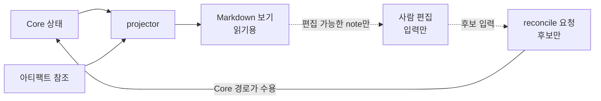

# 문서 Projection 참조

## 이 문서로 할 수 있는 일

이 참조 문서는 하네스가 Core 소유 상태 기록과 아티팩트 참조를 바탕으로 읽기용 파생 view를 어떻게 생성하는지 확인할 때 사용합니다.

Projection의 권한 경계, managed block 동작, 사람이 편집할 수 있는 영역, 아티팩트 참조 표시 방식, 산출물 계층, 템플릿 구현 계층, projection 최신성 규칙을 정의합니다. 기준 kernel state, MCP request/response schema, SQLite DDL, 설계 품질 정책 요구사항, 전체 template 본문은 이 문서가 정의하지 않습니다. 전체 template 본문과 표시 카드 형태는 [Template 참조](templates/README.md)에 있습니다.

이 문서는 참조 문서입니다. 문서 수락과 별도의 구현 계획 준비 결정 전에는 runtime/server 구현, 생성된 운영 파일, 실행 가능한 fixture 파일, runtime data를 만들라는 뜻이 아닙니다. 첫 실행 목표는 코어 권한 조각(v0.1 Core Authority Slice)이며, 커널 스모크(Kernel Smoke)는 좁은 future smoke-check 작성 label입니다. 첫 제품 MVP 목표는 사용자 대상 하네스 MVP(v0.2 User-Facing Harness MVP)입니다. 에이전시 보증 팩(v0.3 Agency Assurance Pack)과 운영과 인계 팩(v0.4 Operations & Handoff Pack)은 agency assurance, operations, handoff behavior를 단단하게 만드는 단계이며, v1+ Expansion은 owner 문서가 승격하고 증명하기 전까지 roadmap 범위에 남습니다.

## 이런 때 읽기

- Markdown projection 동작을 구현하거나 리뷰할 때
- 보고서, status card, Journey Card가 기준 상태가 아님을 확인할 때
- projected Markdown에 남긴 사람이 쓴 내용이 상태로 반영되는 경로를 판단할 때
- 사용자 읽기용 요약, 에이전트 compact context, reference 또는 diagnostic projection을 구분해야 할 때
- 최신이 아니거나, failed이거나, drifted된 projection을 진단할 때

## 읽기 전에

기준 상태와 gate authority는 [커널 참조](kernel.md)를 사용합니다. `ProjectionKind`와 projection ref는 [MCP API와 스키마](mcp-api-and-schemas.md)를 사용하고, projection job storage는 [Storage와 DDL](storage-and-ddl.md)을 사용하며, 전체 rendered body와 display card는 [Template 참조](templates/README.md)를 사용합니다.

## 핵심 생각

Projection은 읽기용 파생 보기입니다. Core 소유 상태와 아티팩트 참조에서 생성되며 current state, ref, freshness, proposed edit를 표시할 수 있지만 Core 소유 상태를 대체하지 않습니다. 사람이 projection을 편집해도 future Core/reconcile path가 state-changing action으로 받아들이기 전까지는 상태 변경이 아닙니다.

## Projection을 쉽게 말하면

하네스 projection은 이미 기준 상태나 artifact storage에 기록된 작업을 사람이 읽기 쉽게 보여주는 view입니다. Projector는 `state.sqlite` record, `state.sqlite.task_events`, 등록된 아티팩트 참조를 읽어 `TASK`, `APR`, `RUN-SUMMARY`, `EVIDENCE-MANIFEST`, `EVAL`, `DIRECT-RESULT`, 그 밖의 report projection 같은 Markdown을 생성합니다.

Markdown은 사람이 작업을 이해하고, 맥락을 다시 잡고, evidence 검토와 수정 제안을 할 수 있게 돕습니다. 하지만 Markdown이 작업을 소유하지는 않습니다. 보고서는 gate를 요약하거나, evidence link를 제공하거나, Write Authorization 참조를 표시하거나, Decision Packet을 보여줄 수 있지만, 보고서 문장 자체가 gate, evidence, authorization, decision이 되지는 않습니다.

Projection은 secret/PII를 보호하는 표시 경계이기도 합니다. Projector는 아티팩트 참조, integrity metadata, redaction state, redaction/omission/blocking note를 렌더링합니다. `secret_omitted` 또는 `blocked` artifact를 Markdown 본문으로 펼치면 안 됩니다.

## 산출물 계층

하네스는 읽기용 파생 산출물을 세 계층으로 나눕니다.

| 계층 | 목적 | 초기 구현 규칙 |
|---|---|---|
| 사용자 읽기용 산출물 | 사용자가 현재 작업을 이해하기 위한 짧은 요약입니다. 상태, 사용자 결정 요청, 근거 요약, 닫기 준비 상태 또는 blocker 요약을 포함하며, 필요한 경우 작업 수락 필요 여부/상태와 잔여 위험 표시도 분명히 담습니다. | 사용자 대상 MVP를 지원하는 데 필요하지만, 여러 Markdown 파일이 아니라 status/next text, compact card, 최소 `TASK` section으로 렌더링할 수 있습니다. |
| 에이전트용 간결한 현재 맥락 | 다음 안전한 행동에 필요한 최소 current state입니다. 역할 또는 접점 자세, 현재 단계/context profile, 현재 상태 요약, 활성 blocker, 대기 중인 사용자 소유 결정, 다음 허용 행동, freshness를 담습니다. | 짧고 최신 상태로 유지합니다. 긴 history, log, trace, screenshot, projection 전체 본문, full schema, reference docs를 embed하지 않습니다. |
| 참조/진단용 산출물 | 자세한 manifest, Run Summary, Journey Card 또는 Journey Spine view, TDD trace, Module Map과 Interface Contract projection, detailed Eval report, export bundle, map, trace, operator report입니다. | 필요할 때만 가져오거나 later profile 범위에 둡니다. Owner profile이 명시적으로 승격하지 않는 한 첫 runnable slice나 최소 사용자 대상 MVP의 필수 항목이 아닙니다. |

에이전트용 간결한 현재 맥락은 `source_state_version`과 최신성이 다음 행동에 맞을 때만 projection을 읽기용 요약으로 사용할 수 있습니다. 상태가 중요하고 projection이 stale, failed, unknown이거나 너무 넓다면 current Core state 또는 state-derived compact context를 가져와야 합니다. Markdown projection, Journey Card, status card, old report, generated summary를 항상 주입되는 prompt payload나 authority로 만들면 안 됩니다. 이들은 살펴볼 current ref를 가리킬 수는 있지만 write를 허가하거나, gate를 충족하거나, 근거를 만들거나, 검증을 수행하거나, 수동 QA를 기록하거나, 결과를 수락하거나, 잔여 위험을 받아들이거나, Task를 close할 수 없습니다.

### 최소 사용자 대상 MVP 산출물 set

최소 사용자 대상 MVP 산출물 set은 v0.2를 지원하지만, 그 자체가 제품 가치는 아닙니다. 필요한 set은 다음입니다.

- 현재 작업 상태
- 사용자 결정 요청
- 근거 요약
- 닫기 준비 상태 / blocker 요약
- 작업 수락 필요 여부/상태
- 필요한 경우 잔여 위험 표시

이 산출물은 template shape를 재사용할 수 있지만, template 종류가 구현 범위를 키우면 안 됩니다. Core state와 ref에서 파생된 하나의 간결한 status/next surface와 명확한 사용자 결정 요청 display만으로도 MVP 표시 경로를 충족할 수 있습니다.

엄격한 경계는 다음과 같습니다.

| Item | What it is | Authority |
|---|---|---|
| Raw artifact | diff, log, screenshot, checkpoint, bundle, manifest file 같은 durable evidence file | artifact store |
| 상태 기록 | Task, Change Unit, Decision Packet, Journey Spine Entry, Residual Risk, Run, Approval, Write Authorization, Eval, 수동 QA record, Evidence Manifest, Artifact record, Reconcile Item 같은 기준 structured record | `state.sqlite` |
| Markdown 보고서 | record 및 아티팩트 참조에서 만든 사람이 읽을 수 있는 projection | projector output |

Markdown 보고서는 evidence link를 제공하고 상태를 요약할 수 있지만 raw artifact나 상태 기록은 아닙니다.

### Projection, 상태, artifact 권한 지도

이 diagram은 생성된 Markdown이 지켜야 하는 authority boundary를 보여줍니다. 눈여겨볼 점은 state record와 아티팩트 참조가 projection에 입력되지만, Markdown에 대한 사람의 edit은 Core가 state-changing action으로 받아들이기 전까지 reconcile input일 뿐이라는 것입니다.



엄격한 projection behavior는 이 reference가 담당하며, 특히 [Document authority matrix](#document-authority-matrix), [Managed block rules](#managed-block-rules), [Freshness and failure rules](#freshness-and-failure-rules)를 봅니다. Canonical state와 gates는 [커널 참조](kernel.md)가, artifact relation storage는 [Storage와 DDL](storage-and-ddl.md)이, public projection refs는 [MCP API와 스키마](mcp-api-and-schemas.md)가 담당합니다. 이 diagram은 authority direction만 요약합니다.

생성된 보고서는 독자가 이 참조 문서를 몰라도 그 경계를 볼 수 있어야 합니다. 예시와 template에서 `source_state_version`은 렌더링에 사용한 state clock을 가리키고, `projection_version` 또는 projection status는 렌더링된 view를 가리키며, `updated_at`은 그 view가 만들어진 시각을 가리킵니다. Freshness line은 이 view가 source record와 아직 맞는지 표시할 뿐입니다. 이 field들이 Markdown을 Task state, gate, approval, 근거, 검증, 수동 QA, Decision Packet, 작업 수락, 잔여 위험 표시, 잔여 위험 수용의 owner로 만들지는 않습니다.

최신성 표시는 진단 정보이며 운영상 중요할 수 있지만 여전히 표시입니다. 오래되었거나 failed인 projection은 current readable context가 필요한 close/readiness view를 막거나, 담당 API path를 통해 `PROJECTION_STALE`을 보고하게 만들 수 있습니다. 하지만 committed Core 상태를 롤백하거나, gate value를 바꾸거나, Task를 failed로 표시하거나, 오래된 report를 authoritative하게 만들면 안 됩니다.

## 담당하는 참조 범위

이 문서는 다음을 담당합니다.

- projection principles
- document authority matrix
- managed block rules
- 사람이 편집할 수 있는 영역의 rules
- 아티팩트 참조 표시 rules
- 산출물 계층과 템플릿 구현 계층
- projection 기준 기록 rules
- projection 최신성 and failure rules
- projection rule 수준의 `source_state_version`과 `managed_hash` 해석

## 여기서 다루지 않는 것

이 문서는 다음을 담당하지 않습니다.

- 기준 kernel state와 transition rules. [Kernel Reference](kernel.md)를 봅니다.
- public MCP request/response schemas. [MCP API And Schemas](mcp-api-and-schemas.md)를 봅니다.
- SQLite DDL과 storage layout. [Storage And DDL](storage-and-ddl.md)를 봅니다.
- 설계 품질 정책 계약. [설계 품질 정책](design-quality-policies.md)을 봅니다.
- operator command 의미. [Operations And Conformance](operations-and-conformance.md)를 봅니다.
- conformance fixture assertion 의미. [Conformance Fixtures 참조](conformance-fixtures.md#fixture-assertion-semantics)를 봅니다.
- connector capability profile. [Agent 통합 참조](agent-integration.md)를 봅니다.
- surface recipe. [Surface Cookbook](surface-cookbook.md)을 봅니다.
- 전체 template 본문과 표시 카드 형태. [Template 참조](templates/README.md)를 봅니다.

## 작은 generated TASK 예시

일부러 아주 작게 보여주는 예시입니다. 전체 렌더링 형태는 [TASK template](templates/task.md)에 있습니다.

```md
---
doc_type: task
task_id: TASK-0001
display_state: executing
projection_version: 7
source_state_version: 42
updated_at: 2026-05-06T09:30:15+09:00
---

# TASK-0001 Add Import Preview

> Projection 보기: `state.sqlite`의 `source_state_version` 42와 `updated_at` 기준으로 렌더링된 보기입니다. `projection_version`은 Task state가 아니라 보기를 설명합니다. Managed edit는 drift 또는 reconcile candidate가 되며, user proposal은 Core와 `state.sqlite.task_events`를 통해서만 상태가 됩니다.

<!-- HARNESS:BEGIN managed -->
## Current Summary
- mode: work
- lifecycle phase: executing
- next action: record evidence for CU-01
- evidence gate: partial
- verification gate: pending
- 수동 QA: pending
- active change unit: CU-01
- projection freshness: current

## Evidence And Reports
- Run Summary: RUN-20260506-093015-LEAD-01
- Diff: DIFF-0001 (`artifact_id=ART-0001`, sha256:abc123..., redaction:none)
<!-- HARNESS:END managed -->

## User Notes and Proposals
<!-- Human-editable: 여기의 note와 proposal은 reconcile input이며, 그 자체로 상태 변경이 아닙니다. -->
-
```

## 사람이 편집할 수 있는 것

사람은 다음과 같이 명시적으로 편집 가능하다고 표시된 영역을 편집할 수 있습니다.

```md
## User Notes and Proposals
-
```

사람이 편집할 수 있는 text는 입력입니다. Note, question, correction, proposal을 담을 수 있습니다. 상태 변경 경로는 명시적입니다. proposal -> `reconcile_items` candidate -> explicit reconcile outcome -> 추가된 `state.sqlite.task_events` row가 있는 accepted Core state-changing action, 또는 reject, defer, note 전환입니다. 이 경로가 accepted Core outcome을 기록하기 전까지 proposal은 Task state, Domain Language, Module Map, Interface Contract, 수동 QA state, 작업 수락, 근거가 아닙니다.

사람이 편집한 proposal은 Task summary, acceptance criteria, Domain Language, Module Map, Interface Contract, 수동 QA note, 기타 상태 기반 기록을 대상으로 삼을 수 있지만 proposal 자체가 target 기록은 아닙니다.

## 사람이 상태에 직접 반영할 수 없는 것

사람은 다음 projection text를 기준 상태에 직접 반영할 수 없습니다.

- managed block content
- `source_state_version` 같은 front matter field
- current gate value, lifecycle phase, result, close reason, assurance level
- approval, 검증, 수동 QA, 작업 수락, 잔여 위험 status
- Decision Packet, Journey Card, Journey Spine, Autonomy Boundary, Write Authority Summary, Implementation Micro-Plan, Change Unit DAG, Residual Risk, Stewardship Impact, Review Stage, Write Authorization 표시 문구
- artifact 참조 identity, hash, redaction state, artifact availability
- status card, Journey Card, 기타 generated display 접점
- template body

Managed block을 직접 편집한 내용은 수용된 상태가 아니라 drift입니다. 권한처럼 보이는 문구를 직접 편집해도 write를 허가하거나, decision을 해결하거나, 필수 근거 조건을 충족하지 않습니다. 또한 verification 또는 수동 QA를 대체하거나, 잔여 위험을 받아들이거나, assurance를 높이거나, 작업을 닫거나, owner 기록을 변경하지 않습니다.

## Projection principles

1. Projection은 읽기용 파생 view이며 기준 기록이 아닙니다.
2. 운영 상태의 기준 기록은 `state.sqlite` current record 및 `state.sqlite.task_events`입니다.
3. Raw evidence의 기준 위치는 artifact store입니다.
4. Markdown 보고서는 Core 상태 기록 및 artifact 참조를 바탕으로 생성됩니다.
5. Markdown 보고서는 기본적으로 raw artifact가 아닙니다.
6. Front matter는 identity, projection version 또는 status, `source_state_version`, timestamp/freshness metadata만 가집니다.
7. Managed block은 projector가 생성하며 필요하면 다시 생성될 수 있습니다.
8. 사람이 편집할 수 있는 영역은 note와 proposal을 위한 입력 영역입니다.
9. 수용된 human edit만 reconcile과 `state.sqlite.task_events`를 추가하는 Core state-changing action을 통해 상태가 됩니다. Rejected, deferred, note outcome은 owner record를 변경하지 않습니다.
10. Large log, diff, trace, screenshot, bundle, checkpoint와 민감한 artifact는 embed하지 않고 artifact ref로 연결합니다.
11. Projection failure 또는 최신이 아님은 committed Core 상태를 롤백하거나 `state.sqlite.task_events`를 rewrite하거나 underlying task result를 절대 바꾸지 않습니다.
12. User-facing card는 friendly label을 사용할 수 있지만 기준 gate name은 kernel field로 남습니다.
13. Decision Packet, Journey Card, Journey Spine, Autonomy Boundary, Write Authority Summary, Implementation Micro-Plan, Change Unit DAG, Residual Risk, Stewardship Impact, Review Stage 표시는 owner 기록 및 artifact ref에서 만든 기준 기록이 아닌 projection입니다.

Projection과 report surface는 current record, ref, advisory next action을 표시할 수 있습니다. Write를 허가하거나, Write Authorization을 만들거나, gate를 충족하거나, 근거를 만들거나, 검증을 수행 또는 기록하거나, 수동 QA를 기록하거나, Approval을 부여하거나, QA 또는 검증을 면제하거나, 작업 수락을 기록하거나, 잔여 위험을 받아들이는 판단을 기록하거나, projection을 말만으로 refresh하거나, 구현 준비 상태를 선언하거나, Task를 닫거나, owner record를 변경하면 안 됩니다. 그런 효과는 아래 matrix에 이름 붙은 owner Core/MCP path에서 와야 합니다.

사용자 결정 display는 모든 항목을 "Judgment" 또는 "Approval"로 뭉치지 말고 결정 유형을 이름 붙여야 합니다. 해당 route가 pending이면 제품/UX 판단, 기술 구조 판단, 보안/개인정보 판단, 범위/자율성 판단, 민감 동작 승인, QA 면제 판단, 검증 면제 판단, 작업 수락, 잔여 위험 수용을 별도 label로 렌더링합니다. 여러 결정이 대기 중이면 별도 줄 또는 card로 표시합니다. 잔여 위험 수용 display는 수용하는 위험을 이름 붙여야 합니다.

Close/readiness display는 관련 있을 때 근거, 검증, 수동 QA, 작업 수락, 잔여 위험 표시, 잔여 위험 수용을 별도 줄로 유지해야 합니다. Projection은 test pass, Eval, QA waiver, 작업 수락 Decision Packet, accepted Residual Risk ref를 요약할 수 있지만, 그중 하나를 다른 범주나 모든 것을 대신하는 "완료" flag로 렌더링하면 안 됩니다.

## Document authority matrix

| 사실 또는 접점 | 기준 출처 | Projection 또는 표시되는 보기 | Update path |
|---|---|---|---|
| Current Task state | `state.sqlite.tasks`, `task_gates`, `state.sqlite.task_events` | `TASK` Current Summary와 status card | Core transition, then projector |
| Task continuity | `state.sqlite` Task, Change Unit, Run, Evidence Manifest, Eval, 수동 QA, Decision Packet, Approval, Residual Risk, `task_gates.acceptance_gate`, acceptance Decision Packet state, close events, artifact ref, 필요할 때 `task_spine_entries` / public `journey_spine_entry` records, `state.sqlite.task_events` | `TASK` Journey Spine | Core transition 또는 reconcile, Journey reconstruction, then projector |
| Decision Packet | `decision_kind`와 `judgment_domain`을 포함한 `state.sqlite.decision_packets`, 관련 `decision_gate` state, decision event, 관련 approval 또는 reconcile record, artifact ref, 필요할 때 연결된 `state.sqlite.residual_risks` | `TASK` Pending Decisions, Journey Card decision line, status/next responses, judgment-context resources, decision-packet resources; standalone projection이 켜져 있을 때 optional `DEC` | `request_user_decision` / `record_user_decision`, then projector |
| Journey Spine | `state.sqlite` Task, Change Unit, Run, Decision Packet, Approval, Evidence Manifest, Eval, 수동 QA, Residual Risk, `task_gates.acceptance_gate`, acceptance Decision Packet state, close events, artifact ref, 필요할 때 `task_spine_entries` / public `journey_spine_entry` records, `state.sqlite.task_events` | `TASK` Journey Spine section, resume view, Journey Spine-oriented card | Core transition 또는 reconcile, Journey reconstruction, then projector |
| Journey Card | 현재 `state.sqlite` Task state, gate, active Change Unit, Autonomy Boundary summary, active Decision Packet ref, residual-risk summary, latest evidence/eval/QA/보고서 ref, projection 최신성 | `JOURNEY-CARD`, status card, `harness.status` card text, `harness.next` 현재 위치 text, significant resume output | 현재 상태에서 read 또는 projection 새로고침; card를 직접 편집하지 않음 |
| Autonomy Boundary | active `state.sqlite.change_units` Autonomy Boundary field와 관련 Decision Packet 해소/event | `TASK` Autonomy Boundary, Change Unit block, Journey Card autonomy line, standalone projection이 켜져 있을 때 optional related `DEC` | shaping update 또는 user Decision Packet 해소, then projector |
| Write Authorization | `state.sqlite.write_authorizations`와 관련 Task, Change Unit, approval, Decision Packet, baseline, consumed Run ref | `TASK` Write Authority Summary, Journey Card Write Authority Summary line, `RUN-SUMMARY` relation | `prepare_write`가 생성함; idempotent replay는 already committed response를 반환함; `record_run`이 authorization을 consume한 뒤 projector |
| Implementation Micro-Plan | 현재 `state.sqlite` Task state와 gate, active Change Unit scope와 Autonomy Boundary, Change Unit dependency summary, selected feedback-loop records, TDD가 selected된 경우 TDD traces, expected evidence needs, Decision Packet blockers, latest 보고서 refs | `TASK` Implementation Micro-Plan managed section | Accepted reconcile outcome 또는 Core state-changing action이 owner 기록을 업데이트한 뒤 projector |
| Change Unit DAG | `state.sqlite.change_units`, `state.sqlite.change_unit_dependencies`, dependency 관련 event, active Task state | `TASK` Change Unit Dependencies / DAG summary | shaping update 또는 reconcile, then projector |
| Residual Risk | `state.sqlite.residual_risks`, accepted-risk metadata와 residual-risk refs, related Decision Packet, evidence/QA/eval ref, artifact ref | `TASK` Residual Risk, standalone projection이 켜져 있을 때 optional `DEC` accepted-risk context, Journey Card residual-risk line | decision, evidence, QA, Eval, reconcile 또는 close flow에서 Core transition, then projector |
| Stewardship Impact Summary | `domain_terms`, `module_map_items`, `interface_contracts`, `feedback_loops`, TDD가 selected된 경우 TDD records, `state.sqlite.residual_risks`, `state.sqlite.decision_packets`, policy validator 결과, related refs | `TASK` Stewardship Impact와 status/resume stewardship display | Owner 기록 업데이트, validator 결과, reconcile, close flow, then projector |
| Review Stages | Task, Change Unit, gate state, Evidence Manifest, validator 결과, 수동 QA, Eval, Approval, Residual Risk, stewardship owner refs, structured blocker refs | Spec Compliance Review와 Code Quality / Stewardship Review라는 `TASK` 및 `RUN-SUMMARY` sections | Existing owner-record update, validator result, Decision Packet, evidence, 수동 QA, Eval, residual-risk, close-blocker, Change Unit, follow-up path, then projector |
| User Notes | human-editable input -> `reconcile_items` -> accepted Core state-changing action과 `state.sqlite.task_events`, 또는 rejected/deferred/note outcome | `TASK` User Notes and Proposals | human edit, reconcile decision, Core event |
| Shared Design | shared design record 및 event | `TASK` summary, `DESIGN`, standalone projection이 켜져 있을 때 optional `DEC` | Core transition 또는 reconcile, then projector |
| Domain Language | `domain_terms` table | `DOMAIN-LANGUAGE` projection | Core transition 또는 reconcile, then projector |
| Module Map | `module_map_items` table | `MODULE-MAP` projection | Core transition 또는 reconcile, then projector |
| Interface Contract | `interface_contracts` table | `INTERFACE-CONTRACT` projection | Core transition 또는 reconcile, then projector |
| Feedback Loop | `feedback_loops` table plus runs, artifacts, TDD traces, 수동 QA, evidence manifests refs | `TASK` Stewardship Impact와 Evidence Manifest 설계 품질 coverage; current reference catalog에는 standalone Feedback Loop projection이 없음 | `record_run` shaping 또는 evidence update의 `FeedbackLoopUpdate`, `record_manual_qa`의 `feedback_loop_ref`, 또는 reconcile, then projector |
| Approval | `approvals`, Approval 형태 Decision Packet, 구현이 유지하는 경우 optional decision request routing/replay record, event; `approval_request_candidate`만 있는 경우는 제외 | `APR` projection과 Approval Card | `request_user_decision(decision_kind=approval)`이 pending Approval 기록을 만들고, `record_user_decision`이 Approval decision을 업데이트한 뒤 projector |
| Run summary | `runs` table plus artifact refs | `RUN-SUMMARY` projection | `record_run`, then projector |
| Direct result | direct run record plus artifact refs | `DIRECT-RESULT` projection | `record_run` / `close_task`, then projector |
| Evidence coverage | `evidence_manifests` plus artifact refs | `EVIDENCE-MANIFEST` projection | evidence module update, then projector |
| Verification verdict | `evals` plus artifact refs | `EVAL` projection과 verification card | `record_eval`, then projector |
| TDD trace | `tdd_traces` plus artifact refs | `TDD-TRACE` projection | `record_run` 또는 reconcile, then projector |
| 수동 QA | Aggregate QA 요구사항 상태에는 `qa_gate`; 기록이 있을 때 `manual_qa_records` plus artifact refs | `MANUAL-QA` projection과 QA card | `record_manual_qa`, then projector |
| Raw evidence | artifact store plus `artifacts` records | 보고서 안의 artifact 참조 | artifact registry |
| Projection freshness | `projection_jobs.source_state_version`, `projection_jobs.projection_version`, job status, managed hashes, artifact records | front matter mirror, status card, operations output | projector and recovery tools |

Decision Packet projection과 card는 schema가 소유하는 `judgment_domain`을 사용자에게 보이는 판단 영역으로 렌더링합니다. Template은 enum 값을 자연스러운 label로 바꿔 보여줄 수 있지만, `decision_kind`는 lifecycle/gate route로, `judgment_domain`은 표시 grouping으로 유지해야 합니다. 또한 route와 관련 owner ref에서 파생되는 구체적인 decision type을 렌더링해야 합니다. 그래야 민감 동작 승인이 작업 수락처럼 보이지 않고, 작업 수락이 잔여 위험 수용처럼 보이지 않습니다. 영향을 받는 gate나 막힌 행동은 domain label이 아니라 packet의 `affected_gates`와 관련 owner record에서 옵니다. `judgment_domain`은 `ProjectionKind`, gate, close aggregation input, Approval 대체물, waiver 대체물, 잔여 위험 수용 rule이 아닙니다.

필수 권한 설명:

- User Notes: human-editable input -> `reconcile_items` -> accepted Core state-changing action과 `state.sqlite.task_events`, 또는 rejected/deferred/note outcome
- Domain Language: `domain_terms` table -> `DOMAIN-LANGUAGE` projection; 기준 term row에 대한 public ref는 `StateRecordRef.record_kind=domain_term`을 사용합니다.
- Module Map: `module_map_items` table -> `MODULE-MAP` projection; 기준 module row에 대한 public ref는 `StateRecordRef.record_kind=module_map_item`을 사용합니다.
- Interface Contract: `interface_contracts` table -> `INTERFACE-CONTRACT` projection; 기준 contract row에 대한 public ref는 `StateRecordRef.record_kind=interface_contract`를 사용합니다.
- Feedback Loop: `feedback_loops` table -> `TASK`와 Evidence Manifest display; 기준 feedback-loop row에 대한 public ref는 `StateRecordRef.record_kind=feedback_loop`를 사용합니다. TDD Trace refs는 separate execution evidence refs로 남습니다.
- Decision Packet: `judgment_domain`을 포함한 `state.sqlite.decision_packets`와 관련 ref -> `TASK` Pending Decisions, status/next responses, judgment-context resources, decision-packet resources; standalone projection이 켜져 있을 때 optional `DEC` projection
- Journey Spine: owner 기록, artifact ref, 필요할 때 `task_spine_entries` / public `journey_spine_entry` records, `state.sqlite.task_events`에서 재구성합니다. 자체 권한 기록은 아닙니다.
- Journey Card: 현재 상태와 ref에서 만든 파생 표시입니다. 절대 기준 상태가 아닙니다.
- Autonomy Boundary: active `state.sqlite.change_units` boundary field -> projection 접점. 판단 재량이지 범위 권한이 아닙니다.
- Write Authority Summary: active scope, approval, Write Authorization, baseline, guarantee ref에서 만든 파생 표시입니다. 절대 기준 상태가 아니며 work를 허가할 수 없습니다.
- Write Authorization: `state.sqlite.write_authorizations`는 specific allowed write attempt를 기록합니다. Scope, approval, evidence, verification, QA, 작업 수락, 잔여 위험 수용이 아닙니다.
- Implementation Micro-Plan: 현재 Task와 Change Unit의 owner 기록 및 관련 참조에서 생성되는 `TASK`의 managed execution-aid section. 기준 상태가 아니고, 새 `ProjectionKind`도 아니며, 범위 권한, Approval, Write Authorization이 아닙니다.
- Approval: `approvals`와 Approval 형태 Decision Packet -> Approval 기록 존재 또는 변경 뒤에만 `APR` projection을 만듭니다. `prepare_write`가 반환한 `approval_request_candidate`는 candidate 표시로 보여줄 수 있지만 `APR` source는 아닙니다.
- Change Unit DAG: `state.sqlite.change_unit_dependencies`와 Change Unit ref -> dependency projection. scheduler 또는 authorization 접점이 아닙니다.
- Residual Risk: accepted-risk metadata/refs를 포함한 `state.sqlite.residual_risks` -> 잔여 위험 표시
- Stewardship Impact Summary: owner 기록, validator 결과, 참조에서 파생됨 -> `StewardshipImpactSummary` display. 기준 record는 아닙니다.
- Review Stages: Task, Change Unit, gates, 근거, validator 결과, residual-risk refs, stewardship owner refs -> Spec Compliance Review와 Code Quality / Stewardship Review라는 managed `TASK` 또는 `RUN-SUMMARY` display sections. 기준 records가 아니며, 새 `ProjectionKind` values, Approval, 근거, 검증, 수동 QA, 작업 수락, 잔여 위험 수용, close, Write Authorization, 분리 검증도 아닙니다.

## Managed block rules

Managed block은 projector가 덮어쓸 수 있는 유일한 Markdown 영역입니다.

```md
<!-- HARNESS:BEGIN managed -->
...
<!-- HARNESS:END managed -->
```

규칙:

- Managed block content는 committed 상태 기록 및 artifact ref에서 생성됩니다.
- Projector는 `projection_jobs.source_state_version`, projection version, 렌더링 timestamp, managed hash를 기록합니다. Front matter는 operator를 위해 recorded source state version을 그대로 비춥니다.
- Managed hash는 `HARNESS:BEGIN`과 `HARNESS:END` marker lines를 제외한 projector-owned managed block body에서 계산하며, line endings를 LF로 normalize하고 projector rules가 요구하는 meaningful whitespace를 보존합니다.
- 렌더링 전에 managed block hash가 last projected hash와 다르면 projector는 reconcile item을 만들거나 업데이트합니다.
- Managed hash는 drift detection에만 사용하며 렌더링된 Markdown을 기준 상태로 만들지 않습니다.
- Projector는 managed block 내부의 direct edit를 accepted state로 조용히 취급하지 않습니다.
- Managed block을 다시 렌더링할 때 관련 없는 사람이 편집할 수 있는 영역은 보존해야 합니다.
- 렌더링 실패는 projection 최신성을 `failed` 또는 `stale`로 표시하며 상태를 롤백하지 않습니다.
- Rendered template은 report가 view이고, managed block은 projector-owned이며, 사람이 편집할 수 있는 section은 proposal input임을 독자가 알 수 있도록 top 또는 managed summary 근처에 짧은 projection boundary notice를 포함해야 합니다.

Front matter는 diagnostic 용도로 compact하게 유지합니다. 렌더링된 object를 식별하고, projection version 또는 status를 표시하며, `source_state_version`을 그대로 비추고, 렌더링 timestamp를 포함할 수 있습니다. Large state summary, evidence body, gate rollup, artifact inventory는 포함하면 안 됩니다.

`projection_version`은 projection/template/job version입니다. State clock이 아니며 source-state freshness basis로 사용하면 안 됩니다. `source_state_version`은 렌더링 source로 사용한 affected-scope state clock 값입니다. Projection이 task-scoped이면 Task State Version이고, 그렇지 않으면 Project State Version 또는 extension-defined owner state clock입니다.

기준 per-projection value는 성공한 렌더링 job의 `projection_jobs.source_state_version`입니다. Front matter `source_state_version`은 operator diagnosis를 위해 그 값을 그대로 비출 뿐입니다.

표시 문제를 하나의 status로 뭉개면 안 됩니다.

- Stale projection은 읽기용 Markdown 또는 card가 owner record나 artifact ref보다 뒤처졌을 수 있다는 뜻입니다.
- Stale state, stale baseline, stale evidence는 underlying state 또는 evidence input이 이동했거나 더 이상 충분하지 않다는 뜻입니다. Projection은 current여도 그 blocker를 표시할 수 있습니다.
- MCP unavailable은 surface 또는 caller가 필요한 Harness/Core capability에 닿지 못한다는 뜻입니다. Core에 닿을 수 없다면 표시 내용만으로 Core의 기준 상태 변경, projection repair, approval, close, gate update를 주장할 수 없습니다.

## Human-editable section rules

- 사람이 편집할 수 있는 text는 입력이지 기준 상태가 아닙니다.
- Reconcile은 edit를 읽고 상태 변경이 필요할 수 있으면 `reconcile_items` candidate를 만듭니다.
- Accepted proposal은 Core transition과 추가된 `state.sqlite.task_events` row를 통해서만 상태가 됩니다.
- Rejected proposal은 note 또는 rejected reconcile item으로 남습니다.
- Projector는 refresh 중 사람이 편집할 수 있는 content를 보존해야 합니다.
- 사람이 편집한 proposal은 Task summary, acceptance criteria, Domain Language, Module Map, Interface Contract, 수동 QA note, 기타 상태 기반 기록을 대상으로 삼을 수 있지만 proposal 자체가 target 기록은 아닙니다.

## Embed와 reference

사용자 읽기용 output은 짧은 요약과 안전한 label만 본문에 넣어야 합니다. 큰 log, diff, trace, screenshot, recording, checkpoint, bundle, export component, 민감한 artifact는 읽기용 Markdown에 붙여 넣지 말고 `ArtifactRef` 또는 `StateRecordRef`로 참조합니다.

Reference/diagnostic output은 더 자세한 artifact inventory, hash, retention state, availability note를 나열할 수 있지만, 여전히 크거나 민감한 bytes는 재구성하지 않고 참조합니다. Projection은 ref가 무엇을 뒷받침하는지, input이 redacted, omitted, blocked, stale, missing 중 무엇인지 말할 수 있습니다. 하지만 생략된 secret/PII value, blocked payload bytes, 제한 없는 raw evidence를 inline하면 안 됩니다.

## Artifact reference 렌더링

Markdown 보고서는 artifact reference를 compact하고 consistent하게 표시합니다. Payload shape는 MCP API document가 담당하며, projection은 presentation rule만 담당합니다.

권장 display:

```text
- Diff: DIFF-0001 (`artifact_id=ART-0001`, sha256:abc123..., redaction:none)
- Test log: LOG-0002 (`artifact_id=ART-0002`, sha256:def456..., redaction:redacted)
- Bundle: BUNDLE-0001 (`artifact_id=ART-0003`, sha256:789abc..., redaction:secret_omitted)
- Browser trace: TRACE-0004 (`artifact_id=ART-0004`, sha256:012def..., redaction:blocked)
```

규칙:

- 모든 artifact ref는 artifact record로 해석되어야 합니다.
- 모든 raw artifact ref는 integrity metadata와 redaction 상태를 가져야 합니다.
- Large 또는 sensitive evidence는 Markdown에 붙여 넣지 않고 link만 둡니다.
- 사용자에게 보이는 artifact line은 ref identity, 필요할 때 owner 또는 supporting record, hash 또는 short hash, 필요할 때 size, redaction state, retention class 또는 availability, evidence 영향 이해에 필요한 omission/block note를 표시해야 합니다.
- `secret_omitted` artifact는 ref와 omission note 또는 handle로 표시합니다. 보이는 nonsecret claim은 뒷받침할 수 있지만, projection text가 omitted value를 검토했거나 증명한 것처럼 암시하면 안 됩니다.
- `blocked` artifact는 ref와 block note로 표시합니다. 표시되는 hash, size, content type은 committed metadata-only notice bytes를 설명하며 금지된 원본 payload가 아닙니다. Projector는 생략되었거나 차단된 원본 value를 재구성하거나, inline하거나, 요약하거나, export하면 안 됩니다.
- `blocked` artifact 표시는 raw capture를 사용할 수 없다는 뜻입니다. Evidence, QA, verification, Release Handoff, export display는 replacement, waiver, Decision Packet outcome, accepted risk, 또는 documented fallback이 해당 path를 해소하기 전까지 blocked, insufficient, unavailable input, unresolved 중 적절한 상태로 그 block을 드러내야 합니다.
- Missing 또는 hash-mismatched artifact는 related evidence, projection 최신성, export display, close-readiness view를 `stale` 또는 blocked로 표시합니다. 사용자에게 보이는 보고서는 affected ref와 `artifacts check` 또는 recovery path를 가리켜야 하며, report prose를 replacement evidence로 붙여 넣으면 안 됩니다.
- StateRecordRef는 record identity와 optional projection path를 사용합니다. `record_kind=projection`에서 identity는 `projection_jobs.projection_job_id`이고 path는 locator일 뿐입니다. Raw artifact ref로 표시하지 않습니다.
- `artifact_links.record_kind`는 existing same-Task state owner 또는 projection ref로 해석되어야 합니다. Current Task-scoped artifact links는 Task-scoped로 남습니다. `record_kind=projection`은 같은 `task_id`를 가진 completed `projection_jobs` row로 해석되며, link의 `record_id`는 `projection_jobs.projection_job_id`이고 path display는 `StateRecordRef.projection_path` 또는 `projection_jobs.output_path`를 사용합니다. Project-level owner rows와 project-level projection jobs는 future extension이 project-scoped artifact linking을 추가하지 않는 한 state 또는 projection job freshness/output metadata를 사용합니다. `EXPORT`는 `ProjectionKind`일 뿐입니다. Export snapshot과 component는 owner record 또는 `record_kind=projection`에 link되는 artifact로 남으며 `record_kind=export`에 link하지 않습니다.

## 템플릿 구현 계층

Template catalog는 초기 구현 set보다 의도적으로 넓습니다. 템플릿 구현 계층은 렌더링 shape의 단계를 나눌 뿐 projection authority를 바꾸지 않습니다.

| 계층 | Template 또는 산출물 shape | Rule |
|---|---|---|
| 코어 권한 조각(v0.1 Core Authority Slice)에서 허용 | 최소 [Compact Status Card](templates/compact-status-card.md) 또는 동등한 status/blocker response shape | Current Core state에서 오는 structured status/blocker output을 렌더링할 때 선택할 수 있습니다. Plain structured response만으로 충분하며 persisted Markdown projection job이나 full renderer는 필요하지 않습니다. |
| 사용자 대상 MVP에 필요 | 최소 [TASK](templates/task.md) continuity summary와 standalone `DEC` `ProjectionKind`가 아닌 [Decision Packet](templates/decision-packet.md) 사용자 결정 요청 display/card shape | 현재 상태, 사용자 결정 요청, 근거 요약, 닫기 준비 상태/blocker, 작업 수락 필요 여부/상태, 잔여 위험 표시를 보여주는 지원 표시 범위에서만 필요합니다. Standalone persisted `DEC` Markdown은 standalone Decision Packet projection 기능이 켜진 경우에만 사용합니다. |
| 초기 선택 사항 | [APR](templates/approval.md), [Approval Card](templates/approval-card.md), [DIRECT-RESULT](templates/direct-result.md), [MANUAL-QA](templates/manual-qa.md), [Manual QA Card](templates/manual-qa-card.md), [Verification Result Card](templates/verification-result-card.md) | 해당 approval, direct-work, 수동 QA, verification profile이 active일 때 유용합니다. 첫 slice requirement가 아닙니다. |
| 미래 / 진단 | [RUN-SUMMARY](templates/run-summary.md), [EVIDENCE-MANIFEST](templates/evidence-manifest.md), [EVAL](templates/eval.md), [TDD-TRACE](templates/tdd-trace.md), [DOMAIN-LANGUAGE](templates/domain-language.md), [MODULE-MAP](templates/module-map.md), [INTERFACE-CONTRACT](templates/interface-contract.md), [DESIGN](templates/design.md), [EXPORT](templates/export.md), [JOURNEY-CARD](templates/journey-card.md) | Detailed reference, diagnostic, handoff, stewardship, map, trace, export view입니다. 에이전시 보증 팩(v0.3 Agency Assurance Pack), 운영과 인계 팩(v0.4 Operations & Handoff Pack) 또는 owner가 승격한 다른 later profile에서 사용할 수 있게 유지하되 초기 필수 범위로 만들지 않습니다. |

`미래 / 진단`은 later-profile 또는 diagnostic 범위라는 뜻이며, 자동으로 v1+ 전용이라는 뜻은 아닙니다.

어떤 template class도 projection을 기준 상태로 만들거나 evidence, QA, verification, 작업 수락, 잔여 위험 수용, close authority, Write Authorization을 만들지 않습니다. Source record가 없으면 projector는 template completeness를 맞추기 위해 placeholder state를 만들어내면 안 됩니다.

`EXPORT` template은 선택적 projection output입니다. Artifact link를 위한 `export` 상태 기록을 도입하지 않습니다. Export projection은 artifact ref, hash, redaction state, redaction/omission/block note를 나열하며, 기본적으로 large 또는 sensitive artifact body를 embed하지 않습니다.

Persisted `JOURNEY-CARD` Markdown, Journey Spine output, Run Summary, TDD Trace, Module Map, Interface Contract, export bundle, detailed Evaluation view는 초기 필수 범위가 아닙니다. Status, next, resume의 현재 위치 맥락은 사용자 읽기용 간결한 산출물 또는 에이전트용 간결한 현재 맥락으로 충족할 수 있습니다.

Required Decision Packet visibility는 status/next responses, judgment-context resources, decision-packet resources, 최소 `TASK` 또는 card display를 통해 제공됩니다. 이 요구사항은 standalone `DEC` `ProjectionKind`가 아니라 Decision Packet 사용자 결정 요청 display shape에 대한 것입니다. Standalone `DEC` Markdown은 standalone Decision Packet projection 기능이 켜진 경우에만 사용합니다.

Decision Packet record ID는 `DEC-*`를 사용합니다. `projection_kind`의 `DEC`는 projection kind label일 뿐입니다. Standalone projection에 별도 identity가 필요하면 `DEC-PROJ-0001` 같은 별도 `projection_id`를 사용합니다.

표시 카드 형태도 [Template 참조](templates/README.md)에 있습니다: [Compact Status Card](templates/compact-status-card.md), [Approval Card](templates/approval-card.md), [Verification Result Card](templates/verification-result-card.md), [수동 QA Card](templates/manual-qa-card.md).

## Freshness and failure rules

Projection 최신성은 current owner 또는 affected-scope state clock, 기준 `projection_jobs.source_state_version`, projection job state, managed hash, artifact availability, 알려진 `stale` trigger에서 계산됩니다. Front matter `source_state_version`은 마지막 successful 렌더링의 기준 값을 그대로 비추어, operator가 Markdown을 기준 상태로 취급하지 않고도 최신이 아닌 projection을 진단할 수 있게 합니다.

Close/readiness display는 세 사실을 구분해야 합니다. 현재 Core state version, projection source version 또는 failed job status, 그리고 요청한 operation에 대해 readable view가 충분히 current한지입니다. 오래된 Markdown에서 readiness를 추론하면 안 되며, failed projection을 현재 Task, Run, evidence, Eval, QA, Approval, Decision Packet, residual-risk state의 rollback이나 mutation으로 취급하면 안 됩니다.

| Projection | Generated when | Stale when |
|---|---|---|
| `TASK` | Task가 created, resumed, changed, refreshed될 때 | `TASK` projection에서 current `tasks.state_version > projection_jobs.source_state_version`인 경우, managed block drift, 해소되지 않은 reconcile required, stewardship owner ref 또는 설계 품질 validator 결과 changed |
| `APR` | `request_user_decision(decision_kind=approval)`이 커밋된 Approval request를 create하거나, `record_user_decision`을 통해 Approval decision이 changed될 때 | Approval 형태 Decision Packet, 연결된 Approval 기록 status, scope, baseline, expiry, decision note가 changed |
| `RUN-SUMMARY` | `record_run`이 `runs.status=completed`, `interrupted`, `blocked`, `violation`을 포함한 Run을 commit할 때 | run relation changed, artifact ref missing, artifact integrity fails |
| `EVIDENCE-MANIFEST` | evidence coverage가 changed될 때 | baseline drift, changed files modified, required 근거 missing/`stale`, Approval expired |
| `EVAL` | verification result가 기록될 때 | Eval 후 baseline changes, evidence `stale` 상태, independence relation invalidated |
| `DIRECT-RESULT` | direct run이 closes 또는 escalates될 때 | changed file drift, escalation state changes, artifact ref missing |
| `EXPORT` | export/보고서 projection이 generated될 때. 켜진 경우 Release Handoff profile 포함 | 포함된 Task/gate/Change Unit/Decision Packet/Residual Risk/evidence/verification/수동 QA/artifact/projection/redaction/checklist source가 changed 또는 unavailable일 때 |
| `DEC` | standalone Decision Packet projection이 켜져 있고 Decision Packet이 created, requested, `resolved`, `deferred`, `rejected`, `blocked`, `superseded`될 때 | packet status, affected scope, current-state context, related approval/reconcile state, residual-risk ref, evidence 참조가 바뀔 때 |
| `JOURNEY-CARD` | card가 렌더링되거나 projection으로 persisted될 때. `harness.status`와 `harness.next`가 projection job 없이 ephemeral하게 반환할 수도 있음 | 표시된 Task/gate/Change Unit/Autonomy Boundary/Write Authorization/approval/baseline/guarantee/Decision Packet/Residual Risk/evidence/보고서/freshness source가 렌더링된 card보다 앞서 이동할 때 |
| `DOMAIN-LANGUAGE` | domain terms change | term conflict, accepted term record changes, related code representation moves |
| `MODULE-MAP` | module map records change | module path, public interface, dependency direction, internal complexity, 테스트 경계, owner 결정, watchpoint changes |
| `INTERFACE-CONTRACT` | interface contract records change | linked interface, caller, compatibility impact, boundary tests change |
| `TDD-TRACE` | trace recorded 또는 updated | red/green log missing, baseline drift, linked test file changes |
| `MANUAL-QA` | QA record created 또는 updated | linked UI/code changes, required capture missing, 해소되지 않은 finding |

Freshness state:

| State | Meaning |
|---|---|
| `current` | projected content가 기준 `projection_jobs.source_state_version`에 기록된 committed state version 및 managed hash와 match함 |
| `stale` | state 또는 referenced 근거가 projection보다 앞서 이동함 |
| `failed` | projector가 refresh를 attempted했고 failed함 |
| `unknown` | freshness를 compute할 수 없음. 보통 recovery 또는 migration 중 |

Projection `stale` 상태는 current report view에 의존하는 close/readiness check를 포함해 현재 readable context가 필요한 action을 block할 수 있지만, 그 자체로 lifecycle result, gate value, assurance를 바꾸지는 않습니다. Projection failure 또는 `stale` 상태는 underlying task result를 절대 바꾸지 않으며 committed Core 상태를 롤백하지도 않습니다.
