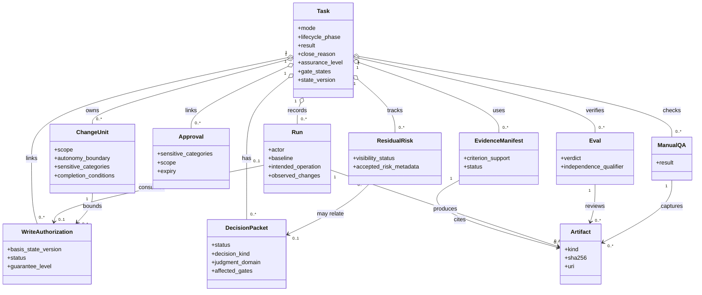
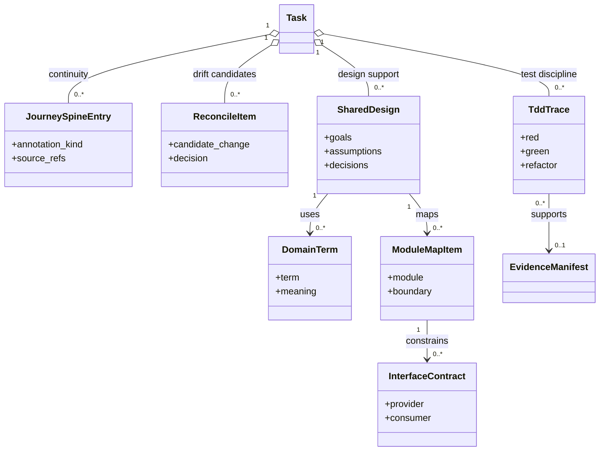
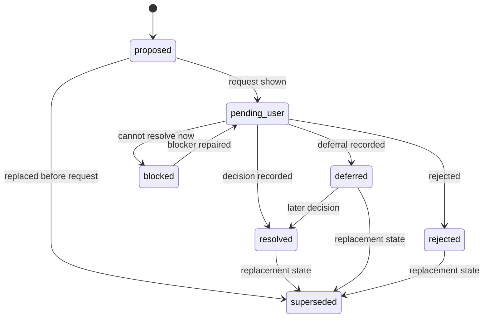
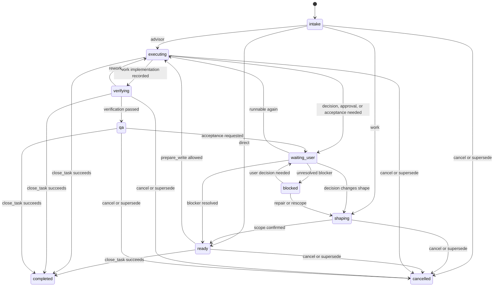
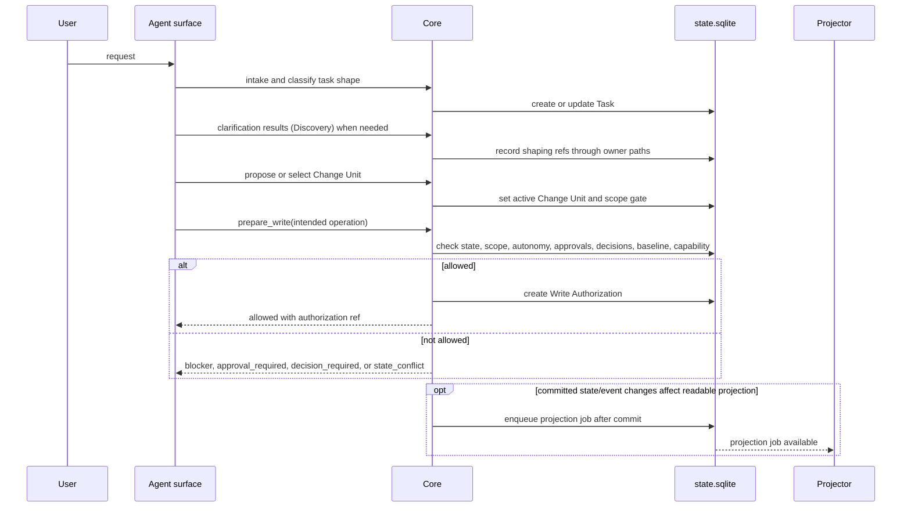

# 커널 참조

## 이 문서로 할 수 있는 일

이 문서는 Harness 상태, gate, 쓰기 권한, 근거, 검증, QA, 수용, 잔여 위험, 닫기 동작의 정확한 커널 규칙을 확인하기 위한 참조 문서입니다.

처음 읽는 독자는 Learn 경로에서 전체 그림을 먼저 보고, 정확한 상태 규칙이 필요할 때 이 문서로 돌아오는 것을 권장합니다.

이 문서는 참조 문서입니다. 문서 세트가 구현 계획에 사용할 수 있다고 승인되기 전에는 runtime/server 구현, 생성된 운영 파일, 실행 가능한 fixture 파일, runtime data를 만들라는 뜻이 아닙니다. 첫 제품 MVP 목표는 v0.1 Kernel MVP이며, Kernel Smoke는 이를 좁게 실행하는 conformance profile입니다. v0.2부터 v0.4까지는 Agency-Hardened MVP reference conformance target으로 가는 staged pack이고, v1+ Expansion은 owner 문서가 승격하고 증명하기 전까지 roadmap 범위에 남습니다.

## 이런 때 읽기

- 커널 상태 전이를 구현하거나 검토할 때.
- Task가 쓰기, 진행, 사용자 판단 대기, 닫기 중 어디로 갈 수 있는지 판단해야 할 때.
- Task, Change Unit, Decision Packet, Approval, Write Authorization, Run, 근거, Eval, Manual QA, Residual Risk, Artifact 기록의 관계를 확인할 때.
- conformance fixture를 작성하거나 상태, artifact, projection, 사용자에게 보이는 상태 사이의 불일치를 진단할 때.

## 읽기 전에

정확한 상태 규칙보다 예시를 먼저 보고 싶다면 [핵심 개념](../learn/concepts.md)이나 [하나의 작업으로 보는 Harness](../learn/harness-in-one-task.md)를 먼저 읽습니다. Public MCP shape는 [MCP API와 스키마](mcp-api-and-schemas.md)에, connector capability 언어는 [Agent 통합 참조](agent-integration.md)에 따로 있습니다.

## 핵심 생각

Kernel은 제품 파일 쓰기와 닫기 판단이 명시적인 상태에 의존하게 만듭니다. Active Task, scoped Change Unit, Autonomy Boundary, write authority, decision, sensitive-action Approval, evidence, verification, QA, acceptance, residual risk, surface capability가 그 상태입니다. 더 가벼운 mode는 사용자에게 보이는 절차를 줄일 수 있지만, 권한 경계를 줄이지 않습니다.

## 계약 위치 지도

| 필요한 것 | 먼저 볼 곳 | 관련 owner |
|---|---|---|
| Entity와 relationship 의미 | [Entity model](#entity-model) | Physical table은 [Storage와 DDL](storage-and-ddl.md)에 남습니다. |
| 대체 불가능한 경계 규칙 | [Boundaries and non-substitutions](#boundaries-and-non-substitutions) | Public display shape는 [MCP API와 스키마](mcp-api-and-schemas.md)에 남습니다. |
| Kernel gate 규칙 | [Gate 규칙 지도](#gate-규칙-지도), 그다음 해당 gate section | Gate fixture assertion은 [Conformance Fixtures 참조](conformance-fixtures.md#fixture-assertion-semantics)에 남습니다. |
| Mode, lifecycle, result, close reason, assurance value | [Lifecycle and transitions](#lifecycle-and-transitions), [Compatibility matrix](#compatibility-matrix) | Persisted value의 storage hardening은 [Storage와 DDL](storage-and-ddl.md#canonical-enum-hardening)에 남습니다. |
| Stable event name | [Stable Event Catalog](#stable-event-catalog) | Event row는 [Storage와 DDL](storage-and-ddl.md#task_events)의 `state.sqlite.task_events`에 남습니다. |
| Write gate behavior | [`prepare_write`](#prepare_write) | Public request/response shape는 [`harness.prepare_write`](mcp-api-and-schemas.md#harnessprepare_write)에 남습니다. |
| Run recording consequence | [`record_run`](#record_run) | Public request/response shape는 [`harness.record_run`](mcp-api-and-schemas.md#harnessrecord_run)에 남습니다. |
| Close eligibility와 result | [`close_task`](#close_task), [Close result semantics](#close-result-semantics), [Close eligibility](#close-eligibility) | Primary error selection은 [MCP API와 스키마](mcp-api-and-schemas.md#primary-error-code-precedence)에 남습니다. |
| Waiver, invariant, invalid combination | [Waiver semantics](#waiver-semantics), [Invariant enforcement mapping](#invariant-enforcement-mapping), [Edge cases](#edge-cases) | Design-quality policy detail은 [설계 품질 정책](design-quality-policies.md)에 남습니다. |

## 커널을 10문장으로

1. Kernel은 로컬 AI 지원 제품 작업을 위한 기준 상태 모델입니다.
2. Kernel은 active Task, scoped Change Unit, gate, decision, 근거, 닫기 상태를 대화 기록 밖에 둡니다.
3. 모든 제품 파일 쓰기에는 의도한 작업을 포함하는 active Task와 scoped Change Unit이 필요합니다.
4. `prepare_write`는 제품 파일 쓰기에 대한 유일한 권한 판단 지점이며, write 전에 state version, active Change Unit scope, Autonomy Boundary, baseline freshness, sensitive-action Approval, design policy, Decision Packet, 접점 capability를 확인합니다.
5. `prepare_write`가 write 가능으로 판단하면 해당 시도 하나에 대한 durable하고 한 번만 사용할 수 있는 Write Authorization을 만들거나 반환합니다.
6. `record_run`은 실제로 일어난 일을 기록하고, 하나의 implementation 또는 direct 제품 파일 쓰기 Run에 호환되는 Write Authorization 하나를 사용한 것으로 기록하며, 관찰된 변경과 artifact를 검증하고 근거를 연결합니다.
7. 사용자 소유의 제품 판단 또는 중요한 기술 판단은 Decision Packet에 기록하고, 민감한 행동에 대한 허가는 Approval에 기록합니다.
8. 근거, 검증, Manual QA, 수용, 잔여 위험 표시는 서로 다른 gate이며 서로를 대신할 수 없습니다.
9. `close_task`만 완료 판단 지점이며, 닫기에 영향을 주는 gate 상태가 요청된 닫기 의도와 맞을 때만 성공합니다.
10. Markdown 보고서와 Journey view는 사람이 작업을 읽는 데 도움을 주지만 기준 권한은 `state.sqlite`, `state.sqlite.task_events`, 등록된 artifact 기록에 남습니다.

## 커널이 답하는 네 가지 질문

1. 어떤 Task가 active인가?

   Active Task는 사용자가 원하는 가치의 현재 단위입니다. mode, lifecycle phase, gate 상태, summary, acceptance criteria, active Change Unit, current Run, 근거, decision, 잔여 위험, projection 최신성을 가집니다.

2. 지금 허용된 작업은 무엇인가?

   허용된 작업은 active 상태인 Task와 Change Unit, mode, scope, Autonomy Boundary로 먼저 범위를 잡습니다. 그런 다음 baseline freshness, sensitive-action Approval state, design policy, Decision Packet, 접점 capability, requested operation을 함께 계산합니다.

3. 어떤 사용자 판단이 아직 진행을 막고 있는가?

   차단하는 사용자 소유 판단은 `decision_gate`와 호환되는 Decision Packet으로 표현합니다. 여기에는 사용자 소유 제품 판단과 비용·호환성·보안·유지보수·migration·interface·dependency·위험 영향이 큰 중요한 기술 판단이 포함됩니다. 민감한 행동 허가는 별도로 `approval_gate`와 Approval record로 표현합니다.

4. 이 Task를 close할 수 있는가?

   `close_task`는 active Run 상태, scope, decision, sensitive-action Approval, design, 근거, 검증, QA, 잔여 위험 표시, 수용, 요청된 닫기 사유를 확인해 닫기 가능 여부를 판단합니다.

## 판단 경로 경계

사용자 판단은 특정 경로를 통해 kernel state에 도달합니다. 넓은 승인 문구는 active prompt와 기록 payload가 경로, affected scope, 선택지 또는 결과, close 또는 write 영향을 이름 붙였을 때만 유효합니다.

| 경로 | Kernel 의미 | 이렇게 취급하면 안 되는 것 |
|---|---|---|
| Approval | 정의된 scope와 expiry 안의 sensitive-action permission. | 제품 방향, 중요한 기술 방향, correctness proof, final acceptance, residual-risk acceptance, QA, verification, evidence, Write Authorization. |
| Decision Packet | 사용자 소유 제품 판단, 중요한 기술 판단, waiver, acceptance, residual-risk, reconcile 판단을 위한 기준 경로. | Approval 형태이고 Approval record에 연결된 경우를 제외한 sensitive-action Approval, product-write authority, detached verification. |
| Acceptance | Required일 때, close-relevant residual risk가 visible하거나 absent로 확인된 뒤 결과가 받아들일 만하다는 사용자 판단. | Evidence sufficiency, verification, Manual QA, sensitive-action Approval, residual-risk acceptance, 추가 write permission. |
| Residual-risk acceptance | Requested close에 대해 보이는 close-relevant remaining risk를 받아들일 수 있다는 사용자 판단. | 위험 없는 일반 close, detached verification, QA pass, sensitive-action Approval, evidence, 또는 acceptance gate가 별도로 satisfied되지 않은 final acceptance. |

"go ahead" 또는 "진행해" 같은 일반 문구는 위의 호환되는 경로로 기록되지 않는 한 제품 장단점, architecture 선택, QA waiver, verification risk, final acceptance, residual-risk acceptance를 결정하지 않습니다.

## 담당하는 참조 범위

이 문서가 담당합니다.

- Task, Change Unit, Decision Packet, Approval, Write Authorization, Run, Evidence Manifest, Eval, Manual QA, Residual Risk, Artifact의 관계 의미 중 커널 상태에 영향을 주는 부분
- 작업 모드
- lifecycle, gate, 상태 호환성, 닫기 의미, waiver 의미
- `prepare_write` 상태 로직
- `close_task` 상태 로직
- invariant enforcement mapping
- Approval, 사용자 소유 판단, 쓰기 권한, 검증, QA, 수용, 잔여 위험 수용 사이의 경계와 대체 불가능한 관계

## 여기서 다루지 않는 것

이 문서는 다음 항목을 담당하지 않습니다.

- public MCP request/response schema. [MCP API와 스키마](mcp-api-and-schemas.md)를 봅니다.
- SQLite DDL과 storage layout. [Storage와 DDL](storage-and-ddl.md)을 봅니다.
- 전체 projection template text
- document projection rules. [문서 Projection 참조](document-projection.md)를 봅니다.
- 설계 품질 정책 계약 표. [설계 품질 정책](design-quality-policies.md)을 봅니다.
- connector capability profile. [Agent 통합 참조](agent-integration.md)를 봅니다.
- surface recipe. [Surface Cookbook](surface-cookbook.md)을 봅니다.
- 운영자 command syntax. 현재 담당 문서는 [운영과 Conformance](operations-and-conformance.md)입니다.
- template body

## 작업 모드

Schema가 소유하는 Task `mode` enum은 계속 정확히 `advisor | direct | work`입니다. 사용자에게 보이는 표시는 파생된 표시 text로 `advisor`를 `읽기/조언`, `direct`를 `작은 변경`, `work`를 `추적되는 작업`으로 설명할 수 있습니다. 이 표시는 schema 값 추가, 저장된 identifier rename, schema field나 record type 생성, gate recomputation 변경, write authorization 부여, write authority 약화를 뜻하지 않습니다.

`advisor`는 읽기 전용 설명, 비교, review와 결정 지원을 위한 모드입니다. 제품 파일 쓰기를 허용하지 않습니다. Advisor Task는 보통 `result=advice_only`로 close되며, policy나 사용자가 명시적으로 요구하지 않는 한 근거, 검증, QA, 수용 gate는 일반적으로 required가 아닙니다.

`direct`는 scope와 result가 명확한 작은 low-risk 제품 변경을 위한 모드입니다. 쓰기 가능한 모드이므로 제품 파일 쓰기에는 여전히 active scoped Change Unit이 필요합니다. Direct work는 기본적으로 `self_checked`로 close될 수 있습니다. 선택적 detached verification을 수행했고 valid independence qualifier로 pass했다면 direct work를 `detached_verified`로 표시할 수 있습니다.

`work`는 구조화된 구현, non-local change, 더 위험한 change, independent verification이 필요한 work를 위한 모드입니다. 쓰기 가능한 모드이고 제품 파일 쓰기 전에 active scoped Change Unit이 필요하며, same-session self-review만으로 `detached_verified`가 될 수 없습니다.

Task level label은 표시와 routing을 돕는 이름일 뿐, 추가 mode enum 값이 아닙니다.

| Task level | Kernel mode | 의미 |
|---|---|---|
| Tiny | `direct` | typo, 문서 한 문장, obvious rename처럼 scope, result, 사용자 판단이 필요 없다는 경계가 즉시 분명한 Direct 하위 프로필입니다. |
| Direct | `direct` | 좁은 scope와 가벼운 evidence를 가진 작고 low-risk인 code 또는 docs change입니다. |
| Work | `work` | feature, UX workflow, auth-facing behavior change, schema change, public API 또는 public interface change, multi-file/multi-step delivery입니다. |
| High-risk Work | `work` | auth, security, privacy, secrets, infrastructure 또는 비슷하게 민감한 category가 있는 work입니다. |

## Direct fast path

Direct는 줄어든 interaction path이지 줄어든 authority path가 아닙니다. Direct에서도 제품 파일 쓰기 전에는 active scoped Change Unit이 필요하고, 각 정확한 write attempt 전에는 compatible `prepare_write` decision이 필요합니다. 작고 명확한 request에서는 Change Unit이 minimal할 수 있고, 명확한 user request에서 파생될 수 있습니다. 단, `prepare_write`와 `record_run` compatibility check가 가능하도록 의도한 작업과 범위가 정해진 쓰기 대상은 충분히 명확히 기록해야 합니다.

Tiny direct profile은 typo, 의미 변경 없는 문서 한 문장, obvious rename 같은 trivial edit를 위한 Direct 하위 프로필입니다. 새 top-level work mode가 아니며 `mode` 값을 추가하지 않습니다. Tiny direct는 사용자에게 보이는 interaction을 scope, changed path 또는 file 변경 없음 결과, self-check 정도로 줄일 수 있습니다. 하지만 사용자 소유 판단, sensitive-action Approval, security 또는 privacy boundary, scope compatibility, 제품 파일 쓰기에 적용되는 Write Authorization, evidence가 required인 경우 evidence requirement, residual-risk visibility, close rule을 우회하면 안 됩니다.

차단하는 사용자 소유 판단이 감지되지 않는 한 Decision Packet은 생성하지 않습니다. 근거는 적용되는 evidence profile에 따라 가벼울 수 있습니다. 예를 들어 changed path list, patch summary, diff artifact, 관련 command result, self-check summary가 될 수 있습니다. Learn과 Use 문서의 최소 direct Change Unit 예시는 기존 Change Unit semantics를 설명하는 예시이며, 새 schema나 field set을 정의하지 않습니다.

Manual QA, detached verification, 잔여 위험 수용은 policy, changed 접점, user request, 감지된 risk가 요구하지 않는 한 direct work에 required가 아닙니다. Scope, risk, affected interface, evidence expectations가 direct 가정을 넘어서 커지면 같은 Task가 `work`로 상향됩니다.

Tiny direct는 scope가 trivial edit를 넘어 넓어지지만 여전히 low-risk이고 좁거나, Evidence Manifest coverage, artifact refs, link/render proof, 또는 tiny result note를 넘는 다른 evidence가 필요해지면 일반 `direct`로 상향됩니다. 일반 `direct`는 범위가 불분명하거나, 여러 파일 또는 subsystem이 관련되거나, product/UX judgment가 필요하거나, 중요한 technical architecture judgment가 필요하거나, public interface 또는 public API impact가 나타나거나, UX workflow impact가 나타나거나, schema impact가 나타나거나, security/privacy impact가 있거나, sensitive category 또는 sensitive action이 나타나거나, QA 또는 verification 요구가 커지거나, evidence가 insufficient하거나, residual risk가 non-trivial하거나, multi-step delivery가 필요하면 `work`로 상향됩니다.

대상이 더 이상 분명하지 않거나, 관찰되거나 의도된 changed paths가 active Change Unit 밖이거나, 여러 제품 영역 또는 subsystem이 영향을 받거나, multi-step delivery가 필요하거나, public API 또는 module contract가 바뀔 수 있거나, 민감하거나 위험한 동작이 나타나거나, independent verification 또는 Manual QA가 close-relevant해지거나, direct profile에서 close claim을 뒷받침할 evidence가 부족하거나, residual risk가 non-trivial해지거나, 사용자 소유 product/UX 판단 또는 중요한 technical architecture 판단이 필요하면 direct는 `work`로 상향되어야 합니다.

## Entity model

이 다이어그램들은 record 관계를 탐색 수준에서 보여 줍니다. field나 storage contract를 추가하지 않으며, entity subsections와 [Storage와 DDL](storage-and-ddl.md)이 기준입니다.



Design and continuity support records는 kernel-owned support record이며, policy와 storage detail은 각 담당 문서에 남습니다.



### Task

Task는 사용자 가치 단위입니다. current mode, lifecycle phase, result, close reason, assurance level, gate states, current summary, acceptance criteria, Decision Packet references, Residual Risk references, active Change Unit, active Run, latest record references, optional Journey Spine Entry references, projection 최신성을 가집니다. Task는 status, resume, close 판단에서 쓰는 primary 상태 기록입니다.

### Change Unit

Change Unit은 제품 파일 쓰기를 위한 scoped implementation unit입니다. 어떤 작업 표면이 바뀔 수 있는지 답합니다. purpose, non-goals, slice type, intended end-to-end path, Autonomy Boundary, allowed paths, allowed tools, validator 프로필, sensitive categories, sensitive-action Approval needs, evidence expectations, QA expectations, dependencies, merge risk, completion conditions, evaluator focus를 기록합니다.

모든 제품 파일 쓰기에는 의도한 쓰기를 포함하는 active Change Unit이 필요합니다. Task는 하나 이상의 Change Unit을 가질 수 있지만, current write의 scope가 되는 것은 active Change Unit뿐입니다. Core는 `prepare_write`를 통해서만 특정 제품 파일 쓰기 attempt를 authorize하며, check가 pass하면 Write Authorization을 만들거나 같은 request의 idempotent replay에 대해 이미 commit된 response를 반환합니다.

### Autonomy Boundary

Autonomy Boundary는 Change Unit semantics의 일부입니다. Change Unit 안에서 agent가 추가 user decision 없이 행사할 수 있는 판단을 답합니다. 쉽게 말해, Change Unit scope는 어디에서 무엇이 바뀔 수 있는지 말하고, Autonomy Boundary는 그 scope 안에서 어떤 선택을 할 수 있는지 말합니다. Autonomy Boundary에는 합의된 목표와 scope 안에서 작업을 수행하는 방법에 대한 명시적 latitude가 들어갈 수 있습니다. 예를 들어 local 구현 선택, 보수적인 설계 세부사항, codebase stewardship trade-off, 낮은 위험의 실행 선택이 여기에 해당할 수 있습니다. 이를 목표 변경, scope expansion, 사용자 소유 제품 방향이나 중요한 기술 방향 선택, 사용자 대신 잔여 위험을 수용할 권한으로 읽으면 안 됩니다.

기록된 latitude가 포괄한다면 agent는 local helper의 형태, test 배치, 비공개 이름, 합의된 결과 안에 머무르는 보수적인 구현 방식 같은 구현 세부사항을 선택할 수 있습니다. Public API나 module contract 변경, security 또는 privacy trade-off, UX나 제품 동작, 중요한 dependency 또는 migration 방향, scope expansion, 잔여 위험 수용은 사용자 판단을 위해 멈춰야 합니다.

Autonomy Boundary는 scope grant나 write authority가 아닙니다. Active Change Unit 밖의 paths, tools, commands, network targets, secret access, sensitive categories를 부여하거나 넓히지 않습니다. Decision Packet이 Autonomy Boundary update나 Change Unit update proposal을 허가할 수는 있지만, resulting write에는 여전히 호환되는 Change Unit scope와 sensitive categories에 필요한 granted sensitive-action Approval이 필요합니다.

Autonomy Boundary는 Change Unit scope, sensitive-action Approval, policy checks, 근거, 검증, QA, 수용, `prepare_write`를 대체하지 않습니다. 의도한 작업이 active Autonomy Boundary를 넘으면 kernel은 operation을 차단하고, 사용자 소유 판단으로 해결할 수 있을 때 Decision Packet을 통해 사용자 판단을 요청합니다.

### Decision Packet

Decision Packet은 차단하는 사용자 소유 판단을 위한 기준 상태 entity입니다. decision needed, `decision_kind`, `judgment_domain`, options, 가능할 때 recommendation, trade-offs, affected scope, supporting evidence, 잔여 위험, owner, status, next action을 기록합니다.

Decision Packet은 `decision_gate`에 반영됩니다. 차단하는 사용자 소유 판단은 대화 텍스트, broad approval, projection prose만으로 충족될 수 없습니다. 기록된 Decision Packet과 그 resolution, deferral, blocked status가 해당 judgment에 대한 기준 state source입니다.

Decision Packet은 blank permission request가 아니라 decision을 기록할 때만 kernel에서 충분합니다. 사용자가 판단해야 하는 질문을 명시하고, schema-owned `judgment_domain`을 이름 붙이고, 현실적인 선택지를 비교하고, agent recommendation을 포함하거나 왜 recommendation이 없는지 설명하고, 중요한 trade-off를 보이게 하며, affected gates와 acceptance criteria를 이름 붙이고, source/evidence refs를 가리키고, deferral consequence를 말하며, agent가 사용자 없이 결정해도 되는 일을 밝혀야 합니다. 이는 [MCP API와 스키마](mcp-api-and-schemas.md#harnessrequest_user_decision)가 소유하는 Decision Packet record와 public request shape에 대한 품질 요구사항이며, gate나 alternate authority path를 추가하지 않습니다.

`decision_kind`는 lifecycle, payload branch, gate 의미, state transition semantics를 제어합니다. `judgment_domain`은 사용자를 위해 결정을 어떻게 설명하고 묶어 보여줄지 정하는 판단 영역이며, schema-owned 값은 `product_ux`, `technical_architecture`, `security_privacy`, `qa_acceptance`, `residual_risk`, `scope_autonomy`, `mixed`입니다. 별도 kernel 또는 API rule이 명시하지 않는 한 `judgment_domain`은 close gate aggregation이나 다른 gate recompute behavior를 직접 override하면 안 됩니다. 하나의 Decision Packet은 표시되는 판단 영역과 별개로 하나 이상의 gate에 영향을 줄 수 있습니다.

Minimal v0.1 Kernel MVP 구현은 `decision_requests`를 생략할 수 있습니다. 구현이 이를 유지한다면 이 rows는 routing, interaction, replay, compatibility handoff metadata일 뿐입니다. 사용자 소유 판단의 권한이 아니며, `decision_request` row만으로는 `decision_gate`, sensitive-action Approval, 수용, waiver, 잔여 위험 수용, close를 절대 만족하지 않습니다.

Decision Packet status는 record level입니다.

```text
proposed | pending_user | resolved | deferred | rejected | blocked | superseded
```

- `proposed`는 packet이 drafted 또는 detected되었지만 아직 active user request가 아니라는 뜻입니다.
- `pending_user`는 packet이 사용자의 판단을 기다린다는 뜻입니다.
- `resolved`는 사용자 결정 또는 accepted state 판단이 기록되었고 affected scope와 호환된다는 뜻입니다.
- `deferred`는 사용자가 decision을 의도적으로 deferred했고 packet이 close 영향, 잔여 위험, follow-up visibility를 relevant한 곳에 기록했다는 뜻입니다.
- `rejected`는 packet 또는 proposed decision path가 rejected되었다는 뜻입니다.
- `blocked`는 현재 state에서 packet이 `resolved` 또는 `deferred` 상태가 될 수 없다는 뜻입니다.
- `superseded`는 다른 Decision Packet, Change Unit, Task state가 이를 대체한다는 뜻입니다.

#### Decision Packet lifecycle map

이 diagram은 record-level status lifecycle을 보여줍니다. 눈여겨볼 점은 Decision Packet 해소가 사용자 소유 판단을 기록한다는 것입니다. 그 자체로 sensitive-action Approval을 grant하거나, Write Authorization을 만들거나, evidence를 충족하거나, Task를 close하지 않습니다.



엄격한 Decision Packet 의미는 [Decision Packet](#decision-packet)이 담당하고, aggregate gate 동작은 [Decision Gate](#decision-gate)와 [Decision Gate Aggregate Recompute](#decision-gate-aggregate-recompute)가 담당합니다. Public request/response field는 [`harness.request_user_decision`](mcp-api-and-schemas.md#harnessrequest_user_decision)이 담당합니다.

### Journey Spine

Journey Spine은 Task의 ordered work journey를 상태에서 파생해 이어 주는 continuity model입니다. Task, Change Unit, Run, Decision Packet, Approval, Evidence Manifest, Eval, Manual QA, Residual Risk, `task_gates.acceptance_gate`, acceptance Decision Packet user-decision state, close events, artifact references, `state.sqlite.task_events`에서 재구성됩니다.

Journey Spine은 별도의 기준 출처가 아닙니다. Journey Card와 Journey Spine Markdown views는 projections입니다. 이들은 사람이 작업을 이어 보고 점검하는 데 도움을 주지만 Task state, gate fields, Decision Packets, Evidence Manifests, Residual Risk records, artifact 기록, `state.sqlite.task_events`를 override하지 않습니다.

### Journey Spine Entry

Journey Spine Entry는 existing state events나 source records만으로 완전히 재구성하기 어려운 durable continuity annotation을 위한 기준 support record입니다. annotation kind, ordering relationship, source ref, affected scope, summary, actor, time, artifact refs를 기록할 수 있습니다.

Journey Spine Entry records는 reconstruction을 보완합니다. Task state, Change Units, Runs, Decision Packets, Residual Risk, 근거, 검증, QA, acceptance gate/decision state, close state/events, artifacts의 owner 기록을 대체하지 않습니다.

### Run

Run은 lead agent, evaluator, operator, 기타 actor가 수행하는 execution attempt입니다. actor identity, 접점 identity, mode, Change Unit, baseline, 의도한 작업, observed changes, command results, artifact references, summary를 기록합니다. Lead Run은 shape하거나 implement할 수 있습니다. Evaluator Run은 separate verification 경계에서 verify하며, independence qualifier가 valid하지 않으면 detached verification이 될 수 없습니다.

Implementation과 direct Runs는 Run이 read-only 또는 shaping-only가 아닌 한 호환되고 unexpired, unconsumed인 Write Authorization을 사용한 것으로 기록해야 합니다. Consumed authorization은 Run을 해당 write attempt를 허용한 `prepare_write` decision에 연결합니다.

### Approval

Approval은 sensitive change를 위한 scope-bound prior decision입니다. Granted sensitive scope, 즉 paths, tools, commands 또는 command classes, network targets, secret scope, baseline, sensitive categories, expiry conditions, user decision을 기록합니다. Approval은 defined scope 안의 sensitive categories를 허가합니다. Correctness를 증명하지 않고, 근거를 대체하지 않고, QA를 만족시키지 않고, 수용을 뜻하지 않으며, 사용자 소유 판단의 기록 source도 아닙니다.

Sensitive action이 product trade-off, architecture choice, 중요한 기술 선택, QA 면제, verification risk, 수용, 잔여 위험 수용, public interface commitment 같은 사용자 소유 제품 판단이나 중요한 기술 판단도 포함한다면 Approval record는 sensitive category만 허가할 수 있습니다. 사용자 소유 판단에는 여전히 호환되는 Decision Packet이 필요합니다.

### Write Authorization

Write Authorization은 `prepare_write`가 제품 파일 쓰기를 허용할 때 생성되는 durable하고 single-use인 state record입니다. 같은 committed `record_run` request의 idempotent replay를 제외하면, `record_run`을 통해 이를 consume하는 하나의 implementation 또는 direct Run과만 호환됩니다.

Task, active Change Unit, `basis_state_version`, 의도한 작업, intended paths, intended tools, intended commands, intended network targets, intended secret access, sensitive categories, baseline, approval refs, relevant Decision Packet refs, guarantee level, status, created time, Run에 의한 consumption을 기록합니다.

`basis_state_version`은 Core가 최신이 아닌 상태 checks 이후 authorization을 만들기 전에 allowed write attempt의 compatibility basis로 사용한 affected-scope state version입니다. Task-scoped Write Authorization에서는 authorization의 Task에 대한 Task State Version입니다. 이 field는 idempotent replay audit, 최신성 감지, 오래된 unconsumed authorization이 `stale`, expired, revoked가 된 이유를 설명하는 데 사용됩니다.

Write Authorization은 그 자체로 scope가 아닙니다. Active scope와 gates 아래에서 Core가 특정 write attempt를 허용했다는 근거입니다.

Write Authorization은 sensitive-action Approval, 근거, 검증, QA, 수용, 잔여 위험 표시를 대체하지 않습니다.

`authorization_effect=returned`는 같은 idempotency key, request hash, `basis_state_version`을 가진 동일한 committed `prepare_write` request의 idempotent replay 또는 이미 commit된 response 반환에만 reserved됩니다. 서로 다른 호환 가능한 `prepare_write` request는 각각 별도의 Write Authorization을 만듭니다. Compatibility가 authorization을 재사용 가능하게 만들지는 않습니다. Compatibility basis가 바뀌면 Core는 오래된 unconsumed authorization을 `stale`, expire, revoke할 수 있습니다.

Write Authorization status는 record level입니다.

```text
allowed | consumed | expired | stale | revoked
```

- `allowed`는 `prepare_write`가 write attempt를 허용했고 authorization이 unconsumed, unexpired이며 `stale` 또는 revoked가 아니라는 뜻입니다.
- `consumed`는 하나의 committed implementation 또는 direct `record_run`이 authorization을 사용했다는 뜻입니다. Write Authorization은 같은 committed `record_run` request의 idempotent replay를 제외하고 한 번만 사용할 수 있습니다.
- `expired`는 authorization의 time, baseline, state-version, 기타 expiry condition이 consumption 전에 지났다는 뜻입니다.
- `stale`은 active Change Unit scope, baseline, approval, relevant Decision Packet, sensitive category, guarantee level 같은 compatibility basis가 later state change로 바뀌었다는 뜻입니다.
- `revoked`는 Core, policy, 또는 explicit user decision이 consumption 전에 authorization을 withdrawn했다는 뜻입니다.

### Evidence Manifest

Evidence Manifest는 acceptance criteria 또는 completion conditions를 근거 references에 매핑합니다. 각 criterion이 supported, unsupported, not applicable인지 기록하고 durable artifacts, run summaries, Eval records, Feedback Loop records, TDD traces, Manual QA records, 기타 recorded evidence를 참조합니다. 근거 sufficiency는 이 manifest와 related records에서 판단합니다.

### Eval

Eval은 검증 result record입니다. verification target, verdict, checks performed, evidence reviewed, independence qualifier, baseline relationship, bundle freshness, blockers, artifact references를 기록합니다. Eval verdict만으로 assurance가 올라가지 않습니다. `assurance_level=detached_verified`에는 passed verification result, valid independence qualifier, current baseline and bundle inputs, same-session self-review violation 없음이 필요합니다.

### Manual QA

Manual QA는 UX, workflow, copy, accessibility, visual output, product taste 또는 human judgment가 필요한 기타 result에 대한 human inspection record입니다. `manual_qa_record.result`는 실제 Manual QA record의 record level result이며 `passed`, `failed`, `waived`로 제한됩니다. 아직 충족되지 않은 required QA는 Manual QA record result가 아니라 aggregate `qa_gate=pending`으로 표현합니다.

Manual QA는 UI/UX, copy, accessibility 해석, workflow, product taste, visual output처럼 사람의 판단에 의존하는 표면에서 흔히 필요합니다. Browser smoke, screenshot, console log, network trace, accessibility snapshot, workflow recording, 기타 Browser QA artifact는 evidence 또는 Manual QA record에 연결되는 registered artifact ref가 될 수 있지만, Manual QA judgment 자체는 아닙니다. 또한 final acceptance를 기록하지 않으며, 별도의 Eval 경로가 verification independence 요구사항을 충족하지 않는 한 detached verification을 만들지 않습니다. 활성 close path가 Manual QA를 요구할 때 하네스는 Manual QA record 또는 valid QA waiver, `qa_gate`, 그리고 필요한 supporting registered artifact refs를 요구합니다. Automated Browser QA Capture는 owner 문서가 명시적으로 승격하고 증명하기 전까지 v1+ Expansion 후보입니다. 지원하지 않는 접점은 사람이 작성한 Manual QA notes와 수동 제공 artifacts로 fallback합니다.

### Finding 라우팅

Run summary, command result, Eval blocker, Manual QA finding, design-quality validator, same-session review, operator diagnostic에서 나온 finding은 별도의 kernel authority path가 아닙니다. Existing owner record 또는 structured response로 capture될 때만 state, gate, close에 영향을 줍니다.

일반적인 경로는 unsupported 또는 newly supported claim에 대한 Evidence Manifest coverage, 사용자 소유 판단을 위한 Decision Packet과 `decision_gate`, scope/completion/Autonomy Boundary 변경을 위한 Change Unit update, 필요한 설계 품질 전제조건을 위한 `design_gate`, QA outcome을 위한 Manual QA record와 `qa_gate`, selected-loop result를 위한 Feedback Loop 또는 TDD Trace update, verification outcome을 위한 Eval record, 알려진 잔여 위험을 위한 Residual Risk record, projection 또는 human-edit drift를 위한 reconcile item, failed close attempt에 대한 structured close blocker, 그리고 해당 owner path가 이미 적용되는 경우 follow-up Task/Change Unit/Journey Spine Entry record입니다. Chat text, report prose, review display text만으로는 gate를 충족하거나, 위험을 받아들이거나, evidence를 만들거나, Task를 close할 수 없습니다.

### Residual Risk

Residual Risk는 알려진 남은 불확실성, trade-off, limitation, unchecked condition을 위한 기준 close-relevant support record입니다. source ref, affected scope, applicable한 경우 related Decision Packet, visibility status, accepted risk, follow-up 요구사항, close 영향을 기록합니다.

Residual Risk records는 수용 또는 risk-accepted close 전에 잔여 위험을 보이게 합니다. 이 records는 detached verification을 만들지 않고, 근거를 대체하지 않고, QA를 면제하지 않고, sensitive-action Approval을 부여하지 않고, final acceptance를 뜻하지도 않습니다.

Accepted risk는 current reference model에서 별도의 기준 상태 기록이 아닙니다. Risk acceptance는 관련 Residual Risk record의 accepted-risk metadata/status를 갱신하고 Residual Risk 수용 events를 추가할 수 있습니다. API 또는 projection에 남아 있는 public accepted-risk ref field는 `accepted_risk` 또는 `ARISK-*` 기록이 아니라 `record_kind=residual_risk`인 `StateRecordRef`를 가리켜야 합니다.

### Artifact

Artifact는 artifact store 안의 durable evidence file입니다. diff, log, bundle, manifest, screenshot, checkpoint, exported bundle component 등이 여기에 해당합니다. Artifact 기록은 reference와 integrity metadata로 이 파일들을 식별하고 검증합니다. Raw artifacts는 Markdown 보고서 및 상태 기록과 구분됩니다.

### Reconcile Item

Reconcile Item은 human-editable content 또는 generated projection drift가 상태에 영향을 줄 필요가 있을 때 생성되는 기준 candidate record입니다. Reconcile decisions는 item을 merge, reject, note로 convert, decision으로 생성, defer할 수 있습니다. Human-editable text는 input이며, accepted state changes는 reconcile action과 state events를 통해서만 일어납니다.

### Design Support Records

Kernel은 design support records의 entity meaning도 담당합니다.

- Shared Design records는 goals, scope, assumptions, rejected options, acceptance criteria, decisions를 capture합니다.
- Domain Term records는 Domain Language의 기준 기록입니다.
- Module Map Item records는 Module Map의 기준 기록입니다.
- Interface Contract records는 Interface Contract의 기준 기록입니다.
- Feedback Loop records는 selected feedback-loop definitions, planned loops, execution refs, waivers, alternate loops를 위한 기준 보조 기록입니다.
- TDD Trace records는 red, green, refactor 근거 또는 recorded non-TDD justification을 capture합니다. TDD는 가능한 Feedback Loop 구현 중 하나이지 Feedback Loop record 자체가 아닙니다.
- Design-support finding은 이런 기존 record와 structured blocker를 통해 라우팅됩니다. 이 reference는 standalone finding table을 정의하지 않습니다.

정책 요구사항은 [설계 품질 정책](design-quality-policies.md)이 담당합니다. Storage DDL은 [Storage와 DDL](storage-and-ddl.md)이 담당합니다.

## Boundaries and non-substitutions

이 section은 긴 negative 경계 항목을 한곳에 모아, 뒤의 reference sections가 각자의 positive contract에 집중할 수 있게 합니다.

- 대화 텍스트는 상태가 아닙니다. 상태를 변경하는 actions는 기준 records와 `state.sqlite.task_events`를 만듭니다.
- Generated Markdown은 기준 상태가 아닙니다. Projection edits는 상태에 영향을 주기 전에 reconcile을 거칩니다.
- Raw artifacts는 근거 파일입니다. 그것을 링크하는 Markdown 보고서는 읽기용 projections입니다.
- Chat, review display, report prose 안의 finding은 기존 owner record 또는 structured close/blocker result로 라우팅되기 전까지 state가 아닙니다.
- Review Stages는 관리되는 표시/절차일 뿐입니다. Spec Compliance Review와 Code Quality / Stewardship Review를 분리하지만, 기준 기록, `ProjectionKind` value, Approval, evidence, verification, QA, acceptance, residual-risk acceptance, close, Write Authorization이 아닙니다.
- Autonomy Boundary는 판단 latitude만 기록합니다. Scope grant가 아니며 paths, tools, commands, network targets, secrets, sensitive categories를 허가하지 않습니다.
- 사용자, caller, release/support 소비자, 문서 독자, 다른 system이 의존할 내용을 바꾸는 public commitment는 product direction, 중요한 technical direction, compatibility, risk, acceptance에 영향을 줄 때 사용자 소유 판단입니다. Approval은 그 Decision Packet 경로를 대신할 수 없습니다.
- Approval은 사용자 소유의 제품 판단 또는 중요한 기술 판단, correctness proof, QA, 검증, 수용, 근거, Write Authorization을 대신하지 않습니다.
- Decision Packet 해소는 linked Approval record를 가진 approval 형태의 Decision Packet인 경우를 제외하면 sensitive-action Approval이 아닙니다.
- Write Authorization은 재사용 가능한 scope가 아닙니다. Core가 현재 compatibility basis에서 특정 write attempt 하나를 허용했다는 기록이며, `record_run`은 이를 하나의 호환되는 implementation 또는 direct Run에만 사용할 수 있습니다.
- 근거 sufficiency는 대화 텍스트나 보고서 문장만으로 판단하지 않습니다.
- Eval verdict만으로 `detached_verified`가 되지 않습니다. Valid independence가 필요합니다.
- Manual QA는 수용을 뜻하지 않고, 수용은 Manual QA를 뜻하지 않습니다.
- Verification 면제, QA 면제, decision deferral은 서로 다른 개념이며 close 영향도 다릅니다.
- Capability는 first-class kernel gate가 아니지만 blocked reasons, validator 결과, guarantee display에 영향을 줄 수 있습니다.

User Notes authority는 다음과 같습니다.

```text
human-editable input -> reconcile_items -> accepted state event/record
```

Domain Language의 기준 기록은 `domain_terms`입니다.

Module Map의 기준 기록은 `module_map_items`입니다.

Interface Contract의 기준 기록은 `interface_contracts`입니다.

`DOMAIN-LANGUAGE`, `MODULE-MAP`, `INTERFACE-CONTRACT` Markdown documents는 projections이자 proposal 접점입니다. 이 문서들은 기준 records를 override하지 않습니다.

Decision Packet과 Residual Risk의 기준 기록은 kernel state입니다. Decision Packet과 residual-risk Markdown views는 projections 또는 proposal 접점입니다.

Journey Spine은 kernel state, registered artifact references, `state.sqlite.task_events`에서 파생됩니다. Durable continuity annotation이 필요할 때 Journey Spine Entry의 기준 기록은 kernel state입니다. Journey Cards와 Journey Spine Markdown views는 projections이며, 그 자체로 기준 상태를 고치거나 Task를 close하거나 상태를 직접 바꿀 수 없습니다.

Approval과 Decision Packet authority는 분리되어 있습니다. Approval은 defined scope 안의 sensitive categories를 허가합니다. 사용자 소유 판단의 기록 source가 아닙니다. Sensitive action이 product trade-off, architecture choice, 중요한 기술 선택, QA 면제, verification risk, 수용, 잔여 위험 수용, public interface commitment 같은 사용자 소유 제품 판단이나 중요한 기술 판단도 포함한다면 Approval은 sensitive category만 허가할 수 있습니다. 사용자 소유 판단에는 여전히 호환되는 Decision Packet이 필요합니다.

## Gates

Gate는 `prepare_write`, `close_task`, status display, conformance fixtures가 사용하는 기준 kernel fields입니다.

### Gate 규칙 지도

| Gate 또는 boundary | 볼 곳 | 결정하는 것 |
|---|---|---|
| Scope | [Scope Gate](#scope-gate) | active Change Unit과 intended operation이 scope 안에 있는지 |
| 사용자 소유 판단 | [Decision Gate](#decision-gate), [Decision Gate Aggregate Recompute](#decision-gate-aggregate-recompute) | blocking product 또는 technical judgment가 unresolved인지 |
| 민감 행동 허가 | [Approval Gate](#approval-gate) | sensitive-action Approval이 missing, pending, granted, denied, expired, blocked 중 어디인지 |
| Design policy | [Design Gate](#design-gate) | design-quality policy check가 진행을 block, warn, allow하는지 |
| Evidence | [Evidence Gate](#evidence-gate), [Evidence Sufficiency Profiles](#evidence-sufficiency-profiles) | required evidence가 absent, partial, sufficient, stale, waived, blocked 중 어디인지 |
| Verification | [Verification Gate](#verification-gate), [Verification Independence Profiles](#verification-independence-profiles) | detached verification이 required, passed, failed, waived, blocked 중 어디인지 |
| Manual QA | [QA Gate](#qa-gate) | required Manual QA가 passed, failed, waived, pending 중 어디인지 |
| Acceptance | [Acceptance Gate](#acceptance-gate) | user acceptance와 residual-risk visibility가 close를 허용하는지 |
| Surface capability | [Capability Boundary](#capability-boundary) | capability finding이 first-class kernel gate가 되지 않으면서 blocker와 guarantee display에 영향을 주는 방식 |

### Scope Gate

```text
not_required | required | pending | passed | failed | blocked
```

`scope_gate`는 모든 write-capable 제품 작업에 적용됩니다. Advisor-only tasks는 보통 `not_required`를 사용합니다. Direct와 work 제품 파일 쓰기에는 쓰기 전에 scoped Change Unit과 passed scope gate가 필요합니다.

### Decision Gate

```text
not_required | required | pending | resolved | deferred | blocked
```

`decision_gate`는 사용자 소유 판단이 진행, 쓰기, 닫기를 막고 있는지를 기록합니다. 이는 blocking Decision Packet이 반영되는 aggregate Task gate입니다.

- `not_required`는 현재 차단하는 사용자 소유 판단이 적용되지 않는다는 뜻입니다.
- `required`는 차단하는 사용자 소유 판단이 감지되었고 Decision Packet을 record 또는 associate해야 한다는 뜻입니다.
- `pending`은 blocking Decision Packet이 존재하며 user's decision을 기다린다는 뜻입니다.
- `resolved`는 현재 operation과 관련된 모든 blocking Decision Packets가 호환되는 결정을 기록했다는 뜻입니다.
- `deferred`는 사용자가 deferral을 기록했다는 뜻입니다. Affected operation이 지금 decision 없이 진행할 수 있거나 잔여 위험과 follow-up visibility가 기록된 경우에만 호환됩니다.
- `blocked`는 사용자 소유 판단이 계속 blocking이고 current state에서 진행할 수 없다는 뜻입니다.

`decision_gate`는 scope confirmation, sensitive-action Approval, design policy, 근거, 검증, Manual QA, 수용, 잔여 위험 수용을 대체하지 않습니다.

#### Decision Gate Aggregate Recompute

`decision_gate`는 관련 blocking Decision Packets와 현재 감지된 사용자 소유 판단 blockers에서 recompute됩니다. Relevant하다는 것은 packet 또는 detected blocker가 active Task, active Change Unit, requested operation, close intent, baseline, affected scope에 적용된다는 뜻입니다. Recompute path는 `decision_packets`와 detected blockers를 읽으며, linked compatible `decision_packet_id`를 통하지 않고는 `decision_requests`를 읽으면 안 됩니다.

Recompute precedence는 다음과 같습니다.

1. relevant blocking Decision Packet이 `blocked`이거나, 호환되는 replacement 없이 `rejected`되었거나, active Change Unit, Autonomy Boundary, baseline, intended operation, close intent와 incompatible하면 `blocked`.
2. relevant blocking Decision Packet이 `pending_user`이고 더 높은 precedence의 blocked condition이 없으면 `pending`.
3. 차단하는 사용자 소유 판단이 감지되었지만 relevant Decision Packet이 없거나 `proposed` packet drafts만 있으면 `required`.
4. 모든 relevant blocking Decision Packets가 `deferred`이고, deferral이 current operation 또는 close intent를 명시적으로 포괄하며, relevant한 곳에 잔여 위험 또는 follow-up visibility가 기록되어 있으면 `deferred`.
5. 모든 relevant blocking Decision Packets가 `resolved`이거나 호환되는 replacement state에 의해 `superseded`되었고 해소되지 않은 detected blocker가 남아 있지 않으면 `resolved`.
6. current operation 또는 close intent에 차단하는 사용자 소유 판단이 적용되지 않으면 `not_required`.

Stored `decision_gate` value가 recomputation과 다르면 최신이 아닌 상태이며, write 또는 close 판단이 그 값을 사용하기 전에 repair해야 합니다.

이 recompute flow는 위 precedence를 높은 것부터 낮은 것까지 적용합니다. `decision_requests` metadata는 호환되는 `decision_packet_id`에 link되어 있을 때만 input이 됩니다.


### Approval Gate

```text
not_required | required | pending | granted | denied | expired
```

`approval_gate`는 sensitive categories가 있을 때만 required입니다. Display layer는 approval drift가 없을 때 `granted`의 alias로 `passed`를 보여줄 수 있지만 기준 value는 `granted`입니다.

- `approval_gate=not_required`는 현재 approval을 요구하는 sensitive category가 없다는 뜻입니다.
- `approval_gate=required`는 sensitive-action Approval이 필요하지만 committed approval 형태의 Decision Packet과 연결된 pending Approval record는 아직 없다는 뜻입니다. 이는 `prepare_write`가 missing sensitive-action Approval을 감지할 때 도달하는 state입니다.
- `approval_gate=pending`은 `harness.request_user_decision(decision_kind=approval)`이 committed approval 형태의 Decision Packet과 연결된 pending Approval record를 만들었고 user/operator decision을 기다린다는 뜻입니다.
- `approval_gate=granted`는 호환되는 Approval record를 통해 sensitive scope가 포괄된다는 뜻입니다. 이는 Write Authorization이 아니며 사용자 소유 판단을 허가하지도 않습니다. Write path는 `record_run`이 authorization을 사용한 것으로 기록하기 전에 여전히 fresh compatible `prepare_write` decision을 pass해야 합니다.
- `approval_gate=denied`는 linked Approval record의 상태가 denied이고 sensitive write가 계속 blocked라는 뜻입니다.
- `approval_gate=expired`는 linked Approval record의 상태가 expired 또는 drifted이거나, current baseline 또는 intended sensitive scope를 더 이상 포괄하지 않는다는 뜻입니다.

### Design Gate

```text
not_required | required | pending | passed | partial | waived | stale | blocked
```

`design_gate`는 필수 설계 품질 preconditions를 반영합니다. 언제 적용되고 waiver가 언제 허용되는지는 policy가 결정합니다.

### Evidence Gate

```text
not_required | none | partial | sufficient | stale | blocked
```

`evidence_gate=not_required`는 evidence gate가 적용되지 않는다는 뜻입니다.

`evidence_gate=none`은 근거가 required이지만 아직 recorded되지 않았다는 뜻입니다.

근거가 required인 곳에서 successful completion에는 `evidence_gate=sufficient`가 필요합니다.

### Evidence Sufficiency Profiles

근거 sufficiency는 criteria-based입니다. Active Task와 Change Unit의 닫기에 영향을 주는 수용 기준, completion conditions, claims가 Evidence Manifest에서 관련 state records와 registered artifact refs로 덮였는지로 판단합니다. Artifact 개수를 세어 판단하지 않습니다.

Artifact ref는 manifest가 그 ref 또는 그 ref가 뒷받침하는 owner record를 해당 criterion, condition, claim에 매핑할 때만 sufficiency에 기여합니다. Artifact가 많아도 required criterion에 supporting ref가 없으면 Task는 여전히 `partial`일 수 있습니다. 반대로 작은 변경(`direct`) Task는 모든 required criterion 또는 completion condition이 current 상태로 covered되어 있으면 적은 ref만으로도 `sufficient`일 수 있습니다.

Chat text와 Markdown report prose는 evidence authority가 아닙니다. Status card나 Markdown 보고서는 evidence가 present, missing, stale, blocked인 이유를 요약할 수 있지만 close는 manifest, Task, gates, Change Units, Runs, approvals, Evals, Manual QA records, baseline relation, registered artifacts를 사용합니다.

| Evidence Profile | Minimum sufficiency guidance |
|---|---|
| `advisor` | 읽기 전용 advice에는 보통 `evidence_gate`가 `not_required`입니다. 사용자나 policy가 recorded decision, review bundle, exportable artifact를 요구하면 source refs, reviewed artifact refs, advice claim을 뒷받침하는 Run 또는 bundle refs에서 sufficiency가 옵니다. Advisor prose만으로는 evidence가 아닙니다. |
| `direct docs-only` | Sufficient evidence는 changed path list, diff artifact 또는 recorded patch summary, typo fixed, link corrected, no meaning change 같은 stated completion condition에 매핑된 self-check summary일 수 있습니다. Rendered Markdown prose만으로는 충분하지 않습니다. |
| `direct code` | Sufficient evidence는 changed path list, diff artifact 또는 patch summary, 적용 가능한 focused command/test/log artifact 또는 automated check가 적용되지 않는다는 explicit recorded reason, requested behavior에 매핑된 self-check summary일 수 있습니다. Public behavior, contract, risk가 좁은 criterion을 넘어서 커지면 같은 Task를 `work` 쪽으로 옮겨야 합니다. |
| `work feature` | 닫기에 영향을 주는 각 수용 기준 또는 completion condition이 supporting Run refs, artifact refs, supporting state refs에 매핑되어야 합니다. Changed file coverage, run summary, 적용 가능한 diff/log/test/build artifacts, `evidence_manifest.status=sufficient`도 필요합니다. Unsupported criteria가 있으면 gate는 `partial`로 남습니다. |
| `UI/UX/copy work` | `work feature` evidence에 더해 관련 있을 때 screenshot, browser-smoke, copy diff, accessibility-check, Browser QA artifact, 수동 제공 artifact ref 같은 UI, workflow, copy, accessibility, product-taste, visual-output support가 필요합니다. QA가 required이면 close sufficiency에는 Manual QA record 또는 valid QA waiver도 필요하며, automated check와 Browser QA artifact는 Manual QA가 되지 않습니다. |
| `sensitive work` | Normal task evidence에 더해 approval refs, approval scope compatibility, baseline relation, relevant redaction 또는 omission impact, approval drift 없음이 필요합니다. Approval은 sensitive step을 허용하지만 correctness를 증명하거나 evidence를 충족하거나 별도의 product/security judgment를 결정하지 않습니다. |
| `verification-required work` | Evidence Manifest와 reviewed evidence를 이름 붙이는 Eval record가 필요합니다. Task가 `completed_verified`로 close하려면 Eval에 valid independence가 있어야 하고, reviewed refs가 active baseline과 current, available, compatible해야 합니다. |

Close impact:

- Required evidence가 absent이면 `evidence_gate=none`입니다.
- Required evidence가 incomplete이면 `evidence_gate=partial`입니다.
- 근거가 baseline drift, supporting Run 또는 Eval 이후 changed files 변경, approval drift 또는 expiry, missing artifact 또는 artifact integrity failure, relevant Shared Design, domain term, module map item, interface contract change로 무효화되면 `evidence_gate=stale` 또는 `blocked`입니다.
- 근거가 required인 successful close에는 `evidence_gate=sufficient`가 필요합니다.
- 근거가 required인데 missing인 경우 `evidence_gate=not_required`를 사용하면 안 됩니다.

Mapping examples:

| Task shape | Criterion 또는 completion condition | Row를 supported로 만들 수 있는 supporting refs |
|---|---|---|
| `tiny direct` docs-only | "Completion condition: typo 하나 또는 문장 하나가 의미 변경 없이 수정됨" | Changed path와 recorded patch summary 또는 diff ref, self-check note. Docs edit가 의미를 바꾸거나, link/render evidence가 필요하거나, close를 위해 durable Evidence Manifest가 필요하면 scope에 따라 일반 `direct docs-only` 또는 `work`로 다룹니다. |
| `direct docs-only` | "AC-01 typo corrected without meaning change" | `RUN-DOCS-001`와 `ART-DIFF-001` 또는 recorded patch summary. Self-check summary는 rendered 또는 linked doc check를 기록합니다. |
| `direct code` | "AC-01 formatter returns fallback for null date" | `RUN-CODE-001`, `ART-DIFF-001`, `ART-TEST-001`. Automated check가 적용되지 않으면 Run이 reason과 self-check를 기록합니다. |
| `work feature` | "AC-01 login form submits email"과 "AC-02 failed login message appears" | 각 AC는 해당 criterion을 뒷받침하는 Run refs, diff/test/log ArtifactRefs, Feedback Loop 또는 TDD trace refs에 별도로 매핑됩니다. |
| `UI/UX/copy work` | "AC-03 final button copy is readable in the target viewport" | Copy diff와 screenshot/browser-smoke 또는 Browser QA ArtifactRefs가 visible output을 뒷받침합니다. `QA-0001` 또는 valid QA waiver가 required Manual QA를 뒷받침합니다. Browser capture가 지원되지 않으면 수동 제공 artifacts와 사람이 작성한 notes가 이 row를 뒷받침할 수 있습니다. |
| `sensitive work` | "AC-04 export contains only approved redacted fields" | Normal Run/artifact evidence에 더해 `APR-0001`, compatible baseline과 approval scope, 관련 ArtifactRefs의 redaction 또는 omission note가 필요합니다. |
| `verification-required work` | "Completion condition: independent verifier reviewed the changed scope" | Evidence Manifest refs와 `EVAL-0001`, reviewed Run/artifact refs, `completed_verified` close에는 valid independence qualifier가 필요합니다. |


### Verification Gate

```text
not_required | required | pending | passed | failed | waived_by_user | blocked
```

`verification_gate=waived_by_user`는 사용자가 remaining verification risk를 accepted했다는 기록입니다. Policy 또는 user-owned risk가 Decision Packet을 요구하면 waiver는 관련 verification-waiver Decision Packet을 참조해야 합니다. 이 waiver에 의존하는 close는 visible and accepted Residual Risk refs가 있는 risk-accepted path를 사용해야 하며, `assurance_level=detached_verified` 또는 `close_reason=completed_verified`가 되면 안 됩니다.

### Verification Independence Profiles

Verification independence profiles는 Eval이 detached assurance를 뒷받침하기 전에 필요한 minimum qualification을 설명합니다. Self-check는 independence profile이 아닙니다. 구현 경로가 자기 결과를 확인하는 것이며 `self_checked`만 뒷받침할 수 있습니다. 아래 profile들은 Eval 또는 verifier context를 설명합니다. Candidate profile도 passed Eval, fresh inputs, Core acceptance가 있어야 detached assurance를 만들 수 있습니다.

| Profile | Minimum qualification |
|---|---|
| `same_session` | Detached가 아닙니다. 같은 chat, 같은 active context, Role Lens review, Spec Compliance Review, Code Quality / Stewardship Review, lead-agent self-review는 useful notes를 기록할 수 있지만 `detached_verified`를 만들면 안 됩니다. |
| `subagent_context` | 기본적으로 detached가 아닙니다. Lead context, prompt state, working tree, write authority를 물려받은 subagent는 assurance 관점에서 여전히 same-context입니다. Implementation context, Write Authorization context, baseline, reviewed bundle이 `fresh_session`, `fresh_worktree`, `sandbox`, `manual_bundle` 중 더 엄격한 profile을 충족할 때만 qualify할 수 있으며, 그렇지 않으면 self-check 또는 same-session review로 다룹니다. |
| `fresh_session` | Evaluator가 lead chat context를 이어받지 않고 task/evidence bundle에서 시작하며, Evidence Manifest와 changed files를 검토하고 Eval을 기록하고 current baseline relation을 기록하면 detached candidate입니다. |
| `fresh_worktree` | Evaluator가 separate worktree 또는 equivalent isolated repository state에서 baseline, changed paths, artifacts, Evidence Manifest를 확인하고 drift 관찰 여부를 기록하면 detached candidate입니다. |
| `sandbox` | Execution과 verification이 meaningful process/filesystem boundary를 사이에 두고 일어나며 artifact capture가 가능하고 write capability 또는 escape path가 공개되면 detached 또는 isolated candidate입니다. |
| `manual_bundle` | Evaluator가 task summary, acceptance criteria, Change Unit scope, approval scope, diff/log/test artifacts, Evidence Manifest, known risks, baseline relation을 받고 unreviewed lead-session context에 의존하지 않은 verdict를 기록하면 detached candidate입니다. |

Rules:

- Eval verdict alone does not upgrade assurance.
- Valid independence, passed verification, current baseline/bundle inputs, same-session self-review violation 없음이 함께 있어야 `assurance_level=detached_verified`가 됩니다.
- Stale evaluator bundle, stale baseline, bundle 생성 이후 changed files, changed Evidence Manifest, approval/Decision Packet drift, missing artifact, failed artifact integrity는 replacement bundle/Eval이 기록되거나 evaluator가 changed inputs를 다시 검증하기 전까지 detached assurance를 차단합니다.
- `baseline_reverified=true`는 evaluator가 baseline relation을 확인했다는 근거입니다. Observed drift, missing artifacts, invalid independence, stale source bundle을 override하지 않습니다.
- User verification 면제는 `completed_verified`가 아니라 `completed_with_risk_accepted`로 close해야 합니다.
- Product files에 write할 수 있는 verifier는 Eval independence context에서 그 사실을 disclose해야 합니다. Write capability는 confidence를 낮출 수 있고 additional guard 또는 bundle review를 요구할 수 있습니다.

### QA Gate

```text
not_required | required | pending | passed | failed | waived
```

`qa_gate`는 required human QA를 위한 기준 kernel gate입니다. Individual Manual QA records에는 record level result가 있고, gate는 close-relevant aggregate state입니다. `qa_gate=pending`은 required QA가 충족 Manual QA record를 아직 만들지 못했거나 latest relevant Manual QA record가 policy를 충족하지 못한다는 뜻입니다. 이는 `manual_qa_record.result=pending`이라는 뜻이 아니며, 이 상태를 Manual QA record result로 저장하면 안 됩니다. Browser QA artifact는 normal Manual QA record 또는 valid QA waiver 경로를 통하지 않고는 `qa_gate`를 업데이트하지 않습니다. `qa_gate=waived`에는 waiver reason이 필요하고, product/user risk 또는 policy-required judgment가 있으면 QA waiver Decision Packet이 필요합니다.

### Acceptance Gate

```text
not_required | required | pending | accepted | rejected
```

`acceptance_gate`는 수용이 required인 곳에서 사용자의 final acceptance judgment를 기록합니다. QA나 검증을 대체하지 않습니다.

Current reference model의 final acceptance는 기준 Decision Packet user-decision path, Task의 `acceptance_gate`, `state.sqlite.task_events`를 통해 저장됩니다. Kernel은 별도의 Acceptance state record를 정의하지 않습니다.

Residual-risk visibility는 두 가지 방식으로 충족됩니다. Known close-relevant Residual Risk가 없으면 current judgment context가 `ResidualRiskSummary.status=none`을 보고합니다. Known close-relevant Residual Risk가 있으면 successful close 전에 그 risk가 current judgment context에서 표시되어야 합니다. Acceptance가 required라면 닫기에 영향을 주는 잔여 위험이 표시되거나 `ResidualRiskSummary.status=none`으로 확인된 뒤에만 record될 수 있습니다. Risk-accepted close에는 acceptance 전에 user에게 표시되었던 risk를 가리키는 accepted Residual Risk refs가 추가로 필요하며, Residual Risk 수용은 assurance를 `detached_verified`로 높이지 않습니다. `ResidualRiskSummary.status=none`은 known close-relevant risk를 숨기거나 대체하면 안 됩니다.

System이 final acceptance를 요청하거나 기록하기 전에는 current judgment context가 evidence status, verification status, QA status, residual-risk visibility 또는 `ResidualRiskSummary.status=none`, acceptance가 대체하지 않는 것을 보여줘야 합니다. 이 close basis가 빠진 final acceptance prompt는 incomplete display이며 `acceptance_gate`를 만족시키는 데 사용할 수 없습니다.

Kernel은 `ResidualRiskSummary.status`를 다음과 같이 해석합니다.

| Status | Meaning |
|---|---|
| `none` | Core가 current Task와 requested action에 대해 close-relevant Residual Risk를 알지 못합니다. 모든 risk-ref arrays는 비어 있습니다. |
| `not_visible` | Known close-relevant risk가 있지만 current judgment context에서 visible하지 않습니다. `not_visible_refs`가 이를 나열합니다. |
| `visible` | Known close-relevant risk가 user에게 visible합니다. `visible_refs`가 visible risk refs를 나열합니다. Risk acceptance가 필요하면 일부 또는 전체가 `unaccepted_refs`에도 나타날 수 있습니다. |
| `accepted` | Risk-accepted close에 필요한 close-relevant risk가 accepted되었습니다. `accepted_refs`가 해당 `residual_risk` refs를 나열합니다. |
| `blocked` | Risk visibility 또는 acceptance를 현재 해소할 수 없습니다. 가능하면 risk-ref arrays가 relevant `residual_risk` records를 식별해야 합니다. |

### Capability Boundary

Capability는 의도적으로 kernel gate enum에서 제외됩니다.

Surface capability는 다음에 속합니다.

- the `surface_capability_check` validator
- `prepare_write` blocked reasons
- guarantee level display

Capability는 kernel이 쓰기를 허용할지, rule을 얼마나 강하게 enforce할 수 있는지, 어떤 warning을 보여줄지에 영향을 줄 수 있습니다. 하지만 first-class lifecycle gate는 아닙니다.

## Lifecycle and transitions

Kernel은 lifecycle fields와 gates를 사용합니다. Compact display states는 이 기준 fields에서 파생됩니다.

### Mode

```text
advisor | direct | work
```

Tiny는 `mode` 값이 아닙니다. Tiny direct profile은 `mode=direct`와 좁은 Direct-profile display/evidence expectation으로 표현합니다.

### Lifecycle Phase

```text
intake | shaping | ready | executing | verifying | qa |
waiting_user | blocked | completed | cancelled
```

### Result

```text
none | advice_only | passed | failed | cancelled
```

### Close Reason

```text
none | completed_verified | completed_self_checked |
completed_with_risk_accepted | cancelled | superseded
```

### Assurance Level

```text
none | self_checked | detached_verified
```

Assurance는 sensitive-action Approval, QA, 결과 수락이 아닙니다. Runs, 근거, Eval records, verification independence가 뒷받침하는 technical checking level을 요약합니다.

사용자에게 보이는 표시는 새로운 `assurance_level` 값을 만들면 안 됩니다. 일반 표현은 다음처럼 사용합니다.

| 사용자 표시 문구 | 의미 |
|---|---|
| `self-checked` | 구현 경로가 recorded evidence, focused command, review note로 자기 결과를 확인했다는 뜻입니다. Detached verification은 아닙니다. |
| `detached candidate` | Verification launch, bundle, Eval이 독립적일 가능성이 있는 경계를 사용했지만, passed Eval이 valid independence와 current inputs를 갖기 전에는 detached assurance가 생기지 않았다는 뜻입니다. |
| `detached verified` | Valid independence, current baseline and bundle inputs, same-session self-review violation 없음이 있는 passed Eval이 `assurance_level=detached_verified`를 뒷받침한다는 뜻입니다. |
| `waived with accepted risk` | Verification이 waived된 경우를 포함해, 사용자가 보이는 close-relevant risk를 accepted했다는 뜻입니다. 이는 risk-accepted close를 사용하며 detached verification을 만들지 않습니다. |

이 state diagram은 주요 `lifecycle_phase` values를 orient하기 위한 것입니다. Gate effects와 detailed transition conditions는 아래 transition table이 기준입니다.




### Compatibility matrix

### Mode Compatibility

| Mode | Product write eligible | Change Unit required for write | Default close assurance | Detached verification |
|---|---:|---:|---|---|
| `advisor` | no | no | `none` | not required |
| `direct` | yes | yes | `self_checked` | optional |
| `work` | yes | yes | `none` until checked | required unless user accepts verification risk |

### Decision Gate Compatibility

| `decision_gate` | Proceed/write compatibility | Close compatibility |
|---|---|---|
| `not_required` | 사용자 소유 판단 blocker가 없으면 compatible | blocking Decision Packet이 없으면 compatible |
| `required` | Decision Packet이 기록되거나 연결될 때까지 차단 | completion 차단 |
| `pending` | 사용자 결정이 기록될 때까지 affected operation 차단 | pending Decision Packet이 blocking이면 completion 차단 |
| `resolved` | 기록된 decision이 active Change Unit, Autonomy Boundary, baseline, intended operation을 포괄하면 compatible | close와 관련된 모든 blocking Decision Packets가 해소되면 compatible |
| `deferred` | deferral이 현재 intended operation을 명시적으로 허용할 때만 compatible, 그렇지 않으면 차단 | deferral이 close를 차단하지 않고 residual risk 또는 follow-up visibility가 기록된 경우에만 compatible |
| `blocked` | state, scope, policy, 사용자 결정이 바뀔 때까지 차단 | completion 차단 |

### Completion Compatibility

모든 successful close path에는 close 전 residual-risk 표시가 필요합니다. Known close-relevant Residual Risk가 없으면 `ResidualRiskSummary.status=none`이 이 check를 충족합니다. Known close-relevant Residual Risk가 있으면 current judgment context에서 표시되어야 합니다. Risk-accepted close에는 acceptance 전에 user에게 표시했던 risk를 가리키는 accepted Residual Risk refs가 추가로 필요합니다.

| Close path | Required compatible state |
|---|---|
| Advisor completed | active Run 없음; product write pending 없음; 해소되지 않은 blocking Decision Packet 없음; `result=advice_only`; `close_reason=completed_self_checked` |
| Direct self-checked | active Run 없음; active Change Unit이 completed 상태이거나 non-write direct에는 필요 없음; write scope passed; blocking Decision Packets가 close에 대해 해소되었거나 유효하게 deferred됨; required sensitive-action Approval granted; required evidence sufficient; `assurance_level=self_checked`; `close_reason=completed_self_checked` |
| Direct verified | direct self-checked 요구사항과 current baseline and bundle inputs가 있는 valid passed detached verification; `assurance_level=detached_verified`; `close_reason=completed_verified` |
| Work verified | active Run 없음; Change Unit complete 또는 명시적으로 deferred; scope passed; blocking Decision Packets 해소됨; sensitive-action Approval not required 또는 granted; design passed 또는 waived; evidence sufficient; verification passed with valid independence and current baseline/bundle inputs; 필요하면 QA passed 또는 waived; residual risk가 표시되었거나 `ResidualRiskSummary.status=none`이 acceptance 전에 confirmed; 필요하면 acceptance accepted; `close_reason=completed_verified` |
| Work risk accepted | scope, sensitive-action Approval, design, evidence, QA, acceptance에 대한 work close 요구사항이 satisfied; verification은 `waived_by_user`일 수 있음; blocking decisions가 해소되었거나 residual-risk 표시와 함께 유효하게 deferred됨; verification이 waived된 경우 verification risk를 포함해 표시되고 accepted된 Residual Risk refs가 기록됨; assurance는 `none` 또는 `self_checked`여야 함; `close_reason=completed_with_risk_accepted` |
| Cancelled | no active write in progress; `result=cancelled`; `close_reason=cancelled` or `superseded` |

### Transition table

State transitions는 current state changes와 같은 transaction 안에서 `state.sqlite.task_events`에 event를 추가합니다.

각 transition은 올바른 affected-scope clock을 증가시킵니다. Task-scoped transitions는 Task State Version을 증가시키고, Task가 없는 project-level transitions는 Project State Version을 증가시킵니다. Appended event는 해당 affected scope의 resulting version을 가집니다.

Event ordering은 storage가 기록한 deterministic 추가 순서입니다. Timestamps는 audit metadata일 뿐이며 Journey reconstruction, API event lists, conformance `expected_events`에서 사용하는 order를 정의하면 안 됩니다.

Write Authorization lifecycle events는 다음 kernel event vocabulary를 사용합니다.

```text
write_authorization_created
write_authorization_returned
write_authorization_consumed
write_authorization_expired
write_authorization_staled
write_authorization_revoked
write_authorization_violation_detected
```

`scope_violation_detected`는 general observed scope event이며 Write Authorization lifecycle event가 아닙니다.

#### Stable Event Catalog

Stable event names는 staged/reference conformance fixtures가 `expected_events`에서 요구할 수 있는 `event_type` 값입니다. Events는 계속 `state.sqlite.task_events`의 rows입니다. 이 catalog는 별도 event store, stream, payload schema를 도입하지 않습니다. 이 catalog 밖의 이름은 prose, tool descriptions, fixture seed shorthand, validator/check names, future extensions에 나타날 수 있지만, 이 catalog가 승격되기 전에는 stable conformance assertion이 아닙니다. Fixtures는 validator outcomes를 `expected_state.validators` 아래에, projection 최신성을 `expected_projection` 또는 `expected_state.checks` 아래에 검증해야 하며, event names를 새로 만들어 검증하면 안 됩니다.

| Area | Stable event names |
|---|---|
| Write Authorization lifecycle | `write_authorization_created`, `write_authorization_returned`, `write_authorization_consumed`, `write_authorization_expired`, `write_authorization_staled`, `write_authorization_revoked`, `write_authorization_violation_detected` |
| `prepare_write`와 쓰기 gate | `prepare_write_allowed`, `prepare_write_blocked`, `scope_required`, `decision_required`, `autonomy_boundary_exceeded`, `approval_required`, `baseline_stale_detected`, `capability_insufficient_detected` |
| Run, evidence, and scope observation | `run_recorded`, `evidence_manifest_updated`, `scope_violation_detected` |
| Verification | `eval_recorded`, `verification_passed`, `verify_not_detached_detected` |
| Close and risk-accepted close | `close_requested`, `close_blocked`, `risk_accepted_close_recorded`, `task_closed`, `task_cancelled`, `task_superseded` |
| Projection, connector, and reconcile operations | `projection_refresh_failed`, `generated_file_drift_detected`, `reconcile_item_created` |

이 catalog는 의도적으로 compact합니다. Non-stable implementation-local detail 또는 audit events와 future extension events는 여전히 `task_events`에 기록될 수 있지만, staged/reference fixture authors는 이 이름들이 여기 추가되기 전까지 `expected_events`에서 요구하면 안 됩니다.

[Conformance Fixtures 참조](conformance-fixtures.md#catalog-only-fixture-skeleton-guidance)의 catalog-only fixture skeleton은 family level에서 expected event behavior를 언급할 수 있습니다. Catalog entry가 executable fixture가 될 때에도 `expected_events`는 위 stable names만 assert합니다. Read-only status/next와 docs-maintenance scenario는 documented Core action이 state를 commit하지 않는 한 일반적으로 stable event를 요구하지 않아야 합니다.


| Trigger | From | To | Gate or record effect |
|---|---|---|---|
| User request is accepted | no active Task | `lifecycle_phase=intake`, `result=none` | create Task |
| Request classified as advisor | `intake` | `mode=advisor`, `lifecycle_phase=executing` | 제품 파일 쓰기 disabled |
| Request classified as direct | `intake` | `mode=direct`, `lifecycle_phase=ready` | create or select scoped Change Unit if write is expected |
| Request classified as work | `intake` | `mode=work`, `lifecycle_phase=shaping` | design and scope shaping begins |
| 차단하는 사용자 소유 판단 감지 | any non-terminal phase | `waiting_user` or `blocked` | `decision_gate=required`; Decision Packet을 record 또는 associate해야 함 |
| Decision Packet requested | any non-terminal phase | `waiting_user` | create or update Decision Packet; `decision_gate=pending` |
| 사용자 결정 해소 | `waiting_user` | previous runnable phase, `shaping`, or `ready` | Decision Packet 해소 기록됨; `decision_gate=resolved`; affected Change Unit, Autonomy Boundary, gates, or residual-risk records updated |
| Decision deferred | `waiting_user` | previous runnable phase, `waiting_user`, or `blocked` | Decision Packet deferral 기록됨; `decision_gate=deferred`; relevant한 경우 residual risk 또는 follow-up visibility 기록됨 |
| Change Unit scope is confirmed | `shaping` or `waiting_user` | `ready` | `scope_gate=passed` |
| Scope is missing for intended write | any non-terminal phase | `waiting_user` or `blocked` | `scope_gate=pending` or `blocked` |
| `prepare_write`가 sensitive-action Approval need를 detect | any non-terminal phase | `waiting_user` or `blocked` | `approval_gate=required`; approval-required blocker가 기록될 수 있음; candidate 때문에 Approval, Decision Packet, Write Authorization, `APR`은 create되지 않음 |
| `request_user_decision(decision_kind=approval)`이 approval request를 commit | any non-terminal phase | `waiting_user` | approval 형태의 Decision Packet과 연결된 pending Approval record를 만듦; `approval_gate=pending` |
| `record_user_decision`이 sensitive-action Approval을 granted로 기록 | `waiting_user` | previous runnable phase | linked Approval record 갱신됨; `approval_gate=granted` |
| `record_user_decision`이 sensitive-action Approval을 denied로 기록 | `waiting_user` | `blocked` | linked Approval record 갱신됨; `approval_gate=denied` |
| Approval scope drifts or expires | any non-terminal phase | `waiting_user` or `blocked` | `approval_gate=expired` |
| Autonomy boundary violation | any non-terminal phase | `waiting_user` or `blocked` | violation recorded; 사용자 소유 판단으로 해결할 수 있으면 Decision Packet requested, 그렇지 않으면 scope 또는 policy blocker recorded |
| `prepare_write` allows write | `ready` or `executing` | `executing` | Write Authorization을 만들거나 idempotent replay에 대해 이미 commit된 response를 반환함; active Run may proceed |
| `prepare_write` blocks write | any non-terminal phase | `waiting_user` or `blocked` | blocked reason recorded; `decision_gate`, `scope_gate`, or `approval_gate` updated according to blocker type |
| Direct implementation and self-check recorded | `executing` | same phase with close eligibility or `waiting_user` | Run이 호환되는 Write Authorization을 사용한 것으로 기록됨; artifacts와 근거 recorded |
| Work implementation recorded | `executing` | `verifying` | Run이 호환되는 Write Authorization을 사용한 것으로 기록됨; evidence manifest updated |
| Evidence required but absent | `executing` or `verifying` | `blocked` | `evidence_gate=none` or `partial` |
| Evidence가 최신이 아니게 됨 | any non-terminal phase | `blocked` 또는 `stale` gate가 있는 current phase | `evidence_gate=stale` |
| Verification launched | `verifying` | `verifying` | evaluator Run or bundle recorded |
| Eval passed with valid independence and current inputs | `verifying` | `qa`, `waiting_user`, or same phase with close eligibility | `verification_gate=passed`; assurance may become `detached_verified` |
| Eval passed without valid independence or with stale inputs | `verifying` | `verifying` or `blocked` | no detached assurance upgrade |
| Eval failed | `verifying` | `executing`, `shaping`, or `blocked` | `verification_gate=failed` |
| User accepts verification risk | `waiting_user` or `verifying` | same phase with risk-accepted close eligibility | `verification_gate=waived_by_user`; close에는 accepted Residual Risk refs 필요; detached assurance 없음 |
| Residual risk accepted | `waiting_user`, `verifying`, or `qa` | same phase with close eligibility or `waiting_user` | Residual Risk 수용 기록됨; related Decision Packet은 해소되거나 deferred될 수 있음; detached assurance upgrade 없음 |
| Manual QA requested | any non-terminal phase | `qa` or `waiting_user` | `qa_gate=pending` |
| Manual QA passed | `qa` or `waiting_user` | same phase with close eligibility or `waiting_user` | `qa_gate=passed` |
| Manual QA failed | `qa` or `waiting_user` | `executing`, `shaping`, or `blocked` | `qa_gate=failed` |
| QA 면제 수용 | `waiting_user` | same phase with close eligibility | `qa_gate=waived`; waiver reason required |
| Acceptance requested | any non-terminal phase with close eligibility | `waiting_user` | `acceptance_gate=pending` |
| Acceptance accepted | `waiting_user` | same phase with close eligibility | `acceptance_gate=accepted` |
| Acceptance rejected | `waiting_user` | `shaping`, `executing`, or `cancelled` | `acceptance_gate=rejected` |
| `close_task` succeeds | any non-terminal phase with close eligibility | `completed` | result와 close reason 부여됨 |
| User cancels Task | any non-terminal phase | `cancelled` | `result=cancelled`; `close_reason=cancelled` |
| Task is superseded | any non-terminal phase | `cancelled` | `result=cancelled`; `close_reason=superseded` |
| Projection refresh 실패 | any phase | same lifecycle phase | projection status가 `stale` 또는 `failed`로 표시됨; state result unchanged |

### Intake에서 `prepare_write`까지의 sequence

이 sequence는 사용자 요청이 어떻게 scoped write-capable work가 되는지 보여줍니다. 눈여겨볼 점은 요구사항 구체화(Discovery)가 Task, Shared Design support, 사용자 소유 결정 라우팅, 이후 Change Unit candidate를 shape할 수 있지만, 제품 파일 쓰기 권한은 `prepare_write`에서만 생기며 Write Authorization을 받은 specific compatible attempt에만 적용된다는 것입니다.



이 sequence는 navigation aid일 뿐 transition table이 아닙니다. Blocked `prepare_write` response는 owner path가 projection-affecting state 또는 event change를 commit하지 않는 한 그 자체로 projection job을 의미하지 않습니다. Task, Change Unit, gates, `prepare_write`, Write Authorization의 엄격한 동작은 이 reference가 담당합니다. Public MCP envelope은 [MCP API와 스키마](mcp-api-and-schemas.md)가, storage layout과 projection-job storage는 [Storage와 DDL](storage-and-ddl.md)이, projection enqueueing, rendering, freshness behavior는 [문서 Projection 참조](document-projection.md)가 담당합니다.

## prepare_write

`prepare_write`는 제품 파일 쓰기에 대한 유일한 권한 판단 지점입니다. Approval, Decision Packet resolution, `record_run`, `close_task`, report, projection, agent prose는 input이나 context를 제공할 수 있지만, 제품 파일 쓰기를 authorize하거나 사용 가능한 Write Authorization을 만들지는 못합니다.

다음 state-level decisions 중 하나를 반환합니다.

```text
allowed | blocked | approval_required | decision_required | state_conflict
```

이 state-level decisions는 public `ErrorCode` selection을 정의하지 않습니다. 이 로직에서 파생된 public tool responses는 API가 소유한 [Primary Error Code Precedence](mcp-api-and-schemas.md#primary-error-code-precedence)에 따라 primary `ToolError.code`를 선택합니다.

Decision algorithm은 다음과 같습니다.

1. State version expectations를 확인합니다. Caller가 최신이 아닌 상태를 기준으로 행동 중이면 `state_conflict`를 반환합니다.
2. Active Task를 찾습니다. 없으면 `blocked`를 반환합니다.
3. Task mode가 write-eligible인지 확인합니다. `advisor` mode는 제품 파일 쓰기를 차단합니다.
4. Active Change Unit을 찾습니다. Intended write를 scope하는 active Change Unit이 없으면 `blocked`를 반환합니다.
5. 의도한 작업을 active Change Unit Autonomy Boundary와 비교합니다. Operation이 recorded latitude를 넘으면 쓰기를 차단합니다. 사용자 소유 판단으로 gap을 해결할 수 있을 때 `decision_gate=required`를 설정하거나 Decision Packet을 create/request하고 `decision_required`를 반환합니다. Resolved Decision Packet은 Autonomy Boundary를 갱신하거나 Change Unit scope changes를 propose할 수 있지만, active Change Unit scope와 any sensitive-action Approval이 호환될 때까지 write는 계속 blocked입니다.
6. Intended paths, tools, commands, network targets, secret access를 Change Unit과 비교합니다. Scope gaps는 `blocked`를 반환하거나 scope confirmation을 요구합니다.
7. Baseline freshness를 확인합니다. Baseline이 `stale`이면 `blocked`를 반환하고 dependent approvals, Decision Packets, 근거를 applicable한 곳에서 `stale` 또는 incompatible로 표시합니다.
8. Sensitive categories를 결정합니다. Sensitive categories가 있고 matching Approval이 granted되지 않았다면 `approval_gate=required`를 설정 또는 유지하고, applicable한 committed non-dry-run decision에서는 approval-required blocker 상태를 기록하며, `approval_required`를 반환하고 display 또는 나중의 `request_user_decision(decision_kind=approval)` 호출을 위한 `approval_request_candidate`를 optional하게 반환합니다. 이 path는 Approval record, Decision Packet, Write Authorization, `APR`을 생성하면 안 됩니다.
9. Approval scope를 검증합니다. Denied, expired, drifted, insufficient sensitive-action Approval은 새 Approval로 해결 가능한지에 따라 `blocked` 또는 `approval_required`를 반환합니다. 새 Approval로 해결 가능하면 `request_user_decision(decision_kind=approval)`이 Approval request를 commit할 때까지 gate는 `approval_gate=required`로 돌아갑니다.
10. Write 전에 적용되는 design-policy precondition checks를 실행합니다. Required unmet design preconditions는 policy에 따라 `blocked` 또는 `decision_required`를 반환합니다. Policy가 `tdd_trace`를 require하는 경우 `prepare_write`는 RED evidence를 만드는 test-path write와 existing RED evidence 또는 valid TDD waiver가 필요한 non-test implementation write를 구분할 수 있습니다.
11. 의도한 작업에 대한 Decision Packet 요구사항을 평가합니다. 필수 차단 Decision Packet이 없거나, pending 또는 blocked 상태이거나, intended operation을 포괄하지 않는 deferred 상태이면 쓰기를 차단하고, 사용자 판단으로 해결할 수 있을 때 `decision_required`를 반환합니다. Resolved Decision Packet은 active Change Unit, Autonomy Boundary, baseline, intended operation과 맞아야 합니다.
12. Surface capability checks를 실행합니다. Capability failures는 validator 결과, blocked reasons, guarantee display changes로 기록되며 capability를 first-class kernel gate로 만들지 않습니다.
13. 모든 필수 확인이 pass하면 의도한 작업에 대한 호환되는 unexpired Write Authorization을 만들거나 같은 request의 idempotent replay에 대해 이미 commit된 response를 반환하고, decision을 기록한 뒤 `allowed`를 반환합니다.


필수 확인에는 active Task, active Change Unit, mode의 쓰기 가능 여부, active Change Unit scope, Autonomy Boundary compatibility, baseline freshness, intended paths, intended tools, intended commands, network targets, secret access, sensitive categories, approval scope, Decision Packet state, 접점 capability profile 정보, design policy 사전 조건이 포함됩니다. Design policy 사전 조건은 intended write가 permitted RED-test write인지, blocked non-test implementation write인지, alternate feedback loop가 있는 explicit TDD waiver로 allowed되는 write인지에 영향을 줄 수 있지만, 새로운 커널 불변 규칙을 만들지는 않습니다.

`allowed` decision은 `status=allowed`이고 allow decision이 사용한 affected scope의 `basis_state_version`이 기록된 Write Authorization을 만들거나 reference해야 합니다. `authorization_effect=returned`는 같은 idempotency key, request hash, `basis_state_version`을 가진 동일한 committed `prepare_write` request의 idempotent replay 또는 이미 commit된 response 반환에만 reserved됩니다. 서로 다른 호환 가능한 request는 각각 별도의 Write Authorization을 만듭니다. Compatibility가 authorization을 재사용 가능하게 만들지는 않습니다. 생성된 각 authorization은 single-use이며, 같은 committed Run record의 idempotent replay를 제외하면 하나의 compatible implementation 또는 direct `record_run`에서만 consume될 수 있습니다. Blocked, approval-required, decision-required, state-conflict result는 attempted write에 대해 사용 가능한 Write Authorization을 만들면 안 됩니다. Compatibility basis가 바뀌면 Core는 오래된 unconsumed authorization을 `stale`, expire, revoke할 수 있습니다.

사용자 소유 판단이 필요하면 `prepare_write`는 Decision Packet을 통해 사용자 판단을 요청합니다. 그 판단을 broad approval로 바꾸면 안 됩니다. `approval_required`는 sensitive-action Approval에만 사용합니다.

`approval_required`가 반환되면 사용 가능한 Write Authorization은 존재하지 않으며, candidate 때문에 Approval record, Decision Packet, `APR` projection이 생성되지 않습니다. `request_user_decision(decision_kind=approval)`은 approval 형태의 Decision Packet과 연결된 pending Approval record를 만들고, `approval_gate`를 `required`에서 `pending`으로 옮깁니다. `record_user_decision`은 그 linked Approval record를 갱신하고 `approval_gate`를 `granted`, `denied`, `expired` 중 하나로 옮깁니다. Core는 이후 호환되는 `prepare_write` retry가 `allowed`를 반환할 때만 Write Authorization을 만듭니다.

MCP를 사용할 수 없는 cooperative-only 접점에서는 제품 파일 쓰기를 instruction으로 보류해야 합니다. 더 강한 guard 또는 isolation layer가 있으면 같은 decision을 예방적으로 또는 isolation으로 강제할 수 있습니다.

External side effect는 실행 전에는 설명하고 실행 뒤에는 기록하되, 그 authority 의미를 바꾸면 안 됩니다. 실행 전 `prepare_write`는 paths, commands, network targets, external services, secret access, sensitive categories, approvals, Decision Packet refs, 연결된 접점의 guarantee level을 포함해 의도한 side effect를 평가합니다. 실행 뒤 `record_run`은 실제로 일어난 일, artifacts, evidence updates, violation 또는 recovery state를 기록합니다. Compatible scope, Approval, Decision Packet coverage, Write Authorization 없이 일어난 effect에 사후 권한을 부여할 수는 없습니다.

| Guarantee level | 실행 전 | 실행 뒤 |
|---|---|---|
| `cooperative` | System은 agent에게 보류하거나 진행하라고 지시할 수 있지만, Harness가 operation을 기술적으로 차단한다고 주장하면 안 됩니다. | 관찰된 write 또는 side effect는 declared output, diff, log, artifact를 통해 기록됩니다. Violation은 audit/recovery 맥락이며 evidence, verification, QA, acceptance, close readiness를 충족하지 않습니다. |
| `detective` | System은 warning을 줄 수 있고 action 뒤 무엇을 확인할지 알 수 있지만, 다른 layer가 증명하지 않는 한 실행 전 차단을 주장하면 안 됩니다. | Changed paths, command result, telemetry, service ref, artifact check로 mismatch를 감지하고 affected scope, 근거, Approval, verification, projection 상태를 `stale` 또는 blocked로 표시할 수 있습니다. |
| `preventive` | 입증된 guard는 scope, sensitive-action Approval, Decision Packet, baseline, capability check가 실패할 때 covered operation을 실행 전에 차단할 수 있습니다. | 차단된 attempt는 validator/audit state로 기록될 수 있습니다. 성공한 write도 compatible `record_run`이 Write Authorization을 consume하고 evidence update를 기록해야 합니다. |
| `isolated` | Effect는 authorized promotion 또는 commit path가 release하기 전까지 isolation boundary 안에 갇힙니다. | Isolation boundary를 벗어난 escape 또는 compatible authority 없는 promotion은 violation입니다. 안전한 isolated output은 registered artifact와 compatible owner record를 통해서만 evidence가 될 수 있습니다. |

사용자에게 설명할 때는 구체적인 side effect를 먼저 말하고 Harness label을 뒤에 붙입니다. 예를 들어 "staging billing API에 write request를 보낸다"가 일반적인 side effect이고, `network_write`, `external_service_write`, Approval, Decision Packet, Write Authorization은 그 주위의 authority와 state label입니다.

## record_run

`record_run`은 shaping updates, implementation, direct work, verification input에 대한 Run, artifact, 근거 recording point입니다. Implementation 및 direct 제품 파일 쓰기 Run에 대해 write authority를 consume하지만, 권한 판단 지점이 아니며 제품 파일 쓰기에 사후 권한을 부여하지 않습니다.

제품 파일 쓰기를 보고하는 implementation 및 direct `record_run` calls는 호환되고 unexpired, unconsumed인 Write Authorization을 사용한 것으로 기록해야 합니다. Consumed authorization은 active Task, active Change Unit, baseline, intended operation, sensitive categories, approval refs, relevant Decision Packet refs, write에 필요한 guarantee level과 맞아야 합니다.

`runs.write_authorization_id`는 Run이 호환되는 Write Authorization을 성공적으로 사용한 것으로 기록될 때만 populated됩니다. Invalid, `stale`, missing, consumed, scope-exceeded authorization을 사용하려 한 violation 또는 audit Run은 `runs.write_authorization_id`를 consumed authorization으로 populate하면 안 됩니다. Audit에 유용한 attempted authorization ref는 validator findings, run violation payload, 또는 `task_events.payload_json`에 기록해야 합니다.

Core는 observed changed paths를 consumed Write Authorization 및 active Change Unit 양쪽과 비교해 verify해야 합니다. 또한 command results, artifacts, 접점 telemetry, declared run data에서 observations가 available한 경우 recorded tools, commands, network targets, secret access, artifact inputs와 refs, Run summary도 authorization 및 observed behavior와 비교해 verify합니다. Summary는 audit와 evidence context일 뿐이며, observed changed paths, artifacts, authorization compatibility가 뒷받침하지 않는 authorized changes를 주장할 수 없습니다.

관찰된 범위 밖 changed paths는 Run summary에 포함한다고 해서 정상화되지 않습니다. Case에 따라 compatible scope update, extra change revert 또는 isolation, 새 compatible Write Authorization과 Run, committed violation/audit Run을 통해 recovery 또는 repair해야 합니다. 그런 관찰은 관련 owner record로 repair되기 전까지 affected scope의 evidence sufficiency, detached verification, QA, acceptance, close readiness를 충족하지 않습니다.

Run kind, active Change Unit, intended operation, 또는 보고된 product-write observations 때문에 Write Authorization이 required인 경우 authorization이 missing이면 Core는 어떤 Run도 commit하기 전에 `record_run`을 거부합니다. 거부된 pre-commit request에는 Run ID가 없고, stable `record_run` events를 내보내지 않으며, artifacts를 등록하지 않고, projection changes를 대기열에 넣지 않습니다. Observed product writes가 이미 발생했지만 authorization이 missing이거나 exceeded된 경우 Core는 대신 recovery 및 audit을 위해 interrupted, blocked, violation Run을 record할 수 있습니다. Core는 이렇게 deliberate하게 committed된 recovery/audit Runs에만 Run ID를 부여하며, rejected pre-commit cases에는 Run ID를 fabricate하면 안 됩니다. 그 Run은 evidence sufficiency, detached verification, QA, 수용, close readiness를 충족하면 안 되며, Core는 affected scope, 근거, Approval, 검증, projection 상태를 `stale` 또는 blocked로 표시합니다. Corresponding Write Authorization이 있으면 unconsumed로 남고, violation과 compatibility basis에 따라 `stale`, revoked, expired로 표시될 수 있습니다. Observed behavior가 general scope violation을 검증하면 Core는 `scope_violation_detected`도 추가할 수 있습니다.

Interrupted Run은 crash, interruption, abandoned session, equivalent recovery condition 때문에 started 또는 observed되었지만 정상 완료되지 않은 execution attempt에 대한 committed recovery Run입니다. Captured diff/log artifacts는 recovery evidence일 뿐입니다.

Interrupted, blocked, violation Run에 기대어 Task를 close할 수 없습니다. 호환되는 scope, sensitive-action Approval, Decision Packet 해소, evidence update, 검증, 또는 새 Write Authorization과 Run으로 상태가 repair되어야 합니다.

Current reference `shaping_update` path는 product-write recording path가 아닙니다. Shaping-only Runs는 Write Authorization을 사용한 것으로 기록하지 않고 record될 수 있지만 product file changes를 포함하면 안 됩니다. `shaping_update`가 observed product writes도 보고하면 Core는 이를 reject하고 호환되는 Write Authorization이 있는 `kind=implementation` 또는 `kind=direct`를 요구합니다.

Read-only Runs는 Write Authorization을 사용한 것으로 기록하지 않고 record될 수 있지만 product file changes를 포함하면 안 됩니다. 그런 Run에서 product changes가 observed되면 Core는 implementation/direct compatibility failure로 취급합니다.

## close_task

`close_task`는 단일 완료 판단 지점입니다. Agent 보고, Eval 보고서, QA notes, acceptance messages, projection, final report는 inputs를 제공할 수 있지만 그 자체로 Task를 close하지 않습니다.

여러 close blockers가 동시에 존재하면 public responses는 API가 소유한 [Primary Error Code Precedence](mcp-api-and-schemas.md#primary-error-code-precedence)에 따라 primary `ToolError.code`를 선택합니다. 이 section은 kernel checks와 상태 전이를 소유합니다.

Close blocker는 public close response와 대응되는 state/check assertion 안에서 structured result로 emit되어야 합니다. Prose-only report text는 blocker를 설명할 수는 있지만, 유일한 recorded close-blocker result가 될 수 없습니다.

Decision algorithm은 다음과 같습니다.

1. Active Task와 요청된 닫기 의도를 찾습니다.
2. Intent가 cancellation 또는 supersession이면 write가 unsafe in-progress state가 아닌지 확인한 뒤 `lifecycle_phase=cancelled`, `result=cancelled`, matching close reason을 set합니다.
3. Active Run이 아직 open이면 completion을 거부합니다.
4. Active Change Unit을 확인합니다. 쓰기 가능한 Task에는 active Change Unit이 completed, explicitly deferred, 또는 policy에 따라 superseded되어야 합니다.
5. `scope_gate`를 확인합니다. 제품 파일 쓰기에는 passed scope가 필요합니다.
6. `decision_gate`와 blocking Decision Packets를 확인합니다. Required, pending, blocked, absent, incompatible blocking decisions는 close를 차단합니다. Deferred decisions는 close 영향, 잔여 위험, follow-up visibility가 recorded된 경우에만 호환됩니다.
7. `approval_gate`를 확인합니다. Sensitive changes에는 drift나 expiry가 없는 granted sensitive-action Approval이 필요합니다.
8. `design_gate`를 확인합니다. Required design gates는 passed이거나 validly waived되어야 합니다. Stale, blocked, pending, partial required design gates는 policy가 recorded waiver로 convert하지 않는 한 close를 차단합니다.
9. `evidence_gate`를 확인합니다. 근거가 required인 곳에서는 `sufficient`만 successful close를 허용합니다.
10. `verification_gate`를 확인합니다. Work에는 passed detached verification 또는 explicit user verification 면제가 필요합니다. Direct work는 기본적으로 not required이지만 optional passed detached verification은 assurance를 높일 수 있습니다. Passed Spec Compliance Review와 Code Quality / Stewardship Review display를 포함한 same-session review는 detached assurance를 만들 수 없습니다. Stale bundle, stale baseline, changed reviewed inputs, invalid independence가 있는 detached candidate는 unsatisfied로 남습니다. Verification 면제는 detached verification과 별개이며 `assurance_level=detached_verified`에 기여할 수 없습니다.
11. `qa_gate`를 확인합니다. Required QA는 passed이거나 validly waived되어야 합니다. Manual QA record result만으로는 kernel이 `qa_gate`에 aggregate하지 않는 한 gate를 close하지 않습니다.
12. Close-relevant residual risk를 확인합니다. Known close-relevant Residual Risk가 없으면 `ResidualRiskSummary.status=none`이 residual-risk 표시 요구를 충족합니다. Known close-relevant Residual Risk가 있으면 successful close 전에 current judgment context에서 표시되어야 합니다. Risk-accepted close에는 acceptance 전에 user에게 표시했던 risk를 가리키는 accepted Residual Risk refs가 추가로 필요합니다. Verification waiver는 accepted close-relevant risk의 한 종류입니다. 이는 `verification_gate=waived_by_user`를 set하고 `completed_with_risk_accepted`로만 close할 수 있습니다.
13. `acceptance_gate`를 확인합니다. Required acceptance는 닫기에 영향을 주는 잔여 위험이 current judgment context에서 표시되거나 `ResidualRiskSummary.status=none`으로 확인된 뒤에만 record될 수 있습니다. Rejection은 Task를 shaping, execution, cancellation로 돌립니다.
14. `assurance_level`, `result`, `close_reason`을 부여합니다.
    - advisor completion: `result=advice_only`, `assurance_level=none`, `close_reason=completed_self_checked`
    - direct self-check: `result=passed`, `assurance_level=self_checked`, `close_reason=completed_self_checked`
    - detached verified completion: `result=passed`, `assurance_level=detached_verified`, `close_reason=completed_verified`
    - risk accepted close: `result=passed`, `assurance_level=none` or `self_checked`, `close_reason=completed_with_risk_accepted`, accepted Residual Risk refs 포함
15. Projection 최신성을 보고합니다. Projection `stale` 또는 failed status는 user와 export에 표시되지만, 그 자체로 Task를 failed로 만들지는 않습니다.
16. 현재 기록을 업데이트하고, close event를 추가하고, projection 새로고침을 대기열에 넣습니다.


### Close result semantics

`completed_verified`는 detached verification이 실제로 pass했고 independence qualifier가 valid하다는 뜻입니다.

`completed_self_checked`는 implementing path가 result를 check했거나 detached verification이 필요 없었다는 뜻입니다.

`completed_with_risk_accepted`는 verification risk가 waived된 경우를 포함해 사용자가 닫기에 영향을 주는 잔여 위험을 accepted했다는 뜻입니다. 이는 explicit risk가 있는 successful close이지 detached verification이 아닙니다.

`detached candidate`는 모든 independence와 freshness check를 통과하면 detached assurance를 뒷받침할 수 있는 verification attempt 또는 Eval context를 표시하는 말입니다. Close reason도 아니고 `assurance_level`도 아닙니다.

Residual-risk acceptance는 알려진 잔여 위험이 requested close를 위해 표시되었고 accepted되었다는 뜻입니다. Assurance를 `detached_verified`로 높이지 않으며, 별도 gate가 함께 satisfied되지 않는 한 detached verification, Manual QA, sensitive-action Approval, final acceptance를 뜻하지 않습니다.

`ResidualRiskSummary.status=none`은 accept할 known close-relevant residual risk가 없다는 뜻입니다. Ordinary close와 acceptance의 visibility는 충족하지만 accepted risk가 아니며 `completed_with_risk_accepted`를 지원할 수 없습니다.

사용자에게 보이는 close wording은 이 구분을 보존해야 합니다. `completed_verified`와 `completed_self_checked`는 일반 successful close reason이고, `completed_with_risk_accepted`는 명시적으로 accepted risk가 있는 successful close입니다. Status, report, Journey view, final summary는 risk-accepted close를 일반적인 "done" 또는 "verified" message로 뭉개면 안 됩니다. 권장 표시 문구는 [Assurance Level](#assurance-level)에 정의한 "self-checked", "detached candidate", "detached verified", "waived with accepted risk"입니다.

`cancelled`는 Task가 passed result 없이 중단되었다는 뜻입니다.

`superseded`는 다른 Task 또는 Change Unit이 이 작업을 대체한다는 뜻입니다. Supersession은 success를 뜻하지 않습니다.

## Waiver semantics

Waivers는 policy 또는 gate name, Task와 Change Unit, reason, 받아들이는 위험, actor, time, 필요할 때 expiry 또는 follow-up, 영향받는 gate 또는 close impact와 함께 기록해야 하는 explicit user 또는 policy decisions입니다.

허용되는 waivers:

- Policy가 설계 품질 waiver를 허용할 때 `design_gate=waived`.
- 사용자가 remaining verification risk를 받아들일 때 `verification_gate=waived_by_user`, 필요한 경우 관련 verification-waiver Decision Packet.
- Required QA가 reason과 함께 waived될 때 `qa_gate=waived`, product/user risk 또는 policy-required judgment가 있으면 QA waiver Decision Packet.

허용되지 않는 waivers:

- 제품 파일 쓰기에 대한 scope waiver.
- Sensitive changes에 대한 approval waiver.
- Completion에 근거가 required인 경우의 evidence waiver.
- Acceptance가 required인 경우의 acceptance waiver.

Verification waiver는 detached verification이 아닙니다. Verification waiver로 close한 Task는 `close_reason=completed_with_risk_accepted`와 `assurance_level=none` 또는 `self_checked`를 사용합니다. Accepted verification risk가 visible close-relevant Residual Risk refs에 기록되지 않았다면 close는 `completed_verified`나 `completed_self_checked`로 fallback하지 않고 blocked 상태로 남습니다.

QA waiver는 Manual QA pass, verification, acceptance, assurance upgrade가 아닙니다. 이는 이름 붙은 QA requirement가 validly waived되었다는 것만 기록하며, evidence, verification, acceptance, residual-risk check는 각각의 gate에 남습니다.

Decision deferral은 waiver가 아닙니다. Deferred Decision Packet은 affected operation, 지금 decision 없이 Task가 proceed할 수 있는 이유, close 전에 필요한 잔여 위험 또는 follow-up을 기록해야 합니다.

## Invariant enforcement mapping

| Kernel Authority Invariant | Kernel enforcement points |
|---|---|
| 대화는 상태가 아닙니다. | 상태를 변경하는 actions는 상태 기록과 `task_events`를 만듭니다. Projections와 대화 텍스트는 MCP action 또는 reconcile 없이 기준 상태를 직접 바꿀 수 없습니다. |
| 제품 파일 쓰기에는 active scoped Change Unit이 필요합니다. | `prepare_write`는 active Task, active Change Unit, passed scope gate가 없는 write-capable actions를 차단합니다. Allowed writes는 Write Authorization을 만들거나 committed idempotent replay response를 반환하며, implementation/direct Runs는 호환되는 authorization을 사용한 것으로 기록해야 합니다. |
| Sensitive action에는 explicit Approval이 필요합니다. | `prepare_write`는 sensitive categories를 감지하고 approval gate와 approval scope를 확인하며, denied, expired, missing, drifted Approval을 차단합니다. Approval은 sensitive scope 밖의 사용자 소유 판단을 충족할 수 없습니다. |
| 차단하는 사용자 소유 판단에는 기록된 Decision Packet이 필요합니다. | `decision_gate`, `prepare_write`, `record_run`, `close_task`는 차단하는 사용자 소유 판단에 대해 기준 Decision Packet을 요구합니다. 해소되지 않았거나 incompatible한 blocking packets는 영향받는 write와 close를 막습니다. |
| 근거가 required인 곳에서는 completion에 근거 coverage가 필요합니다. | 근거가 적용될 때 `close_task`는 `evidence_gate=sufficient`를 요구합니다. Required evidence는 passed completion을 위해 waive할 수 없습니다. |
| Work는 detached verification을 자체 인증할 수 없습니다. | `detached_verified`에는 Eval, valid independence, current baseline/bundle inputs가 필요합니다. Self-check, same-session review, stale bundle review, verification 면제는 assurance를 높일 수 없습니다. |
| Required QA와 acceptance는 별도 gate입니다. | `qa_gate`와 `acceptance_gate`는 독립적으로 확인합니다. Manual QA records는 acceptance를 뜻하지 않고, acceptance는 QA를 뜻하지 않습니다. |
| Projection은 기준 상태를 override할 수 없습니다. | Projection edits는 reconcile items를 만듭니다. Projection 최신성은 display와 delivery에 영향을 주지만 그 자체로 기준 result를 바꾸지 않습니다. |

## Edge cases

### Invalid state combinations


다음 조합은 invalid이며 kernel이 reject하거나 repair해야 합니다.

| Invalid combination | Required handling |
|---|---|
| `lifecycle_phase=completed` with `active_run_id` present | active execution attempt가 committed Run record(`runs.status=completed`, `interrupted`, `blocked`, `violation`) 또는 task cancellation으로 해소될 때까지 close를 차단합니다. `interrupted`, `blocked`, `violation`은 그 자체로 close readiness를 충족하지 않습니다 |
| `lifecycle_phase=completed` with `result=none` | 상태 전이 reject |
| `lifecycle_phase=completed` with `close_reason=none` | 상태 전이 reject |
| `lifecycle_phase=cancelled` with `result` other than `cancelled` | 상태 전이 reject |
| Product write attempted with no active Task | block `prepare_write` |
| Product write attempted in `advisor` mode | block `prepare_write` |
| Product write attempted with no active Change Unit | block `prepare_write` |
| Product write attempted when `scope_gate` is not `passed` | block or request scope confirmation |
| Intended operation exceeds the active Change Unit Autonomy Boundary | block `prepare_write`; 사용자 소유 판단으로 해결할 수 있으면 user decision request |
| Implementation or direct Run recorded with no compatible unexpired, unconsumed Write Authorization | `record_run`을 reject하거나 `runs.write_authorization_id`를 채우지 않는 violation/audit Run을 기록합니다. 근거, 검증, QA, 수용, close는 이 Run에 의존할 수 없습니다. |
| invalid, `stale`, missing, consumed, 또는 scope-exceeded Write Authorization으로 Run 시도 | consumed로 기록하지 않습니다. 유용한 경우 attempted authorization ref를 validator findings, run violation payload, 또는 `task_events.payload_json`에 기록합니다. Scope, 근거, approval, 검증, projections를 appropriate하게 `stale` 또는 blocked로 표시합니다. Authorization은 unconsumed로 남으며 `stale`, revoked, expired될 수 있습니다. |
| `decision_gate=not_required`인데 차단하는 사용자 소유 판단이 감지됨 | `required`로 repair하고 Decision Packet request |
| 사용자 소유 판단에 대해 linked Decision Packet 없이 `decision_gate=pending`, `resolved`, `deferred`, 또는 `blocked` 사용 | 기준 Decision Packet을 연결해 reject 또는 repair |
| required blocking Decision Packet이 없거나 해소되지 않은 상태에서 product write 시도 | `prepare_write`를 차단하고 broad approval 대신 Decision Packet request 또는 candidate를 반환 |
| sensitive scope 일치 여부와 관계없이 Approval을 사용자 소유 판단의 기록 source로 사용함 | 호환되는 Decision Packet을 요구하여 reject 또는 repair |
| deferral이 포괄하지 않는 operation에 `decision_gate=deferred` 사용 | `prepare_write` 또는 close 차단 |
| 기록된 decision이 active Change Unit, Autonomy Boundary, baseline, intended operation과 더 이상 맞지 않는데 `decision_gate=resolved` 사용 | `required`, `pending`, 또는 `blocked`로 repair |
| Stored `decision_gate` differs from aggregate recomputation | recompute and repair before write or close |
| Sensitive change with `approval_gate=not_required` | `approval_gate=required`로 repair하고 `prepare_write`를 차단합니다. `request_user_decision(decision_kind=approval)`이 approval request를 commit하기 전에는 Approval, Decision Packet, Write Authorization, `APR`을 생성하지 않습니다. |
| Sensitive-action Approval이 denied, expired 상태이거나 scope 밖인 sensitive change | `prepare_write` 차단 |
| required evidence에 `evidence_gate=not_required` 사용 | `none`, `partial`, `sufficient`, `stale`, 또는 `blocked`로 repair |
| `evidence_gate=none` while evidence records support required criteria | recompute evidence gate |
| required evidence가 `none`, `partial`, `stale`, 또는 `blocked`인데 completed passed result 사용 | close 차단 |
| `verification_gate=waived_by_user` with `assurance_level=detached_verified` | 상태 전이 reject |
| Same-session review producing `assurance_level=detached_verified` | reject assurance upgrade |
| Eval verdict passed without valid independence producing `detached_verified` | reject assurance upgrade |
| Stale evaluator bundle, stale baseline, missing artifact, drifted reviewed input에서 온 passed Eval verdict가 `detached_verified`를 만듦 | input이 repair되거나 새 compatible Eval로 reverified될 때까지 assurance upgrade reject |
| Verification waiver가 `close_reason=completed_verified`로 close되거나 visible accepted Residual Risk refs 없이 close됨 | risk-accepted close 요구사항이 satisfied될 때까지 close reject 또는 block |
| `qa_gate=waived` without waiver reason | reject waiver |
| Completed passed result with required `qa_gate=pending` or `failed` | block close |
| Completed passed result with required `acceptance_gate=pending` or `rejected` | block close |
| blocking Decision Packet이 해소되지 않았거나 close intent와 incompatible한데 completed passed result 사용 | close 차단 |
| Acceptance or risk-accepted close recorded while known close-relevant residual risk is hidden, unrecorded, or absent from the current judgment context | 잔여 위험이 표시되거나 no known close-relevant risk가 `ResidualRiskSummary.status=none`으로 확인될 때까지 close를 거부합니다. Risk-accepted close에는 여전히 accepted Residual Risk refs가 필요합니다 |
| Projection `stale` 또는 `failed`가 그 자체로 state failure로 기록됨 | display/projection status repair; projection 최신성만으로 result를 바꾸지 않음 |
| Markdown projection을 기준 상태로 사용함 | reconcile item을 만들거나 상태 변경으로 보고 거부 |
| A capability field introduced as a 기준 lifecycle gate | schema/state mutation 거부 |

### Close eligibility


`close_ready`는 `lifecycle_phase`가 아닙니다. Task에 open Run이 없고 close-relevant required gates가 요청된 닫기 의도와 모두 호환된다는 파생 condition입니다. Task를 `lifecycle_phase=completed`로 옮기는 것은 `close_task`뿐입니다.
