# 운영과 Conformance 참조

## 이 문서로 할 수 있는 일

Harness 운영자 절차, Conformance staging과 run entrypoint behavior, docs-maintenance 보고 경계를 찾아볼 때 이 참조 문서를 사용합니다.

이 문서는 operator, implementer, conformance author, maintainer를 위한 lookup 문서입니다. 온보딩 경로가 아니므로 처음 읽는 사람은 Learn 또는 Build 문서에서 전체 흐름을 잡고, 정확한 운영 또는 Conformance 의미가 필요할 때 여기로 돌아옵니다.

이 문서는 향후 operator와 conformance behavior를 위한 참조 문서입니다. 현재 저장소는 문서 전용이며 runnable Harness Server conformance test를 담고 있지 않습니다. 현재 단계와 인계 상태는 [구현 개요](../build/implementation-overview.md#문서-승인-상태)에 있습니다.

## 이런 때 읽기

- `harness connect`, `harness doctor`, `harness serve mcp`, projection refresh, reconcile, recover, export, artifact check, conformance run 같은 운영자 접점의 단계별 동작 계약을 확인해야 할 때.
- Conformance run entrypoint overview, staged suite boundary, runtime/docs-maintenance 분리가 필요할 때.
- Runtime Core fixture conformance와 docs-only maintenance check를 구분해야 할 때.
- State, artifact, projection, MCP availability, generated file 사이의 운영 불일치를 진단할 때.
- 자세한 fixture body shape나 assertion semantics가 필요할 때. Overview는 여기서 시작하고 core detail은 [Conformance Fixtures 참조](conformance-fixtures.md)를, detailed future scenario candidate는 [향후 Fixture Catalog](future-fixture-catalog.md)를 사용합니다.

## 읽기 전에

핵심 적합성 모델, fixture body shape, execution, assertion semantics, 현재 단계 상태, Kernel Smoke 작성 순서는 [Conformance Fixtures 참조](conformance-fixtures.md)를 사용합니다. Detailed future scenario candidate는 [향후 Fixture Catalog](future-fixture-catalog.md)를 사용합니다. Core transaction order는 [Runtime Architecture](runtime-architecture.md#state-transaction-flow)를, security asset, trust boundary, threat, control은 [보안 위협 모델 참조](security-threat-model.md)를, public tool schema와 replay 동작은 [MCP API와 스키마](mcp-api-and-schemas.md)를, storage layout은 [Storage와 DDL](storage-and-ddl.md)을, 상태 전이 의미는 [커널 참조](kernel.md)를 사용합니다.

## 핵심 생각

Operations는 Core 주변의 운영자 기능입니다. 이 기능은 단계별로 도입됩니다. 초기 단계는 project를 연결하고, active local API/MCP boundary가 필요할 때 이를 노출하고, 기본 상태나 진단을 보고하는 최소 local surface만 둡니다. 이후 operations profile에서 projection refresh, reconcile, recovery, export, artifact check, release handoff, conformance execution을 추가합니다.

중요한 규칙은 operations가 agent와 같은 Core 권한 위에 놓인 접점이라는 점입니다. 기준 운영 상태를 변경하는 것은 Core뿐입니다. Operator command는 진단, repair, export, fixture 실행은 할 수 있지만 두 번째 상태 모델을 만들거나 Markdown을 authoritative하게 만들거나 Core를 우회해 write하면 안 됩니다.

Runtime implementation이 존재한 뒤 conformance는 executable fixture로 Harness behavior를 증명합니다. Passing fixture는 Core 또는 operator action을 실행하고 captured state, events, artifacts, projections, errors를 비교해야 합니다.

Runtime suite pass/fail은 실행 가능한 상태 비교에 기반합니다. Runner는 captured Core/API 또는 operator result와 fixture expectation field를 비교해 fixture 결과를 결정합니다. Scenario table, comment, rendered status, Journey Card text, close prose, agent summary는 그 비교를 대신할 수 없습니다.

Rendered prose, status text, Journey Card text, close report, agent summary는 독자에게 도움이 될 수 있지만, 그것만 맞춰서는 conformance를 통과할 수 없습니다. Finding과 close blocker는 prose-only report text가 아니라 structured Core/API result, owner-record ref, validator result, event, artifact, projection freshness, 또는 문서화된 docs-maintenance report label로 assert해야 합니다.

이 문서는 향후 구현을 위한 operator-facing procedure와 conformance overview를 담당합니다. [Conformance Fixtures 참조](conformance-fixtures.md)는 핵심 적합성 모델, exact fixture body shape, assertion semantics, suite catalog metadata boundary, 검증 프로파일별 증명 동작, 축소된 Kernel Smoke queue를 담당합니다. [향후 Fixture Catalog](future-fixture-catalog.md)는 detailed future scenario candidate를 담당합니다.

## 담당하는 참조 범위

이 문서는 다음 항목을 담당합니다.

- operator entrypoint semantics
- operator diagnostic과 runtime-effect boundary
- conformance staging과 conformance run entrypoint overview
- recover, reconcile, export, artifact-check, docs-maintenance operator profile
- [Conformance Fixtures 참조](conformance-fixtures.md) 또는 [향후 Fixture Catalog](future-fixture-catalog.md)로 이동한 fixture-detail anchor의 compatibility stub

## 여기서 다루지 않는 것

이 참조 문서는 runtime 구현 준비 상태를 주장하지 않습니다. Future implementation과 Conformance work에 필요한 단계별 semantics를 정의합니다.

Conformance fixture body shape, fixture assertion semantics, detailed future scenario catalog entry, public MCP schema, SQLite DDL, projection template body, Learn/Use workflow, long-term analytics도 이 문서가 담당하지 않습니다. Core fixture mechanics는 [Conformance Fixtures 참조](conformance-fixtures.md)가 담당하고, detailed future catalog entry는 [향후 Fixture Catalog](future-fixture-catalog.md)가 담당합니다. Docs-maintenance rule body는 [문서 작성 가이드](../maintain/authoring-guide.md#docs-maintenance-checks)가 담당하며, 이 reference는 아래 operator profile 경계만 담당합니다.

## 계약 위치 지도

| 필요한 것 | 먼저 볼 곳 | 관련 owner |
|---|---|---|
| Operator command 의미 | [운영자 entrypoint](#운영자-entrypoint), 그리고 해당 command section: [connect](#connect), [doctor](#doctor), [serve mcp](#serve-mcp), [projection refresh](#projection-refresh), [reconcile](#reconcile), [recover](#recover), [export](#export), [artifacts check](#artifacts-check), [conformance run](#conformance-run) | Core 상태 권한은 [커널 참조](kernel.md)에 남고, transaction order는 [Runtime Architecture](runtime-architecture.md#state-transaction-flow)에 남습니다. |
| Operator 진단과 runtime-effect 경계 | [운영 진단은 새 상태가 아니라 사실을 보고합니다](#운영-진단은-새-상태가-아니라-사실을-보고합니다), [docs-maintenance 프로필](#docs-maintenance-프로필), [Release Handoff Export Profile](#release-handoff-export-profile) | Docs-maintenance rule body는 [문서 작성 가이드](../maintain/authoring-guide.md#docs-maintenance-checks)에 남습니다. |
| Fixture body shape와 runner behavior | [Conformance Fixtures 참조: Conformance Fixture Format](conformance-fixtures.md#conformance-fixture-format), [Conformance Execution](conformance-fixtures.md#conformance-execution), [Fixture Assertion Semantics](conformance-fixtures.md#fixture-assertion-semantics) | Public request schema, idempotency, state conflict behavior는 [MCP API와 스키마](mcp-api-and-schemas.md)에 남습니다. Storage seeding detail은 [Storage와 DDL](storage-and-ddl.md)에 남습니다. |
| Fixture 작성 순서와 suite coverage | [Conformance staging](#conformance-staging), 그다음 [검증 프로파일별 증명 동작](conformance-fixtures.md#검증-프로파일별-증명-동작), [커널 스모크(Kernel Smoke) Authoring Queue](conformance-fixtures.md#kernel-smoke-authoring-queue), [향후 Fixture Catalog: Staged Fixture Coverage](future-fixture-catalog.md#staged-fixture-coverage), [Fixture Suites](future-fixture-catalog.md#fixture-suites) | Kernel gate와 event name은 [커널 참조](kernel.md)에 남습니다. |
| Concern별 fixture 예시 | [향후 Fixture Catalog: Fixture 예시 지도](future-fixture-catalog.md#fixture-예시-지도), 그다음 해당 예시 section | 예시 `input`은 계속 담당 public tool schema를 통과해야 합니다. |
| Artifact integrity, export, recover, reconcile check | [artifacts check](#artifacts-check), [export](#export), [recover](#recover), [reconcile](#reconcile) | Artifact layout과 DDL은 [Storage와 DDL](storage-and-ddl.md)에 남습니다. |
| Security와 threat-model 진단 category | [doctor](#doctor), [serve mcp](#serve-mcp), [artifacts check](#artifacts-check) | Threat-model concept은 [보안 위협 모델 참조](security-threat-model.md)에 남습니다. API, storage, kernel detail은 각 owner에 남습니다. |

## 운영자 entrypoint

모든 운영자 entrypoint는 agent가 사용하는 것과 같은 Core 규칙 위에 놓인 접점입니다. 운영자 tool은 진단, repair, export, fixture 실행을 할 수 있지만 두 번째 상태 모델을 만들면 안 됩니다. 상태를 변경하는 operator outcome은 Core에 들어가거나 Core state-version, idempotency, event, artifact, projection-enqueue semantics를 보존하는 문서화된 recovery path를 사용해야 합니다.

아래 section은 해당 capability를 stage나 owner profile이 도입했을 때의 동작 계약을 정의합니다. Command section 안의 "필수 동작" 목록은 그 동작이 범위에 들어온 stage나 profile에서 필수라는 뜻이며, v0.1이나 v0.2의 일괄 요구사항이 아닙니다. Command name은 예시적인 구현 선택지입니다.

단계별 운영 기능:

| 단계 | 이 단계가 도입하는 운영자 동작 | 나중 단계로 남기는 동작 |
|---|---|---|
| v0.1 Core Authority Slice | 최소 local project registration 또는 reconnect, active Core state에 대한 기본 상태/진단 읽기, 첫 조각이 그 경계를 사용할 때만 local API/MCP 노출, runtime tooling이 생긴 뒤 좁은 Kernel Smoke check로 가는 optional 안내. | Projection refresh, reconcile, recover, export, artifacts check, full conformance run, release handoff, remote/shared MCP exposure, broad connector automation. |
| v0.2 User-Facing Harness MVP | 같은 최소 운영자 surface 위에서 현재 작업, 누락된 사용자 결정, 근거 상태, close blocker, 작업 수락 필요 여부/상태, 잔여 위험 표시를 위한 status/next diagnostic을 지원합니다. | Detached assurance operations, full doctor/readiness category, 운영자 surface로서의 projection refresh, reconcile, recover, export, artifacts check, full conformance run, release handoff. |
| v0.3 Agency Assurance Pack | 이 단계에서 active인 owner path를 통해 verification, Manual QA, residual-risk, 작업 수락, stewardship, context-hygiene profile을 위한 assurance-oriented support를 제공합니다. | Operator recovery/export completeness, broad projection/reconcile operations, release handoff, full operations conformance profile. |
| v0.4 Operations & Handoff Pack | Full local operations profile입니다. Doctor/readiness category, projection refresh, reconcile, recover, export, artifact integrity check, 담당 문서가 정의한 release handoff report/export profile, materialized runtime suite에 대한 conformance run을 포함합니다. | Dashboard, hosted workflow UI, broad connector ecosystem, remote/shared operations, Browser QA Capture automation, Cross-Surface Verification automation, team workflow, orchestration은 별도로 승격하기 전까지 제외합니다. |
| v1+ Expansion | Owner docs가 exact contract를 정의하고 증명한 뒤 승격한 broader connector automation, remote/shared access profile, richer UI/operator dashboard, higher automation 같은 roadmap operations입니다. | 승격되지 않은 것은 staged delivery 밖에 남습니다. |

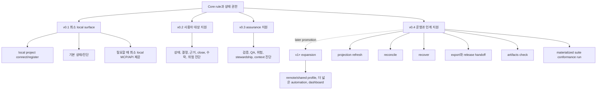

정확한 command name과 flag는 구현마다 달라질 수 있습니다. Reference target은 command-independent behavior contract입니다. Operator behavior의 기준은 Core 상태 기록, `state.sqlite.task_events`, artifact ref와 file, 해당 profile이 존재할 때의 projection job과 freshness, API-owned error 또는 operator diagnostic label입니다. Console text, report prose, flag spelling, shell exit formatting은 표시 접점일 뿐이며 두 번째 상태 모델이 되면 안 됩니다.

동작 family별 운영자 command map:

| Entrypoint family | 동작이 처음 들어오는 단계 | 이런 때 이 section을 봅니다 |
|---|---|---|
| [`harness connect`](#connect) | v0.1 최소 registration, 더 넓은 connector-profile 동작은 승격된 뒤 | repository/runtime registration 의미와 first-connection expectation이 필요할 때 |
| [`harness doctor`](#doctor) | v0.1 기본 진단 subset, full category set은 v0.4 | readiness, diagnostics, repair suggestion, no-new-state reporting boundary가 필요할 때 |
| [`harness serve mcp`](#serve-mcp) | active first slice가 이 local boundary로 MCP/API를 노출할 때만 v0.1 | MCP serving behavior, local availability, Core 권한 경계가 필요할 때 |
| [`harness projection refresh`](#projection-refresh) | 좁은 owner profile이 더 일찍 freshness behavior를 명시적으로 승격하지 않는 한 v0.4 | projection job refresh behavior와 managed-block drift handling이 필요할 때 |
| [`harness reconcile`](#reconcile) | 좁은 owner profile이 더 일찍 proposal/drift handling을 명시적으로 승격하지 않는 한 v0.4 | human edit, generated file, managed-block drift routing이 필요할 때 |
| [`harness recover`](#recover) | v0.4 | interrupted operation repair와 compensating event expectation이 필요할 때 |
| [`harness export`](#export) | v0.4 | bundle과 Release Handoff export behavior가 필요할 때 |
| [`harness artifacts check`](#artifacts-check) | v0.4 | artifact registry/file integrity와 redaction boundary check가 필요할 때 |
| [`harness conformance run`](#conformance-run) | runtime suite가 materialized된 뒤 v0.4, docs-maintenance는 명시적으로 선택되고 별도로 남음 | runtime fixture execution과 docs-maintenance profile 분리가 필요할 때 |

## 운영 진단은 새 상태가 아니라 사실을 보고합니다

Operator output은 사람이 다음 조치를 고를 수 있게 해야 하며, 두 번째 상태 모델을 가르치면 안 됩니다. 유용한 diagnostic line은 category, level, 관찰된 사실, 안전하게 표시할 수 있는 affected record 또는 path, operational effect, next action을 함께 이름 붙입니다. Finding이 diagnostic only인 경우도 분명히 말해야 합니다.

예를 들어 "projection `TASK` is stale"은 사람이 읽는 view가 owner record보다 뒤처졌다는 뜻이지 Task state가 failed라는 뜻이 아닙니다. Report freshness에 의존하는 close/readiness line은 현재 Core state version을 projection `source_state_version` 또는 failed job status와 분리해 보여줘야 합니다. "generated-file drift detected"는 connector-managed file이 manifest와 더 이상 맞지 않는다는 뜻이며, 조용히 덮어쓰지 않고 보고한 뒤 reconcile로 보냅니다. "recovery event appended"는 compensating record로 history를 확장했다는 뜻이지 기존 `task_events`를 rewrite했다는 뜻이 아닙니다.

이 예시는 display guidance입니다. Command flag, state table, event name, public `ErrorCode`, fixture field를 추가하지 않습니다.

Status/next recommendation, Role Lens output, recommended playbook, operator diagnostic은 이후 기존 Core/MCP mutation path가 underlying action을 기록하지 않는 한 read-only guidance입니다. Decision Packet, `prepare_write`, evidence collection, verification, QA, reconcile, repair, export, close attempt를 제안할 수는 있지만, 그 자체로 state를 mutate하거나, write를 허가하거나, gate를 충족하거나, 결과를 수락하거나, 잔여 위험을 받아들이거나, Task를 close하지 않습니다.

## Conformance staging

Conformance는 runtime implementation이 존재한 뒤 단계적으로 실행할 수 있지만, staged execution이 fixture body shape를 바꾸거나 향후 reference conformance 요구사항을 줄이면 안 됩니다. 현재 문서 전용 단계에서 이 section은 향후 적합성 검증 계획이며, fixture file, conformance runner, runnable Harness Server conformance test가 이미 존재한다는 뜻으로 읽으면 안 됩니다.

Build 문서는 첫 실행 가능한 조각과 stage exit를 계획하기 위한 문서 수준 수락 점검을 제공할 수 있습니다. 이 점검은 reviewer가 코어 권한 조각(v0.1 Core Authority Slice)을 좁게 유지하도록 돕지만 fixture field, suite metadata, public request schema, storage row, primary error, runner comparison mode가 아닙니다. 향후 runtime pass/fail은 [Conformance Fixtures 참조](conformance-fixtures.md)의 exact body shape와 assertion semantics를 사용하는 executable fixture에서만 나옵니다.

코어 권한 조각(v0.1 Core Authority Slice)은 첫 실행 가능한 authority-loop target이며, 커널 스모크(Kernel Smoke)는 그 좁은 경로를 실행하는 향후 smoke-check label입니다. Stage exit criteria는 Build의 [첫 실행 가능한 조각](../build/first-runnable-slice.md)이 담당합니다. Exact future runtime fixture queue는 [Conformance Fixtures 참조: Kernel Smoke Authoring Queue](conformance-fixtures.md#kernel-smoke-authoring-queue)가 담당합니다. 최소 Kernel Smoke subset 통과는 첫 내부 Core 권한 경로를 증명하지만 full conformance suite를 요구하지 않고 user-facing MVP fixtures, Agency Assurance Pack fixtures, operations conformance를 주장하지 않습니다.

이후 conformance profile은 [MVP 계획](../build/mvp-plan.md)의 stage name을 따릅니다. Core Authority Slice fixtures는 코어 권한 조각(v0.1 Core Authority Slice)에, User-Facing Harness MVP fixtures는 사용자 대상 하네스 MVP(v0.2 User-Facing Harness MVP)에, Agency Assurance Pack fixtures는 에이전시 보증 팩(v0.3 Agency Assurance Pack)에, Operations & Handoff Pack 또는 promoted-expansion fixtures는 운영과 인계 팩(v0.4 Operations & Handoff Pack)과 승격된 v1+ Expansion candidate에 대응합니다. Exact policy, API, storage, projection, connector, fixture requirement는 각 Reference owner에 남습니다. Suite catalog metadata는 runner selection과 reporting을 위해 scenario를 suite, delivery stage, tag로 group할 수 있지만 Core에 전달되지 않습니다. 향후 executable fixture는 여전히 Core state, events, artifacts, projections/freshness, errors를 통해 검증해야 합니다.

단계별 전달 계획의 guard/freeze conformance는 cooperative/detective level에서 honest display와 behavior를 검증합니다. Freeze request는 work를 보류하거나, next action을 더 엄격하게 만들거나, existing scope가 incompatible할 때 `prepare_write`가 차단 또는 보류하게 만들 수 있습니다. Persistent owner-record change는 기존 Core 상태 변경 경로, Decision Packet route, owner-record update path를 통해 일어날 때만 검증해야 합니다. Guard display는 현재 경로가 cooperative인지 detective인지, 그리고 어떤 위반이 사후에만 감지될 수 있는지 보고합니다. Preventive `T4` guard fixture와 higher guarantee level은 owner 문서가 해당 reference surface의 구체적인 covered operation에 대해 fixture-backed 도구 실행 전 차단을 승격하고 증명하기 전까지 operations/future 또는 v1+ Expansion scope에 남습니다. Isolated-profile conformance는 그 boundary가 verification independence/stale-context control을 뒷받침하는지, 아니면 더 강한 보안 격리를 뒷받침하는지 이름 붙여야 하며, exact mechanism이 증명되지 않은 worktree, fresh evaluator bundle, process split을 OS sandbox 격리나 변조 불가능한 보안 경계로 취급하면 안 됩니다.

Browser QA Capture conformance는 owner 문서가 명시적으로 승격하고 증명하기 전까지 v1+ Expansion roadmap 후보이지 Core Authority Slice fixtures, User-Facing Harness MVP fixtures, Agency Assurance Pack fixtures, Operations & Handoff Pack / promoted-expansion fixtures의 requirement가 아닙니다. [로드맵 승격 규칙](../roadmap.md#승격-규칙)을 통해 승격되기 전까지는 권한 없는 capture support일 뿐입니다. Future fixtures는 capability profile fields, redaction 및 secret/PII handling, browser test environment, artifact 보존, capture artifact mapping, unsupported 접점 fallback 동작, projection-as-canonical 의존성 없음이 정의된 뒤에만 declared `T6 QA Capture` 동작을 증명해야 합니다. Staged-delivery fixtures는 automated browser capture를 요구하지 않고 수동 QA records, artifact refs, QA 면제 동작, 작업 수락 경계, close blockers를 계속 증명합니다.

Connector와 reference-surface smoke coverage도 같은 staged rule을 따릅니다. v0.1에는 fixture owner가 이름 붙인 Kernel Smoke path를 실행할 만큼의 reference-surface coverage만 필요합니다. 이후 단계는 connector honesty, generated-file drift reporting, manual artifact/verification/QA fallback, projection/card display, 이후 [Agent 통합 참조](agent-integration.md#connector-conformance-개요)가 담당하는 connector conformance scenario로 넓어집니다. Preventive `T4`, automated `T6`, remote/shared MCP exposure, broad connector automation은 owner docs가 concrete reference path를 승격하고 증명하기 전까지 v0.1 밖에 둡니다.

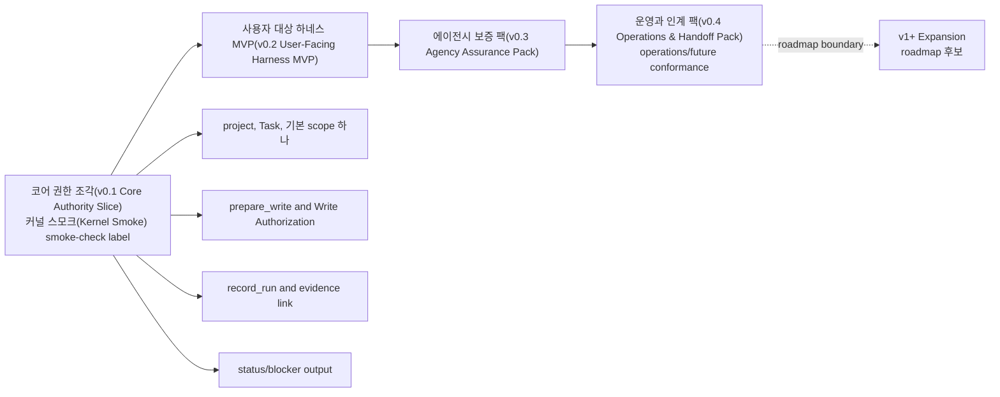

## docs-maintenance 프로필

Docs-maintenance smoke profile은 operator가 실행하거나 사람이 수동 review해서 documentation set의 drift를 잡을 수 있습니다. Documentation drift, owner mismatch, 영어/한국어 file-structure 또는 semantic-section parity gap, owner 밖의 중복 규범 문구, 깨진 link나 anchor, fixture/action schema drift, enum/event/validator/projection drift, glossary/source-of-truth phrasing drift, TODO hygiene 문제를 보고할 수 있습니다. 이런 finding은 문서 유지보수 finding일 뿐입니다. 이 profile은 Markdown docs에 대한 read-only maintenance check이지 Core fixture conformance, runtime validator, evidence, 잔여 위험을 받아들이는 판단, close readiness, 기준 상태 전이가 아닙니다. `task_events`에 추가하거나, artifacts를 만들거나, projections를 refresh하거나, QA 또는 작업 수락 상태를 만들거나, close readiness에 영향을 주거나, runtime 구현 준비 상태를 주장하거나, runtime fixture pass/fail 산정에 포함하면 안 됩니다.

[문서 작성 가이드](../maintain/authoring-guide.md#docs-maintenance-checks)가 rule bodies, pass/warn/fail interpretation, checklist를 담당합니다. 이 문서는 보고와 entrypoint 노출에 대한 operator-maintenance 기대사항만 담당합니다.

최소 operator wiring 계약: `harness conformance run` 또는 다른 operator entrypoint로 제공될 때 docs-maintenance는 명시적으로 선택하는 docs-only profile이며, 관례적 profile name은 `docs-maintenance`입니다. Runtime conformance run은 operator가 이 profile을 선택하지 않는 한 포함하면 안 됩니다. 명시적으로 선택하더라도 runtime Core fixture suite와 별도로 보고하고 runtime fixture pass/fail 또는 구현 준비 상태로 계산하지 않습니다. 이 profile의 `PASS`, `WARN`, `FAIL` label은 docs-maintenance report label이지 Core fixture result가 아니며, 위의 read-only runtime-effect 경계가 그대로 적용됩니다.

Docs-maintenance profile의 console output 또는 ephemeral 보고서만 이 문서에서 정의한 output입니다. 생성되는 운영 보고서 파일은 향후 명시적인 구현 계약이 필요합니다. 이번 문서 batch는 이 check를 위한 stored artifacts, projection jobs, DDL, 상태 기록을 정의하지 않습니다.

Minimum 보고서 fields:

- profile name and documentation revision
- category별 pass, warn, fail
- 가능한 경우 affected file path와 heading 또는 anchor
- 기준 owner doc과 expected source section
- observed documentation finding 또는 drift
- suggested fix class: update owner, replace duplicate with summary plus link, mirror translation, repair link, 또는 [Build: MVP 계획의 서버 코딩 전 필요한 구현 결정](../build/mvp-plan.md#서버-코딩-전-필요한-구현-결정)에 항목 추가
- runtime effect: none; 기준 상태 전이가 수행되지 않았고 runtime fixture result가 기록되지 않았다는 statement

Smoke category는 [문서 작성 가이드의 docs-maintenance checks](../maintain/authoring-guide.md#docs-maintenance-checks)를 다시 정의하지 말고 참조해야 합니다. 필수 category, review-output expectation, pass/warn/fail 의미, owner-first drift resolution flow도 그 section을 따릅니다. Operator output은 해당 category를 이름 붙일 수 있지만 Maintain guidance를 runtime fixture semantics로 바꾸면 안 됩니다.

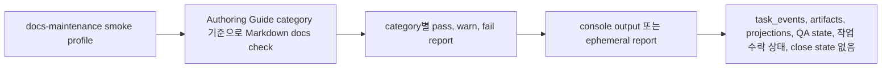

## connect

`connect`는 제품 저장소, 하네스 런타임 홈, 하나의 기준 agent 접점을 연결합니다. Command name은 예시이며, 다른 local registration entrypoint가 같은 동작을 충족할 수 있습니다.

v0.1 최소 동작:

- repository root를 식별합니다
- local project를 등록하거나 재사용합니다
- static project configuration을 만들거나 검증합니다
- Core Authority Slice에 필요한 project별 state와 artifact storage를 초기화합니다
- active local profile에 필요한 수준까지만 기준 접점을 등록합니다
- 해당 stage가 그 boundary를 사용할 때 local-only MCP/API exposure posture를 기록합니다
- stage가 의존하는 경우 최소 MCP/API reachability를 확인하거나 진단을 보고합니다

Active stage 또는 owner profile이 포함할 때만 필수인 나중 profile 동작:

- 기준 접점과, surface name에서 추론하지 않고 실제 사용하는 host/profile/configuration에 대해 선언되고 입증된 capability profile을 등록합니다
- MCP exposure posture를 기본 local-only로, 문서화된 access-control contract와 material class가 있으면 raw token, secret, private configuration value를 저장하지 않고 connector manifest에 기록합니다
- manifest를 통해 connector-managed file을 만들거나 refresh합니다
- Connector Manifest에 connector profile 최신성, capability profile version, detected version, last verification time, conformance 또는 operator-check 근거를 기록합니다
- MCP configuration이 harness server에 닿을 수 있는지 확인합니다
- profile-specific smoke check를 실행하거나 실행할 command를 출력합니다

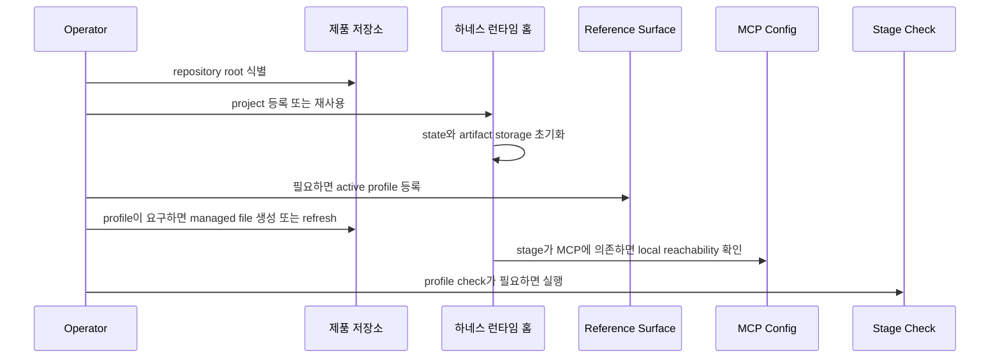

Connector-managed file 또는 managed block이 범위에 있을 때 connect는 사람이 편집한 내용을 조용히 덮어쓰지 않고 generated/managed manifest drift를 보고해야 합니다. 여기에는 generated file, managed block, MCP config snippet, 오래된 capability profile 최신성이 포함됩니다. Existing file 또는 managed block은 reconcile 또는 explicit reconnect decision이 replacement를 선택하기 전까지 그대로 두며, 편집된 generated file은 Task state가 아닙니다. 접점별 generated file 이름은 surface cookbook에 속합니다.

Connect drift output 예시:

```text
surface     WARN  connector-managed file drift
observed    .harness/agent/generated/reference-instructions.md changed since manifest MAN-014
effect      existing file kept; connector manifest/reconcile path records drift
next        diff를 review한 뒤 explicit decision으로 reconcile 또는 reconnect 실행
authority   edited generated file은 Task state가 아니며 조용히 overwrite되지 않았음
```

## doctor

`doctor`는 readiness, drift, repair option을 보고합니다.

Full doctor/readiness category set은 v0.4 Operations & Handoff 동작입니다. 초기 단계는 active stage에 필요한 기본 상태/진단 subset만 노출할 수 있으며 full operations profile을 주장하면 안 됩니다.

Full doctor/readiness category:

| Category | 확인 항목 |
|---|---|
| runtime home | runtime root 읽기 가능성, project directory 존재, `registry.sqlite`, `project.yaml`, project별 `state.sqlite`, artifact directory, lock, storage permission posture, 생성된 운영 path posture, direct file edit가 Core를 우회하는지 여부 |
| project state | registered project, repo root, static config 유효성, current state 읽기 가능성, JSON field parse와 shape 유효성, owner-bound status value, state-version과 idempotency 일관성, active Task 일관성 |
| artifact store | 파일 존재 여부, hash, size, content type, redaction state/status, retention 또는 availability, Task/Run 또는 artifact-link 관계, approved staging boundary, missing 또는 hash-mismatched file |
| reference surface | 실제 host/profile에 대해 선언된 capability profile, profile 최신성, version/MCP config/hook/permission/workspace policy/generated-file/conformance-result/capture/QA-capture/redaction/retention 변경 이후 오래된 capability profile 감지, generated/managed manifest drift, MCP config freshness, required MCP tool-call 가능 여부, 정직한 guarantee display |
| MCP availability | server 도달성, Core 도달성, read resource 사용 가능 여부, public tool 사용 가능 여부, local-only 또는 promoted access posture, `MCP_SERVER_UNAVAILABLE`와 `SURFACE_MCP_UNAVAILABLE` 진단 구분 |
| projections | 대기 중인 job, freshness, managed hash drift, 렌더링 실패 |
| reconcile | 대기 중인 human edit, managed block drift, generated/managed manifest drift |
| validators/checks | 필수 stable ValidatorResult 발행 validator와 별도로 수집되는 Core check/precondition category |
| agency/stewardship/context | Decision Packet과 decision gate 준비 상태, Autonomy Boundary 준비 상태, Residual Risk 가시성, codebase stewardship, context freshness, 오래된 chat/pull-only context를 권한으로 취급하지 않는지 |
| security/threat model | 하네스 런타임 홈, artifact store, reference surface, MCP availability를 가로지르는 local binding/access 기대사항, 등록된 project/Task/surface 일관성, connector drift, 민감 category 부작용, redaction, omission, block 적용 범위. Threat concept은 [보안 위협 모델 참조](security-threat-model.md)가 담당합니다. |

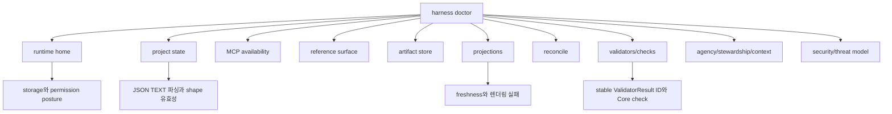

Output level:

```text
OK
WARN
FAIL
REPAIRABLE
MANUAL
```

수준은 operator report level이지 gate value가 아닙니다.

| Level | Meaning |
|---|---|
| `OK` | 확인한 접점, 기록, file을 covered operation에서 사용할 수 있습니다. |
| `WARN` | 낮아진 보장 수준, 최신이 아닌 context, non-blocking risk를 표시한 상태로 work를 계속할 수 있습니다. |
| `FAIL` | Covered operation이 확인한 input 또는 capability에 안전하게 의존할 수 없습니다. |
| `REPAIRABLE` | Core 또는 문서화된 operator path가 사용자 소유 판단을 새로 만들지 않고 기준 상태, 원본 artifact, managed output에서 문제를 repair할 수 있습니다. |
| `MANUAL` | Core가 결과에 의존하기 전에 사람이 inspect, decide, restore, reconnect하거나 missing context를 제공해야 합니다. |

Doctor는 현재 상태 failure와 projection `stale` 또는 projection `failed` status를 구분해야 합니다.

State checks는 `registry.sqlite`와 `state.sqlite`의 JSON `TEXT` fields, owner-bound status-like `TEXT` value, state-version basis, idempotency replay row를 포함합니다. Malformed JSON과 schema-incompatible JSON은 state failure입니다. Unknown owner-bound status value도 state failure입니다. Conformance runner는 Core execution 전에 같은 condition을 invalid fixture/import seed data로 보고할 수 있습니다. Canonical request hash와 stored response linkage를 검증할 수 없는 replay row는 display drift가 아니라 state/security finding입니다. Core가 사용자 소유 판단을 새로 만들지 않고 다른 기준 상태 또는 원본 artifact에서 expected value를 안전하게 재구성할 수 있을 때만 doctor가 이를 `REPAIRABLE`로 표시할 수 있으며, 그렇지 않으면 `FAIL` 또는 `MANUAL`을 보고합니다.

Compact doctor 예시:

| Category | Example report | Operational meaning |
|---|---|---|
| runtime home | `runtime home WARN project directory permissions broader than profile` | Storage posture가 보고되는 guarantee를 낮춥니다. Direct file edit는 여전히 권한이 되지 않습니다. |
| project state | `project state OK repo_root=/repo project_id=PRJ-0001` | Project registration, static config, current state shape를 읽을 수 있습니다. |
| project state | `project state FAIL state.sqlite tasks.current_json malformed` | Current state가 invalid입니다. Projection 문제가 아니며, Core가 shape를 재구성할 수 있을 때만 recovery가 repair할 수 있습니다. |
| MCP availability | `MCP availability FAIL MCP_SERVER_UNAVAILABLE localhost endpoint refused` | MCP를 통해 Core에 닿을 수 없으므로 이 path에서는 authoritative Core response나 state-changing claim이 없습니다. |
| reference surface | `reference surface WARN SURFACE_MCP_UNAVAILABLE required tool not callable by SURFACE-REF` | Core는 reachable일 수 있지만 연결된 접점이 required MCP path를 사용할 수 없습니다. Write-capable work는 guarantee profile에 따라 held 상태입니다. |
| artifact store | `artifact store FAIL ART-204 hash mismatch; evidence_gate may become stale` | Artifact record와 stored file이 일치하지 않습니다. Markdown edit로 evidence를 repair할 수 없습니다. |
| projections | `projections WARN TASK stale source_state_version=41 current_task_state_version=44` | Task state는 여전히 valid할 수 있습니다. 사람이 읽는 `TASK` view가 뒤처졌으므로 refresh 또는 reconcile이 필요합니다. |
| projections | `projections FAIL RUN-SUMMARY failed render_error=template_input_missing` | Projection job이 failed입니다. 이 display failure가 Run record를 failed Run으로 바꾸지는 않습니다. |
| reconcile | `reconcile MANUAL generated-file drift .harness/agent/generated/reference-instructions.md` | Generated file을 보고하고 review로 보냅니다. 조용히 overwrite하거나 state로 취급하지 않습니다. |
| validators/checks | `validators/checks WARN context_hygiene_check stale projection refs` | Stable validator와 Core check는 별도로 보고합니다. Mechanical projection freshness issue는 새 validator ID가 아닙니다. |
| agency/stewardship/context | `agency/stewardship/context FAIL Decision Packet required for user-owned trade-off` | Blocker는 Decision Packet path로 route됩니다. Broad approval이나 status prose만으로 decision을 충족할 수 없습니다. |
| security/threat model | `security/threat model WARN socket permissions broader than profile` | Finding은 보고되는 guarantee를 낮추고 write-capable readiness를 막을 수 있지만, file permission은 기준 상태가 아니라 diagnostic입니다. |

Security-oriented doctor output은 진단 정보이며 새로운 runtime authority를 만들지 않습니다. [보안 위협 모델 참조](security-threat-model.md)의 threat concept을 적용하며, MCP access mode가 로컬 프로세스/localhost 기대사항 또는 문서화된 connector profile과 맞지 않을 때, project/task/surface claim이 registered state와 맞지 않을 때, connector-managed file이 drift되었을 때, artifact에 sensitive category가 요구하는 redaction, omission, block metadata가 없을 때, `destructive_write`, `network_write`, `external_service_write`, `secret_access`, `privacy_or_pii_change`, `data_export`, `infra_or_deployment_change`, `production_config_change`, `ci_cd_change`, `billing_or_cost_change`, `telemetry_or_logging_change` 같은 sensitive operation이 recorded scope/approval/Decision Packet/Write Authorization path 밖에서 나타날 때 이를 보고해야 합니다.

Doctor는 runtime-home file trust posture도 문서 계약 수준에서 확인해야 합니다. Platform에서 관찰 가능한 범위와 risk에 따라, `state.sqlite`, `registry.sqlite`, `project.yaml`, connector config snippet, connector manifest, generated manifest, artifact directory, staging file, generated operational file이 문서화된 local control profile보다 넓게 readable 또는 writable하여 변조, 위조된 configuration, secret/PII 노출이 가능하면 warn 또는 fail해야 합니다. File-permission finding은 진단 정보입니다. Direct file edit를 authoritative하게 만들지 않으며 Core shape, owner, integrity, artifact check를 대체하지 않습니다.

Artifact에 대해서 doctor는 redaction, omission, block metadata가 빠진 상태를 단순 report formatting 문제가 아니라 security finding으로 취급합니다. Core가 artifact 등록 계약을 통해 검증하고 등록할 수 없는 한, raw staged file을 그대로 제자리에 복사하라는 repair를 추천하면 안 됩니다. Doctor가 `secret_omitted` 또는 `blocked`를 보고할 때는 committed artifact ref와 safe metadata만 보고합니다. `blocked`에서는 hash, size, content type이 registered metadata notice bytes를 설명하며, doctor가 Harness에서 forbidden payload를 복구할 수 있다고 말하면 안 됩니다.

Reference local security posture에는 다음 최소 severity 기준선이 있습니다. 구현은 platform 또는 connector에 대해 더 엄격할 수 있지만, 같은 machine에서 reachable하다는 이유만으로 약한 local exposure를 `OK`로 보고하면 안 됩니다.

| 확인 항목 | `OK` 기준선 | `WARN` 기준선 | `FAIL` 기준선 | `MANUAL` 기준선 |
|---|---|---|---|---|
| Runtime Home permissions | Runtime root, project directory, `registry.sqlite`, `project.yaml`, `state.sqlite`, connector manifest, artifact directories, `artifacts/tmp/`, generated operational files가 registered local user/profile에 대해 owner-only 또는 platform-equivalent입니다. | 영향을 받는 path가 선호 기준보다 넓게 readable이지만 writable은 아니고, raw secret/PII 노출이 관찰되지 않으며, 낮아진 보장 수준이 표시됩니다. | State, config, connector manifest, artifact, staging, generated operational path 중 어느 하나라도 unrelated user, group, shared container, 광범위한 local process, off-profile automation에 writable이라 state, config, artifact, connector profile을 위조할 수 있습니다. | Owner/mode/reachability를 판단할 수 없거나, platform semantic이 모호하거나, Core가 결과에 의존하기 전에 사람이 shared mount/container/user boundary를 inspect해야 합니다. |
| Artifact directory exposure | Artifact root와 `artifacts/tmp/`가 registered local profile 밖에서 readable 또는 writable이 아니며, registered artifact가 owner, integrity, redaction, omission, block check를 통과합니다. | Committed artifact directory가 광범위하게 readable이지만 allowed/redacted bytes와 안전한 omission/block metadata만 포함하고, state-changing 또는 export/close-relevant path가 그 exposure에 의존하지 않습니다. | Broad read가 unredacted secret/PII 또는 forbidden capture payload를 노출하거나, broad write가 committed 또는 staged artifact를 poison할 수 있거나, export/verification/QA/close path가 노출된 artifact bytes에 의존합니다. | Sensitivity, owner, retention class, 또는 bytes가 committed인지 staged인지 사람이 review하지 않으면 확정할 수 없습니다. |
| Non-loopback, forwarded, tunneled, shared MCP reachability | MCP가 local process, local socket, localhost loopback, 또는 owner 문서화와 conformance promotion을 거친 connector posture를 통해서만 노출됩니다. | Off-profile endpoint가 read-only diagnostic 용도로만 관찰되고, state-changing tool은 held 상태이며, report가 낮아진 보장 수준과 reconnect/remediation guidance를 보여줍니다. | Non-loopback bind, forwarded/tunneled endpoint, unauthenticated shared endpoint, cloud/CI relay, cross-user socket, remote caller가 promoted connector posture 없이 state-changing, write-capable, product/runtime/code write, close-relevant operation에 사용될 수 있습니다. | Bind scope, tunnel/forwarding state, caller identity, connector-profile coverage를 판단할 수 없습니다. |
| Stale MCP config 또는 connector profile | MCP config, generated/managed manifest, capability profile version, access-control material class, `last_verified_at` 또는 이에 준하는 freshness basis가 registered surface와 일치합니다. | Staleness가 read-only context 또는 display에만 영향을 주고, write-capable work는 held 상태이며, report가 stale file/profile/check를 이름 붙입니다. | Required MCP tool을 호출할 수 없거나, access-control material이 바뀌었거나, profile freshness가 requested operation에 유효하지 않거나, stale config가 surface capability를 과장하거나 local-only posture를 우회하게 할 수 있습니다. | Operator가 reconnect하거나, 의도한 surface/profile을 선택하거나, local access material을 rotate/reissue하거나, Core가 posture를 분류하기 전에 drift를 inspect해야 합니다. |
| Broad local file access risk | Local file access가 registered project/runtime path와 profile assumption 안에 제한되고, authority, artifact, connector behavior를 바꿀 수 있는 broad read/write path가 없습니다. | Broad read-only access가 non-authoritative generated context 또는 이미 redacted된 report에만 영향을 주며, guarantee display가 제한을 보이게 합니다. | Broad read 또는 write access가 secret/PII를 노출하거나, artifact를 poison하거나, 하네스 런타임 홈을 편집하거나, connector config를 spoof하거나, MCP exposure를 넓히거나, `secret_access`, `privacy_or_pii_change`, `data_export`, `network_write`, `external_service_write` 같은 sensitive category에 영향을 줄 수 있습니다. | 영향을 받는 file, user/group boundary, container/shared mount semantic, sensitive-category impact를 사람이 분류해야 합니다. |

보안 진단 표시 예시:

| 관찰된 조건 | Category와 수준 기준 | 보고 내용 |
|---|---|---|
| MCP가 일치하는 connector profile 없이 로컬 프로세스/localhost 밖에 노출되었거나, forwarded, tunneled, stale, unknown으로 보입니다. | `security/threat model`과 `MCP availability`; read-only 보장만 줄어든 경우 `WARN`, 상태 변경 또는 close-relevant 경로가 그 노출에 의존하면 `FAIL`. | 관찰된 bind 또는 access mode, active project, expected surface profile, 낮아진 보장 수준, 다음 진단 또는 reconnect 조치. |
| Runtime Home 권한이 unknown이거나 문서화된 local control profile보다 약합니다. | `security/threat model`; platform observability에 따라 `WARN` 또는 `MANUAL`. | 영향을 받는 경로 분류, 확인 가능한 owner/mode 정보, 파일 권한은 진단 정보일 뿐 기준 상태가 아니라는 알림. |
| Runtime Home에 광범위한 쓰기 권한이 있습니다. | 영향을 받는 영역에 따라 `security/threat model`과 `runtime home`, `project state`, `reference surface`, 또는 `artifact store`; write-capable 준비 상태에서는 보통 `FAIL`. | `state.sqlite`, `registry.sqlite`, `project.yaml`, connector config snippet, connector manifest, generated manifest, artifact 저장소, staging file, 생성 운영 파일에 대한 변조 위험. 직접 편집은 Core/recover/artifact check가 검증하기 전까지 유효하지 않습니다. |
| Artifact directory에 광범위한 읽기 권한이 있습니다. | `security/threat model`과 `artifact store`; 민감도에 따라 `WARN` 또는 `FAIL`. | 원본 값을 노출하지 않고 log, screenshot, token, PII, verification bundle, export에 대한 기밀성 위험을 설명하며 artifact ref, redaction state, 경로 분류를 보고합니다. |
| 등록된 project, Task, surface가 호출자 claim과 맞지 않습니다. | `security/threat model`, `MCP availability`, `reference surface`; 영향을 받는 operation은 `FAIL`. | 안전하게 표시할 수 있는 claimed identifier와 registered identifier, 영향을 받는 tool 또는 surface, claim을 권한 근거로 보지 말고 refresh/reconnect하라는 guidance. |

## serve mcp

`serve mcp`는 local MCP server를 시작하거나 connection information을 출력합니다. Command name은 예시이며, v0.1은 첫 조각에 필요한 어떤 최소 local API/MCP 노출로도 이 계약을 충족할 수 있습니다.

Local MCP/API exposure가 범위에 있을 때의 동작:

- access mode가 로컬 프로세스/localhost only인지, 아니면 documented connector capability profile로 설명되는지 보고합니다
- v0.1/default reference posture에서는 local-only 노출을 기본으로 하고, connector profile이 명시적으로 포괄하지 않는 non-loopback binding 또는 shared/remote endpoint를 피합니다
- MCP가 호출자에게 노출될 때 raw token, secret, private configuration value를 출력하지 않고 문서화된 access-control contract와 material class를 보고합니다. 예: localhost-only binding, Unix-domain socket, per-project token, process-scoped configuration material, 이에 준하는 로컬 제어
- 변경 없이 read resource를 제공합니다
- shell shortcut이 아니라 Core를 통해 public tool을 제공합니다
- 상태 변경 호출이 Core conflict와 idempotency 동작을 사용하게 합니다
- active project와 연결된 접점 profile을 보고합니다
- server가 runtime state 또는 artifact storage에 닿을 수 없으면 명확히 실패합니다

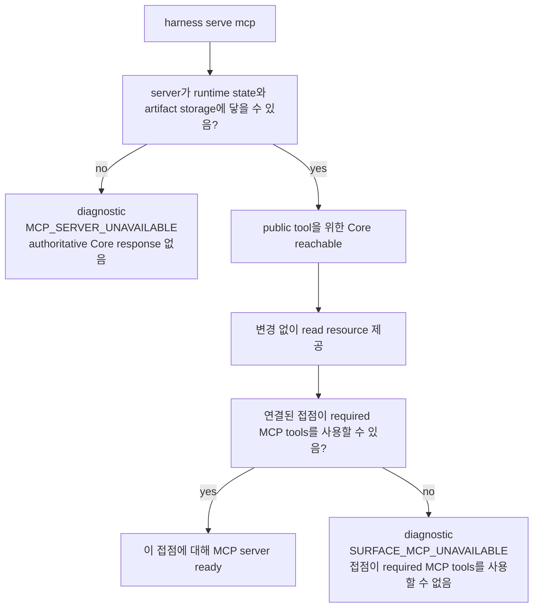

MCP를 사용할 수 없으면 operations는 진단 조건인 `MCP_SERVER_UNAVAILABLE`과 `SURFACE_MCP_UNAVAILABLE`을 구분해야 합니다. 이 이름들은 추가 public `ErrorCode` 값이 아닙니다. 이 조건들을 `ToolError`로 드러낼 때 operations는 API-owned error selection과 details shape를 사용해야 합니다. `MCP_UNAVAILABLE`은 stable public availability code로 남고, 접점-side availability 또는 capability case는 문맥에 따라 `MCP_UNAVAILABLE` 또는 `CAPABILITY_INSUFFICIENT`와 `details.mcp_unavailable_kind`로 표현될 수 있습니다. `MCP_SERVER_UNAVAILABLE`에서는 tool 호출이 Core에 닿을 수 없어 authoritative Core response가 불가능하므로, 상태 변경 주장 전에 server diagnosis 또는 reconnect가 next action입니다. `SURFACE_MCP_UNAVAILABLE`에서는 Core 또는 operator가 연결된 접점에서 사용할 수 있는 MCP가 없거나 MCP configuration이 최신이 아니거나 required MCP tools를 호출할 수 없음을 관찰할 수 있습니다. Cooperative 접점은 product/runtime/code write를 instruction으로 보류해야 하며, stronger profile은 fixture로 입증된 blocking이 해당 operation을 cover할 때만 예방적으로, 또는 입증된 isolation boundary로 보류를 강제할 수 있습니다. Operations는 실제 보장 수준을 그대로 보고해야 합니다.

`serve mcp`는 예상되지 않은 호출자, 문서화된 로컬 프로세스/localhost 기대사항 또는 connector 접근 계약 밖의 호출자, weak socket or config permissions, forwarded 또는 tunneled endpoint, stale connector configuration을 [보안 위협 모델 참조](security-threat-model.md)가 정의하는 위협 모델 문제로 다뤄야 합니다. 사용자가 접점이 Core가 기대하는 접점인지 볼 수 있도록 access mode, active project, surface identity, capability profile을 보고합니다. Spoofed `surface_id`, `actor_kind`, project/task selection을 authority의 증거처럼 보여주면 안 됩니다. Public tool contract는 여전히 Core를 통해 이 claims를 해석하고 검증합니다.

Remote 또는 shared MCP 노출은 opt-in connector posture이지 코어 권한 조각(v0.1 Core Authority Slice)나 staged-delivery `serve mcp` 기본값이 아닙니다. Operations가 이를 사용 가능하다고 표시하기 전에 connector profile은 access-control contract, secret/PII 처리, redaction 또는 omission 동작, guarantee display, 노출된 path가 Core envelope validation이나 compatibility check를 우회하지 않음을 증명하는 conformance scenario를 포괄해야 합니다.

Access mode가 unknown이거나 registered profile보다 약하면 operations는 노출된 권한에 맞는 진단 심각도를 선택해야 합니다. Read-only resource exposure는 사용자가 낮아진 보장 수준을 이해할 수 있으면 warning일 수 있습니다. 상태 변경 tool, product/runtime/code write 경로, close-relevant flow는 과장된 보장 수준으로 조용히 계속 진행하지 말고 fail, hold, 또는 `CAPABILITY_INSUFFICIENT`/`MCP_UNAVAILABLE` 보고로 처리해야 합니다.

`serve mcp` 표시는 접점이 의존하기 전에 로컬 경계를 보이게 해야 합니다. 예를 들어 `0.0.0.0`에 bind된 endpoint, detected forwarded port, registered profile보다 넓은 filesystem permission을 가진 socket, stale per-project token은 off-profile 접근 조건으로 표시하고 active `project_id`, `surface_id`, 보장 수준, held capabilities를 함께 보여줍니다. 이것은 진단 표시에서 보여주는 사실입니다. Public tool call은 계속 Core envelope validation, idempotency, state-version check, API-owned `ToolError` taxonomy에 의존합니다.

## projection refresh

Projection refresh는 커밋된 상태 기록과 artifact ref에서 제품 저장소 Markdown을 다시 생성합니다. 이는 파생 view operation입니다. Freshness, failed jobs, reconcile 필요성을 보고할 수 있지만 Core state, structured blockers, evidence authority, acceptance, 잔여 위험 수용, Write Authorization을 대체하면 안 됩니다.

Projection refresh가 범위에 들어올 때 필수인 동작입니다. 좁은 owner profile이 더 이른 path를 명시적으로 승격하지 않는 한 보통 v0.4 범위입니다.

- target의 latest projection version만 렌더링합니다
- active projection profile에 포함된 projection view만 렌더링하거나 대기열에 넣습니다. 코어 권한 조각(v0.1 Core Authority Slice)에는 persisted Markdown projection이 필요하지 않습니다
- human-editable section을 보존합니다
- overwrite 전에 managed block hash를 비교합니다
- managed-block drift에는 reconcile item을 생성합니다
- projection job을 `completed`, `failed`, `pending`, `skipped`로 표시합니다
- `source_state_version` 또는 동등한 freshness fact를 표시하되 front matter를 state로 취급하지 않습니다
- projection failure를 Task result와 committed Core state에서 분리합니다

지원 target:

```text
하나의 Task
모든 active Tasks
Task의 approval/run/evidence/eval/direct reports
활성화된 design-quality projections
```

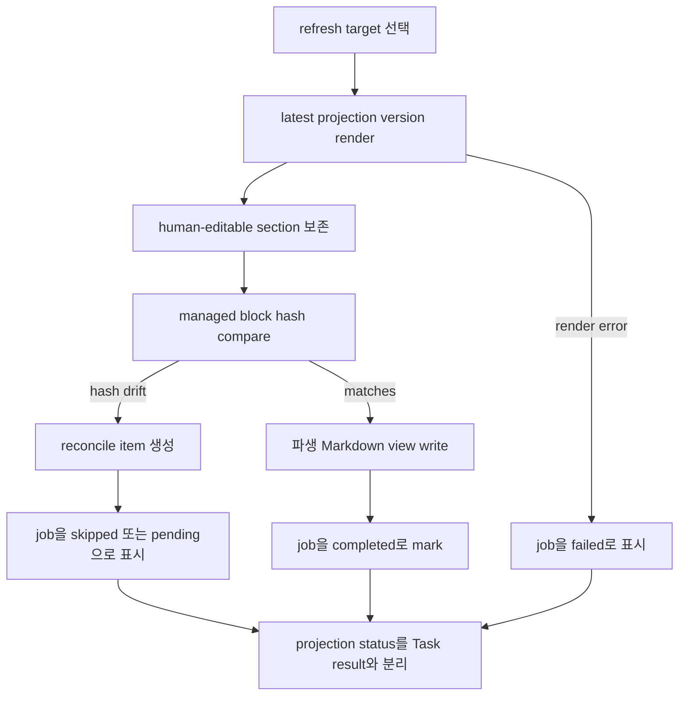

단계별 전달 계획에서 Decision Packet visibility는 status/next responses, judgment-context resources, decision-packet resources, 최소 `TASK` 또는 card display를 통해 렌더링합니다. 현재 위치 맥락은 먼저 간결한 status/next 출력으로 렌더링합니다.

Standalone `DEC`, `DESIGN`, `EXPORT`, persisted `JOURNEY-CARD`, Run Summary, Evidence Manifest, detailed Eval, TDD Trace, Module Map, Interface Contract projection을 위한 dedicated refresh target은 기능이 켜져 있을 때만 사용하는 profile-gated Future/diagnostic projections 또는 Operations/export reports이며, 커널 스모크(Kernel Smoke) 필수 대상이 아닙니다.

Projection support는 source-backed입니다. Persisted projection support를 사용할 때 `TASK` minimal summary는 User-facing MVP summaries path이고, `DIRECT-RESULT`는 해당 profile이 active일 때만 compact direct-work summary입니다. `APR`과 `MANUAL-QA`는 해당 profile이 active일 때 Agency assurance reports에 속합니다. `EXPORT`는 export 또는 handoff support가 enabled될 때 Operations/export reports에 속합니다. `RUN-SUMMARY`, `EVIDENCE-MANIFEST`, `EVAL`, `TDD-TRACE`, `MODULE-MAP`, `INTERFACE-CONTRACT`, `DESIGN`, persisted `JOURNEY-CARD` 같은 detailed report는 owner profile이 승격하지 않는 한 Future/diagnostic projections입니다. Projection refresh는 template을 채우기 위해 state를 만들지 말고 source record가 없음을 unavailable 또는 not applicable로 보고해야 합니다.

Projection refresh status 예시:

| Report line | Meaning |
|---|---|
| `TASK current source_state_version=44` | 렌더링된 `TASK` view가 committed Task state version 및 managed hash와 일치합니다. |
| `TASK stale source_state_version=41 current_task_state_version=44` | State가 렌더링된 view보다 앞서 이동했습니다. Task result가 failed된 것이 아니며, view에 refresh 또는 reconcile이 필요합니다. |
| `RUN-SUMMARY failed projection_job_id=PJOB-088` | Latest render가 failed입니다. Committed Run은 자기 `runs.status`를 유지하며 projection failure는 별도로 보고됩니다. |
| `APR skipped managed_block_drift reconcile_item=REC-019` | Projector가 변경된 managed block을 overwrite하지 않고 drift를 reconcile로 보냈습니다. |
| optional `EXPORT` projection enabled: `EXPORT stale artifact ART-204 unavailable` | Optional `EXPORT` projection/report surface가 켜진 경우에만 해당합니다. `EXPORT`를 커널 스모크(Kernel Smoke) 또는 초기 필수 refresh target으로 만들지 않으며, underlying Task state가 failed했다는 증거도 아닙니다. |

## reconcile

Reconcile은 human-editable input 또는 generated/managed drift를 명시적인 decision으로 바꿉니다.

Proposal path는 human-editable proposal -> reconcile item -> 추가된 `state.sqlite.task_events` row가 있는 accepted Core state-changing action, 또는 reject, defer, note 전환입니다. Managed-block direct edit도 같은 reconcile 경계에 있는 drift이며 state change가 아닙니다.

Target:

- Task user notes and proposals
- managed block edits
- Domain Language proposals
- Module Map proposals
- Interface Contract proposals
- connector generated/managed manifest drift
- 현재 작업에 영향을 주는 최신이 아닌 projection references

Decision outcome:

| Outcome | Meaning |
|---|---|
| merge | Core를 통해 proposal을 적용하고 state history에 추가합니다 |
| reject | 기준 상태를 그대로 두고 필요하면 projection을 refresh합니다 |
| convert_to_note | content를 state가 아닌 human note로 보존합니다 |
| create_decision | proposal을 pending user decision으로 전환합니다 |
| defer | reconcile item을 open 상태로 유지합니다 |

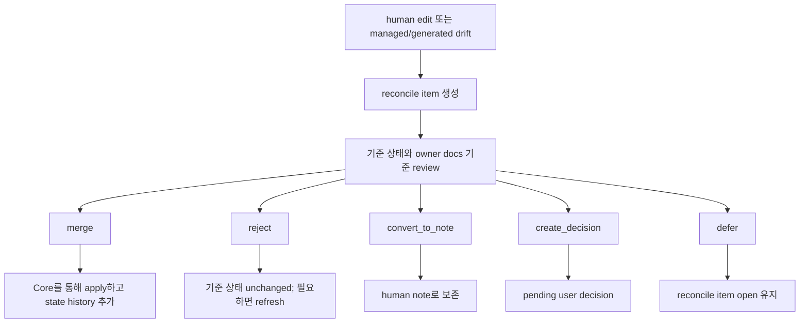

Reconcile은 edited Markdown 자체를 기준 상태로 취급하면 안 됩니다.

Reconcile이 generated-file 또는 managed-block drift를 보고할 때는 어떤 source가 edit되었는지, 어떤 owner 또는 manifest가 기대값인지, 어떤 decision path가 열려 있는지 보여줘야 합니다. `merge` outcome은 Core를 통해 적용되고 state history를 append합니다. `reject` 또는 `convert_to_note` outcome은 기준 상태를 그대로 두며, owner record에서 projection 또는 generated file을 다시 refresh할 수 있습니다.

## recover

Recover는 history를 rewrite하지 않고 interrupted 또는 inconsistent 운영 상태를 repair합니다.

필수 recovery class:

| Scenario | Recovery behavior |
|---|---|
| interrupted agent write | `runs.status=interrupted`인 recovery Run 또는 동등한 interrupted recovery record를 commit하고 가능하면 diff/log artifact를 캡처합니다. Captured artifacts는 recovery evidence일 뿐이며 successful completion의 증거가 아닙니다 |
| baseline drift | fresh baseline 또는 compatible owner path가 생길 때까지 영향을 받는 baseline-dependent write, verification, evidence, approval, close readiness를 `stale` 또는 blocked로 표시합니다 |
| approval drift | scope, baseline, sensitive category, expiry, actor context가 더 이상 맞지 않으면 Approval을 만료, 축소, 또는 재요청합니다. 오래된 Approval을 broad authorization으로 바꾸지 않습니다 |
| evaluator repo drift | verification을 blocked로 표시하거나 evidence를 `stale`로 표시하고 fresh evaluator bundle 또는 Eval path를 요구합니다. Drifted observation에서 분리 검증 passed를 설정하지 않습니다 |
| artifact missing 또는 hash mismatch | file을 다시 scan하고 missing 또는 hash-mismatched artifact를 `stale` 또는 blocked로 표시하며 registered hash를 보존하고, recovery가 가능하면 Core를 통해 정확한 bytes를 restore하거나 replacement를 등록합니다 |
| projection failure | committed source record에서 retry하거나 failed로 표시하고 reconcile guidance를 생성합니다. Task result를 바꾸거나 rendered report에서 state를 만들어내지 않습니다 |
| managed Markdown direct edit | reconcile item을 만들고 explicit reconcile decision이 Core를 통해 적용되기 전까지 기준 상태를 그대로 둡니다 |
| malformed or schema-incompatible storage JSON | Core가 기준 상태 또는 원본 artifact에서 expected shape를 재구성할 수 있을 때만 repair합니다. 그렇지 않으면 fail하거나 manual recovery를 요구합니다 |
| idempotency replay mismatch | original committed replay row를 보존하고 changed request에는 `STATE_CONFLICT`를 보고하며, 새 artifact, event, projection job, response field를 old result에 merge하지 않습니다 |
| expired lock | recovery event를 추가하고 lock policy에 따라 release하거나 reacquire합니다 |
| MCP unavailable | 진단 조건인 `MCP_SERVER_UNAVAILABLE` 또는 `SURFACE_MCP_UNAVAILABLE`을 보고하고, product/runtime/code write를 계속 보류하며, next diagnosis 또는 reconnect step을 제시합니다 |
| surface capability mismatch | owner path가 허용하는 곳에서 `surface_capability_check`를 보고하거나 emit하고 guarantee display를 낮춥니다. Preventive blocking을 주장하지 않고 기존 `CAPABILITY_INSUFFICIENT`, `MCP_UNAVAILABLE`, blocked-reason path로 unsafe write를 hold 또는 fail합니다 |
| local security posture weak 또는 unknown | Runtime Home permissions, artifact directory exposure, MCP reachability, stale MCP config, broad local file access에 대해 doctor와 같은 `OK`/`WARN`/`FAIL`/`MANUAL` posture class를 보고하고, posture가 진단될 때까지 write-capable 또는 close-relevant recovery를 보류합니다 |

```mermaid
flowchart TD
  Scenario["failure scenario"] --> Classify["recovery path 분류"]
  Classify --> Interrupted["interrupted agent write<br/>runs.status=interrupted"]
  Classify --> Baseline["baseline drift"]
  Classify --> Approval["approval drift"]
  Classify --> Eval["evaluator repo drift"]
  Classify --> Evidence["artifact missing 또는 hash mismatch"]
  Classify --> Projection["projection failure 또는 managed Markdown direct edit"]
  Classify --> Storage["malformed 또는 schema-incompatible storage JSON"]
  Classify --> Replay["idempotency replay mismatch"]
  Classify --> Lock["expired lock"]
  Classify --> MCP["MCP unavailable"]
  Classify --> Capability["surface capability mismatch"]
  Classify --> Security["local security posture weak 또는 unknown"]
  Interrupted --> Event["compensating event 추가"]
  Baseline --> Stale["affected readiness stale/blocked 표시"]
  Approval --> Reapprove["approval expire, narrow, 또는 re-request"]
  Eval --> Verify["fresh bundle/path 전까지 verification block"]
  Evidence --> Artifact["hash 보존; exact bytes restore 또는 replacement 등록"]
  Projection --> Recon["retry, fail, 또는 reconcile guidance 생성"]
  Storage --> Repair["기준 상태 또는 원본 artifact에서만 repair"]
  Replay --> Conflict["original replay 보존 및 STATE_CONFLICT 보고"]
  Lock --> Release["policy에 따라 release 또는 reacquire"]
  MCP --> Hold["product/runtime/code write hold와 diagnose"]
  Capability --> Hold
  Security --> Hold
```

Recovery는 compensating event를 추가할 수 있습니다. Evidence를 조용히 delete하거나, event history를 rewrite하거나, projection을 authoritative하게 만들거나, successful run evidence를 만들어내거나, verification 또는 QA를 passed로 설정하거나, 결과를 수락하거나, 잔여 위험을 받아들이거나, Task를 close하면 안 됩니다.

Recovery report 예시:

```text
before      task_events max event_seq=104; active run observed during write
action      recovery classified interrupted write
after       appended recovery/audit task_events after event_seq=104
after       committed recovery Run with runs.status=interrupted
artifacts   registered safe diff/log snapshots when available
not done    no earlier task_events rewritten; no evidence silently deleted
not done    no Markdown projection edited into canonical state
```

Captured recovery artifact는 interruption 또는 repair 중 관찰된 내용을 설명할 수 있습니다. 하지만 interrupted implementation이 성공적으로 완료되었다는 증거가 아니며, 그 자체로 evidence, verification, QA, 작업 수락, 잔여 위험을 받아들이는 판단, close를 충족할 수 없습니다.

## export

Export는 Task에 대한 review 또는 archival bundle을 만듭니다.

필수 contents:

- created time, Task id 또는 ids, included state/event version range, projection freshness, export profile, redaction status summary가 있는 export manifest
- Task와 related Core record의 state snapshot. Snapshot을 이해하는 데 필요한 안전한 state/event version fact를 포함하되 새 DDL 또는 두 번째 state store를 만들지 않습니다
- Decision Packets, user decisions, accepted-risk metadata/refs가 포함된 residual risks, Journey Spine entries 또는 continuity refs, 관련 Change Unit Autonomy Boundary summary
- relevant report projection snapshot. current/stale/failed/omitted freshness status를 포함합니다
- artifact reference, owner relation, integrity metadata, redaction status, retention/availability, 그리고 허용되는 경우에만 포함되는 raw artifact file
- artifact integrity manifest
- 포함된 ref의 retention status. 여기에는 bundle에 복사된 retained raw file과 bundle에서 생략된 expired 또는 unavailable artifact가 포함됩니다
- omitted secret, sensitive log, screenshot, network trace, telemetry/logging content, PII에 대한 redaction, omission, block note

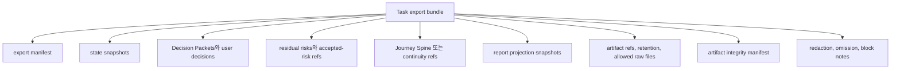

Exported projection snapshot은 hash를 가질 수 있지만, 그렇다고 Markdown projection이 기준 evidence가 되지는 않습니다. Raw evidence는 artifact file과 registered ref로 남습니다.

Export output은 Core state, `task_events` version fact, artifact record와 file, projection record/snapshot, 기존 error 또는 diagnostic outcome에서 파생됩니다. Report prose, recovery artifact, stale projection, chat text, operator console output에서 성공을 추론하면 안 됩니다.

Export는 policy가 적용될 때 `data_export` category side effect입니다. Export는 artifact boundary를 보존해야 합니다. 포함되는 raw file은 허용된 registered artifact로 제한하고, projection snapshot은 snapshot으로 남기며, bundle은 제거되었거나 blocked된 secret, sensitive log, screenshot, network trace, telemetry/logging content, PII에 대한 redaction, omission, block note를 포함해야 합니다.

Export는 staged, omitted, blocked content에 대한 접근 범위를 넓히면 안 됩니다. `secret_omitted` artifact는 ref, 안전하게 저장된 bytes에 대한 hash, omission note 또는 handle로 표현합니다. `blocked` artifact는 커밋된 metadata-only notice로 표현하며 사용할 수 없는 원본 근거로 나열해야 합니다. 이 artifact의 hash, size, content type은 금지된 payload가 아니라 notice bytes를 가리킵니다. Export manifest는 secret 또는 PII value를 포함하지 않고 영향을 받는 artifact ref, redaction, omission, block category, evidence, QA, verification, projection, Release Handoff 표시를 이름 붙여야 합니다.

Retention은 export가 artifact policy를 우회하는 경로가 되게 하지 않습니다. Retained artifact도 export profile, redaction status, owner relation, integrity check가 raw 포함을 허용할 때만 복사할 수 있습니다. Expired, unavailable, `secret_omitted`, `blocked` artifact는 ref, safe metadata, omission/block note로만 표현합니다. Export는 log, Markdown report, projection, chat text, staging path에서 raw bytes를 다시 만들거나 복구하면 안 됩니다.

Export manifest summary 예시:

```yaml
task_id: TASK-1234
created_at: 2026-05-10T09:30:00Z
included_projection_freshness:
  TASK: current
  EVAL: stale
export_bundle_status: current
decision_packet_refs:
  included: [DEC-010, DEC-011]
residual_risks:
  visible_refs: [RISK-004]
  accepted_refs: [RISK-002]
artifact_integrity:
  checked: 18
  passed: 17
  unavailable: [ART-204]
redaction_summary:
  redacted: 2
  omitted_secrets: 1
  secret_omitted: 1
  blocked: 1
retention_summary:
  retained_raw_files_included: [ART-101, ART-102]
  expired_or_unavailable: [ART-204]
omitted_artifacts:
  - artifact_id: ART-204
    reason: blocked
    note: metadata-only notice included; raw payload unavailable
```

이 display shape는 예시입니다. 필요한 동작은 export가 included projection freshness, artifact integrity, Decision Packets, residual risks, omitted 또는 blocked artifacts, redaction/omission/block effect를 보고하면서 raw staged, omitted, blocked, secret, PII value를 bundle에 복사하지 않는 것입니다. `export_bundle_status`는 생성 중인 bundle에 대한 report status이며, canonical state record나 required `EXPORT` projection job이 아닙니다.

### Release Handoff Export Profile

Release Handoff는 release readiness visibility를 위한 optional 보고서/export profile입니다. Harness에 deployment 권한을 주지 않으면서 GStack-style ship summary가 필요할 때 유용합니다.

이 profile은 다음을 요약합니다.

- close readiness, 활성 blocker, 다음 close-relevant action
- evidence ref, verification ref, 수동 QA ref, residual-risk ref
- changed file과 affected Change Unit scope
- projection freshness와 `stale`, failed, omitted projection snapshot
- retained raw file과 export에서 생략된 expired 또는 unavailable artifact를 포함한 artifact retention과 availability
- secret, sensitive log, PII, omitted artifact, blocked artifact에 대한 redaction/omission/block note
- 사용자 external system을 위한 suggested PR, review, deployment, rollback, monitoring checklist item

Release Handoff는 `EXPORT` projection/보고서로 렌더링되거나, export bundle에 포함되거나, ephemeral 보고서 접점으로 반환될 수 있습니다. 새로운 deployment 권한 기록을 만들지 않습니다.

Boundary:

- Deployment, merge, Approval, production monitoring, VCS review 권한은 Harness 밖에 남습니다.
- Release Handoff는 그 자체로 Task close, deploy, merge, approve, 잔여 위험을 받아들이는 판단, 작업 수락, QA 또는 verification 면제, assurance level 상승, gate 충족을 하지 않습니다.
- Suggested checklist item은 advisory입니다. 차단하는 사용자 소유 판단, 잔여 위험을 받아들이는 판단, 수동 QA, evidence, verification, Approval 필요성을 드러내면, 그 need는 기존 Decision Packet, evidence, 수동 QA, Eval, residual-risk, Approval, close path로 라우팅됩니다.

진단 및 보고 경계: future [Local Derived Metrics](../roadmap.md#local-derived-metrics)는 owner 문서가 승격하기 전까지 보고서 또는 operator diagnostic에서 읽기 전용 파생 표시로만 나타날 수 있습니다. Operational authority를 만들지 않으며, 전체 metric 경계는 roadmap section을 사용합니다.

Release Handoff catalog entry:

| Scenario ID | Operator action | Required assertions |
|---|---|---|
| `EXPORT-release-handoff-does-not-close-or-deploy` | `export` 또는 보고서 read | Release Handoff 보고서/export를 생성하거나 반환할 때 close readiness, blocker, evidence ref, verification ref, 수동 QA ref, residual-risk ref, changed file, projection freshness, artifact retention/availability, redaction/omission/block note, advisory PR/deploy/rollback/monitoring checklist item을 포함할 수 있습니다. 보고서/export만으로는 Task lifecycle을 변경하거나, gate를 충족하거나, evidence를 만들거나, verification을 수행 또는 기록하거나, QA를 기록하거나, QA 또는 verification을 면제하거나, 잔여 위험을 받아들이거나, 결과를 수락하거나, Task를 닫거나, merge, deploy, production monitoring, assurance level 상승, deployment/merge 권한 생성을 하면 안 됩니다. Checklist finding이 차단하는 사용자 소유 판단, 잔여 위험을 받아들이는 판단, 수동 QA, evidence, verification, Approval 필요성을 드러내면 기존 Decision Packet, evidence, 수동 QA, Eval, residual-risk, Approval, close path로 라우팅합니다. |

## artifacts check

Artifact integrity check는 artifact record와 stored file을 비교합니다.

필수 check:

- file 존재
- hash 일치
- size 일치
- content type이 known이거나 명시적으로 `other`입니다
- redaction state가 valid입니다
- task/run 또는 artifact-link relation이 valid입니다
- linked state owner가 artifact link와 같은 Task scope에 존재하거나, `record_kind=projection`이 completed same-Task `projection_jobs` row로 해석됩니다
- unregistered staging path나 arbitrary `staged_uri`를 committed artifact로 받아들이지 않습니다
- owner-link relation semantics가 artifact kind와 호환됩니다. 여기에는 kind가 `bundle`, `manifest`, `export_component`인 artifacts가 포함됩니다
- projection artifact links에서는 `artifact_links.record_id`가 `projection_jobs.projection_job_id`와 같아야 합니다. Integrity는 separate `projections` table을 찾지 않고 artifact link와 같은 Task scope, `target_ref`, `status=completed`, `output_path` 또는 documented projection ref를 통해 해당 job/output identity를 검증합니다. Project-level projection jobs는 current Task-scoped artifact API에서 project-scoped artifact links가 아닙니다
- bundle, manifest, export-component artifacts는 artifact row와 owner links를 통해 검증합니다. Check가 존재하지 않는 `verification_bundle` 또는 `export` state table을 찾으면 안 됩니다
- secret/PII handling이 `redaction_state` 및 export 또는 capture note와 호환됩니다
- `secret_omitted` artifact는 omission note 또는 handle을 포함하고 생략된 원본 value를 포함하지 않습니다
- `blocked` artifact는 커밋된 metadata-only notice이며 금지된 capture payload를 포함하지 않습니다. Hash, size, content type은 metadata-only notice bytes와 일치해야 합니다.
- retention class가 valid이며 retained bytes 또는 expired/unavailable refs를 보고하되 expired 또는 unavailable bytes를 current evidence로 취급하지 않습니다
- projection 또는 evidence ref를 찾을 수 있습니다

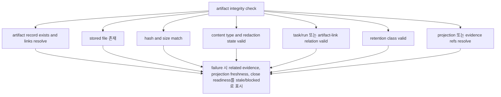

Failure는 Core rule에 따라 related evidence, projection freshness, close readiness를 `stale`/blocked로 표시해야 합니다. Missing artifact는 Markdown 보고서를 edit해서 고치는 것이 아닙니다.

Artifact check가 `secret_omitted` 또는 `blocked`를 관찰하면 이후 operation은 그 영향을 숨기지 않고 보고합니다. Evidence Manifest와 QA view는 omitted 또는 blocked ref를 표시하고, 분리 검증은 Eval path가 omission을 받아들이거나 다른 documented resolution이 적용되지 않는 한 사용할 수 없는 원본 bytes를 missing input으로 취급합니다. Projection 표시는 포함된 content 대신 redaction state를 보여주고, export/Release Handoff summary는 값을 노출하지 않고 omission 또는 block을 나열합니다. `secret_omitted`는 secret이 아닌 evidence가 보이는 주장만 뒷받침할 수 있습니다. `blocked`는 attempted capture를 audit 가능하게 보존하지만, replacement, waiver, Decision Packet outcome, accepted risk, documented fallback이 path를 해소하기 전까지 dependent evidence, QA, Eval, projection, export, Release Handoff input을 blocked, insufficient, unavailable, unresolved 중 적절한 상태로 남깁니다.

Artifact check 진단은 staged input의 경계 위반도 보여야 합니다. `staged_uri`가 project `artifacts/tmp/` 밖으로 해석되거나, symlink를 통해 벗어나거나, parent traversal을 사용하거나, 임의 absolute path를 이름으로 지정하거나, approved capture adapter 밖의 repo-local file을 가리키면 approved staging/capture boundary 밖으로 보고합니다. 보고서는 안전한 경우 영향을 받는 locator와 owner relation을 이름 붙이고, 기존 artifact/check result를 통해 artifact input을 유효하지 않거나 사용할 수 없는 것으로 표시하며, 금지된 대상을 Harness 근거로 복사하거나 hash하거나 표시하거나 export하면 안 됩니다.

Compact artifact check 예시:

| Finding | Reported effect |
|---|---|
| `ART-101 OK hash and size match` | Artifact는 normal gate rule에 따라 owner ref에서 사용할 수 있습니다. |
| `ART-204 FAIL hash mismatch` | Related evidence, projection freshness, close readiness가 Core rule에 따라 `stale`/blocked가 됩니다. |
| `ART-301 WARN redaction_state=secret_omitted` | Safe ref와 omission note만 표시하며, 생략된 raw value는 표시하거나 export하지 않습니다. |
| `ART-302 FAIL redaction_state=blocked` | Metadata-only notice가 committed됩니다. Dependent evidence, QA, Eval, projection, export, Release Handoff input은 해소될 때까지 unavailable로 남습니다. |
| `staged_uri MANUAL outside approved staging boundary` | Caller-supplied path를 committed evidence로 copy, hash, display, export, accept하지 않습니다. |

## conformance run

향후 `conformance run`은 보통 runtime suite가 materialized된 뒤 v0.4 또는 나중 단계에서 들어오는 operations-profile surface입니다. 선택한 fixture suite 또는 명시적으로 선택한 docs-only maintenance profile을 실행합니다. Runtime suite는 MCP tool과 operator command가 쓰는 것과 같은 Core entrypoint를 사용하며, exact-shape fixture가 captured state, events, artifacts, projections/freshness, errors를 비교할 때만 pass/fail이 결정됩니다. Docs-maintenance는 별도의 read-only profile로 남으며 runtime fixture pass/fail과 구현 준비 상태에 포함하지 않습니다.

### Conformance 탐색 지도

| 찾는 것 | 볼 곳 |
|---|---|
| `harness conformance run` entrypoint, runtime/docs-maintenance 분리, operator reporting boundary | 이 section과 [docs-maintenance 프로필](#docs-maintenance-프로필) |
| 정확한 fixture body field, runner loading/execution, default comparison mode | [Conformance Fixtures 참조](conformance-fixtures.md#conformance-탐색-지도) |
| Suite intent와 작성 순서 | [Conformance staging](#conformance-staging), 그다음 [검증 프로파일별 증명 동작](conformance-fixtures.md#검증-프로파일별-증명-동작), [커널 스모크(Kernel Smoke) Authoring Queue](conformance-fixtures.md#kernel-smoke-authoring-queue), [향후 Fixture Catalog: Fixture Suites](future-fixture-catalog.md#fixture-suites) |
| Concern별 향후 executable 예시와 catalog-only future candidate | [향후 Fixture Catalog: Fixture 예시 지도](future-fixture-catalog.md#fixture-예시-지도) |

Operator boundary: 이 문서는 operator entrypoint, runtime/docs-maintenance profile 분리, conformance overview를 담당합니다. [Conformance Fixtures 참조](conformance-fixtures.md)는 fixture body shape, assertion semantics, suite catalog metadata boundary, 검증 프로파일, 축소된 Kernel Smoke queue를 담당합니다. [향후 Fixture Catalog](future-fixture-catalog.md)는 detailed future example과 catalog-only candidate를 담당합니다. Runtime conformance가 구체화되면 runtime suite pass/fail은 계속 executable-state-based이며, rendered prose만으로는 conformance를 통과할 수 없습니다.

### Conformance Fixture Format

[Conformance Fixtures 참조: Conformance Fixture Format](conformance-fixtures.md#conformance-fixture-format)으로 이동했습니다. 이 stub은 이전 anchor를 보존합니다. Fixture body shape, seed shorthand limit, `ToolEnvelope` expansion convention은 그 문서가 담당합니다.

### Conformance Execution

[Conformance Fixtures 참조: Conformance Execution](conformance-fixtures.md#conformance-execution)으로 이동했습니다. Runner isolation, loading, seeding, execution, capture, comparison behavior는 그 문서가 담당합니다.

### Fixture Assertion Semantics

[Conformance Fixtures 참조: Fixture Assertion Semantics](conformance-fixtures.md#fixture-assertion-semantics)로 이동했습니다. State, event, artifact, projection, error, validator, structured blocker의 assertion mode는 그 문서가 담당합니다.

### Agency, Stewardship, Context, Design-Quality Suite

[향후 Fixture Catalog: Agency, Stewardship, Context, Design-Quality Suite](future-fixture-catalog.md#agency-stewardship-context-design-quality-suite)로 이동했습니다. Suite responsibility와 read-only recommendation boundary는 승격 전까지 future catalog guidance입니다.

#### Catalog-Only Fixture Skeleton Guidance

[Conformance Fixtures 참조: Catalog-Only Fixture Skeleton Guidance](conformance-fixtures.md#catalog-only-fixture-skeleton-guidance)로 이동했습니다. Catalog skeleton guidance는 executable fixture body가 아닙니다.

#### Kernel Smoke Authoring Queue

한국어 표현: 커널 스모크 작성 순서.

[Conformance Fixtures 참조: 커널 스모크(Kernel Smoke) Authoring Queue](conformance-fixtures.md#kernel-smoke-authoring-queue)로 이동했습니다. 이 queue는 fixture 작성 순서이지 fixture-body metadata가 아닙니다.

#### Intake와 Decision Catalog Entries

[향후 Fixture Catalog: Intake와 Decision Catalog Entries](future-fixture-catalog.md#intake와-decision-catalog-entries)로 이동했습니다. Catalog row는 exact-shape fixture로 구체화되기 전까지 guidance입니다.

### Staged Fixture Coverage

[향후 Fixture Catalog: Staged Fixture Coverage](future-fixture-catalog.md#staged-fixture-coverage)로 이동했습니다. Staged suite coverage map은 승격 전까지 future catalog guidance입니다.

### Fixture 예시 지도

[향후 Fixture Catalog: Fixture 예시 지도](future-fixture-catalog.md#fixture-예시-지도)로 이동했습니다. Concern-specific fixture example은 그 문서가 담당합니다.

### Core Fixture 예시

[향후 Fixture Catalog: Core Fixture 예시](future-fixture-catalog.md#core-fixture-예시)로 이동했습니다.

### Agency Fixture 예시

[향후 Fixture Catalog: Agency Fixture 예시](future-fixture-catalog.md#agency-fixture-예시)로 이동했습니다.

### Connector Fixture 예시

[향후 Fixture Catalog: Connector Fixture 예시](future-fixture-catalog.md#connector-fixture-예시)로 이동했습니다.

#### Connector Agency Catalog Entries

[향후 Fixture Catalog: Connector Agency Catalog Entries](future-fixture-catalog.md#connector-agency-catalog-entries)로 이동했습니다.

### Design-Quality Fixture 예시

[향후 Fixture Catalog: Design-Quality Fixture 예시](future-fixture-catalog.md#design-quality-fixture-예시)로 이동했습니다.

### Stewardship Fixture 예시

[향후 Fixture Catalog: Stewardship Fixture 예시](future-fixture-catalog.md#stewardship-fixture-예시)로 이동했습니다.

#### Stewardship Catalog Entries

[향후 Fixture Catalog: Stewardship Catalog Entries](future-fixture-catalog.md#stewardship-catalog-entries)로 이동했습니다.

### Context Hygiene Fixture 예시

[향후 Fixture Catalog: Context Hygiene Fixture 예시](future-fixture-catalog.md#context-hygiene-fixture-예시)로 이동했습니다.

#### Context Hygiene Catalog Entries

[향후 Fixture Catalog: Context Hygiene Catalog Entries](future-fixture-catalog.md#context-hygiene-catalog-entries)로 이동했습니다.

#### Core, Projection, Reconcile, Verification Boundary Catalog Entries

[향후 Fixture Catalog: Core, Projection, Reconcile, Verification Boundary Catalog Entries](future-fixture-catalog.md#core-projection-reconcile-verification-boundary-catalog-entries)로 이동했습니다.

#### v1+ Expansion Browser QA Capture Candidate Entries

[향후 Fixture Catalog: v1+ Expansion Browser QA Capture Candidate Entries](future-fixture-catalog.md#v1-expansion-browser-qa-capture-candidate-entries)로 이동했습니다. Owner docs가 승격하고 증명하기 전까지 catalog-only future candidate로 남습니다.

### Fixture Suites

[향후 Fixture Catalog: Fixture Suites](future-fixture-catalog.md#fixture-suites)로 이동했습니다. Suite catalog grouping과 fixture-family summary는 승격 전까지 future catalog guidance입니다.

### Metrics Boundary

[Conformance Fixtures 참조: Metrics Boundary](conformance-fixtures.md#metrics-boundary)로 이동했습니다. Long-term operational metric은 future owner docs가 승격하기 전까지 derived analytics로 남습니다.
