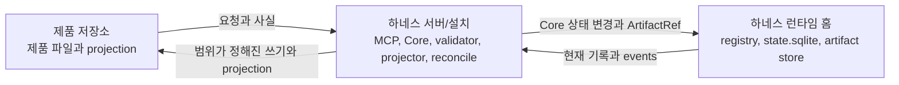
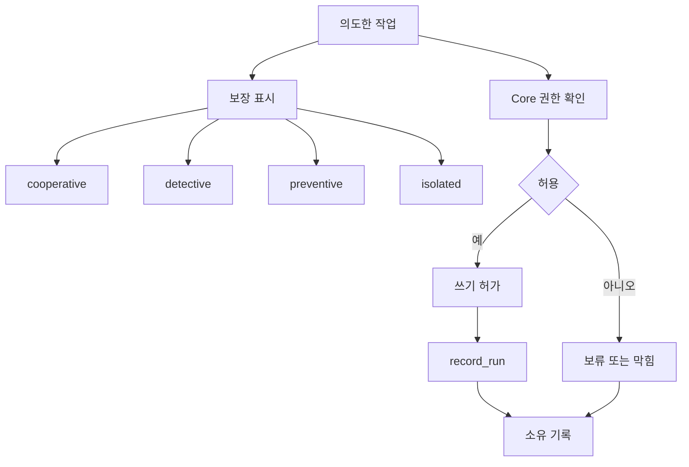

# 런타임 아키텍처 참조

## 이 문서가 도와주는 일

이 문서는 하네스가 어디에서 실행되는지, 기준 상태가 어디에 있는지, Core가 상태 전이를 어떻게 기록하는지, artifact와 projection이 어떻게 연결되고 갱신되는지, runtime이 어떤 통제 수준을 정직하게 말할 수 있는지 확인하기 위한 참조 문서입니다.

구현자와 운영자가 찾아보는 참조 문서이며, Learn overview 전체를 다시 설명하지 않습니다.

이 문서는 향후 하네스 동작을 설명하는 참조 문서입니다. 현재 저장소 단계와 구현 handoff 상태는 [구현 개요](../build/implementation-overview.md#문서-수락-상태)에서 확인합니다.

## 이런 때 읽기

- 제품 저장소 파일과 하네스 런타임의 상태 관계를 매핑할 때.
- Core, artifact 수집, projection, reconcile, 검증, 복구, export가 어떻게 동작하는지 구현할 때.
- 실패가 기준 상태, artifact, projection, 표시 영역 중 어디에 영향을 주는지 판단해야 할 때.
- 연결된 접점의 reported guarantee level이 runtime flow에서 어디에 쓰이는지 설명해야 할 때.

## 읽기 전에

정확한 상태 전이는 [커널 참조](kernel.md)를, public tool envelope와 replay 동작은 [MCP API와 스키마](mcp-api-and-schemas.md)를, storage layout과 lock은 [Storage와 DDL](storage-and-ddl.md)을, security asset, trust boundary, threat, control은 [보안 위협 모델 참조](security-threat-model.md)를, operator entrypoint 의미는 [운영과 Conformance 참조](operations-and-conformance.md)를 사용합니다.

## 핵심 생각

구현된 뒤 하네스는 사용자의 제품 저장소 옆에서 실행되는 로컬 권한 계층입니다. 제품 저장소는 실제 제품 작업이 일어나는 곳이고, 하네스 런타임 홈은 운영 권한을 저장하며, 하네스 서버/설치(Harness Server / Installation)는 Core, validators, projection, reconcile, 공개 MCP tool을 통해 둘을 연결합니다.

중요한 규칙은 분리입니다. 기준 운영 상태를 변경하는 것은 Core뿐입니다. 제품 소스 파일, 대화 텍스트, 생성된 Markdown, connector 파일, operator output, MCP caller claim은 system에 정보를 줄 수 있지만 기준 운영 상태는 `state.sqlite` 현재 기록과 `state.sqlite.task_events`에 있고, 원본 근거는 artifact store에 있습니다.

## 담당하는 참조 범위

이 문서가 담당합니다.

- 구현 세부 관점의 세 공간
- 제품 저장소 / 하네스 서버 또는 설치 / 하네스 런타임 홈 분리
- Core process model
- Core-only canonical mutation authority
- state transaction flow
- artifact store architecture
- security boundary의 architecture placement
- projection과 reconcile architecture
- guarantee-level display의 architecture placement
- failure와 recovery overview

## 여기서 다루지 않는 것

이 문서는 다음 항목을 담당하지 않습니다.

- public MCP request/response schema. [MCP API와 스키마](mcp-api-and-schemas.md)를 봅니다.
- SQLite DDL. [Storage와 DDL](storage-and-ddl.md)을 봅니다.
- full CLI command 의미. 현재 담당 문서는 [운영과 Conformance](operations-and-conformance.md)입니다.
- conformance fixture 형식. 현재 담당 문서는 [Conformance Fixtures 참조](conformance-fixtures.md)입니다.
- threat-model asset, trust boundary, threat category, control category, guarantee-level 의미. [보안 위협 모델 참조](security-threat-model.md)를 봅니다.
- 접점별 connector cookbook. [Surface Cookbook](surface-cookbook.md)을 봅니다.
- connector capability profile. [Agent 통합 참조](agent-integration.md)를 봅니다.
- kernel transition table. 자세한 내용은 [커널 참조](kernel.md)를 봅니다.
- projection template body

## 세 공간, 짧은 요약

```text
제품 저장소:
  제품 코드, 테스트, 사람이 읽는 Projection, 사람이 편집할 수 있는 제안 영역

하네스 서버/설치:
  MCP server, Core, validators, connectors, projector, reconcile worker, operator tools

하네스 런타임 홈:
  registry.sqlite, project.yaml, state.sqlite, artifact store
```

아래 도식은 세 공간에 대한 구현 관점의 설계 계약입니다. 향후 의도한 배치만 보여주며, 이 저장소에 하네스 서버/런타임 구현이나 런타임 데이터가 있다는 뜻은 아닙니다.



이 분리는 대화, Markdown 보고서, 생성된 connector 파일, operator output, MCP caller claim, 제품 소스 파일을 기준 운영 상태 밖에 둡니다. Core 상태 변경 경로만 기준 운영 상태를 commit할 수 있습니다.

이 문서 저장소는 세 공간 중 향후 하네스 서버/설치 공간의 소스 저장소에 해당하며, 제품 저장소나 하네스 런타임 홈이 아닙니다. 아직 하네스 서버/런타임 구현이나 런타임 데이터는 없습니다.

## 로컬 위협 모델

하네스는 로컬 권한 계층으로 설계되며, 일반적인 운영체제 보안 경계를 대신하지 않습니다. 초기 로컬 하네스는 OS 권한을 자동으로 제공하거나, 임의 도구를 sandbox 격리하거나, 로컬 파일을 변조 불가능하게 만들거나, 지시 기반 agent behavior를 사전 차단 보안으로 바꾸지 않습니다. 전체 asset map, trust-boundary map, threat category, control category는 [보안 위협 모델 참조](security-threat-model.md)가 담당합니다.

Architecture implication은 단순합니다. 가까이 있는 file과 caller도 별도의 trust zone입니다. Product file, chat text, generated connector file, operator output, projection Markdown, artifact bytes, external command output, MCP caller claim은 하네스에 정보를 줄 수 있지만, canonical operational state를 commit하는 것은 Core뿐입니다.

Architecture는 이 경계를 계속 보이게 합니다. 제품 저장소 파일과 projection은 input 또는 readable view이고, MCP와 connected surface는 Core로 들어오는 caller path이며, 런타임 홈은 local control data이고, artifact store의 bytes는 registration과 integrity check 전까지 untrusted입니다. External tool/network는 기존 scope, Approval, connector, operator control로 제한되는 side-effecting path입니다. 전체 boundary matrix는 [보안 위협 모델 참조](security-threat-model.md#신뢰-경계)가 담당합니다.

Local-only MCP exposure, secret/PII handling, high-risk work용 command/path/network allowlist, artifact path validation, stale approval replay, projection tampering, capability overclaiming, stale context poisoning은 threat-model concept입니다. Exact API, storage, kernel, connector, operations contract는 threat model에서 연결한 owner 문서에 남습니다.

### 로컬 접근 기대사항

Architecture 수준에서 v0.1 baseline과 staged-delivery default의 MCP posture는 registered project surface에 대한 local-only입니다. Local-only는 expected local user/profile에 대해 runtime이 local process, local socket, localhost-loopback, in-process/stdio, process-scoped configuration material, per-project token 또는 handle, 이에 준하는 local IPC/control path를 사용한다는 뜻입니다.

Remote, shared, tunneled, forwarded, non-loopback, cross-user, cloud/CI relay 노출은 owner docs가 connector posture를 승격하고 증명하기 전까지 v0.1 baseline과 staged delivery 밖에 남습니다. 전체 asset, trust-boundary, threat, control model은 [보안 위협 모델 참조](security-threat-model.md#mcp-local-access와-caller-boundary)가 담당하고, connector profile reporting은 [Agent 통합 참조](agent-integration.md#capability-profiles), API validation은 [MCP API와 스키마](mcp-api-and-schemas.md#mcp-경계와-호출자-신뢰), operator diagnostic은 [운영과 Conformance 참조](operations-and-conformance.md#serve-mcp)가 담당합니다.

MCP reachability는 authorization이 아닙니다. Public tool call은 계속 Core envelope validation, state-version check, idempotency, registered project/task/surface compatibility, 실제 connected surface guarantee level에 의존합니다.

Core에 닿을 수 없으면 API에는 `MCP_UNAVAILABLE` 또는 `MCP_SERVER_UNAVAILABLE` 같은 operations diagnostic으로 드러나며, 그 호출 경로에서 state mutation이나 Core response가 있었다고 주장할 수 없습니다. Core 또는 operator가 도달 가능한 caller나 access path를 registered local profile 밖이라고 분류할 수 있으면 public API는 표시해도 안전한 세부 정보를 포함한 `LOCAL_ACCESS_MISMATCH`를 사용합니다. Recognized surface/profile의 capability gap은 `CAPABILITY_INSUFFICIENT`를 사용합니다.

## Product Repository

한국어 표현: 제품 저장소.

제품 저장소는 사용자의 실제 제품 작업 공간입니다. 제품 소스 코드, tests, repository-level agent rules, 사람이 읽는 하네스 projection이 여기에 있습니다.

대표적인 repository-owned paths는 다음과 같습니다.

```text
repo/
  AGENTS.md
  docs/
    tasks/
    approvals/
    reports/
    design/
  .harness/
    agent/generated/
    reconcile/pending/
```


제품 저장소는 생성된 읽기용 요약과, active profile이 켠 경우 생성된 `TASK`, `APR`, `RUN-SUMMARY`, `EVAL`, `DIRECT-RESULT`, `EVIDENCE-MANIFEST`, `TDD-TRACE`, `MANUAL-QA`, `DOMAIN-LANGUAGE`, `MODULE-MAP`, `INTERFACE-CONTRACT`, `JOURNEY-CARD`, `EXPORT`, 그 밖의 report projection Markdown 보고서를 담을 수 있습니다. v0.1은 전체 catalog가 아니라 structured status/blocker output부터 시작해야 합니다. 사용자 판단 요청 표시, 근거 요약, 닫기 준비 상태 output은 v0.2와 이후 profile에서 자랍니다. 이 파일들은 사람과 agent가 작업을 읽는 데 도움을 주지만 기준 상태가 아닙니다. 사람이 편집할 수 있는 영역은 입력 접점입니다. 사람이 남긴 edit은 reconcile이 Core 상태 변경 action으로 라우팅할 때만 상태 기록이 됩니다.

## Harness Server / Installation

한국어 표현: 하네스 서버/설치.

하네스 서버/설치는 제어 계층입니다. 코어 권한 스모크(v0.1 Core Authority Smoke)은 여러 service의 fleet 대신 내부 모듈을 가진 하나의 로컬 프로세스로 구현할 수 있습니다.

Core runtime의 책임:

- MCP server를 통해 읽기 resource와 public tool을 제공합니다.
- Core에서 커널 상태 전이를 실행합니다.
- write 전, Run 기록 후, close 전에 validator를 실행합니다.
- artifact와 무결성 metadata를 기록합니다.
- projection support가 범위에 있을 때 projection job을 대기열에 넣고 렌더링합니다.
- reconcile support가 범위에 있을 때 사람의 편집이나 managed-block drift에서 reconcile candidate를 감지합니다.
- 단계별로 도입되는 운영자 진입점을 제공합니다. 초기 단계에는 최소 local 진단/상태를 두고, v0.4 또는 나중 profile이 범위에 넣을 때 recover, export, artifact, handoff, conformance surface를 추가합니다.

MCP server는 shell command를 감싼 얇은 wrapper가 아닙니다. MCP server는 높은 수준의 의도 호출을 제공하고, Core는 이를 상태 전이, validator, artifact 기록, applicable한 경우 projection job으로 변환합니다.

## Harness Runtime Home

한국어 표현: 하네스 런타임 홈.

하네스 런타임 홈은 로컬 운영 권한을 저장합니다. Reference location은 `~/.harness`이지만 정확한 layout은 [Storage와 DDL](storage-and-ddl.md)이 담당합니다.

하네스 런타임 홈에는 다음이 있습니다.

- project registration, 연결된 접점, connector manifest를 위한 `registry.sqlite`
- 정적 프로젝트 설정을 위한 registered project별 `project.yaml`
- 현재 운영 기록과 `state.sqlite.task_events`를 위한 project별 `state.sqlite`
- 지속 보관되는 근거 파일을 위한 artifact directories


하네스 런타임 홈은 대화 기록이 사라지거나 제품 저장소 projection이 최신이 아니어도 운영 상태를 복구할 수 있을 만큼 충분해야 합니다. 제품 저장소 문서는 상태 기록과 artifact refs에서 다시 생성될 수 있으며, 그 기록을 대체하지 않습니다.

하네스 런타임 홈 file은 user-private local control data로 취급해야 합니다. 관련 없는 user나 process가 secret/PII를 읽거나 `state.sqlite`, `registry.sqlite`, `project.yaml`, connector config snippet, connector manifest, generated manifest, artifact file, staging file, generated operational file을 수정할 수 있게 하는 file permission 또는 storage location은 local tampering 또는 기밀성 위험입니다. 하네스는 operating-system permission을 스스로 enforce한다고 주장하지 않습니다. 이러한 file은 Core, `doctor`, `recover`, artifact-integrity validation path를 통해서만 authoritative하게 취급합니다.

## Core process model

### Runtime layers

```text
사용자 대화 접점
  ↓
Agent 접점
  ↓
하네스 규칙 / skill / local instructions
  ↓
하네스 MCP server
  ↓
하네스 Core
  ↓
state.sqlite / artifact store / validators / projector / reconcile worker
```


대화 접점은 사용자 의도, decision, approval, QA 판단, acceptance를 모읍니다. Agent 접점은 읽기, 편집, 확인을 수행합니다. 하네스 rules와 skills는 agent가 현재 상태를 놓치지 않게 합니다. MCP server는 tool 경계를 제공합니다. Core는 상태 모델을 담당합니다. Validator, artifact 수집, projection, reconcile은 근거와 읽기용 출력을 상태 전이에 붙입니다.

Native hooks, sidecars, command wrappers, file watchers, worktree isolation은 capability에 따라 달라지는 통제 계층입니다. 구체적인 capability profile이 covered operation에 대해 fixture로 더 강한 통제를 증명하지 않는 한 코어 권한 스모크(v0.1 Core Authority Smoke)과 초기 첫 사용자 가치 조각는 reference 접점에서 cooperative/detective behavior에 의존합니다.


### Core modules

Core는 첫 조각에서 단일 로컬 프로세스로 실행할 수 있습니다. 전체 server는 아래 내부 책임으로 자랄 수 있지만, 코어 권한 스모크(v0.1 Core Authority Smoke)이 이들을 별도 모듈로 모두 구현해야 하는 것은 아닙니다. v0.1 구현은 local registration, Task 하나, 범위가 정해진 작업 경계 하나, `prepare_write`, 한 번만 쓰는 Write Authorization 하나, `record_run` 하나, artifact/evidence ref 하나, structured status/blocker response 하나 밖의 기능을 stub, absent path 또는 later-profile scope로 둘 수 있습니다.

| Module | Runtime responsibility |
|---|---|
| State store | 현재 기록, state version, locks, `state.sqlite.task_events` |
| Task workflow | Task state, 범위가 정해진 작업 경계, 최소 status/blocker response, 이후 profile의 intake, mode selection, next action, gate 갱신, 닫기 판단 |
| Journey module | 관련 profile이 active일 때 Journey Spine reconstruction, Journey Spine Entry support records, Journey Card inputs, continuity refs |
| Decision module | 관련 profile이 active일 때 Decision Packet lifecycle, `decision_gate` aggregation, 사용자 판단 연결, 잔여 위험 표시 inputs |
| Approval module | sensitive-action approval이 범위에 있을 때 scope-bound Approval 요청, decision, expiry, drift handling |
| Evidence module | 먼저 run records와 artifact/evidence refs. 관련 profile이 active일 때 evidence manifests, coverage checks |
| Verification module | verification bundles, evaluator runs, Eval records, independence checks |
| 수동 QA module | QA records, `qa_gate` aggregation |
| Projection module | 먼저 optional freshness/read facts. Projection support가 범위에 있을 때 projection jobs, managed blocks, 보고서 paths |
| Reconcile module | human-editable proposals, managed drift, accepted-state routing |
| Validator runner | core, decision, autonomy/boundary, design-quality, artifact, projection, connector checks |
| Autonomy/Boundary validator responsibility | Autonomy Boundary compatibility, agent latitude, user-judgment 요구사항, AFK stop conditions, boundary drift findings |
| Connector adapter | 기준 접점 등록, capability 보고, capture hints |


Core만 기준 운영 상태를 업데이트합니다. Agents, MCP tools, CLI commands, projectors, reconnect/recovery flows는 Core 로직을 거치거나 같은 상태 compatibility rules를 보존하는 recovery code를 사용해야 합니다. 이들은 Core record를 표시, 진단, 복구, 파생할 수 있지만 두 번째 기준 상태 모델을 유지하면 안 됩니다. Operator command name과 flag는 표시/entrypoint 선택입니다. 동작은 Core state record, `state.sqlite.task_events`, artifacts, projection jobs, API-owned errors 또는 문서화된 diagnostics가 정의합니다.

Decision, Journey, Autonomy/Boundary modules는 새로운 권한 tier를 만들지 않습니다. 기준 기록은 `state.sqlite` 현재 기록과 `state.sqlite.task_events`에 있고, 원본 근거는 artifact store에 있으며, Markdown views는 projections 또는 proposal 접점으로 남습니다.


### Validators and adapter placement

Validator는 Core 옆에 위치하고 구조화된 result를 Core에 반환합니다. Core는 그 result 때문에 transition을 진행하지 않을지, gate를 `stale`/`partial`/`blocked`로 표시할지, 사용자 판단을 요청할지, 표시에만 영향을 줄지 결정합니다.

에이전시 보증 팩(v0.3 Agency Assurance Pack)과 운영과 인계 팩(v0.4 Operations & Handoff Pack)의 ValidatorResult ID set은 API가 소유하며 [MCP API와 스키마](mcp-api-and-schemas.md#validatorresult)에 나열됩니다. 이 runtime reference는 해당 validator가 Core와 adapter 옆에 어디에 놓이는지 담당하며, 두 번째 ID registry를 만들지 않습니다.

`feedback_loop_check`는 Feedback Loop support records와 related execution evidence를 읽습니다. 별도의 kernel gate를 도입하지 않습니다. 그 결과는 다른 설계 품질 check와 같은 validator placement model 안에서 `design_gate`, evidence sufficiency, blockers, display로 전달됩니다.

State/envelope validation, active Task, active Change Unit, changed paths, baseline freshness, Approval 범위, evidence sufficiency, artifact integrity, verification independence, same-session verification guard, evaluator bundle freshness, projection 최신성 같은 Core preconditions와 mechanical checks는 이 validators 전이나 옆에서 실행될 수 있습니다. 이 값들은 이 section, MCP API, [Storage와 DDL](storage-and-ddl.md)이 stable ValidatorResult-emitting set으로 명시적으로 승격하지 않는 한 대체 validator ID가 아닙니다. Surface capability는 `ValidatorResult`로 emit될 때 의도적으로 `surface_capability_check` capability validator로 model됩니다.


Adapters와 sidecars는 접점 capability를 observable facts로 번역합니다. Capability에 대한 kernel gate를 만들지는 않습니다. Capability는 `surface_capability_check` validator, `prepare_write` blocked reasons, 보장 수준 표시를 통해 나타납니다. 구체적인 host/profile의 capability declaration과 refresh trigger는 [Agent 통합 참조](agent-integration.md#capability-profiles)가 담당하고, 접점별 path는 [Surface Cookbook](surface-cookbook.md)이 이름 붙입니다.

## State transaction flow

상태를 변경하는 모든 operation은 현재 기록, event history, projection enqueue row에 대해 하나의 SQLite transaction을 사용합니다.

```text
1. request envelope, idempotency replay state, expected state version을 검증
2. transition에 필요한 project/task lock을 획득
3. 현재 상태 기록을 읽음
4. pre-transition validator를 실행
5. 현재 기록과 affected state/projection version counter를 업데이트
6. state.sqlite.task_events에 하나 이상의 row를 추가
7. relevant projection support가 범위에 있을 때 변경된 source record에 대해 projection job을 대기열에 넣음
8. commit
9. projection rendering이 범위에 있을 때 commit 이후 Markdown projections를 렌더링
```


이 transaction 안에서 Core는 current-record update의 일부로 affected scope clock을 증가시킵니다. Task-scoped changes는 `tasks.state_version`을 증가시키고, `task_id=null`인 project-scoped changes는 `project_state.state_version`을 증가시킵니다. Event rows는 각 affected scope의 resulting state version을 기록합니다. State conflict와 idempotency replay 동작은 [MCP API와 스키마의 Idempotency](mcp-api-and-schemas.md#idempotency)와 [State Conflict 동작](mcp-api-and-schemas.md#state-conflict-동작)에 드러나는 public API 계약입니다.

Projection 렌더링은 transaction 이후에 일어납니다. Projection failure는 state-isolated입니다. Projection 최신성 또는 job status를 `stale` 또는 `failed`로 표시하고 커밋된 상태는 그대로 둡니다. Projection은 transaction을 roll back하거나, `state.sqlite.task_events`를 rewrite하거나, passed task를 failed task로 바꾸거나, 나중의 reconcile decision 없이 기준 상태를 repair할 수 없습니다.

Projection freshness는 파생 read fact입니다. Status, next-action, export, operator command가 이를 확인해 readable view가 stale, failed, unknown이라고 보고할 수는 있지만, Core state, structured blockers, evidence records, 작업 수락, 잔여 위험 수용, Write Authorization의 authority는 각 owner record에 남습니다. v0.1 Core Authority Smoke는 full projection worker를 증명하지 않고 freshness 또는 read fact를 노출할 수 있습니다. v0.2는 현재 작업 상태, 사용자 판단 요청, 근거 요약, 닫기 준비 상태/blocker를 사용자가 이해할 만큼의 derived output이 필요하고, hardened 또는 operational profile은 complete projection/reconcile 및 diagnostic report path를 담당합니다.

## Artifact store architecture

Artifact store는 지속 보관되는 근거 파일을 보관하지만, loose file dump가 아닙니다. Raw artifacts에는 diffs, logs, screenshots, traces, checkpoints, bundles, captured manifests, exported bundle components, 기타 integrity metadata와 owner 관계로 등록된 뒤에만 저장되는 evidence file이 포함됩니다.

Artifact는 두 부분으로 이루어집니다.

- artifact store 안의 raw file
- kind, path, hash, size, redaction state, retention class, Task-scoped owner relation을 이름 붙이는 registered artifact ref와 `state.sqlite`의 artifact 상태 기록


Core는 runs, evidence manifests, Eval records, 수동 QA records, Decision Packets, 렌더링된 Task-scoped projection refs 같은 기존 Task-scoped owner record에 artifact refs를 기록합니다. Current Task-scoped artifact model에서 렌더링된 projection ref로 향하는 `artifact_links`는 artifact의 `task_id` 안에 머뭅니다. Project-level projection job은 owner docs가 허용하는 곳에서 `projection_jobs` metadata로 track될 수 있지만, project-scoped artifact links는 아닙니다. Export snapshots와 components는 valid owners 또는 Task-scoped projections로 다시 link되는 artifact files로 남습니다. Exact relation rules는 MCP API, Storage와 DDL, Document Projection, Operations owner docs가 담당합니다. Large logs, diffs, screenshots, traces, patches는 원본 artifact로 두고, Markdown 보고서는 제한 없는 evidence 본문을 포함하는 대신 artifact refs로 link해야 합니다.

Raw secrets는 artifacts로 저장하면 안 됩니다. Secret-related evidence가 required라면 Core는 redacted artifact, secret handle, relevant validator를 통과한 operator note를 기록합니다.

Large logs, diffs, screenshots, traces 같은 큰 근거는 registered artifact ref로 link해야 합니다. Markdown 보고서와 export는 ref가 무엇을 뒷받침하는지 요약하고 redaction 및 availability state와 safe note를 표시할 수 있지만, 큰 evidence 본문을 붙여 넣거나 생략된 secret value를 다시 만들면 안 됩니다.

Export는 파생 bundle이며 네 번째 권한 공간이 아닙니다. Export는 Core state snapshot, 안전한 state/event version fact, report projection snapshot, artifact ref, 허용된 raw artifact file, artifact integrity result, redaction status, omitted-secret note, retained, expired, unavailable, `secret_omitted`, `blocked` artifact의 retention/availability fact를 포함할 수 있습니다. Durable file이 되는 export component는 valid owner record 또는 Task-scoped projection ref에 연결된 artifact로 남습니다. Export는 recovery artifact, stale projection, Markdown prose, chat text, staging path, operator console output에서 성공을 추론하면 안 됩니다.

### Raw artifacts, 상태 기록, Markdown 보고서

경계는 다음과 같습니다.

| Item | Authority | Examples |
|---|---|---|
| Raw artifact | Durable evidence file in artifact store | diff, log, screenshot, checkpoint, bundle, manifest file |
| 상태 기록 | `state.sqlite`의 기준 structured record | Task, Change Unit, Decision Packet, Journey Spine Entry, Residual Risk, Run, Approval, Eval, 수동 QA record, Evidence Manifest, Shared Design, Artifact record |
| Markdown 보고서 | 기록과 artifact refs에서 만든 사람이 읽을 수 있는 projection | TASK, compact status card, Decision Packet views, APR, DIRECT-RESULT, 그리고 later diagnostic view인 Journey Card/Spine, RUN-SUMMARY, EVAL, EVIDENCE-MANIFEST |


이 named 보고서 kind는 기본적으로 상태 기록과 artifact refs에서 생성되는 projections입니다. Artifact store의 evidence file을 참조할 수 있고 export가 snapshots를 포함할 수 있지만, 그렇다고 Markdown 보고서가 기준 근거 파일이나 기준 상태가 되지는 않습니다.

## Projection and reconcile flow

Projection은 outbox-style flow입니다.

```text
상태 전이 commit 완료
→ projection support가 범위에 있을 때 projection job이 대기열에 들어감
→ 상태 기록과 artifact refs에서 managed block 렌더링
→ projected version과 managed hash 기록
→ human-editable area 보존
```

Projector는 managed area만 쓰고 사람이 편집할 수 있는 영역은 보존합니다. Managed area가 직접 edit되었다면 projector는 그 edit를 state로 조용히 받아들이지 않고 reconcile candidate를 기록합니다. Connector-generated file과 managed instruction block도 같은 safe non-overwrite 경계를 따릅니다. Manifest와 hash로 drift를 감지하고, existing file 또는 block은 그대로 두며, reconcile 또는 explicit reconnect decision이 owner record에서 refresh할지 결정합니다. Human-editable area에 proposal이 있으면 reconcile은 candidate record를 만들고 명시적 decision을 요청합니다. `source_state_version` 같은 front matter와 freshness line은 렌더링된 view에 대한 표시 진단 정보이지 두 번째 state clock이 아닙니다.

Reconcile 권한 경로:

```text
human-editable input
→ state.sqlite.reconcile_items
→ accepted Core state-changing action과 state.sqlite.task_events row, 또는 rejected/deferred/note outcome
```


Reconcile은 merge, reject, note로 convert, decision 생성, design support record 생성 또는 갱신, defer를 할 수 있습니다. Accepted operational changes는 Core를 통해 기록되고 `state.sqlite.task_events`에 추가됩니다.

## 보장 수준

`cooperative`, `detective`, `preventive`, `isolated`의 정확한 의미와 이 label의 staged honest-display rule은 [보안 위협 모델 참조: 정직한 guarantee display](security-threat-model.md#정직한-guarantee-display)가 담당합니다. 이 architecture section은 reported label이 runtime flow의 어디에 나타나는지만 담당합니다. Connector profile과 adapter가 이를 보고하고, Core는 여전히 authority decision을 수행하며, operator 또는 recovery surface는 이를 display와 risk context로 사용합니다.

Architecture 관점의 stage default는 다음과 같습니다. v0.1은 cooperative에 제한된 detective Core status behavior를 더한 수준, v0.2는 사용자에게 보이는 blocker와 status를 포함한 cooperative/detective 수준, v0.3은 verification, QA, risk, 작업 수락 분리를 위한 cooperative/detective assurance 수준, v0.4는 operations, recovery, export, integrity check를 위한 detective 수준, v1+는 concrete operation 또는 boundary가 구현되고 증명된 곳에서만 preventive 또는 isolated profile입니다. 전체 표는 [보안 위협 모델의 단계별 guarantee level](security-threat-model.md#단계별-guarantee-level)이 담당합니다.

### 보장 수준 동작 지도

이 도식은 guarantee label이 어디에서 통제 behavior를 바꾸고, 어디에서는 바꾸지 않는지 보여줍니다. 눈여겨볼 점은 Core가 먼저 authority decision을 내린다는 것입니다. Guarantee level은 authority를 만들지 않습니다. Denied 또는 held operation이 covered operation에 대해 instruction, after-action detection, fixture-proven 실행 전 차단, isolation 중 무엇으로 처리되는지 설명할 뿐입니다.



Preventive label은 connected profile이 설명 중인 operation에 대한 fixture-proven coverage를 가질 때만 적용됩니다. Isolated label은 connected profile이 주장하는 separation boundary를 문서화하고 증명한 경우에만 적용됩니다. Fresh evaluator bundle, fresh session, separate worktree는 verification independence와 stale-context control을 뒷받침할 수 있습니다. Sandbox 격리, 권한 계층, locked-down runner, process boundary, container boundary 표현은 profile이 exact mechanism을 이름 붙이고 증명한 경우에만 보안 격리 표현으로 씁니다. 이 label은 work를 approve하거나, Write Authorization을 만들거나, gate를 충족하거나, evidence를 만들거나, verification을 수행하거나, risk를 accept하거나, Task를 close하지 않습니다. 엄격한 `prepare_write`와 `record_run` 동작은 [커널 참조](kernel.md#prepare_write)와 [커널 참조](kernel.md#record_run)가 담당합니다. Public response shape와 error precedence는 [MCP API와 스키마](mcp-api-and-schemas.md)가 담당합니다. 구체적인 profile declaration은 [Agent 통합 참조](agent-integration.md#capability-profiles)가 담당합니다. 이 도식은 통제 방향을 보여주는 참고일 뿐입니다.


보장 수준 표시는 경계의 양쪽을 모두 이름 붙여야 합니다. 연결된 profile이 실행 전에 실제로 막을 수 있는 것과, 실행 뒤에만 감지할 수 있는 것을 나눠 보여줘야 합니다. Surface name, product name, recipe name, friendly mode label만으로는 capability가 증명되지 않습니다. 선언은 실제 host/profile capability profile과 현재 proof basis에서 나와야 합니다. Guard, freeze, careful-mode label은 connected profile이 입증한 capability를 그대로 따르며, cooperative 또는 detective profile을 preventive blocking으로 올려 주지 않고 새 authority tier도 만들지 않습니다.

Current reference behavior는 연결된 접점이 covered operation에 대해 구체적으로 fixture로 입증된 도구 실행 전 guard나 문서화되고 입증된 separation boundary를 갖는 경우가 아니라면 cooperative/detective입니다. v0.1과 v0.2에서 "blocked"는 Harness 권한 경로가 진행할 수 없거나 surface가 지시에 따라 보류한다는 뜻입니다. Preventive profile이 exact operation을 증명하지 않는 한 runtime이 임의의 파일 쓰기를 물리적으로 막았다는 뜻이 아닙니다. Native hook expansion, advanced sidecar watching, broad isolated execution은 reference 접점을 위해 명시적으로 구현되지 않는 한 later roadmap items입니다. Owner 문서를 통해 승격되기 전까지 이 항목들은 관찰, freshness, 표시를 개선할 수 있을 뿐이며, write를 authorize하거나, gate를 충족하거나, Approval을 부여하거나, verification 또는 QA를 증명하거나, acceptance를 기록하거나, Core 권한을 대체하지 않습니다.

보장 수준은 표시와 risk context입니다. Approval, Write Authorization, verification, QA, 작업 수락, 잔여 위험 수용, close readiness, kernel gate가 아닙니다.

## Failure and recovery overview

Failures는 숨기지 않고 기록합니다.

| Failure | Architecture-level handling |
|---|---|
| Agent crash during write | active Run을 `runs.status=interrupted`로 표시하거나 equivalent interrupted recovery Run을 commit합니다. 가능하면 diff/log snapshots를 캡처하고 successful completion의 증거가 아닌 recovery artifacts로 등록합니다 |
| Baseline drift | fresh baseline 또는 compatible owner path가 생길 때까지 baseline-dependent write, verification, evidence, approval, close-readiness path를 `stale` 또는 blocked로 표시합니다 |
| Approval drift | scope, baseline, sensitive category, expiry, actor context가 더 이상 맞지 않으면 Approval을 만료, 축소, 또는 재요청합니다. 오래된 Approval을 broad authorization으로 바꾸지 않습니다 |
| evaluator가 repo drift 관찰 | verification을 `blocked` 또는 `stale`로 표시합니다. Fresh baseline, evaluator bundle, 또는 Eval path를 요구하며 drifted observation에서 분리 검증 passed를 설정하지 않습니다 |
| artifact file missing 또는 hash mismatch | artifact와 dependent evidence, projection, export, close-readiness view를 `stale` 또는 blocked로 표시합니다. Recovery를 통해 다시 scan하거나, 등록된 정확한 bytes를 restore하거나, replacement를 등록합니다 |
| Projection job failed | state는 current로 유지하고 projection을 failed로 표시한 뒤 retry 또는 reconcile합니다. Core state를 roll back하거나 Task result를 fail로 만들거나 rendered Markdown에서 state를 만들어내지 않습니다 |
| Managed Markdown edited directly | reconcile item을 만들고 기준 상태를 직접 바꾸지 않습니다 |
| Stale PRD, chat memory, evaluator bundle | stale context는 pull-only input으로 취급합니다. Owner path가 refresh, reconcile, supersede하기 전까지 write authorization, current Task state replacement, gate satisfaction, 작업 수락, 분리 검증 기록, close에 사용할 수 없습니다 |
| MCP unavailable | `MCP_SERVER_UNAVAILABLE`은 tool 호출이 Core에 닿을 수 없어 authoritative Core response가 불가능한 진단 조건이고, `SURFACE_MCP_UNAVAILABLE`은 Core 또는 operator가 연결된 접점에서 사용할 수 있는 MCP가 없거나 MCP configuration이 최신이 아니거나 required tools를 호출할 수 없음을 관찰할 수 있는 진단 조건입니다. `MCP_UNAVAILABLE`은 stable public availability code로 남습니다. Product/runtime/code writes는 cooperative 접점에서는 instruction으로 보류되고, 가능한 detective path에서는 실행 뒤에 감지되며, covered operation에 대해 fixture로 입증된 preventive guard가 있을 때만 실행 전에 차단됩니다 |
| Surface capability mismatch | validator result를 기록하고 보장 수준 표시를 조정하며, required checks를 충족할 수 없으면 Write Authorization을 거부하거나 Harness 권한 상태상 write가 허용되지 않음을 표시합니다. Cooperative surface는 지시로 보류하며, 실행 전 물리적 차단은 여전히 connected profile에서 fixture로 입증된 coverage에 달려 있습니다 |


Recovery tools는 projection 최신성 repair, artifact rescan, 최신이 아닌 runs interrupt, drifted approvals expire, reconcile items create를 수행할 수 있습니다. 다만 같은 권한 규칙을 보존해야 합니다. `state.sqlite`는 운영 상태이고, `state.sqlite.task_events`는 그 state store 안의 event 이력이며, 원본 근거는 artifact store에 있고, Markdown 보고서는 projection으로 남습니다. Recovery artifact와 compensating event는 recovery가 관찰하거나 변경한 내용을 설명합니다. 그 자체로 successful implementation을 증명하거나, evidence를 충족하거나, verification 또는 QA를 pass하거나, 작업 수락이나 잔여 위험 수용을 기록하거나, Task를 close하지 않습니다.
