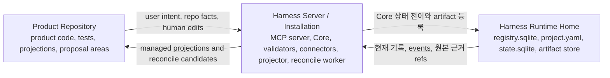

# 런타임 아키텍처 참조

## 이 문서가 도와주는 일

이 문서는 Harness가 어디에서 실행되는지, 기준 상태가 어디에 있는지, Core가 상태 전이를 어떻게 기록하는지, artifact와 projection이 어떻게 연결되고 갱신되는지, runtime이 어떤 집행 강도를 정직하게 말할 수 있는지 확인하기 위한 참조 문서입니다.

구현자와 운영자가 찾아보는 참조 문서이며, Learn overview 전체를 다시 설명하지 않습니다.

## 이런 때 읽기

- 제품 저장소 파일과 Harness runtime의 상태 관계를 매핑할 때.
- Core, artifact 수집, projection, reconcile, 검증, 복구, export가 어떻게 동작하는지 구현할 때.
- 실패가 기준 상태, artifact, projection, 표시 영역 중 어디에 영향을 주는지 판단해야 할 때.
- 연결된 접점이 cooperative, detective, preventive, isolated 중 어디에 해당하는지 설명해야 할 때.

## 런타임 아키텍처를 쉬운 말로

Harness는 사용자의 Product Repository 옆에서 실행되는 로컬 권한 계층입니다. Product Repository는 실제 제품 작업이 일어나는 곳이고, Runtime Home은 운영 권한을 저장하며, Harness Server / Installation은 Core, validators, projection, reconcile, 공개 MCP tool을 통해 둘을 연결합니다.

중요한 규칙은 분리입니다. 제품 소스 파일, 대화 텍스트, 생성된 Markdown, connector 파일은 system에 정보를 줄 수 있지만 기준 운영 상태는 `state.sqlite` 현재 기록과 `state.sqlite.task_events`에 있고, 원본 근거는 artifact store에 있습니다.

## 담당하는 참조 범위

이 문서가 담당합니다.

- 구현 세부 관점의 세 공간
- Product Repository / Harness Server 또는 Installation / Harness Runtime Home 분리
- Core process model
- state transaction flow
- artifact store architecture
- 로컬 위협 모델과 신뢰 경계
- projection과 reconcile architecture
- 보장 수준
- failure와 recovery overview

## 여기서 다루지 않는 것

이 문서는 다음 항목을 담당하지 않습니다.

- public MCP request/response schema. [MCP API와 스키마](mcp-api-and-schemas.md)를 봅니다.
- SQLite DDL. [Storage와 DDL](storage-and-ddl.md)을 봅니다.
- full CLI command 의미. 현재 담당 문서는 [운영과 Conformance](operations-and-conformance.md)입니다.
- conformance fixture 형식. 현재 담당 문서는 [운영과 Conformance](operations-and-conformance.md)입니다.
- 접점별 connector cookbook. [Surface Cookbook](surface-cookbook.md)을 봅니다.
- connector capability profile. [Agent 통합 참조](agent-integration.md)를 봅니다.
- kernel transition table. 자세한 내용은 [커널 참조](kernel.md)를 봅니다.
- projection template body

## 세 공간, 짧은 요약

```text
Product Repository:
  product code, tests, human-readable projections, and human-editable proposal areas

Harness Server / Installation:
  MCP server, Core, validators, connectors, projector, reconcile worker, and operator tools

Harness Runtime Home:
  registry.sqlite, project.yaml, state.sqlite, and the artifact store
```



이 분리는 대화, Markdown 보고서, 생성된 connector 파일, 제품 소스 파일이 우연히 운영 상태가 되는 일을 막습니다.

## 로컬 위협 모델

Harness는 로컬 권한 계층으로 설계되며, 일반적인 운영체제 보안 경계를 대신하지 않습니다. 이 로컬 위협 모델은 사용자가 관리하는 Product Repository, 로컬 Harness Server / Installation, Harness Runtime Home, 하나 이상의 연결된 agent 접점을 전제로 합니다. 이 공간 중 하나에 쓰기 접근 권한이 있는 로컬 프로세스나 파일은 Harness에 영향을 주려고 할 수 있으므로, runtime은 가까이 있는 파일과 호출자를 모두 같은 권한으로 보지 않고 별도의 신뢰 영역으로 다룹니다.

주요 경계는 다음과 같습니다.

| 경계 | 신뢰 우려 | Runtime 처리 |
|---|---|---|
| Product Repository | 사람이 편집할 수 있는 파일, 생성된 Markdown, 오래된 문서, connector-managed file이 직접 수정되거나 위조된 context로 쓰일 수 있습니다. | Product file은 입력 또는 projection 접점입니다. 수용된 운영 의미는 Core 또는 reconcile을 거쳐야 하며, managed-block drift를 조용히 state로 받아들이지 않습니다. |
| Harness Server / Installation | MCP server와 operator tool은 로컬 제어면입니다. 잘못된 프로세스, 오래된 surface config, 위조된 project/task/surface claim에서 호출이 들어올 수 있습니다. | Public tool은 Core를 통과하고 request-envelope validation, state-version check, idempotency, surface capability reporting, 정직한 보장 수준 표시를 사용합니다. 로컬 binding과 접근 기대사항은 API와 operations 계약이며, 모든 로컬 프로세스를 신뢰한다는 뜻이 아닙니다. |
| Agent surface | 접점이 capability를 과장하거나, MCP를 건너뛰거나, user/evaluator/operator intent를 부정확하게 표현할 수 있습니다. | Capability는 connector profile, `surface_capability_check`, blocked reason, 보장 수준 표시로 관찰합니다. `actor_kind`는 routing에 쓰이지만 그 자체가 approval, acceptance, verification independence, user-owned judgment는 아닙니다. |
| Connector files | Generated instruction, manifest, capture hint, local configuration이 drift되거나 손으로 수정될 수 있습니다. | Connector-managed file은 manifest와 drift reporting으로 확인합니다. Core record 없이 상태 권한을 만들지 않습니다. |
| Harness Runtime Home | `registry.sqlite`, `project.yaml`, `state.sqlite`, `state.sqlite.task_events`, artifact directories는 운영 권한과 근거를 담습니다. | Core transaction, lock, state version, event history, doctor, recovery가 이 권한 경계를 보존합니다. Direct file edit는 Core 또는 recovery path가 검증하기 전까지 유효한 state change가 아닙니다. |
| Artifact store | Staged file, screenshot, log, network trace, export component, copied evidence에는 poisoning, 변조, 과도한 크기, secret/PII 포함 위험이 있습니다. | Artifact 등록은 approved staging/capture path, redaction 또는 omission, hash/size/content-type check, Task-scoped ownership, owner-record validation이 성공하기 전까지 input을 신뢰하지 않습니다. |

Sensitive category는 side effect, security, compliance, product-contract, policy risk를 보는 지도입니다. Runtime-facing side effect에는 `destructive_write`, `network_write`, `external_service_write`, `data_export`, `infra_or_deployment_change`, `production_config_change`, `ci_cd_change`, `billing_or_cost_change`, `telemetry_or_logging_change`가 포함됩니다. `auth_change`, `permission_model_change`, `schema_change`, `dependency_change`, `public_api_change`, `secret_access`, `privacy_or_pii_change`, `license_or_compliance_change`, `model_or_prompt_policy_change`, `policy_override` 같은 product/security/compliance-sensitive category도 local operation이라는 이유나 가까운 파일, connector, 호출자에서 시작되었다는 이유만으로 안전해지지 않습니다. Policy가 적용되면 해당되는 Harness 경로를 거쳐야 합니다. 예를 들어 범위 있는 작업을 위한 scope, 민감 행위 허용을 위한 Approval, 사용자 소유 판단을 위한 compatible Decision Packet, write-capable 작업을 위한 Write Authorization, 주장이나 close가 의존하는 evidence, 연결된 접점의 capability/guarantee reporting이 여기에 포함될 수 있습니다.

Log, screenshot, artifact, projection, export, run summary에는 secret, PII, credential, token, private customer data, 민감한 운영 세부 정보가 들어갈 수 있습니다. 따라서 runtime architecture에서 redaction과 omission은 보기 좋은 보고서 서식이 아니라 evidence handling의 일부입니다. Raw secrets는 durable artifact가 되면 안 되며, exported bundle은 내용이 제거되었거나 blocked되었을 때 redaction 또는 omission note를 포함해야 합니다.

### 로컬 접근 기대사항

MVP의 기본 MCP 노출 자세는 등록된 project surface에 대한 local-only입니다. Local-only란 기본 connector와 `serve mcp` 자세가 기대되는 local user/profile에 대해 로컬 프로세스, 로컬 socket, 또는 localhost loopback 접근을 사용한다는 뜻입니다. Non-loopback interface에 bind하거나, shared/remote endpoint를 publish하거나, forwarded/tunneled port에 의존하거나, cloud/CI relay를 통과하거나, cross-user socket 또는 directory를 노출하거나, network reachability 자체를 authorization으로 취급하지 않습니다. Registered connector profile 밖의 caller, endpoint, port, socket, config file, relay, filesystem path는 MVP local boundary 밖에 있습니다. 이것은 로컬 운영 전제이지, 같은 machine의 모든 프로세스를 신뢰한다는 뜻이 아닙니다. 구체적인 로컬 위험에는 다른 로컬 프로세스의 tool call, forwarded 또는 tunneled port, 오래된 connector configuration, 위조된 `project_id`, `task_id`, `surface_id`, `actor_kind` claim, Runtime Home data를 관련 없는 user나 프로세스가 읽거나 바꿀 수 있게 하는 IPC 또는 file permission이 포함됩니다.

정확한 로컬 transport는 지정하지 않습니다. Contract 수준에서 허용되는 전제에는 local-only binding을 사용하는 localhost TCP, owner-only filesystem permission으로 제한된 Unix-domain socket 또는 다른 local socket, in-process 또는 stdio transport, process-scoped configuration material, 추가 local control로 쓰는 per-project token 또는 handle, 이에 준하는 local IPC/control path가 포함됩니다. Profile과 manifest는 access-control material class, bind/reachability posture, freshness basis, 필요할 때 display-safe handle 또는 fingerprint를 기록하며 raw token, secret, private configuration value를 저장하지 않습니다.

MCP를 local-only 범위 밖으로 노출하는 것은 MVP 기본값이 아니며, owner documentation과 conformance가 특정 connector posture를 승격하기 전까지 MVP 밖에 남습니다. 그러려면 문서화된 connector capability profile, 접근 제어 계약, secret/PII 처리 정책, 보장 수준 표시, 노출된 권한을 검증하는 conformance coverage가 필요합니다. 이 참조 문서는 하나의 mechanism을 요구하지 않습니다. 다만 profile은 관련 없는 호출자가 endpoint를 사용하는 일을 무엇이 막는지, 그 노출로 어떤 data가 드러날 수 있는지, 어떤 guarantee level이 여전히 정직한지, Core가 여전히 무엇을 검증하는지 이름 붙여야 합니다.

Access mode가 더 약하거나 unknown이거나 문서화된 profile 밖에 있으면 Harness는 이를 솔직하게 보고합니다. `doctor` 또는 `serve mcp`는 risk에 따라 warn 또는 fail할 수 있고, status와 write decision은 보장 수준 표시를 낮추거나 `surface_capability_check` finding을 emit해야 하며, cooperative 접점은 product/runtime/code write를 보류합니다. API에 보이는 failure는 MCP API owner가 허용하는 곳에서 기존 `MCP_UNAVAILABLE` 또는 `CAPABILITY_INSUFFICIENT` path를 사용합니다. 약한 access mode 자체가 existing state의 손상을 증명하지는 않지만, write-capable 또는 close-relevant 경로가 진단 전까지 capability 부족 상태가 될 수 있습니다.

진단 예시는 문서 계약의 일부이며 새 상태 모델이 아닙니다.

| 관찰된 상태 | 보고 내용 |
|---|---|
| MCP가 non-local interface에 bind되었거나, forwarded/tunneled 되었거나, registered connector profile 밖 호출자가 도달할 수 있습니다. | `doctor`와 `serve mcp`는 관찰된 access mode, active project, surface profile, 낮아진 보장 수준을 이름 붙입니다. 상태 변경 또는 close-relevant 경로는 hold, fail, 또는 기존 `MCP_UNAVAILABLE` / `CAPABILITY_INSUFFICIENT` response를 사용하며 새 public `ErrorCode`를 추가하지 않습니다. |
| Runtime Home 권한이 unknown이거나 owner-only expectation보다 약합니다. | `doctor`는 platform observability와 remediation guidance가 포함된 security/threat-model finding을 보고합니다. 파일 권한을 기준 상태로 취급하거나 직접 파일 편집을 권한 근거로 받아들이지 않습니다. |
| Runtime Home에 광범위한 쓰기 권한이 있습니다. | Report는 `state.sqlite`, `registry.sqlite`, `project.yaml`, connector manifest, artifact file, staging file, generated operational file에 대한 로컬 변조 위험이라고 설명합니다. Core는 shape, owner, event, integrity, recovery, artifact-registration check를 통해서만 의미를 받아들입니다. |
| Artifact directory에 광범위한 읽기 권한이 있습니다. | Report는 log, screenshot, token, PII, verification bundle, export, 기타 민감 evidence에 대한 기밀성 위험을 설명합니다. Redaction, omission, block note, retention, export rule이 Harness가 표시하거나 복사할 수 있는 내용을 계속 정의합니다. |
| Envelope claim이 잘못된 project, Task, surface, Run, actor role을 이름으로 지정합니다. | Public tool은 registered record와 tool scope에 대해 claim을 검증합니다. `actor_kind`는 routing을 도울 수 있지만, 그 자체로 Approval, user acceptance, Manual QA, detached verification을 충족할 수 없습니다. |

## Product Repository

Product Repository는 사용자의 실제 제품 작업 공간입니다. 제품 소스 코드, tests, repository-level agent rules, 사람이 읽는 Harness projection이 여기에 있습니다.

대표적인 repository-owned paths는 다음과 같습니다.

```text
repo/
  AGENTS.md
  docs/
    tasks/
    approvals/
    reports/
    design/
  .harness/
    agent/generated/
    reconcile/pending/
```


Repository는 생성된 TASK, APR, RUN-SUMMARY, EVAL, DIRECT-RESULT, EVIDENCE-MANIFEST, TDD-TRACE, MANUAL-QA, DOMAIN-LANGUAGE, MODULE-MAP, INTERFACE-CONTRACT Markdown 보고서를 담을 수 있습니다. 이 파일들은 사람과 agent가 작업을 읽는 데 도움을 주지만 기준 상태가 아닙니다. 사람이 편집할 수 있는 영역은 입력 접점입니다. Accepted changes는 reconcile 또는 Core 상태 변경 action을 통해서만 상태 기록이 됩니다.

## Harness Server / Installation

Harness Server / Installation은 제어 계층입니다. MVP는 여러 service의 fleet 대신 내부 모듈을 가진 하나의 로컬 프로세스로 구현할 수 있습니다.

Core runtime의 책임:

- MCP server를 통해 읽기 resource와 public tool을 제공합니다.
- Core에서 커널 상태 전이를 실행합니다.
- write 전, Run 기록 후, close 전에 validator를 실행합니다.
- artifact와 무결성 metadata를 기록합니다.
- projection job을 대기열에 넣고 렌더링합니다.
- 사람의 편집이나 managed-block drift에서 reconcile candidate를 감지합니다.
- 진단, 복구, export, conformance 진입점을 제공합니다.

MCP server는 shell command를 감싼 얇은 wrapper가 아닙니다. MCP server는 높은 수준의 의도 호출을 제공하고, Core는 이를 상태 전이, validator, artifact 기록, projection job으로 변환합니다.

## Harness Runtime Home

Harness Runtime Home은 로컬 운영 권한을 저장합니다. Reference location은 `~/.harness`이지만 정확한 layout은 [Storage와 DDL](storage-and-ddl.md)이 담당합니다.

Runtime Home에는 다음이 있습니다.

- project registration, 연결된 접점, connector manifest를 위한 `registry.sqlite`
- 정적 프로젝트 설정을 위한 registered project별 `project.yaml`
- 현재 운영 기록과 `state.sqlite.task_events`를 위한 project별 `state.sqlite`
- 지속 보관되는 근거 파일을 위한 artifact directories


Runtime Home은 대화 기록이 사라지거나 Product Repository projection이 최신이 아니어도 운영 상태를 복구할 수 있을 만큼 충분해야 합니다. Product Repository 문서는 상태 기록과 artifact refs에서 다시 생성될 수 있으며, 그 기록을 대체하지 않습니다.

Runtime Home file은 user-private local control data로 취급해야 합니다. 관련 없는 user나 process가 secret/PII를 읽거나 `state.sqlite`, `registry.sqlite`, `project.yaml`, connector config snippet, connector manifest, generated manifest, artifact file, staging file, generated operational file을 수정할 수 있게 하는 file permission 또는 storage location은 local tampering 또는 기밀성 위험입니다. Harness는 operating-system permission을 스스로 enforce한다고 주장하지 않습니다. 이러한 file은 Core, `doctor`, `recover`, artifact-integrity validation path를 통해서만 authoritative하게 취급합니다.

## Core process model

### Runtime layers

```text
사용자 대화 접점
  ↓
Agent 접점
  ↓
Harness 규칙 / skill / local instructions
  ↓
Harness MCP server
  ↓
Harness Core
  ↓
state.sqlite / artifact store / validators / projector / reconcile worker
```


대화 접점은 사용자 의도, decision, approval, QA 판단, acceptance를 모읍니다. Agent 접점은 읽기, 편집, 확인을 수행합니다. Harness rules와 skills는 agent가 현재 상태를 놓치지 않게 합니다. MCP server는 tool 경계를 제공합니다. Core는 상태 모델을 담당합니다. Validator, artifact 수집, projection, reconcile은 근거와 읽기용 출력을 상태 전이에 붙입니다.

Native hooks, sidecars, command wrappers, file watchers, worktree isolation은 capability에 따라 달라지는 집행 계층입니다. 구체적인 capability profile이 더 강한 enforcement를 증명하지 않는 한 MVP는 reference 접점에서 cooperative/detective behavior에 의존합니다.


### Core modules

MVP Core는 다음 내부 모듈을 가진 단일 프로세스로 실행할 수 있습니다.

| Module | Runtime responsibility |
|---|---|
| State store | 현재 기록, state version, locks, `state.sqlite.task_events` |
| Task workflow | intake, mode selection, next action, gate 갱신, 닫기 판단 |
| Journey module | Journey Spine reconstruction, Journey Spine Entry support records, Journey Card inputs, continuity refs |
| Decision module | Decision Packet lifecycle, `decision_gate` aggregation, 사용자 판단 연결, residual-risk visibility inputs |
| Approval module | scope-bound Approval 요청, decision, expiry, drift handling |
| Evidence module | run records, artifact refs, evidence manifests, coverage checks |
| Verification module | verification bundles, evaluator runs, Eval records, independence checks |
| Manual QA module | QA records, `qa_gate` aggregation |
| Projection module | projection jobs, managed blocks, freshness, 보고서 paths |
| Reconcile module | human-editable proposals, managed drift, accepted-state routing |
| Validator runner | core, decision, autonomy/boundary, design-quality, artifact, projection, connector checks |
| Autonomy/Boundary validator responsibility | Autonomy Boundary compatibility, agent latitude, user-judgment 요구사항, AFK stop conditions, boundary drift findings |
| Connector adapter | 기준 접점 등록, capability 보고, capture hints |


Core만 기준 운영 상태를 업데이트합니다. Agents, CLI commands, projectors, reconnect/recovery flows는 Core 로직을 거치거나 같은 상태 compatibility rules를 보존하는 recovery code를 사용해야 합니다.

Decision, Journey, Autonomy/Boundary modules는 새로운 권한 tier를 만들지 않습니다. 기준 기록은 `state.sqlite` 현재 기록과 `state.sqlite.task_events`에 있고, 원본 근거는 artifact store에 있으며, Markdown views는 projections 또는 proposal 접점으로 남습니다.


### Validators and adapter placement

Validator는 Core 옆에 위치하고 구조화된 result를 Core에 반환합니다. Core는 그 result가 transition을 차단할지, gate를 `stale`/`partial`/`blocked`로 표시할지, 사용자 판단을 요청할지, 표시에만 영향을 줄지 결정합니다.

Stable MVP ValidatorResult ID set은 API가 소유하며 [MCP API와 스키마](mcp-api-and-schemas.md#validatorresult)에 나열됩니다. 이 runtime reference는 해당 validator가 Core와 adapter 옆에 어디에 놓이는지 담당하며, 두 번째 ID registry를 만들지 않습니다.

`feedback_loop_check`는 Feedback Loop support records와 related execution evidence를 읽습니다. 별도의 kernel gate를 도입하지 않습니다. 그 결과는 다른 설계 품질 check와 같은 validator placement model 안에서 `design_gate`, evidence sufficiency, blockers, display로 전달됩니다.

State/envelope validation, active Task, active Change Unit, changed paths, baseline freshness, Approval 범위, evidence sufficiency, artifact integrity, verification independence, same-session verification guard, projection 최신성 같은 Core preconditions와 mechanical checks는 이 validators 전이나 옆에서 실행될 수 있습니다. 이 값들은 이 section, MCP API, [Storage와 DDL](storage-and-ddl.md)이 stable ValidatorResult-emitting set으로 명시적으로 승격하지 않는 한 대체 validator ID가 아닙니다. Surface capability는 `ValidatorResult`로 emit될 때 의도적으로 `surface_capability_check` capability validator로 model됩니다.


Adapters와 sidecars는 접점 capability를 observable facts로 번역합니다. Capability에 대한 kernel gate를 만들지는 않습니다. Capability는 `surface_capability_check` validator, `prepare_write` blocked reasons, 보장 수준 표시를 통해 나타납니다.

## State transaction flow

상태를 변경하는 모든 operation은 현재 기록과 event history에 대해 하나의 SQLite transaction을 사용합니다.

```text
1. request envelope와 expected state version을 검증
2. transition에 필요한 project/task lock을 획득
3. 현재 상태 기록을 읽음
4. pre-transition validator를 실행
5. 현재 기록 업데이트
6. state.sqlite.task_events에 하나 이상의 row를 추가
7. 필요한 경우 state/projection version을 증가시키거나 갱신
8. projection job을 대기열에 넣음
9. commit
10. commit 이후 Markdown projections를 렌더링
```


이 transaction 안에서 Core는 affected scope clock을 증가시킵니다. Task-scoped changes는 `tasks.state_version`을 증가시키고, `task_id=null`인 project-scoped changes는 `project_state.state_version`을 증가시킵니다. Event rows는 각 affected scope의 resulting state version을 기록합니다.

Projection 렌더링은 transaction 이후에 일어납니다. Projection failure는 projection 최신성을 `stale` 또는 `failed`로 표시하고 커밋된 상태는 그대로 둡니다. Projection은 passed task를 failed task로 바꿀 수 없고, 나중의 reconcile decision 없이 기준 상태를 repair할 수도 없습니다.

## Artifact store architecture

Artifact store는 지속 보관되는 근거 파일을 보관합니다. Raw artifacts에는 diffs, logs, screenshots, checkpoints, bundles, captured manifests, exported bundle components, 기타 integrity metadata와 함께 저장되는 evidence file이 포함됩니다.

Artifact는 두 부분으로 이루어집니다.

- artifact store 안의 raw file
- kind, path, hash, size, redaction state, task/run relation, retention class를 이름 붙이는 `state.sqlite`의 artifact 상태 기록


Core는 runs, evidence manifests, Eval records, Manual QA records, Decision Packets, 렌더링된 Task-scoped projection refs 같은 기존 Task-scoped owner record에 artifact refs를 기록합니다. MVP에서 렌더링된 projection ref로 향하는 `artifact_links`는 artifact의 `task_id` 안에 머뭅니다. Project-level projection job은 owner docs가 허용하는 곳에서 `projection_jobs` metadata로 track될 수 있지만, current MVP에서는 project-scoped artifact links가 아닙니다. Export snapshots와 components는 valid owners 또는 Task-scoped projections로 다시 link되는 artifact files로 남습니다. Exact relation rules는 MCP API, Storage와 DDL, Document Projection, Operations owner docs가 담당합니다. Large logs와 patches는 원본 artifact로 두고, Markdown 보고서는 제한 없는 evidence 본문을 포함하는 대신 artifact refs로 link해야 합니다.

Raw secrets는 artifacts로 저장하면 안 됩니다. Secret-related evidence가 required라면 Core는 redacted artifact, secret handle, relevant validator를 통과한 operator note를 기록합니다.


### Raw artifacts, 상태 기록, Markdown 보고서

경계는 다음과 같습니다.

| Item | Authority | Examples |
|---|---|---|
| Raw artifact | Durable evidence file in artifact store | diff, log, screenshot, checkpoint, bundle, manifest file |
| 상태 기록 | `state.sqlite`의 기준 structured record | Task, Change Unit, Decision Packet, Journey Spine Entry, Residual Risk, Run, Approval, Eval, Manual QA record, Evidence Manifest, Shared Design, Artifact record |
| Markdown 보고서 | 기록과 artifact refs에서 만든 사람이 읽을 수 있는 projection | TASK, Journey Card/Spine views, Decision Packet views, APR, RUN-SUMMARY, EVAL, DIRECT-RESULT, EVIDENCE-MANIFEST |


이 named 보고서 kind는 기본적으로 상태 기록과 artifact refs에서 생성되는 projections입니다. Artifact store의 evidence file을 참조할 수 있고 export가 snapshots를 포함할 수 있지만, 그렇다고 Markdown 보고서가 기준 근거 파일이 되지는 않습니다.

## Projection and reconcile flow

Projection은 outbox-style flow입니다.

```text
상태 전이 commit 완료
→ projection job이 대기열에 들어감
→ 상태 기록과 artifact refs에서 managed block 렌더링
→ projected version과 managed hash 기록
→ human-editable area 보존
```

Projector는 managed area만 쓰고 사람이 편집할 수 있는 영역은 보존합니다. Managed area가 직접 edit되었다면 projector는 그 edit를 state로 조용히 받아들이지 않고 reconcile candidate를 기록합니다. Human-editable area에 proposal이 있으면 reconcile은 candidate record를 만들고 명시적 decision을 요청합니다.

Reconcile 권한 경로:

```text
human-editable input
→ state.sqlite.reconcile_items
→ accepted state event/record 또는 rejected/deferred note
```


Reconcile은 merge, reject, note로 convert, decision 생성, design support record 생성 또는 갱신, defer를 할 수 있습니다. Accepted operational changes는 Core를 통해 기록되고 `state.sqlite.task_events`에 추가됩니다.

## 보장 수준

Harness는 집행 강도를 솔직하게 보여주기 위해 보장 수준을 보고합니다.

| 수준 | 의미 |
|---|---|
| `cooperative` | agent 접점이 Harness 지시와 MCP 결정을 따를 것으로 기대되지만, Harness가 실행 전 차단을 주장하지는 않습니다 |
| `detective` | Harness가 실행 뒤에 위반을 관찰하고 상태를 `blocked`, `stale`, `partial`, `failed`로 표시할 수 있습니다 |
| `preventive` | 입증된 connector 또는 runtime path가 covered operation을 실행 전에 차단할 수 있습니다 |
| `isolated` | risky work가 worktree, sandbox, process 경계 또는 동등한 isolation으로 분리됩니다 |


보장 수준 표시는 경계의 양쪽을 모두 이름 붙여야 합니다. 연결된 profile이 실행 전에 실제로 막을 수 있는 것과, 실행 뒤에만 감지할 수 있는 것을 나눠 보여줘야 합니다. Guard, freeze, careful-mode label은 이 connected-profile guarantee를 그대로 따르며, cooperative 또는 detective profile을 preventive blocking으로 올려 주지 않습니다.

MVP reference behavior는 연결된 접점이 covered operation에 대해 구체적으로 입증된 pre-tool guard나 isolation layer를 갖는 경우가 아니라면 cooperative/detective입니다. Native hook expansion, advanced sidecar watching, broad isolated execution은 MVP 기준 접점을 위해 명시적으로 구현되지 않는 한 later roadmap items입니다. Owner 문서를 통해 승격되기 전까지 이 항목들은 관찰이나 표시를 개선할 수 있을 뿐이며, write를 authorize하거나, gate를 충족하거나, approval을 부여하거나, Core 권한을 대체하지 않습니다.

보장 수준은 표시와 risk context입니다. Approval, verification, acceptance, kernel gate가 아닙니다.

## Failure and recovery overview

Failures는 숨기지 않고 기록합니다.

| Failure | Architecture-level handling |
|---|---|
| Agent crash during write | active Run을 `runs.status=interrupted`로 표시하거나 equivalent interrupted recovery Run을 commit합니다. 가능하면 diff/log snapshots를 캡처하고 successful completion의 증거가 아닌 recovery artifacts로 등록합니다 |
| approval 이후 baseline drift | approval 또는 evidence를 `stale`로 표시합니다. Scope가 영향을 받으면 reconfirmation을 요구합니다 |
| evaluator가 repo drift 관찰 | verification을 차단하거나 `stale`로 표시합니다. Fresh baseline 또는 new bundle을 요구합니다 |
| artifact file missing | artifact/evidence를 `stale`로 표시합니다. Recovery를 통해 다시 scan하거나 restore합니다 |
| Projection job failed | state는 current로 유지하고 projection을 failed로 표시한 뒤 retry 또는 reconcile합니다 |
| Managed Markdown edited directly | reconcile item을 만들고 기준 상태를 직접 바꾸지 않습니다 |
| MCP unavailable | `MCP_SERVER_UNAVAILABLE`은 tool 호출이 Core에 닿을 수 없어 authoritative Core response가 불가능한 진단 조건이고, `SURFACE_MCP_UNAVAILABLE`은 Core 또는 operator가 연결된 접점에서 사용할 수 있는 MCP가 없거나 MCP configuration이 최신이 아니거나 required tools를 호출할 수 없음을 관찰할 수 있는 진단 조건입니다. `MCP_UNAVAILABLE`은 stable public availability code로 남습니다. Product/runtime/code writes는 cooperative 접점에서는 instruction으로 보류되고, 가능한 detective path에서는 실행 뒤에 감지되며, covered operation에 대해 입증된 preventive guard가 있을 때만 실행 전에 차단됩니다 |
| Surface capability mismatch | validator result를 기록하고 보장 수준 표시를 조정하며, required checks를 충족할 수 없으면 Write Authorization을 거부하거나 unsafe writes를 보류합니다. 실행 전 차단은 여전히 입증된 connected profile에 달려 있습니다 |


Recovery tools는 projection 최신성 repair, artifact rescan, 최신이 아닌 runs interrupt, drifted approvals expire, reconcile items create를 수행할 수 있습니다. 다만 같은 권한 규칙을 보존해야 합니다. `state.sqlite`는 운영 상태이고, `state.sqlite.task_events`는 그 state store 안의 event 이력이며, 원본 근거는 artifact store에 있고, Markdown 보고서는 projection으로 남습니다.
