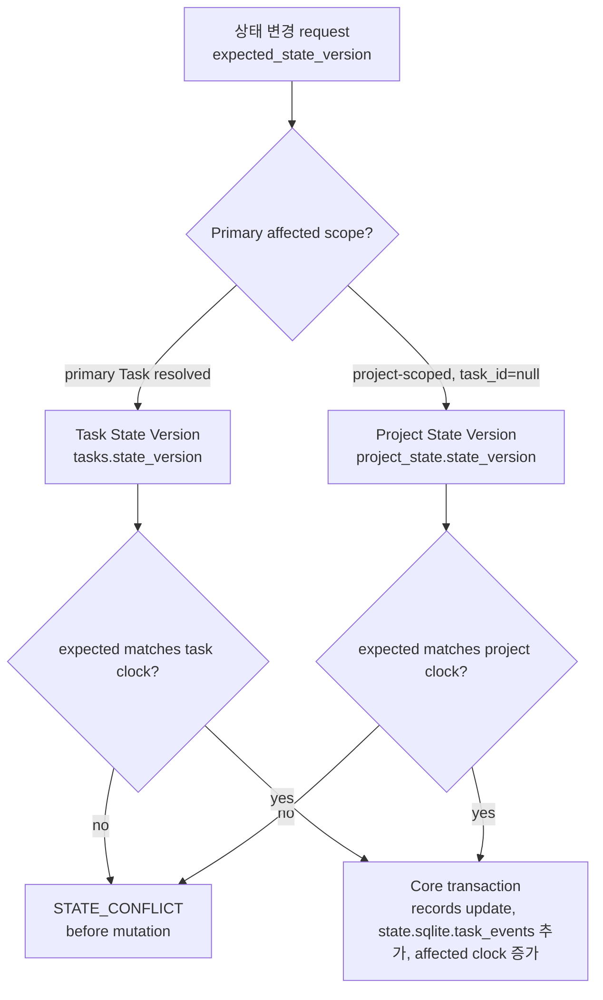
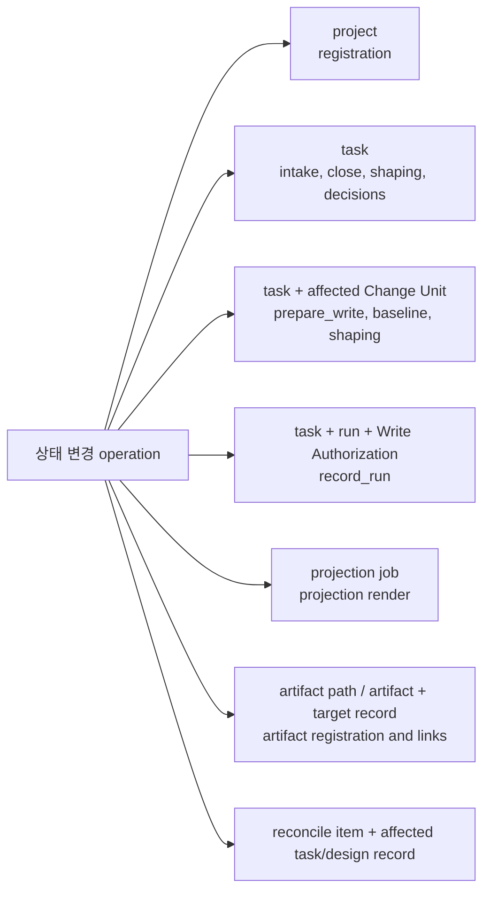
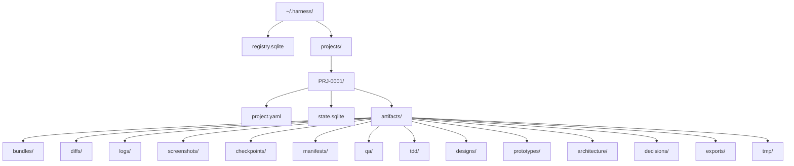
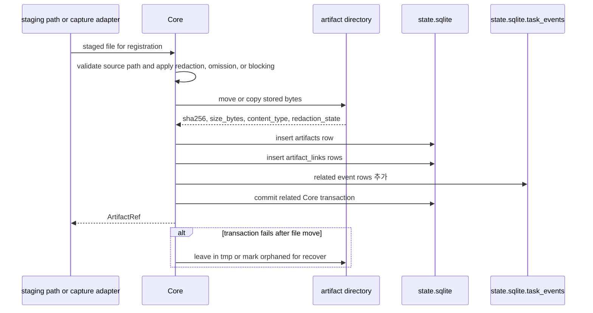
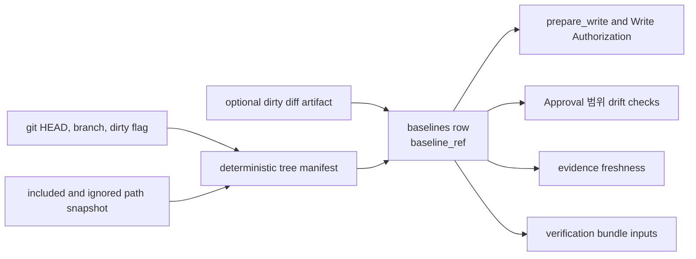
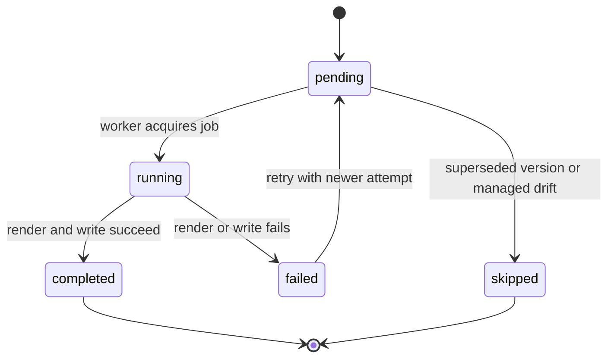
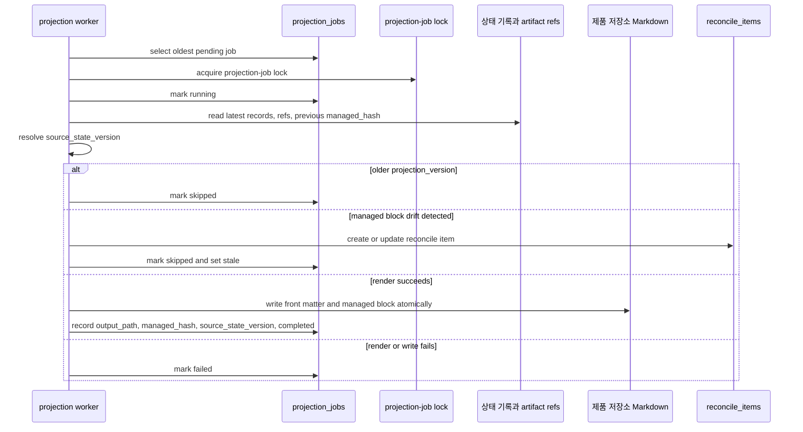
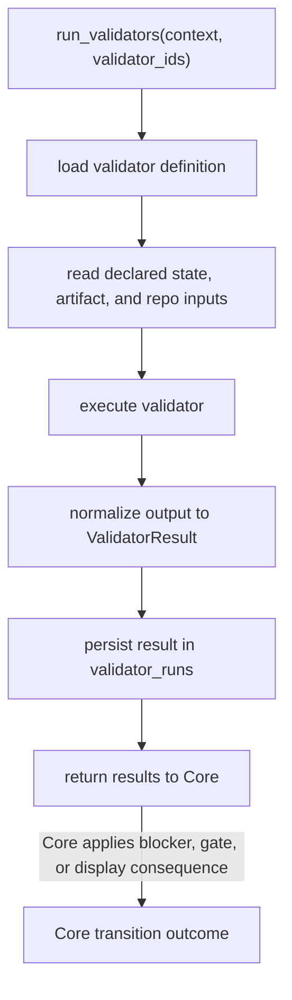

# Storage와 DDL

## 이 문서가 도와주는 일

이 참조 문서는 하네스 런타임의 storage model을 구현하거나 검토할 때 사용합니다. 하네스 런타임 홈 layout, `registry.sqlite`, `project.yaml`, `state.sqlite`, `task_events`, DDL draft, JSON `TEXT` validation, migration, lock policy, artifact directory layout, baseline capture format, projection job table, validator runner skeleton을 다룹니다.

이 문서는 storage 관련 reference입니다. Staged-pack sequencing은 이 문서가 정의하지 않습니다. Stage 순서와 exit criteria는 [Build: MVP 계획](../build/mvp-plan.md)을 봅니다.

이 문서는 참조 문서입니다. 문서 세트가 구현 계획에 사용할 수 있다고 승인되기 전에는 runtime/server 구현, 생성된 운영 파일, 실행 가능한 fixture 파일, runtime data를 만들라는 뜻이 아닙니다. 첫 제품 MVP 목표는 v0.1 Kernel MVP이며, Kernel Smoke는 이를 좁게 실행하는 conformance profile입니다. v0.2부터 v0.4까지는 Agency-Hardened MVP reference conformance target으로 가는 staged pack이고, v1+ Expansion은 owner 문서가 승격하고 증명하기 전까지 roadmap 범위에 남습니다.

## 이런 때 읽기

- 정확한 reference storage layout 또는 DDL draft가 필요할 때.
- 어떤 table이 persisted 상태 기록을 담당하는지 확인할 때.
- JSON `TEXT` field, enum-like `TEXT` field, lock, migration, artifact, baseline, projection job을 검증할 때.
- API schema와 storage implementation detail을 분리해서 유지할 때.

## 읽기 전에

Public request/response contract는 [MCP API와 스키마](mcp-api-and-schemas.md)를 사용합니다. Lifecycle과 gate value는 [커널 참조](kernel.md)를 사용하고, fixture semantics는 [Conformance Fixtures 참조](conformance-fixtures.md)를, operator behavior는 [운영과 Conformance 참조](operations-and-conformance.md)를 사용합니다.

## 핵심 생각

Storage는 Harness에 오래 남는 local record를 제공하지만 두 번째 authority model이 되지 않습니다. Public API shape, kernel transition, projection rule, operator semantics는 각 owner 문서에 남고, 이 문서는 storage layout과 DDL draft를 담당합니다.

## 계약 위치 지도

| 필요한 것 | 먼저 볼 곳 | 관련 owner |
|---|---|---|
| 하네스 런타임 홈과 local file posture | [Runtime home layout](#runtime-home-layout), [Runtime Home 권한과 변조 위험](#runtime-home-권한과-변조-위험) | Operator reporting은 [운영과 Conformance 참조](operations-and-conformance.md#doctor)에 남습니다. |
| Storage DDL | [DDL draft](#ddl-draft), 그다음 [DDL Section Map](#ddl-section-map) | Public API shape는 [MCP API와 스키마](mcp-api-and-schemas.md)에 남습니다. |
| Storage-owned JSON과 enum hardening | [권한 경계로서의 Storage hardening](#권한-경계로서의-storage-hardening), [JSON TEXT validation](#json-text-validation), [Canonical enum hardening](#canonical-enum-hardening) | Kernel value는 [커널 참조](kernel.md)에 남습니다. |
| Migration과 lock | [Migrations](#migrations), [Lock policy](#lock-policy) | Operator recovery 의미는 [운영과 Conformance 참조](operations-and-conformance.md#recover)에 남습니다. |
| Artifact storage와 registration | [Artifact directory layout](#artifact-directory-layout), [Artifact Kind Storage Notes](#artifact-kind-storage-notes), [Artifact Registration Contract](#artifact-registration-contract) | Artifact API ref는 [ArtifactRef](mcp-api-and-schemas.md#artifactref)에 남습니다. |
| Baseline과 verification bundle | [Baseline capture format](#baseline-capture-format), [Verification Bundle Shape](#verification-bundle-shape) | Verification과 close gate behavior는 [커널 참조](kernel.md#verification-gate)에 남습니다. |
| Projection job과 worker behavior | [Projection job table](#projection-job-table), [Projection Worker Execution](#projection-worker-execution) | Projection rule은 [문서 Projection 참조](document-projection.md)에 남습니다. |
| Validator-run storage와 fixture seed-loader expectation | [Validator runner skeleton](#validator-runner-skeleton), [Evidence and Verification Profile Implementation Notes](#evidence-and-verification-profile-implementation-notes) | Stable `ValidatorResult` shape는 [MCP API와 스키마](mcp-api-and-schemas.md#validatorresult)에 남고, fixture assertion은 [Conformance Fixtures 참조](conformance-fixtures.md#fixture-assertion-semantics)에 남습니다. |

## Storage model 요약

Harness는 등록된 project 전체를 관리하는 전역 runtime registry 하나와 project별 local state database 하나를 둡니다. Registry는 어떤 project와 접점이 있는지 기록합니다. `project.yaml`은 정적 프로젝트 설정을 저장합니다. `state.sqlite`는 기준 current record 및 추가 전용 task event를 저장합니다. 또한 idempotency replay용 row, artifact registry row, projection job, validator run result를 저장합니다.

Public API shape는 [MCP API와 스키마](mcp-api-and-schemas.md)가 담당합니다. Storage-owned DDL과 storage-only JSON validation은 이 문서가 담당합니다.

## 담당하는 참조 범위

이 문서는 다음 항목을 담당합니다.

- 하네스 런타임 홈 layout
- `registry.sqlite`
- `project.yaml`
- `state.sqlite`
- `task_events`
- DDL draft
- storage-owned field를 위한 JSON `TEXT` validation
- canonical enum hardening
- migrations
- lock policy
- artifact directory layout
- baseline capture format
- projection job table
- validator-run storage
- DDL과 fixture seed loader에 필요한 storage-owned compatibility details

## 여기서 다루지 않는 것

이 문서는 다음 항목을 담당하지 않습니다.

- public MCP request/response schema. [MCP API와 스키마](mcp-api-and-schemas.md)를 봅니다.
- public API error taxonomy. [MCP API와 스키마](mcp-api-and-schemas.md)를 봅니다.
- 전체 kernel lifecycle transition table. [커널 참조](kernel.md)를 봅니다.
- 설계 품질 정책 계약. [설계 품질 정책](design-quality-policies.md)을 봅니다.
- projection template body. [Template 참조](templates/README.md)를 봅니다. Projection rule은 [문서 Projection 참조](document-projection.md)가 담당합니다.
- staged-pack sequencing과 exit criteria. [Build: MVP 계획](../build/mvp-plan.md)을 봅니다.
- operator command 의미. [운영과 Conformance](operations-and-conformance.md)가 담당합니다.
- connector capability profile. [Agent 통합 참조](agent-integration.md)를 봅니다.
- surface recipe. [Surface Cookbook](surface-cookbook.md)을 봅니다.

## Runtime home layout

한국어 표현: 하네스 런타임 홈 layout.

기준 layout:

```text
~/.harness/
  registry.sqlite
  projects/
    PRJ-0001/
      project.yaml
      state.sqlite
      artifacts/
        bundles/
        diffs/
        logs/
        screenshots/
        checkpoints/
        manifests/
        qa/
        tdd/
        designs/
        prototypes/
        architecture/
        decisions/
        exports/
        tmp/
```

### Runtime Home 권한과 변조 위험

한국어 표현: 하네스 런타임 홈 권한과 변조 위험.

하네스 런타임 홈은 사용자 전용 로컬 제어 데이터로 취급해야 합니다. 문서 계약 수준에서 current reference baseline은 platform이 지원하는 경우 runtime root, project directories, `registry.sqlite`, `project.yaml`, `state.sqlite`, connector manifest, artifact directories, `artifacts/tmp/`, generated operational files에 owner-only access 또는 가장 가까운 platform equivalent를 적용하는 것입니다. Platform 또는 deployment가 그런 permission을 표현할 수 없다면, `doctor`는 OS 수준 보장을 암시하지 말고 더 약하거나 unknown인 posture를 보고해야 합니다.

파일 권한은 방어적 보강이지 두 번째 상태 모델이 아닙니다. Database row, artifact file, connector manifest, generated file은 Core validation, storage shape check, owner/link check, artifact integrity check, 또는 문서화된 `doctor`, `recover`, `artifacts check` 경로를 통해서만 기준으로 인정됩니다. 하네스 런타임 홈에 광범위한 쓰기 권한이 있으면 로컬 변조와 artifact poisoning 위험이고, 광범위한 읽기 권한은 secret, PII, token, private log, screenshot, verification bundle, exported state를 노출할 수 있습니다. Storage layer는 관찰된 owner/mode/path fact를 제공하고, Operations가 `OK`, `WARN`, `FAIL`, `MANUAL` severity mapping을 소유합니다.

권한 진단은 operator가 조치할 수 있을 만큼 구체적이어야 합니다.

| 관찰 사항 | 진단 의미 |
|---|---|
| Platform이 하네스 런타임 홈, project directory, 또는 `artifacts/tmp/`의 owner나 mode를 확인할 수 없습니다. | `doctor`는 영향을 받는 path class와 함께 unknown 또는 weak local file posture를 보고합니다. 이것만으로 state failure는 아니지만 posture를 이해하기 전까지 security guarantee를 낮춥니다. |
| 하네스 런타임 홈 또는 project storage가 unrelated user, group, shared container, 넓은 범위의 로컬 프로세스에게 writable입니다. | `doctor`는 변조 위험을 보고하고 write-capable 준비 상태를 fail로 표시할 수 있습니다. Core는 row, event, owner link, hash, artifact 등록을 검증한 뒤에만 의미를 받아들입니다. |
| Artifact storage가 unrelated user, group, shared container, 넓은 범위의 로컬 프로세스에게 readable입니다. | `doctor`, export, operation report는 민감한 값을 그대로 출력하지 않고 log, screenshot, token, PII, verification bundle, export에 대한 기밀성 위험을 설명합니다. |

## DDL draft

Reference storage는 registry와 project별 상태를 저장하기 위해 SQLite를 사용합니다. DDL은 초안 상태의 구현 계약입니다. index나 migration helper가 field name에 추가될 수 있습니다. 하지만 table ownership과 권한 경계는 안정적으로 유지되어야 합니다.

`task_spine_entries`는 public `journey_spine_entry` record를 저장하는 current reference table입니다. Journey Spine Entry wording은 public MCP/API naming에서 유지됩니다. table name은 task-local implementation shape를 보존하기 위해 유지합니다.

이 ER diagram은 아래 DDL 관계의 개요입니다. 관계 label은 storage link를 설명할 뿐, record를 부여하거나 변경할 권한을 뜻하지 않습니다. 정확한 구현 계약은 SQL DDL입니다.

### DDL Section Map

| Storage area | 볼 곳 | 여기서 찾는 것 |
|---|---|---|
| Storage hardening | [권한 경계로서의 Storage hardening](#권한-경계로서의-storage-hardening), [JSON TEXT validation](#json-text-validation), [Canonical enum hardening](#canonical-enum-hardening) | value validation과 owner-bound enum-like `TEXT` fields |
| Project config | [`project.yaml`](#projectyaml) | static project defaults, policies, surface config |
| Runtime registry | [`registry.sqlite`](#registrysqlite) | registered projects, project surfaces, connector manifests |
| Project state database | [`state.sqlite`](#statesqlite) | Task, gate, Change Unit, Run, approval, decision, evidence, artifact, projection, reconcile, design support, feedback-loop, validator, lock tables |
| Event rows | [`task_events`](#task_events) | append-only event storage와 stable-event owner boundary |

```mermaid
erDiagram
  projects ||--o{ project_surfaces : registers
  projects ||--o{ connector_manifests : has
  project_surfaces ||--o{ connector_manifests : describes
  projects ||--|| project_state : has
  tasks ||--|| task_gates : has
  tasks ||--o{ change_units : has
  tasks ||--o{ baselines : tracks
  tasks ||--o{ write_authorizations : tracks
  change_units ||--o{ write_authorizations : scopes
  write_authorizations ||--o| runs : consumed_by
  tasks ||--o{ runs : has
  tasks ||--o{ approvals : tracks
  decision_packets ||--o{ approvals : links
  tasks ||--o{ decision_packets : has
  tasks ||--o{ residual_risks : tracks
  decision_packets ||--o{ residual_risks : links
  tasks ||--o{ shared_designs : tracks
  tasks ||--o{ task_spine_entries : has
  change_units ||--o{ change_unit_dependencies : depends
  tasks ||--o{ evidence_manifests : has
  tasks ||--o{ evals : has
  tasks ||--o{ manual_qa_records : has
  decision_packets ||--o{ manual_qa_records : links
  tasks ||--o{ artifacts : links
  artifacts ||--o{ artifact_links : links
  tasks ||--o{ task_events : has
  tasks ||--o{ projection_jobs : tracks
  tasks ||--o{ reconcile_items : tracks
  tasks ||--o{ feedback_loops : has
  tasks ||--o{ tdd_traces : has
  tasks ||--o{ validator_runs : has
```



### 권한 경계로서의 Storage hardening

Storage hardening은 Harness의 권한과 보안 모델의 일부입니다. SQLite가 row를 저장할 수 있다는 사실만으로 그 row가 authoritative해지지는 않습니다. Row는 여전히 owner schema, owner value set, state-version basis, idempotency replay key, artifact owner/link contract와 맞아야 합니다.

`doctor`, `recover`, `artifacts check`, conformance runner는 이 check를 사용해 state가 current인지, invalid인지, repair 가능한지, 또는 신뢰하기 unsafe한지 판단합니다. Malformed JSON, schema-incompatible JSON, unknown owner-bound status value, replay row mismatch, stale state-version claim, connector manifest drift, projection status inconsistency, Task-scoped owner contract 밖의 artifact link는 presentation 문제가 아니라 storage integrity finding입니다. Recovery는 owner docs가 이미 허용하는 canonical state, registered artifact, managed output에서만 repair할 수 있습니다. 그렇지 않으면 fail하거나 manual intervention을 요구해야 합니다.

### JSON TEXT validation

Reference DDL의 JSON `TEXT` column은 storage flexibility를 주기 위한 장치입니다. 그렇다고 arbitrary JSON이나 partially parsed JSON을 그대로 저장해도 된다는 뜻은 아닙니다. Core는 commit 전에 JSON `TEXT` field 값을 parse하고, 잘못된 JSON을 거부하며, parsed value를 해당 field의 owning shape에 맞게 검증해야 합니다.

Public API payload와 API-shaped stored payload의 owning shape는 [MCP API와 스키마](mcp-api-and-schemas.md)의 schema입니다. Storage-only field의 owning shape는 이 문서의 reference storage contract 또는 이 문서가 이름 붙인 specific owner document입니다. 이 경계는 public schema를 [MCP API와 스키마](mcp-api-and-schemas.md)에, SQLite DDL을 이 문서에 둡니다.

Public API schema validation과 storage-owned JSON validation은 한 value가 두 경로를 모두 지나더라도 별도의 check입니다. 먼저 API [Schema notation convention](mcp-api-and-schemas.md#schema-notation-convention)에 따라 required, null, omitted 의미를 포함해 public request 또는 response-shaped payload를 validate합니다. 그다음 stored JSON `TEXT` value를 이 문서의 storage owner shape와 table/link constraint에 맞게 validate합니다. `'{}'` 또는 `'[]'` 같은 SQLite column default는 storage representation rule입니다. Public API field를 optional로 만들지 않으며 public extension field를 만들지도 않습니다.

잘못된 JSON은 유효하지 않은 state입니다. Schema와 맞지 않는 JSON도 유효하지 않은 state입니다. `'[]'` 또는 `'{}'` 같은 default를 가진 field는 SQLite가 column을 `TEXT`로 저장한다는 이유만으로 다른 JSON kind를 저장하면 안 되며, expected array 또는 object shape의 valid JSON을 계속 저장해야 합니다. 여기에는 `module_map_items.watchpoints_json` 같은 storage-owned array도 포함됩니다.

`doctor`는 malformed 또는 schema-incompatible JSON을 projection 최신성 문제나 report drift가 아니라 state failure로 보고해야 합니다. `recover`는 사용자 소유 판단을 새로 만들지 않고 다른 canonical state 또는 registered raw artifact에서 expected value를 재구성할 수 있을 때만 그 field를 rewrite할 수 있습니다. Conformance seed loader는 fixture가 invalid-state recovery를 명시적으로 다루지 않는 한 이런 row를 거부해야 합니다.

Recommended hardening: 배포된 SQLite build가 JSON functions를 지원하는 경우 migration은 JSON `TEXT` column에 `CHECK (json_valid(column_name))` 또는 equivalent generated check를 추가해야 합니다. 이 check는 방어적 보강이며 Core의 before-commit shape validation을 대체하지 않습니다. 아래 reference DDL은 모든 check를 inline으로 보여 주기 위해 full rewrite될 필요가 없습니다.

### Canonical enum hardening

Canonical enum column은 reference DDL에서 readability를 위해 `TEXT`를 사용하지만 open string이 아닙니다. Core validation이 기준입니다. Database check, lookup-table validation, generated check, migration assertion은 방어적 보강이며, write, close, replay, projection behavior를 좌우하는 state field부터 적용해야 합니다.

최소 enum hardening 대상:

| Field(s) | Hardening을 위한 owner/value source |
| --- | --- |
| `tasks.mode` | [Mode](kernel.md#mode). |
| `tasks.lifecycle_phase` | [Lifecycle Phase](kernel.md#lifecycle-phase)와 kernel transition table. |
| `tasks.result` | [Result](kernel.md#result)와 [Close Semantics](kernel.md#close-result-semantics). |
| `tasks.close_reason` | [Close Reason](kernel.md#close-reason)과 [Close Semantics](kernel.md#close-result-semantics). |
| `tasks.assurance_level` | [Assurance Level](kernel.md#assurance-level)과 [Verification Gate](kernel.md#verification-gate). |
| `tasks.projection_status` | 이 문서와 [문서 Projection 참조](document-projection.md)의 TASK projection freshness semantics. |
| `task_gates.scope_gate` | [Scope Gate](kernel.md#scope-gate). |
| `task_gates.decision_gate` | [Decision Gate](kernel.md#decision-gate). |
| `task_gates.approval_gate` | [Approval Gate](kernel.md#approval-gate). |
| `task_gates.design_gate` | [Design Gate](kernel.md#design-gate). |
| `task_gates.evidence_gate` | [Evidence Gate](kernel.md#evidence-gate). |
| `task_gates.verification_gate` | [Verification Gate](kernel.md#verification-gate). |
| `task_gates.qa_gate` | [QA Gate](kernel.md#qa-gate). |
| `task_gates.acceptance_gate` | [Acceptance Gate](kernel.md#acceptance-gate). |
| `write_authorizations.status` | [Kernel `prepare_write` State Logic](kernel.md#prepare_write)와 [MCP API와 스키마](mcp-api-and-schemas.md)의 public `WriteAuthorizationSummary`. |
| `decision_packets.status` | [Decision Gate Aggregate Recompute](kernel.md#decision-gate-aggregate-recompute)와 [MCP API와 스키마](mcp-api-and-schemas.md)의 public `DecisionPacket`. |
| `manual_qa_records.result` | [QA Gate](kernel.md#qa-gate)와 [`harness.record_manual_qa`](mcp-api-and-schemas.md#harnessrecord_manual_qa). |
| `evals.verdict` | [Verification Gate](kernel.md#verification-gate)와 [`harness.record_eval`](mcp-api-and-schemas.md#harnessrecord_eval). |
| `projection_jobs.status` | 이 문서와 [문서 Projection 참조](document-projection.md)의 projection job/freshness semantics. |

새 table이나 rebuild migration에서는 representative inline hardening으로 `status TEXT NOT NULL CHECK (status IN (...))`를 사용할 수 있습니다. Existing SQLite table에는 table rebuild, Core가 commit 전에 확인하는 small lookup table, 또는 tightening 전에 unknown value를 reject하는 migration-time assertion이 필요할 수 있습니다. DB에만 존재하는 enum value를 만들지 말고 storage hardening은 owner value source에 묶어야 합니다.

Unknown owner-bound status value는 fixture가 invalid state recovery를 명시적으로 test하는 경우가 아니라면 invalid state 또는 invalid fixture seed data입니다. `doctor`는 이를 영향을 받는 state, surface, projection, connector category 아래에 보고합니다. Migration은 unknown value가 있을 때 Kernel, API, Storage가 소유하지 않는 fallback value로 매핑하지 말고 tightening 전에 중단해야 합니다.

아래 table은 DDL의 추가 status-like `TEXT` field에 대한 owner map입니다. Storage validator, fixture seed loader, migration assertion이 allowed value를 어디서 가져와야 하는지 이름 붙이는 것이며, 두 번째 enum definition이 아닙니다.

| Field(s) | Hardening을 위한 owner/value source |
| --- | --- |
| `project_surfaces.guarantee_level`, `write_authorizations.guarantee_level`, `validator_runs.guarantee_level` | Semantic meaning은 [Runtime Architecture Guarantee Levels](runtime-architecture.md#보장-수준)가 담당합니다. Connector/profile 보고는 [Agent Integration Guarantee Levels](agent-integration.md#guarantee-levels)가 담당합니다. Public payload shape는 [MCP API와 스키마](mcp-api-and-schemas.md)에 반영됩니다. |
| `runs.kind` | [`harness.record_run`](mcp-api-and-schemas.md#harnessrecord_run)의 `RecordRunRequest.kind`. |
| `approvals.status` | [Approval Gate](kernel.md#approval-gate)의 Approval lifecycle semantics와 [`harness.record_user_decision`](mcp-api-and-schemas.md#harnessrecord_user_decision)의 Approval decision payload. |
| `decision_requests.decision_kind`, `decision_packets.decision_kind` | [MCP API와 스키마](mcp-api-and-schemas.md)의 Decision Packet public schemas와 decision payload branches. |
| `evidence_manifests.status` | [Evidence Gate](kernel.md#evidence-gate)와 [Evidence Sufficiency Profiles](kernel.md#evidence-sufficiency-profiles)의 evidence sufficiency semantics. |
| `residual_risks.visibility_status` | [Acceptance Gate](kernel.md#acceptance-gate)의 residual-risk visibility semantics와 [MCP API와 스키마](mcp-api-and-schemas.md)의 public `ResidualRiskSummary`. Summary-only `none` state는 kernel owner가 명시적으로 허용하지 않는 한 existing residual-risk row에 저장하면 안 됩니다. |
| `validator_runs.status` | [ValidatorResult](mcp-api-and-schemas.md#validatorresult)의 `ValidatorResult.status`. |
| `projection_jobs.projection_kind` | [Shared Schemas](mcp-api-and-schemas.md#shared-schemas)의 API-owned `ProjectionKind`. |
| `expected_projection` statuses 같은 projection fixture assertions | Operations fixture comparison semantics입니다. Owning projection schema가 함께 정의하지 않는 한 storage enum values가 아닙니다. |
| `feedback_loops.loop_kind`, `feedback_loops.status`, `tdd_traces.status` | [`harness.record_run`](mcp-api-and-schemas.md#harnessrecord_run)의 `FeedbackLoopUpdate`와 `TddTraceUpdate`, 그리고 아래의 storage-specific Feedback Loop notes. |
| `tool_invocations.status` | 이 문서의 reference idempotency/replay storage semantics. Surface diagnostic이 아니라 committed replay state만 설명합니다. Storage value는 아래에서 승격됩니다. |

다음 current reference storage-owned value set은 existing owner docs와 fixture example이 이미 stable meaning을 암시하는 field와, 이곳에서 owner-bound compatibility meaning을 해소하는 storage status field에 대해 승격됩니다. 이 value는 storage hardening value이며 API payload enum, kernel gate value, lifecycle phase, projection status, optional-table 요구사항을 다시 정의하지 않습니다.

| Field(s) | Durable values | Compatibility meaning |
| --- | --- | --- |
| `runs.status` | `completed`, `interrupted`, `blocked`, `violation` | `completed`는 committed Run record이며 normal owner refs와 gates를 통해서만 evidence, verification, QA, acceptance, close를 지원할 수 있습니다. Command failure는 별도 Run status가 아니라 `runs.command_results_json`과 related evidence에 남습니다. `interrupted`는 agent crash, session 또는 tool interruption, abandoned session, equivalent recovery condition 때문에 started 또는 observed되었지만 정상 완료되지 않은 execution attempt에 대한 committed recovery Run입니다. Interrupted Run에 captured된 diff/log artifacts는 recovery evidence이지 successful completion의 증거가 아닙니다. `interrupted`, `blocked`, `violation`은 의도적으로 committed된 recovery/audit Runs입니다. Compatible authorization이 실제로 consumed된 경우가 아니면 `runs.write_authorization_id`를 consumed로 채우면 안 되며, evidence sufficiency, detached verification, QA, acceptance, close readiness를 충족할 수 없습니다. |
| `change_units.status` | `planned`, `active`, `completed`, `deferred`, `superseded` | `planned`는 shaped되었지만 Task의 current active unit은 아닌 Change Unit입니다. `active`는 unit이 current writes를 scope할 때 `tasks.active_change_unit_id`와 일치해야 합니다. `completed`, `deferred`, `superseded`는 더 이상 new writes를 scope하지 않으며, completed, explicitly deferred, superseded Change Unit에 대한 kernel close rules 아래에서만 close-compatible합니다. |
| `baselines.status` | `captured`, `stale` | `captured`는 Core freshness checks가 계속 pass하는 동안에만 사용할 수 있는 baseline snapshot입니다. `stale`은 baseline이 해당 operation이 의존하는 repository state 또는 related approval/evidence/verification inputs와 더 이상 match하지 않는다는 뜻입니다. |
| `connector_manifests.status` | `current`, `drifted` | `current`는 connector-managed file list와 hashes가 manifest와 match한다는 뜻입니다. `drifted`는 generated file 또는 managed-block drift가 감지되어 overwrite 전에 reconcile로 라우팅되어야 한다는 뜻입니다. Missing manifest는 existing row의 status value가 아니라 doctor/connect가 absent state로 보고합니다. |
| `tool_invocations.status` | `committed` | Row는 idempotency key와 request hash로 replay할 수 있는 committed non-dry-run Core response에 대해서만 존재합니다. Dry run, malformed request, pre-commit state conflict, changed request-hash replay는 new replay row를 만들지 않습니다. Idempotent replay는 이 status를 바꾸지 않고 committed row를 반환합니다. |
| `decision_requests.status` | `open`, `linked`, `closed`, `expired`, `cancelled`, `superseded` | Optional routing/replay/handoff lifecycle일 뿐입니다. `open`은 request metadata가 routing 또는 staging을 위해 아직 current하다는 뜻입니다. `linked`는 row가 compatible 기준 `decision_packet_id`를 가리킨다는 뜻이며, gate aggregation은 linked Decision Packet을 통해서만 request를 고려할 수 있습니다. `closed`, `expired`, `cancelled`, `superseded`는 decision 권한을 만들지 않고 routing lifecycle을 끝냅니다. `decision_requests` row 자체는 `decision_gate`, Approval, acceptance, waiver, Residual Risk 수용, close를 절대 충족하지 않습니다. |
| `residual_risks.status` | `open`, `accepted`, `mitigated`, `deferred`, `superseded` | Residual Risk row의 risk lifecycle 및 accepted-risk metadata status입니다. `open`은 current known risk입니다. `accepted`는 user risk acceptance metadata가 이 row에 recorded되었다는 뜻이며, acceptance는 standalone accepted-risk 기록이 아니라 `residual_risks` 위의 state/metadata로 남습니다. `mitigated`는 다른 owner ref가 다시 열지 않는 한 current close-relevant risk로 취급하지 않아야 할 만큼 risk가 addressed되었다는 뜻입니다. `deferred`는 later handling을 위한 follow-up visibility와 닫기 영향을 보존합니다. `superseded`는 newer compatible risk record로 대체될 때 history를 보존합니다. `visibility_status`는 별도의 residual-risk visibility field로 남습니다. |
| `task_spine_entries.status` | `current`, `superseded` | Journey Spine Entry records는 reconstruction을 보완합니다. `current` entries는 continuity views에서 current annotations로 표시될 수 있습니다. `superseded` entries는 historical support records로 남지만 current journey facts로 제시하면 안 됩니다. |
| `change_unit_dependencies.status` | `open`, `satisfied`, `blocked`, `deferred`, `superseded` | Shaping, ordering, merge-risk visibility, 닫기 영향을 위한 dependency metadata입니다. `open`은 dependency가 아직 적용된다는 뜻입니다. `satisfied`는 dependency condition이 충족되었다는 뜻입니다. `blocked`는 dependency가 현재 compatible ordering 또는 close readiness를 막는다는 뜻입니다. `deferred`는 지금 해소되지 않고 visible follow-up 또는 닫기 영향이 남아 있다는 뜻입니다. `superseded`는 다른 dependency 또는 Change Unit shape가 이를 대체한다는 뜻입니다. 이 values는 scheduler를 만들지 않고 parallel implementation lanes를 허가하지 않습니다. |
| `shared_designs.status` | `proposed`, `active`, `stale`, `deferred`, `superseded` | Shared Design은 design-support record입니다. `active`는 affected scope의 current design basis입니다. `proposed`는 draft 또는 shaping input이며 그 자체로 design policy를 충족하기에 충분하지 않습니다. `stale`은 relying하기 전에 refresh, reconcile, 또는 new compatible design basis가 필요합니다. `deferred`와 `superseded`는 final acceptance, approval, Residual Risk 수용을 뜻하지 않고 visibility를 보존합니다. |
| `reconcile_items.status` | `pending`, `merged`, `rejected`, `converted_to_note`, `decision_created`, `deferred` | `pending`은 human-editable input 또는 generated/projection drift에서 생성된 해소되지 않은 candidate입니다. 다른 values는 reconcile decision path의 durable outcomes입니다. 즉 accepted state로 merge, proposal reject, note로 보존, Decision Packet create, 또는 visible follow-up/닫기 영향과 함께 defer하는 상태입니다. |
| `domain_terms.status` | `active`, `conflict` | `active`는 usable 기준 term입니다. `conflict`는 competing meanings 또는 해소되지 않은 terminology를 기록하며 stewardship/design checks에 계속 드러나야 하고 그 자체로 product use of the term을 허가할 수 없습니다. |
| `module_map_items.status` | `active` | `active`는 기준 Module Map Item의 current usable state입니다. Missing, `stale`, conflicting module knowledge는 additional reference row status가 아니라 reconcile items, projection freshness, validator findings, gates로 표현합니다. |
| `interface_contracts.review_status` | `pending`, `reviewed` | `pending`은 contract row가 있지만 required review/evidence가 아직 module/interface policy를 충족하지 못했다는 뜻입니다. `reviewed`는 callers, compatibility impact, 경계 tests, related review evidence가 recorded되었다는 뜻입니다. 이 값만으로 residual risk를 waive하거나 kernel gates를 무시하지 않습니다. |

### `project.yaml`

`project.yaml`은 static project configuration만 저장합니다. Current Task 상태를 저장하면 안 됩니다.

```yaml
project_id: PRJ-0001
display_name: my-app
repo_root: /abs/path/to/my-app
default_agent_surface: reference

agent_surfaces:
  reference:
    enabled: true
    capability_profile_id: SURF-PROFILE-0001

default_checks:
  lint: []
  test: []
  build: []

design_quality:
  vertical_slice_default: true
  tdd_required_for: []
  manual_qa_default_for: []

network_policy:
  default_write: deny
  allowed_read_domains: []
  allowed_write_targets: []

secret_policy:
  env_allowlist: []
  allow_secret_access_without_approval: false
```

### `registry.sqlite`

```sql
CREATE TABLE projects (
  project_id TEXT PRIMARY KEY,
  display_name TEXT NOT NULL,
  repo_root TEXT NOT NULL,
  repo_fingerprint TEXT NOT NULL,
  runtime_path TEXT NOT NULL,
  project_yaml_path TEXT NOT NULL,
  created_at TEXT NOT NULL,
  updated_at TEXT NOT NULL
);

CREATE TABLE project_surfaces (
  surface_id TEXT PRIMARY KEY,
  project_id TEXT NOT NULL REFERENCES projects(project_id),
  surface_kind TEXT NOT NULL,
  display_name TEXT NOT NULL,
  capability_profile_id TEXT NOT NULL,
  guarantee_level TEXT NOT NULL,
  enabled INTEGER NOT NULL DEFAULT 1,
  mcp_config_ref TEXT,
  last_seen_at TEXT,
  created_at TEXT NOT NULL,
  updated_at TEXT NOT NULL
);

CREATE TABLE connector_manifests (
  manifest_id TEXT PRIMARY KEY,
  project_id TEXT NOT NULL REFERENCES projects(project_id),
  surface_id TEXT NOT NULL REFERENCES project_surfaces(surface_id),
  manifest_version INTEGER NOT NULL,
  generated_paths_json TEXT NOT NULL,
  managed_hash TEXT NOT NULL,
  capability_profile_json TEXT NOT NULL,
  status TEXT NOT NULL,
  created_at TEXT NOT NULL,
  updated_at TEXT NOT NULL
);
```

### `state.sqlite`

```sql
CREATE TABLE project_state (
  project_id TEXT PRIMARY KEY,
  state_version INTEGER NOT NULL,
  updated_at TEXT NOT NULL
);

CREATE TABLE tasks (
  task_id TEXT PRIMARY KEY,
  state_version INTEGER NOT NULL,
  mode TEXT NOT NULL,
  lifecycle_phase TEXT NOT NULL,
  result TEXT NOT NULL,
  close_reason TEXT NOT NULL,
  assurance_level TEXT NOT NULL,
  title TEXT NOT NULL,
  current_summary TEXT NOT NULL DEFAULT '',
  acceptance_criteria_json TEXT NOT NULL DEFAULT '[]',
  active_change_unit_id TEXT,
  active_run_id TEXT,
  latest_evidence_manifest_id TEXT,
  latest_eval_id TEXT,
  latest_manual_qa_record_id TEXT,
  projection_version INTEGER NOT NULL DEFAULT 0,
  projected_version INTEGER NOT NULL DEFAULT 0,
  projection_status TEXT NOT NULL DEFAULT 'unknown',
  created_at TEXT NOT NULL,
  updated_at TEXT NOT NULL
);

CREATE TABLE task_gates (
  task_id TEXT PRIMARY KEY REFERENCES tasks(task_id),
  scope_gate TEXT NOT NULL,
  decision_gate TEXT NOT NULL,
  approval_gate TEXT NOT NULL,
  design_gate TEXT NOT NULL,
  evidence_gate TEXT NOT NULL,
  verification_gate TEXT NOT NULL,
  qa_gate TEXT NOT NULL,
  acceptance_gate TEXT NOT NULL,
  waiver_json TEXT NOT NULL DEFAULT '{}',
  updated_at TEXT NOT NULL
);

CREATE TABLE change_units (
  change_unit_id TEXT PRIMARY KEY,
  task_id TEXT NOT NULL REFERENCES tasks(task_id),
  title TEXT NOT NULL,
  purpose TEXT NOT NULL,
  non_goals_json TEXT NOT NULL DEFAULT '[]',
  slice_type TEXT NOT NULL,
  autonomy_profile TEXT NOT NULL,
  agent_may_do_json TEXT NOT NULL DEFAULT '[]',
  user_judgment_required_json TEXT NOT NULL DEFAULT '[]',
  afk_stop_conditions_json TEXT NOT NULL DEFAULT '[]',
  end_to_end_path_json TEXT NOT NULL DEFAULT '{}',
  horizontal_exception_reason TEXT,
  follow_up_vertical_change_unit_id TEXT,
  allowed_paths_json TEXT NOT NULL DEFAULT '[]',
  allowed_tools_json TEXT NOT NULL DEFAULT '[]',
  allowed_commands_json TEXT NOT NULL DEFAULT '[]',
  allowed_network_json TEXT NOT NULL DEFAULT '[]',
  secret_scope_json TEXT NOT NULL DEFAULT '[]',
  sensitive_categories_json TEXT NOT NULL DEFAULT '[]',
  validator_profile_json TEXT NOT NULL DEFAULT '[]',
  completion_conditions_json TEXT NOT NULL DEFAULT '[]',
  evaluator_focus_json TEXT NOT NULL DEFAULT '[]',
  status TEXT NOT NULL,
  created_at TEXT NOT NULL,
  updated_at TEXT NOT NULL
);

CREATE TABLE baselines (
  baseline_ref TEXT PRIMARY KEY,
  task_id TEXT NOT NULL REFERENCES tasks(task_id),
  change_unit_id TEXT,
  repo_head TEXT NOT NULL,
  branch TEXT NOT NULL,
  dirty INTEGER NOT NULL,
  tree_hash TEXT NOT NULL,
  included_paths_json TEXT NOT NULL DEFAULT '[]',
  ignored_paths_json TEXT NOT NULL DEFAULT '[]',
  diff_artifact_id TEXT REFERENCES artifacts(artifact_id),
  status TEXT NOT NULL,
  created_at TEXT NOT NULL,
  updated_at TEXT NOT NULL
);

CREATE TABLE write_authorizations (
  write_authorization_id TEXT PRIMARY KEY,
  task_id TEXT NOT NULL REFERENCES tasks(task_id),
  change_unit_id TEXT NOT NULL REFERENCES change_units(change_unit_id),
  basis_state_version INTEGER NOT NULL,
  baseline_ref TEXT REFERENCES baselines(baseline_ref),
  intended_operation TEXT NOT NULL,
  intended_paths_json TEXT NOT NULL DEFAULT '[]',
  intended_tools_json TEXT NOT NULL DEFAULT '[]',
  intended_commands_json TEXT NOT NULL DEFAULT '[]',
  intended_network_json TEXT NOT NULL DEFAULT '[]',
  intended_secrets_json TEXT NOT NULL DEFAULT '[]',
  sensitive_categories_json TEXT NOT NULL DEFAULT '[]',
  approval_refs_json TEXT NOT NULL DEFAULT '[]',
  decision_packet_refs_json TEXT NOT NULL DEFAULT '[]',
  guarantee_level TEXT NOT NULL,
  status TEXT NOT NULL,
  created_at TEXT NOT NULL,
  updated_at TEXT NOT NULL,
  expires_at TEXT,
  consumed_by_run_id TEXT,
  consumed_at TEXT
);

CREATE TABLE runs (
  run_id TEXT PRIMARY KEY,
  task_id TEXT NOT NULL REFERENCES tasks(task_id),
  change_unit_id TEXT,
  kind TEXT NOT NULL,
  actor_kind TEXT NOT NULL,
  surface_id TEXT NOT NULL,
  baseline_ref TEXT,
  write_authorization_id TEXT REFERENCES write_authorizations(write_authorization_id),
  summary TEXT NOT NULL DEFAULT '',
  observed_changes_json TEXT NOT NULL DEFAULT '{}',
  command_results_json TEXT NOT NULL DEFAULT '[]',
  artifact_refs_json TEXT NOT NULL DEFAULT '[]',
  status TEXT NOT NULL,
  started_at TEXT NOT NULL,
  completed_at TEXT
);

CREATE TABLE approvals (
  approval_id TEXT PRIMARY KEY,
  task_id TEXT NOT NULL REFERENCES tasks(task_id),
  change_unit_id TEXT,
  -- Optional compatibility ref; leave null when decision_requests is omitted.
  decision_request_id TEXT,
  decision_packet_id TEXT REFERENCES decision_packets(decision_packet_id),
  status TEXT NOT NULL,
  sensitive_categories_json TEXT NOT NULL DEFAULT '[]',
  allowed_paths_json TEXT NOT NULL DEFAULT '[]',
  allowed_tools_json TEXT NOT NULL DEFAULT '[]',
  allowed_commands_json TEXT NOT NULL DEFAULT '[]',
  allowed_network_targets_json TEXT NOT NULL DEFAULT '[]',
  secret_scope_json TEXT NOT NULL DEFAULT '[]',
  baseline_ref TEXT,
  expires_at TEXT,
  decision_note TEXT,
  created_at TEXT NOT NULL,
  decided_at TEXT
);

-- Optional compatibility/routing table for routing, interaction, replay, or compatibility handoff metadata only.
-- Minimal v0.1 Kernel MVP implementations may omit this table.
-- decision_packet_id may remain null for routing/replay staging; unlinked rows are non-authoritative.
-- Gate aggregation may consider a row only through a linked compatible decision_packet_id.
CREATE TABLE decision_requests (
  decision_request_id TEXT PRIMARY KEY,
  decision_packet_id TEXT REFERENCES decision_packets(decision_packet_id),
  task_id TEXT NOT NULL REFERENCES tasks(task_id),
  change_unit_id TEXT,
  decision_kind TEXT NOT NULL,
  status TEXT NOT NULL,
  prompt TEXT NOT NULL,
  options_json TEXT NOT NULL DEFAULT '[]',
  recommendation TEXT,
  approval_scope_json TEXT NOT NULL DEFAULT '{}',
  reconcile_item_id TEXT,
  expires_at TEXT,
  decided_option_id TEXT,
  decision_json TEXT NOT NULL DEFAULT '{}',
  note TEXT,
  waiver_reason TEXT,
  created_at TEXT NOT NULL,
  decided_at TEXT
);

CREATE TABLE decision_packets (
  decision_packet_id TEXT PRIMARY KEY,
  task_id TEXT NOT NULL REFERENCES tasks(task_id),
  change_unit_id TEXT,
  -- Optional compatibility ref; leave null when decision_requests is omitted.
  decision_request_id TEXT,
  decision_kind TEXT NOT NULL,
  status TEXT NOT NULL,
  question TEXT NOT NULL,
  options_json TEXT NOT NULL DEFAULT '[]',
  recommendation_json TEXT NOT NULL DEFAULT '{}',
  affected_scope_json TEXT NOT NULL DEFAULT '{}',
  autonomy_boundary_json TEXT NOT NULL DEFAULT '{}',
  context_refs_json TEXT NOT NULL DEFAULT '[]',
  context_artifact_refs_json TEXT NOT NULL DEFAULT '[]',
  residual_risk_refs_json TEXT NOT NULL DEFAULT '[]',
  decision_json TEXT NOT NULL DEFAULT '{}',
  superseded_by_decision_packet_id TEXT,
  created_at TEXT NOT NULL,
  updated_at TEXT NOT NULL,
  decided_at TEXT
);

CREATE TABLE residual_risks (
  residual_risk_id TEXT PRIMARY KEY,
  task_id TEXT NOT NULL REFERENCES tasks(task_id),
  change_unit_id TEXT,
  source_record_kind TEXT NOT NULL,
  source_record_id TEXT NOT NULL,
  related_decision_packet_id TEXT REFERENCES decision_packets(decision_packet_id),
  affected_scope_json TEXT NOT NULL DEFAULT '{}',
  affected_acceptance_criteria_json TEXT NOT NULL DEFAULT '[]',
  visibility_status TEXT NOT NULL,
  accepted_risk_json TEXT NOT NULL DEFAULT '{}',
  follow_up_requirement_json TEXT NOT NULL DEFAULT '{}',
  close_impact TEXT NOT NULL,
  status TEXT NOT NULL,
  created_at TEXT NOT NULL,
  updated_at TEXT NOT NULL,
  accepted_at TEXT
);

CREATE TABLE shared_designs (
  shared_design_id TEXT PRIMARY KEY,
  task_id TEXT REFERENCES tasks(task_id),
  change_unit_id TEXT,
  first_change_unit_id TEXT REFERENCES change_units(change_unit_id),
  title TEXT NOT NULL,
  design_kind TEXT NOT NULL,
  goal TEXT NOT NULL,
  non_goals_json TEXT NOT NULL DEFAULT '[]',
  acceptance_criteria_json TEXT NOT NULL DEFAULT '[]',
  status TEXT NOT NULL,
  scope_json TEXT NOT NULL DEFAULT '{}',
  assumptions_json TEXT NOT NULL DEFAULT '[]',
  resolved_questions_json TEXT NOT NULL DEFAULT '[]',
  domain_impact_refs_json TEXT NOT NULL DEFAULT '[]',
  module_impact_refs_json TEXT NOT NULL DEFAULT '[]',
  interface_impact_refs_json TEXT NOT NULL DEFAULT '[]',
  options_json TEXT NOT NULL DEFAULT '[]',
  selected_option_json TEXT NOT NULL DEFAULT '{}',
  rejected_options_json TEXT NOT NULL DEFAULT '[]',
  decision_packet_refs_json TEXT NOT NULL DEFAULT '[]',
  artifact_refs_json TEXT NOT NULL DEFAULT '[]',
  created_at TEXT NOT NULL,
  updated_at TEXT NOT NULL
);

CREATE TABLE task_spine_entries (
  task_spine_entry_id TEXT PRIMARY KEY,
  task_id TEXT NOT NULL REFERENCES tasks(task_id),
  change_unit_id TEXT,
  sequence_no INTEGER NOT NULL,
  entry_kind TEXT NOT NULL,
  lifecycle_phase TEXT,
  actor_kind TEXT NOT NULL,
  source_record_kind TEXT,
  source_record_id TEXT,
  summary TEXT NOT NULL DEFAULT '',
  refs_json TEXT NOT NULL DEFAULT '[]',
  artifact_refs_json TEXT NOT NULL DEFAULT '[]',
  status TEXT NOT NULL,
  created_at TEXT NOT NULL,
  updated_at TEXT NOT NULL,
  UNIQUE(task_id, sequence_no)
);

CREATE TABLE change_unit_dependencies (
  change_unit_dependency_id TEXT PRIMARY KEY,
  task_id TEXT NOT NULL REFERENCES tasks(task_id),
  change_unit_id TEXT NOT NULL REFERENCES change_units(change_unit_id),
  depends_on_change_unit_id TEXT NOT NULL REFERENCES change_units(change_unit_id),
  dependency_kind TEXT NOT NULL,
  status TEXT NOT NULL,
  merge_risk TEXT NOT NULL,
  visibility_note TEXT NOT NULL DEFAULT '',
  close_impact TEXT NOT NULL,
  rationale TEXT NOT NULL DEFAULT '',
  created_at TEXT NOT NULL,
  updated_at TEXT NOT NULL
);

CREATE TABLE evidence_manifests (
  evidence_manifest_id TEXT PRIMARY KEY,
  task_id TEXT NOT NULL REFERENCES tasks(task_id),
  change_unit_id TEXT,
  baseline_ref TEXT,
  criteria_json TEXT NOT NULL DEFAULT '[]',
  changed_files_json TEXT NOT NULL DEFAULT '[]',
  supporting_refs_json TEXT NOT NULL DEFAULT '[]',
  stale_if_json TEXT NOT NULL DEFAULT '[]',
  status TEXT NOT NULL,
  created_at TEXT NOT NULL,
  updated_at TEXT NOT NULL
);

CREATE TABLE evals (
  eval_id TEXT PRIMARY KEY,
  task_id TEXT NOT NULL REFERENCES tasks(task_id),
  change_unit_id TEXT,
  evaluator_run_id TEXT,
  target_run_id TEXT,
  verdict TEXT NOT NULL,
  checks_json TEXT NOT NULL DEFAULT '[]',
  evidence_reviewed_json TEXT NOT NULL DEFAULT '[]',
  independence_json TEXT NOT NULL DEFAULT '{}',
  blockers_json TEXT NOT NULL DEFAULT '[]',
  artifact_refs_json TEXT NOT NULL DEFAULT '[]',
  created_at TEXT NOT NULL
);

CREATE TABLE manual_qa_records (
  manual_qa_record_id TEXT PRIMARY KEY,
  task_id TEXT NOT NULL REFERENCES tasks(task_id),
  change_unit_id TEXT,
  qa_profile TEXT NOT NULL,
  performed_by TEXT NOT NULL,
  result TEXT NOT NULL,
  findings_json TEXT NOT NULL DEFAULT '[]',
  artifact_refs_json TEXT NOT NULL DEFAULT '[]',
  waiver_reason TEXT,
  waiver_decision_packet_id TEXT REFERENCES decision_packets(decision_packet_id),
  residual_risk_refs_json TEXT NOT NULL DEFAULT '[]',
  next_action TEXT NOT NULL,
  created_at TEXT NOT NULL
);

CREATE TABLE artifacts (
  artifact_id TEXT PRIMARY KEY,
  task_id TEXT NOT NULL REFERENCES tasks(task_id),
  run_id TEXT,
  kind TEXT NOT NULL,
  relative_path TEXT NOT NULL,
  sha256 TEXT NOT NULL,
  size_bytes INTEGER NOT NULL,
  content_type TEXT NOT NULL,
  redaction_state TEXT NOT NULL CHECK (redaction_state IN ('none', 'redacted', 'secret_omitted', 'blocked')),
  produced_by TEXT NOT NULL,
  retention_class TEXT NOT NULL,
  created_at TEXT NOT NULL
);

CREATE TABLE artifact_links (
  artifact_link_id TEXT PRIMARY KEY,
  artifact_id TEXT NOT NULL REFERENCES artifacts(artifact_id),
  task_id TEXT NOT NULL REFERENCES tasks(task_id),
  record_kind TEXT NOT NULL,
  record_id TEXT NOT NULL,
  relation_kind TEXT NOT NULL,
  created_at TEXT NOT NULL
);

CREATE TABLE task_events (
  event_id TEXT PRIMARY KEY,
  event_seq INTEGER NOT NULL UNIQUE,
  task_id TEXT,
  state_version INTEGER NOT NULL,
  event_type TEXT NOT NULL,
  actor_kind TEXT NOT NULL,
  surface_id TEXT,
  request_id TEXT,
  idempotency_key TEXT,
  payload_json TEXT NOT NULL DEFAULT '{}',
  created_at TEXT NOT NULL
);

CREATE TABLE tool_invocations (
  invocation_id TEXT PRIMARY KEY,
  project_id TEXT NOT NULL,
  task_id TEXT,
  tool_name TEXT NOT NULL,
  request_id TEXT NOT NULL,
  idempotency_key TEXT NOT NULL,
  request_hash TEXT NOT NULL,
  response_json TEXT NOT NULL DEFAULT '{}',
  state_version INTEGER NOT NULL,
  status TEXT NOT NULL,
  created_at TEXT NOT NULL,
  completed_at TEXT,
  UNIQUE(project_id, tool_name, idempotency_key)
);

CREATE TABLE projection_jobs (
  projection_job_id TEXT PRIMARY KEY,
  task_id TEXT,
  projection_kind TEXT NOT NULL,
  target_ref TEXT NOT NULL,
  projection_version INTEGER NOT NULL,
  source_state_version INTEGER,
  status TEXT NOT NULL,
  attempts INTEGER NOT NULL DEFAULT 0,
  output_path TEXT,
  managed_hash TEXT,
  error_json TEXT NOT NULL DEFAULT '{}',
  created_at TEXT NOT NULL,
  updated_at TEXT NOT NULL
);

CREATE TABLE reconcile_items (
  reconcile_item_id TEXT PRIMARY KEY,
  task_id TEXT,
  source_kind TEXT NOT NULL,
  source_path TEXT,
  source_hash TEXT,
  target_record_kind TEXT,
  target_record_id TEXT,
  proposed_change_json TEXT NOT NULL DEFAULT '{}',
  status TEXT NOT NULL,
  decision_json TEXT NOT NULL DEFAULT '{}',
  created_at TEXT NOT NULL,
  resolved_at TEXT
);

CREATE TABLE domain_terms (
  domain_term_id TEXT PRIMARY KEY,
  term TEXT NOT NULL,
  meaning TEXT NOT NULL,
  code_representation TEXT,
  not_this_json TEXT NOT NULL DEFAULT '[]',
  related_terms_json TEXT NOT NULL DEFAULT '[]',
  source_ref TEXT,
  status TEXT NOT NULL,
  created_at TEXT NOT NULL,
  updated_at TEXT NOT NULL
);

CREATE TABLE module_map_items (
  module_map_item_id TEXT PRIMARY KEY,
  module_path TEXT NOT NULL,
  responsibility TEXT NOT NULL,
  public_interface_json TEXT NOT NULL DEFAULT '[]',
  dependencies_json TEXT NOT NULL DEFAULT '[]',
  internal_complexity TEXT NOT NULL DEFAULT '',
  test_boundary TEXT,
  owner_decision TEXT,
  watchpoints_json TEXT NOT NULL DEFAULT '[]',
  status TEXT NOT NULL,
  created_at TEXT NOT NULL,
  updated_at TEXT NOT NULL
);

CREATE TABLE interface_contracts (
  interface_contract_id TEXT PRIMARY KEY,
  name TEXT NOT NULL,
  owner_module TEXT NOT NULL,
  change_type TEXT NOT NULL,
  inputs_json TEXT NOT NULL DEFAULT '[]',
  outputs_json TEXT NOT NULL DEFAULT '[]',
  errors_json TEXT NOT NULL DEFAULT '[]',
  compatibility_impact TEXT NOT NULL,
  callers_impacted_json TEXT NOT NULL DEFAULT '[]',
  boundary_tests_json TEXT NOT NULL DEFAULT '[]',
  review_status TEXT NOT NULL,
  created_at TEXT NOT NULL,
  updated_at TEXT NOT NULL
);

CREATE TABLE feedback_loops (
  feedback_loop_id TEXT PRIMARY KEY,
  task_id TEXT NOT NULL REFERENCES tasks(task_id),
  change_unit_id TEXT,
  loop_kind TEXT NOT NULL,
  loop_profile TEXT NOT NULL,
  planned_loop TEXT NOT NULL,
  selected_loop_refs_json TEXT NOT NULL DEFAULT '[]',
  execution_refs_json TEXT NOT NULL DEFAULT '[]',
  artifact_refs_json TEXT NOT NULL DEFAULT '[]',
  tdd_trace_refs_json TEXT NOT NULL DEFAULT '[]',
  manual_qa_record_refs_json TEXT NOT NULL DEFAULT '[]',
  evidence_manifest_refs_json TEXT NOT NULL DEFAULT '[]',
  status TEXT NOT NULL,
  waiver_reason TEXT,
  alternate_loop TEXT,
  created_at TEXT NOT NULL,
  updated_at TEXT NOT NULL
);

CREATE TABLE tdd_traces (
  tdd_trace_id TEXT PRIMARY KEY,
  task_id TEXT NOT NULL REFERENCES tasks(task_id),
  change_unit_id TEXT,
  status TEXT NOT NULL,
  red_refs_json TEXT NOT NULL DEFAULT '[]',
  green_refs_json TEXT NOT NULL DEFAULT '[]',
  refactor_refs_json TEXT NOT NULL DEFAULT '[]',
  non_tdd_justification TEXT,
  artifact_refs_json TEXT NOT NULL DEFAULT '[]',
  created_at TEXT NOT NULL,
  updated_at TEXT NOT NULL
);

CREATE TABLE validator_runs (
  validator_run_id TEXT PRIMARY KEY,
  task_id TEXT,
  change_unit_id TEXT,
  run_id TEXT,
  validator_id TEXT NOT NULL,
  validator_kind TEXT NOT NULL,
  status TEXT NOT NULL,
  guarantee_level TEXT NOT NULL,
  findings_json TEXT NOT NULL DEFAULT '[]',
  blocked_reasons_json TEXT NOT NULL DEFAULT '[]',
  created_at TEXT NOT NULL
);

CREATE TABLE locks (
  lock_id TEXT PRIMARY KEY,
  scope TEXT NOT NULL,
  owner TEXT NOT NULL,
  acquired_at TEXT NOT NULL,
  expires_at TEXT NOT NULL,
  heartbeat_at TEXT NOT NULL
);
```

Current reference TDD discipline은 existing `feedback_loops`와 `tdd_traces` tables를 사용합니다. `feedback_loops`는 selected feedback loop와 waiver를 위한 alternate loop의 owner이고, `tdd_traces`는 RED, GREEN, refactor/check artifacts 및 non-TDD justification의 owner입니다. Evidence Manifest rows는 계속 acceptance criteria와 changed files에 대한 coverage owner입니다.

`project_state.state_version`은 project-scoped state clock입니다. Core는 runtime bootstrap 중 registered project를 위한 `project_state` row를 정확히 하나 initialize하며, 이는 어떤 project-scoped mutation이 `expected_state_version`을 `project_state.state_version`과 비교하기 전이어야 합니다.

`tasks.state_version`은 task-scoped state clock입니다. Exact idempotent replay가 아닌 것으로 확인된 뒤, `Task` 범위의 mutation은 `expected_state_version`을 Core-resolved primary Task의 `tasks.state_version`과 비교하고, resolved primary Task가 없는 project-scoped mutation은 `project_state.state_version`과 비교합니다.

Supplied idempotency scope에 committed replay row가 없는 새 mutation attempt에서 state-version check는 단순히 동시에 발생한 write 충돌을 막는 장치가 아니라 stale authority를 막는 장치입니다. 오래된 `expected_state_version`은 request가 이전 Task 또는 project view를 바탕으로 한다는 뜻입니다. 이를 받아들이면 outdated scope, Approval, evidence, projection, artifact, user-judgment context가 더 새로운 권한을 덮어쓸 수 있습니다. Core는 mutation, artifact registration, projection enqueue, 그 conflicting new request를 위한 `tool_invocations` replay row 생성 전에 `STATE_CONFLICT`를 반환합니다.



`task_events`는 `state.sqlite` 안의 추가 전용 event history로 남습니다. Reference storage는 별도의 event store를 도입하지 않습니다. `task_events.event_seq`는 database 안 모든 events의 deterministic global 추가 sequence입니다. Core는 state change와 같은 write transaction 안에서 이를 allocate하며, Journey reconstruction, API event lists, conformance ordering은 timestamps가 아니라 ascending `event_seq`를 사용합니다. `task_events.state_version`은 affected scope의 resulting version을 기록합니다. Task events에서는 `tasks.state_version`이고, `task_id=null`인 project-level events에서는 `project_state.state_version`입니다. 여러 events가 같은 affected-scope `state_version`을 공유할 수 있지만 `event_seq`가 여전히 순서를 정의합니다.

`tool_invocations`는 original committed response를 반환하는 데 필요한 request replay metadata를 저장합니다. Committed non-dry-run tool call만 `tool_invocations`를 생성하거나 update합니다. `dry_run=true`는 replay row를 만들지 않고 authoritative replay를 위한 idempotency key를 소비하지 않습니다. 구현이 권한을 만들지 않는 진단 정보를 보관하더라도 `tool_invocations`에 저장하거나 상태 변경 response replay에 사용하면 안 됩니다. `tool_invocations.request_hash`는 MCP API idempotency rule이 정의한 정규화된 request hash를 저장합니다. 즉 정규화된 JSON, UTF-8, `tool_name`, schema-normalized request body와 optional field, sorted object key, schema가 명시적으로 order-insignificant라고 하지 않는 한 schema-ordered array, NFC Unicode string, 그리고 `request_id`와 `idempotency_key`만 제외하는 envelope coverage를 사용합니다. `tool_invocations.state_version`은 `ToolResponseBase.state_version`에 반환되는 것과 같은 primary affected-scope version을 저장합니다. Core가 primary Task를 찾으면 Task State Version이고, 그렇지 않으면 Project State Version입니다. 다른 `request_hash`로 idempotency key를 재사용하면 `STATE_CONFLICT`를 반환합니다.

Replay lookup은 같은 idempotency scope에 대해 current state-version freshness보다 committed row를 먼저 사용합니다. Stored `request_hash`가 일치하면 Core는 이미 committed된 result의 replay로 original committed response를 반환합니다. Current state가 전진했더라도 current `expected_state_version` check를 다시 실행하거나, event를 append하거나, artifact를 등록하거나, projection을 enqueue하거나, owner relation을 바꾸거나, replay row를 update하지 않습니다. Hash가 다르면 mismatch는 storage safety signal입니다. 호출자가 같은 mutation key를 다른 request body, artifact input set, envelope authority basis, owner relation에 재사용하려는 상황입니다. Core는 `STATE_CONFLICT`를 반환하고 original committed replay row를 보존하며 새 payload를 old response에 merge하지 않아야 합니다.

`tasks.projection_version`은 older TASK 렌더링이 newer 렌더링을 replace하지 못하게 하는 TASK projection/template/job version입니다. State clock이 아닙니다. `tasks.projected_version`은 retained되는 경우 TASK projection summary의 last rendered source state version cache일 뿐입니다. 모든 task-related `ProjectionKind`의 storage location으로 취급하면 안 됩니다.

`tasks.projection_status`는 TASK projection status summary입니다. Projection kind별 최신성은 API-owned Reference-required kind, Reference-optional kind, Extension / optional tier에 속하며 켜져 있는 projection kind에 대한 `projection_jobs.source_state_version`, job status, managed hashes, relevant projection records 또는 artifact refs를 통해 추적됩니다. 이 label들은 staged/reference support label이지 v0.1 Kernel MVP scope가 아닙니다. v0.1은 최소 `TASK` projection 또는 durable projection enqueue만 요구하고, v0.2+는 evidence/projection support를 확장하며, Agency-Hardened/reference projection support는 source record가 존재하거나 변경될 때 전체 Reference-required set을 지원합니다. `APR` freshness는 커밋된 Approval 기록과 그 Approval 형태 Decision Packet에서 시작하며, 상태를 변경하지 않는 `approval_request_candidate` payload에서 시작하지 않습니다. 하나의 Task field가 모든 projection freshness를 소유한다고 취급하면 안 됩니다.

`write_authorizations`는 durable `prepare_write` allow decisions를 저장합니다. Allow/block contract는 [Kernel `prepare_write` State Logic](kernel.md#prepare_write)이 담당하고, public response shape는 [`harness.prepare_write`](mcp-api-and-schemas.md#harnessprepare_write)가 담당합니다. Storage-specific 요구사항은 distinct committed non-dry-run allowed request마다 distinct row를 insert하고, idempotent return은 같은 idempotency key, request hash, compatible basis를 가진 same committed request replay에만 사용하며, `basis_state_version`이 compatibility basis로 사용된 affected-scope state version을 저장하고, authorization status가 바뀔 때마다 `updated_at`을 변경하며, status history를 `task_events`에 남기는 것입니다.

`basis_state_version`은 write를 위한 stale-authority protection입니다. 한 Task 또는 project state version을 기준으로 만들어진 Write Authorization은 affected scope, Approval basis, evidence context, artifact refs, user-judgment context가 바뀐 뒤의 권한으로 취급할 수 없습니다. Kernel rule은 오래된 authorization을 stale, expire, revoke할 수 있지만, storage가 existing authorization을 더 최신 state version으로 조용히 rebase하면 안 됩니다.

Stored `write_authorizations` rows는 conformance fixture seeds에서 insert되는 rows를 포함해 non-null `basis_state_version`을 요구합니다. Fixture runner는 insert 전에 seeded affected-scope state version에서 이 field를 도출할 수 있지만, stored row는 여전히 이 값을 포함해야 하며 이를 post-transaction `ToolResponseBase.state_version`으로 취급하면 안 됩니다.

`record_run` consumption은 `write_authorizations.consumed_by_run_id`와 `runs.write_authorization_id` reciprocal links를 한 Core transaction 안에서 설정하여 저장합니다. `runs.write_authorization_id`의 unique partial index는 committed Runs에 대한 storage single-use를 enforce합니다. Idempotent replay는 다른 Run row를 insert하지 않고 original Run과 response metadata를 반환합니다. 어떤 Run도 commit하기 전에 Write Authorization이 missing된 경우처럼 rejected pre-commit `record_run` calls는 `runs` row를 insert하지 않으므로 반환할 storage Run ID가 없습니다. Nullable API `run_id`는 placeholder를 만들지 않고 그 부재를 표현합니다. Invalid, `stale`, missing, consumed, scope-exceeded authorization을 시도한 Run은 `runs.write_authorization_id`를 비워 둡니다. Attempted refs는 audit를 위해 validator findings, run violation payload, `task_events.payload_json`에 남길 수 있습니다. Kernel-owned close/evidence consequences는 [Kernel `record_run` State Logic](kernel.md#record_run)에 둡니다.

`decision_packets`는 Decision Packet 상태 기록을 저장합니다. `decision_requests`는 implementation handoff, replay, compatibility request flow를 위한 optional interaction/routing compatibility table이며, minimal v0.1 Kernel MVP 구현은 그 optional index와 nullable compatibility field까지 함께 생략할 수 있습니다. 유지한다면 unlinked `decision_requests` row는 권한 없는 routing metadata로 남고, Approval link는 `approvals.decision_packet_id`를 사용하며, gate aggregation은 linked compatible `decision_packet_id`를 통해서만 `decision_requests`를 고려해야 합니다. Decision gate와 Approval/acceptance/risk 권한 rule은 [Kernel Decision Gate](kernel.md#decision-gate)와 [MCP API와 스키마](mcp-api-and-schemas.md#public-tools)의 related public tool이 담당합니다.

`residual_risks`는 residual-risk rows를 저장합니다. Current reference accepted-risk identity는 `residual_risk_id`이며, 별도의 `accepted_risks` table이나 `ARISK-*` 기준 record는 없습니다. Accepted-risk metadata/state는 `residual_risks.accepted_risk_json`, `status`, `accepted_at`에 남고, Decision Packets는 `decision_packets.residual_risk_refs_json`을 통해 rows를 reference할 수 있습니다. Visibility와 close semantics는 [Close Semantics](kernel.md#close-result-semantics)에 둡니다.

Current reference model의 final acceptance에는 `acceptance_records` table이 없습니다. Acceptance는 Decision Packet path, `task_gates.acceptance_gate`, `state.sqlite.task_events`를 통해 저장됩니다. Transition과 payload rules는 [Kernel `close_task` State Logic](kernel.md#close_task)과 [`harness.record_user_decision`](mcp-api-and-schemas.md#harnessrecord_user_decision)이 담당합니다. Close는 별도의 acceptance row를 찾지 않습니다.

`module_map_items`는 기준 Module Map Item을 저장합니다. 여기에는 module role/responsibility, public interface, dependencies, internal complexity, test 경계, owner 결정, module-local watchpoints가 포함됩니다. `watchpoints_json`은 위 JSON field 검증 경계를 따르는 non-empty module-local watchpoint string의 Core가 검증한 JSON array입니다. Interface-specific caller impact와 compatibility detail은 `interface_contracts`에 둡니다.

`feedback_loops`는 selected Feedback Loop definition과 execution routing을 저장합니다. `loop_kind` value는 `test`, `typecheck`, `lint`, `build`, `browser_smoke`, `manual_qa`, `tdd`, `eval`, `operational`, `alternate`입니다. `loop_profile`은 chosen loop를 그 kind 안에서 분류하고, `planned_loop`는 intended check를 설명합니다. `status` value는 `defined`, `executed`, `waived`, `blocked`, `stale`입니다. Create/update payload는 MCP schema의 `FeedbackLoopUpdate`에서 오며, `record_manual_qa`는 existing Manual QA feedback loop의 execution ref를 업데이트할 수 있습니다.

Core는 commit 전에 모든 JSON ref array를 검증해야 합니다. `selected_loop_refs_json`과 `execution_refs_json`은 `StateRecordRef` array를 저장합니다. `tdd_trace_refs_json`, `manual_qa_record_refs_json`, `evidence_manifest_refs_json`은 matching record kind로 제한됩니다. `artifact_refs_json`은 public update payload 또는 related tool request에서 찾은 committed `ArtifactRef` 값을 저장합니다. `operation=create`는 non-empty `loop_kind`, `loop_profile`, `planned_loop`, valid `status`를 요구합니다. `feedback_loop_id`는 Core가 할당하거나 deterministic fixture/import creation을 위해 caller-supplied일 수 있으며 unique해야 합니다. `operation=update`는 같은 `task_id`와 compatible `change_unit_id`를 가진 existing row를 요구합니다. Nullable scalar payload field는 stored value를 unchanged로 두고, ref array와 artifact ref는 additive입니다. `status=waived`는 `waiver_reason` 또는 referenced compatible waiver/decision record를 요구합니다. `status=executed`는 resulting execution, artifact, TDD trace, Manual QA, evidence manifest ref 중 적어도 하나를 요구합니다. TDD가 selected된 경우에도 `tdd_traces`는 기준 red/green/refactor evidence record로 남으며 `feedback_loops` row를 대체하지 않습니다. `feedback_loop_check`는 이 record를 읽는 validator이며 새 kernel gate를 추가하지 않습니다.

`artifact_links`는 artifact를 위한 queryable many-to-many attachment table입니다. Current Task-scoped artifact model에서 각 row는 registered artifact 및 owner 기록의 Task와 일치하는 non-null `task_id`를 가집니다. `task`, `change_unit`, `run`, `decision_packet`, `shared_design`, `residual_risk`, `evidence_manifest`, `feedback_loop`, `tdd_trace`, `manual_qa_record`, `eval`, `journey_spine_entry`, `projection` 같은 기존 owner 기록 중 같은 `task_id`로 Task-scoped인 owner 기록에만 artifact를 연결할 때 사용합니다. 어떤 owner kind가 project-scoped row도 가질 수 있다면, 그 row는 future extension이 project-scoped artifact storage/API를 추가하기 전까지 자체 state/projection metadata를 사용하며 artifact-link target이 아닙니다. Exported file은 `export_component`, `retention_class=export` 같은 artifact kind 또는 retention class를 사용합니다. Future extension이 matching table, `StateRecordRef` value, integrity semantics를 deliberate하게 추가하지 않는 한 `export` 상태 기록에 연결하지 않습니다. Existing `artifact_refs_json` field는 ordered 또는 record-local context를 보존할 수 있지만, multi-record artifact reuse와 artifact integrity check에는 `artifact_links`를 사용해야 합니다.

이 Task-scoped link는 artifact poisoning을 막는 control입니다. Required compatible `artifact_links` row가 없는 `artifacts` registry row만으로는 evidence, QA, verification, projection, export, close-related check를 충족할 수 없습니다. Task scope를 넘거나, missing owner를 가리키거나, artifact kind와 incompatible한 owner kind를 사용하는 link는 거부해야 합니다. Ordered `artifact_refs_json` display context는 registry와 owner-link check를 우회할 수 없습니다.

`artifact_links.record_kind=projection`에서 `artifact_links.record_id`는 `projection_jobs.projection_job_id`를 저장합니다. 이 link는 Core가 해당 job을 linked 렌더링된 projection output으로 찾을 수 있을 때만 valid합니다. 즉 job이 artifact link와 같은 `task_id`로 Task-scoped이고, matching `projection_kind`와 `target_ref`, `status=completed`, 그리고 렌더링된 output을 위한 `output_path` 또는 documented projection ref가 필요합니다. `projection_jobs.target_ref`와 `output_path`는 validation and locator metadata이며 `artifact_links.record_id`를 대체하지 않습니다. Project-level projection job은 projection owner docs가 허용하는 곳에서 여전히 `projection_jobs`에 track될 수 있지만, current Task-scoped artifact DDL은 그 job을 위한 project-scoped artifact row 또는 artifact link를 만들지 않습니다. 이 contract는 current reference storage를 `projection_jobs`에 유지하며 `projections` table을 도입하지 않습니다.

`manual_qa_records.waiver_decision_packet_id`와 `manual_qa_records.residual_risk_refs_json`은 QA 면제 decision과 close-relevant risk ref를 위한 storage hook입니다. Waiver contract는 [Kernel Waiver Semantics](kernel.md#waiver-semantics)와 [설계 품질 정책](design-quality-policies.md#manual-qa-manual_qa)의 Manual QA policy가 담당합니다.

`change_unit_dependencies`는 shaping, ordering, close visibility를 위한 current reference DAG metadata입니다. Parallel orchestration scheduler가 아니며 multiple active implementation lanes를 허가하지 않습니다.

`baselines`는 repo head, branch, dirty flag, tree hash, included/ignored paths, optional diff artifact, status를 가진 BaselineCapture record를 state에 저장합니다. 다른 table의 `baseline_ref` field는 `baselines.baseline_ref`를 참조합니다.

Recommended indexes:

```sql
CREATE INDEX idx_task_events_task_version ON task_events(task_id, state_version);
CREATE INDEX idx_task_events_task_seq ON task_events(task_id, event_seq);
CREATE INDEX idx_decision_requests_task_status ON decision_requests(task_id, status); -- optional; omit when decision_requests is omitted
CREATE INDEX idx_decision_requests_packet ON decision_requests(decision_packet_id); -- optional; omit when decision_requests is omitted
CREATE INDEX idx_decision_packets_task_status ON decision_packets(task_id, status);
CREATE INDEX idx_residual_risks_task_status ON residual_risks(task_id, status);
CREATE INDEX idx_shared_designs_task_status ON shared_designs(task_id, status);
CREATE INDEX idx_feedback_loops_task_status ON feedback_loops(task_id, status);
CREATE INDEX idx_feedback_loops_change_unit ON feedback_loops(change_unit_id);
CREATE INDEX idx_task_spine_entries_task_seq ON task_spine_entries(task_id, sequence_no);
CREATE INDEX idx_change_unit_dependencies_task ON change_unit_dependencies(task_id, change_unit_id);
CREATE INDEX idx_baselines_task_change_unit ON baselines(task_id, change_unit_id);
CREATE INDEX idx_write_authorizations_task_status ON write_authorizations(task_id, status);
CREATE INDEX idx_write_authorizations_change_unit ON write_authorizations(change_unit_id);
CREATE INDEX idx_approvals_decision_packet ON approvals(decision_packet_id);
CREATE INDEX idx_projection_jobs_status ON projection_jobs(status, projection_version);
CREATE INDEX idx_artifacts_task_run ON artifacts(task_id, run_id);
CREATE INDEX idx_artifact_links_artifact ON artifact_links(artifact_id);
CREATE INDEX idx_artifact_links_record ON artifact_links(record_kind, record_id);
CREATE INDEX idx_runs_task_status ON runs(task_id, status);
CREATE INDEX idx_runs_write_authorization ON runs(write_authorization_id);
CREATE UNIQUE INDEX uq_runs_write_authorization_consumed
ON runs(write_authorization_id)
WHERE write_authorization_id IS NOT NULL;
CREATE INDEX idx_evals_task_change_unit ON evals(task_id, change_unit_id);
CREATE INDEX idx_manual_qa_records_task_change_unit ON manual_qa_records(task_id, change_unit_id);
CREATE INDEX idx_reconcile_items_status ON reconcile_items(status);
```

### `task_events`

`task_events`는 application policy상 추가 전용입니다. `event_seq`는 monotonically allocated되며 절대 reused되지 않습니다. Recovery는 새 `event_seq` value를 가진 compensating event를 추가하며 historical row나 historical order를 rewrite하면 안 됩니다.

Deterministic event order는 ascending `task_events.event_seq`입니다. `state_version`은 affected-scope concurrency/result clock이고 `created_at`은 audit metadata입니다. 여러 events가 같은 state version이나 timestamp를 공유할 수 있으므로 어느 field도 conformance ordering에는 충분하지 않습니다.

Reference event storage는 stable events와 non-stable detail 또는 local-audit events를 `state.sqlite.task_events` rows로 유지하며, 별도 event store는 도입하지 않습니다. Write Authorization lifecycle names와 `scope_violation_detected`와의 관계를 포함해 fixture가 검증할 수 있는 stable names는 [Kernel Stable Event Catalog](kernel.md#stable-event-catalog)가 담당합니다. Kernel catalog 밖의 tool-specific event names는 optional 또는 illustrative extension events이며 staged/reference fixtures가 요구하면 안 됩니다.

## Migrations

Reference storage는 작은 internal migration ledger에 기록된 integer schema versions를 사용합니다.

```sql
CREATE TABLE schema_migrations (
  database_name TEXT NOT NULL,
  version INTEGER NOT NULL,
  applied_at TEXT NOT NULL,
  checksum TEXT NOT NULL,
  PRIMARY KEY (database_name, version)
);
```

Reference migration은 forward-only여야 합니다. Migration failure가 발생하면 doctor/recover가 repair 가능성을 보고할 때까지 project는 unavailable 상태로 남습니다.

Storage hardening migration은 table을 tighten하거나 imported fixture data를 받아들이기 전에 다음 checklist를 사용해야 합니다.

- 모든 JSON `TEXT` field는 SQLite JSON check를 추가하기 전에 parse하고 owner shape를 검증합니다. Malformed 또는 schema-incompatible value는 사용자 소유 판단 없이 documented recovery path가 값을 재구성할 수 있는 경우가 아니라면 migration을 block합니다.
- `CHECK` constraint, generated check, lookup validation을 추가하기 전에 owner-bound enum과 status-like `TEXT` value를 assert합니다. Write, close, replay, projection behavior를 좌우하는 field부터 다루며 Kernel, API, Storage ownership 밖의 database-only fallback value를 만들면 안 됩니다.
- Tightening 전에 projection field와 job을 reconcile합니다. `tasks.projection_status`는 `TASK` summary일 뿐입니다. `projection_jobs.status`, `projection_jobs.projection_kind`, `projection_jobs.source_state_version`이 job별 freshness와 identity를 가집니다. 성공한 completed render는 projection contract가 요구하는 source state version을 가져야 합니다.
- `connector_manifests.status`는 existing row status로만 확인합니다. Valid existing row는 `current` 또는 `drifted`입니다. Missing manifest는 새 database enum value가 아니라 `doctor` 또는 connect diagnostic이 보고하는 absent connector state로 남습니다.
- Fixture seed와 import loader는 Core storage가 사용하는 것과 같은 JSON, enum/status, state-version, idempotency, projection, connector-manifest, artifact registry, artifact-link validation을 통과해야 합니다. Compact fixture shorthand는 insert 전에 valid owner record로 확장되어야 합니다.

## Lock policy

State-changing operations는 가능한 가장 좁은 scope에서 lock을 획득합니다.

| Operation | Lock scope |
|---|---|
| project registration | project |
| task intake/close | task |
| shaping update | task and affected Change Unit |
| Decision Packet 생성/해소 | Task와 affected Decision Packet |
| residual risk create/update/accept | task and affected residual risk |
| baseline capture | task and affected Change Unit |
| prepare_write | task and active Change Unit; allowed일 때 Write Authorization |
| record_run | task and run; consumed되는 Write Authorization이 있으면 해당 authorization |
| projection 렌더링 | projection job |
| artifact registration | artifact path |
| artifact link registration | artifact and target record |
| reconcile decision | reconcile item and affected task/design record |



Lock이 expired되면 다음 operation은 recovery event를 추가한 뒤 lock을 가져갈 수 있습니다. Replayed mutation이 아닌 attempt에서 `expected_state_version`이 relevant task 또는 project scope에서 최신이 아니면 mutation 전에 `STATE_CONFLICT`를 반환합니다.

## Artifact directory layout

기준 layout:

```text
~/.harness/
  registry.sqlite
  projects/
    PRJ-0001/
      project.yaml
      state.sqlite
      artifacts/
        bundles/
        diffs/
        logs/
        screenshots/
        checkpoints/
        manifests/
        qa/
        tdd/
        designs/
        prototypes/
        architecture/
        decisions/
        exports/
        tmp/
```



Artifact filenames는 collision을 피할 만큼 stable identity를 포함해야 합니다.

```text
{task_id}/{run_id-or-record_id}/{artifact_id}-{kind}.{ext}
```

제품 저장소의 Markdown 보고서는 기본적으로 원본 artifact가 아닙니다. Export에 보고서 snapshot이 필요하면 그 snapshot을 export component artifact로 저장할 수 있지만, 보고서 projection과 원본 evidence의 구분은 유지해야 합니다.

Artifact directory는 일반 drop zone이 아닙니다. Local layout 자체도 trust boundary입니다. `state.sqlite`, `registry.sqlite`, artifact file은 registered project layout을 통해 찾을 수 있고 이 문서가 소유하는 owner, integrity, shape check를 통과할 때만 authoritative합니다. Direct edit, 복사된 artifact file, orphaned staging file, 사람이 바꾼 connector state는 Core, `doctor`, `recover`, `artifacts check`가 documented path로 검증하거나 복구하기 전까지 committed Harness meaning으로 받아들이지 않습니다.

`artifacts/tmp/` 아래 file은 staging input일 뿐 committed artifact가 아닙니다. Staged path는 Core가 path 또는 capture adapter를 검증하고, 안전한 stored bytes를 registered artifact path 아래에 쓰며, `artifacts` row를 insert하고, 같은 Task의 owner에 link하는 transition이 commit된 뒤에만 의미를 가집니다.

### Artifact Kind Storage Notes

`artifacts.kind` field는 durable evidence files의 이름을 붙입니다. 그렇다고 artifact file이 대응하는 상태 기록을 담당하는 것은 아닙니다.

| Artifact kind | Reference storage note |
|---|---|
| `design_probe` | 탐색적 design finding, sketch, probe output은 `artifacts/designs/` 아래 저장합니다. 수용된 구조는 `shared_designs`, design support records, 또는 Task/Change Unit state에 속합니다. |
| `prototype` | Prototype diff, screenshot, log, 일회성 증명 artifact는 `artifacts/prototypes/` 아래 저장합니다. 제품 코드는 제품 저장소에 남고, commit된 Harness 의미는 상태 기록에 남습니다. |
| `architecture_scan` | Module scan, dependency snapshot, 경계 finding, stewardship evidence는 `artifacts/architecture/` 아래 저장합니다. Accepted module/interface facts는 owner 기록으로 남습니다. |
| `decision_context` | 사용자 판단을 위한 compact context bundle은 `artifacts/decisions/` 아래 저장합니다. Decision Packet status와 outcome은 `state.sqlite`에 남습니다. |
| `screenshot` / `qa_capture` / `log` | Manual QA screenshot, browser QA capture bundle, console log, network trace, accessibility snapshot, workflow recording은 필요한 redaction, omission, blocking을 적용한 뒤에만 matching artifact area에 저장합니다. Manual QA record, Feedback Loop, Run, Evidence Manifest는 owner 기록으로 남습니다. Automated browser capture는 current reference model에 required가 아니며, capture artifact는 Manual QA judgment, acceptance, detached verification을 대체하지 않습니다. |
| `bundle` / `manifest` | Verification bundle, evaluator instruction bundle, artifact manifest는 `artifacts/bundles/` 또는 `artifacts/manifests/` 아래 저장합니다. Owner는 existing Task, Run, Evidence Manifest, Eval, 또는 Task-scoped projection record로 남습니다. |
| `export_component` | Export manifest file, projection snapshot, state snapshot, 허용된 raw-file copy는 `artifacts/exports/` 아래 저장합니다. 이 artifacts는 `export` state table이 아니라 describe하는 기존 owner 기록으로 다시 link합니다. |

### Artifact Registration Contract

Artifact 등록은 Task, Run, Decision Packet context, Shared Design, Journey Spine Entry, Evidence Manifest, Eval, Manual QA record, Feedback Loop, TDD Trace, 렌더링된 Task-scoped projection 같은 owner 기록을 기록하는 Core transition의 일부입니다. Verification bundle과 export component는 그 owner 기록에 link되는 artifact file이며 기준 `verification_bundle` 또는 `export` 상태 기록은 아닙니다.

Artifact 등록은 artifact poisoning을 막는 storage boundary입니다. Staged path, capture adapter output, file name, extension, declared content type, requested owner relation은 source 검증, redaction, omission, blocking 적용, stored-byte integrity 계산, 기존 Task-scoped owner record와의 link 검증이 끝나기 전까지 신뢰할 수 있는 입력이 아닙니다. Committed artifact에는 registered `ArtifactRef`, `artifacts` row, `sha256`, `size_bytes`, `redaction_state`, `retention_class`, compatible `artifact_links` owner relation이 필요합니다. API의 `staged_uri`는 approved staging 또는 capture output을 가리키는 locator일 뿐입니다. 임의 absolute path, symlink target, parent traversal, repo-local file을 이름으로 지정해 이 경계를 우회할 수 없습니다.

예를 들어 `../../repo/.env` 같은 staged path, 사용자 home directory 아래 absolute path, 또는 `artifacts/tmp/`를 벗어나는 symlink는 approved staging/capture boundary 밖으로 보고합니다. 응답 또는 `artifacts check` report는 영향을 받는 staged locator와 boundary class를 식별하고, 기존 artifact/check/error 경로를 통해 등록을 거부하거나 artifact input을 유효하지 않은 것으로 표시하며, 금지된 대상을 Harness 근거로 복사하거나 hash하지 않습니다.

Current reference registration steps:

1. Connector-captured 또는 operator-supplied file은 project artifact `tmp/` directory 아래 canonical staging path나 approved capture adapter에서만 받습니다.
2. Hashing 전에 redaction, omission, blocking을 적용합니다. Raw secrets와 허용되지 않은 PII는 durable artifact storage로 복사하면 안 됩니다. Secret-related evidence는 redacted artifact, 안전한 secret handle 또는 omission note, relevant validator가 받아들인 operator note로만 표현합니다.
3. Stored bytes를 matching kind directory 아래 `{task_id}/{run_id-or-record_id}/{artifact_id}-{kind}.{ext}` 형식으로 artifact directory에 move 또는 copy합니다.
4. 안전하게 저장된 bytes에서 `sha256`, `size_bytes`, `content_type`, `redaction_state`를 계산합니다. `blocked`에서는 이 bytes가 금지된 capture payload가 아니라 metadata-only notice입니다.
5. 관련 상태 기록을 기록하고 `task_events`에 추가하는 같은 Core transaction에서 `artifacts` row와 required `artifact_links` row를 insert합니다.
6. Artifact registry row를 통해 해석되는 `uri`를 가진 `ArtifactRef`를 반환합니다.
7. File move는 성공했지만 transaction이 실패했다면 file을 `tmp/`에 남기거나 `recover`를 위해 orphaned로 표시합니다. Committed artifact ref나 artifact link를 만들면 안 됩니다.



`redaction_state` implementation:

| State | Stored artifact bytes | Storage consequence |
|---|---|---|
| `none` | original non-sensitive evidence | Hash와 size는 등록된 bytes를 기준으로 합니다. Export 또는 verification bundle에 raw로 포함할 수 있는지는 여전히 retention과 export policy가 결정합니다. |
| `redacted` | redacted evidence; the unredacted original is not retained by the harness | Hash와 size는 redacted bytes만 기준으로 합니다. |
| `secret_omitted` | secret value 또는 PII를 생략하거나 handle로 대체한 evidence | Omission note 또는 handle만 저장합니다. 생략된 원본 값은 artifact storage, projection snapshot, verification bundle, export bundle로 복사하지 않습니다. Hash, size, content type은 safe stored bytes만 기준으로 합니다. |
| `blocked` | capture가 차단되었음을 설명하는 작은 metadata-only notice artifact | 금지된 내용은 저장하지 않습니다. Core가 이를 기록했다면 notice는 여전히 committed registered artifact record입니다. `sha256`, `size_bytes`, `content_type`은 notice bytes를 기준으로 합니다. Owner 기록은 audit을 위해 blocked ref를 유지할 수 있지만, artifact bytes는 available evidence가 아닙니다. |

Evidence sufficiency, Manual QA, verification, projection, export reader는 committed `ArtifactRef`와 `redaction_state`, `retention_class`, hash, size, owner relation을 함께 사용합니다. `secret_omitted`는 secret이 아닌 evidence가 남아 있는 주장을 뒷받침할 수 있지만 생략된 bytes가 필요한 주장은 뒷받침할 수 없습니다. `blocked`는 시도된 capture를 audit용으로 보이게 하되, owner flow가 replacement, waiver, Decision Packet outcome, 또는 다른 documented resolution을 기록하기 전까지 related evidence, QA, verification, projection display, export component를 blocked 또는 insufficient 상태로 남깁니다.

Artifact integrity failures는 `ARTIFACT_MISSING` 또는 validator failure를 반환하고, kernel rules에 따라 related evidence, projection freshness, export readiness, close readiness를 `stale` 또는 blocked로 표시합니다. Missing file, hash mismatch, size mismatch는 Markdown을 편집해서 repair하지 않습니다. Recovery는 registered hash와 size에 맞는 bytes를 rescan 또는 restore하거나 Core를 통해 replacement artifact를 등록할 수 있습니다. Documented registration path 없이 다른 bytes를 정당화하도록 artifact row를 rewrite하면 안 됩니다.

Owner validation은 표시 편의를 위한 절차가 아니라 integrity의 일부입니다. Artifact가 다른 Task, Run, projection job, Decision Packet, Evidence Manifest, Eval, Manual QA record, 또는 다른 owner를 주장하더라도, 그 owner가 존재하고 artifact kind와 호환되며 artifact-link contract가 요구하는 같은 Task scope에 있지 않으면 거부해야 합니다. Export component와 verification bundle도 기존 owner로 다시 link되며 standalone `export` 또는 `verification_bundle` 상태 기록을 만들지 않습니다.

## Baseline capture format

Baseline capture는 write, approval, evidence, verification checks가 사용하는 repository 상태를 기록합니다.

Reference storage는 각 capture를 `baselines`에 저장합니다. `baseline_ref`는 Run, approval, evidence manifest, verification bundle, validator가 사용하는 primary key입니다. Dirty diff가 capture되면 `baselines.diff_artifact_id`가 registered diff artifact를 가리키고, `artifact_links` row가 이를 baseline context에 연결합니다.

```yaml
BaselineCapture:
  baseline_ref: BASE-0001
  project_id: PRJ-0001
  task_id: TASK-0001
  change_unit_id: CU-0001
  repo_root: /abs/path/to/repo
  vcs:
    kind: git
    head: string
    branch: string
    dirty: boolean
    diff_artifact_ref: ArtifactRef | null
  file_snapshot:
    included_paths: string[]
    ignored_paths: string[]
    tree_hash: string
  approval_scope_refs: string[]
  captured_at: string
```

관련 HEAD, dirty diff, allowed path contents, Approval 범위, verification bundle inputs가 captured baseline과 더 이상 match하지 않으면 baseline은 `stale`입니다. 최신이 아닌 baseline은 affected records에 따라 Approval, evidence, verification을 `stale`로 표시할 수 있습니다. Verification에서는 baseline drift가 있으면 changed inputs를 다시 bundle로 만들거나 새 compatible Eval이 명시적으로 reverify하기 전까지 launched bundle 또는 Eval이 detached assurance를 뒷받침할 수 없습니다.



`tree_hash`는 ignore rules가 ignored paths를 제외한 뒤 deterministic tree manifest에서 계산합니다. 각 entry는 leading `./`가 없는 normalized relative POSIX path를 사용합니다. Path strings는 sorting과 hashing 전에 Unicode NFC로 normalize하며 paths는 normalization 후 sort합니다. Regular file content는 저장된 bytes 그대로 hash하고 line-ending normalization을 하지 않으며, entry에는 content hash, file size, available한 경우 executable bit를 포함합니다. Symlink entry는 implementation이 symlink를 명시적으로 disallow하고 그 exclusion 또는 block을 record하지 않는 한 dereferenced content가 아니라 link target을 hash합니다. Equivalent snapshots가 같은 `tree_hash`를 만들도록 final manifest는 hashing 전에 정규화해 serialize합니다.

## Verification Bundle Shape

`harness.launch_verify`는 detached verification 또는 manual evaluator handoff를 위한 bundle artifact를 만듭니다. Bundle은 원본 evidence metadata이지 Eval verdict가 아닙니다.

Minimum bundle contents:

```text
verify-bundle/
  manifest.json
  task-summary.json
  change-unit.json
  baseline.json
  evidence-manifest.json
  approvals.json
  decision-packets.json
  residual-risks.json
  run-refs.json
  artifact-refs.json
  artifact-links.json
  design-refs.json
  journey-spine-entries.json
  evaluator-instructions.md
```



```mermaid
flowchart TD
  Bundle["verify-bundle/"]
  Manifest["manifest.json"]
  Task["task-summary.json"]
  CU["change-unit.json"]
  Baseline["baseline.json"]
  Evidence["evidence-manifest.json"]
  Approvals["approvals.json"]
  Decisions["decision-packets.json"]
  Risks["residual-risks.json"]
  Runs["run-refs.json"]
  ArtifactRefs["artifact-refs.json"]
  ArtifactLinks["artifact-links.json"]
  Designs["design-refs.json"]
  Spine["journey-spine-entries.json"]
  Instructions["evaluator-instructions.md"]

  Bundle --> Manifest
  Bundle --> Task
  Bundle --> CU
  Bundle --> Baseline
  Bundle --> Evidence
  Bundle --> Approvals
  Bundle --> Decisions
  Bundle --> Risks
  Bundle --> Runs
  Bundle --> ArtifactRefs
  Bundle --> ArtifactLinks
  Bundle --> Designs
  Bundle --> Spine
  Bundle --> Instructions
```

Manifest는 task id, Change Unit id, baseline ref, source state version, included artifact ids, redaction summary, evaluator focus, expected independence context를 기록합니다. Bundle은 retention과 redaction policy가 허용하면 copied 원본 artifact를 포함할 수 있고, 그렇지 않으면 evaluator가 Harness를 통해 찾을 수 있는 artifact refs를 포함합니다. `redaction_state=secret_omitted` 또는 `redaction_state=blocked`인 artifact는 숨겨진 원본 bytes가 아니라 ref와 redaction/omission/block note로만 표현됩니다.

Verification bundle은 baseline ref, source state version, included artifacts, artifact links, Evidence Manifest, approval/Decision Packet refs, close-relevant Residual Risk refs가 검증 대상 Task state와 더 이상 match하지 않으면 stale입니다. Staleness는 별도 bundle state record나 새 verification gate value를 만들지 않습니다. Bundle은 audit/evidence material로 등록된 채 남을 수 있지만, `harness.launch_verify`가 replacement bundle을 만들거나 `harness.record_eval`이 changed inputs의 compatible re-verification을 기록하기 전에는 `assurance_level=detached_verified`를 뒷받침할 수 없습니다.

Launching verification은 `verification_gate=pending`을 설정하거나 유지합니다. Verdict를 기록하고 assurance를 업데이트할 수 있는 것은 `harness.record_eval`뿐입니다.

## Projection job table

Projection jobs는 커밋된 상태와 제품 저장소 Markdown files 사이의 durable outbox입니다. 위의 `projection_jobs` table이 job persistence와 projection별 기준 `source_state_version` metadata를 담당합니다.

Reference storage는 별도의 `projections` table을 정의하지 않습니다. Rendered projection ref는 `projection_jobs.projection_job_id`와 해당 row의 `projection_kind`, `target_ref`, `output_path` metadata를 통해 해석됩니다.

`projection_jobs.projection_version`은 projection/template/job version입니다. Affected-scope state clock이 아닙니다. `projection_jobs.source_state_version`은 해당 projection job의 렌더링 source로 사용한 affected-scope state clock입니다. Pending jobs와 source 상태를 찾기 전에 failed된 jobs에서는 null일 수 있고, completed successful 렌더링에서는 반드시 기록해야 합니다.

민감 변경 Approval projection job은 [APR Template](templates/approval.md#기준-기록)과 [문서 Projection 참조](document-projection.md#document-authority-matrix)가 담당하는 APR source rule, 그리고 [`harness.prepare_write`](mcp-api-and-schemas.md#harnessprepare_write)가 담당하는 상태를 변경하지 않는 candidate contract를 따릅니다. `approval_request_candidate`는 `TASK` 표시 또는 blocker에 영향을 줄 수 있지만 `APR` source는 절대 아닙니다. `APR` job은 커밋된 Approval state change에서 시작합니다.

Staged/reference support에서 Decision Packet visibility는 `TASK` projections, status/next responses, judgment-context resources, decision-packet read resources를 통해 렌더링됩니다.

Standalone `DEC` projection은 standalone Decision Packet projection 기능이 켜진 경우에만 사용합니다. Persisted `JOURNEY-CARD` Markdown은 optional입니다. Status, next, significant resume flows의 current-position Journey Card output은 agency-conformance 요구사항으로 남습니다. 이 문서는 extension template text를 정의하지 않습니다.

아래 job lifecycle은 대기열에 들어간 모든 `ProjectionKind`에 적용됩니다. Stage sequencing과 증명 범위는 [Build: MVP 계획](../build/mvp-plan.md)이 담당합니다.

Projection job lifecycle:

```text
pending -> running -> completed
pending -> running -> failed -> pending
pending -> skipped
```



Rules:

- 더 오래된 projection version을 더 최신 version 위에 렌더링하지 않음
- human-editable sections 보존
- 덮어쓰기 전에 managed hash를 비교
- managed drift에 대한 reconcile item 만들기
- projection failure를 Task result와 분리해 유지

`managed_hash`는 projector 정규화 후 projector가 소유하는 managed block body에서만 계산합니다. `HARNESS:BEGIN`과 `HARNESS:END` marker lines는 hash input에서 제외합니다. Projector는 hashing 전에 line endings를 LF로 normalize하고 해당 block의 projection rules에 따라 meaningful whitespace를 보존합니다. `managed_hash`는 drift detection value일 뿐이며 Markdown projection을 기준 상태로 만들지 않습니다.

### Projection Worker Execution

Reference projector는 Core transaction이 commit된 뒤 pending job을 실행합니다.

Projection worker steps:



1. Target projection의 가장 오래된 `pending` job을 선택하고 projection-job lock을 획득합니다.
2. Job을 `running`으로 표시하고 최신 상태 기록, artifact refs, previous managed hash를 읽으며 affected-scope state clock에서 `source_state_version`을 해석합니다.
3. Job의 `projection_version`이 target의 current projection/template/job version보다 오래되었으면 `skipped`로 표시합니다.
4. Committed records와 artifact refs에서 front matter와 managed block을 렌더링하며 `source_state_version`을 포함합니다.
5. Existing managed block hash가 last recorded hash와 다르면 `reconcile_items` row를 만들거나 업데이트하고, job을 `skipped`로 표시하고, projection status를 `stale`로 설정합니다.
6. Human-editable sections를 보존하고 temporary file plus atomic rename으로 projection을 씁니다.
7. New managed hash, output path, `projection_jobs.projection_version`, `projection_jobs.source_state_version`, `completed` status를 기록합니다. `TASK` projection summary에 한해서만 `tasks.projected_version`을 같은 source state version으로 업데이트하여 Task-level summary cache로 둡니다.
8. 렌더링 또는 write failure가 발생하면 job을 `failed`로 표시하고 state result는 그대로 두며 projection freshness를 `failed` 또는 `stale`로 보여줍니다.

Projection refresh는 newer attempt count를 가진 `pending` job을 만들거나 reset해 `failed` job을 retry합니다. Reconcile이 drift를 해소하기 전까지 managed block이 drift된 projection을 덮어쓰면 안 됩니다.


## Validator runner skeleton

Reference validators는 API 문서의 shared result shape를 사용합니다. Runner는 의도적으로 작습니다.

Reference validator rollout은 [Reference Severity Defaults](design-quality-policies.md#reference-severity-defaults) matrix와 [Severity Composition Rule](design-quality-policies.md#severity-composition-rule)을 기본 severity 라우터로 사용합니다. Runner는 초기에는 각 stable ID에 대해 기초 check만 구현할 수 있지만, 모든 관련 발견 사항을 계속 보여줘야 합니다. 또한 정책 소유 rule에 따라 정책 영향을 합성하고, API finding severity를 다시 쓰는 대신 합성된 결과를 gate와 blocker에 맞는 결과로 드러내야 합니다. Public primary `ToolError` 선택은 여전히 API가 소유한 [Primary Error Code Precedence](mcp-api-and-schemas.md#primary-error-code-precedence)를 따릅니다.

Minimal runner shape:

```text
run_validators(context, validator_ids):
  results = []
  for validator_id in validator_ids:
    load validator definition
    read only the state/artifact/repo inputs declared by the validator
    execute validator
    normalize output to ValidatorResult
    persist result in validator_runs
    results.append(result)
  return results
```



Agency-Hardened/reference ValidatorResult IDs:

| Validator | Purpose |
|---|---|
| `decision_gate_check` | requested operation에 대한 blocking Decision Packets가 존재하고, 호환되며, 해소되었거나 유효하게 deferred되었는지 확인 |
| `decision_quality_check` | Decision Packets include enough context, options, recommendation status, trade-offs, and affected-scope refs for user judgment |
| `autonomy_boundary_check` | intended work stays inside the active Change Unit Autonomy Boundary or routes to user judgment |
| `feedback_loop_check` | test, eval, QA, or operational findings have an explicit state route to rework, decision, risk, evidence, or close |
| `tdd_trace_required` | required TDD evidence or allowed waiver exists |
| `codebase_stewardship_check` | codebase health, module 경계, dependency, or maintainability concerns that need judgment are visible before write or close |
| `residual_risk_visibility_check` | close-relevant residual risks are recorded and visible before acceptance or risk-accepted close |
| `shared_design_alignment` | active Change Unit and runs align with the Shared Design contract or record a compatible decision |
| `vertical_slice_shape` | required vertical slice or exception is recorded |
| `domain_language_consistency` | domain-language terms that affect the change are consistent or routed to design judgment |
| `module_interface_review` | module/interface review 요구사항이 충족됨 |
| `manual_qa_required` | required QA is passed or validly waived |
| `context_hygiene_check` | required context, projection freshness, managed hashes, and user-visible summaries are consistent enough for the requested operation |
| `surface_capability_check` | 연결된 접점 capability가 requested operation에 충분하거나 capability finding으로 정직하게 보고됨 |

Active Task, active Change Unit, changed paths, Approval 범위, baseline freshness, artifact integrity, evidence sufficiency, verification independence, same-session verification guard, projection freshness 같은 Core precondition check는 이 validators 전이나 옆에서 여전히 실행될 수 있습니다. Staged/reference conformance에서 alternate design/agency validator ID로 내보내면 안 됩니다. `ValidatorResult`를 내보내는 capability checks는 stable `surface_capability_check` ID를 사용합니다. Capability는 additional validator ID를 만들지 않고 blocked reasons와 보장 수준 표시에도 나타날 수 있습니다.


Compatibility aliases:

| Older ID | Stable ID |
|---|---|
| `tdd_trace` | `tdd_trace_required` |
| `module_boundary_review` | `module_interface_review` |
| `docs_consistency` | `context_hygiene_check` |
| `projection_freshness` | `context_hygiene_check` |

이 aliases는 non-stable validator outputs 또는 non-stable validator IDs를 위한 compatibility inputs일 뿐이며, staged/reference conformance는 위 stable IDs를 내보내야 합니다. `projection_freshness` alias는 alternate validator output을 `context_hygiene_check`로 매핑합니다. Mechanical projection freshness에 대한 staged/reference fixture assertions는 `expected_state.checks.projection_freshness`를 사용해야 합니다.

### Evidence and Verification Profile Implementation Notes

Evidence sufficiency precondition은 committed record 및 registered artifact만 읽습니다. Input은 Task, `task_gates`, Change Unit, Decision Packet, Residual Risk, Shared Design, Journey Spine Entry, Run, approval, Evidence Manifest, Eval, Manual QA record, artifact, artifact link, relevant baseline ref입니다. Applicable Evidence Profile이 absent, partial, sufficient, stale, blocked 중 무엇인지 계산한 뒤 kernel rule에 따라 Core를 통해 업데이트하거나 차단합니다.

Verification independence precondition은 `evals.independence_json`, `evaluator_run_id`, `target_run_id`, evaluator 및 target `surface_id`, `baseline_ref`, bundle artifact refs, `actor_kind`를 읽습니다. Eval profile이 `same_session`, `subagent_context`, `fresh_session`, `fresh_worktree`, `sandbox`, `manual_bundle` 중 무엇인지, 그리고 그 profile이 target close path의 detached assurance를 지원할 수 있는지 확인합니다.

위 current reference table 외에 별도의 evidence/verification profile DDL은 필요하지 않습니다. 기존 JSON field가 profile metadata를 보관합니다: `change_units.autonomy_profile`, `change_units.agent_may_do_json`, `change_units.user_judgment_required_json`, `change_units.afk_stop_conditions_json`, `change_units.end_to_end_path_json`, `decision_packets.context_refs_json`, `decision_packets.context_artifact_refs_json`, `decision_packets.residual_risk_refs_json`, `residual_risks.accepted_risk_json`, `residual_risks.follow_up_requirement_json`, `evidence_manifests.criteria_json`, `evidence_manifests.supporting_refs_json`, `evidence_manifests.stale_if_json`, `evals.evidence_reviewed_json`, `evals.independence_json`, `evals.artifact_refs_json`, `runs.observed_changes_json`, `runs.command_results_json`, `runs.artifact_refs_json`, `approvals.*_json`, `manual_qa_records.findings_json`, `manual_qa_records.residual_risk_refs_json`, `validator_runs.findings_json`이 여기에 해당합니다.

구현이 위 입력 중 하나를 기존 field에서 도출할 수 없다면 DDL을 바꾸기 전에 정확한 table과 field를 명시한 `TODO_IMPLEMENT`를 추가합니다.

Validator failure는 상태, blocked reason, close blocker 중 하나로 드러나야 합니다. prose-only agent output 안에만 숨기면 안 됩니다.

[Conformance Fixtures 참조](conformance-fixtures.md#catalog-only-fixture-skeleton-guidance)의 catalog-only fixture skeleton에서 쓰는 "minimum seeded records"는 authoring guidance이지 새 storage schema가 아닙니다. Seed loader는 해당 records를 여기와 API 문서가 이미 담당하는 table, JSON `TEXT` field, artifact file, projection job row로 expansion한 뒤, 실행 전에 owner-bound value set을 validation해야 합니다. Docs-maintenance catalog row는 예외입니다. 이 row는 Markdown documentation input만 seed하며 `state.sqlite` record, artifact row, projection job, runtime fixture result를 만들면 안 됩니다.

fixture assertion semantics는 [Conformance Fixtures 참조](conformance-fixtures.md#fixture-assertion-semantics)가 담당합니다. stable `expected_events` name은 [Kernel Stable Event Catalog](kernel.md#stable-event-catalog)가 담당합니다. Reference runner는 captured Core state, `task_events`, validator 결과, artifact registry/file integrity, projection job 또는 freshness state, returned error code를 대상으로 해당 assertion mode를 구현해야 합니다. 렌더링된 Markdown이나 agent prose만 맞춰서는 fixture를 통과시킬 수 없습니다.
