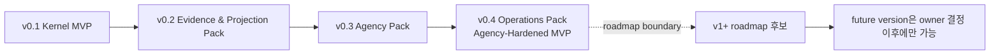
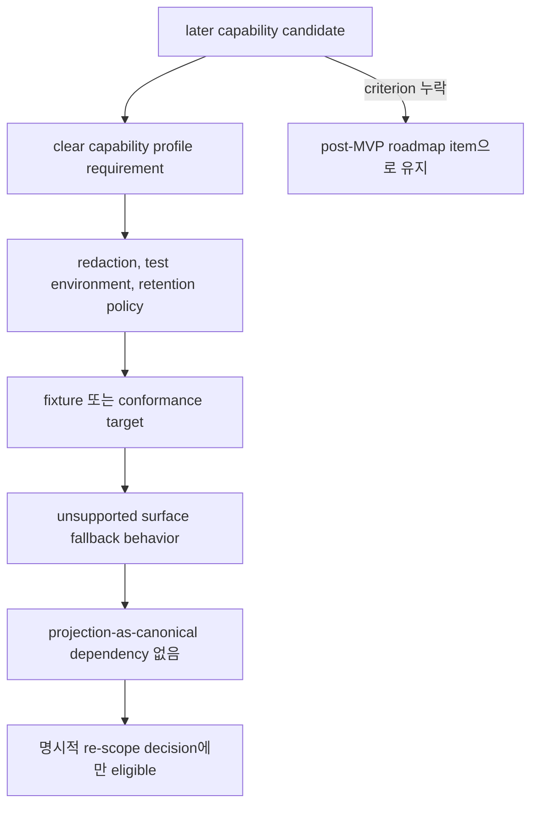
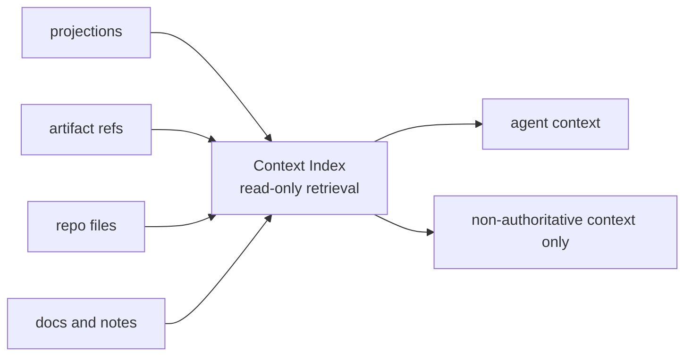
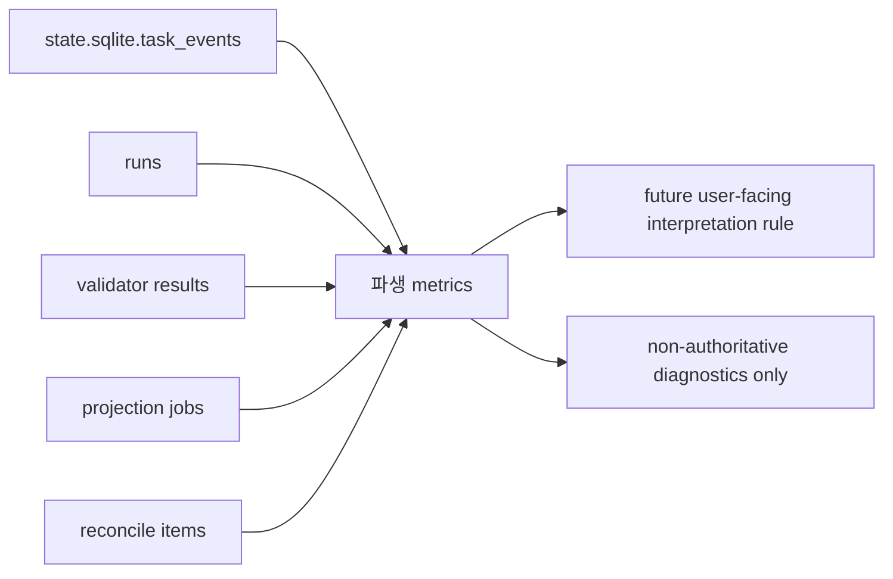

# 로드맵

## 이 문서가 도와주는 일

이 문서는 post-MVP 자동화 후보와 능력 확장 항목을 모아 둡니다. 독자가 나중에 다룰 수 있는 일을 볼 수 있게 하되, 그것을 첫 구현 작업, 현재 권한, staged delivery 필수 동작으로 오해하지 않게 하는 것이 목적입니다.

이 문서는 roadmap 문서입니다. 문서 세트가 구현 계획에 사용할 수 있다고 승인되기 전에는 runtime/server 구현, 생성된 운영 파일, 실행 가능한 fixture 파일, runtime data를 만들라는 뜻이 아닙니다. 첫 제품 MVP 목표는 v0.1 Kernel MVP이며, Kernel Smoke conformance profile이 이를 실행 가능한 방식으로 증명합니다. v0.2부터 v0.4까지는 Build 문서에서 Agency-Hardened MVP reference conformance target을 향한 staged pack이며, 아래 항목은 owner 문서가 승격하고 증명하기 전까지 v1+ Expansion에 둡니다.

## 이런 때 읽기

- 어떤 아이디어가 Build-owned staged delivery 밖에 있는지 확인할 때.
- 향후 capability가 승격되기 전에 policy, fixture, fallback 결정이 필요한지 확인할 때.
- Roadmap 항목이 owner가 명시적으로 scope를 부여하고 승격하기 전까지 권한 없는 후보로 남아야 함을 확인할 때.

## 읽기 전에

현재 구현 계획은 [구현 개요](build/implementation-overview.md), [첫 실행 가능한 조각](build/first-runnable-slice.md), [MVP 계획](build/mvp-plan.md)에서 시작합니다. 정확한 계약은 Reference 문서를 사용합니다.

## 핵심 생각

Roadmap 항목은 유용한 미래 후보이지 현재 authority path나 staged-delivery requirement가 아닙니다. Roadmap 항목은 owner decision이 capability, policy, fixture, fallback, projection authority boundary를 분명히 해 승격한 뒤에만 scoped work가 될 수 있습니다.

## 단계별 전달 범위가 아닙니다

이 문서는 Build-owned staged delivery의 일부가 아닙니다.

Kernel invariant, public MCP schema, staged-delivery 구현 요구사항, staged-delivery 필수 conformance는 이 문서가 소유하지 않습니다. Build 계층은 staged delivery를 소유합니다. 즉 v0.1 Kernel MVP를 먼저 만들고, 그 뒤 v0.2 Evidence & Projection Pack, v0.3 Agency Pack, v0.4 Operations Pack으로 진행합니다. 아래 항목들은 이 기본 요소가 안정된 뒤에 이어갈 수 있는 후속 후보입니다. 단계별 전달 순서는 [MVP 계획](build/mvp-plan.md)을 보고, 엄밀한 API, storage, projection, fixture 계약은 Reference 문서를 봅니다.

첫 제품 MVP 목표는 v0.1 Kernel MVP입니다. Agency-Hardened MVP는 이후 v0.2부터 v0.4까지의 pack을 통해 도달합니다. 이 roadmap은 Build 문서가 담당하는 증명 대상이 owner 문서에서 명확해진 뒤의 v1+ Expansion 후보만 다룹니다. v0.1 Kernel MVP, Agency-Hardened MVP, Core state/`task_events`/artifact 경로를 우회하는 대체 경로가 아닙니다. Dashboard, hosted workflow UI, Browser QA Capture, Cross-Surface Verification, Context Index, Native Hook Expansion, Advanced Sidecar Watcher, Local Derived Metrics, connector marketplace, team workflow, orchestration은 나중에 Harness 동작을 수집하거나 보여 주거나 확장할 수 있지만, 첫 실행 가능한 권한 루프를 대체하지 않습니다.

v0.1 Kernel MVP와 v0.2부터 v0.4까지의 pack은 Build-owned staged delivery이지 roadmap 범위가 아닙니다. 이 roadmap은 staged-delivery owner 문서가 요구하는 kernel 권한, Decision Packet, 남은 위험 표시, detached verification, Manual QA, recover/export, release handoff, fixture conformance 동작을 흡수하면 안 됩니다. Roadmap 항목은 owner 문서가 제한적으로 허용할 때만 읽기, 표시, 추천, artifact 후보 제공, fixture 후보 역할을 할 수 있습니다. 지속 artifact 등록이나 연결은 여전히 기존 Core/MCP artifact owner path 또는 향후 승격된 owner contract를 거쳐야 합니다. 여기에 이름이 있다는 이유만으로 권한 경로가 되지는 않습니다.

## 승격 규칙

Roadmap 후보는 향후 owner 결정이 다음을 모두 부여한 뒤에만 v1 또는 이후 범위의 작업이 될 수 있습니다.

- 명시적인 향후 버전 owner decision. 단계별 전달 계획 중 유용해 보인다는 이유만으로 승격되지 않습니다.
- 명확한 capability profile 요구사항
- redaction 및 secret/PII handling policy
- runtime 접점을 capture하는 경우 test environment와 artifact retention policy
- fixture 또는 conformance target
- 지원하지 않는 접점에 대한 fallback 동작
- projection을 기준 상태로 취급하는 의존성 없음

이 규칙은 Dashboard, hosted workflow UI, Browser QA Capture, Cross-Surface Verification, Broad Connector Ecosystem, Native Hook Expansion, Preventive Guard Expansion, Advanced Sidecar Watcher, Context Index, Local Derived Metrics, 그리고 아래의 모든 항목에 똑같이 적용됩니다. 항목별 설명은 제약을 추가할 수 있지만 이 승격 규칙을 완화하지는 않습니다.

## 로드맵 항목

### Dashboard

Dashboard 또는 hosted workflow UI는 active Task, gate, approval, 근거 coverage, projection 최신성, artifact 무결성, reconcile item을 시각화할 수 있습니다.

MVP는 dashboard 또는 hosted UI가 보여 줄 record, projection, conformance fixture를 먼저 안정화해야 하므로 이 항목은 later입니다. Owner 문서가 명시적으로 승격하기 전까지 dashboard 또는 hosted workflow UI는 `state.sqlite`, artifact ref, projection job status 위의 읽기 전용 진단/workflow 표시입니다. Dashboard 또는 hosted UI가 Task state, evidence, 결과 수락, implementation readiness, close readiness, projection 최신성, workflow routing, metric 해석의 기준이 되어서는 안 됩니다.

### Broad Connector Ecosystem

넓은 connector ecosystem 또는 marketplace는 기준 접점이 안정된 뒤 더 많은 agent surface, evaluator environment, workflow integration을 추가할 수 있습니다.

v0.1 Kernel MVP는 로컬 project 하나, 기준 접점 하나, local MCP reachability, Core 권한 경로 하나를 가정하므로 later입니다. Owner 문서가 명시적으로 승격하기 전까지 connector ecosystem 작업은 문서, prototype, fixture-candidate material일 뿐입니다. MCP 노출을 넓히거나, 권한을 만들거나, Core를 우회하거나, 기준 접점 증명을 대체하거나, 지원하지 않는 접점을 기본적으로 v0.1 실패로 만들면 안 됩니다.

### Browser QA Capture

Browser QA Capture는 v1/post-MVP 우선 후보이지 첫 구축 대상도 staged-delivery 요구사항도 아닙니다. 연결된 접점이 지원하는 경우 automatic 또는 assisted capture가 Manual QA record를 위해 screenshot, console log, network trace, accessibility snapshot, workflow recording을 수집할 수 있습니다.

승격에는 declared `T6 QA Capture` capability profile, redaction 및 secret/PII handling policy, test environment setup, artifact retention rules, fixture 또는 conformance target, 지원하지 않는 접점의 fallback 동작, projection-as-canonical 의존성 없음이 필요합니다.

Owner 문서가 명시적으로 승격하기 전까지 Browser QA Capture는 candidate, prototype, manual capture aid, artifact-candidate source로만 논의할 수 있습니다. 캡처한 browser QA 자료는 기존 Manual QA/artifact path 또는 승격된 owner contract를 통해 등록되고 연결될 때만 QA evidence를 보강할 수 있습니다. 일반적으로 `qa_capture`, `screenshot`, `log`, 또는 캡처한 파일이 console log, network trace, accessibility snapshot, workflow recording인 경우 `other`를 사용할 수 있습니다. 이는 유용하지만 non-authoritative입니다. Final acceptance가 아니며, UI/UX, copy, accessibility 해석, workflow, product taste, visual output에 human judgment가 필요한 경우 Manual QA judgment를 대체하지 않고, verification independence requirements도 충족하지 않는 한 detached verification을 대체하지 않으며, 기존 Manual QA/artifact flow를 대체하지 않습니다.

지원하지 않는 접점은 사람이 작성한 Manual QA notes와 수동 제공 artifacts를 대체 경로로 사용해야 합니다. 단계별 전달 계획은 automated browser capture를 요구하지 않고 Manual QA record와 artifact refs를 지원합니다.

### Cross-Surface Verification

Cross-surface verification은 verification bundle을 다른 agent 접점 또는 evaluator environment로 보낼 수 있습니다.

Agency-Hardened MVP는 local reference path에서 bundle과 manual evaluator instruction으로 detached verification을 증명할 수 있으므로 Cross-Surface Verification은 later입니다. Owner 문서가 명시적으로 승격하기 전까지 Cross-Surface Verification은 권한이 없습니다. Bundle을 다른 접점으로 보내는 것만으로 Eval을 기록하거나, verification을 충족하거나, assurance를 올리거나, 결과를 수락하거나, Task를 close하면 안 됩니다. 승격하려면 위 규칙을 만족하고, 결과 Eval 또는 finding이 projection을 canonical state로 의존하지 않으면서 Core를 통해 돌아오는 방식을 정의해야 합니다.

### Native Hook Expansion

Native hook은 이를 지원하는 접점에서 더 강한 pre-tool guard, command interception, file write blocking, richer artifact capture를 제공할 수 있습니다.

Hook API가 접점마다 다르므로 later입니다. v0.1은 기준 접점이 실제로 지원할 때만 concrete hook을 사용할 수 있습니다. 그 외에는 native hook이 capability-dependent enhancement입니다. Owner 문서가 명시적으로 승격하기 전까지 Native Hook Expansion은 권한이 없습니다. Hook은 `prepare_write`를 보조하거나 artifact를 capture하거나 guard 표시를 개선할 수 있지만, Core 권한 경로를 대체하거나, Approval을 부여하거나, gate를 충족하거나, 지원하지 않는 접점을 기본적으로 v0.1 실패로 만들면 안 됩니다.

### Preventive Guard Expansion

Preventive guard expansion은 해당 operation에 대해 구체적인 pre-tool blocking 경로를 증명하는 접점에서만 future work가 될 수 있습니다.

단계별 전달 계획은 cooperative 또는 detective guarantee에서 정직하게 시작할 수 있으므로 later입니다. Owner 문서가 명시적으로 승격하기 전까지 preventive guard expansion은 staged-delivery 요구사항이 아니며 label만으로 주장하면 안 됩니다. Cooperative 또는 detective guard/freeze 표시는 증명된 capability 안에서 hold, warning, detection을 할 수 있지만 pre-execution blocking이라고 설명하면 안 됩니다.

### Advanced Sidecar Watcher

Advanced sidecar watcher는 file write, command execution, generated-file drift, artifact capture opportunity, repo baseline drift를 거의 실시간으로 관찰할 수 있습니다.

MVP는 cooperative `prepare_write`, git diff check, artifact registration, detective validator로 시작할 수 있으므로 later입니다. Owner 문서가 명시적으로 승격하기 전까지 Advanced Sidecar Watcher는 권한 없는 observer입니다. 관찰 결과가 Harness 상태에 영향을 주려면 Core records, validators, artifact registration, reconcile 중 맞는 경로를 거쳐야 하며, Core 상태 모델이 동작하는 데 advanced watching이 필수여서는 안 됩니다.

### Parallel Orchestration

Parallel Change Unit orchestration은 work를 여러 active implementation lane으로 나누고, dependency DAG를 관리하고, baseline을 분리하고, 동시에 생긴 근거를 조정할 수 있습니다.

Parallel execution은 stable lock, baseline freshness, Approval scope composition, artifact partitioning, close semantics에 의존하므로 later입니다. Owner 문서가 명시적으로 승격하기 전까지 dependency DAG 지원은 metadata-only로 남고, concurrent lane scheduler는 MVP에 필요하지 않습니다.

### Context Index

Context Index는 읽기 전용 context provider입니다. Agent가 관련 projection, artifact ref, repo file, doc, user note를 찾도록 도울 수 있지만 인덱싱된 지식을 Harness 상태나 권한으로 취급하지 않습니다. 첫 구축 대상도 MVP 선행 조건도 아닙니다.

인덱싱된 memory는 kernel과 기준 기록 경계가 안정되기 전에 도입하면 local 권한을 흐릴 수 있으므로 later입니다. Compact always-on rules와 phase-based context bundle은 Context Index를 필요로 하지 않으며 connector context discipline입니다. Owner 문서가 명시적으로 승격하기 전까지 Context Index는 권한 없는 retrieval only이며 v1/later candidate로 남습니다. 향후 Context Index는 context의 순위를 매기고, 요약하고, 가져올 수 있지만 해당 권한 경로의 owner 문서가 명시적으로 바뀌지 않는 한 기존 권한 경로를 대체할 수 없습니다. 가져온 context는 작업, compact status, status 해석, source excerpt, pull ref에 도움을 줄 수는 있어도 write를 허가하거나 Write Authorization을 만들거나, Decision Packet을 해소하거나, Approval을 부여하거나, gate를 충족하거나, evidence를 만들거나, verification을 수행하거나 기록하거나, QA를 기록하거나, QA/verification 또는 gate/close 관련 요구사항을 면제하거나, 결과 수락을 기록하거나, 남은 위험을 받아들이는 판단을 기록하거나, assurance를 올리거나, projection을 대기열에 넣거나 refresh하거나 projection 최신성을 바꾸거나, 구현 준비 상태를 선언하거나, Task를 close하지 않습니다. 오래된 retrieved context는 gate나 write authority를 충족할 수 없고, 기존 경로를 통해 refresh, reconcile, inspect해야 하는 owner record를 가리킬 수만 있습니다.

승격 규칙에 더해, Context Index는 향후 결정에서 최신성 및 오래됨 규칙, privacy/redaction 동작, connector capability 기대사항, fixture 범위, 가져온 context와 기준 상태를 구분하는 표시 규칙을 부여할 때만 v1 작업이 되어야 합니다.

### Local Derived Metrics

Local Derived Metrics는 `state.sqlite.task_events`, run, validator result, projection job, reconcile item에서 diagnostic rate, count, duration, guard-trigger summary를 파생할 수 있습니다.

Metric은 권한이 아니라 파생값이므로 later입니다. Owner 문서가 명시적으로 승격하기 전까지 local metric은 읽기 전용 진단 표시입니다. 사용자가 process bottleneck, 보고 공백, 반복되는 운영 패턴을 찾는 데 도움을 줄 수 있지만 diagnostic-only입니다. Metric 표시는 상태 변경, gate 충족, 쓰기 권한, Approval 부여, 근거 생성, projection 대기열 추가 또는 새로고침, projection 최신성 변경, close readiness 또는 구현 준비 상태 변경, verification 수행 또는 기록, QA 기록, QA 또는 verification 면제, 남은 위험을 받아들이는 판단 기록, 결과 수락, assurance level 상승, Task close를 하면 안 됩니다.

후보 파생 metric:

- `direct_to_work_escalation_rate`
- `approval_turnaround_time`
- `verify_latency`
- `reopen_within_7d`
- `evaluator_blocked_due_to_missing_evidence`
- `same_session_verify_guard_triggered`
- `surface_fallback_rate`
- `mcp_connection_failure_rate`
- `projection_stale_duration`
- `reconcile_pending_count`
- `shaping_unresolved_decision_count`
- `horizontal_exception_rate`
- `tdd_red_missing_rate`
- `manual_qa_pending_duration`
- `evidence_insufficiency_rate`
- `architecture_drift_warning_count`
- `domain_language_mismatch_count`
- `interface_review_required_count`

승격 규칙에 더해, 이 metric들은 향후 결정에서 fixture 범위 또는 conformance target, 보존 동작, 필요한 경우 privacy/redaction 동작, 지원하지 않는 input의 fallback 동작, 사용자에게 보여 줄 해석 규칙을 부여할 때만 v1 작업이 되어야 합니다. 그 경우에도 metric value는 파생값으로 남으며 상태 변경은 여전히 일반 Core owner 경로를 거쳐야 합니다.

### Team Profile 내보내기와 가져오기

Team profile 내보내기/가져오기는 policy 기본값, connector 프로필, 접점 능력 가정, validator 프로필, 프로젝트 설정 템플릿을 team에 공유할 수 있습니다.

v0.1은 local kernel이므로 later입니다. Team workflow, shared workspace, permissions, profile sharing은 runtime state에 영향을 주기 전에 versioning, privacy review, secret handling, conflict behavior가 필요합니다. Owner 문서가 명시적으로 승격하기 전까지 team workflow는 staged-delivery 요구사항이 아니며 권한 또는 acceptance path가 되면 안 됩니다.

## 추가 이후 후보

다음 항목도 향후 batch가 owner 문서, fixture, fallback 동작, 필요한 경우 retention/redaction 결정, implementation ownership으로 승격하기 전까지 later이며 권한이 없습니다. 즉 아래 항목은 현재 staged-delivery 요구사항이 아닙니다.

- deployment, canary, rollback, merge, production-monitoring automation. Release Handoff는 그런 권한을 external로 남기는 v1 보고서/export profile로만 더 일찍 존재할 수 있습니다.
- artifact dashboard
- worktree-based fresh verify automation
- advanced architecture drift validator
- advanced public interface validator
- semantic domain language consistency checks
- status/approval/acceptance/Manual QA card UX expansion
- multi-agent policy and scheduling
