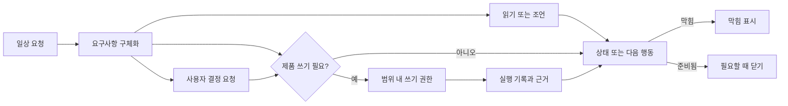

# 에이전트 세션 흐름

## 이 문서로 할 수 있는 일

이 문서는 하네스를 쓰는 에이전트 세션이 사용자에게 어떻게 보여야 하는지 설명합니다. 무엇을 보여주고, 언제 묻고, 언제 계속하고, 언제 멈춰야 하는지를 다룹니다.

커넥터 계약, 전체 능력 프로필, MCP 스키마, 접점별 cookbook은 여기서 정의하지 않습니다. 그런 내용은 [에이전트 통합 참조](../reference/agent-integration.md)와 [Surface Cookbook](../reference/surface-cookbook.md)이 담당합니다.

이 문서는 에이전트/통합 지침입니다. 일반 사용자가 반드시 읽어야 하는 문서가 아니며, 사용자용 진입점은 [사용자 가이드](user-guide.md)입니다.

## 이런 때 읽기

에이전트가 상태, 막힘, 쓰기, 확인, 닫기를 사용자에게 어떻게 보여줘야 하는지 확인할 때, 또는 에이전트 접점을 사용자용 하네스 흐름에 통합할 때 읽습니다.

## 읽기 전에

사용자 관점의 흐름을 먼저 보고 싶다면 [사용자 가이드](user-guide.md)를 먼저 읽습니다.

## 핵심 생각

사용자의 다음 판단에 영향을 주는 상태, 막힘, 대기 중인 사용자 결정, 다음 행동만 보여줍니다.

에이전트가 평소 말로 들어온 사용자 요청을 하네스 절차로 바꿉니다. 사용자가 Discovery, Change Unit, Decision Packet, Write Authorization, Evidence Manifest, 읽기용 요약(Projection), Autonomy Boundary, `task_events` 같은 용어를 말해야 작업이 진행되는 구조로 만들면 안 됩니다. 에이전트나 런타임 동작을 정확히 설명해야 할 때는 내부 용어를 쓰되, 사용자에게 보이는 상태에서는 쉬운 설명 뒤에 붙입니다.

다음 같은 요청은 그대로 완성된 사용자 입력으로 다뤄야 합니다. 하네스 용어를 다시 요구할 필요가 없습니다.

```text
이메일 로그인 흐름을 추가하고 싶어. 비밀번호 재설정은 지금 범위에서 빼고, 먼저 결정해야 할 것들을 정리해줘.
이 기능 아이디어를 검토하고, 구현 전에 필요한 질문을 해줘.
작은 문구 변경을 해줘. 다만 이게 더 큰 제품 판단으로 번지면 알려줘.
코드를 바꾸기 전에 제품 결정과 기술 결정을 나눠서 보여줘.
```

에이전트는 요청을 이해한 범위, 직접 확인할 수 있는 것, 사용자만 결정할 수 있는 것, 필요한 근거, 무엇이 닫기를 막는지를 정리해야 합니다. 정확한 하네스 라벨은 경계나 출처 참조를 분명히 할 때 뒤에 붙이면 됩니다.



유용한 상태 또는 다음 행동 응답은 쉬운 말로 네 가지 질문에 답해야 합니다.

- 범위: 무엇이 바뀔 수 있고, 무엇이 범위 밖인가?
- 사용자 결정: 사용자가 지금 무엇을 결정해야 하며, 어떤 결정 유형이 대기 중인가?
- 근거: 이미 무엇을 확인했고, 어떤 참조가 그 근거인가?
- 닫기 준비 상태: 검증, 수동 QA, 작업 수락, 잔여 위험 처리, 닫기 전에 무엇이 남았는가?

관문 상태는 범위, 사용자 결정, 근거, 닫기 준비 상태라는 네 가지 사용자에게 보이는 표시 그룹으로 보여줍니다. 쉬운 개념을 먼저 설명하고, 정확한 내부 용어나 참조는 경계, 막힘, 출처 참조, 런타임 규칙을 분명히 할 때만 덧붙입니다. 사용자 결정은 하나의 넓은 판단 묶음이 아닙니다. 각 항목을 제품/UX 판단, 기술 구조 판단, 보안/개인정보 판단, 범위/자율성 판단, 민감 동작 승인, QA 면제 판단, 검증 면제 판단, 작업 수락, 잔여 위험 수용 중 무엇인지 표시해야 합니다. 이들은 표시 그룹일 뿐입니다. `Kernel gate`를 대체하거나, 스키마 필드를 추가하거나, 재계산 규칙을 바꾸거나, 쓰기를 허가하거나, `gate`를 충족하거나, 잔여 위험을 받아들이거나, Task를 닫지 않습니다. 정확한 `gate` 값, 재계산 동작, 닫기 의미는 [커널 참조](../reference/kernel.md#gates)와 [`close_task`](../reference/kernel.md#close_task)가 담당합니다.

턴 맥락(Turn context)은 작고 최신이며 단계별 맥락으로 걸러져야 합니다. 항상 주입되는 운영 맥락은 한 화면 안팎으로 제한하고, 역할 또는 접점 자세, 현재 단계와 맥락 프로파일, 현재 상태 요약, 활성 막힘, 대기 중인 사용자 소유 결정, 다음 허용 행동만 포함합니다. 여기에 출처 참조나 최신성 표시를 붙일 수는 있지만, 전체 참조 문서, 스키마, 오래된 작업 이력, 과거 이벤트 로그, 관련 없는 템플릿, 읽기용 요약 전체 본문, 근거 본문 복사본을 넣으면 안 됩니다.

전체 문서 세트를 에이전트 프롬프트에 넣지 말고 단계적으로 맥락을 불러옵니다. 자세한 맥락 계약(context contract)은 [에이전트 통합 참조](../reference/agent-integration.md#context-pushpull-principles)가 담당하며, 이 사용자용 흐름에서는 단계별 맥락을 좁게 유지합니다.

| 맥락 프로파일 | 지금 보여줄 것 | 필요할 때만 가져올 것 |
|---|---|---|
| 세션 시작 | 현재 상태 또는 간결한 요약, 예상 작업 모양, 활성 막힘, 대기 중인 사용자 결정, 다음 허용 행동, 보장 수준/MCP 사용 가능 여부. | 요청을 분류하거나 막힘을 설명하는 데 필요한 작업 이력, 사용자 가이드, 참조 문서. |
| 요구사항 구체화 / Discovery | 목표, 사용자 가치, 범위와 비목표, 수용 기준, 확인 가능한 사실, 추적되는 불확실성, 결정 영역별 막힘 질문, 사용자 소유 결정 후보, QA/검증 기대 수준, 안전한 다음 작업 후보 또는 작업 분할 제안. | 에이전트가 확인할 수 있는 사실과 사용자 결정이 필요한 항목을 나누고 안전한 다음 작업을 좁히는 데 필요한 저장소 문서, 모듈/인터페이스/도메인 참조, 오래된 PRD/설계, 결정 안내. |
| 사용자 결정 요청 | 결정 내용, 결정 프로필, 프로필에 맞는 선택지 또는 선택된 결과, 영향을 받는 범위, 관련 참조, 답변이 확정하지 않는 것, 답변 뒤의 다음 행동. 상세 프로필은 추천, 불확실성, 영향을 받는 관문/수용 기준, 미루면 생기는 일도 보여줍니다. | 사용자가 충분히 결정하는 데 필요한 짧은 근거, 위험, 설계, 아티팩트 발췌. |
| 쓰기 준비 | Active Change Unit, Autonomy Boundary, 의도한 경로/도구/명령 요약, 민감 동작 승인 상태, 활성 결정 패킷, Write Authority Summary, 기준선/최신성. | 의도한 쓰기에 필요한 정확한 `prepare_write`, Kernel, 보안, 민감 동작 승인, 정책 참조. |
| 실행 / 근거 | 실행 요약, 변경 경로 요약, Evidence Manifest 참조, 아티팩트 참조, 근거 공백, 가림/무결성 메모, 다음 근거 행동. | 근거를 해석하거나 수리하는 데 필요한 로그, 변경 차이, 스크린샷, 추적 기록, 아티팩트/근거 계약 세부사항. |
| 닫기 준비 상태 | 닫기 준비 요약, 막힘, 근거/검증/수동 QA/작업 수락 상태, 잔여 위험 요약 또는 수용된 참조, 읽기용 요약 최신성, 가장 작은 해소 방법. | 막힘 뒤에 있는 정확한 닫기, 작업 수락, 잔여 위험 표시/수용, 수동 QA, 검증, 아티팩트 세부사항. |
| 오류 / 복구 | 주요 오류 또는 막힘, 소유자, 마지막으로 안전하게 아는 현재 상태, 오래됐거나 사용할 수 없는 출처, 영향을 받는 권한 주장, 다음 복구 행동, 쓰기나 닫기를 보류해야 하는지. | 복구에 필요한 진단 참조, 짧은 최근 이벤트/로그 발췌, 커넥터 최신성, 복구 계약 세부사항. |

에이전트 메모리, 대화 이력, 검색된 맥락, 색인된 맥락, 읽기용 요약(Projection)은 읽기 전용으로 남습니다. 무엇을 살펴볼지 제안할 수는 있지만 쓰기를 허가하거나, `gate`를 충족하거나, 근거를 만들거나, 검증을 수행하거나, 위험을 받아들이거나, Task를 닫거나, 다른 권한 주장을 만들 수 없습니다. 상태가 중요하면 행동하기 전에 현재 Core 상태 또는 상태에서 만든 간결한 맥락을 가져옵니다. 토큰을 아낀다는 이유로 사용자 소유 결정, 막힘, 범위 제한, 안전 경계, 닫기 관련 잔여 위험을 숨기면 안 되며, 사용자 결정 요청은 사용자가 충분히 결정할 만큼의 맥락을 포함해야 합니다.

## 세션 시작

하네스가 연결되어 있으면 사용자가 하네스 사용을 명시적으로 요청했을 때뿐 아니라 하네스가 추적해야 할 모양의 작업을 요청했을 때도 상태 확인이나 요청 정리로 시작합니다. 사용자가 꼭 "하네스"라고 말할 필요는 없습니다. 요청의 모양을 보고 판단하되, 첫 답변은 짧게 유지합니다.

일상적인 말로 들어온 요청도 범위, 사용자 결정, 근거, 닫기 준비 상태가 계속 보여야 하는 모양이면 추적합니다.

- 제품 파일 쓰기나 프로젝트 상태를 바꾸는 작업
- 범위가 흐트러질 위험이나 모호한 요구사항
- 여러 파일 변경, 구조 변경, 마이그레이션, 경계를 넘는 작업
- 다른 사람, 호출자, 문서, 향후 작업이 의존할 수 있는 공개 API, 공개 인터페이스, 도메인 언어, 모듈 경계, 공유 설계 변경
- 인증(auth), 보안(security), 결제(billing), 파괴적 작업이나 데이터 손실 위험, 개인정보, 규정 준수처럼 민감하거나, 접근성, 디자인 품질처럼 정책·품질 판단이 필요한 영역
- 사용자가 소유하는 제품/UX 판단 또는 비용·호환성·보안·유지보수·마이그레이션·인터페이스·의존성·위험 영향이 큰 기술 구조 판단
- 근거, 검증, 수동 QA, 작업 수락, 잔여 위험이 필요한 작업

작은 변경은 가볍게 유지합니다. 질문에 답하거나, 코드를 살펴보거나, 결과를 설명하거나, 이미 좁은 모양이 분명한 작고 위험이 낮은 변경을 처리하는 데 불필요한 절차를 덧붙이지 않습니다. 오탈자, 문서 한 문장, 분명한 이름 변경은 그 안에 사용자 소유 결정, 민감 범주, 보안 경계, 작은 변경 경로/자체 확인 메모를 넘는 근거 필요가 숨어 있지 않을 때 내부적으로는 `direct` 아래의 tiny 하위 프로필을 사용할 수 있습니다. 사용자에게 보이는 표시는 내부 프로필이 아니라 쉬운 범위, 결과, 확인을 먼저 말해야 하며, 내부 라벨은 경계를 설명할 때만 붙입니다.

보여줄 것:

- 도움이 될 때 활성 또는 예상 Task id와 쉬운 작업 모양: 읽기/조언, 작은 변경, 추적되는 작업. `advisor`, `direct`, `work`는 진단이나 고급 세부사항으로 유용할 때만 붙입니다.
- 범위: 현재 또는 제안 범위, 범위 밖, 다음 행동에 영향을 주는 활성 Change Unit 또는 쓰기 권한 경계
- 사용자 결정: 진행을 막는 사용자 소유 질문, 결정 패킷, 민감 동작 승인. 결정 유형을 표시하고 다른 대기 항목과 합치지 않습니다.
- 근거: 현재 근거 참조, 빠진 근거, 오래된 근거, 이미 실행한 확인
- 닫기 준비 상태: 다음 결정이나 닫기에 영향을 주는 검증, 수동 QA, 잔여 위험, 작업 수락, 닫기 막힘 상태
- 다음 안전한 행동
- 가장 먼저 해소할 막힘, 다음 움직임의 소유자, 가장 작은 해소 방법
- 후속 경로에 계속 영향을 줄 때만 추가 막힘
- 쓰기가 가능하거나 가까울 때 쓰기 권한 상태
- 보장 수준과 접점이 실제로 막을 수 있는 것 또는 감지만 할 수 있는 것. 이는 민감 동작 승인, 검증, 작업 수락, `gate`가 아니라 표시와 위험 맥락입니다.
- 경계를 설명할 때 필요한 경우에만 내부 `gate` 이름이나 참조. 사용자가 다음 행동을 이해하기 위해 전체 `gate` 분류를 읽게 만들지 않습니다.
- 읽기용 요약 최신성 상태
- guard, freeze, careful mode가 관련될 때 실행 전에 실제로 막을 수 있는 것과 실행 뒤에만 감지할 수 있는 것

넓은 자연어 요청만으로 바로 제품 파일을 쓰기 시작하면 안 됩니다. 먼저 범위와 의도한 변경에 맞는 쓰기 권한을 확정해야 합니다.

"go ahead", "proceed", "looks good", "좋아", "진행해" 같은 자연어 동의는 하나의 활성 질문이 결정 유형, 선택지, 범위, 영향을 받는 `gate`, 결과, 그리고 답변 밖에 남는 것을 이미 모호하지 않게 보여준 경우에만 대기 중인 결정에 연결할 수 있습니다. 한 질문에 여러 대기 항목이 있으면 그 표현은 모호하지 않은 항목 하나에만 적용됩니다. 그렇지 않으면 기록하기 전에 다시 확인합니다. 같은 발화가 민감 동작 승인, 작업 수락, 잔여 위험 수용, QA 면제 판단, 검증 면제 판단, 범위 확인 중 둘 이상을 뜻할 수 있으면 기록하기 전에 다시 확인합니다.

## 이어가기

중요한 작업을 이어가기 전에는 하네스 상태를 읽고 현재 위치를 보여줍니다. 이어가기는 오래된 대화, 오래된 상태 문구, 예전에 기억한 추천이 아니라 현재 Core 상태와 소유자 기록을 기준으로 해야 합니다. 오래된 대화 기억은 살펴볼 참조를 찾는 데 도움을 줄 수 있지만 쓰기를 허가하거나, Task를 닫거나, 작업 수락을 기록하거나, 확인을 면제하거나, 잔여 위험을 받아들이거나, 현재 상태를 대체할 수 없습니다.

좋은 이어가기 답변:

```text
활성 작업을 찾았습니다. 현재 범위는 X입니다. 다음 안전한 행동은 Y입니다. 제품 파일 쓰기는 아직 허용되지 않았습니다. 대기 중인 결정은 Z 하나입니다.
```

읽기용 요약(Projection), `source_state_version`, 읽기용 상태가 stale이거나 unknown이면 그 사실을 말하고, 거기에 의존하기 전에 refresh 또는 reconcile합니다. 기준 상태를 직접 읽을 수 있으면 그 상태에서 계속할 수 있지만, Projection은 운영 권한의 출처가 아니라고 알려야 합니다.

표시 문제는 구분해서 말합니다. 오래된 읽기용 요약(stale projection)은 읽기용 카드나 보고서가 뒤처졌을 수 있으므로 신뢰할 수 있는 맥락으로 쓰기 전에 refresh 또는 reconcile이 필요하다는 뜻입니다. 오래된 상태, baseline, 근거는 실제 입력이 이동했거나 부족해져 쓰기나 닫기를 막을 수 있다는 뜻입니다. MCP에 닿지 못하는 상태(MCP unavailable)는 에이전트가 필요한 하네스/Core 기능에 닿지 못한다는 뜻입니다. 그 기능이 다시 사용 가능해지기 전에는 기준 상태 변경, Approval, 작업 수락, 잔여 위험 수용, gate 갱신, 읽기용 요약 복구, 닫기가 처리됐다고 주장하면 안 됩니다.

Core 자체에 닿을 수 없으면 표시 문제는 `MCP_SERVER_UNAVAILABLE`입니다. Core에 닿지 않는다고 말하고, 상태가 바뀌었다고 주장하기 전에 다시 연결하거나 진단합니다. Core 또는 operator가 현재 접점에서 MCP를 사용할 수 없다고 알 수 있으면 표시 문제는 `SURFACE_MCP_UNAVAILABLE`입니다. 이 접점이 필요한 하네스 도구를 사용할 수 없다고 말한 뒤, 제품 파일 쓰기는 지시로 보류하거나 필요한 기능을 가진 접점으로 전환합니다. 접점 이름만으로는 기능이 증명되지 않습니다. Preventive guard가 해당 동작에 대해 도구 실행 전 차단을 입증한 경우에만 실행 전에 차단됐다고 말합니다.

## 상태와 막힘 읽기

MCP 결과를 기준으로 삼되, 사용자에게는 이해하기 쉬운 말로 설명합니다.

정확한 오류 분류, 전체 대응표, 우선순위는 [MCP API와 스키마](../reference/mcp-api-and-schemas.md)가 담당합니다. 여기는 세션 응답에서 자주 쓰는 짧은 표시 예시만 제공하며, 전체 목록이 아닙니다.

상태와 막힘 표시는 내부 `gate` 세부사항보다 네 가지 그룹을 먼저 보여줘야 합니다.

| 표시 그룹 | 먼저 보여줄 것 | 대표 소유자 참조 |
|---|---|---|
| 범위 | 무엇이 바뀔 수 있는지, 무엇이 범위 밖인지, 의도한 쓰기가 맞는지. | Task, Change Unit, Autonomy Boundary, 쓰기 허가 기록. |
| 사용자 결정 | 계속하기 전에 사용자가 결정해야 하는 것. 각 대기 항목을 유형별로 나눕니다. 민감 동작 승인은 그 경로가 pending일 때만 여기에 포함합니다. | 결정 패킷, Approval, Acceptance 결정 패킷, 잔여 위험. |
| 근거 | 주장을 무엇이 뒷받침하는지, 무엇이 빠졌는지, 뒷받침이 오래됐는지. | Evidence Manifest, Run, 아티팩트 참조, Eval 입력 참조. |
| 닫기 준비 상태 | 닫기를 시도하거나 작업 수락을 요청하기 전에 남은 것. | Eval, 수동 QA, Acceptance, 잔여 위험, 닫기 막힘. |

이 그룹들은 `gate` 별칭이 아니며 정확한 enum 값을 정의하지 않습니다. 정확한 `gate` 이름이 유용하면 쉬운 그룹 요약 뒤에 보여주고 소유자 기록을 연결하거나 인용합니다.

- `harness.status`는 "지금 어디에 있는가?"라는 뜻입니다.
- `harness.next`는 "다음 안전한 행동 또는 가장 작은 해소 방법은 무엇인가?"라는 뜻입니다.
- `harness.prepare_write`는 "지금 이 정확한 제품 파일 쓰기를 해도 되는가?"라는 뜻입니다.
- `harness.record_run`은 "무슨 일이 일어났고, 어떤 근거가 바뀌었으며, 다음은 무엇인가?"라는 뜻입니다.
- `harness.close_task`는 "이 Task를 지금 끝내거나 취소할 수 있는가?"라는 뜻입니다.

`harness.status`, `harness.next`, 간결한 상태 카드, 추천 줄은 읽기 전용 표시입니다. 결정 패킷, `prepare_write`, 근거 수집, 검증, 수동 QA, 조정(`reconcile`), 닫기 시도를 추천할 수는 있지만, 추천 자체가 상태를 변경하거나, 쓰기를 허가하거나, `gate`를 충족하거나, 작업 수락을 기록하거나, 잔여 위험을 받아들이거나, Task를 닫지 않습니다.

`harness.next`가 `action_kind`를 반환하면 enum보다 쉬운 행동을 먼저 보여줍니다. 정확한 enum 값은 고급 세부사항이 도움이 되거나 경계를 설명할 때만 보여줍니다.

| `action_kind` | 사용자에게 말할 내용 |
|---|---|
| `ask_user` | 사용자 소유 답변이 필요합니다. 간결한 질문, 추천, 영향, 참조를 보여줍니다. |
| `prepare_write` | 정확히 의도한 쓰기에 대한 쓰기 권한을 확인합니다. |
| `implement` | 범위 안 구현 경로를 계속합니다. 제품 파일 쓰기에는 현재 호환되는 쓰기 허가 기록만 사용합니다. |
| `launch_verify` | 현재 근거 참조에서 독립 검증 경로를 시작하거나 준비합니다. |
| `record_eval` | Evaluator 결과를 기록합니다. Eval이 조건을 충족하기 전에는 분리 검증을 주장하지 않습니다. |
| `record_manual_qa` | 수동 QA 결과 또는 유효한 면제를 기록합니다. 브라우저 아티팩트만으로 수동 QA처럼 다루지 않습니다. |
| `request_acceptance` | 근거, 검증, QA, 잔여 위험 표시를 보여준 뒤 작업 수락을 요청합니다. |
| `close_task` | 닫기 경로로 닫기를 시도하고 blocker를 보여줄 준비를 합니다. |
| `reconcile` | 오래된 표시, 관리 영역 불일치, 제안/상태 불일치를 새로 고치거나 조정합니다. |
| `idle` | 이 초점에 필요한 즉시 하네스 action이 없습니다. |

정확한 enum과 API 계약은 [`harness.next`](../reference/mcp-api-and-schemas.md#harnessnext)가 담당합니다. 이 표는 표시 안내일 뿐 새 경로나 gate가 아닙니다.

status, next, 결과, 작업 수락, 닫기 표시에서 권한을 주장할 때는 모두 출처 참조가 있거나 참조가 없음을 명시해야 합니다. "Write allowed"에는 쓰기 허가 기록 참조를, 민감 동작 허가에는 Approval 참조를, 근거 충분함에는 Evidence Manifest 참조를, 분리 검증에는 Eval 참조를, 수동 QA에는 수동 QA 기록 또는 유효한 면제 참조를, 작업 수락에는 Acceptance 결정 패킷 참조를, 잔여 위험 표시에는 잔여 위험 참조 또는 `ResidualRiskSummary.status=none`을, 잔여 위험 수용에는 수용된 잔여 위험 참조를, 로그/변경 차이/스크린샷/추적 기록/번들에는 아티팩트 참조를 사용합니다. 참조가 없으면 아직 뒷받침되지 않은 주장이라고 말합니다.

응답에 오류나 막힘이 있으면 가장 먼저 해소할 막힘 하나를 먼저 말합니다. 사용자에게 보이는 prose에서는 `막힘`을 우선하고, API나 Reference 문맥에서는 `blocker` 또는 `차단 조건(blocker)`을 사용합니다. API precedence로 선택된 첫 `ToolError`를 쓰거나, `harness.close_task`가 blockers를 반환했다면 첫 닫기 막힘을 사용합니다. 그다음 가장 작은 해소 방법을 평범한 말로 보여줍니다. 추가 막힘은 가장 먼저 해소할 막힘이 해소된 뒤에도 의미가 있을 때만 계속 보여줍니다.

모든 막힘 표시는 사용자에게 보이는 말로 소유자를 함께 말해야 합니다.

- 사용자 소유: 제품/UX 판단, 기술 구조 판단, 보안/개인정보 판단, 범위/자율성 판단, 민감 동작 승인, 수동 QA 판단, QA 면제 판단, 검증 면제 판단, 잔여 위험 수용, 작업 수락처럼 사용자가 결정해야 하는 일.
- 에이전트가 해소 가능: 상태 새로 읽기 또는 조정(`reconcile`), `prepare_write` 재시도, 빠진 근거 수집, 범위 안 확인 실행, 아티팩트 복구나 교체, 사용자 소유 결정을 바꾸지 않는 Change Unit 축소.
- 접점 또는 시스템: Core 사용 불가, 접점 MCP 사용 불가, 기능 부족처럼 재연결, 다른 접점, operator repair가 필요한 상태.

에이전트가 해소할 수 있는 막힘을 사용자에게 떠넘기면 안 됩니다. 그 행동이 범위를 바꾸거나 Approval을 요구하거나 새 사용자 소유 위험을 만들지 않는다면, 에이전트가 다음에 무엇을 할지 말합니다.

자주 쓰는 표시 예시:

| 원래 조건 | 먼저 말할 내용 | 가장 작은 해소 방법 |
|---|---|---|
| `STATE_CONFLICT` | 이 보기 이후 상태가 바뀌었습니다. | 상태를 새로 읽고 현재 state version으로 다시 시도합니다. |
| `MCP_UNAVAILABLE`(`details.mcp_unavailable_kind=server_unavailable`) 또는 진단상 `MCP_SERVER_UNAVAILABLE` | Core에 닿을 수 없습니다. | 기준 상태 변경을 주장하기 전에 Core 연결을 복구하거나 진단합니다. |
| `MCP_UNAVAILABLE` 또는 `CAPABILITY_INSUFFICIENT`(`details.mcp_unavailable_kind=surface_mcp_unavailable`) 또는 진단상 `SURFACE_MCP_UNAVAILABLE` | 이 접점은 필요한 하네스 도구를 사용할 수 없습니다. | 접점을 복구하거나 사용할 수 있는 접점으로 전환합니다. 해당 작업에 대해 프로필이 도구 실행 전 차단을 입증한 경우가 아니면 제품 파일 쓰기는 지시로 보류합니다. |
| 유용한 세부정보가 없는 `MCP_UNAVAILABLE` | 하네스/Core 기능을 사용할 수 없습니다. | 기준 상태 변경을 주장하기 전에 다시 연결하거나 접점을 복구하거나 사용할 수 있는 접점으로 전환합니다. |
| `CAPABILITY_INSUFFICIENT` | 이 접점은 필요한 보장 수준을 제공할 수 없습니다. | 필요한 profile을 쓰거나, 작업을 줄이거나, 그 기능이 필요 없는 경로를 선택합니다. |
| `NO_ACTIVE_TASK` | 선택된 active Task가 없습니다. | 계속하기 전에 Task를 선택하거나 만듭니다. |
| `WRITE_AUTHORIZATION_REQUIRED` 또는 `WRITE_AUTHORIZATION_INVALID` | 쓰기 권한이 없거나 최신이 아닙니다. | 정확한 의도한 쓰기에 대해 `harness.prepare_write`를 다시 시도합니다. |
| `DECISION_REQUIRED` 또는 `DECISION_UNRESOLVED` | 사용자 결정이 필요합니다. | 결정 패킷 또는 간결한 결정 요청을 보여줍니다. |
| `APPROVAL_REQUIRED`, `APPROVAL_DENIED`, 또는 `APPROVAL_EXPIRED` | Sensitive-action Approval이 필요하거나 사용할 수 없습니다. | Approval을 요청, 해소, 갱신한 뒤 쓰기 확인을 다시 시도합니다. |
| `PROJECTION_STALE` | 읽기용 상태 요약이 오래됐습니다. | 그 요약에 의존하기 전에 읽기용 요약(projection)을 refresh 또는 reconcile합니다. |
| `ARTIFACT_MISSING` | Artifact가 없거나 무결성 확인에 실패했습니다. | Artifact를 근거로 쓰기 전에 다시 첨부하거나, 생성하거나, 교체합니다. |

정확한 하네스 용어는 도움이 될 때만 괄호 안에 붙이고, 평범한 문장을 먼저 둡니다. 예: "쓰기 권한이 최신이 아닙니다(`WRITE_AUTHORIZATION_INVALID`). 가장 작은 해소 방법: 현재 파일 목록으로 `harness.prepare_write`를 다시 실행합니다."

## 요청 정리

요청 정리는 사용자가 하네스 용어로 말하지 않아도 평범한 요청을 실제로 진행 가능한 작업 모양으로 바꾸는 단계입니다. 예를 들어 사용자가 "이메일 로그인을 추가하고 reset은 범위 밖으로 둬"라고 말하면, 에이전트가 쉬운 작업 모양, 범위, 가능한 판단, 근거 필요성, 쓰기 확인, 닫기 준비 상태 처리로 번역해야 합니다.

요구사항 구체화는 구현 계획과 쓰기 권한 전에 에이전트가 수행하는 조건부 행동입니다. `Discovery`는 이 행동의 안정적인 내부 이름이지, 사용자가 외워야 하는 명령어가 아닙니다. 사용자는 "구현 전에 계획을 먼저 구체화해줘" 또는 "코드를 바꾸기 전에 필요한 걸 물어봐"처럼 평범하게 말해도 됩니다. 요청이 모호하거나, 기능 성격이 있거나, 인증/보안에 민감하거나, UX/문구/작업 흐름 판단이 크거나, 공개 인터페이스 또는 모듈 경계에 닿거나, policy에 영향을 줄 수 있거나, 추적되는 작업이 될 가능성이 높아서 구체화가 필요할 때 사용합니다. 명확한 작은 변경에 의식처럼 추가하지 않습니다. 이것은 일반 승인, 민감 동작 승인, 쓰기 허가 기록, 근거, 검증, 수동 QA, 작업 수락, 잔여 위험 수용, 닫기, 범위 권한, 새 권한 경로가 아닙니다.

세션 시작에서 보는 것과 같은 작업 모양 신호를 살핍니다. 제품 파일 쓰기, 범위가 흐트러질 위험, 모호한 요구사항, 여러 파일이나 구조 변경, 민감하거나 정책·품질 판단이 필요한 영역, 사용자가 판단해야 하는 결정, 근거, 검증, 수동 QA, 작업 수락, 잔여 위험이 필요한 작업이 여기에 해당합니다. 이런 신호가 있으면 평범한 요청을 예상 작업 모양, 범위, 범위 밖, 다음 안전한 행동으로 바꿔 제안합니다.

요청 정리 경로는 다음과 같습니다.

```text
요청 -> 작업 모양 분류 -> 필요하면 요구사항 구체화 -> Discovery Brief 또는 동등한 보조 정보 작성 -> 사용자 소유 결정 경로 지정 -> 안전한 다음 작업 또는 작업 분할 제안 -> 제품 쓰기가 의도되면 prepare_write 경로
```

요구사항 구체화 출력은 Discovery에서 나온 보조 정보를 포함해, 소유자 참조가 이미 바탕 사실을 기록하는 경우가 아니라면 보조 정보 또는 읽기용 요약(Projection) 개념으로 다루고, 기존 소유자 경로로 보냅니다.

- Discovery Brief: 목표, 사용자 가치, 범위, 비목표, 수용 기준, 저장소/문서/하네스 상태에서 에이전트가 확인할 수 있는 사실, 사용자만 결정할 수 있는 판단, 제품/UX 판단 후보, 기술 구조 판단 후보, 보안/개인정보 판단 후보, QA와 검증 기대 수준, 열린 가정, 남은 불확실성, 안전한 다음 작업 후보 또는 작업 분할 제안을 담은 간결한 요약.
- Question Queue: 열린 질문을 blocking, useful-but-not-blocking, codebase-answerable로 분류한 순서 있는 목록.
- Assumption Register: agent가 사용하는 가정, source, confidence, owner, 가정이 틀릴 때 바뀌는 일을 기록한 목록.
- First Safe Change Unit Candidate: 제품 쓰기가 가까워졌을 때 안전한 다음 작업 후보를 내부 Change Unit 모양으로 표현한 것입니다. 고급 근거 개념이며, Discovery의 유일한 출력이나 주된 중지 조건이 아닙니다.

`안전한 다음 작업 후보`와 `작업 분할 제안` 같은 쉬운 표현은 제안이나 근거를 설명하는 말이며, 독립 schema 필드, 기준 record type, `gate` 값, 읽기용 요약 종류, 권한 경로가 아닙니다.

요구사항 구체화 결과는 Shared Design, 결정 패킷 후보, Change Unit 모양 잡기로 보냅니다. Discovery Brief, Question Queue, Assumption Register, First Safe Change Unit Candidate를 범위 권한, 민감 동작 승인, 작업 수락, 잔여 위험 수용, 근거, 닫기 준비 상태, 쓰기 허가 기록으로 취급하지 않습니다.

요구사항 구체화 밖에서는 다음 안전한 행동을 바꾸는 질문만 합니다. 구체화 중에는 목표, 사용자 가치, 범위, 비목표, 수용 기준, 제품/UX 동작, 기술 구조, 보안/개인정보 자세, QA 또는 검증 기대 수준, 안전한 다음 작업 후보, 작업 분할, 사용자 소유 결정, 숨은 가정을 구체화하는 목적이 분명한 질문을 묻습니다. 긴 질문지를 한꺼번에 던지지 말고 결정 영역별로 묶어 묻고, 불확실성을 명시합니다. Useful-but-not-blocking 질문은 사용자를 계속 방해하지 말고 따로 남겨 둡니다. 긴 양식보다 추천이 딸린 가장 막힘이 큰 결정 영역 하나가 낫습니다.

질문하기 전에는 에이전트가 안전하게 직접 확인할 수 있는 답을 사용 가능한 최신 저장소, 코드베이스, 문서, 하네스 상태에서 먼저 찾아봅니다. 이미 보이는 파일 경로, 기존 동작, 용어, 제약을 사용자에게 다시 설명해 달라고 요구하지 않습니다. 소스가 없거나 오래됐으면 그것을 현재 사실의 근거로 삼지 말고, 불확실성으로 표시합니다.

한 번에 하나의 막힘 질문을 묻는다는 말이 구체화도 한 번이면 끝난다는 뜻은 아닙니다. 요청이 넓거나 설계 판단이 크면 목표, 사용자 가치, 범위, 비목표, 수용 기준, 영향받는 제품 영역, 사용자 화면이나 흐름, 모듈, 인터페이스, 민감 카테고리(sensitive categories), 사용자가 소유하는 제품 또는 중요한 기술 장단점 판단, 보안/개인정보 선택, 검증 또는 수동 QA 기대 수준, 알려진 제품·구현·검증·QA·후속 위험이 안전한 다음 작업을 제안할 수 있을 만큼 잡힐 때까지 짧은 확인을 여러 차례 이어갈 수 있습니다. 구체화 과정에서는 필요한 경우 목적이 분명한 질문을 여러 번 물을 수 있습니다. 에이전트가 직접 확인할 수 있는 것과 사용자가 결정해야 하는 것을 나누고, 목표, 비목표, 수용 기준, 중요한 판단 후보가 충분히 분명해졌으며, 안전한 다음 작업 후보, 더 작은 범위, 또는 작업 분할을 제안할 수 있고, 남은 불확실성이 명시적으로 추적되면 잠시 멈추거나 진행할 수 있습니다.

질문하기 전에 각 열린 질문을 분류합니다. Blocking 질문은 다음 안전한 행동 전에 사용자 결정이 필요한 질문입니다. Useful-but-not-blocking 질문은 Discovery Brief, Assumption Register, follow-up work, 이후 결정 패킷 후보에 남겨둘 수 있습니다. Codebase-answerable 질문은 사용자에게 묻지 말고 현재 저장소, 문서, 하네스 상태, 출처 참조를 살펴 답해야 합니다.

각 사용자 소유 질문은 사용자가 정확히 결정하는 것을 이름 붙이고, 가능한 선택지, 에이전트의 추천안, 불확실성, 의미 있을 때 영향을 받는 `gate` 또는 수용 기준, 사용 가능하거나 관련 있을 때 출처/근거/위험/설계 참조, 결정을 미뤄도 계속할 수 있는 일 또는 결정 전에는 진행하면 안 되는 이유를 함께 보여줘야 합니다. 에이전트가 둔 가정은 사용자에게 속한 제품, 기술, 보안, QA, 운영, 범위, 민감 동작 승인, 작업 수락, 잔여 위험 수용과 따로 기록합니다.

제품 계획 요청 정리 예시:

```text
사용자: 새 워크스페이스 소유자가 처음 들어왔을 때 흐름을 더 좋게 만들고 싶어. 먼저 지금 있는 화면과 문서를 살피고, 제품 선택과 확인 가능한 사실을 나눈 뒤, 저장소에서 답할 수 없는 질문만 해줘.

에이전트: 먼저 현재 온보딩 경로, 빈 상태 화면, 설정 안내, analytics나 문서가 있으면 그 내용, QA 패턴을 살피겠습니다. 사용자 소유 제품 선택 후보는 온보딩을 인라인 체크리스트, 설정 안내, 조용한 빈 상태 중 어디에 둘지, 성공 기준을 무엇으로 볼지, 어떤 수동 QA가 필요한지입니다. 다음 안전한 행동은 이 자료들을 확인한 뒤, 작은 문구/흐름 조각 또는 제품 방향과 구현을 나누는 작업 분할을 제안하는 것입니다.
```

기술 계획 요청 정리 예시:

```text
사용자: 로그인 방식을 바꾸고 싶은데 세션, 매직 링크, OAuth/OIDC 중 무엇이 맞는지 모르겠어. 먼저 현재 인증 구조를 살피고 구현 전에 결정할 것들을 보여줘.

에이전트: 아키텍처를 추천하기 전에 현재 사용자/세션 모델, 인증 경로, 테스트, 의존성 상태, 보안 메모를 살피겠습니다. 사용자 소유 결정 후보는 인증 방식, 세션 유지 시간, 계정 존재 여부 노출 자세, ID 제공자 의존성, 검증 기대 수준, 로그인 흐름 수동 QA입니다. 다음 안전한 행동은 읽기 전용 조사와 범위가 잡힌 아키텍처 제안이며, 구현은 아닙니다.
```

고급/내부 사용자 결정 요청 예시:

```text
판단 영역: Product / UX (`product_ux`)
결정 영역: 로그인 실패 동작.
선택지: 폼 근처 인라인 메시지, 토스트, 모달.
추천: 기존 폼 패턴을 확인한다는 전제에서 폼 근처 인라인 메시지.
불확실성: 기존 접근성 패턴 때문에 다른 선택이 더 저렴할 수 있습니다.
먼저 확인할 수 있는 것: 현재 로그인 UI와 검증 컴포넌트.
```

```text
판단 영역: 기술 구조 판단 (`technical_architecture`)
결정 영역: 인증 구조.
선택지: 세션 쿠키, Bearer/JWT, OAuth/OIDC, 소셜 로그인 제공자 연동.
추천: 선택 전에 현재 user/session model을 먼저 확인합니다.
불확실성: storage와 session 지원 상태에 따라 어떤 선택이 훨씬 더 안전할 수 있습니다.
미뤄도 계속할 수 있는 일: 읽기 전용 조사와 범위가 제한된 제안. 구현은 아닙니다.
```

좋은 요청 정리:

```text
이 변경이 설정 화면 문구 안에 머물면 작은 변경으로 처리할 수 있습니다. 계정 동작까지 바꾸면 추적되는 작업으로 전환해야 합니다. 추천은 설정 문구만 먼저 바꾸는 것입니다. 의도한 범위가 맞나요?
```

## 작업 모양 분류하기

쉬운 작업 모양을 먼저 말합니다. `advisor`, `direct`, `work`는 kernel 계약이 소유하는 내부 라우팅 라벨로 유지하고, 사용자가 외워야 하는 이름으로 만들지 않습니다.

| 쉬운 작업 모양 | 내부 mode | 쓸 때 | 상향할 때 |
|---|---|---|---|
| 읽기/조언 | `advisor` | 제품 파일을 바꾸지 않는 읽기, 설명, 비교, 검토, 판단 지원. | 제품 파일이 바뀔 수 있거나, 민감한 행동이 필요하거나, 사용자가 조언을 구현으로 바꾸라고 요청할 때. |
| 작은 변경 | `direct` | 좁은 범위와 가벼운 근거로 처리할 수 있는 작고 위험이 낮은 코드 또는 문서 변경. 오탈자, 문서 한 문장, 분명한 이름 변경은 하위 프로필이지 새 mode가 아닙니다. | 범위가 불분명하거나, 여러 파일 또는 하위 시스템이 관련되거나, 제품/UX 판단이 필요하거나, 중요한 아키텍처 판단이 필요하거나, 공개 인터페이스/API 영향이 나타나거나, 보안/개인정보 영향이 있거나, 민감한 행동이 나타나거나, QA/검증 요구가 커지거나, 근거가 부족하거나, 잔여 위험이 작지 않거나, 여러 단계 전달이 필요할 때. |
| 추적되는 작업 | `work` | 기능 작업, UX 흐름, 인증에 닿는 동작, 스키마, 공개 API/인터페이스, 구조 변경, 위험한 수정, 여러 파일이나 여러 단계의 전달, 의미 있는 근거와 독립 검증이 필요한 작업. | 계속 추적되는 작업으로 두고, 인증, 보안, 개인정보, 비밀값, 인프라 또는 비슷한 민감 영역이 나타나면 민감 동작 승인, 결정 패킷, 근거, 검증, 수동 QA, 잔여 위험을 소유자 경로로 라우팅합니다. |

정확한 mode/profile 계약은 [커널 참조](../reference/kernel.md#작업-모드)가 담당합니다. 이 쉬운 작업 모양은 표시 지침이며 schema 값을 추가하거나 권한 규칙을 바꾸지 않습니다.

작은 변경이 커지면 같은 Task를 추적되는 작업으로 전환하고 이유를 쉬운 말로 보여줍니다.

## 작은 변경 절차 예산

작은 변경은 가벼운 사용자 경험이지 더 낮은 권한 경로가 아닙니다. 사용자에게 보이는 내용을 가장 작은 유용한 묶음으로 유지합니다.

- 좁은 범위를 쉬운 말로 말합니다.
- 관련 있을 때 범위 밖 동작, 파일, 결정을 이름 붙입니다.
- 제품 파일을 쓰기 전에 내부 최소 Change Unit을 만들거나 선택하되, 사용자에게는 판단과 신뢰에 도움이 될 때만 "좁은 범위"나 "쓰기 권한"으로 보여줍니다.
- 제품 파일 쓰기에 적용되는 경우 정확한 write attempt 전에 compatible `prepare_write`를 사용합니다.
- 변경 경로, 자체 확인 또는 다른 가벼운 근거, 상향 여부, 닫기에 영향을 주는 위험을 보고합니다.

아주 작은 변경에서는 사용자에게 보이는 예산을 더 줄일 수 있습니다. 아주 좁은 범위, 변경 경로 또는 파일 변경 없음 결과, 자체 확인 정도면 됩니다. 이 작은 표시가 권한 우회는 아닙니다. 내부적으로는 `direct` 아래의 tiny 하위 프로필도 활성 범위, 제품 파일 쓰기에 적용되는 compatible `prepare_write`, 사용자 소유 결정, 민감 동작 승인, 보안/개인정보 경계, 잔여 위험 표시, 닫기 규칙을 지켜야 합니다.

Task 모양, policy, 변경된 표면, 감지된 위험, 사용자 요청 때문에 필요해진 경우가 아니라면 결정 패킷을 만들거나, 수동 QA를 요구하거나, 분리 검증을 요청하거나, 전체 닫기 점검 목록을 보여주지 않습니다.

대상이 더 이상 분명하지 않거나, 범위가 불분명하거나, 변경 경로가 활성 Change Unit을 넘거나, 여러 파일·제품 영역·subsystem에 영향을 주거나, public API 또는 모듈 계약을 바꿀 수 있거나, 제품/UX 판단이 필요하거나, 중요한 기술 구조 판단이 필요하거나, 보안/개인정보 영향이 있거나, 민감한 행동이 나타나거나, QA/검증 요구가 커지거나, 근거가 부족하거나, 잔여 위험이 작지 않거나, multi-step delivery가 필요하면 같은 Task를 추적되는 작업으로 전환합니다.

## 범위와 Change Unit

제품 파일을 쓰기 전에 활성 범위를 Change Unit으로 구체화합니다. 사용자에게는 다음이 보여야 합니다.

- 포함되는 동작이나 파일
- 범위 밖 동작이나 파일
- 완료 조건
- 알려진 민감 영역
- 에이전트가 멈추고 물어야 하는 조건

안전한 다음 작업을 제안할 만큼 충분히 안다는 것은 위 항목들을 해소되지 않은 사용자 결정을 숨기지 않고 말할 수 있고, 확인 가능한 사실과 사용자 소유 결정을 분리할 수 있으며, 목표, 비목표, 수용 기준, 중요한 결정 후보가 충분히 분명하고, 남은 불확실성이 명시적으로 추적된다는 뜻입니다. 아직 그러지 못하면 요구사항 구체화를 이어가며 다음 결정 영역의 막힘 질문을 하거나, 유용하지만 막지는 않는 질문은 남겨 두거나, 코드베이스에서 답할 수 있는 질문은 현재 소스에서 답하거나, 해소되지 않은 영역을 피하는 더 작은 안전한 다음 작업 후보 또는 작업 분할을 제안합니다. First Safe Change Unit Candidate는 제품 쓰기가 가까워졌을 때 그 제안을 내부적으로 표현하는 방식일 수 있지만, Discovery의 유일하거나 주된 중지 조건은 아닙니다.

Autonomy Boundary는 쓰기 권한이 아닙니다. 사용자가 다시 판단하지 않아도 에이전트가 어디까지 판단할 수 있는지만 설명합니다. Change Unit의 범위는 어디에서 무엇이 바뀔 수 있는지 답하고, Autonomy Boundary는 그 범위 안에서 에이전트가 어떤 선택을 혼자 할 수 있는지 답합니다. 실제 제품 쓰기에는 여전히 의도한 변경과 맞는 쓰기 확인이 필요합니다.

멈춤과 허가를 설명할 때는 다음처럼 구분합니다.

| 개념 | 쉬운 질문 | 허용하는 것 | 허용하지 않는 것 |
|---|---|---|---|
| Change Unit 범위 | 어떤 작업 영역이 범위 안인가? | 작업이 둘러싼 동작, 파일, 경로, 도구, 명령, 네트워크 대상, 민감 범주를 이름 붙입니다. | 사용자 소유의 제품/UX 판단이나 기술 구조 판단을 결정하거나 그 자체로 쓰기 허가 기록을 만들지 않습니다. |
| Autonomy Boundary | 그 범위 안에서 에이전트가 무엇을 혼자 판단해도 되는가? | 포괄된 구현 세부사항은 추가 사용자 결정 없이 에이전트가 선택할 수 있게 합니다. | 경로, 도구, 명령, 네트워크, 비밀값, 민감 범주, 민감 동작 승인, 쓰기 권한을 부여하지 않습니다. |
| Approval / 민감 동작 승인 | 이 민감한 단계를 진행해도 되는가? | 기록된 범위와 만료 조건 안에서 이름 붙인 민감 동작을 허용합니다. | 사용자 소유 제품/UX 판단, 기술 구조 판단, 보안/개인정보 판단, 범위/자율성 판단, 면제 판단, 작업 수락, 잔여 위험 수용, 정확성(correctness), 쓰기 허가 기록을 대신하지 않습니다. |
| 결정 패킷 | 어떤 사용자 소유 결정을 기록하는가? | 이름 붙은 제품/UX 판단, 기술 구조 판단, 보안/개인정보 판단, 범위/자율성 판단, QA 면제 판단, 검증 면제 판단, 작업 수락, 잔여 위험 수용, 조정 선택을 resolved, deferred, rejected, blocked 상태로 기록합니다. 간단한 판단 기록부터 상세 절충까지 프로필에 따라 깊이가 달라질 수 있습니다. | Approval record에 연결된 Approval 형태 packet이 아닌 한 민감 동작 승인을 부여하지 않습니다. |
| 작업 수락 | 작업 수락이 required일 때 결과를 받아들일 수 있는가? | 닫기에 영향을 주는 잔여 위험이 보였거나 없다고 확인된 뒤 사용자의 최종 결과 판단을 기록합니다. | Evidence, 검증, 수동 QA, 민감 동작 승인, 쓰기 허가 기록, 면제 판단, 잔여 위험 수용을 대체하지 않습니다. |
| 잔여 위험 수용 | 이번 close에서 알려진 잔여 위험을 받아들일 수 있는가? | 보이는 닫기 관련 위험의 수용을 기록하며 다른 gate가 허용할 때 잔여 위험을 받아들이고 닫는 흐름을 뒷받침합니다. | 분리 검증, correctness proof, QA pass를 만들지 않고, close를 위험 없는 일반 close로 만들지 않습니다. |
| 쓰기 허가 기록 | 지금 이 정확한 쓰기 시도(write attempt)를 해도 되는가? | 필요한 확인 뒤 Core가 호환되는 쓰기 시도 하나를 허용했다는 기록입니다. | 재사용할 수 없고 범위, Autonomy Boundary, Approval을 넓히지 않습니다. |

작은 변경에서는 내부 active Change Unit을 사용자의 요청과 주변 맥락에서 만들 수 있습니다. 모든 작은 수정마다 사용자가 "Change Unit"이라는 말을 볼 필요는 없습니다. 범위, 쓰기 권한, 막힘을 설명할 때 도움이 될 때만 보여줍니다. 예시는 설명용이며 schema를 새로 정의하지 않습니다.

- 문서 또는 문구 수정: 목적 "이 문구 변경"; 비목표 "동작 또는 계약 변경 없음"; 범위 경로 "이름 붙은 문서/component와 직접 관련된 test가 있으면 그 test"; 중지 조건 "의미, 현지화 전략, 공개 약속이 바뀜."
- 좁은 test 수정: 목적 "보고된 case를 cover"; 비목표 "구현 리팩터링 없음"; 범위 경로 "관련 test"; 중지 조건 "수정에 제품 코드가 필요함."

프롬프트나 상태에서 "approved" 또는 "승인"이라는 말을 쓸 때는 실제 권한이나 기록되는 판단을 이름 붙입니다. 민감 동작 승인, 범위 확인(scope confirmation), 결정 패킷 해소, 범위가 지정된 면제 판단, 잔여 위험 수용, 작업 수락, 쓰기 허가 기록 상태를 구분해서 말하고, "승인"을 모든 허가와 판단을 뭉뚱그리는 포괄 라벨로 쓰면 안 됩니다.

예시:

- 의존성 설치 민감 동작 승인: 설치를 실행하거나 의존성 파일을 갱신해도 된다는 Approval은 그 의존성이 올바른 아키텍처 선택이라는 결정이 아닙니다. 그 선택이 호환성, 되돌리기, 비용, 유지보수에 영향을 주면 결정 패킷을 사용합니다.
- 비밀값 접근 민감 동작 승인: 요청된 범위 안에서 비밀값을 읽거나 사용해도 된다는 Approval은 비밀값을 아티팩트, 읽기용 요약(projections), 내보내기, 로그, 스크린샷, 요약에 노출해도 된다는 뜻이 아닙니다.
- 인증/시스템 변경 민감 동작 승인: 인증 파일, 권한, 시스템 설정을 만져도 된다는 Approval은 로컬 세션 쿠키, Bearer token/JWT, OAuth/OIDC 로그인, 소셜 로그인 제공자 연동 같은 ID 제공자 또는 세션/저장 모델을 선택하는 결정이 아니며, 역할 모델, 잠금 동작, 사용자 고지도 결정하지 않습니다.
- 공개 API 변경 결정: API 방향이 해소됐다는 것은 이 Task의 계약 선택을 결정했다는 뜻입니다. Deployment 권한, merge 권한, 재사용 가능한 쓰기 허가 기록이 아닙니다.
- 작업 수락: 작업 수락은 추가 쓰기를 허가하거나, 새 민감 동작에 Approval을 부여하거나, 알려진 잔여 위험을 수용하거나, 빠진 근거, QA, 검증, 면제 판단, 쓰기 허가 기록을 나중에 충족시켜 주지 않습니다.

Shared Design은 요구사항 구체화에서 나온 목표, 사용자 가치, 범위, 비목표, 가정, 남은 불확실성, 도메인/모듈/인터페이스 영향, 분리된 사용자 소유 결정, QA/검증 기대 수준, 안전한 다음 작업 모양에 대한 공유된 이해를 기록할 때 사용합니다. Shared Design을 민감 동작 승인, 작업 수락, 잔여 위험 수용, 면제 판단, 근거, 닫기 준비 상태, 쓰기 허가 기록으로 보여주면 안 됩니다. Shared Design에서 사용자가 소유하는 공개 API/인터페이스 선택, 도메인 언어 충돌, 모듈 경계 이동, 아키텍처 방향, 보안/개인정보 절충, QA/검증 면제 판단, 범위 확장, 알려진 위험 수용이 드러나면 그 선택은 결정 패킷으로 라우팅합니다.

Autonomy Boundary 안에서는 에이전트가 기존 helper를 재사용할지, private function을 어떻게 나눌지, 좁은 테스트를 어디에 둘지, 합의된 결과에 맞는 보수적인 내부 접근을 고를지 같은 일상적인 구현 세부사항을 판단할 수 있습니다. 공개 API 또는 모듈 계약 변경, 보안 또는 개인정보 절충, UX 또는 제품 절충, 의존성이나 마이그레이션 같은 기술 구조 방향 선택, 범위 확장, 잔여 위험 수용 전에는 해당 사용자 결정을 위해 멈춰야 합니다.

## 사용자 소유 결정으로 막힐 때

사용자가 소유하는 제품/UX 판단, 기술 구조 판단, 보안/개인정보 판단, 범위/자율성 판단, QA 면제 판단, 검증 면제 판단, 작업 수락, 잔여 위험 수용이 진행을 막고 있으면 결정 패킷을 보여주거나 요청합니다. 이름 붙은 민감 동작이 막고 있으면 민감 동작 승인 경로를 사용합니다. 이를 넓은 승인 질문이나 막연한 "계속할까요?"로 바꾸면 안 됩니다.

"approved", "승인", "go ahead", "proceed", "looks good", "좋아", "진행해" 같은 말은 실제 선택이 제품 장단점, 기술 구조 방향, 보안/개인정보 절충, 범위/자율성 변경, QA 면제 판단, 검증 면제 판단, 작업 수락, 잔여 위험 수용이라면 충분하지 않습니다. 질문은 결정 유형, 프로필, 경로, 사용자가 결정하는 것, 결정하지 않는 것, 관련 범위와 참조, 에이전트가 사용자 없이 결정해도 되는 일, 닫기나 쓰기 영향을 이름 붙여야 합니다.

사용자가 보는 결정 패킷에는 다음이 있어야 합니다.

- 결정 제목
- 결정 유형: 제품/UX 판단, 기술 구조 판단, 보안/개인정보 판단, 범위/자율성 판단, 민감 동작 승인, QA 면제 판단, 검증 면제 판단, 작업 수락, 잔여 위험 수용
- 결정 프로필(decision profile): 간단한 판단 기록, 상세 Product/UX 절충, 상세 아키텍처 절충, 민감 동작 승인, 면제, 작업 수락, 잔여 위험 수용, 조정, 복합
- judgment_domain: `product_ux`, `technical_architecture`, `security_privacy`, `qa_acceptance`, `residual_risk`, `scope_autonomy`, `mixed`
- 사용자에게 보이는 판단 영역 표시 이름: 제품/UX 판단, 기술 구조 판단, 보안/개인정보 판단, QA/작업 수락, 잔여 위험, 범위/자율성 판단, 복합
- decision_kind
- 왜 지금 이 결정이 필요한지
- 사용자가 정확히 결정하는 것
- 선택지 또는 선택된 결과
- 선택한 프로필에 필요할 때 장단점, 추천안, 불확실성, 미룰 때의 결과
- 해당하는 경우 잔여 위험
- 영향을 받는 `gate`와 수용 기준
- 사용 가능하거나 관련 있을 때 출처/근거/위험/설계 참조
- 에이전트가 사용자 없이 결정해도 되는 일
- 해당하는 경우 후속 작업

사용자 소유 결정이 둘 이상 대기 중이면 한 질문 안에서도 별도 줄이나 별도 질문으로 나눠 보여줍니다. "설치 승인", "결과 수락", "이름 붙은 위험 수용"을 하나의 승인 요청으로 합치면 안 됩니다. 간단한 막힘 해소에는 간결한 프로필을 쓰고, 선택이 복잡하거나 위험하거나 닫기에 영향을 주면 상세 프로필을 사용합니다.

결정 프로필(`decision_profile`)은 스키마가 소유하는 질문 깊이와 검증 분류입니다. 작은 명시적 막힘 해소에는 `minimal_decision`, 상세 절충에는 `product_ux_tradeoff` 또는 `architecture_tradeoff`, 민감 동작 승인에는 `approval_shaped`, QA 또는 검증 면제에는 `waiver`, 최종 결과 수락에는 `acceptance`, 이름 붙은 닫기 관련 위험 수용에는 `residual_risk_acceptance`, 관리 중인 상태 변화나 제안/상태 불일치에는 `reconcile`, 실제로 여러 영역에 걸친 하나의 결정에는 `mixed`를 사용합니다. 판단 영역은 사용자가 어떤 종류의 판단을 하는지 이해하도록 돕는, 스키마가 소유하는 분류입니다. 이를 주 표시 묶음으로 사용합니다. 결정이 여러 영역에 걸쳐 있으면 `mixed`를 쓰거나, 영역이 배타적인 것처럼 다루지 말고 부차적인 고려사항을 장단점, 영향을 받는 `gate`, 위험, 근거, 후속 작업에 보여줘야 합니다. `decision_kind`는 수명주기, payload 분기, `gate` 의미, 상태 전이 의미를 제어하고, `decision_profile`은 질문 깊이와 프로필별 필수 정보를 제어하며, `judgment_domain`은 설명과 표시 묶음을 제어합니다. 영향을 받는 `gate`나 막힌 행동은 별도 필드와 소유자 기록이 담당합니다. `decision_profile`과 `judgment_domain`은 `gate`, 검증기 입력, 닫기 집계 규칙, 권한 경로가 아닙니다. 정확한 공개 필드는 [`harness.request_user_decision`](../reference/mcp-api-and-schemas.md#harnessrequest_user_decision)이 소유하고, 기준 권한은 [결정 패킷](../reference/kernel.md#decision-packet)과 [Decision Gate](../reference/kernel.md#decision-gate)가 소유합니다. 사용자에게 보이는 질문에 스키마 본문을 복사하지 말고, 쉬운 말로 결정을 보여준 뒤 필요한 참조를 더 살펴볼 수 있게 둡니다.

결정 중심 질문은 경로와 맞는 동사를 씁니다. 선택, defer, reject, waive, accept, reconcile입니다. "approve" 또는 "승인"은 민감 동작 승인일 때만 사용합니다. 좋은 질문 형태는 다음과 같습니다.

```text
결정: 설정 버튼 문구
프로필: 간단한 판단 기록 (`minimal_decision`)
판단 영역: 제품/UX 판단 (`product_ux`)
이 설정 문구 변경에는 "Save"와 "Update" 중 어떤 버튼 문구를 기록할까요? 이 답은 CU-04의 버튼 문구만 확정하며, 더 넓은 설정 동작, 현지화 전략, 작업 수락, 잔여 위험 수용, 쓰기 권한은 확정하지 않습니다.
```

```text
결정: 로그인 실패 피드백 패턴
프로필: 상세 제품/UX 장단점 (`product_ux_tradeoff`)
판단 영역: 제품/UX 판단 (`product_ux`)
이 작업 범위에는 어떤 로그인 실패 경험을 기록할까요: 인라인 메시지, 토스트, 모달? 추천은 흐름과 접근성을 유지하는 인라인 메시지입니다. 결정을 미루면 백엔드 인증 연결은 계속할 수 있지만 최종 로그인 실패 경험이 완료됐다고 말할 수는 없습니다.
```

```text
결정: 모바일 Safari QA 면제 판단
판단 영역: QA/작업 수락 (`qa_acceptance`)
이번 닫기에서 모바일 Safari 줄바꿈 잔여 위험을 받아들이겠다고 기록할까요, 아니면 수동 QA를 실행할 때까지 닫기를 막아 둘까요? 추천은 릴리스 일정 때문에 면제가 꼭 필요한 경우가 아니라면 막아 두는 것입니다. 영향받는 그룹: 닫기 준비 상태; 소유자 경로/gate 참조: 수동 QA / qa_gate; 영향받는 기준: AC-03 온보딩 문구 레이아웃.
```

유용한 예시:

- 제품/UX 판단(`product_ux`): 로그인 실패 UX는 인라인 메시지, 토스트, 모달을 비교하고, 흐름, 접근성, 방해 정도, 문구 위험을 기준으로 하나를 추천합니다. 결정을 미루면 백엔드 인증 작업은 계속할 수 있지만 최종 로그인 실패 경험이 완료됐다고 말하면 안 됩니다.
- 제품/UX 판단(`product_ux`): 로그인 실패 문구는 일반적인 문구, 더 구체적인 문구, 혼합 문구를 비교합니다. 계정 존재 여부 노출(account enumeration) 위험, 명확성, 복구 도움 정도, 지원 부담, 제품 톤을 기준으로 추천합니다. 결정을 미루면 유효성 검사 연결은 계속할 수 있지만 출시 가능한 문구와 수동 QA는 열어 둬야 합니다.
- QA/작업 수락(`qa_acceptance`): 제품 감각과 수동 QA 필요성은 사람이 시각적으로 확인해야 하는 완성도 높은 상호작용과 테스트 및 브라우저 간단 확인으로 확인 가능한 더 보수적인 동작을 비교합니다. 감각상의 장단점, QA 비용, 사용자 영향, 수동 QA를 미뤘을 때 계속할 수 있는 일 또는 결정 전에는 진행하면 안 되는 이유를 설명합니다.
- 기술 구조 판단(`technical_architecture`): 인증 방식은 세션 쿠키, Bearer/JWT 토큰, OAuth/OIDC, 소셜 로그인 제공자 연동을 비교할 수 있습니다. 다만 OAuth/OIDC도 결과적으로 로컬 세션이나 토큰 전략을 만들 수 있으므로, 둘 다 중요하면 ID 제공자 선택과 세션/저장 모델을 분리해야 합니다. 폐기 가능성, CSRF/XSS 노출, 클라이언트 호환성, 운영 복잡도, 이전 비용을 설명합니다. 결정을 미루면 세션 모델에 약속을 만들지 않는 범위에서만 폼 골격을 계속할 수 있습니다.
- 기술 구조 판단(`technical_architecture`): 의존성 선택은 설치 또는 의존성 파일 갱신을 허용하는 민감 동작 승인과, 그 의존성을 채택하는 아키텍처 결정을 분리합니다. 의존성을 추가할지, 기존 유틸리티를 쓸지, 기능을 미룰지 비교하고 호환성, 되돌리기, 비용, 유지보수 영향을 설명합니다.
- 기술 구조 판단(`technical_architecture`): 도메인 언어 충돌은 현재 제품 용어를 유지할지, 좁은 코드 별칭을 추가할지, 새 용어로 마이그레이션할지 비교합니다. 제품 의미, 공개 문서, API/인터페이스 이름, 호출자 기대, 모듈 책임, 마이그레이션 비용, 결정을 미뤘을 때 계속할 수 있는 일을 설명합니다.
- 기술 구조 판단(`technical_architecture`): 스키마/데이터 모델 마이그레이션은 추가형 마이그레이션, 호환성 완충 계층, 호환성을 깨는 정리를 비교합니다. 마이그레이션 근거, 데이터 보강 위험, 되돌리기 경로, 테스트 경계, 유지보수 비용을 설명합니다.
- 기술 구조 판단(`technical_architecture`): 공개 API/인터페이스 또는 모듈 경계는 현재 인터페이스를 유지할지, 좁은 확장을 추가할지, 책임을 모듈 경계 너머로 옮길지 비교합니다. 호출자 영향, 호환성 또는 호환성 깨짐 위험, 경계 테스트, 문서화된 약속, 이전 경로, 향후 변경 비용을 설명합니다.
- 범위/자율성 판단(`scope_autonomy`): 범위 또는 Autonomy Boundary 확장은 현재 작은 범위를 유지할지, 요청된 대상을 추가할지, 후속 Change Unit으로 분리할지 비교합니다. 영향을 받는 경로, 사용자에게 보이는 동작, 계속 범위 밖에 남는 것, 쓰기 영향, 에이전트가 혼자 판단해도 되는 일을 설명합니다.
- 보안/개인정보 판단(`security_privacy`): 비밀값 접근, 권한 변경, 데이터 내보내기에 대한 민감 동작 승인은 Approval 경계일 뿐입니다. 역할, 필드, 가림 처리, 감사 기록, 보관 기간, 되돌리기, 사용자 고지에는 별도의 제품 또는 보안 판단이 여전히 필요할 수 있습니다.
- 보안/개인정보 판단(`security_privacy`): 개인정보(PII) 로그 정책은 개인정보를 로그에 남기지 않는 방식, 가림 처리(redacted) 또는 토큰화된 식별자, 제한된 진단 필드를 비교해야 합니다. 개인정보 노출, 디버깅 가치, 보관 기간, 가림 처리, 감사 기록, 정책 준수를 증명할 근거를 설명합니다.
- QA/작업 수락(`qa_acceptance`): QA 또는 검증 면제 판단은 해당 Task에서 요구하는 기존 기록 경로를 사용하고 소유자 참조를 인용합니다. QA 면제 판단 효과는 수동 QA / QA 정책 경로가 담당하며, 제품/사용자 위험 또는 정책상 필요한 결정이 있으면 QA 면제 판단 결정 패킷을 사용합니다. 검증 면제 판단 효과는 커널의 검증 면제 경로가 담당하며, 사용자 소유 결정이 필요하면 관련 결정 패킷을 사용합니다. 생략하는 확인이나 대상, 사용자가 수용한 잔여 위험, 잔여 위험 후속 작업, 관련 참조, 닫기 영향을 이름 붙입니다. 예를 들어 문구만 바꾸는 변경에서 mobile Safari 수동 QA를 면제하려면 viewport wrapping 잔여 위험을 수용할지 사용자에게 묻고, 릴리스 전 브라우저 확인을 후속 작업으로 남깁니다.
- 잔여 위험(`residual_risk`): 닫기 전에 잔여 위험 수용을 물을 때는 남은 한계, 이미 있는 근거, 닫기가 여전히 받아들일 만한 이유, 남은 후속 작업을 보여줘야 합니다. 잔여 위험 수용으로 닫는 흐름은 분리 검증된 닫기가 아닙니다.

가능하면 한 번에 하나의 막힘 질문만 묻습니다.

## 검토 관점과 표시

사용자가 제품, 엔지니어링, 디자인, 보안, QA, 릴리스 인계 관점으로 봐 달라고 하면 `product-review`, `eng-review`, `design-review`, `security-review`, `qa-review`, `release-handoff`를 Role Lens 또는 권장 실행 지침 표시로 다룹니다. 라벨은 검토 관점을 고를 뿐이며 새 mode, 민감 동작 승인, 쓰기 허가 기록, `gate`, 닫기 경로가 아닙니다. 정확한 Role Lens 경계는 [Agent Integration](../reference/agent-integration.md#role-lens-동작)이 담당합니다.

Role Lens와 status/next 추천은 기존 Core/MCP 경로가 실제 동작을 기록하기 전까지 안내일 뿐입니다. 결정 패킷 후보, 근거 공백, Eval 필요, 수동 QA 필요, 잔여 위험 후보, 민감 동작 승인 필요, Change Unit 업데이트 추천, 닫기 막힘을 찾을 수는 있지만, 그 자체로 상태를 변경하거나 해당 경로를 충족하지 않습니다.

검토 결과에서는 두 질문을 분리합니다.

- Spec Compliance Review: 현재 scope와 권한 안에서 요청한 것을 만들었는가?
- Code Quality / Stewardship Review: 결과가 codebase 안에서 유지보수 가능하고 일관적인가?

Review Stages는 관리되는 표시/절차일 뿐입니다. 기준 기록이 아니며, 새 `ProjectionKind` 값, 민감 동작 승인, 근거, 검증, 수동 QA, 작업 수락, 잔여 위험 수용, 닫기, 쓰기 허가 기록도 아닙니다. 같은 세션에서 하는 검토(review)는 조건을 충족하는 독립 Eval 또는 검증 기록이 없는 한 자체 확인(self-check) 또는 관리 책임 신호(stewardship signal)입니다. 발견사항이 어떤 쓰기나 Task 닫기에 영향을 주려면 기존 경로로 연결해야 합니다.

확인, review, Eval, 수동 QA 결과, Run에서 발견사항이 나오면 대화에 남겨 두지 말고 경로를 이름 붙입니다.

- 근거 공백 또는 뒷받침 자료: Evidence Manifest 범위를 갱신하고 Run/아티팩트/Feedback Loop/TDD 참조를 인용합니다.
- 사용자 소유 제품, 기술, 면제 판단, 작업 수락, 잔여 위험 선택: 결정 패킷 후보 또는 기존 결정 패킷 참조를 보여줍니다.
- 범위, 완료, 자율성 불일치: Change Unit update, 더 작은 Change Unit, follow-up Change Unit을 추천합니다.
- 관리 책임 또는 디자인 품질 문제: 영향이 실리는 기존 설계, 결정, QA, 근거, 잔여 위험, 닫기 막힘, Change Unit 추천 경로를 표시합니다.
- 알려진 남은 불확실성 또는 생략된 확인: 작업 수락 또는 잔여 위험을 받아들이고 닫는 흐름 전에 잔여 위험 후보 또는 참조를 보여줍니다.
- QA 또는 검증 결과: 수동 QA 또는 Eval 기록과 `gate` 효과를 가리킵니다.
- 닫기 막힘: 구조화된 닫기 막힘과 가장 작은 해소 방법을 보여줍니다.
- 후속 작업: 요약에 묻지 말고 기존 후속 Task, Change Unit, Journey continuity 경로를 만들거나 참조합니다.

Feedback Loop는 선택된 루프와 루프 발견사항을 위한 기준 근거 기록 경로입니다. 정확한 routing 경계는 [설계 품질 정책](../reference/design-quality-policies.md#finding-라우팅)과 [커널 참조](../reference/kernel.md#finding-라우팅)가 담당합니다. 이 Use 문서는 에이전트가 사용자에게 어떻게 보여줘야 하는지만 설명합니다.

## AFK 작업과 공개 약속

사용자가 자리를 비운 동안 계속하라고 했더라도, 그것은 이미 기록된 latitude를 쓰라는 뜻이지 새 권한을 만든다는 뜻이 아닙니다. 에이전트는 active Change Unit, active Autonomy Boundary, granted 민감 동작 승인, 각 제품 파일 쓰기에 맞는 `prepare_write` / 쓰기 허가 기록 안에서만 계속할 수 있습니다.

범위 확장, 민감 동작 승인 없는 새 민감 동작, Autonomy Boundary 위반, 잔여 위험 수용, 작업 수락, QA 또는 검증 면제 판단, 공개 API 또는 모듈 계약 변경, 공개 의미에 영향을 주는 도메인 언어 변경, 릴리스/지원 약속, 사용자나 다른 시스템이 의존할 수 있는 다른 공개 약속 전에는 멈추고 가장 작은 해소 방법을 보여줘야 합니다.

AFK stop을 보여줄 때는 보장 수준을 이름 붙입니다. 협력형 또는 탐지형 접점에서 "멈춤"은 지시에 따른 보류이거나, 프로필이 지원할 때 실행 뒤 감지 및 보고가 가능하다는 뜻입니다. 해당 동작에 대해 연결된 프로필이 도구 실행 전 차단을 입증한 경우에만 사전 차단 표현을 씁니다. Careful mode는 진행 자세를 좁힐 수 있지만 새 권한 계층이 아닙니다.

## 제품 파일 쓰기

제품 파일을 쓰기 전에는 에이전트가 의도한 작업에 대한 쓰기 권한을 확인해야 합니다.

짧은 쓰기 권한 요약을 보여줍니다.

```text
쓰기 권한: src/auth/login.ts와 tests/auth/login.test.ts에 허용됨
범위 근거: email login Change Unit
한계: 협력형 접점이라서 범위를 벗어난 쓰기는 사후 변경 경로 검증으로만 감지합니다.
```

외부 영향(side effect)이 있을 때는 실행 전의 주장과 실행 뒤의 기록을 분리합니다. 실행 전에는 의도한 영향, 민감 범주(sensitive category), Approval 또는 결정 패킷 필요 여부, 보장 수준을 말합니다. 실행 뒤에는 실제로 일어난 일, 기록된 Run/아티팩트/근거 참조, 가림/생략/차단/오래됨/위반 여부를 말합니다. 보장 수준은 표시와 위험 맥락입니다. Approval을 부여하거나, 결과를 검증하거나, QA를 기록하거나, 잔여 위험을 받아들이거나, 작업 수락을 하거나, Task를 닫지 않습니다. 정확한 보장 수준 의미는 [런타임 아키텍처 참조](../reference/runtime-architecture.md#보장-수준)가 담당합니다.

협력형 또는 탐지형 hold를 실행 전에 막는 것처럼 설명하면 안 됩니다. 지시로 쓰기를 보류한다고 말하거나, 연결된 프로필이 해당 검증을 지원할 때 실행 뒤에 위반을 감지할 수 있다고 말합니다. 실행 전 차단(preventive) 표현은 해당 동작에 대해 입증된 도구 실행 전 차단이 있을 때만 씁니다.

쓰기 권한이 막혔거나, 확인할 수 없거나, 최신이 아니거나, 의도한 변경과 맞지 않으면 제품 파일 쓰기를 멈추고 가장 작은 해소 방법을 설명합니다.

관찰된 변경 경로가 사용된 쓰기 허가 기록 또는 active Change Unit 밖이면, 승인된 작업처럼 요약하지 않습니다. 불일치를 보여주고 추가 제품 파일 쓰기를 멈춘 뒤 복구로 연결합니다. 추가 변경을 되돌리거나 분리할지, 범위 결정을 요청할지, 더 넓은 변경이 의도된 것이라면 추적되는 작업(`work`)으로 전환할지 선택해야 합니다.

문서 유지보수 편집은 별도의 문서 전용 흐름입니다. 이 문서의 제품 파일 쓰기 흐름이 아니라
[문서 작성 가이드](../maintain/authoring-guide.md)가 다룹니다.

## 근거와 확인

조언, 변경, 실행, 리뷰 뒤에는 결과를 필요한 수준으로 기록합니다. 사용자가 보는 근거는 수용 기준이나 명시된 작업 목표와 연결되어야 합니다.

충분성은 양이 아니라 coverage로 표시합니다. 중요한 질문은 어떤 수용 기준, 완료 조건, 닫기에 영향을 주는 주장에 현재 뒷받침하는 참조가 있는지입니다. 긴 아티팩트 목록은 빠진 기준을 뒷받침하지 못하며, chat text나 Markdown report prose만으로 근거가 충분하다고 증명하면 안 됩니다.

좋은 근거 표시:

```text
근거:
- AC-01: 이메일 필드가 있는 로그인 폼 렌더링을 RUN-008 테스트 결과가 뒷받침합니다.
- AC-02: 로그인 실패 메시지는 RUN-009와 ART-TEST-009가 뒷받침합니다. 최종 문구는 아직 수동 QA가 필요합니다.
```

근거가 부족하면 어떤 기준이나 주장이 뒷받침되지 않는지 말합니다. 단순히 "근거 게이트가 실패했습니다"라고만 말하지 않습니다.

근거 표시는 참조를 먼저 보여주는 방식으로 합니다. Evidence, Run, Eval, 수동 QA, 아티팩트, 로그, 스크린샷, 변경 차이, 추적 기록 참조와 짧은 결과를 보여주고, 사용자나 evaluator가 다음 행동을 결정하기 위해 내용을 살펴봐야 할 때만 발췌를 본문에 넣습니다.

작업 모양에 따라 "충분함"의 모습은 달라집니다. 읽기/조언은 기록된 근거가 요청된 경우에만 보통 출처 참조 또는 검토 자료 묶음을 인용합니다. 아주 작은 문서 변경은 변경 경로, 변경 차이 또는 패치 요약, 의미가 바뀌지 않았다는 자체 확인으로 뒷받침될 수 있습니다. Evidence Manifest 범위, 아티팩트 참조, 링크/렌더링 증명, 또는 작은 결과 메모를 넘는 다른 근거가 필요하면 범위에 따라 일반 작은 변경 또는 추적되는 작업으로 상향합니다. 작은 코드 변경은 집중 확인 또는 자동 확인이 적용되지 않는다는 기록된 이유를 더합니다. 추적되는 기능 작업은 각 기준을 Run과 아티팩트 참조에 연결합니다. UI/UX, 작업 흐름, 문구, 접근성, 제품 감각, 시각 출력 작업은 시각 근거 또는 브라우저 QA 아티팩트와 수동 QA 판단을 분리합니다. 민감한 작업은 Approval, 가림 처리, 생략 참조를 보이게 유지하지만 Approval을 정확성 판단으로 취급하지 않습니다. 검증이 필요한 작업에는 검토한 근거를 이름 붙이는 Eval이 필요합니다.

근거가 오래되면 이유를 쉬운 말로 말하고 가장 작은 복구 방법을 이름 붙입니다. 흔한 원인은 기준선 불일치, 뒷받침하던 Run 또는 Eval 이후 변경 파일이 달라짐, Approval 상태 변화 또는 만료, 빠졌거나 무결성에 실패한 아티팩트, 관련 Shared Design, 도메인 용어, 모듈 지도, 인터페이스 계약 변경입니다.

## 검증, 수동 QA, 잔여 위험, 작업 수락

에이전트 답변에서는 이 항목들을 분리해서 보여줘야 합니다.

| 항목 | 사용자가 이해해야 하는 것 |
|---|---|
| 근거 | 결과나 수용 기준이 충족됐다는 주장을 무엇이 뒷받침하는가. |
| 검증 | 정확성(correctness)을 무엇이 확인했고, 그 검증자(verifier)가 분리 보증에 충분히 독립적이었는가. |
| 수동 QA | 사람이 봐야 하는 품질을 무엇으로 확인했는가. |
| 수락 | 그런 판단이 요구되는 경우 사용자가 결과를 받아들이는가. |
| 잔여 위험 | 어떤 불확실성, 한계, 확인하지 못한 조건, 장단점이 남았는가. |

대체 불가능 알림:

| 일어난 일 | 그래도 뜻하지 않는 것 |
|---|---|
| 근거가 있다 | 수동 QA가 수행됨, 검증 통과, 사용자의 작업 수락, 잔여 위험 수용. |
| 테스트가 통과했다 | 사용자의 작업 수락이 기록됨, 수동 QA 통과, 분리 검증 존재. |
| 수동 QA가 통과했다 | 사용자의 작업 수락이 기록됐거나 잔여 위험을 수용함. |
| 작업 수락이 기록됐다 | 남은 잔여 위험이 사라졌거나 수용됨. |
| 잔여 위험이 수용됐다 | 구현이 검증됐거나 QA가 통과함. |
| QA가 면제됐다 | 검증 근거가 있거나 수동 QA가 통과함. |

검증은 기술적으로 무엇을 어떻게 확인했는지에 답합니다. 같은 세션에서 하는 자체 검토는 유용할 수 있지만, 분리 검증은 아닙니다. 테스트 통과는 근거가 될 수 있고 검증을 뒷받침할 수 있지만, 테스트만으로 수동 QA가 수행됐다고 말하면 안 됩니다. 분리 검증 후보(`Detached candidate`)는 유효한 독립성과 현재 검토된 입력이 있는 통과한 Eval이 기록된 뒤에만 분리 검증됨으로 볼 수 있습니다.

사용자 표시 이름은 일관되게 사용합니다.

| Label | 사용할 때 |
|---|---|
| Self-checked | 구현 경로가 자기 결과를 확인했을 때. |
| Detached candidate | 새 세션, 새 worktree, sandbox, 수동 평가 묶음, 또는 조건을 충족하는 subagent 경로가 독립적일 수 있지만 아직 분리 보증을 만들지 않았을 때. |
| Detached verified | Eval이 유효한 독립성, same-session self-review 문제 없음, stale baseline 또는 bundle input 없음으로 pass했을 때. |
| Waived with user-accepted residual risk | Verification 또는 다른 닫기 관련 확인이 waived되었고 사용자가 보이는 잔여 위험을 수용한 뒤 닫기로 선택했을 때. |

수동 QA는 사람이 봐야 하는 품질을 확인했는지에 답합니다. 흔한 대상은 UI/UX, 작업 흐름, 문구, 접근성 해석, 제품 감각, 시각 출력입니다. 수동 QA 결과가 실제로 기록되었거나 타당하게 면제된 것이 아니라면 브라우저 간단 확인, 스크린샷 캡처, 브라우저 QA 캡처 아티팩트, 검증자 메모를 수동 QA처럼 보여주면 안 됩니다. Browser QA Capture는 owner 문서가 명시적으로 승격하고 증명하기 전까지 v1+ Expansion 후보입니다. 사용할 수 있더라도 그 아티팩트는 뒷받침하는 참조일 뿐이며, 별도의 Eval 경로가 독립성을 충족하지 않는 한 작업 수락이나 분리 검증이 아닙니다. 브라우저 캡처가 해당 접점에서 지원되지 않으면 사람이 작성한 수동 QA 메모와 수동 제공 아티팩트를 사용합니다.

잔여 위험은 알려진 한계, 불확실성, 확인하지 못한 조건, 장단점입니다. 잔여 위험을 받아들이고 닫거나 작업 수락을 하기 전에는 반드시 보여야 합니다. 잔여 위험 수용은 보장 수준을 높이지 않고, 검증이나 QA를 대체하지 않습니다.

잔여 위험 표시는 `status=none`과 `not_visible`을 구분해야 합니다. `status=none`은 현재 Task와 요청된 행동에 대해 Core가 알고 있는 닫기 관련 잔여 위험이 없다는 뜻입니다. `not_visible`은 알려진 닫기 관련 위험이 있지만 작업 수락 또는 닫기에 필요한 맥락으로 아직 보이지 않았다는 뜻이므로, 다음 행동은 그 위험과 참조를 보여주는 것입니다. `not_visible`을 "위험 없음"으로 요약하면 안 됩니다.

작업 수락은 Task 경로가 요구할 때 사용자가 결과를 받아들이는 최종 판단입니다. 민감 동작 승인, 검증, QA, 잔여 위험 수용, 면제 판단, 정확성 증명과 다릅니다. 작업 수락은 잔여 위험을 지우지 않습니다. 닫기에 영향을 주는 위험이 남아 있으면 별도 표시와 필요한 경우 수용된 잔여 위험 참조가 있는 잔여 위험 수용이 필요합니다.

검증 면제 판단과 QA 면제 판단은 보증 수준을 높이지 않습니다. 검증 면제 판단은 분리 검증을 충족하지 않은 상태로 둡니다. 다른 조건상 닫기가 허용되더라도, 닫기 관련 면제된 검증 공백은 잔여 위험 수용 경로로만 닫을 수 있습니다. 이를 검증된 닫기로 요약하면 안 됩니다. QA 면제 판단은 이름 붙인 QA 요구사항만 닫고 근거, 검증, 작업 수락, 잔여 위험 처리는 각각의 경로에 그대로 남깁니다. 면제 질문과 요약은 이름 붙은 요구사항, 생략한 확인 또는 대상, 이유, 영향을 받는 소유자 경로 또는 닫기 영향, 그리고 필요할 때 잔여 위험 경로로 보여주거나 수용해야 하는 닫기 관련 잔여 위험을 보여줘야 합니다. 정확한 면제 메타데이터와 `gate` 효과는 [설계 품질 정책](../reference/design-quality-policies.md#waiver-규칙)과 [커널 참조](../reference/kernel.md#waiver-semantics)가 담당합니다.

닫기 적용 예시:

- 작은 변경: 변경 파일, 근거 참조, 자체 확인(self-check), 추적되는 작업으로 전환됐는지 여부를 보여줍니다. 조건을 충족하는 Eval 없이 분리 검증됨이라고 부르면 안 됩니다.
- UI/UX, 작업 흐름, 문구, 접근성, 제품 감각, 시각 출력 작업: 테스트, 브라우저 간단 확인, 브라우저 QA 아티팩트, 수동 QA, 작업 수락을 각 줄로 분리합니다. 수동 QA를 면제한다면 생략한 대상, 수용된 잔여 위험, 잔여 위험 후속 작업을 보여줍니다.
- 인증 또는 보안 작업: 민감 동작 승인을 보안 판단 또는 제품 판단과 분리해서 보여준 뒤 근거와 검증을 보여줍니다. 비밀값이나 권한을 만지는 Approval은 가림 처리, 감사 기록, 역할, 보관 기간, 사용자 고지 선택을 대신하지 않습니다.
- 공개 API 작업: 호출자 호환성, 마이그레이션 또는 문서화 영향, 근거, 검증을 따로 보여줍니다. 테스트 통과만으로 API 계약 결정이 끝난 것은 아닙니다.
- 잔여 위험을 받아들이고 닫는 흐름: 남은 한계, 이미 있는 근거, 빠졌거나 면제된 검증 또는 QA, 사용자가 수용한 잔여 위험, 잔여 위험 후속 작업을 보여줍니다. 결과를 분리 검증됨처럼 표시하면 안 됩니다.

## 닫기

닫기는 활성 Task 경로의 막힘이 사라졌을 때만 합니다.

작은 변경은 결과를 가볍게 보여줍니다. 요청, 범위, 변경된 파일 또는 파일 변경이 없었다는 결과, 확인, 전환 여부, 닫기에 영향을 주는 위험이나 후속 작업 정도면 충분합니다.

추적되는 작업의 닫기 요약은 닫을 수 있는 근거를 보여줘야 합니다. 적용된 변경 범위, 근거 범위, 검증, 수동 QA, 잔여 위험, 작업 수락, 닫기 이유를 해당되는 만큼 표시합니다. Gate가 `waived`, `not_required`, `failed`, `pending`, `blocked` 중 하나라면 일반적인 성공 문장에 묻지 말고 그대로 말해야 합니다.

작업 모양에 맞는 닫기 표시를 사용합니다. `DIRECT-RESULT`는 작은 변경의 간결한 결과 표시이고, `TASK` Close Summary는 진행 중이거나 최근 닫힌 추적되는 작업의 이어가기 표시이며, Journey Card close context는 later profile에서 켜졌을 때 compact status/resume 표시입니다. 이 표시들은 state, gate, 작업 수락, QA, 검증, 잔여 위험 수용, 닫기, 쓰기 권한을 만들지 않습니다.

닫기 표시는 같은 네 가지 그룹을 먼저 사용해야 합니다. 범위는 변경 범위, 사용자 결정은 작업 수락, 잔여 위험 수용, QA 면제 판단, 검증 면제 판단, 관련 있을 때 민감 동작 승인을 보여주고, 근거는 뒷받침하는 참조, 닫기 준비 상태는 검증, 수동 QA, 잔여 위험, 닫기 막힘, 닫기 이유를 보여줍니다. 내부 `gate` 이름은 막힘을 설명할 때 뒤에 붙일 수 있지만, 정확한 `gate` 값과 닫기 의미는 커널이 담당합니다.

성공적으로 닫기 전에 보여주거나 확인할 것:

- 범위와 결과가 맞는지
- 근거가 충분한지 또는 근거 요구가 없는지
- evaluator bundle이 오래됐거나 기준선 불일치가 있으면 이를 포함한 검증 상태, 또는 필요한 경우 관련 결정 패킷과 수용된 잔여 위험 참조가 있는 커널이 소유한 검증 면제 경로
- 수동 QA 상태 또는 타당한 면제
- 닫기에 영향을 주는 잔여 위험 표시 또는 알려진 닫기 관련 잔여 위험이 없다는 보고
- 필요한 경우 작업 수락 기록

일반적인 "다 괜찮나요?" 같은 질문으로 작업 수락을 요청하지 않습니다. 작업 수락 질문은 닫기 근거, 즉 근거, 검증, 수동 QA, 잔여 위험 표시 또는 `none`, 작업 수락이 대체하지 않는 것, 요청하는 닫기가 일반 close인지 잔여 위험을 받아들이고 닫는 흐름인지를 보여줘야 합니다.

닫기가 막혔으면 정확한 이유와 가장 작은 해소 방법을 말합니다.

둘 이상의 범주가 닫기를 막으면 주요 막힘(primary blocker)을 먼저 말하되 나머지도 보이게 둡니다. 근거, 검증, 수동 QA, 작업 수락, 잔여 위험 표시, 잔여 위험 수용, 읽기용 요약 최신성을 하나의 "not done" 또는 "done" 줄로 압축하면 안 됩니다.

## 좋은/나쁜 에이전트 응답 예시

좋은 시작:

```text
요청은 문구 하나만 바꾸는 일이라 가볍게 처리할 수 있는 작은 변경으로 보입니다. 범위는 설정 화면 문구 하나입니다. 범위 밖은 계정 동작과 API 변경입니다. 다음 안전한 행동은 해당 파일의 쓰기 권한을 확인한 뒤 수정하고 자체 확인하는 것입니다.
```

나쁜 시작:

```text
승인되었습니다. 필요한 것은 전부 수정하고 Task를 닫겠습니다.
```

좋은 결정 멈춤:

```text
사용자가 소유하는 제품 판단 때문에 막혔습니다. AC-02의 빈 상태 동작을 선택해야 합니다. 옵션은 바로 설정을 유도하거나 데이터가 생길 때까지 조용히 두는 것입니다. 추천은 설정 유도이며 불확실성은 낮습니다. 결정을 미루면 데이터 로딩 리팩터링은 끝낼 수 있지만 빈 상태 UX가 완료됐다고 말할 수는 없습니다.
```

나쁜 결정 멈춤:

```text
계속하려면 민감 동작 승인이 필요합니다.
```

좋은 민감 동작 승인 요약:

```text
민감 동작 승인이 부여된 것: CU-03 안에서 zod를 설치하고 package lock을 갱신하는 일. 아직 결정되지 않은 것: 검증을 공개 API의 일부로 만들지 여부. 다음 안전한 행동: 정확한 의존성 파일 쓰기에 대해 `prepare_write`를 다시 시도합니다.
```

나쁜 Approval 요약:

```text
승인됐으니 auth 설계를 끝내고, 구현하고, 배포하고, Task를 닫겠습니다.
```

좋은 닫기 막힘:

```text
닫기가 막혀 있습니다.
사용자 결정: 온보딩 문구에 대한 수동 QA 판단이 아직 필요합니다.
근거: AC-02 근거가 아직 없으며, 수동 QA 뒤에 에이전트가 수집할 수 있습니다.
닫기 준비 상태: 수동 QA 판단이 기록되기 전에는 close를 진행할 수 없습니다.
가장 작은 해소 방법: 문구를 받아들일 수 있는지 기록합니다.
```

나쁜 닫기 막힘:

```text
상태 모델이 게이트를 만족하지 않습니다.
```

나쁜 닫기 주장:

```text
테스트가 통과했으니 수동 QA와 작업 수락도 끝났습니다.
```

좋은 작은 변경 결과:

```text
작은 변경으로 완료했습니다.
범위: 설정 문구 하나였고 계정 동작은 범위 밖으로 유지했습니다. 추적되는 작업으로 전환되지 않았습니다.
사용자 결정: 사용자 소유 결정은 필요하지 않았습니다.
근거: `src/settings/Profile.tsx`를 변경했고, 관련 문구 테스트와 diff를 확인했습니다.
닫기 준비 상태: 이 작은 변경에 남은 닫기 관련 막힘이나 알려진 잔여 위험은 없습니다.
```

고급 사용자 또는 진단용 표시는 권한이나 근거를 설명하는 데 도움이 될 때 쓰기 허가 기록, Evidence Manifest, Run, 아티팩트, Residual Risk 참조 같은 소유자 참조를 함께 보여줄 수 있습니다.

좋은 추적되는 작업 닫기 결과:

```text
닫기 요약:
범위: 변경 범위는 로그인 폼, 로그인 API 호출, 세션 저장 안에 머물렀습니다.
사용자 결정: 표시된 mobile Safari 위험에 대한 잔여 위험 수용은 DEC-022에 기록됐고, 작업 수락은 별도로 DEC-023에 기록되었습니다.
근거: Evidence Manifest EM-009가 RUN-018과 ART-TEST-018을 근거로 AC-01과 AC-02를 뒷받침합니다.
닫기 준비 상태: 검증은 RUN-018에 기록된 자체 확인(self-check)이며, 이 경로에서는 detached Eval이 필요하지 않았습니다. 수동 QA는 MQA-006에서 최종 문구와 레이아웃에 대해 통과했습니다. 잔여 위험 RISK-004에는 후속 TASK-144가 있습니다. 닫기 이유: 사용자가 잔여 위험을 수용하고 완료.
```

좋은 쓰기 멈춤:

```text
새 auth 파일에 대한 쓰기 권한이 없어 제품 파일 쓰기를 멈춥니다. 가장 작은 해소 방법은 범위에 해당 파일을 포함하도록 업데이트하거나 변경을 기존 login module 안으로 줄이는 것입니다.
```

나쁜 쓰기 멈춤:

```text
하네스가 불만이라 멈췄습니다.
```

좋은 MCP 사용 불가 보류:

```text
이 접점에서 하네스/Core에 닿을 수 없어 제품 파일 쓰기를 보류합니다. 상태 변경, gate 갱신, Approval, 작업 수락, 잔여 위험 수용, 닫기가 처리됐다고 주장하지 않겠습니다. 가장 작은 해소 방법은 Core를 다시 연결하거나 사용 가능한 접점에서 계속하는 것입니다.
```

좋은 오래된 읽기용 요약 복구:

```text
읽기용 상태 요약은 오래됐지만 Core state는 최신입니다. 오래된 Markdown을 권한처럼 쓰지 않고, 읽기용 요약을 refresh 또는 reconcile한 뒤 Core state에서 계속하겠습니다.
```

좋은 관리 영역(managed block) 응답:

```text
생성된 보고서의 관리 영역(managed block)을 사람이 직접 편집했습니다. 이 편집은 조정 제안(`reconcile proposal`)으로 다루겠습니다. 조정(`Reconcile`) 또는 다른 Core 상태 변경 경로가 기록하기 전까지는 상태가 아닙니다.
```

좋은 검토 경계:

```text
같은 세션 검토(review)에서 관리 책임 우려 하나를 찾았고 범위 불일치는 없었습니다. 이것은 자체 확인 신호(self-check signal)이지 분리 검증이 아닙니다. 분리 검증에는 조건을 충족하는 Eval 또는 독립 검토 경계가 필요합니다.
```
