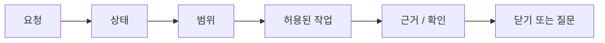

# 사용자 가이드

## 이 문서로 할 수 있는 일

AI와 함께 작업할 때 Harness가 어떻게 쓰이는지 이해하되, 대화가 작업 관리 시스템처럼 무거워지지 않게 하는 방법을 설명합니다.

Harness는 범위, 근거, 확인, 결정, QA, 남은 위험, 종료 상태를 보이게 해줍니다. 그래도 사용자는 평소처럼 말하면 됩니다. Harness가 연결되어 있다면 별도의 시작 문장을 외울 필요가 없습니다. 원하는 일을 평소 말로 설명하면, 에이전트가 작업의 성격을 보고 Harness를 적용할지 판단해야 합니다.

Harness는 제품 파일이 바뀔 수 있거나, 범위가 흔들릴 수 있거나, 사용자 판단이 필요하거나, 근거, 검증, QA, 수용, 남은 위험을 추적해야 하거나, 민감한 범주가 관련될 수 있을 때 보통 알맞습니다. 아주 작은 질문이나 명확한 읽기 전용 조언은 에이전트가 바로 처리할 수 있습니다.

명시적으로 말하고 싶다면 여전히 이렇게 말할 수 있습니다.

```text
이 작업을 Harness 기준으로 진행해.
```

에이전트가 사용자의 요청을 필요한 Harness 절차로 바꿔야 합니다. 사용자가 내부 기록을 직접 조작할 필요는 없습니다.

Harness의 깊은 용어는 실제로 멈춘 이유, 경계, 닫기 조건을 설명할 때만 쓰면 됩니다.

Harness는 단순한 기술 gate 시스템도, 단순한 계획 checklist도 아닙니다. 사용자가 소유하는 제품 판단과 중요한 기술 판단을 돕되 approval, Write Authorization, verification, Manual QA, risk, acceptance를 서로 분리해 두는 장치입니다.

## 이런 때 읽기

Harness가 연결된 상태에서 AI와 함께 하는 작업 하나가 어떻게 처리되어야 하는지 알고 싶을 때 읽습니다.

## 읽기 전에

[하나의 작업으로 보는 Harness](../learn/harness-in-one-task.md)를 먼저 보면 도움이 되지만, 필수는 아닙니다.

## 핵심 생각

사용자는 평소처럼 말하면 됩니다. 별도의 시작 문장은 필요하지 않습니다. 에이전트가 작업에 필요할 때 그 요청을 알맞은 Harness 흐름으로 바꿔야 합니다.

## 5분 시작 경로

외워야 하는 한 문장은 없습니다. 하고 싶은 일과 알고 있는 경계를 평소 말로 시작합니다.

```text
이메일 로그인 흐름을 추가해. 비밀번호 재설정과 계정 생성은 범위 밖이야.
```

에이전트는 요청이 읽기 전용 조언인지, 작은 direct 작업인지, 추적이 필요한 work인지 판단해야 합니다. 추적이 필요하다면 깊게 들어가기 전에 먼저 세 가지 쉬운 질문에 답해야 합니다.

- 범위가 무엇이고, 범위 밖은 무엇인가?
- 이미 있는 근거나 확인은 무엇이고, 아직 부족한 것은 무엇인가?
- 지금 사용자가 판단해야 할 것이 있는가?

작고 명확한 일은 `direct`로 가볍게 처리할 수 있습니다. 크거나 위험하거나 여러 파일에 걸치거나 요구가 흐린 일은 변경하기 전에 먼저 범위를 잡아야 합니다.

막혔을 때는 이렇게 묻습니다.

```text
지금 무엇 때문에 막혀 있고, 어떤 결정 하나나 확인 하나가 있으면 풀릴까?
```

닫기 직전에는 이렇게 묻습니다.

```text
수용하기 전에 닫기에 영향을 주는 남은 위험을 보여줘.
```

## 에이전트가 먼저 보여줘야 할 것

시작할 때나 중요한 작업을 이어갈 때는 에이전트가 짧은 상태나 Journey Card를 먼저 보여줘야 합니다. 빠르게 훑을 수 있으면서도 다음 행동을 정할 만큼 구체적이어야 하며, Task, mode, next action, Change Unit, blocking decisions, write authority, guarantee level, gate summary, projection freshness처럼 권한과 관련된 상태는 유지해야 합니다.

```text
작업: TASK-123 이메일 로그인 흐름 추가
모드: work
다음 행동: 로그인 실패 UX 결정
Change Unit: 로그인 폼, 로그인 API 호출, 세션 저장
범위 밖: 비밀번호 재설정, 계정 생성
필요한 결정: 로그인 실패 메시지
쓰기 권한: 아직 요청하지 않음
Gates: scope=pending; decision=required; design=pending; evidence=none; verification=not_required; QA=pending
Refs: evidence=none; run/eval/QA=none
Manual QA: 필요할 가능성 있음
남은 위험: 기록 없음
접점 보호: cooperative; 실행 전 차단을 주장하지 않음. changed-path validation이 있으면 범위를 벗어난 쓰기를 실행 뒤에 감지할 수 있음
Projection freshness: source_state_version v42 기준 current
```

핵심은 다음 안전한 행동입니다. 상태가 오래됐거나 이상해 보이면 이렇게 말합니다.

```text
상태 보여줘.
```

Status card는 judgment-context와 다릅니다. Agent에게 사용자 판단이 필요하면 options, recommendation, uncertainty, 결정을 미뤘을 때 계속할 수 있는 일, relevant evidence 또는 design record ref가 있는 focused decision prompt를 별도로 붙여야 합니다.

에이전트가 guard, freeze, careful mode 같은 말을 쓴다면 쉬운 말로 풀어야 합니다. 무엇을 실행 전에 실제로 막을 수 있고, 무엇은 실행 뒤에만 감지할 수 있는지 구분해야 합니다. Cooperative 또는 detective 접점에서 freeze는 범위 보류나 다음 행동을 더 엄격하게 제한하는 상태이지 실행 전 강제 차단이 아닙니다.

## 세 가지 일상 질문

### 범위

범위는 "무엇을 하고, 무엇은 하지 않는가?"에 답합니다.

좋은 범위는 에이전트가 실수로 일을 넓히지 않을 만큼 좁고 분명합니다. 영향을 받는 영역, 중요한 제외 사항, 필요한 파일이나 동작 경계를 말해야 합니다.

범위가 분명해지면 에이전트는 그 안의 일상적인 구현 세부사항을 매번 묻지 않고 판단할 수 있습니다. 예를 들면 기존 helper를 쓸지, private function을 나눌지, focused tests를 추가할지, 합의된 결과에 맞는 보수적인 내부 접근을 고를지 같은 일입니다.

대신 사용자나 다른 코드가 기대하는 약속을 바꾸는 선택에서는 멈춰야 합니다. Public API나 module contract, security 또는 privacy trade-off, UX나 제품 동작, 중요한 dependency 또는 migration 방향, scope expansion, 알려진 남은 위험 수용이 여기에 해당합니다.

Harness는 이 구분을 설명할 때 네 가지 관련 라벨을 쓸 수 있습니다.

| 라벨 | 쉬운 뜻 |
|---|---|
| Change Unit scope | 범위 안에 있는 작업 영역입니다. 그 자체로 쓰기를 허가하지는 않습니다. |
| Autonomy Boundary | 그 범위 안에서 agent가 혼자 행사할 수 있는 판단입니다. 쓰기 권한이 아니며 paths, tools, commands, network, secrets, sensitive categories를 부여하지 않습니다. |
| Approval | 민감한 단계에 대한 허가입니다. 수용, correctness, 사용자 소유 판단이 아닙니다. |
| Write Authorization | `prepare_write`가 한 번의 write attempt에 부여한 쓰기 허용입니다. Scope나 Autonomy Boundary를 넓히지 않습니다. |

자주 쓰는 말:

```text
범위와 질문부터 잡아줘.
범위는 이대로 좋아. 방금 합의한 범위를 넘기지 마.
범위가 커져야 한다면, 먼저 선택지와 영향을 보여줘.
```

Harness는 이런 경계를 활성 Change Unit 안에서 작업을 유지하는 일로 설명할 수 있고, 범위 변경에 사용자 판단이 필요하면 Decision Packet으로 물을 수 있습니다. 사용자가 먼저 그런 용어로 말할 필요는 없습니다.

### 근거

근거는 "이 일이 끝났다고 말할 수 있는 뒷받침이 무엇인가?"에 답합니다.

근거는 에이전트가 "했습니다"라고 말하는 것이 아닙니다. 변경된 경로, 테스트 결과, 로그, 스크린샷, QA 기록, 검증 결과처럼 수용 기준을 뒷받침하는 자료입니다.

큰 근거는 먼저 ref와 짧은 outcome으로 보여줘야 합니다. Log, screenshot, diff, trace, Run detail, Eval detail, Manual QA note, artifact는 사용자나 다음 reviewer가 내용을 inspect해야 할 때가 아니면 default context에 붙여 넣지 않습니다.

자주 쓰는 말:

```text
어떤 수용 기준에 근거가 부족한지 보여주고, 어떤 확인을 더 하면 충분한지 제안해줘.
```

### 지금 필요한 판단

지금 필요한 판단은 "안전하게 계속하거나 닫기 전에 사용자가 무엇을 결정해야 하는가?"에 답합니다.

대부분의 판단은 다음 중 하나입니다.

- 사용자가 소유하는 제품 방향이나 제품 장단점 선택
- 비용, 호환성, 보안, migration, interface, 유지보수 영향이 큰 중요한 기술 방향 선택
- 민감한 단계 승인
- Manual QA가 필요한지, 또는 생략을 받아들일 수 있는지 결정
- 알려진 남은 위험 수용
- 최종 수용이 필요한 작업에서 결과 수용

사용자가 소유하는 제품 판단이나 중요한 기술 판단이 진행을 막고 있으면 에이전트는 Decision Packet을 보여줘야 합니다. 옵션, 장단점, 추천, 불확실성, 미룰 경우의 영향이 있어야 합니다. 이를 막연한 "전부 승인할까요?"로 뭉개면 안 됩니다.

좋은 Decision Packet은 허가서가 아니라 판단을 도와주는 자료처럼 느껴져야 합니다. 실제로 골라야 할 선택을 이름 붙이고, 현실적인 경로를 비교하고, 하나를 추천하고, 결정을 미루면 무엇을 안전하게 계속할 수 있는지 또는 결정 전에는 왜 아무것도 계속하면 안 되는지 말해야 합니다.

예시:

- Product/UX: 로그인 실패 피드백은 inline message, toast, modal/layer 중 하나일 수 있습니다. Packet은 사용자 흐름, 방해 정도, 접근성, 문구 위험을 비교한 뒤 경로를 추천해야 합니다.
- Product/copy: 로그인 실패 문구는 보안을 우선한 짧은 문구, 복구를 쉽게 설명하는 문구, field-level에서 더 구체적인 안내 중 하나일 수 있습니다. Packet은 계정 enumeration 위험, 명확성, support burden, product tone을 비교해야 합니다.
- Product taste와 QA: 더 polished한 interaction은 layout, accessibility 해석, feel을 위해 Manual QA가 필요할 수 있고, 더 보수적인 동작은 검증하기 쉽습니다. Packet은 trade-off와 QA를 미뤄도 계속할 수 있는 일, 또는 결정 전에는 진행하면 안 되는 이유를 보여줘야 합니다.
- 기술 선택: 세션 처리는 session auth, token auth, social login 중 하나를 쓸 수 있습니다. Packet은 폐기 가능성, client 호환성, 보안, 구현 비용을 분리해서 보여줘야 합니다.
- 기술 선택: dependency addition, schema migration, public API/interface change, module boundary change도 호환성, rollback, test boundary, future maintenance에 영향을 주면 Decision Packet이 필요할 수 있습니다.
- 보안 민감 작업: secret 접근, 권한 변경, 데이터 export에 대한 approval은 그 민감한 단계를 진행해도 되는지만 답합니다. 어떤 데이터를 export할지, 누가 export할 수 있는지, 무엇을 마스킹할지, 어떤 감사 기록이 필요한지는 따로 결정해야 합니다.

## 문장 모음

일상 작업은 명령어가 아니라 대화로 시작합니다. 먼저 평소 쓰는 말로 요청하면 됩니다. Harness 용어는 실제로 멈춘 이유, 경계, 닫기 조건을 정확히 설명해야 할 때 에이전트가 꺼내 쓰는 보조 라벨입니다.

| 이렇게 말해도 됩니다 | 필요할 때 에이전트가 쓸 수 있는 Harness 용어 |
|---|---|
| 이메일 로그인 흐름을 추가해. 비밀번호 재설정은 범위 밖이야. | 작업 성격상 필요한 경우 추적되는 Harness work. |
| 상태 보여줘. | Journey Card 또는 현재 Task 상태. |
| 이 작업 이어서 해. Harness 상태부터 확인해. | Harness 상태에서 이어가기. |
| 이어가기 전에 Journey Card부터 보여줘. | 더 진행하기 전 이어가기 상태. |
| 작으면 바로 처리하고, 커지면 추적되는 흐름으로 진행해. | `direct` 또는 `work`로 분류. |
| 범위와 질문부터 잡아줘. | Task 범위, 제품 파일을 쓸 수 있으면 활성 Change Unit. |
| 방금 합의한 범위를 넘기지 마. | Change Unit 경계. |
| 범위가 커져야 한다면, 먼저 선택지와 영향을 보여줘. | 범위나 사용자 소유 판단을 위한 Decision Packet. |
| 실행 전에 실제로 막을 수 있는 것과 실행 뒤에만 감지할 수 있는 것을 나눠서 보여줘. | guarantee level 또는 surface capability. |
| 가능하면 독립적으로 확인해줘. | detached verification. |
| Manual QA가 필요한지 판단해줘. | Manual QA 필요 여부 또는 waiver. |
| 수용하기 전에 남은 위험을 보여줘. | residual risk와 닫기에 영향을 주는 위험 상태. |
| 최종 수용이 필요하면 닫기 전에 먼저 요청해. | 닫기 전 최종 수용. |
| 여기서는 별도 최종 수용이 필요 없으니, 관련 막힘이 해소되면 닫아. | 이 작업 경로에서는 최종 수용이 필요 없음. |
| 수용해. 이 작업 닫아. | 막힘이 해소된 뒤 작업 닫기. |

명시하고 싶다면 "이 작업을 Harness 기준으로 진행해"라고 말할 수 있지만, 필수 시작 문장은 아닙니다.

검토 관점을 요청할 때도 먼저 쉬운 말로 말하고, 필요한 경우에만 라벨을 붙이면 됩니다.

```text
선택하기 전에 제품 또는 기술 장단점을 따로 봐줘.
엔지니어링, 디자인, 보안, QA, 릴리스 인계 관점에서 확인해줘.
```

이런 검토 요청을 더 정확히 부를 때는 product-review, eng-review, design-review, security-review, qa-review, release-handoff 같은 라벨을 쓸 수 있습니다.

더 조심해서 진행하고 싶을 때:

```text
방금 합의한 범위를 넘기지 마.
범위가 커져야 한다면, 먼저 선택지와 영향을 보여줘.
열려 있는 결정에 답할 때까지 쓰기는 멈춰.
실행 전에 실제로 막을 수 있는 것과 실행 뒤에만 감지할 수 있는 것을 나눠서 보여줘.
이 변경은 조심해서 진행해. 범위를 좁게 유지하고, 쓰기 전에는 쓰기 권한을 보여주고, 사용자가 소유하는 제품 판단이나 중요한 기술 판단 전에는 물어봐.
```

연결된 접점이 실행 전에 실제로 막을 수 없다면 careful mode는 더 좁은 작업 태도, 더 분명한 상태 표시, 가능한 경우의 사후 감지를 뜻합니다. 실행 전 강제 차단처럼 설명하면 안 됩니다.

같은 요청을 더 정확히 설명해야 할 때는 Change Unit, Decision Packet, guarantee level, detached verification, residual risk, `prepare_write`, Write Authorization 같은 용어가 등장할 수 있습니다. 이 용어들은 실제 block이나 close 조건을 설명할 때 쓰는 이름이지, 사용자가 먼저 입력해야 하는 명령어가 아닙니다.

## 기본 흐름

기본 흐름은 짧은 대화처럼 느껴져야 합니다. 사용자는 현재 위치, 다음 안전한 행동, 정말 필요한 결정만 보면 됩니다.



일반적인 흐름:

1. 에이전트가 상태를 확인하거나 요청 정리를 시작합니다.
2. 요청을 `advisor`, `direct`, `work` 중 하나로 분류합니다.
3. 제품 파일을 쓸 수 있는 경우 범위와 활성 Change Unit을 확인합니다.
4. 사용자가 소유하는 제품 판단이나 중요한 기술 판단이 막고 있으면 사용자가 Decision Packet에 답합니다.
5. 제품 파일을 쓰기 전에 쓰기 권한을 확인합니다.
6. 변경이나 조언 뒤에는 필요한 결과와 근거를 기록합니다.
7. 필요하면 닫기 전에 검증, Manual QA, 남은 위험, 최종 수용을 처리합니다.

작은 `direct` 작업은 뒤쪽 확인 중 일부를 건너뛸 수 있습니다. 더 큰 작업은 그런 확인을 숨기지 말고, 필요할 때만 보여줘야 합니다.

## 작업이 막혔을 때

막힘은 "왜 지금 안전하게 계속하거나 닫을 수 없는지"를 구체적으로 설명해야 합니다.

좋은 막힘 표시:

```text
막힘:
- AC-02 근거가 없습니다.
- 바뀐 온보딩 문구에 Manual QA가 필요합니다.
- 빈 상태 동작을 고르기 전에는 제품 결정을 해야 합니다.

가장 작은 해소 방법: Decision Packet에서 빈 상태 동작을 선택하기.
```

자주 쓰는 말:

```text
지금 무엇 때문에 막혀 있어?
어떤 결정 하나나 확인 하나가 있으면 풀릴까?
가장 작은 안전한 다음 행동을 보여줘.
그 결정은 미루고 더 작은 Change Unit을 제안해줘.
```

## 결정, 승인, QA, 수용, 남은 위험

이 단어들은 서로 다른 질문에 답합니다.

| 판단 | 답하는 질문 |
|---|---|
| 결정 | 어떤 사용자 소유 제품 방향, 중요한 기술 방향, 장단점, 생략, 닫기 관련 선택을 할 것인가? |
| 승인 | 이 민감한 행동을 진행해도 되는가? |
| Manual QA | 사람이 봐야 하는 경험 품질을 실제로 확인했는가? |
| 남은 위험 수용 | 알려진 한계, 불확실성, 장단점을 받아들이는가? |
| 최종 수용 | 작업이 최종 수용을 요구할 때 결과를 받아들이는가? |

승인은 수용이 아닙니다. 확인을 통과했다고 Manual QA가 끝난 것도 아닙니다. 남은 위험을 수용해도 일이 맞게 끝났다는 근거가 되지는 않습니다. 최종 수용이 필요한 경우에는 닫기에 영향을 주는 남은 위험이 표시되었거나 없다고 보고된 뒤에 따로 요청되어야 합니다.

의존성 추가, 인증이나 권한 변경, 데이터 모델 변경, 공개 API 변경, 파괴적 쓰기, secret 접근, 운영 설정 변경은 승인이 필요할 수 있습니다. Approval은 민감한 단계를 진행해도 되는지만 답합니다. Dependency, migration, interface, module boundary, 제품, 중요한 기술, QA, risk 선택 자체에는 별도의 Decision Packet이 여전히 필요할 수 있습니다.

에이전트가 QA 또는 verification waiver를 요청한다면 무엇을 확인하지 않는지, 사용자가 어떤 위험을 받아들이는지, 어떤 후속 작업이 남는지 말해야 합니다. 남은 위험을 안고 close하자고 요청한다면 먼저 남은 한계를 보여준 뒤, 그 위험을 이 Task에서 수용하는지 물어야 합니다.

## 닫기 체크리스트

닫기 전에 에이전트는 다음을 쉬운 말로 분명히 해야 합니다.

- 결과가 합의한 범위와 맞습니다.
- 필요한 근거가 있거나, 이 작업에는 근거가 필요하지 않습니다.
- 검증이 필요 없거나, 통과했거나, 기록된 위험과 함께 명시적으로 면제되었습니다.
- Manual QA가 필요 없거나, 통과/완료되었거나, 타당하게 면제되었습니다.
- 알려진 닫기에 영향을 주는 남은 위험이 표시되었거나, 에이전트가 `ResidualRiskSummary.status=none`이라고 보고했습니다.
- 최종 수용이 필요한 경우 승인이 아니라 별도 수용으로 요청되었습니다.

닫을 때 쓸 수 있는 말:

```text
닫기 체크리스트를 보여줘.
표시된 남은 위험을 수용해. 위험 수용으로 닫아.
수용해. 이 작업 닫아.
아직 수용하지 않아. 닫기 전에 UX를 다시 작업해.
```

## 다음에 볼 문서

에이전트가 세션을 어떻게 진행해야 하는지는 [에이전트 세션 흐름](agent-session-flow.md)을 봅니다.

Harness를 쓰기 전에 전체 그림을 보고 싶다면 [하나의 작업으로 보는 Harness](../learn/harness-in-one-task.md)와 [핵심 개념](../learn/concepts.md)을 봅니다.

자세한 커넥터 계약과 능력 프로필은 [Agent 통합 참조](../reference/agent-integration.md)가 담당합니다. 접점별 설정은 [Surface Cookbook](../reference/surface-cookbook.md)을 봅니다.
