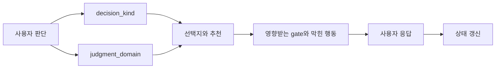
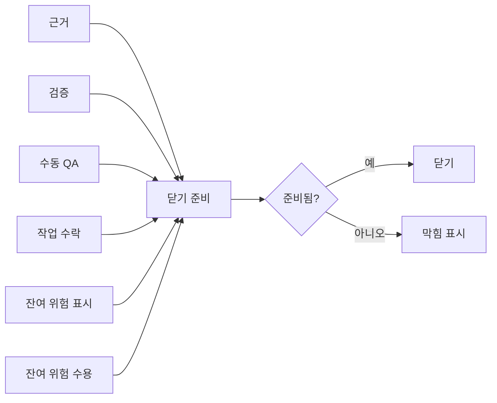

# 사용자 가이드

## 평소 말로 시작하기

평소처럼 요청하면 됩니다. 원하는 일, 이미 아는 경계, 어느 정도 조심해서 진행하길 원하는지를 말하세요. 구현 전에 계획을 구체화해 달라고 하거나, 제품 판단이나 중요한 기술 판단으로 커지지 않는 한 작게 유지해 달라고 하거나, 제품 판단과 아키텍처 판단을 분리해 달라고 하거나, 부족한 근거와 닫기 막힘을 보여 달라고 요청할 수 있습니다.

에이전트가 해야 할 일은 다음과 같습니다.

- 중요한 쓰기 전에 범위를 분명히 합니다.
- 저장소, 문서, 현재 하네스 맥락에서 스스로 찾을 수 있는 답을 먼저 확인한 뒤 질문합니다.
- 사용자만 할 수 있는 판단을 찾아냅니다.
- 제품이나 UX 판단과 기술 아키텍처 판단을 분리합니다.
- 완료 주장을 뒷받침할 근거를 모으거나, 어떤 근거가 필요한지 설명합니다.
- 다음 안전한 행동과 무엇이 아직 작업 닫기를 막는지 보여줍니다.

하네스는 범위, 사용자 소유 판단, 근거, 검증, QA 기대, 작업 수락, 잔여 위험 상태를 깨지기 쉬운 대화 밖에 보존하도록 돕습니다. AI 지원 작업을 따라가기 쉽게 만들기 위한 장치이지, 모든 일을 관리 절차처럼 무겁게 만드는 장치가 아닙니다. 작은 일은 작게 유지해야 합니다. 범위, 판단, 근거, QA, 검증, 작업 수락, 잔여 위험이 중요해지는 큰 일에서만 구조가 더 필요합니다.

사용자는 쉬운 작업 사실을 볼 수 있어야 합니다. 무엇이 범위 안이고 밖인지, 에이전트가 무엇을 확인할 수 있는지, 사용자만 결정할 것은 무엇인지, 무엇이 바뀌었고 확인됐는지, 어떤 근거와 위험이 남았는지, 닫기가 막혔는지 같은 내용입니다. 내부 기록 이름, 관문 이름, 도구 이름을 먼저 배울 필요는 없습니다.

하네스는 주변 엔지니어링 과정을 대체하지도 않습니다. 제품 파일 이력은 여전히 소스 관리가 기록하고, 실행 동작은 테스트가 확인하고, 변경은 리뷰가 살피며, 사용자 소유의 제품 판단이나 중요한 기술 판단은 여전히 사용자에게 있습니다.

좋은 하네스 요청은 평범한 작업 요청처럼 들립니다.

```text
이메일 로그인 흐름을 추가하고 싶어. 비밀번호 재설정은 지금 범위에서 빼고, 먼저 결정해야 할 것들을 정리해줘.
```

```text
이 기능 아이디어를 검토하고, 구현 전에 필요한 질문을 해줘.
```

```text
작은 문구 변경을 해줘. 다만 이게 더 큰 제품 판단으로 번지면 알려줘.
```

```text
코드를 바꾸기 전에 제품 결정과 기술 결정을 나눠서 보여줘.
```

명시하고 싶다면 이렇게 말할 수도 있습니다.

```text
이 작업을 하네스 기준으로 진행해.
```

하지만 사용자가 꼭 그렇게 말해야 하는 것은 아닙니다. 에이전트는 요청의 모양을 보고 하네스가 필요한지 판단해야 합니다.

## 세 가지 일상 작업 모양

대부분의 요청은 쉬운 작업 모양으로 먼저 설명해야 합니다.

| 작업 모양 | 이런 때 사용 | 사용자에게 보일 내용 |
|---|---|---|
| 읽기/조언 | 제품 파일을 바꾸지 않고 읽기, 설명, 비교, 검토, 판단 지원을 할 때. | 답변, 필요할 때 출처나 주의점, 중요한 결정이나 후속 작업. |
| 작은 변경 | typo, 문구만 바꾸는 수정, 좁은 fix처럼 범위가 작고 위험이 낮으며 결과가 분명할 때. | 짧은 범위, 바뀐 경로 또는 파일 변경 없음, 확인한 것, 커진 부분이 있었는지. |
| 추적되는 작업 | 범위가 불분명하거나, 여러 부분이 있거나, 제품 또는 기술 판단, 보안/개인정보 영향, 의미 있는 근거, QA, 검증, 작업 수락, 닫기 관련 위험이 있을 때. | 범위, 판단, 근거, 닫기 준비 상태, 다음 안전한 행동, 가장 작은 막힘. |

에이전트는 사용자에게 보여주는 것보다 더 많은 내부 세부사항을 기록할 수 있습니다. 사용자에게 보이는 메시지는 작은 수정마다 lifecycle checklist를 보여주는 것이 아니라, 판단하고 신뢰하고 막힘을 풀 때 필요한 내용이어야 합니다.

## 에이전트가 처음 답해야 할 것

작업이 아주 작지 않다면, 첫 답변은 완성된 계획이나 내부 상태 목록이 아니라 요청을 평범한 작업 사실로 정리한 짧은 요약이어야 합니다.

예:

```text
이해한 범위: 이메일 로그인만 추가합니다. 비밀번호 재설정, 계정 생성, 소셜 로그인, 전체 인증 재설계는 범위 밖입니다.

제가 확인할 수 있는 것: 기존 로그인 경로, 세션 처리, 인증 테스트, UI 폼 패턴, validation helper, 현재 인증 동작 문서.

사용자만 결정할 수 있는 것: 이메일 로그인이 비밀번호 방식인지, 일회용 코드인지, magic link인지, 외부 identity provider인지; 로그인 실패 UX와 문구; 보안과 UX 장단점을 어느 정도 받아들일지.

다음 안전한 행동: 현재 인증 흐름을 살핀 뒤, 코드베이스가 답하는 것, 사용자만 결정할 수 있는 것, 범위가 잡힌 다음 작업 제안을 가져오겠습니다.
```

좋은 구체화 답변은 다음을 분리해서 보여줘야 합니다.

- 목표
- 사용자 가치
- 비목표
- 수용 기준
- 에이전트가 저장소, 문서, 현재 하네스 상태에서 확인할 수 있는 사실
- 사용자만 결정할 수 있는 판단
- 제품 또는 UX 판단 후보
- 기술 아키텍처 판단 후보
- security 또는 privacy 판단 후보
- QA와 검증 기대 수준
- 남은 불확실성
- 안전한 다음 작업 후보 또는 작업 분할 후보

판단이 필요하면 에이전트는 넓은 "승인할까요?" 대신 어떤 판단인지 이름 붙여야 합니다. 민감 동작 승인, 작업 수락, 잔여 위험 수용, QA 또는 검증 면제 판단은 서로 다른 결정입니다.

제품이나 UX 판단:

```text
필요한 판단: 로그인 실패 경험.
선택지: 폼 근처 인라인 메시지, 토스트, 모달.
추천: 폼 근처 인라인 메시지. 계속 보이고 접근성 대응이 비교적 쉽습니다.
미뤄도 계속할 수 있는 일: 최종 UI 동작을 확정하지 않는 API 연결과 테스트.
아직 닫을 수 없는 것: 최종 UX, 문구, 수동 QA.
```

기술 아키텍처 판단:

```text
필요한 판단: 로그인 구조.
선택지: session cookie, bearer/JWT, OAuth/OIDC, social-login provider integration.
추천: 먼저 기존 세션과 사용자 모델을 확인합니다. 코드베이스가 이미 지원하는 것과 identity provider 요구사항을 알기 전에는 고르지 않습니다.
미뤄도 계속할 수 있는 일: 읽기 전용 조사와 범위가 제한된 구현 제안.
아직 닫을 수 없는 것: 구현, 보안 근거, 선택한 인증 경로의 수용 기준.
```

필요한 근거:

```text
"끝났다"고 말하기 전에 필요한 근거: 변경 경로, 성공/실패 경로의 집중 인증 테스트, 보안상 민감한 가림(redaction) 메모, 로그인 화면 문구와 오류 상태가 바뀐다면 수동 QA.
```

왜 아직 닫을 수 없는지:

```text
아직 닫을 수 없습니다. 로그인 실패 UX가 정해지지 않았고, 구현 근거가 없으며, 로그인 화면의 수동 QA 기대 수준도 정해지지 않았습니다.
가장 작은 해소 방법: 로그인 실패 패턴을 고르거나, 최종 UI 동작을 피하는 더 작은 조각을 제안해 달라고 요청하세요.
```

<a id="first-read-path"></a>
<a id="phrase-reference"></a>

## 이렇게 물어볼 수 있습니다

아래 문장은 그대로 말해도 되는 평범한 요청입니다. 외워야 하는 명령어가 아닙니다.

```text
구현 전에 계획을 먼저 구체화해줘.
코드를 바꾸기 전에 필요한 걸 물어봐.
목표, 비목표, 수용 기준부터 잡아줘.
현재 상태와 다음 안전한 행동을 보여줘.
오래된 대화가 아니라 현재 상태에서 이어가줘.
지금 이 작업은 무엇 때문에 막혀 있어?
어떤 결정 하나나 확인 하나가 있으면 풀릴까?
닫기 준비 상태를 쉬운 말로 보여줘.
작업 수락 전에 닫기에 영향을 주는 잔여 위험을 보여줘.
아직 어떤 근거가 부족해?
제품 판단이나 중요한 기술 판단으로 커지지 않는 한 작게 유지해줘.
먼저 살핀 뒤 안전한 다음 작업이나 작업 분할을 보여줘.
```

## 계획을 구체화하는 예시

제품 계획은 이렇게 말할 수 있습니다.

```text
새 workspace owner의 onboarding을 더 좋게 만들고 싶어. 먼저 지금 있는 걸 살펴보고, 제품 선택과 확인 가능한 사실을 나눈 뒤, 저장소에서 답할 수 없는 질문만 해줘.
```

좋은 답변은 사용자 가치, 비목표, 확인 가능한 사실, checklist와 setup prompt 같은 제품/UX 판단 후보, flow에 대한 QA 기대 수준, 남은 불확실성, 안전한 다음 작업 또는 작업 분할 제안을 보여줘야 합니다.

기술 계획은 이렇게 말할 수 있습니다.

```text
로그인 방식을 바꾸고 싶은데 session, magic link, OAuth/OIDC 중 무엇이 맞는지 모르겠어. 먼저 현재 auth 구조를 살피고 구현 전에 결정할 것들을 보여줘.
```

좋은 답변은 질문하기 전에 기존 auth, session, user model, test, 문서를 살피고, 기술 아키텍처 선택과 security/privacy 선택을 분리하며, 검증과 수동 QA 기대 수준을 이름 붙이고, 안전한 조사 조각 또는 작업 분할을 제안해야 합니다. 첫 번째 그럴듯한 구현 경로가 보였다는 이유만으로, 수용 기준, 중요한 판단 후보, 남은 불확실성이 아직 흐린데 구체화를 끝내면 안 됩니다.

## 작은 일은 가볍게

하네스가 작은 변경을 무겁게 만들면 안 됩니다. 사용자가 이렇게 말한다면:

```text
설정 알림 문구의 오타를 고쳐줘. "성공헀습니다"를 "성공했습니다"로.
```

에이전트가 보여줄 흐름은 짧아야 합니다.

```text
범위: 설정 알림 문구의 오타 하나.
범위 밖: 계정 동작, 레이아웃, localization 전략, 더 넓은 문구 정리.
대상 component와 직접 관련된 copy test가 있으면 그것만 수정하겠습니다.
```

변경 뒤 결과도 작게 보여주면 됩니다.

```text
완료했습니다.
변경: 설정 알림 문구를 "성공했습니다"로 수정.
확인: 관련 copy test와 diff 확인.
더 큰 제품 판단으로 번지지 않았고, 이번 작은 변경에 대해 알려진 닫기 관련 잔여 위험은 없습니다.
```

사용자에게 보이는 흐름이 가볍다는 뜻이 하네스를 내부적으로 건너뛴다는 뜻은 아닙니다. 제품 파일이 바뀔 수 있으면 에이전트는 여전히 범위를 좁게 유지하고, 적절한 내부 쓰기 권한 경로를 사용하고, 무엇이 바뀌었는지 기록하고, 일이 원래 요청을 넘어 커지면 알려야 합니다. 모든 작은 수정마다 사용자가 "Change Unit" 같은 말을 볼 필요는 없습니다. 경계나 막힘을 설명할 때 도움이 될 때만 보이면 됩니다.

작은 일은 더 이상 작지 않을 때 추적되는 작업으로 커져야 합니다. 범위가 불분명하거나, 여러 파일·제품 영역·subsystem이 관련되거나, 제품/UX 판단이 필요하거나, 중요한 기술 아키텍처 판단이 필요하거나, public interface/API에 영향이 있거나, 보안/개인정보에 영향이 있거나, 민감한 행동이 필요하거나, QA 또는 검증 요구가 커지거나, 근거가 부족하거나, 잔여 위험이 작지 않거나, multi-step delivery가 필요하면 상향합니다.

예시:

- 오타나 문구만 바꾸는 수정은 한 곳의 분명한 표면에 머물고 의미, 동작, localization 전략, 보안 자세, 필요한 QA가 바뀌지 않으면 가볍게 유지할 수 있습니다.
- "이 모달에서 Enter 키가 닫기 대신 제출하게 해줘"는 UI 동작, 접근성 기대, 제품 흐름을 바꿀 수 있으므로 제품/UX 판단이 필요한 추적되는 작업으로 상향합니다.
- "로그인을 magic link로 바꿔줘"는 인증 구조와 보안/개인정보 동작을 바꾸므로 상향합니다. 에이전트가 먼저 조사할 수는 있지만, 구현에는 추적되는 범위, 사용자 소유 기술/보안 판단, 근거, QA/검증이 필요할 가능성이 큽니다.

## 큰 일에는 구조가 필요합니다

사용자가 이렇게 말한다면:

```text
이메일 로그인 흐름을 추가하고 싶어. 비밀번호 재설정은 지금 범위에서 빼고, 먼저 결정해야 할 것들을 정리해줘.
```

이 작업은 제품 동작, 보안, UI, 테스트, 근거, QA, 닫기 관련 위험에 닿을 수 있으므로 에이전트가 구조를 더해야 합니다.

좋은 초기 답변:

```text
제가 들은 범위: 이메일 로그인 추가. 지금 범위 밖: 비밀번호 재설정, 계정 생성, 소셜 로그인, 전체 인증 재설계.

제가 확인할 것: 기존 인증 경로, user/session model, 로그인 UI 패턴, validation과 error handling, 현재 test와 문서.

사용자 판단이 필요할 가능성이 큰 것:
- 제품 / UX: credential flow, 로그인 실패 동작, 로그인 문구, 복구 안내.
- 기술 아키텍처: session model, token/cookie 전략, password storage 또는 identity-provider 경로, migration 영향, dependency 선택.
- 보안 / 개인정보: account-enumeration 위험, audit log, rate limit 또는 lockout 동작, redaction, secret handling.

필요할 가능성이 큰 근거: 성공/실패 경로의 집중 테스트, 변경 경로 요약, 보안상 민감한 메모, 로그인 화면이 바뀐다면 UI 수동 QA.

아직 닫을 수 없는 이유: 범위, 사용자 판단, 근거, QA 기대 수준, 잔여 위험이 정리되지 않았습니다.
```

작업이 진행될수록 에이전트는 같은 구분을 계속 보여줘야 합니다.

- 무엇이 범위 안이고 무엇이 계속 범위 밖인지
- 합의한 범위 안에서 에이전트가 혼자 판단해도 되는 것
- 사용자만 결정할 수 있는 것
- 무엇이 바뀌었고 무엇을 확인했는지
- 각 완료 주장을 어떤 근거가 뒷받침하는지
- 검증이나 수동 QA가 필요한지
- 어떤 잔여 위험이 남았는지
- 무엇이 아직 작업 수락이나 닫기를 막는지

영향 범위가 클수록 이 분리가 중요합니다. 보안에 닿는 기능은 테스트가 통과했다는 이유만으로 닫으면 안 됩니다. UI 기능은 screenshot이나 browser smoke만으로 작업 수락을 대신하면 안 됩니다. Dependency install을 허용한 것이 그 dependency를 아키텍처 방향으로 채택한다는 판단이 되어서는 안 됩니다.

<a id="the-four-display-groups"></a>

## 네 가지 쉬운 그룹

대부분의 상태 표시는 네 가지 그룹으로 충분해야 합니다. 에이전트가 뒤에서 정확한 하네스 참조를 사용하더라도, 사용자에게는 먼저 이 질문들로 보여줘야 합니다.

| 그룹 | 쉬운 질문 | 에이전트가 보여줄 것 |
|---|---|---|
| 범위 | 무엇을 하고, 무엇은 하지 않는가? | 포함된 동작, 범위 밖 항목, 영향을 받는 영역, 다음 행동이 범위에 맞는지. |
| 판단 | 사용자가 무엇을 결정해야 하는가? | 제품/UX 선택, 중요한 기술 선택, 보안 또는 개인정보 선택, 민감 동작 승인, 범위가 정해진 QA 또는 검증 면제 판단, 작업 수락, 잔여 위험 수용, 범위 변경. |
| 근거 | 끝났다는 주장을 무엇이 뒷받침하는가? | 변경 경로, test, log, screenshot, QA note, 검증 결과, 빠진 근거, 오래된 근거. |
| 닫기 준비 상태 | 무엇이 아직 닫기를 막는가? | 검증, 수동 QA, 작업 수락, 잔여 위험 표시 또는 수용, 닫기 막힘, 가장 작은 해소 방법. |

이 네 가지는 읽기용 요약이지 권한 문서가 아닙니다. 에이전트가 뒤에 있는 ref를 보여줄 수는 있지만, 상태 변경, 근거 기록, 작업 수락, 잔여 위험 수용, 닫기는 여전히 Harness/Core 기록과 action에서만 옵니다.

판단 그룹에 정식 결정 패킷(Decision Packet)이 필요하면 하네스는 결정 경로와 사용자에게 보이는 판단 영역을 함께 기록합니다. 결정 경로는 어떤 lifecycle 또는 gate path를 쓰는지 말합니다. 판단 영역은 결정을 Product / UX, Technical architecture, Security / privacy, QA / acceptance, Residual risk, Scope / autonomy, Mixed 같은 label로 묶어 설명합니다. 영향을 받는 gate나 막힌 행동은 별도로 기록되며, 그 별도 기록이 결정의 영향을 정합니다.



유용한 상태 표시는 이런 모양입니다.

```text
범위: 로그인 form과 로그인 API call. 비밀번호 재설정과 계정 생성은 계속 범위 밖입니다.
판단: 로그인 실패 UX는 사용자 선택이 필요합니다.
근거: 저장소 조사는 끝났지만 구현 근거는 아직 없습니다.
닫기 준비 상태: UX 선택, 구현 근거, QA 기대 수준, 잔여 위험이 처리되기 전에는 닫을 수 없습니다.
다음 안전한 행동: 로그인 실패 UX를 고르거나, 더 작은 구현 조각을 제안해 달라고 요청하세요.
```

<a id="judgment"></a>

## 에이전트가 혼자 결정해도 되는 것

범위가 분명해지면 에이전트는 일상적인 구현 세부사항을 매번 묻지 않고 판단할 수 있습니다. 예를 들면 기존 helper를 재사용할지, 비공개 함수를 어떻게 나눌지, 집중 테스트를 어디에 둘지, 저장소의 이름 짓기 규칙을 따를지, 합의한 결과에 맞는 보수적인 내부 접근을 고를지 같은 일입니다.

하지만 사용자, caller, future work가 의존할 수 있는 약속이 바뀌면 멈춰야 합니다.

- 제품 동작이나 UX
- public API 또는 module contract
- 보안, 개인정보, audit, retention, redaction 선택
- 중요한 dependency, migration, architecture 방향
- 범위 확장
- QA 또는 검증 면제
- 알려진 잔여 위험 수용
- 요구되는 경우 작업 수락

자주 쓰는 말:

```text
범위와 질문부터 잡아줘.
코드베이스가 답할 수 없는 것만 나에게 물어봐.
범위가 커져야 한다면 먼저 선택지와 영향을 보여줘.
제품 결정과 기술 결정을 분리해줘.
끝났다고 말하기 전에 어떤 근거가 충분한지 알려줘.
무엇이 아직 닫기를 막는지 보여줘.
```

## 보장 수준, 짧게 말하면

하네스는 보안에 민감한 AI 작업을 더 잘 보이고 올바른 경로로 보내게 해 주지만, 초기 로컬 하네스 자체가 sandbox는 아닙니다. OS 권한을 자동으로 바꾸거나, 임의 도구를 sandbox 격리하거나, 로컬 파일을 변조 불가능하게 만들거나, 지시받은 agent를 사전 차단 보안 경계로 바꾸지 않습니다.

네 가지 보장 수준을 볼 수 있습니다. `cooperative`는 에이전트에게 규칙을 따르라고 지시하는 협력형 수준입니다. `detective`는 불일치를 실행 뒤에 탐지하거나 기록할 수 있는 탐지형 수준입니다. `preventive`는 입증된 통제가 실행 전에 동작을 막는다는 뜻입니다. `isolated`는 작업이나 검증이 문서화된 분리 경계 뒤에서 실행된다는 뜻입니다. Worktree나 fresh evaluator bundle은 자동으로 OS sandbox 격리, 권한 경계, 변조 불가능한 보안 경계가 아닙니다. 초기 로컬 사용에서는 에이전트가 실제 차단 통제나 입증된 분리 경계를 정확히 이름 붙일 수 있을 때가 아니라면 cooperative/detective 수준의 표현을 기대해야 합니다.

## 작업이 막혔을 때

막힘은 구체적이어야 합니다. 다음 움직임을 누가 소유하는지, 가장 작은 해소 방법이 무엇인지 말해야 합니다. 사용자에게는 `막힘`처럼 쉬운 말을 쓰고, API나 Reference 문맥에서만 `blocker` 또는 `차단 조건(blocker)`을 덧붙입니다.

```text
막혔습니다.
범위: 요청한 문구 변경이 원래 label을 넘어 계정 동작에 영향을 줄 수 있습니다.
판단: 변경 범위를 넓힐지에 대한 사용자 소유 제품 판단이 필요합니다.
근거: 에이전트는 call site를 확인하고 영향받는 화면을 보여줄 수 있습니다.
닫기 준비 상태: label만 바꾸도록 범위를 줄이거나, 의도적으로 계정 동작까지 범위를 넓히기 전에는 닫을 수 없습니다.
가장 작은 해소 방법: label-only 변경으로 유지할지, 계정 동작까지 포함할지 선택하세요.
```

에이전트가 해결할 수 있는 일을 사용자에게 떠넘기면 안 됩니다. 코드 조사, 상태 갱신, 테스트 재실행, 빠진 근거 수집, 사용자 판단을 바꾸지 않는 범위 축소는 에이전트가 다음에 무엇을 할지 말하고 진행해야 합니다.

## 닫기 전에

닫기 전에는 이렇게 물을 수 있습니다.

```text
무엇이 바뀌었고, 무엇을 확인했고, 어떤 위험이 남았고, 무엇이 아직 닫기를 막는지 보여줘.
```

큰 작업이라면 이렇게도 묻습니다.

```text
작업 수락 전에 닫기에 영향을 주는 잔여 위험을 보여줘.
```

에이전트는 다음 항목을 섞지 말아야 합니다.



| 항목 | 쉬운 역할 | 대신 쓸 수 없는 것 |
|---|---|---|
| 근거 | 결과나 기준이 충족됐다는 주장을 뒷받침합니다. | 에이전트의 "완료" 말이나 사용자의 작업 수락. |
| 검증 | 적절한 검토 경계에서 정확성을 확인합니다. | 수동 QA 또는 막연한 확신. |
| 수동 QA | 사람의 판단이 중요한 영역을 사람이 봤음을 기록합니다. | 자동 테스트나 screenshot만 있는 상태. |
| 작업 수락 | 필요할 때 사용자가 결과를 받아들인다는 판단을 기록합니다. | 근거, 검증, QA, 민감 동작 승인, 면제 판단, 잔여 위험 수용. |
| 잔여 위험 | 알려진 남은 불확실성, 한계, 확인하지 못한 조건, 장단점을 이름 붙입니다. | 근거, 검증, QA, 작업 수락, 민감 동작 승인. |
| 잔여 위험 수용 | 식별된 잔여 위험을 사용자가 받아들였음을 기록합니다. | 작업 수락, 검증, QA, 민감 동작 승인, 막연한 "진행해" 식 동의. |
| 민감 동작 승인 | 이름 붙은 민감한 단계를 진행해도 된다는 허가입니다. | 제품 판단, 정확성, 작업 수락, 잔여 위험 수용, 면제 판단. |

이 분리 때문에 테스트가 통과해도 작업이 여전히 막힐 수 있습니다. 테스트는 근거나 검증을 뒷받침할 수 있지만, 실제 경험에 대한 수동 QA, 사용자의 작업 수락, 또는 알려진 잔여 위험에 대한 명시적 수용이 아직 필요할 수 있습니다.

잔여 위험 표현은 정확해야 합니다. "알려진 닫기 관련 잔여 위험 없음"은 이 요청에 대해 시스템이 알고 있는 닫기 관련 위험이 없다는 뜻입니다. "위험이 아직 충분히 보이지 않음"은 알려진 위험이 있지만 작업 수락이나 닫기에 충분한 맥락으로 아직 제시되지 않았다는 뜻입니다.

"go ahead", "proceed", "looks good", "좋아", "진행해" 같은 가벼운 답은 에이전트가 사용자가 정확히 무엇을 결정하는지 이미 이름 붙였을 때만 충분합니다. 제품 장단점, 아키텍처 선택, QA나 검증 면제 판단, 작업 수락, 잔여 위험 수용에는 선택지, 결과, 관련 참조, 그 판단 밖에 남는 것이 보여야 합니다. 그 표현이 여러 대기 중인 판단에 적용될 수 있으면 에이전트는 어떤 결정을 뜻하는지 다시 물어야 합니다.

## 고급: 나중에 보게 될 하네스 라벨

이 섹션은 에이전트가 이런 라벨을 보여줄 때만 봐도 됩니다. 정확한 설명에는 유용하지만, 평범한 작업의 첫 설명이 되어서는 안 됩니다.

| 하네스 라벨 | 쉬운 뜻 |
|---|---|
| Discovery | 구현 계획 전에 에이전트가 요구사항을 구체화하는 행동의 내부 이름입니다. 사용자는 "구현 전에 계획을 먼저 구체화해줘"처럼 말하면 됩니다. |
| Change Unit | 이번 작업에서 바뀔 수 있는 제한된 작업 영역입니다. |
| Autonomy Boundary | 그 범위 안에서 에이전트가 혼자 판단해도 되는 것들입니다. |
| Decision Packet | 사용자 소유의 제품, 기술, 면제, 작업 수락, 위험, 범위 판단을 기록하는 경로입니다. |
| 판단 영역 | Decision Packet의 사용자에게 보이는 판단 영역입니다. Product / UX, Technical architecture, Security / privacy, QA / acceptance, Residual risk, Scope / autonomy, Mixed 같은 label로 보일 수 있습니다. |
| Approval | 이름 붙은 민감한 행동에 대한 민감 동작 승인입니다. 막연한 동의나 작업 수락이 아닙니다. |
| Write Authorization | 의도한 제품 파일 쓰기가 현재 작업, 범위, 판단, 허가와 맞는지 한 번 확인한 기록입니다. |
| Evidence Manifest | 완료 주장을 뒷받침하는 근거를 연결한 기록입니다. |
| 읽기용 요약(Projection) | 소유자 기록과 아티팩트 참조에서 렌더링된 읽기용 요약입니다. 방향을 잡는 데 유용하지만 그 자체가 권한은 아닙니다. |

이 라벨들은 서로 대체되지 않습니다. Approval은 작업 수락이 아닙니다. 작업 수락은 잔여 위험을 지우지 않습니다. 판단은 쓰기 권한이 아닙니다. 읽기용 요약은 상태가 아닙니다. 테스트 통과가 수동 QA를 의미하지 않습니다. 잔여 위험을 수용한다고 위험이 사라지지는 않습니다.

정확한 계약이 필요할 때만 Reference 문서를 봅니다. [커널 참조](../reference/kernel.md), [MCP API와 스키마](../reference/mcp-api-and-schemas.md), [에이전트 통합 참조](../reference/agent-integration.md)가 그 역할을 합니다.

## 다음에 볼 문서

[핵심 개념](../learn/concepts.md)에서 사용자용 표현 뒤에 있는 어휘를 봅니다.

제품, UX, 아키텍처, 보안, QA, 검증, 작업 수락, 위험, 범위 판단에 초점 있는 질문이 필요하면 [결정 패킷 Cookbook](decision-packet-cookbook.md)을 봅니다.

에이전트 통합자는 [에이전트 세션 흐름](agent-session-flow.md)을 읽습니다. 일반 사용자의 주요 경로에는 필수가 아닙니다.
