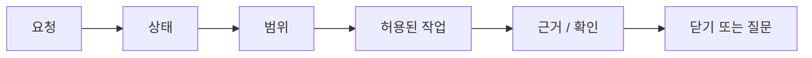

# 사용자 가이드

## 이 문서로 할 수 있는 일

AI와 함께 작업할 때 Harness를 쓰되, 대화가 작업 관리 시스템처럼 무거워지지 않게 하는 방법을 설명합니다.

Harness는 범위, 근거, 확인, 결정, QA, 남은 위험, 종료 상태를 보이게 해줍니다. 그래도 사용자는 평소처럼 말하면 됩니다. 대부분의 세션은 짧은 대화처럼 흘러야 합니다.

```text
이 작업 하네스 기준으로 진행해.
```

Agent가 이 말을 필요한 Harness 절차로 바꿔야 합니다. 사용자가 내부 기록을 직접 조작할 필요는 없습니다.

Harness의 깊은 용어는 실제로 멈춘 이유, 경계, 닫기 조건을 설명할 때만 쓰면 됩니다.

## 이런 때 읽기

AI와 함께 하는 작업 하나를 Harness 기준으로 진행하고 싶을 때 읽습니다.

## 읽기 전에

[하나의 작업으로 보는 Harness](../learn/harness-in-one-task.md)를 먼저 보면 도움이 되지만, 필수는 아닙니다.

## 핵심 생각

사용자는 평소처럼 말하면 됩니다. Agent가 그 요청을 알맞은 Harness 흐름으로 바꿔야 합니다.

## 5분 시작 경로

한 문장으로 시작합니다.

```text
이 작업 하네스 기준으로 진행해.
```

Agent는 먼저 세 가지 쉬운 질문에 답해야 합니다.

- 범위가 무엇이고, 범위 밖은 무엇인가?
- 이미 있는 근거나 확인은 무엇이고, 아직 부족한 것은 무엇인가?
- 지금 사용자가 판단해야 할 것이 있는가?

작고 명확한 일은 `direct`로 가볍게 처리할 수 있습니다. 크거나 위험하거나 여러 파일에 걸치거나 요구가 흐린 일은 변경하기 전에 먼저 범위를 잡아야 합니다.

막혔을 때는 이렇게 묻습니다.

```text
지금 무엇 때문에 막혀 있고, 어떤 결정 하나나 확인 하나가 있으면 풀릴까?
```

닫기 직전에는 이렇게 묻습니다.

```text
수용하기 전에 닫기에 영향을 주는 잔여 위험을 보여줘.
```

## Agent가 먼저 보여줘야 할 것

시작할 때나 중요한 작업을 이어갈 때는 agent가 짧은 상태나 Journey Card를 먼저 보여줘야 합니다. 빠르게 훑을 수 있으면서도 다음 행동을 정할 만큼 구체적이어야 합니다.

```text
작업: 이메일 로그인 흐름 추가
모드: work
다음 행동: 로그인 실패 UX 결정
범위: 로그인 폼, 로그인 API 호출, 세션 저장
범위 밖: 비밀번호 재설정, 계정 생성
필요한 결정: 로그인 실패 메시지
쓰기 권한: 아직 요청하지 않음
근거: 아직 없음
검증: 시작하지 않음
Manual QA: 필요할 가능성 있음
남은 위험: 기록 없음
```

핵심은 다음 안전한 행동입니다. 상태가 오래됐거나 이상해 보이면 이렇게 말합니다.

```text
상태 보여줘.
```

## 세 가지 일상 질문

### 범위

범위는 "무엇을 하고, 무엇은 하지 않는가?"에 답합니다.

좋은 범위는 agent가 실수로 일을 넓히지 않을 만큼 좁고 분명합니다. 영향을 받는 영역, 중요한 제외 사항, 필요한 파일이나 동작 경계를 말해야 합니다.

자주 쓰는 말:

```text
범위와 질문부터 잡아줘.
승인해. 범위는 방금 설명한 내용까지만이야.
이 Task를 현재 Change Unit에 고정하고, Decision Packet 없이 범위를 넓히지 마.
```

### 근거

근거는 "이 일이 끝났다고 말할 수 있는 뒷받침이 무엇인가?"에 답합니다.

근거는 agent가 "했습니다"라고 말하는 것이 아닙니다. 변경된 경로, 테스트 결과, 로그, 스크린샷, QA 기록, 검증 결과처럼 수용 기준을 뒷받침하는 자료입니다.

자주 쓰는 말:

```text
어떤 수용 기준에 근거가 부족한지 보여주고, 어떤 확인을 더 하면 충분한지 제안해줘.
```

### 지금 필요한 판단

지금 필요한 판단은 "안전하게 계속하거나 닫기 전에 사용자가 무엇을 결정해야 하는가?"에 답합니다.

대부분의 판단은 다음 중 하나입니다.

- 제품 방향이나 장단점 선택
- 민감한 단계 승인
- Manual QA가 필요한지, 또는 생략을 받아들일 수 있는지 결정
- 알려진 남은 위험 수용
- 최종 수용이 필요한 작업에서 결과 수용

제품 판단이 진행을 막고 있으면 agent는 Decision Packet을 보여줘야 합니다. 옵션, 장단점, 추천, 불확실성, 미룰 경우의 영향이 있어야 합니다. 이를 막연한 "전부 승인할까요?"로 뭉개면 안 됩니다.

## 문장 모음

일상 작업은 명령어가 아니라 대화로 시작합니다.

```text
이 작업 하네스 기준으로 진행해.
상태 보여줘.
이 작업 이어서 해. 하네스 상태부터 확인해.
이어가기 전에 Journey Card부터 보여줘.
범위와 질문부터 잡아줘.
작은 수정이면 direct로 처리하고, 커지면 work로 전환해.
Decision Packet을 옵션, 추천안, 불확실성까지 보여줘.
제품 장단점 판단에는 product-review lens를 사용해.
필요하면 eng-review, design-review, security-review, qa-review, release-handoff를 사용해.
승인해. 범위는 방금 설명한 내용까지만이야.
detached verify 시작해.
Manual QA가 필요한지 판단해줘.
수용하기 전에 닫기에 영향을 주는 잔여 위험을 보여줘.
최종 수용이 필요하면 닫기 전에 먼저 요청해.
수용해. 이 작업 닫아.
최종 수용이 필요하지 않다면, 해당 막힘이 해소된 뒤 닫아.
```

더 조심해서 진행하고 싶을 때:

```text
이 Task를 현재 Change Unit에 고정해.
Decision Packet에 답할 때까지 쓰기를 멈춰.
현재 guard 수준과 실제로 막을 수 있는 것을 보여줘.
이 변경은 careful mode로 진행해. 범위를 좁히고, 쓰기 전에 쓰기 권한을 보여주고, 제품 장단점 판단 전에는 물어봐.
```

## 기본 흐름

기본 흐름은 짧은 대화처럼 느껴져야 합니다. 사용자는 현재 위치, 다음 안전한 행동, 정말 필요한 결정만 보면 됩니다.



일반적인 흐름:

1. Agent가 상태를 확인하거나 요청 정리를 시작합니다.
2. 요청을 `advisor`, `direct`, `work` 중 하나로 분류합니다.
3. 제품 파일을 쓸 수 있는 경우 범위와 활성 Change Unit을 확인합니다.
4. 제품 판단이 막고 있으면 사용자가 Decision Packet에 답합니다.
5. 제품 파일을 쓰기 전에 쓰기 권한을 확인합니다.
6. 변경이나 조언 뒤에는 필요한 결과와 근거를 기록합니다.
7. 필요하면 닫기 전에 검증, Manual QA, 남은 위험, 최종 수용을 처리합니다.

작은 `direct` 작업은 뒤쪽 확인 중 일부를 건너뛸 수 있습니다. 더 큰 작업은 그런 확인을 숨기지 말고, 필요할 때만 보여줘야 합니다.

## 작업이 막혔을 때

막힘은 "왜 지금 안전하게 계속하거나 닫을 수 없는지"를 구체적으로 설명해야 합니다.

좋은 막힘 표시:

```text
막힘:
- AC-02 근거가 없습니다.
- 바뀐 온보딩 문구에 Manual QA가 필요합니다.
- 빈 상태 동작을 고르기 전에는 제품 결정을 해야 합니다.

가장 작은 해소 방법: Decision Packet에서 빈 상태 동작을 선택하기.
```

자주 쓰는 말:

```text
지금 무엇 때문에 막혀 있어?
어떤 결정 하나나 확인 하나가 있으면 풀릴까?
가장 작은 안전한 다음 행동을 보여줘.
그 결정은 미루고 더 작은 Change Unit을 제안해줘.
```

## 결정, 승인, QA, 수용, 남은 위험

이 단어들은 서로 다른 질문에 답합니다.

| 판단 | 답하는 질문 |
|---|---|
| 결정 | 어떤 제품 방향, 장단점, 생략, 닫기 관련 선택을 할 것인가? |
| 승인 | 이 민감한 행동을 진행해도 되는가? |
| Manual QA | 사람이 봐야 하는 경험 품질을 실제로 확인했는가? |
| 남은 위험 수용 | 알려진 한계, 불확실성, 장단점을 받아들이는가? |
| Acceptance | 작업이 최종 수용을 요구할 때 결과를 받아들이는가? |

승인은 수용이 아닙니다. 확인을 통과했다고 Manual QA가 끝난 것도 아닙니다. 남은 위험을 수용해도 일이 맞게 끝났다는 증거가 되지는 않습니다. 최종 수용이 필요한 경우에는 닫기에 영향을 주는 잔여 위험이 표시되었거나 없다고 보고된 뒤에 따로 요청되어야 합니다.

의존성 추가, 인증이나 권한 변경, 데이터 모델 변경, 공개 API 변경, 파괴적 쓰기, secret 접근, 운영 설정 변경은 승인이 필요할 수 있습니다.

## 닫기 체크리스트

닫기 전에 agent는 다음을 쉬운 말로 분명히 해야 합니다.

- 결과가 합의한 범위와 맞습니다.
- 필요한 근거가 있거나, 이 작업에는 근거가 필요하지 않습니다.
- 검증이 필요 없거나, 통과했거나, 기록된 위험과 함께 명시적으로 면제되었습니다.
- Manual QA가 필요 없거나, 통과/완료되었거나, 타당하게 면제되었습니다.
- 알려진 닫기에 영향을 주는 잔여 위험이 표시되었거나, agent가 `ResidualRiskSummary.status=none`이라고 보고했습니다.
- 최종 수용이 필요한 경우 승인이 아니라 별도 수용으로 요청되었습니다.

닫을 때 쓸 수 있는 말:

```text
닫기 체크리스트를 보여줘.
표시된 잔여 위험을 수용해. 위험 수용으로 닫아.
수용해. 이 작업 닫아.
아직 수용하지 않아. 닫기 전에 UX를 다시 작업해.
```

## 다음에 볼 문서

Agent가 세션을 어떻게 진행해야 하는지는 [Agent 세션 흐름](agent-session-flow.md)을 봅니다.

Harness를 쓰기 전에 전체 그림을 보고 싶다면 [하나의 작업으로 보는 Harness](../learn/harness-in-one-task.md)와 [핵심 개념](../learn/concepts.md)을 봅니다.

자세한 connector 계약, 능력 프로필, schema 참고 문서는 reference 경로가 만들어진 뒤 [참고: Agent Integration](../reference/agent-integration.md)과 관련 reference 문서에서 다룹니다.
