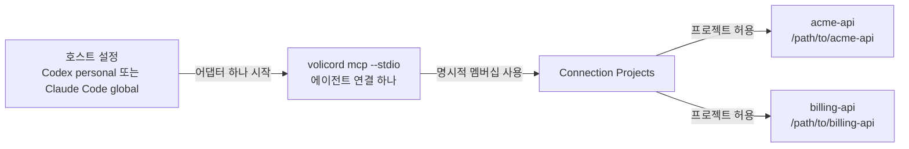

# 여러 저장소 에이전트 설정

하나의 호스트 수준 에이전트 연결이 명시적으로 연결된 둘 이상의
`Product Repository`를 처리해야 할 때 이 가이드를 사용합니다.

이 가이드는 운영자 작업 흐름입니다. 정확한 에이전트 연결, 프로젝트 선택, 전송
동작을 확인하려면 [Agent Connection 참조](../reference/agent-connection.md)와
[MCP 전송](../reference/mcp-transport.md)을 보세요.

이 문서는 Product Repository 하나를 위한 기본 첫 실행 경로가 아닙니다. 일반 첫 실행
설정에는 [에이전트 호스트 설정](agent-host-setup.md)과
`volicord init --host HOST --repo PATH --profile record`를 사용합니다. 탐지 프로필
설정에는 그 문서가 정의한 호스트 훅 및 세션 감시기 설정 전제 조건이 적용됩니다. 여기의
하위 수준 `volicord connection add` 명령은 호스트 수준 또는 `global` 호스트 항목
하나가 명시적으로 허용된 둘 이상의 저장소로 라우팅해야 할 때만 사용합니다.

## 토폴로지

이 토폴로지 지도는 호스트 수준 에이전트 연결을 통해 호스트 항목 하나가
명시적으로 연결된 둘 이상의 Product Repository에 어떻게 닿을 수 있는지 보여 줍니다. 화살표는
설정된 바인딩과 허용된 멤버십 관계를 뜻하며, 요청 실행 순서가 아니고 Runtime Home의
모든 프로젝트에 접근할 수 있음을 뜻하지도 않습니다.



호스트 항목 하나가 에이전트 연결 하나에 대한 `volicord mcp --stdio` 프로세스 하나를
시작합니다. 그 연결은 명시적으로 연결된 Product Repository로만 라우팅할 수 있습니다.
Product Repository 하나를 추가해도 Runtime Home에 등록된 모든 프로젝트 접근을 부여하지 않습니다.

이 토폴로지는 호스트 수준 설정에 맞습니다.

- Codex `personal` 연결: `volicord connection add codex`
- Claude Code `global` 연결: `volicord connection add claude-code --global`

프로젝트 공유 연결과 호스트 로컬 연결은 단일 Product Repository 흐름으로 남습니다.

아래 경로들은 에이전트에게 작업을 요청할 Product Repository의 경로 예시입니다.

## 첫 Product Repository 연결하기

첫 번째 Product Repository를 명시적으로 선택합니다.

```sh
volicord connection add codex --repo /path/to/acme-api
volicord connection status codex --repo /path/to/acme-api
```

Claude Code `global` 설정은 아래처럼 실행합니다.

```sh
volicord connection add claude-code --global --repo /path/to/acme-api
volicord connection status claude-code --global --repo /path/to/acme-api
```

명령은 Git 저장소 루트를 감지하고, 저장소 프로젝트를 등록하거나 재사용하며, 저장소
디렉터리에서 보이는 프로젝트 이름을 파생하고, 내부 레지스트리 식별 정보를 Runtime
Home에 저장합니다.

## 다른 Product Repository 추가하기

두 번째 Product Repository에 같은 호스트와 의도를 적용합니다.

```sh
volicord connection add codex --repo /path/to/billing-api
volicord connection status codex --repo /path/to/billing-api
```

현재 작업 디렉터리가 이미 Product Repository 안에 있을 때도 같은 규칙이 적용됩니다.
`--repo`를 사용하면 멤버십 대상을 모호하지 않게 유지할 수 있습니다.

```sh
volicord connection add codex
volicord connection status codex
```

같은 호스트 수준 대상에 대해 Volicord는 일치하는 에이전트 연결을 재사용하고 선택된
Product Repository를 Connection Projects에 추가합니다. 운영자가 내부 연결 식별
정보를 다룰 필요는 없습니다.

## 연결 확인하기

```sh
volicord connection list
volicord connection verify codex
volicord connection status codex --repo /path/to/acme-api
volicord connection status codex --repo /path/to/billing-api
```

검증 결과가 `action_required`이면 이름 붙은 호스트 소유 신뢰, 승인, 다시 불러오기,
재시작, 설치 프로필 복구 동작을 완료한 뒤 검증을 다시 실행합니다. 증상별 복구는
[에이전트 호스트 문제 해결](agent-host-troubleshooting.md)을 사용합니다.

## 에이전트가 해야 할 일

사용자가 사용 가능한 Product Repository를 물으면 에이전트는
`volicord.list_projects`를 호출합니다. 결과에는 묶인 에이전트 연결에 등록된
프로젝트만 나옵니다.

둘 이상의 프로젝트를 사용할 수 있으면 의도한 저장소에 대해 반환된 정확한
`project_selector`를 사용합니다. 디렉터리 이름, 표시 이름, 현재 작업 디렉터리, MCP
루트, 호스트 라벨, 기억으로 선택자를 만들어 내면 안 됩니다. 프로젝트 선택이
모호하다는 이유로 호출이 거부되면 프로젝트를 나열하고, 의도한 저장소를 고른 뒤,
반환된 선택자로 다시 시도합니다.

정확한 MCP 인자와 생략 규칙은 [MCP 전송](../reference/mcp-transport.md)에 있습니다.

## Product Repository 하나 제거하기

제거할 Product Repository에서 실행합니다.

```sh
cd /path/to/billing-api
volicord connection remove codex --dry-run
volicord connection remove codex
```

또는 Product Repository를 명시적으로 선택합니다.

```sh
volicord connection remove codex --repo /path/to/billing-api --dry-run
volicord connection remove codex --repo /path/to/billing-api
```

Product Repository 하나를 제거하면 해당 Product Repository의 Connection Projects
멤버십이 제거됩니다. `Product Repository`, 프로젝트 등록, 프로젝트 상태, Volicord
`Task`, 증거, `Run` 기록, 증거 첨부 저장소, 관련 없는 호스트 설정은 삭제하지
않습니다. 다른 Product Repository가 연결되어 있으면 호스트 항목도 남습니다. 아무
Product Repository도 남지 않으면 소유권과 안전 점검이 허용할 때 Volicord가 일치하는
관리 호스트 설정을 제거합니다.

## 경계

- 에이전트 연결은 명시적으로 연결된 Product Repository에만 접근합니다.
- 여러 Product Repository가 연결되어 있으면 `volicord.list_projects`가 아닌 공개 MCP
  도구 호출에는 명시적 `project_selector`가 필요합니다.
- `Product Repository`는 제품 파일 경계이며 선택된 공유 호스트 설정을 포함할 수
  있지만 Volicord 권한이 아닙니다.
- 쓰기 티켓은 제안된 제품 파일 쓰기 하나 또는 `sensitive` 통제 아래의 정확한 승인 결속
  비제품 동작 하나를 현재 작업 경계와 정규화된 프로젝트 쓰기 권한에 대조한
  기록입니다. OS 권한, 코드 리뷰 승인, 최종 수락, 효과가 실제로 일어났다는 증명이
  아닙니다.
- 보안 한계와 비보장은 [보안](../reference/security.md)에 있습니다.
