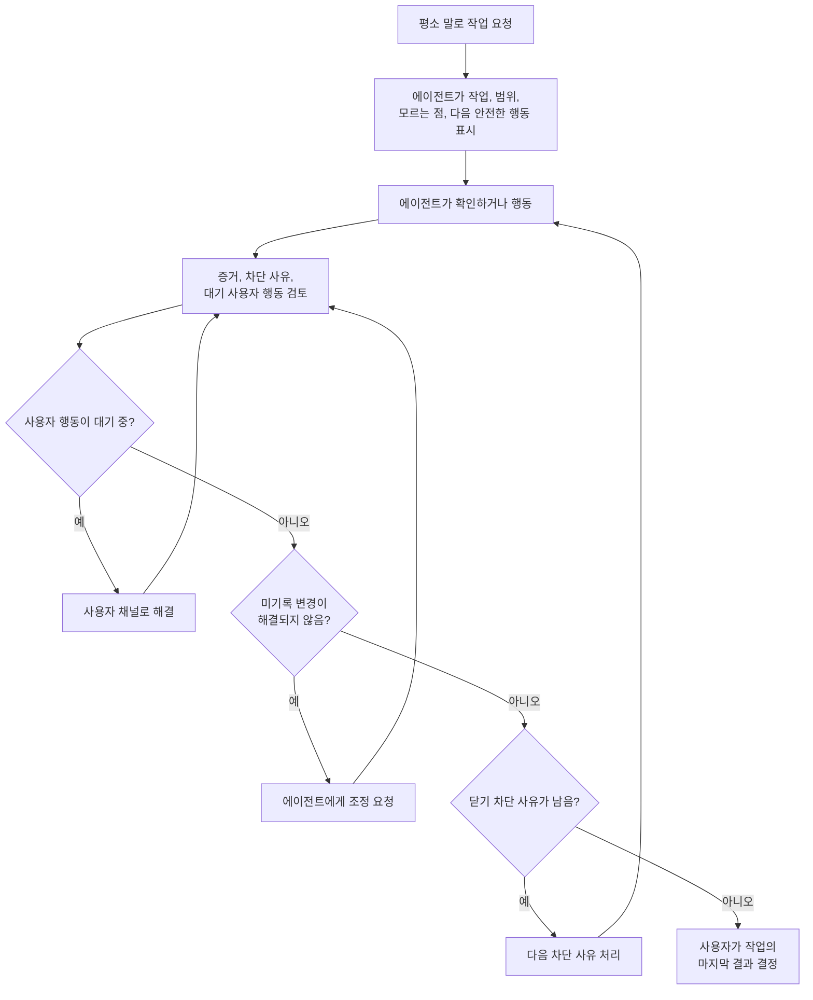

# 사용자 작업 흐름

Volicord를 사용하면 평소 말로 에이전트와 일하면서도 범위, 증거, 사용자 소유 판단,
닫기 상태를 구분할 수 있습니다. 이 문서는 사용자 작업 흐름을 설명합니다. 정확한
계약은 [참조 색인](../reference/README.md)에 있습니다.

## 일상 작업 순서



큰 쓰기 전, 의미 있는 변경 뒤, 닫기 전에는 상태를 묻습니다. 대기 중인 사용자 행동,
미기록 변경, 닫기 차단 사유는 요약의 배경 문구가 아니라 이름 붙은 다음 행동으로
다룹니다.

## 원하는 결과부터 말하기

평소처럼 시작하면 됩니다.

```text
이메일 로그인을 추가해줘. 비밀번호 재설정과 계정 생성은 범위 밖으로 둬.
이 가이드에서는 부정확한 링크만 고쳐줘.
첫 안전한 변경을 시작하는 데 아직 무엇이 막히는지 보여줘.
```

API 이름이나 내부 모드를 알 필요는 없습니다. 원하는 결과, 중요한 범위 밖 항목,
“먼저 물어봐” 제한을 말합니다.

에이전트는 다음을 보여 줘야 합니다.

- 현재 목표, 현재 적용 범위, 범위 밖 항목
- 확인한 사실과 중요한 미확인 사항
- 대기 중인 사용자 소유 행동
- 다음 안전한 행동

넓은 도움 요청은 범위 확장, 관련 없는 파일 쓰기, 제품 동작 추론, 최종 수락 추론을
허용하지 않습니다.

## 범위를 최신으로 유지하기

목표, 범위 밖 항목, 허용 경로, 검증 기준, 현재 작업 조각이 바뀌면 평이하게 말합니다.
에이전트는 오래된 상태나 쓰기 승인에 기대기 전에 보이는 경계를 새로고침해야 합니다.

사용자는 작업을 넓힐지, 줄일지, 보류할지, 취소할지, 다른 작업으로 대체할지
결정합니다. 새 의존성, 서비스, 공개 동작, 마이그레이션, 경로가 범위 안인지도
결정합니다. 확장 자체가 분명하지 않다면 “좋아” 같은 말은 범위를 넓히지 않습니다.

## 유용한 상태 요청하기

언제든 이렇게 물을 수 있습니다.

```text
무엇을 알고 있고, 무엇이 막혀 있고, 다음에 안전하게 할 수 있는 일은 뭐야?
```

유용한 답변에는 다음이 들어갑니다.

- 현재 작업 경계와 현재 적용 범위
- 확인한 사실과 중요한 미확인 사항
- 가장 중요한 차단 사유
- 대기 중인 사용자 행동이나 승인
- 관련 증거와 그 한계
- 보이는 잔여 위험
- 다음 안전한 행동 하나

에이전트는 확인한 사실과 사용자 판단을 섞거나, 안전하게 확인할 수 있는 사실을 다시
물어보거나, 오래된 상태를 현재 상태처럼 보여 주거나, 테스트 통과를 최종 수락처럼
다루면 안 됩니다.

## 사용자에게 속한 판단 알기

사용자 소유 판단에는 다음이 포함됩니다.

- 제품 동작, 사용자 흐름, 문구, 접근성 절충
- 중요한 기술 방향, 새 의존성, 외부 서비스
- 범위 변경과 검증 기준
- 보안, 개인정보, 인증, 보관, 호환성 선택
- 민감 동작 승인
- 최종 수락, 잔여 위험 수락, 취소, 대체

에이전트는 관련 사실을 확인한 뒤 좁은 선택지를 추천할 수 있습니다. 사용자 답변이
확정하는 것과 아직 열린 항목을 말해야 합니다. 여러 판단을 하나의 포괄 승인으로
합치면 안 됩니다.

구체적인 예시는 [판단 예시](judgment-examples.md)를 보세요. 정확한 권한 경계는
[Core 모델](../reference/core-model.md)에 있습니다.

<a id="record-a-core-user-judgment"></a>
## 사용자 판단 기록하기

판단이 Volicord 상태가 되어야 하면 CLI inbox를 사용합니다.

안정적인 수동 경로는 다음과 같습니다.

```sh cli-example
volicord inbox --repo "<repo>"
volicord inbox resolve USER_ACTION_REQUEST_ID --choice CHOICE_ID --repo "<repo>"
```

대기 판단에 표시된 선택지만 고릅니다. 답변 하나는 그 판단 하나만 해결합니다. 정확한
질문과 선택지는 `volicord inbox`에 나타납니다. 에이전트 대상 MCP 연결은 로컬 사용자
채널로 동작하거나 사용자를 대신해 행동을 해결할 수 없습니다.

정확한 명령 동작은 [관리 CLI](../reference/admin-cli.md#user-channel-commands)에
있습니다. 지원되는 CLI inbox 전달 경계는
[Agent Connection 참조](../reference/agent-connection.md#supported-surface)를 보세요.

## 쓰기 승인과 쓰기 티켓 구분하기

일반 쓰기 승인은 이름 붙은 쓰기에 대한 사용자의 제한된 허용입니다. 쓰기 티켓은
제안된 제품 파일 변경 하나를 현재 작업 경계와 정규화된 프로젝트 쓰기 권한에 대조한
별도 Volicord 기록입니다.

쓰기를 승인할 때는 관련 경로, 명령, 의존성 변경, 호스트, 외부 동작을 이름 붙입니다.
의존성 설치, 배포, 비밀값 접근, 파괴적 명령은 필요할 때 별도 민감 동작 판단으로
다룹니다.

프로젝트 정책이 이 쓰기 권한을 바꾸면 이전의 호환되지 않는 활성 티켓은 새 경계를 넘을
수 없습니다. 제안된 쓰기는 현재 정책으로 다시 평가되며 `sensitive` 통제나 새 민감
동작 승인이 필요할 수 있습니다. 정규화된 쓰기 권한이 같은 정책을 적용했다는 이유만으로
호환 티켓을 무효화하지는 않습니다.

쓰기 승인과 쓰기 티켓은 전체 계획 승인, 최종 수락, 잔여 위험 수락, OS 권한,
쓰기가 실제로 일어났다는 증명이 아닙니다. 쓰기 뒤 최종 수락은 쓰기 전에 필요했던
승인을 대신할 수 없습니다.

<a id="use-evidence-without-replacing-judgment"></a>
## 증거를 판단 대신 쓰지 않기

의미 있는 작업 뒤에는 에이전트가 무엇이 일어났고 어떤 증거가 각 주요 주장을
뒷받침하는지 보여 줘야 합니다. 실패한 것, 오래된 것, 아직 뒷받침되지 않은 주장도
이름 붙여야 합니다.

증거는 사용자 판단이 아닙니다. 테스트 통과, 화면 캡처, 로그 경로, 첨부, 생성 요약은
실제로 보여 주는 주장만 뒷받침합니다. 근거가 부족하면 증거를 더 요구하거나 주장을
좁힙니다. 에이전트에게 비밀값, 토큰, 전체 민감 로그를 노출하게 하면 안 됩니다.

Volicord는 저장된 수락 기준 또는 보충 주장 하나에 대해 집중된 Evidence 관찰 기록을
요청할 수 있습니다. CLI inbox에 표시된 저장 대상 후보와 아티팩트 후보만 선택합니다.

```sh cli-example
volicord inbox --repo "<repo>"
volicord inbox resolve USER_ACTION_REQUEST_ID \
  --criterion CRITERION_ID \
  --artifact ARTIFACT_ID \
  --summary "선택한 아티팩트가 보여 주는 내용" \
  --repo "<repo>"
```

표시된 대상이 보충 주장이면 `--criterion CRITERION_ID` 대신
`--claim CLAIM_ID`를 사용합니다. 표시된 아티팩트를 더 선택하려면
`--artifact ARTIFACT_ID`를 반복하고, 관찰이 대상을 반박하면 `--contradicted`를
추가합니다.

이 명령은 사용자 소유 관찰 하나를 기록할 뿐 증거 충분성, 최종 수락, 닫기 준비 상태를
그 자체로 증명하지 않습니다. 자유 형식 summary는 User Channel resolution에 비공개로
남고 에이전트용 상태 보기에는 안전한 선택 식별자와 파생 ref만 나타납니다.

정확한 증거 의미는 [Core 모델](../reference/core-model.md)에 있습니다.

## 미기록 변경 조정하기

탐지 프로필은 기록된 작업과 맞지 않는 Product Repository 변경을 보고할 수
있습니다. 이를 악의적 동작이나 파일을 바꾼 사람의 증명으로 보지 말고 미기록 변경으로
다룹니다.

사용할 수 있으면 에이전트에게 `volicord.reconcile_changes`를 실행하게 합니다. CLI
복구 경로는 `volicord changes reconcile`입니다. 조정에 사용자 수락이 필요하면
지원되는 사용자 채널로 답합니다. 미해결 미기록 변경은 닫기 차단 사유로 남습니다.

정확한 조정 동작은
[미기록 변경 조정](../reference/api/method-reconcile-changes.md)에 있습니다.

## 닫기 상태 검토하기

큰 작업을 끝났다고 보기 전에는 이렇게 묻습니다.

```text
무엇이 바뀌었고, 무엇을 확인했으며, 어떤 잔여 위험이 보이고, 아직 무엇이 닫기를 막는지 보여줘.
```

다음 사실을 서로 나누어 확인합니다.

- 현재 적용 범위와 결과
- 점검과 증거
- 대기 중인 필수 사용자 행동
- 미해결 미기록 변경
- 보이는 잔여 위험
- 남은 닫기 차단 사유
- 차단 사유를 푸는 다음 행동

최종 수락은 보이는 결과를 받아들이는 판단입니다. 잔여 위험 수락은 이름 붙은 남은
위험 하나를 받아들이는 판단입니다. 어느 판단도 빠진 필수 증거를 채우거나 관련 없는
위험을 수락하지 않습니다.

닫기 상태는 현재 Volicord 기록을 바탕으로 판단을 돕습니다. 정확성, 테스트 충분성,
QA 완료, 배포 성공, 사람 검토 완료, 무위험 완료를 증명하지 않습니다. 정확한 닫기
의미는 [Core 모델](../reference/core-model.md), 정확한 메서드 동작은
[`Task` 닫기](../reference/api/method-close-task.md)에 있습니다.

## 참조 경로

| 필요 | 참조 문서 |
|---|---|
| 지원되는 범위와 지원 범위 밖 항목 | [범위](../reference/scope.md) |
| 사용자 판단, 증거, 쓰기 티켓, 닫기 상태 | [Core 모델](../reference/core-model.md) |
| 보안 보장과 한계 | [보안](../reference/security.md) |
| 에이전트 연결과 사용자 채널 | [Agent Connection 참조](../reference/agent-connection.md) |
| 공개 API 메서드와 스키마 | [참조 색인](../reference/README.md) |

에이전트 쪽 절차는 [에이전트 가이드](agent-workflow.md)를 이어서 봅니다.
